# M6 — PHYSICAL LOGISTICS: THIẾT KẾ KHO & ĐỘNG LỰC HỌC

> **Trạng thái:** ✅ Mô-đun hoàn thành đủ 6 cụm. 6.1 Lưu trình ✅ · 6.2 Layout/Thiết bị ✅ · 6.3 Quản trị vận hành (6.3.1–6.3.3) ✅ · 6.4 Dòng đặc thù & ngược (6.4.1–6.4.3) ✅ · 6.5 Tối ưu LP ✅ · 6.6 Kho xanh ✅. **Lăng kính trọng tâm:** 🛠️ Thực thi + 📐 Toán
>
> **Trình tự đọc:** Vận hành lõi (6.1–6.2) → Quản trị vận hành (6.3) → Dòng đặc thù & ngược (6.4) → Tối ưu LP (6.5) → Kho xanh (6.6).
> **Nguồn lõi:** Richards *Warehouse Management* (lõi) · Rushton Part 4 · Toolkit (01) · Liu ch.7
> [⬅ Về Mục lục](00-MUC-LUC.md)

---

## 📖 Bảng tra từ viết tắt (đọc trước khi vào chương)

> **Cách dùng:** chương này dùng dày các từ viết tắt theo chuẩn quốc tế; mỗi từ được giải thích đầy đủ ở lần xuất hiện đầu, sau đó tái dùng ở dạng viết tắt. Khi gặp một từ lạ giữa chừng, tra nhanh bảng này thay vì phải lần ngược về chỗ định nghĩa. Bảng gom theo nhóm chủ đề để dễ định vị.

**① Vận hành & dòng chảy kho**

| Viết tắt | Tiếng Anh đầy đủ | Nghĩa gọn trong chương |
|---|---|---|
| SKU | Stock Keeping Unit | Đơn vị tồn kho — một mã hàng phân biệt |
| VAS | Value-Added Services | Dịch vụ gia tăng (dán nhãn, đóng gói lại, kitting) tại kho |
| QA / QC | Quality Assurance / Control | Đảm bảo / kiểm tra chất lượng |
| FIFO / LIFO | First-In-First-Out / Last-In-First-Out | Xuất hàng theo thứ tự nhập trước / nhập sau ra trước |
| TiHi | Tie × High | Số thùng mỗi lớp (tie) × số lớp trên pallet (high) |
| ISO 6780 | — | Chuẩn quốc tế quy định 6 cỡ pallet |
| IBC | Intermediate Bulk Container | Thùng chứa khối trung gian cho chất lỏng 1–2 tấn |
| VNA | Very Narrow Aisle | Lối đi rất hẹp (cho xe nâng chuyên dụng) |
| MHE | Materials Handling Equipment | Thiết bị xếp dỡ vật liệu (xe nâng, băng tải…) |
| HLOP / LLOP | High- / Low-Level Order Picker | Xe nhặt hàng trên cao (nâng người) / tầm thấp |
| VLM | Vertical Lift Module | Mô-đun nâng dọc — tủ lưu tự động mang khay ra cho người nhặt |

**② Hệ thống thông tin & tự động hóa**

| Viết tắt | Tiếng Anh đầy đủ | Nghĩa gọn trong chương |
|---|---|---|
| WMS | Warehouse Management System | Hệ thống quản lý kho |
| ASN | Advance Shipping Notice | Thông báo giao hàng trước (NCC báo trước nội dung lô) |
| RF / RFID | Radio Frequency (Identification) | Thiết bị/nhãn nhận dạng bằng sóng vô tuyến |
| RDT | Radio Data Terminal | Máy cầm tay thu phát dữ liệu qua sóng RF (quét mã, nhận lệnh) |
| AS/RS | Automated Storage & Retrieval System | Hệ lưu trữ & truy xuất tự động |
| AMR / AGV | Autonomous Mobile Robot / Automated Guided Vehicle | Robot di động tự hành / xe dẫn đường tự động |
| G2P | Goods-to-Person | Hàng tự đến người nhặt (ngược với người đi tới hàng) |
| RaaS | Robot-as-a-Service | Thuê robot theo dịch vụ thay vì mua đứt |

**③ Tồn kho, hoạch định & chỉ số dòng chảy**

| Viết tắt | Tiếng Anh đầy đủ | Nghĩa gọn trong chương |
|---|---|---|
| IRA | Inventory Record Accuracy | Độ chính xác bản ghi tồn kho |
| EOQ | Economic Order Quantity | Lượng đặt hàng kinh tế |
| S&OP | Sales & Operations Planning | Hoạch định bán hàng & vận hành |
| MPS / MPC | Master Production Schedule / Manufacturing Planning & Control | Lịch sản xuất tổng / Hoạch định & kiểm soát sản xuất |
| DRP | Distribution Requirements Planning | Hoạch định nhu cầu phân phối |
| DOS | Days of Supply | Số ngày cung ứng (tồn kho đủ bán bao nhiêu ngày) |
| DIO | Days Inventory Outstanding | Số ngày tồn kho bình quân (= 365 ÷ vòng quay) |
| C2C | Cash-to-Cash (cycle) | Chu kỳ tiền-ra-tiền-về |
| JIT | Just-In-Time | Đúng lúc — tồn kho tối thiểu, kéo theo cầu |
| WIP | Work-In-Process | Hàng đang nằm trong hệ thống / bán thành phẩm |

**④ Đo lường & quản trị**

| Viết tắt | Tiếng Anh đầy đủ | Nghĩa gọn trong chương |
|---|---|---|
| KPI | Key Performance Indicator | Chỉ số hiệu năng then chốt |
| OTIF | On-Time-In-Full | Giao đúng hẹn & đủ hàng |
| UPH | Units Per Hour | Sản lượng mỗi giờ công |
| ROI | Return on Investment | Suất sinh lời trên vốn đầu tư |
| CAGR | Compound Annual Growth Rate | Tốc độ tăng trưởng kép hằng năm |
| BoL / C/O | Bill of Lading / Certificate of Origin | Vận đơn / Giấy chứng nhận xuất xứ |
| 5S | Sort-Set-Shine-Standardize-Sustain | Phương pháp tổ chức nơi làm việc (Lean) |
| PDCA | Plan-Do-Check-Act | Vòng cải tiến liên tục |
| RCM / TPM | Reliability-Centered / Total Productive Maintenance | Bảo trì hướng độ tin cậy / bảo trì năng suất toàn diện |
| PCCC | — (tiếng Việt) | Phòng cháy chữa cháy |

**⑤ Toán tối ưu & vận trù học (OR)**

| Viết tắt | Tiếng Anh đầy đủ | Nghĩa gọn trong chương |
|---|---|---|
| OR | Operations Research | Vận trù học |
| LP / ILP / MILP | (Mixed-Integer) Linear Programming | Quy hoạch tuyến tính / nguyên / nguyên hỗn hợp |
| COI | Cube-per-Order Index | Chỉ số khối-trên-đơn để xếp slot |
| SLAP | Storage Location Assignment Problem | Bài toán gán vị trí lưu |
| QAP | Quadratic Assignment Problem | Bài toán gán bậc hai |
| TSP / VRP | Travelling Salesman / Vehicle Routing Problem | Bài toán người bán hàng / định tuyến phương tiện |
| MTM | Methods-Time Measurement | Hệ định mức lao động theo thao tác chuẩn |
| M/M/c | — (ký hiệu Kendall) | Mô hình hàng đợi c kênh phục vụ |

**⑥ Hàng hoàn & hậu cần ngược**

| Viết tắt | Tiếng Anh đầy đủ | Nghĩa gọn trong chương |
|---|---|---|
| RMA | Return Merchandise Authorization | Phiếu cấp phép trả hàng — không có thì không nhận |
| EMV | Expected Monetary Value | Giá trị tiền tệ kỳ vọng (kỳ vọng có trọng số xác suất) |
| MVT | Marginal Value of Time | Giá trị cận biên của thời gian (mỗi ngày chậm = mất giá trị) |
| WEEE | Waste Electrical & Electronic Equipment (Directive) | Chỉ thị EU về thu hồi/tái chế thiết bị điện–điện tử |
| EPR | Extended Producer Responsibility | Trách nhiệm mở rộng của nhà sản xuất (thu hồi bao bì/sản phẩm) |
| CLSC | Closed-Loop Supply Chain | Chuỗi cung ứng vòng kín (gộp cả dòng xuôi và ngược) |
| NRF | National Retail Federation | Liên đoàn Bán lẻ Quốc gia (Mỹ) — nguồn số liệu returns |

**⑦ Lưu trữ đặc thù (chuỗi lạnh · hazmat · an ninh · ngoại quan)**

| Viết tắt | Tiếng Anh đầy đủ | Nghĩa gọn trong chương |
|---|---|---|
| MKT | Mean Kinetic Temperature | Nhiệt độ động học trung bình — một số đại diện stress nhiệt của cả chuỗi log (Haynes 1971) |
| Q10 | Temperature coefficient (van't Hoff) | Hệ số nhân tốc độ hỏng khi tăng 10°C (Q10=2 ⇒ tuổi thọ giảm nửa) |
| $E_a$ | Activation energy (Arrhenius) | Năng lượng hoạt hóa — "rào" phản ứng phải vượt; quyết độ dốc suy giảm theo nhiệt |
| HACCP | Hazard Analysis & Critical Control Points | Phân tích mối nguy & điểm kiểm soát tới hạn (an toàn thực phẩm) |
| GWP / ODS | Global Warming Potential / Ozone-Depleting Substance | Tiềm năng nóng lên toàn cầu / chất phá tầng ozone (chất làm lạnh) |
| SDS | Safety Data Sheet | Phiếu an toàn hóa chất (mối nguy, xử lý tràn, sơ cứu) |
| CLP / GHS | Classification, Labelling & Packaging / Globally Harmonized System | Hệ phân loại–dán nhãn hóa chất quốc tế |
| IMDG | International Maritime Dangerous Goods (Code) | Bộ luật hàng nguy hiểm vận tải biển — chứa ma trận tương kỵ |
| COSHH / COMAH | Control of Substances Hazardous to Health / Control of Major Accident Hazards | Khung pháp lý Anh: kiểm soát chất nguy hại / ngưỡng tồn trữ rủi ro lớn (Seveso) |
| $\chi(G)$ | Chromatic number | Sắc số đồ thị = số khu cách ly tối thiểu |
| AEO | Authorized Economic Operator | Địa vị "nhà kinh tế tin cậy" — điều kiện vận hành kho ngoại quan |
| C-TPAT / CSI / AMR | Customs–Trade Partnership against Terrorism / Container Security Initiative / Advanced Manifest Regulations | Các sáng kiến an ninh chuỗi cung ứng (Mỹ, sau 11/9) |
| VAT | Value-Added Tax | Thuế giá trị gia tăng (treo cùng thuế nhập trong kho ngoại quan) |
| PPE | Personal Protective Equipment | Trang bị bảo hộ cá nhân |
| CCTV | Closed-Circuit Television | Camera giám sát an ninh |

**⑧ Đóng gói cuối dòng & sân bãi (despatch · packing · yard)**

| Viết tắt | Tiếng Anh đầy đủ | Nghĩa gọn trong chương |
|---|---|---|
| LPN | License Plate Number | "Biển số" pallet/thùng — mã định danh đơn vị tải |
| DIM weight | Dimensional (volumetric) weight | Trọng lượng quy đổi từ thể tích — cơ sở tính cước hàng nhẹ-cồng kềnh |
| BPP / 3D-BPP | (3-Dimensional) Bin Packing Problem | Bài toán xếp thùng (3 chiều) — lõi của cartonization |
| FFD | First-Fit Decreasing | Heuristic xếp thùng: sắp giảm dần rồi nhét vào thùng đầu tiên còn chỗ |
| YMS | Yard Management System | Hệ quản lý sân bãi — điều phối trailer, gate, cross-dock |
| TAS | Truck Appointment System | Hệ đặt lịch hẹn xe — rải nhịp đến, giảm tắc cổng |

**⑨ An toàn, PCCC & bảo trì MHE (safety · fire · maintenance)**

| Viết tắt | Tiếng Anh đầy đủ | Nghĩa gọn trong chương |
|---|---|---|
| HSE / NIOSH | Health & Safety Executive / National Institute for Occupational Safety & Health | Cơ quan an toàn lao động Anh / Mỹ (nguồn số liệu & chuẩn) |
| TILE | Task–Individual–Load–Environment | Khung 4 yếu tố đánh giá rủi ro nâng hàng thủ công |
| SEMA | Storage Equipment Manufacturers' Association | Hiệp hội chuẩn kiểm định racking (hệ đèn xanh–vàng–đỏ) |
| SWL | Safe Working Load | Tải trọng làm việc an toàn (biển ở đầu dãy racking) |
| PUWER / LOLER | Provision & Use of Work Equipment / Lifting Operations & Lifting Equipment Regulations | Quy định Anh về dùng thiết bị & thiết bị nâng |
| BBS / HRO | Behaviour-Based Safety / High Reliability Organization | Trường phái sửa hành vi / tổ chức độ tin cậy cao |
| NFPA / ESFR | National Fire Protection Association / Early Suppression Fast Response | Chuẩn PCCC Mỹ / đầu phun sprinkler dập sớm phản ứng nhanh |
| TBM / CBM / RTF | Time-Based / Condition-Based Maintenance / Run-To-Failure | Bảo trì theo lịch / theo tình trạng / chạy tới hỏng |
| FMEA | Failure Mode & Effects Analysis | Phân tích kiểu hỏng & tác động (nền của RCM) |
| OEE | Overall Equipment Effectiveness | Hiệu suất thiết bị tổng = Availability × Performance × Quality |
| MTBF / MTTR / MTTF | Mean Time Between Failures / To Repair / To Failure | Thời gian trung bình giữa hỏng / sửa / tới hỏng |
| TRIR | Total Recordable Incidence Rate | Tỷ lệ sự cố ghi nhận chuẩn hóa/100 lao động-năm (OSHA) |
| β / η | Weibull shape / scale | Tham số hình dạng (β>1 ⇒ hao mòn) / tỷ lệ của phân phối Weibull |

> **Các bên & chuẩn khác:** **NCC** = nhà cung cấp · **3PL** = nhà cung cấp dịch vụ logistics bên thứ ba · **CMM** = Capability Maturity Model (mô hình trưởng thành năng lực). Ký hiệu toán dùng xuyên chương: **λ** (lambda) = tốc độ dòng/đến · **W** = thời gian lưu (flow time) · **ρ** (rho) = hệ số sử dụng (utilization) · **σ** (sigma) = độ lệch chuẩn.

---

## 6.1. Lưu trình Vận hành Kho & Tối ưu hóa Không gian ✅

### 6.1.1. Động lực học Dòng chảy kho (Receiving → Put-away → Storage → Picking → Despatch) ✅

> **Nguyên tắc biên soạn & quy ước trình bày:**
> - **Nền chính = 19 sách** (Richards *Warehouse Management* ch.1,3,7,13; Rushton/Croucher/Baker *Handbook of Logistics & Distribution* ch.15,19; Arnold *Introduction to Materials Management* ch.12; Richards & Grinsted *Toolkit* 1.x).
> - **Lớp học thuật toàn cầu:** khung lý thuyết chuẩn quốc tế ở cấp sau-đại học — **vật lý dòng chảy** (Little 1961), **mô hình chất lỏng của kho** (Bartholdi & Hackman, *Warehouse & Distribution Science*), **taxonomy & review order-picking** (de Koster, Le-Duc & Roodbergen 2007, *EJOR*), **review nghiên cứu vận hành kho** (Gu, Goetschalckx & McGinnis 2007), **lý thuyết hàng đợi cho bến** (M/M/c). Đây là tầng *vì sao toán học* nằm dưới mọi SOP.
> - **Lý thuyết viết dày, giọng giáo trình** — mỗi khái niệm mở bằng văn xuôi *định nghĩa → bản chất → vì sao → cơ chế → hệ quả*, bảng/bullet chỉ tóm tắt **sau** khi đã diễn giải.
> - **Code Python tĩnh, dò tay được** — mọi con số khớp ví dụ tính tay; đã verify bằng máy.
> - **Deep research (web) chỉ BỔ SUNG**, đặt trong khối 🌐, có trích dẫn inline; không thay nội dung sách.

---

#### 📌 Bốn lăng kính trong mục 6.1.1

> Mức nhấn **tùy chủ đề** — không nhất thiết đều. Mục này lấy **Thực thi**, **Toán & Data** và **Chiến lược** làm trọng tâm; **Hoạch định** ở mức bổ trợ.

| Lăng kính | Mức nhấn | Thể hiện ở đâu trong mục này |
|---|---|---|
| 🛠️ **Thực thi** | ●●● Trọng tâm | §c–§i — SOP tiền tiếp nhận, nhận hàng, giao dịch 4 bước, put-away, bổ sung, picking, xuất; flowchart |
| 📐💻 **Toán & Data** | ●●● Trọng tâm | §"Góc Toán" + §b (Little's Law, fluid model + điều kiện hiệu lực) + §d (**Lab M/M/c giải số + Erlang C/Kingman**) + §e (cube, assignment) + §f (IRA, cycle counting) + §l (stock turn) + §n (Lab nền dò tay) |
| 🎯 **Chiến lược** | ●●● Trọng tâm | §a — kho = lợi thế cạnh tranh, lý thuyết **time/place utility**, decoupling, postponement, risk pooling, mô hình trưởng thành 4 phase |
| 🧭 **Hoạch định** | ●● Bổ trợ | §"Góc Hoạch định" — kho là nút thực thi DRP/MPS; hoạch định công suất–lao động–không gian |

> [!IMPORTANT] 💡 INSIGHT — Vì sao "vật lý dòng chảy" là xương sống
> Mô tả *các bước* của dòng chảy (nhận → cất → nhặt → xuất) là chưa đủ; câu hỏi sâu hơn ở cấp thạc sĩ là: *điều gì chi phối tốc độ và tồn đọng của dòng chảy đó?* Câu trả lời là **ba định luật bất biến** — Little's Law (quan hệ WIP–throughput–thời gian lưu), nguyên lý nút cổ chai (throughput hệ thống bị chặn bởi công đoạn chậm nhất), và mô hình chất lỏng của Bartholdi–Hackman (xem kho như dòng "chất lỏng" SKU chảy qua các "bể" lưu trữ). Ba định luật này đúng cho **mọi** kho — thủ công hay dark warehouse — nên chúng là nền để chẩn đoán bất kỳ hệ thống nào trước khi bàn SOP hay công nghệ.

---

#### a. Bản chất, lý do tồn tại và mức trưởng thành của kho

##### a.1 — Kho tạo *giá trị* gì? Lý thuyết tiện ích thời gian & địa điểm

Trong kinh tế học logistics, một sản phẩm chỉ có giá trị đầy đủ với khách hàng khi nó **đúng dạng (form), đúng nơi (place), đúng lúc (time) và đúng quyền sở hữu (possession)** — bốn loại *tiện ích kinh tế* (economic utility). Sản xuất tạo *form utility*; marketing/bán hàng tạo *possession utility*. **Kho và vận tải là hai cỗ máy tạo *time utility* và *place utility*** — chúng không biến đổi bản chất vật lý của hàng, nhưng *dịch chuyển hàng trong không gian và "giữ" hàng băng qua thời gian* cho tới đúng khoảnh khắc khách cần. Đây là lý do nền tảng nhất giải thích vì sao kho tồn tại: **kho là thiết bị điều hòa *thời gian* giữa nhịp cung và nhịp cầu**, còn vận tải điều hòa *không gian*.

Hiểu được điều này thì mệnh đề "kho không còn là trung tâm chi phí mà là mắt xích tạo lợi thế cạnh tranh" (Richards ch.1) không còn là khẩu hiệu: kho *tạo ra giá trị tiện ích* mà khách sẵn lòng trả tiền (giao nhanh, đúng hẹn, đúng hàng) — hiện thực hóa **đơn hàng hoàn hảo theo 7Rs** ([M1 §1.1.1](01-chien-luoc-rui-ro.md)). Mục tiêu của vận hành kho vì thế luôn là **bài toán kép, mâu thuẫn nội tại**: *tối thiểu hóa chi phí* đồng thời *tối đa hóa mức phục vụ*. Hai mục tiêu này kéo ngược nhau. Toàn bộ nghệ thuật quản trị kho là tìm điểm cân bằng trên đường đánh đổi đó (§k, đường cong chi phí–dịch vụ).

Bốn việc cốt lõi mà mọi kho phải làm, dù quy mô nào (Arnold ch.12):

- **Phục vụ khách kịp thời** — cấp hàng trong khung thời gian khách chấp nhận.
- **Định vị hàng để tìm thấy nhanh & đúng** — vấn đề *thông tin & bố trí*, không chỉ vấn đề không gian.
- **Tối thiểu hóa công sức (chi phí) di chuyển hàng** vào/ra — vì *vận động* là thứ tốn tiền, không phải *lưu giữ*.
- **Cung cấp liên kết thông tin** với khách — kho là một nút dữ liệu, không chỉ nút vật lý.

> [!IMPORTANT] 💡 INSIGHT — "Lưu giữ" không tốn tiền, "vận động" mới tốn tiền
> Một nhận định nền tảng ở cấp thạc sĩ: phần lớn chi phí vận hành kho **không** nằm ở việc hàng *nằm yên* trên kệ (đó chủ yếu là chi phí vốn & không gian), mà nằm ở việc hàng *bị chạm vào và di chuyển* — nhận, cất, bổ sung, nhặt, đóng, xuất. Đây là lý do mọi best practice kho đều quy về **giảm số lần chạm (touches) và giảm quãng đường di chuyển**: cross-dock (cắt 3 lần chạm), task interleaving (ghép hành trình rỗng), slotting (rút ngắn quãng nhặt), goods-to-person (xóa quãng đi bộ). Nếu bạn chỉ được nhớ một nguyên lý thiết kế kho, hãy nhớ: **mỗi lần chạm là một lần tốn tiền và một lần có cơ hội sai sót** — tối ưu kho ≈ tối thiểu hóa số touch có trọng số quãng đường.

> [!IMPORTANT] 💡 INSIGHT — "Kho tạo giá trị gì": ba trường phái, ba câu trả lời khác nhau
> Câu hỏi tưởng đơn giản "kho để làm gì" thực ra có **ít nhất ba lời đáp từ ba truyền thống học thuật khác nhau** — và chọn lời đáp nào sẽ quyết định bạn *tối ưu cái gì*:
> 1. **Phái kinh tế tiện ích (utility economics):** kho tạo **time/place utility** — giá trị nằm ở việc *điều hòa lệch pha cung–cầu theo thời gian*. Hệ quả: tối ưu = đặt đúng lượng tồn ở đúng điểm tách.
> 2. **Phái vận trù–vận hành (OR, Bartholdi–Hackman, de Koster):** kho là một **hệ xử lý vật liệu** mà giá trị = *làm dòng chảy với chi phí chạm/quãng đường tối thiểu*. Hệ quả: tối ưu = slotting, routing, batching — đúng nội dung 6.1.2–6.1.3.
> 3. **Phái năng lực chiến lược (Stalk, Evans & Shulman 1992, HBR):** kho là một **mắt xích trong một năng lực tổ chức xuyên-chức năng** (như cross-docking của Walmart, [§6.1.4.b](#614-cross-docking-chuyên-sâu)); giá trị *không nằm trong bốn bức tường kho* mà ở chỗ nó cho phép cả chuỗi chạy nhanh hơn đối thủ. Hệ quả: tối ưu = tích hợp NCC–IT–vận tải, thứ *không mua được rời*.
> **Căng thẳng giữa ba phái là có thật, không phải học thuật suông:** phái OR sẽ khuyên cắt chi phí chạm trong kho; phái chiến lược có thể khuyên *tăng* chi phí kho (vd ôm thêm hàng VAS, giữ năng lực dư) nếu điều đó nâng năng lực chuỗi. Một quản đốc tối ưu cục bộ theo phái OR có thể vô tình phá năng lực chuỗi mà phái chiến lược coi trọng. Với vai trò Control Tower của bạn: **biết mình đang đứng ở phái nào khi đề xuất** — và nhận ra phần lớn tranh cãi "nên đầu tư vào đâu trong kho" thực chất là tranh cãi *kho tạo giá trị theo nghĩa nào*.

##### a.2 — Vì sao cần kho? Hai điều kiện kinh tế của tồn kho

Tồn kho — và do đó kho để chứa nó — chỉ trở nên *cần thiết về mặt kinh tế* khi **ít nhất một trong hai điều kiện** sau thỏa mãn (Rushton ch.15):

1. **Nhu cầu liên tục (continual demand):** hàng được "kéo" (pull) theo cầu khách trải dài theo thời gian, thay vì "đẩy" một lần như hàng thời trang mùa vụ. Cầu liên tục đòi hỏi một *bể đệm* luôn sẵn để rót ra theo nhịp tiêu thụ.
2. **Thời gian cung ứng > thời gian khách chấp nhận chờ (supply lead time > demand lead time):** không kịp mua–sản xuất–vận chuyển trong khung giờ khách yêu cầu. Khoảng *chênh lệch lead time* này chính là khoảng mà tồn kho phải "lấp" — giữ sẵn hàng để rút ngắn thời gian phản hồi xuống dưới ngưỡng khách chịu được.

Ngoài hai điều kiện *bắt buộc* trên, tồn kho (và kho) còn được giữ vì các động cơ kinh tế cổ điển — lớp lý thuyết nối kho với lý thuyết tồn kho [M4](04-toi-uu-ton-kho.md):

- **Tính kinh tế nhờ quy mô (cycle stock):** mua/sản xuất theo lô lớn rẻ hơn (chiết khấu, setup), tạo ra *cycle stock* phải có chỗ chứa — chính là bài toán EOQ.
- **Phòng ngừa bất định (safety stock):** đệm chống dao động cầu & lead time, để giữ mức phục vụ α/β [M4 §4.3.3](04-toi-uu-ton-kho.md).
- **Đầu cơ/mùa vụ (anticipation stock):** tích trước khi giá tăng hoặc trước cao điểm (case sô-cô-la §g).
- **Hàng đang trên đường (pipeline/in-transit):** hệ quả trực tiếp của lead time > 0.

> [!IMPORTANT] 🔑 Điểm tách (Decoupling Point) — lý thuyết & hệ quả định lượng
> Tồn kho chiến lược được đặt tại **điểm tách**: phía thượng nguồn vận hành **lean** theo dự báo (đẩy), phía hạ nguồn **agile** theo đơn thực (kéo). Vị trí điểm tách là một *quyết định chiến lược*: giữ càng thượng nguồn → **trì hoãn hình thái/vị trí (postponement)** → ít SKU phải lưu, tồn kho thấp, nhưng phản hồi chậm hơn; giữ càng hạ nguồn → đáp ứng nhanh thị trường nhưng ôm nhiều tồn kho thành phẩm. Kho chính là *nơi vật lý hóa điểm tách*. Liên hệ Đẩy/Kéo [M1 §1.2.3](01-chien-luoc-rui-ro.md), DDMRP [M3 §3.6](03-supply-planning-mpc.md), postponement định lượng [M4 §4.3.4](04-toi-uu-ton-kho.md).

> [!IMPORTANT] 💡 INSIGHT — Kho là "bộ giảm xóc" của hai loại bất định
> Nhìn ở tầng hệ thống, kho hấp thụ **hai loại bất định**: bất định *về lượng* (cầu dao động → safety stock) và bất định *về thời gian* (lead time lệch → pipeline & đệm thời gian). Khi bạn thiết kế DRP/Control Tower, mỗi đơn vị tồn kho trong kho thực chất đang "mua bảo hiểm" cho một trong hai rủi ro này. Câu hỏi tối ưu không phải "giữ bao nhiêu hàng" mà là *"đang trả phí bảo hiểm cho loại bất định nào, và còn cách nào rẻ hơn để giảm chính bất định đó"* — vd cải thiện độ chính xác dự báo (giảm bất định lượng) hay ép NCC giao đúng giờ (giảm bất định thời gian) thường rẻ hơn ôm thêm safety stock.

##### a.3 — Hệ phân loại kho & Mô hình trưởng thành

Kho có thể phân loại **đa chiều** (Rushton ch.15): theo giai đoạn dòng vật chất (nguyên liệu / WIP / thành phẩm), theo địa lý, loại hàng, chức năng, sở hữu (tự sở hữu / 3PL / thuê), cách dùng, diện tích, chiều cao, mức tự động hóa. Theo **vai trò vận hành** (Richards ch.1), kho hiện đại mang nhiều "khuôn mặt": kho nguyên liệu; kho trung gian/trì hoãn; kho thành phẩm; trung tâm hợp nhất (consolidation); trung chuyển/break-bulk; **cross-dock**; trung tâm phân loại (sortation); **fulfilment** (e-commerce); và kho **reverse logistics** (xử lý hàng trả).

Để định vị *trình độ* một kho — chứ không chỉ *loại* — dùng **Mô hình trưởng thành kho** 4 phase (van den Berg 2012, dẫn trong Toolkit 1.21). Đây là khung chẩn đoán có giá trị thực chiến cao:

| Phase | Tên | Đặc trưng cốt lõi | Năng lực dữ liệu nền |
|---|---|---|---|
| 1 | **Reactive** (Phản ứng) | Thiếu cấu trúc, chữa cháy, phụ thuộc "trí nhớ" nhân viên | IRA thấp, không SOP |
| 2 | **Effective** (Hiệu quả) | Quy trình tinh gọn, minh bạch, kỷ luật giao dịch | IRA cao, SOP ổn định |
| 3 | **Responsive** (Đáp ứng) | Hoạch định & kiểm soát realtime bằng IT thông minh | WMS + dữ liệu realtime |
| 4 | **Collaborative** (Cộng tác) | Kho là đối tác ngang hàng trong chuỗi, tạo giá trị gia tăng, chia sẻ dữ liệu liên DN | Tích hợp liên tổ chức |

> [!IMPORTANT] 💡 INSIGHT — Bản đồ trưởng thành là la bàn ưu tiên đầu tư (và "thứ tự" mới là điều quan trọng)
> Phần lớn lý thuyết kho dạy "best practice của Phase 4", nhưng một kho đang ở **Phase 1–2** áp dụng ngay công nghệ Phase 4 (AMR, AI slotting) thường **thất bại** vì *nền dữ liệu chưa đủ chính xác* (xem §f — IRA). Có một quan hệ nhân quả ít được nói rõ: **mỗi phase là điều kiện cần của phase sau**. Tự động hóa (Phase 4) khuếch đại *cả* quy trình tốt *lẫn* quy trình tồi — áp robot lên một kho IRA 50% chỉ giúp bạn lấy sai hàng *nhanh hơn*. Trình tự đúng bất biến: **ổn định IRA & SOP (Phase 2) → số hóa kiểm soát realtime (Phase 3) → tự động hóa & cộng tác (Phase 4)**. Với vai trò thiết kế giải pháp/Control Tower, đây là khung **chấm điểm hiện trạng khách hàng trước khi đề xuất To-Be** — và để *từ chối* những đề xuất "nhảy cóc" công nghệ.

> [!WARNING] 🪤 Giới hạn của chính mô hình trưởng thành (đừng tụng nó như chân lý)
> Mô hình trưởng thành (van den Berg) thuộc một *họ* khung — phả hệ trí tuệ của nó là **CMM/Capability Maturity Model** (Paulk và cộng sự, SEI 1993) cho phần mềm, được "mượn" sang vô số lĩnh vực. Chính vì phổ biến, nó mang theo những phê phán đã được ghi nhận trong văn liệu quản trị:
> - **Giả định tuyến tính & đơn-đỉnh:** mô hình ngầm định mọi kho *nên* tiến tới Phase 4. Sai trong nhiều ca: một kho thủ công, lao động rẻ, cầu ổn định có thể **tối ưu kinh tế ở Phase 2** — leo lên Phase 4 (AMR) là *phá hủy giá trị*. "Trưởng thành hơn" ≠ "tốt hơn"; đích đúng phụ thuộc bài toán tổng chi phí, không phải bậc thang.
> - **Tính quy chuẩn hóa (normative) che giấu ngữ cảnh:** khung mô tả *trạng thái* mà ít nói *cơ chế chuyển bậc* — vì sao và bằng cách nào một tổ chức đi từ Phase 2 lên 3. Nó là *bản đồ*, không phải *động cơ*.
> - **Đối chiếu trường phái:** phái *contingency* (Lawrence & Lorsch) phản biện rằng không có "một con đường trưởng thành" — cấu trúc tối ưu là hàm của môi trường (biến động cầu, giá lao động, mức dịch vụ). Dùng maturity model như *la bàn chẩn đoán hiện trạng* thì hữu ích; dùng nó như *mệnh lệnh phải-leo-thang* thì sai.
> Giá trị thực: nó cảnh báo **không nhảy cóc bậc** (đúng) — nhưng *không* hàm ý phải leo tới đỉnh (sai nếu áp máy móc).

> [!NOTE] 🌐 Bối cảnh thị trường 2025–2026
> - **Tự động hóa kho:** ~21,2 tỷ USD (2024) → ~105 tỷ (2035), CAGR ~15,7% (Mordor Intelligence, 2025).
> - **Robot kho:** 9,33 → 24,55 tỷ USD (2025→2031) (Mordor Intelligence, 2025).
> - **Động lực số 1 = thiếu hụt lao động** (>50% nhà vận hành) + cam kết giao trong ngày, cycle time <4 giờ (Locus Robotics, 2026).
> - **Nền tảng orchestration** (mới 2025): hợp nhất AMR/AGV/băng tải/shuttle/người thành một tầng thực thi realtime (Logistics Viewpoints, 2026) — đúng tinh thần tối ưu hóa toàn cục [M1 §1.1.4](01-chien-luoc-rui-ro.md).

#### b. Bản đồ tiến trình, vật lý dòng chảy & cơ cấu chi phí

##### b.1 — Tiến trình nền tảng bất biến

Mọi kho, dù tự động đến đâu, đều thực hiện cùng một chuỗi hoạt động cốt lõi. Arnold (ch.12) liệt kê **8 hoạt động**: *nhận, định danh, đưa vào lưu, giữ, nhặt, tập kết, xuất, và **vận hành hệ thống thông tin***. Richards (ch.3) và Rushton (ch.15) mô tả cùng dòng chảy đó dưới dạng tiến trình vật lý:

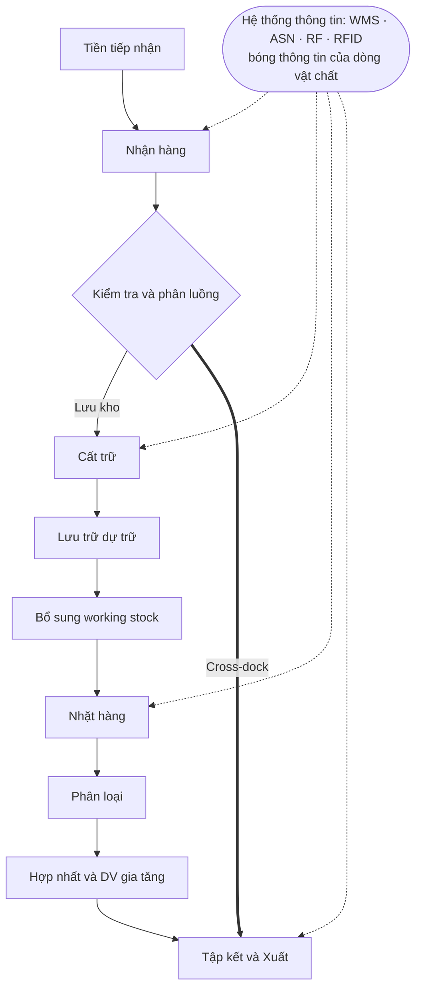

> [!IMPORTANT] 💡 INSIGHT — Dòng vật chất luôn có "bóng thông tin"
> Arnold xếp *"vận hành hệ thống thông tin"* ngang hàng với nhặt/xuất — không phải ngẫu nhiên. Mỗi bước vật lý đều có một **giao dịch dữ liệu song hành**, và **chất lượng dòng chảy vật chất bị chặn trên bởi chất lượng dòng thông tin**. Đây là luồng thông tin trong "3 luồng" ở [M1 §1.1.2](01-chien-luoc-rui-ro.md): kho là nơi *luồng vật chất* và *luồng thông tin* phải khớp nhau **từng giao dịch một** — lệch một giao dịch là sinh một lỗi IRA (§f).

##### b.2 — Vật lý dòng chảy: ba định luật bất biến

Trước khi bàn từng khâu, cần một khung *định lượng tổng* để hiểu kho như một **hệ thống dòng chảy**. Ba định luật sau đúng cho mọi kho và là nền chẩn đoán ở cấp sau-đại học.

**(1) Định luật Little (Little's Law, MIT — J. Little, 1961).** Đây là quan hệ bất biến giữa ba đại lượng của bất kỳ hệ thống dòng chảy ổn định nào:

> [!IMPORTANT] 📐 Little's Law
> $$ \text{WIP} = \lambda \times W $$
> - **WIP** = lượng hàng *trung bình* đang nằm trong hệ thống (work-in-process; vd số pallet trên sàn, số đơn đang xử lý).
> - **λ (throughput)** = tốc độ dòng chảy qua hệ thống (vd pallet/ngày, đơn/giờ).
> - **W (flow time)** = thời gian *trung bình* một đơn vị nằm trong hệ thống.
>
> **Diễn giải kinh tế:** lượng tồn đọng trên sàn *không* phải con số ngẫu nhiên — nó bị *ràng buộc cứng* bởi tốc độ thông qua nhân thời gian lưu. Hệ quả thực chiến: muốn **giảm tồn đọng/diện tích chiếm dụng** mà giữ throughput, chỉ còn một cách — **rút ngắn flow time** (xử lý nhanh hơn, ít chờ hơn). Đây là cơ sở toán học của cross-dock: ép W → ~0 thì WIP → ~0, giải phóng toàn bộ diện tích lưu trữ.

**Ví dụ dò tay** (xem §n để chạy code): khu cross-dock thông qua **1.200 pallet/ngày**, mỗi pallet nằm trung bình **0,5 ngày** → WIP trung bình trên sàn = 1.200 × 0,5 = **600 pallet**. Đảo lại: nếu sàn chỉ chứa được 400 pallet, thì flow time tối đa cho phép = 400/1.200 = 0,33 ngày ≈ **8 giờ** — nếu hàng nằm lâu hơn, sàn sẽ tràn. Little's Law biến một cảm nhận mơ hồ ("sàn hay bị tràn") thành một ràng buộc đo được.

**(2) Nguyên lý nút cổ chai (bottleneck).** Throughput của *cả hệ thống nối tiếp* bị chặn bởi công đoạn **chậm nhất**, không phải bởi công đoạn trung bình. Một kho có khâu nhận, cất, nhặt, xuất — nếu khâu nhặt chỉ xử lý 800 đơn/ca trong khi các khâu khác làm được 1.200, thì cả kho chỉ ra 800 đơn/ca. Hệ quả: **đầu tư vào công đoạn *không phải* nút cổ chai không tăng throughput** — một sai lầm phân bổ vốn phổ biến. Nguyên lý này (gốc từ Lý thuyết Ràng buộc của Goldratt, [M9](09-lean-six-sigma.md)) chỉ ra rằng cải tiến kho phải *bắt đầu từ việc xác định nút cổ chai*, thường chính là **picking (~35–55% công lao động)**.

**(3) Mô hình "chất lỏng" của kho (Bartholdi & Hackman, *Warehouse & Distribution Science*).** Một mô hình tư duy mạnh ở cấp học thuật: xem mỗi SKU như một **dòng chất lỏng** chảy từ goods-in, qua "bể" lưu trữ, ra goods-out với một *lưu lượng* nhất định (đơn vị/ngày). Mô hình này cho hai hệ quả thiết kế then chốt:

- **Mỗi SKU nên được phân bổ *không gian* tỷ lệ với *lưu lượng* của nó**, không phải theo "công bằng" mỗi SKU một ô như nhau — đây là gốc lý thuyết của slotting theo COI (§6.1.3).
- **Tổng công lao động tỷ lệ với tổng *quãng đường × tần suất* chạm hàng** — nên SKU lưu lượng cao phải đặt gần điểm I/O nhất (gốc của nguyên lý "fast-mover gần cửa").

> [!WARNING] 🪤 Điều kiện hiệu lực & khi nào ba định luật SAI
> Cả ba "định luật" trên là công cụ mạnh *trong phạm vi của chúng* — trình bày chúng như chân lý phổ quát là một sai lầm thường gặp. Ranh giới hiệu lực:
> - **Little's Law đòi hỏi hệ ở *trạng thái dừng* (ổn định, bảo toàn):** $WIP=\lambda W$ chỉ đúng cho **giá trị trung bình dài hạn** khi dòng vào ≈ dòng ra. Trong một cú cao điểm (xe dồn buổi sáng, đơn flash-sale), hệ ở chế độ *transient* và quan hệ này **không** mô tả tức thời tồn đọng — lúc đó cần mô phỏng rời rạc. Little's Law nói *"trung bình sẽ ra sao"*, không nói *"đỉnh tồi tệ đến đâu"*.
> - **Nguyên lý nút cổ chai giả định chuỗi *nối tiếp tương đối tĩnh*:** khi nút cổ chai **trôi** (bottleneck dịch chuyển theo mix đơn trong ngày) hoặc các khâu **song song/đệm lớn**, "đầu tư vào nút" có thể chỉ đẩy nút sang chỗ khác (luật Goldratt: tối ưu nút là *vòng lặp*, không phải hành động một lần).
> - **Mô hình chất lỏng *làm mịn* tính rời rạc & ngẫu nhiên:** xem SKU như dòng liên tục bỏ qua tính *nguyên* của pallet và *biến thiên* của cầu — nên nó tốt cho *thiết kế chiến lược* (phân bổ không gian theo lưu lượng) nhưng **không thay** mô hình stochastic khi cần dự phòng bất định (safety stock, pick-face sizing theo σ). Đây là lý do mô hình chất lỏng và mô hình hàng đợi/tồn kho ngẫu nhiên *bổ sung* nhau, không thay nhau.
> Nắm ranh giới này mới biết *chọn ống nghe nào cho triệu chứng nào* — và khi nào phải đổi sang mô phỏng/stochastic.

> [!IMPORTANT] 💡 INSIGHT — Ba định luật này là "ống nghe" chẩn đoán kho
> Khi bước vào *bất kỳ* kho nào để chẩn đoán, ba câu hỏi định lượng đầu tiên nên là: *(i) WIP/throughput/flow time đang ở đâu* (Little — phát hiện tồn đọng & nơi hàng "nằm lâu"); *(ii) nút cổ chai nằm ở khâu nào* (Goldratt — phát hiện nơi đầu tư có ROI); *(iii) phân bổ không gian có khớp lưu lượng SKU không* (Bartholdi–Hackman — phát hiện slotting tồi). Ba "ống nghe" này độc lập với công nghệ và áp được cho cả kho thủ công lẫn dark warehouse — đó là lý do chúng thuộc về nền *bất biến* của khoa học kho.

##### b.3 — Cơ cấu chi phí & phân bổ diện tích

Hai cách "bổ" cùng một con voi — theo *nguồn lực tiêu tốn* và theo *diện tích sàn* — hội tụ về một kết luận: **nhân công và không gian lưu trữ là hai đòn bẩy chi phí lớn nhất**.


*Hình 6.1 — Hoạt động kho theo % tổng chi phí. Nguồn: Richards ch.3 (Figure 3.1).*

| Chi phí theo nguồn lực (Rushton ch.15) | % | | Diện tích sàn (Baker & Perotti 2008) | % |
|---|---|---|---|---|
| Nhân công (½ là pick & pack) | 45–50 | | Lưu trữ dự trữ (high-bay) | 50 |
| Nhà xưởng | 25 | | Nhặt & Đóng gói | 19 |
| Dịch vụ tòa nhà | 15 | | Nhận/Xuất/Tập kết | 16 |
| Thiết bị | 10–15 | | Dịch vụ gia tăng | 8 |
| CNTT | 5–10 | | Khác | 7 |

Hai bảng này *bổ sung* nhau chứ không mâu thuẫn: lưu trữ dự trữ ngốn **nửa diện tích** nhưng ít công lao động (hàng nằm yên); ngược lại pick & pack ngốn **nửa chi phí nhân công** nhưng diện tích vừa phải. Đây chính là biểu hiện của insight a.1 — *"lưu giữ tốn không gian, vận động tốn nhân công"*. Hệ quả thiết kế: tối ưu *không gian* nhắm vào khu dự trữ (giá kệ cao, cube utilization — §e, [§6.2](#62-thiết-kế-layout-không-gian--thiết-bị)); tối ưu *chi phí* nhắm vào picking (slotting, routing, batching, automation — §h, [§6.1.2–6.1.3](#612-chiến-lược-lấy-hàng-batch--zone--wave-picking)).

> [!NOTE] 💻 Ngưỡng lấp đầy (honeycombing)
> Frazelle (2002): vượt **~86% lấp đầy**, năng suất & an toàn giảm theo hàm mũ; realtime giỏi mới đạt 90% (Richards ch.13). Lý do là **"honeycombing"** — khi kho gần đầy, khả năng tìm được *đúng* ô trống phù hợp giảm mạnh, hàng bị đặt rải rác tạo các "lỗ tổ ong" không dùng được, và mỗi lần cất/lấy phải đi xa hơn. Đây là một dạng *tắc nghẽn phi tuyến*: 86% là ngưỡng kinh nghiệm nơi chi phí biên của việc nhét thêm pallet vượt lợi ích.

> [!CAUTION] 📦 CASE STUDY — Walmart & nghệ thuật "cắt" dòng chảy bằng Cross-docking
> Walmart tại Mỹ được cho là giao **~85% hàng hóa qua hệ cross-docking** (Richards ch.3): hàng từ goods-in chuyển **thẳng** ra bến xuất, **bỏ qua put-away, lưu trữ và picking** — tức cắt bỏ chính ba khâu tốn chi phí nhất trong Hình 6.1. Soi qua Little's Law: cross-dock ép flow time W → gần 0, nên WIP → gần 0, giải phóng toàn bộ diện tích lưu trữ và vốn lưu động. Kết quả: tồn kho thấp, throughput cực cao.
> **Điều kiện để làm được (không phải kho nào cũng cross-dock được):** NCC phải dán nhãn sẵn, báo trước (ASN), giao đúng giờ & chính xác; cần WMS hỗ trợ, hệ QC, độ tin cậy/hợp tác cao của NCC + carrier. Rushton (ch.19) cảnh báo: cross-dock có thể chỉ **đẩy tồn kho ngược lên thượng nguồn** (NCC phải ôm thêm) — phải nhìn tổng thể chuỗi, đúng tinh thần tối ưu hóa toàn cục. Phân tích sâu tại [§6.1.4](#614-cross-docking-chuyên-sâu).

##### Góc Hoạch định — kho trong vòng lặp hoạch định

Dòng chảy kho **không tự khởi phát**: nó là **nút thực thi** của chuỗi hoạch định phía trên. Lăng kính Hoạch định trả lời *"cần bao nhiêu không gian, lao động, thiết bị, và hàng vào lúc nào"* — trước khi khâu Thực thi vận hành.

| Loại hoạch định | Nội dung | Liên kết |
|---|---|---|
| **Kích hoạt dòng vào** | Hàng vào kho theo **kế hoạch bổ sung**: lệnh từ DRP (kho vùng→kho tổng) và MPS (thành phẩm từ sản xuất). Kho là "điểm hạ cánh" của các kế hoạch này | [M7 §7.5 (DRP)](07-transportation-network.md), [M3 §3.2 (MPS)](03-supply-planning-mpc.md) |
| **Hoạch định công suất (space)** | Tính số ô pallet theo **tồn kho đỉnh**: vd 90.000 thùng ÷ 30 thùng/pallet = 3.000 pallet; xếp 3 tầng → 1.000 ô (Arnold ch.12). Phải khớp năng lực kho với kế hoạch S&OP | §e (cube), [§6.2](#62-thiết-kế-layout-không-gian--thiết-bị), [M3 §3.1 (S&OP)](03-supply-planning-mpc.md) |
| **Hoạch định lao động & thiết bị** | **Khớp giờ công với khối lượng** qua dock scheduling; lập pool lao động thời vụ cho cao điểm; chọn mix lao động–MHE (đánh đổi vốn–vận hành) | §d, Richards ch.13 |
| **Hoạch định bổ sung pick face** | Thiết kế pick face theo sản lượng dự báo/ca; timing replenishment | §g |
| **Hoạch định cao điểm mùa vụ** | Lên công suất trước nhiều tháng (case sô-cô-la: 500→10.000 pallet) | §g (case study) |

> [!IMPORTANT] 💡 INSIGHT — Chất lượng dòng chảy bị chặn trên bởi chất lượng kế hoạch đổ xuống
> Kho vận hành tốt đến mấy cũng không cứu được một **kế hoạch bổ sung tồi**: nếu DRP phát lệnh sai (do dự báo lệch hoặc IRA kém), kho sẽ nhận sai hàng, sai lúc → tắc nghẽn, thiếu/thừa. Đây chính là lý do vai trò **DRP/Control Tower nằm *thượng nguồn* của vận hành kho**: tối ưu kế hoạch bổ sung (M3/M7) cho ROI cao hơn tối ưu thao tác trong kho. Vòng lặp khép kín: *Hoạch định (DRP) → Thực thi (flow kho) → Dữ liệu thực tế (throughput, IRA) → hiệu chỉnh Hoạch định.*

##### Góc Toán tối ưu — bản đồ bài toán ẩn trong dòng chảy kho

Mỗi khâu vật lý của dòng chảy đều là một **bài toán tối ưu hóa** mô hình hóa được. Đây là review nghiên cứu vận hành kho theo Gu, Goetschalckx & McGinnis (2007) — chuẩn tham chiếu học thuật toàn cầu. Bảng dưới ánh xạ khâu → bài toán → lớp toán → nơi đào sâu:

| Khâu dòng chảy | Bài toán tối ưu | Lớp toán / phương pháp | Đào sâu tại |
|---|---|---|---|
| Đặt lịch bến (dock scheduling) | Phân bổ xe vào bến & khung giờ | Scheduling / Assignment / **Queueing** | §d, M7 |
| Cất trữ (put-away) | Gán vị trí lưu tối ưu (động) | **Assignment Problem** | §e |
| **Slotting** | Xếp SKU để **tối thiểu tổng quãng nhặt** | Cube-per-Order Index (COI); **Quadratic Assignment (QAP)** | [§6.1.3](#613-tối-ưu-vị-trí-xếp-hàng-slotting-bằng-cube-per-order-index-coi) |
| Gộp đơn (order batching) | Nhóm đơn giảm số chuyến nhặt | Set partitioning / Clustering | [§6.1.2](#612-chiến-lược-lấy-hàng-batch--zone--wave-picking) |
| **Lộ trình nhặt** (pick routing) | Đường đi ngắn nhất qua các vị trí | **TSP / VRP** (heuristic: GA, Ant Colony) | [§6.1.2](#612-chiến-lược-lấy-hàng-batch--zone--wave-picking), [M7 §7.6.3](07-transportation-network.md) |
| Xếp tải pallet/xe (load building) | Nhồi tối đa & ổn định | **3D Bin Packing** | [§6.2](#62-thiết-kế-layout-không-gian--thiết-bị), [M7](07-transportation-network.md) |
| Cross-dock door assignment | Gán cửa vào–ra & lịch xe | Assignment + Scheduling | [§6.1.4](#614-cross-docking-chuyên-sâu) |
| Cỡ ô / cube utilization | Tối đa suất dùng khối với ràng buộc accessibility | Tối ưu hình học | §e, §n |
| Tần suất cycle counting | Phân bổ lượt đếm theo rủi ro | Tối ưu theo ABC | §f, §n, [M4](04-toi-uu-ton-kho.md) |
| Working/reserve & safety stock | Cân bằng chi phí–mức phục vụ | **Stochastic optimization** | [M4 §4.3](04-toi-uu-ton-kho.md) |
| Bố trí mạng kho (vị trí, số lượng) | Đặt kho ở đâu, bao nhiêu | Center of Gravity, **MILP** | [M7 §7.6](07-transportation-network.md) |

> [!IMPORTANT] 💡 INSIGHT — Kho là một "mỏ" bài toán tối ưu
> Khác cảm nhận "kho chỉ là chân tay", mỗi mét vuông sàn ẩn chứa hàng loạt bài toán tối ưu tổ hợp (assignment, TSP, bin packing, QAP) và tối ưu ngẫu nhiên (safety stock). Với nền **Toán kinh tế**, đây là **lăng kính đòn bẩy cao nhất**: cùng một layout vật lý, một thuật toán slotting/routing tốt hơn có thể cắt **30–60% quãng nhặt** mà *không tốn thêm vốn đầu tư* (so với mua AMR). Một nhận định ở cấp thạc sĩ: trong kho, **trí tuệ thuật toán thường rẻ hơn trí tuệ cơ khí** — tối ưu hóa phần mềm nên *đi trước* tự động hóa phần cứng trên đường cong ROI.

#### c. Tiền tiếp nhận (Pre-receipt)

Nguyên lý nền tảng: ***hàng tới bến là đã muộn để sửa*** (Richards ch.3). Mọi vấn đề chất lượng dòng vào — bao bì sai cỡ, nhãn sai, bội số đóng gói lệch — nếu để lọt tới bến nhận thì chi phí khắc phục đã *nhân lên*: phải mở ra, đếm lại, đóng lại, chờ xử lý, chiếm bến. Vì thế tiền tiếp nhận là khâu *phòng bệnh* — dịch chuyển kiểm soát về **thượng nguồn**, quy định chuẩn *trước khi* NCC giao. Đây là biểu hiện cụ thể của tư duy *"chất lượng tại nguồn"* (Lean, [M9](09-lean-six-sigma.md)).

Quản lý kho quy định với NCC: quy cách carton, đơn vị/thùng, **TiHi** (số thùng mỗi lớp × số lớp trên pallet), nhãn & vị trí nhãn, loại pallet (ISO 6780 — 6 cỡ chuẩn; cỡ pallet quyết định cấu hình kệ → [§6.2.3](#623-hệ-lưu-trữ-selective--drive-in--push-back--pallet-flow--as-rs)), và phương thức vận chuyển.

> [!WARNING] 🪤 Bẫy thường gặp ở tiền tiếp nhận
> - **Bất nhất bội số đóng gói:** NCC giao bội 12, khách đặt bội 10 → mở/đếm/đóng lại liên tục, sinh lỗi & chi phí.
> - **80/20 nhà cung cấp:** 20% NCC gây 80% sự cố hàng-vào → phải *đo* (vendor scorecard) & *ép* cải thiện, không chịu đựng thụ động.
> - **Carton sai cỡ:** không xếp tối ưu pallet → giảm dung tích & tăng hư hỏng.

> [!TIP] 🛠️ SOP tiền tiếp nhận
> ① thùng/bao bì · ② palletize & cỡ pallet · ③ nhãn + vị trí · ④ số lượng trong/ngoài · ⑤ phương thức/tần suất · ⑥ **gửi mẫu trong bao bì vận chuyển thực** để kiểm tương thích trước khi chạy đại trà.

#### d. Nhận hàng (Receiving) — & lý thuyết hàng đợi cho bến

Lao động là chi phí lớn nhất (48–60%) và khó kiểm soát nhất, vì *khối lượng hàng vào dao động* còn *giờ công thì cố định theo ca*. Thách thức trung tâm của nhận hàng là **khớp giờ công với khối lượng** qua **dock scheduling** — và đây là nơi *lý thuyết hàng đợi* (queueing) bước vào.

Lưu trình chuẩn (Richards ch.3; Rushton ch.19): đặt lịch bến → **ASN/EDI** (LPN từng pallet) → dỡ hàng (kiểm seal, nhiệt độ) → weigh-check + dimension check trước AS/RS → ghi batch/serial, QC khóa hàng trong WMS.

**Vì sao bến hay tắc — góc nhìn hàng đợi.** Bến nhận là một *hệ phục vụ*: xe tải đến (ngẫu nhiên) xếp hàng chờ bến trống (số bến = số "máy phục vụ" c). Lý thuyết hàng đợi M/M/c cho một kết quả phản trực giác nhưng cực kỳ quan trọng:

> [!IMPORTANT] 📐 Hệ số sử dụng & thời gian chờ phi tuyến
> Gọi **ρ = λ/(c·μ)** là hệ số sử dụng bến (λ = nhịp xe đến, μ = nhịp dỡ mỗi bến, c = số bến). Khi **ρ → 1** (bến gần như luôn bận), **thời gian chờ trung bình tăng vọt theo hàm ~1/(1−ρ)** — *không* tuyến tính. Hệ quả: một bến chạy ở 95% công suất có hàng chờ dài *gấp nhiều lần* bến chạy 70%, dù chỉ "bận thêm 25%". Đây là cùng một dạng phi tuyến với ngưỡng lấp đầy 86% (§b.3) — **hệ thống dòng chảy luôn sụp đổ phi tuyến khi tiến gần 100% công suất**, nên dock scheduling phải chủ động *dàn phẳng* nhịp đến (appointment booking, time-slotting) thay vì để xe đến tự do.

##### Lab định lượng — GIẢI mô hình hàng đợi bến M/M/c

Phát biểu phi tuyến ở trên mới là *định tính*. Để biến nó thành công cụ quyết định ("kho này cần **mấy** cửa nhận?"), phải **giải** mô hình hàng đợi nhiều máy phục vụ **M/M/c** — nền móng do **A. K. Erlang (1917)** đặt cho lý thuyết hàng đợi và là chuẩn tham chiếu để định cỡ số trạm phục vụ. Đây là một mô hình **xác suất–stochastic được giải ra số**, không phải số học một bước.

> [!IMPORTANT] 📐 Đề bài (dữ liệu cho sẵn — không random)
> Bến nhận của một DC: xe tải đến theo tiến trình **Poisson** với nhịp **λ = 5 xe/giờ**; mỗi cửa dỡ xong một xe theo phân phối **mũ** với nhịp **μ = 2 xe/giờ** (tức 30 phút/xe). **Tải chào (offered load)** $a = \lambda/\mu = 2{,}5$ Erlang. Câu hỏi: với **c = 3, 4, 5** cửa, thời gian chờ trung bình $W_q$ là bao nhiêu, và **cần tối thiểu bao nhiêu cửa** để giữ $W_q < 15$ phút?

> [!IMPORTANT] 📐 Công thức M/M/c (Erlang C)
> Điều kiện ổn định: $\rho = \dfrac{\lambda}{c\mu} < 1$. Xác suất hệ rỗng và các đại lượng vận hành:
> $$P_0 = \left[\sum_{n=0}^{c-1}\frac{a^n}{n!} + \frac{a^{c}}{c!\,(1-\rho)}\right]^{-1}, \qquad P_{\text{wait}} = \frac{a^{c}}{c!\,(1-\rho)}\,P_0$$
> $$L_q = P_{\text{wait}}\cdot\frac{\rho}{1-\rho}, \qquad W_q = \frac{L_q}{\lambda}, \qquad W = W_q + \frac{1}{\mu}$$
> - $a = \lambda/\mu$ = tải chào; $\rho$ = hệ số sử dụng mỗi cửa; $P_{\text{wait}}$ = xác suất một xe phải xếp hàng chờ (công thức **Erlang C**).
> - $L_q$ = số xe chờ trung bình; $W_q$ = thời gian chờ trung bình; $W$ = tổng thời gian trong hệ (chờ + dỡ).

> [!IMPORTANT] 📐 Tính tay — c = 3 cửa
> $\rho = 5/(3{\cdot}2) = 0{,}8333$. Tổng $\sum_{n=0}^{2} a^n/n! = 1 + 2{,}5 + 3{,}125 = 6{,}625$.
> Số hạng cuối $\dfrac{a^3}{3!(1-\rho)} = \dfrac{15{,}625}{6\cdot0{,}16667} = 15{,}625$ → $P_0 = 1/(6{,}625+15{,}625) = 1/22{,}25 = 0{,}0449$.
> $P_{\text{wait}} = 15{,}625\times0{,}0449 = 0{,}702$ → $L_q = 0{,}702\times\dfrac{0{,}8333}{0{,}1667} = 0{,}702\times5 = 3{,}51$ xe → $W_q = 3{,}51/5 = 0{,}702$ giờ $\approx \mathbf{42{,}1}$ **phút**. Code dưới quét c = 3, 4, 5 và giải ngược SLA.

```python
import math

# === DE BAI (du lieu cho san, khong random) ===
# Ben nhan: xe den Poisson lambda=5 xe/gio; moi cua do mu=2 xe/gio (30 phut/xe)
LAMBDA = 5.0     # xe/gio
MU     = 2.0     # xe/gio moi cua
a      = LAMBDA / MU          # offered load (Erlang) = 2.5

def mmc(c):
    rho = LAMBDA / (c * MU)                              # he so su dung moi cua
    s   = sum(a**n / math.factorial(n) for n in range(c))   # tong n=0..c-1
    last = a**c / (math.factorial(c) * (1 - rho))
    P0  = 1.0 / (s + last)
    Pw  = last * P0                                      # Erlang C: xac suat phai cho
    Lq  = Pw * rho / (1 - rho)                           # so xe cho trung binh
    Wq  = Lq / LAMBDA                                    # thoi gian cho trung binh (gio)
    return rho, Pw, Lq, Wq

print(f"a (offered load) = {a} Erlang")
print(f"{'c':>2}{'rho':>8}{'P(wait)':>10}{'Lq(xe)':>9}{'Wq(phut)':>10}")
for c in [3, 4, 5]:
    rho, Pw, Lq, Wq = mmc(c)
    print(f"{c:>2}{rho:>8.3f}{Pw:>10.3f}{Lq:>9.2f}{Wq*60:>10.1f}")

# SLA: Wq < 15 phut -> can may cua? (c>=3 de on dinh: c*mu > lambda)
for c in range(3, 8):
    *_, Wq = mmc(c)
    if Wq * 60 < 15:
        print(f"\nSLA cho < 15 phut: can c = {c} cua (Wq = {Wq*60:.1f} phut)")
        break
```

> [!NOTE] 💻 Kết quả (đã verify bằng máy — khớp phần tính tay c = 3)
> ```
> a (offered load) = 2.5 Erlang
>  c     rho   P(wait)   Lq(xe)  Wq(phut)
>  3   0.833     0.702     3.51      42.1
>  4   0.625     0.320     0.53       6.4
>  5   0.500     0.130     0.13       1.6
>
> SLA cho < 15 phut: can c = 4 cua (Wq = 6.4 phut)
> ```
> **Đọc nghiệm — đây là phi tuyến $1/(1-\rho)$ hiện hình bằng số:** thêm **đúng một cửa** (3→4) cắt thời gian chờ từ **42 phút xuống 6,4 phút** (−85%), dù công suất chỉ tăng từ 3 lên 4 cửa. Cửa thứ 5 chỉ còn cải thiện 6,4→1,6 phút — *lợi ích biên giảm nhanh*. Đó chính là lý do định cỡ bến không thể "ước lượng tuyến tính" mà phải giải Erlang C: vùng $\rho\in[0{,}8;\,1)$ là vùng "vách đá", lùi khỏi nó (xuống ρ≈0,6) rẻ hơn nhiều so với chịu đựng hàng chờ.

> [!WARNING] 🪤 Giả định, điều kiện hiệu lực & hạn chế của mô hình M/M/c
> Mô hình trên **chỉ đúng** khi thỏa các giả định — và biết *khi nào nó sai* mới là mức thạc sĩ:
> - **Đến Poisson + dỡ mũ (memoryless):** giả định nhịp đến hoàn toàn ngẫu nhiên, độc lập. Thực tế xe tải thường **đến theo lịch hẹn** (appointment) → biến thiên *thấp hơn* Poisson, nên M/M/c **phóng đại** hàng chờ. Đây nghịch lý là *luận cứ định lượng cho time-slotting*: lịch hẹn kéo phương sai nhịp đến xuống, dịch cả đường cong $W_q$ xuống dưới.
> - **Trạng thái dừng (steady-state):** công thức cho giá trị *trung bình dài hạn*. Một cú dồn xe lúc 8h sáng (transient) không nắm bắt được — cần mô phỏng rời rạc (discrete-event simulation) cho cao điểm.
> - **Một hàng chờ chung, c cửa đồng nhất, vô hạn chỗ chờ:** nếu sân chỉ chứa được K xe (hàng đợi hữu hạn) thì là M/M/c/K; nếu cửa chuyên dụng theo loại hàng thì phải tách nhiều hệ.
> - **Khi nhịp đến/dỡ KHÔNG mũ:** dùng xấp xỉ **Kingman (1961)** cho hàng đợi tổng quát G/G/c — $W_q$ tỉ lệ với $\frac{\rho}{1-\rho}\cdot\frac{C_a^2+C_s^2}{2}$, tách bạch *hệ số sử dụng* khỏi *độ biến thiên* ($C_a, C_s$). Thông điệp sâu hơn: **giảm biến thiên (CV) hạ hàng chờ y như giảm tải** — nền lý thuyết của Lean/level-loading ([M9](09-lean-six-sigma.md)).

Toolkit (1.28) chuẩn hóa khâu này thành **flow chart "as-is/to-be"** — công cụ vẽ lại quy trình để phân tích & cải tiến (ký hiệu: bắt đầu/kết thúc = bo tròn, thao tác = chữ nhật, quyết định = thoi):

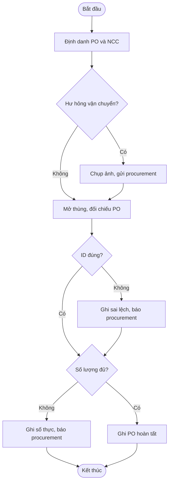
*Sơ đồ phỏng theo flow chart nhận hàng, Toolkit 1.28 (Richards & Grinsted).*

Mức độ kiểm hàng vào là một **đánh đổi rủi ro–chi phí**, nên phân tầng theo độ tin cậy NCC:

| Cơ chế kiểm | Mô tả | Khi nào |
|---|---|---|
| Bậc thang | 10% → +10% → 100% nếu phát hiện sai | NCC có lịch sử |
| Toàn bộ | 100% | NCC mới, chưa có dữ liệu tin cậy |
| **GFR** (Goods Failure Rate) | Nhận không kiểm, kiểm ngẫu nhiên, *tính phí sai lệch* cho NCC | NCC tin cậy cao |

> [!NOTE] 💻 Đếm "mù" (blind count) chính xác hơn dùng chứng từ làm checklist — vì khi thấy số kỳ vọng trên giấy, người đếm có xu hướng *xác nhận* thay vì *đếm thật* (thiên kiến neo). 70% DN dẫn đầu nhận hàng không giấy (Richards ch.3).

> [!NOTE] 🌐 Computer Vision receiving (2026)
> Camera tốc độ cao + ML **kiểm barcode, đo kích thước, phát hiện hư hỏng, xác minh nhãn**, thay nhiều kiểm thủ công (Precision Warehouse Design, 2026) — bước tiến hóa từ barcode/RFID.

#### e. Cất trữ (Put-away) — Bài toán gán vị trí, Cube Utilization & các hệ định vị

##### e.1 — Put-away là một *bài toán gán* (Assignment Problem)

Khi một pallet vừa nhận cần được cất, WMS phải trả lời: *cất vào ô nào?* Đây không phải lựa chọn tùy tiện mà là một **bài toán gán** (assignment): gán mỗi pallet (nguồn) vào một ô (đích) sao cho *tổng chi phí kỳ vọng* (quãng cất + quãng nhặt tương lai + rủi ro nghẽn) là nhỏ nhất, dưới các ràng buộc kích thước/trọng lượng/tương thích hàng. WMS cấp phát vị trí dựa trên: kích thước & trọng lượng pallet, lớp ABC/slotting của SKU, đơn hàng hiện hành, nhóm họ hàng, trạng thái pick face, và tải trọng kệ.

Hai đại lượng *đối nghịch* phải cân bằng trong mọi quyết định cất trữ (Arnold ch.12):

> [!IMPORTANT] 📐 Cube Utilization vs Accessibility — đánh đổi nền tảng
> - **Accessibility (khả năng tiếp cận):** lấy được hàng cần với công sức tối thiểu; 100% nghĩa là *không phải di chuyển hàng khác* để lấy được pallet mình cần.
> - **Cube Utilization (suất dùng khối):** mức dùng không gian *cả ngang lẫn dọc*.
> $$\text{Cube Utilization} = \frac{\text{Số pallet thực lưu}}{\text{Số ô pallet khả dụng}} \times 100\%$$
> **Ví dụ (Arnold) — dò tay:** xếp 5 SKU (4+6+14+8+5 = 37 pallet) đảm bảo **100% accessibility** cần mỗi SKU chiếm cột riêng → 14 cột nền × 3 tầng = **42 ô** → cube utilization = 37/42 = **88,1%** (code §n). Hai mục tiêu **đánh đổi nhau**: tăng accessibility (mỗi SKU một cột riêng để không chồng pallet khác lên) thường *hạ* cube utilization vì phải chừa chỗ trống. Giải pháp dung hòa: lắp **tier giá kệ** để lấy pallet dưới không động pallet trên — đánh đổi giữa *chi phí vốn giá kệ* và *chi phí vận hành xử lý thừa*.

> [!IMPORTANT] 💡 INSIGHT — Vì sao đây là đánh đổi "không có lời giải đúng tuyệt đối"
> Accessibility cao tiết kiệm *nhân công* (vận động) nhưng tốn *không gian*; cube cao tiết kiệm *không gian* nhưng tốn *nhân công* (phải di chuyển hàng chắn). Vì nhân công và không gian là *hai đòn bẩy chi phí lớn nhất* (§b.3), đây thực chất là bài toán cân bằng *hai* khoản chi phí lớn nhất với nhau — và lời giải tối ưu **phụ thuộc giá lao động địa phương**: nơi lao động đắt (Tây Âu, Nhật) nghiêng về accessibility/tự động; nơi lao động rẻ nghiêng về cube cao + thủ công. Đây là lý do *không thể bê nguyên layout kho từ nước này sang nước khác*.

##### e.2 — Các hệ định vị tồn

| Hệ | Cơ chế | Đặc điểm & đánh đổi |
|---|---|---|
| **Fixed location** | Mỗi SKU một vị trí cố định | Ít cần ghi chép, dễ nhớ, dễ học; **cube utilization kém (~50%** nếu cầu đều, vì phải chừa chỗ cho cả lô đỉnh) |
| **Floating location** | Hàng vào bất kỳ chỗ trống phù hợp | Cube utilization cao; **bắt buộc dữ liệu vị trí chính xác & cập nhật realtime** (cần WMS) — không có WMS thì sẽ "mất hàng" |
| **Point-of-use** | Lưu sát nơi sử dụng (JIT) | Giảm material handling; hợp C-items "floor stock" giá trị thấp |
| **Central storage** | Tập trung một chỗ | Dễ kiểm soát, **IRA dễ duy trì**, giảm safety stock nhờ *gộp rủi ro* (risk pooling) |

Nguyên tắc bố trí (Arnold ch.12) — đều là hệ quả thực hành của mô hình chất lỏng (§b.2):

- Nhóm **functionally related** — cùng công dụng, hay được đặt chung trong một đơn → giảm quãng nhặt liên SKU.
- Nhóm **fast-moving** gần khu nhận/xuất — *trực tiếp* từ nguyên lý "không gian tỷ lệ lưu lượng, fast-mover gần I/O".
- Nhóm **physically similar** — cùng loại thiết bị lưu trữ/handling.
- Tách **working stock vs reserve stock** — nhặt ở khu working gọn, bổ sung từ reserve bằng pallet.
- **Task interleaving** — ghép put-away với việc lấy pallet trên đường về để cắt *hành trình rỗng* (deadheading), một dạng tối ưu giảm touch.

> [!NOTE] 🌐 AI Dynamic Slotting (2025)
> AI tái định vị SKU theo vận tốc/kích thước/tần suất (Priority Software; Best Ops Chain AI, 2025); ML bắt mẫu (SKU xuất nhiều nửa đầu tuần → điều chỉnh slotting) (Appinventiv, 2025); công cụ đặt tồn kho AI **cắt quãng đường nhặt tới ~60%** (Locus Robotics, 2026) — chính là phiên bản "sống" (động, học theo dữ liệu) của COI tĩnh ([§6.1.3](#613-tối-ưu-vị-trí-xếp-hàng-slotting-bằng-cube-per-order-index-coi)).

#### f. Lưu trữ & ĐỘ CHÍNH XÁC TỒN KHO (Inventory Record Accuracy)

##### f.1 — Vì sao IRA là *tầng nền* của mọi thứ

Đây là **tầng nền** thường bị xem nhẹ nhưng quyết định độ tin cậy của tất cả: cả dòng chảy kho — và cả chuỗi hoạch định hạ nguồn — chỉ đáng tin khi **bản ghi tồn kho chính xác**. Lập luận nhân quả ở cấp hệ thống: WMS, DRP, Min-Max, DOS, mọi thuật toán tối ưu tồn kho đều *đọc* bản ghi tồn kho làm input. Nếu bản ghi sai, thì theo nguyên lý "rác vào, rác ra" (garbage in, garbage out), *mọi* quyết định phía sau đều sai — bất kể thuật toán tinh vi đến đâu. IRA vì thế không phải "một KPI vận hành" mà là **điều kiện tiên quyết cho tính đúng đắn của toàn bộ lớp định lượng**.

Ba thông tin phải đúng cho mỗi bản ghi (Arnold ch.12): **mã hàng, số lượng, vị trí**. Bản ghi sai dẫn tới chuỗi hệ quả dây chuyền: tính gross-to-net sai → hứa đơn sai → giao thiếu/giao thừa → lịch sản xuất gián đoạn → mất doanh số → và nghịch lý cuối: *purchasing buộc phải ôm safety stock lớn để bù cho chính sự thiếu tin cậy của bản ghi* — tức IRA kém *trực tiếp đẩy tồn kho lên cao*.

##### f.2 — Kỷ luật giao dịch 4 bước & cơ chế bảo vệ

> [!TIP] 🛠️ Quy trình giao dịch chuẩn (Arnold) — mọi lần nhận/xuất/di chuyển
> ① **Identify** — định danh mã/PO/vị trí · ② **Verify** — đếm/cân/đo xác minh số lượng · ③ **Record** — ghi nhận *trước khi* di chuyển · ④ **Execute** — thực hiện di chuyển vật lý.
> Kèm hai cơ chế bảo vệ: **limited access** (kho khóa ngoài giờ — không cho lấy hàng mà bỏ qua bước ghi nhận) + **nhân sự được huấn luyện** (lỗi IRA gần như luôn là lỗi *quy trình/con người*, không phải lỗi phần mềm — xem case CostMart §m).

##### f.3 — Đo IRA bằng dung sai (tolerance), không bằng "đúng tuyệt đối"

Không phải SKU nào cũng cần chính xác 100%: bu-lông đếm theo nghìn không cần đúng từng cái như hàng điện tử giá trị cao. Mỗi mã đặt một **dung sai** theo *giá trị, tính khẩn, lead time, khả năng dừng sản xuất, và yếu tố an toàn*. Một bản ghi được coi là *đúng* khi sai lệch ≤ dung sai. Đây là cách tiếp cận *quản trị theo rủi ro* — dồn nguồn lực kiểm soát vào nơi sai số gây hại nhất.

> [!IMPORTANT] 📐 Ví dụ tolerance (Arnold) — dò tay (code §n)
> - **Item A:** đếm 1.500, sổ 1.550, dung sai ±5% (trên số đếm) → cho phép lệch ±75 → lệch thực 50 ≤ 75 → **TRONG dung sai**.
> - **Item B:** đếm 120, sổ 125, dung sai ±2% → cho phép ±2,4 → lệch thực 5 > 2,4 → **NGOÀI dung sai**.
> ⇒ IRA đo bằng ***% số mã trong dung sai***, KHÔNG bằng chênh lệch *tổng giá trị* — vì tổng giá trị có thể "bù trừ" (mã thừa che mã thiếu), che giấu hàng trăm lỗi cá biệt. Đây là một điểm tinh tế quan trọng: *một kho có thể có tổng giá trị tồn kho khớp sổ 99,9% nhưng IRA theo dòng chỉ 70%*.

##### f.4 — Kiểm kê định kỳ vs Cuốn chiếu (Cycle Counting)

Kiểm toàn bộ cuối năm (annual physical) phải *đóng kho*, huy động người không chuyên đếm vội trong áp lực thời gian → trớ trêu thay, **thường tạo thêm lỗi hơn là sửa lỗi**, và chỉ cho một "ảnh chụp" đúng tại một thời điểm trong năm. **Cycle counting** đếm liên tục suốt năm theo lịch, ưu tiên theo ABC, không cần đóng kho — và quan trọng nhất, mục tiêu của nó *không phải chỉ chỉnh số* mà là **truy nguyên nhân gốc của lỗi để triệt tiêu** (đúng tinh thần PDCA/Kaizen [M9](09-lean-six-sigma.md)). Một lần cycle count phát hiện lệch là một cơ hội *điều tra quy trình*, không chỉ một lần "sửa sổ".

> [!IMPORTANT] 📐 Toán lịch Cycle Counting (ABC) — dò tay (code §n)
> Tần suất đếm tăng theo *giá trị* & *số giao dịch* (vì giao dịch nhiều → cơ hội sai nhiều). Ví dụ (Arnold): 1.000 mã A × 12 lần/năm = 12.000; 1.500 mã B × 4 = 6.000; 2.500 mã C × 1 = 2.500 → **20.500 lượt/năm ÷ 250 ngày làm việc ≈ 82 lượt/ngày**, trong đó lớp A chiếm **58,5%** tổng lượt đếm dù chỉ là 1.000/5.000 = 20% số mã. Các phương pháp xác định tần suất: **ABC method, Zone method, Location-audit** (đặc trị hệ floating). Thời điểm đếm tối ưu: khi đặt đơn, khi nhận đơn, khi bản ghi về 0, sau N giao dịch, hoặc ngay khi phát hiện lỗi.

> [!IMPORTANT] 💡 INSIGHT — Vì sao IRA là "gót chân Achilles" của DRP & Control Tower
> Toàn bộ chuỗi hoạch định hạ nguồn (DRP, Min-Max, DOS) **chạy trên giả định bản ghi tồn kho đúng**. Nếu IRA chỉ 50% (case CostMart §m): DRP phát lệnh bổ sung sai, Min-Max tự kích hoạt nhầm, DOS hiển thị ảo trên Control Tower → người dùng *mất niềm tin vào dashboard* và quay về quyết định bằng cảm tính — phá hỏng chính giá trị của hệ thống. **Trước khi tối ưu thuật toán tồn kho ([M4](04-toi-uu-ton-kho.md)), phải đảm bảo IRA.** Cycle counting theo ABC chính là cơ chế *kiểm soát chất lượng đầu vào* cho mọi mô hình định lượng — hãy đưa **IRA & cube utilization vào dashboard như KPI nền**, ngang hàng với fill rate.

#### g. Bổ sung, Dịch vụ gia tăng & Trì hoãn

##### g.1 — Vì sao kho tự "chia đôi": khu dự trữ vs khu nhặt

Trước khi nói *bổ sung là gì*, phải hiểu *vì sao cần bổ sung*. Câu trả lời nằm ở một mâu thuẫn thiết kế mà phần lớn kho buộc phải giải quyết bằng cách **chia không gian lưu trữ làm hai khu vực có mục tiêu ngược nhau** (Richards ch.3):

- **Khu dự trữ (reserve / bulk storage):** chứa phần lớn lượng hàng, thường theo nguyên pallet, xếp cao. Mục tiêu của khu này là **tối đa mật độ khối (cube)** — nhồi càng nhiều pallet vào mỗi mét vuông càng tốt, vì hàng ở đây *nằm yên* nên ít bị "chạm". Hệ quả: ô sâu, kệ cao, lối đi hẹp — tối ưu cho lưu giữ nhưng *tệ* cho việc nhặt lẻ.
- **Khu nhặt (working / forward pick area):** một khu *nhỏ* hơn nhiều, đặt sát điểm nhặt, chứa lượng hàng vừa đủ để picker lấy lẻ (theo thùng/theo cái). Mục tiêu của khu này là **tối thiểu quãng đi và số lần chạm khi nhặt** — nén các SKU lưu lượng cao vào một không gian gọn để picker không phải đi xa.

Hai mục tiêu này không thể cùng tối ưu trên *một* khu duy nhất: một khu vừa nén mật độ cao vừa nhặt lẹ là điều bất khả. Lời giải kinh điển là tách đôi — và **chính sự tách đôi đó sinh ra nhu cầu bổ sung**: khu nhặt nhỏ nên sẽ *cạn* theo nhịp picker rút hàng, phải được "nạp lại" liên tục từ khu dự trữ. Đây là bản chất của bài toán, không phải một thao tác phụ trợ.

##### g.2 — Bổ sung (Replenishment): định nghĩa, cơ chế & bài toán thời điểm

**Bổ sung (replenishment)** là hoạt động *di chuyển hàng từ khu dự trữ sang khu nhặt* để khu nhặt luôn có *đúng hàng, đúng lượng, ở đúng vị trí nhặt* khi picker cần. Nó là **cây cầu nối hai khu** mà §g.1 vừa tách ra: khu dự trữ là "bể chứa lớn", khu nhặt là "bể vơi nhanh", và bổ sung là dòng chảy giữ cho bể vơi không bao giờ cạn — đồng thời không tràn.

**Thời điểm bổ sung** là biến điều khiển then chốt, và đây là một bài toán đánh đổi tinh tế chứ không phải một quy tắc cứng. Hai phía của đánh đổi:

- **Bổ sung *quá sớm*** → pick face đầy quá mức, hàng cũ bị hàng mới chặn lên gây **xung đột FIFO** (lô cũ kẹt lại, rủi ro quá hạn), tốn công di chuyển thừa, chiếm chỗ vô ích.
- **Bổ sung *quá muộn*** → khu nhặt cạn ngay giữa ca, picker tới nơi *không có hàng* (stockout tại pick face), buộc phải chờ hoặc bỏ dòng đơn — mỗi lần như vậy đẩy **chi phí mỗi lần nhặt** lên cao, vì picker đứng yên vẫn ăn lương.

Vì cả hai cực đều tốn tiền, vận hành tốt nhắm vào **điểm cân bằng động**: kích hoạt bổ sung theo một *ngưỡng tồn tối thiểu* tại pick face (min/max), và — quan trọng hơn — **tách thời gian bổ sung ra khỏi giờ cao điểm nhặt**. Lý do an toàn lẫn năng suất: xe nâng chạy bổ sung trong một khu đông picker vừa nguy hiểm vừa làm nghẽn lối đi. Các đòn bẩy thực thi: bố trí *nhiều vị trí nhặt* cho SKU lưu lượng cao (giảm tần suất phải nạp một ô), dùng **flow racking** (kệ nghiêng tự trượt pallet/thùng về phía picker, bổ sung từ phía sau không động khu nhặt), và lập lịch nạp vào ca trũng (đầu ca, giữa ca).

> [!IMPORTANT] 💡 INSIGHT — Bổ sung là "Little's Law thu nhỏ" của khu nhặt
> Khu nhặt là một hệ dòng chảy con: lưu lượng rút ra (picker nhặt) phải khớp lưu lượng nạp vào (bổ sung) thì tồn tại pick face mới ổn định. Áp Little's Law ([§b.2](#b-bản-đồ-tiến-trình-vật-lý-dòng-chảy--cơ-cấu-chi-phí)): nếu một SKU được nhặt ra *λ* thùng/giờ và mỗi lần bổ sung nạp *Q* thùng, thì tần suất nạp = *λ/Q* lần/giờ. Hệ quả thiết kế: **kích cỡ pick face quyết định tần suất bổ sung** — pick face quá nhỏ → nạp liên tục (tốn công bổ sung); quá lớn → chiếm chỗ và đông cứng vốn. Đây chính là bài toán *pick-face sizing* sẽ định lượng ở [§6.1.3.f](#f-pick-face-sizing--cube-movement) — và nó cho thấy bổ sung, slotting, và kích cỡ ô là *cùng một bài toán* nhìn từ ba phía.

##### g.3 — Dịch vụ gia tăng (VAS) & Trì hoãn (Postponement)

**Dịch vụ gia tăng (VAS — value-added services)** là các thao tác *biến đổi hàng ngay tại kho* trước khi xuất: dán nhãn, đóng gói lại, **kitting** (gộp nhiều SKU thành một bộ bán kèm), đồng bộ khuyến mãi (gắn tem giảm giá, ghép quà tặng). Vì sao kho — chứ không phải nhà máy — là nơi tự nhiên để làm những việc này? Vì **kho là nút *cuối cùng* trước khách, gần tín hiệu cầu nhất**: làm VAS ở đây nghĩa là *trì hoãn việc biệt hóa hàng cho tới khoảnh khắc muộn nhất có thể*, khi thông tin về đơn hàng đã rõ ràng nhất.

Chính tư duy "trì hoãn biệt hóa" đó là **postponement** (trì hoãn / delayed differentiation): giữ hàng ở dạng *chung, chưa biệt hóa* lâu nhất có thể, và chỉ biến nó thành SKU cuối cùng *khi đã có đơn cụ thể*. VAS là nơi postponement được *hiện thực hóa vật lý* trong kho — và lợi ích của nó không phải tiện lợi vận hành, mà là một hệ quả thống kê sâu (gộp rủi ro), giải thích ngay dưới đây.

> [!IMPORTANT] 🔑 Postponement giảm tổng số SKU phải lưu (Delayed Differentiation)
> Cơ chế: thay vì dự trữ *N* biến thể thành phẩm (mỗi cái cần safety stock riêng), ta dự trữ *một* bán thành phẩm chung (gộp rủi ro của N biến thể vào một bể). Vì sai số dự báo tổng nhỏ hơn tổng sai số (luật gộp rủi ro), tổng safety stock cần thiết *giảm*. Định lượng tại [M4 §4.3.4](04-toi-uu-ton-kho.md).

> [!CAUTION] 📦 CASE STUDY — Nhà sản xuất sô-cô-la Phục sinh: mùa vụ + WIP + postponement
> Một nhà sản xuất sô-cô-la (Richards ch.1) có tồn kho pallet dao động từ **~500 pallet lúc thấp điểm lên ~10.000 pallet đỉnh** trước Lễ Phục sinh — minh họa sống động *vì sao phải giữ anticipation stock theo mùa vụ* (kho hấp thụ chênh lệch giữa nhịp sản xuất phẳng và nhịp cầu nhọn). Thông minh hơn: họ **sản xuất sẵn hai nửa vỏ quả trứng Phục sinh trước khi có đơn chắc chắn** (work-in-progress), rồi **chỉ hoàn thiện** (loại bao bì, kiểu trang trí, vật phẩm bên trong) **khi đã biết đơn cụ thể**.
> **Bài học:** đây là postponement ở dạng thuần khiết — giữ tồn kho ở **bán thành phẩm chung** (2 nửa trứng) thay vì thành phẩm cuối, vừa hấp thụ đỉnh mùa vụ vừa *giảm số SKU thành phẩm phải dự trữ*. Cùng cơ chế *risk pooling* định lượng tại [M4 §4.3.4](04-toi-uu-ton-kho.md). Đáng chú ý: quyết định "điểm tách ở bán thành phẩm" (§a.2) chính là thứ cho phép cả hai lợi ích này cùng lúc.

#### h. Nhặt hàng (Picking) — tâm điểm chi phí & taxonomy học thuật

Picking chiếm **~35–55% chi phí vận hành** kho (Hình 6.1; de Koster et al. 2007) — nó là **nút cổ chai** điển hình (§b.2) và do đó là nơi mọi nỗ lực tối ưu hội tụ. Theo review học thuật chuẩn của **de Koster, Le-Duc & Roodbergen (2007, *EJOR*)**, thời gian một chu trình nhặt phân rã thành: **đi lại (~50%)**, nhặt (~15%), tìm kiếm (~20%), và các việc khác (~15%) — *quãng đi lại là thành phần lớn nhất*, nên hầu hết tối ưu picking đều nhắm vào việc *cắt quãng đi lại*.

Ba *chiến lược tổ chức* picking (Arnold ch.12; de Koster — chi tiết tại [§6.1.2](#612-chiến-lược-lấy-hàng-batch--zone--wave-picking)):

- **Picker-to-parts — Area:** 1 picker đi khắp kho gom trọn một đơn (hợp kho nhỏ, fixed location). Đơn giản nhưng quãng đi lại lớn.
- **Picker-to-parts — Zone:** chia kho thành vùng, mỗi picker phụ trách một vùng; đơn được chuyển/ghép giữa các vùng (pick-and-pass hoặc song song rồi gộp). Giảm quãng đi lại mỗi người, đòi hỏi đồng bộ.
- **Multi-order (batch picking):** gộp nhiều đơn vào một chuyến nhặt, sau đó *phân loại* (sort) ra từng đơn — hợp khi có nhiều đơn nhỏ. Đánh đổi: tiết kiệm đi lại nhưng thêm khâu sort & rủi ro lẫn đơn.

Hai trục thiết kế trực giao quyết định hiệu năng (de Koster): **chính sách lưu trữ** (storage policy: random / dedicated / class-based) × **chính sách định tuyến** (routing: S-shape / return / largest-gap / tối ưu). Tổ hợp hai trục này là không gian thiết kế mà §6.1.2–6.1.3 đào sâu.

> [!IMPORTANT] 💡 INSIGHT — "Goods-to-person" là cú lật ngược nguyên lý
> Trong 50 năm, tối ưu picking là tối ưu *đường đi của người tới hàng* (picker-to-parts). Goods-to-person (kệ tự hành mang hàng tới trạm, Exotec/Kiva) **lật ngược bài toán**: thay vì tối thiểu quãng người đi, nó *xóa* quãng đi bằng cách để hàng tự đến — biến bài toán TSP/routing thành bài toán *xếp hàng tại trạm* (queueing) và *điều phối robot*. Đây là ví dụ kinh điển cho thấy: đôi khi bước nhảy lớn không đến từ *giải tốt hơn* bài toán cũ, mà từ *đổi bài toán*. Tuy nhiên (nối insight Phase maturity §a.3), G2P chỉ hiệu quả khi IRA & dữ liệu vị trí đã chuẩn — lại quay về tầng nền §f.

> [!NOTE] 🌐 Cách mạng picking 2025–2026
> **Goods-to-Person** xóa quãng đi bộ (Exotec Skypod) (Mordor Intelligence; SellersCommerce, 2026); **AMR** hoàn vốn <24 tháng, ROI >250% (Locus Robotics, 2026); **AI pick-path −>30%** thời gian di chuyển (Appinventiv; Kanerika, 2025); **wearables/smart glasses** CAGR ~12% (IndexBox, 2025); **RaaS** (Robot-as-a-Service) hạ rào cản vốn — 1,3 triệu lượt lắp tới 2026 (ABI Research qua SellersCommerce, 2026).

#### i. Xuất hàng (Despatch)

##### i.1 — Bản chất: xuất hàng là "cánh cổng cuối" nơi lời hứa được giữ hoặc vỡ

Xuất hàng là khâu cuối cùng hàng còn nằm trong tầm kiểm soát của kho. Đặc tính làm nó khác mọi khâu trước: **mọi sai sót tích tụ từ thượng nguồn — nhặt nhầm, thiếu món, sai nhãn, sai xe — nếu lọt qua đây thì sẽ tới tay khách**. Vì thế xuất hàng vừa là *điểm kiểm soát chất lượng cuối* (hàng rào chặn lỗi trước khi rời kho), vừa là *nơi cam kết dịch vụ kết tinh thành sự thật*: chính tại bến xuất mà chỉ số **OTIF** (giao đúng hẹn & đủ hàng) của kho được giữ hay bị phá. Một đơn hoàn hảo suốt cả chuỗi nhưng lên *nhầm xe* ở khâu xuất thì vẫn là một đơn hỏng.

##### i.2 — Nguyên lý "làm ngược từ mốc xuất muộn nhất"

Toàn bộ kế hoạch xuất xoay quanh **một mốc duy nhất: thời điểm xuất muộn nhất** (latest despatch time) — thời khắc mà mọi đơn phải hoàn tất để kịp lên xe đúng cửa, đúng chuyến. Vì sao lấy *một* mốc làm trục thay vì lập lịch xuôi từ lúc nhận lệnh? Bởi ràng buộc cứng của khâu xuất không phải "bắt đầu khi nào" mà là "**phải xong trước khi xe lăn bánh**": xe tải có lịch chạy cố định, lỡ chuyến nghĩa là lỡ cả cửa giao hàng phía khách. Do đó kho **lập lịch ngược** (backward scheduling) từ mốc này: trừ lùi thời gian tập kết → thời gian đóng gói → thời gian nhặt, để suy ra *thời điểm muộn nhất phải khởi động từng khâu*. Đây là cùng logic của đường găng (critical path) trong quản lý dự án, thu nhỏ vào một ca kho.

##### i.3 — Các yếu tố then chốt khi xuất

- **Đóng gói & kiểm:** kiểm bằng *cân thùng* so với trọng lượng hệ thống dự kiến — một cách phát hiện sai số nhặt rẻ và nhanh.
- **Tập kết (marshalling):** với pre-loading drop trailer/swap-body (Rushton ch.19) để giảm thời gian xe chờ tại bến.
- **Trình tự nhặt theo *thứ tự giao ngược*:** đơn giao *cuối* được nhặt/chất *trước* (vào sâu trong xe) — để LIFO khi giao thành FIFO theo điểm dừng.
- **Chuỗi nhiệt độ**, trang bị bến (dock leveller, restraint, đèn đỏ/xanh báo an toàn), và **chứng từ** (BoL, hóa đơn, C/O… → Incoterms [M7 §7.3.2](07-transportation-network.md)).

> [!WARNING] 🪤 Bẫy khi xuất hàng
> - **Kiểm quá mức:** đội nhặt đạt >99,9% chính xác thì chỉ cần kiểm *ngẫu nhiên* — *đừng chi £20.000/năm để cứu £3.000*. Đây là một biểu hiện của đường cong chi phí–dịch vụ phi tuyến (§k): chính xác tuyệt đối không bao giờ đáng giá.
> - **Sai phương tiện:** luôn đối chiếu chứng từ tài xế *trước khi* chất hàng (hàng đi Florida mà lên xe đi Alaska là cực kỳ tốn kém để khắc phục).

#### j. Đơn vị tải (Unit Loads)

##### j.1 — Nguyên lý hợp nhất tải (unitization): vì sao gộp nhỏ thành lớn

Trước khi liệt kê các loại, phải nắm *nguyên lý* đằng sau: **hợp nhất tải (unitization)** là việc gộp nhiều món hàng nhỏ lẻ thành *một đơn vị chuẩn hóa, xử lý được như một khối duy nhất*. Đây là một trong những ý tưởng nền tảng nhất của logistics hiện đại, và lý do kinh tế rất sâu: **chi phí xếp dỡ phụ thuộc vào *số lần chạm*, không phụ thuộc nhiều vào *khối lượng mỗi lần chạm*** (nối insight "vận động mới tốn tiền" [§a.1](#a-bản-chất-lý-do-tồn-tại-và-mức-trưởng-thành-của-kho)). Một xe nâng nhấc *một* pallet 50 thùng tốn gần bằng công nhấc *một* thùng — nên gộp 50 thùng thành một pallet cắt số lần chạm đi 50 lần. Hợp nhất tải chính là thứ cho phép **cơ giới hóa** toàn bộ dòng chảy: chỉ khi hàng được đóng thành đơn vị chuẩn thì xe nâng, kệ, băng tải, container mới "ăn khớp" được với nó.

Vì lý do đó, **đơn vị tải là *viên gạch dòng chảy* của cả kho**: chọn đơn vị tải nào sẽ *lan tỏa* quyết định lên toàn hệ — cấu hình kệ (ô phải vừa đơn vị tải), thiết bị handling (xe nâng phải nâng được nó), và hiệu quả xếp dỡ (mỗi lần chạm di chuyển bao nhiêu hàng). Đây là quyết định "gốc" phải chốt sớm vì sửa về sau kéo theo thay cả kệ lẫn thiết bị.

##### j.2 — Taxonomy đơn vị tải (Rushton ch.15)

Mỗi loại dưới đây là một đánh đổi giữa *mức chuẩn hóa*, *loại hàng phù hợp* và *thiết bị đi kèm* — không có loại "tốt nhất", chỉ có loại hợp với mix hàng và dòng chảy cụ thể:

- **Pallet** — phổ biến nhất; 2 hoặc 4 chiều nâng; euro 1.200×800 mm, UK/US ~1.200×1.000 mm; có hệ **pallet pool** trao đổi (CHEP, LPR) tránh phải thu hồi.
- **Cage / box pallet** — hàng rời, dễ đổ.
- **Roll-cage** — đặc trưng bán lẻ (đẩy thẳng vào cửa hàng).
- **Tote bin** — hàng nhỏ, dùng trong hệ miniload/AS-RS.
- **Dolly** — di chuyển ngắn.
- **IBC** (Intermediate Bulk Container) — chất lỏng 1–2 tấn.

> [!NOTE] 🔑 Cỡ pallet không phải chi tiết kỹ thuật vặt — nó là *tham số gốc* lan tỏa lên toàn thiết kế: quyết định kích thước ô kệ → mật độ lưu trữ → cube utilization → cả layout. Sai cỡ pallet ở khâu tiền tiếp nhận (§c) là sai lan truyền tới [§6.2](#62-thiết-kế-layout-không-gian--thiết-bị).

#### k. Đo lường hiệu năng

##### k.1 — Vì sao đo: bảng điều khiển, ngôn ngữ chung & đòn bẩy lợi nhuận

***Không đo được thì không kiểm soát được.*** Đo lường phục vụ *hai* vai trò khác hẳn nhau, và lẫn lộn chúng là một lỗi quản trị phổ biến. Thứ nhất, nó là **bảng điều khiển vận hành** — để quản đốc biết hôm nay kho chạy nhanh hay chậm, ở đâu tắc, ai cần hỗ trợ. Thứ hai, nó là **ngôn ngữ để kho đối thoại với phần còn lại của chuỗi** — fill rate, OTIF là các "từ" mà bộ phận bán hàng, mua hàng, tài chính đều hiểu, nhờ đó kho không bị nhìn như một hộp đen.

Có một lý do kinh tế *sâu* để không chỉ đo mà còn quyết liệt giữ mức phục vụ: giữ chân khách có đòn bẩy lợi nhuận khổng lồ — **+5% retention → +25–95% lợi nhuận** (Reichheld & Teal, 2001). Hệ quả: mỗi đơn giao đúng hay sai mang một giá trị kinh tế *vượt xa* chi phí xử lý chính đơn đó, vì nó tác động lên xác suất khách quay lại. Đây là lý do không được coi sai sót giao hàng chỉ là "chi phí làm lại" — nó là rò rỉ vào dòng lợi nhuận dài hạn.

##### k.2 — Vì sao phải đo đủ *bốn* chiều, không phải một

Khung **bốn nhóm chỉ số** (Ackerman 2003) tồn tại vì **giá trị của kho là đa chiều, và tối ưu một chiều đơn lẻ luôn bóp méo các chiều còn lại**. Một kho chỉ bị đo bằng *chi phí* sẽ cắt nhân sự kiểm tra → tụt độ tin cậy; một kho chỉ bị đo bằng *độ tin cậy* sẽ ôm dư người và tồn → đội chi phí. Đo đủ bốn chiều buộc các đánh đổi này *hiện ra* thay vì bị giấu — đúng tinh thần "đo gì được nấy" ([§6.3.1.g](#g-incentive--động-lực--vì-sao-đo-gì-được-nấy)). Bốn nhóm phủ đủ các câu hỏi giá trị:

- **Reliability (Độ tin cậy):** OTIF (on-time-in-full), fill rate, accuracy — *kho có làm đúng lời hứa không?*
- **Flexibility (Độ linh hoạt):** order cycle time, khả năng xử lý cao điểm — *kho phản ứng nhanh & co giãn được không?*
- **Cost (Chi phí):** % chi phí/doanh thu, năng suất/giờ công — *kho có hiệu quả không?*
- **Asset utilization (Suất dùng tài sản):** đo theo **khối** (cube), *không chỉ* theo diện tích sàn — vì kho hiện đại cạnh tranh bằng *thể tích* (chiều cao), không chỉ mặt bằng.

> [!IMPORTANT] 📐 Đường cong chi phí–dịch vụ (phi tuyến)
> Chi phí để đạt mức phục vụ tăng **phi tuyến (lồi)** khi tiến gần "dịch vụ hoàn hảo": nâng từ 95%→100% tốn hơn *nhiều lần* nâng từ 70%→80% (Rushton/Croucher/Baker). Lý do toán học: phần "đuôi" của bất định cầu/lead time đòi hỏi safety stock tăng theo hàm phi tuyến (theo z-score của mức phục vụ). Đây là *cùng một họ phi tuyến* với ngưỡng lấp đầy 86% (§b.3) và hàng đợi bến ρ→1 (§d) — **mọi hệ thống đều "đắt theo cấp số" khi ép tới giới hạn**. Hệ quả quản trị: *đừng đặt mục tiêu 100%* — tối ưu là điểm cân bằng α/β [M4 §4.3.3](04-toi-uu-ton-kho.md).

> [!IMPORTANT] 💡 INSIGHT — Ba đường cong phi tuyến, một quy luật
> Mục này gặp *ba* hiện tượng phi tuyến độc lập: (i) năng suất sụp khi lấp đầy >86%; (ii) thời gian chờ bến nổ khi ρ→1; (iii) chi phí phục vụ nổ khi tiến tới 100%. Cả ba là *cùng một quy luật vận trù học*: **khi một nguồn lực bị đẩy tới gần 100% công suất, chi phí biên để ép thêm tăng tới vô hạn**. Bài học chiến lược cho người thiết kế hệ thống: **luôn chừa "khoảng đệm công suất" (slack)** — một kho/bến/đội nhặt chạy 100% công suất *không* phải là kho hiệu quả nhất, mà là kho *giòn* nhất, sắp sụp đổ phi tuyến trước cú sốc nhỏ.

> [!NOTE] 🌐 Digital Twin (2025–2026)
> Bản sao số realtime cho mô phỏng & tối ưu không rủi ro: **+~30% hiệu quả, −~50% downtime**; thị trường ~36 tỷ USD (2025) → 328 tỷ (2033) (Precision Warehouse Design; Modern Materials Handling, 2025–2026). Hướng tới **dark warehouse** (nguồn: Web, 2026).

#### l. Chỉ số dòng chảy: Vòng quay tồn kho — & quan hệ với Little's Law

> [!IMPORTANT] 📐 Stock Turn & DIO
> $$\text{Stock Turn} = \frac{\text{Sản lượng thông qua/năm}}{\text{Tồn kho bình quân}} \qquad \text{DIO} = \frac{365}{\text{Stock Turn}}$$
> **Dò tay (code §n):** thông qua 90.000 thùng/năm, tồn bình quân 6.000 → Stock Turn = 15 vòng/năm → DIO = 365/15 ≈ **24,3 ngày** một thùng nằm trong kho. Benchmark (Richards ch.7): ≥150 (JIT) … <3 (bảo trì). Thấp ⇒ safety stock quá cao → [M4](04-toi-uu-ton-kho.md), DIO/C2C [M8 §8.2.1](08-finance-scm.md).

> [!IMPORTANT] 💡 INSIGHT — Stock turn *chính là* Little's Law đội lốt
> Một nhận định ở cấp thạc sĩ ít sách nói rõ: **Stock Turn và Little's Law là cùng một phương trình**. Little: WIP = λ·W. Viết lại: W = WIP/λ = (tồn bình quân)/(throughput) = **DIO**, và λ/WIP = throughput/tồn = **Stock Turn**. Tức *vòng quay tồn kho chính là nghịch đảo của flow time* mà hàng nằm trong hệ thống. Hệ quả thực chiến mạnh: muốn tăng stock turn (mục tiêu tài chính, giải phóng vốn lưu động — [M8](08-finance-scm.md)), về bản chất là **rút ngắn thời gian hàng nằm trong kho** — đúng thứ mà cross-dock, flow-through, postponement và slotting tốt cùng làm. Tài chính (vòng quay vốn) và vận hành (flow time) gặp nhau ở đúng một phương trình của John Little.

#### m. 💡 INSIGHT TỔNG HỢP — Case CostMart & lộ trình thực chiến

> [!CAUTION] 📦 CASE STUDY — Khi dòng vật chất đúng nhưng dòng thông tin sai (CostMart, Arnold ch.12)
> Kho CostMart có WMS mới, có cycle counting, có hệ "home base" cố định — *nhưng IRA chỉ ~50%*. Nguyên nhân gốc: hàng dư tràn sang **overflow area**, bị di chuyển mà **không ghi giao dịch** (phá vỡ bước ③ Record của kỷ luật 4 bước); cycle counter không thấy hàng ở ô cố định bèn **chỉnh số về 0** → hệ thống "quên" hàng còn tồn tại. Hệ quả dây chuyền: giao thiếu/giao thừa → khách bỏ đi → purchasing phải **ôm safety stock lớn để bù sai số IRA** → suppliers bị ép giá nên không hợp tác → vòng xoáy đi xuống.

> [!IMPORTANT] 💡 INSIGHT — Năm bài học cho người thiết kế giải pháp (đúng vai trò của bạn)
> 1. **Lỗi thường nằm ở quy trình & con người, không ở phần mềm** — WMS xịn không cứu được nếu kỷ luật giao dịch 4 bước bị phá vỡ. CostMart *có đủ công cụ* mà vẫn IRA 50%.
> 2. **Phân biệt triệu chứng với vấn đề gốc:** triệu chứng = thiếu hàng; vấn đề gốc = IRA + overflow không kiểm soát + cycle counting *sai cách* (chỉnh số về 0 thay vì điều tra). Sửa triệu chứng (ôm thêm hàng) chỉ làm vòng xoáy tệ hơn.
> 3. **Thứ tự sửa bất biến:** ổn định IRA & SOP (Phase 2) → số hóa realtime (Phase 3) → tự động hóa (Phase 4). Áp công nghệ Phase 4 lên nền Phase 1 = đốt vốn.
> 4. **Với Control Tower/DRP:** chỉ số DOS/Min-Max chỉ đáng tin khi IRA cao — đưa **IRA & cube utilization vào dashboard như KPI nền**, *trước khi* tối ưu thuật toán tồn kho ([M4](04-toi-uu-ton-kho.md)).
> 5. **Mọi đòn bẩy lớn của kho đều quy về một trong hai gốc:** *giảm số touch có trọng số quãng đường* (§a.1 — chi phối chi phí vận hành) và *giữ IRA cao* (§f — chi phối tính đúng đắn của mọi quyết định). Khi bí, hãy hỏi: đề xuất này có giảm touch hay tăng IRA không? Nếu không, nó hiếm khi đáng làm.

#### n. 💻 LAB ĐỊNH LƯỢNG — Python (đề bài tĩnh, dò tay được)

> [!TIP] 📐 Đề bài
> Gom năm phép tính nền của mục này thành một lab nhỏ, *mọi input cho sẵn, không random*, kết quả khớp các ô "dò tay" ở trên:
> 1. **Cube utilization** — 5 SKU: A=4, B=6, C=14, D=8, E=5 pallet; kệ 3 tầng; yêu cầu 100% accessibility.
> 2. **IRA tolerance** — Item A (đếm 1.500, sổ 1.550, ±5%), Item B (đếm 120, sổ 125, ±2%).
> 3. **Cycle counting workload** — 1.000 mã A×12, 1.500 B×4, 2.500 C×1; 250 ngày làm việc.
> 4. **Little's Law** — cross-dock 1.200 pallet/ngày, flow time 0,5 ngày; và ràng buộc sàn 400 pallet.
> 5. **Stock turn & DIO** — thông qua 90.000 thùng/năm, tồn bình quân 6.000.

```python
import math

# ---------- 1) Cube Utilization (Arnold) ----------
pallets = {"A": 4, "B": 6, "C": 14, "D": 8, "E": 5}
tiers = 3
# 100% accessibility: mỗi SKU chiếm cột riêng => số cột = ceil(pallet/tiers)
ground_slots = sum(math.ceil(p / tiers) for p in pallets.values())   # = 14
available = ground_slots * tiers                                     # = 42
stored = sum(pallets.values())                                       # = 37
print(f"[1] Cube = {stored}/{available} = {stored/available*100:.1f}%")   # 88.1%

# ---------- 2) IRA tolerance ----------
records = [("A", 1500, 1550, 5), ("B", 120, 125, 2)]   # (mã, đếm, sổ, dung sai %)
in_tol = 0
for code, counted, book, tol in records:
    allowed = counted * tol / 100          # dung sai tính trên số đếm thực
    ok = abs(counted - book) <= allowed
    in_tol += ok
    print(f"[2] Item {code}: lệch {abs(counted-book)} vs ±{allowed:.1f} "
          f"-> {'TRONG' if ok else 'NGOÀI'}")
print(f"[2] IRA = {in_tol}/{len(records)} = {in_tol/len(records)*100:.0f}%")   # 50%

# ---------- 3) Cycle counting workload (ABC) ----------
abc = [("A", 1000, 12), ("B", 1500, 4), ("C", 2500, 1)]   # (lớp, số mã, lần/năm)
total = sum(n * f for _, n, f in abc)                     # = 20500
a_share = abc[0][1] * abc[0][2] / total
print(f"[3] {total} lượt/năm / 250 ngày = {total/250:.0f}/ngày; A chiếm {a_share*100:.1f}%")

# ---------- 4) Little's Law ----------
thru, W = 1200, 0.5
wip = thru * W                                            # = 600
max_W = 400 / thru                                        # ràng buộc sàn 400
print(f"[4] WIP = {wip:.0f} pallet; sàn 400 -> flow time max = {max_W*24:.1f} giờ")

# ---------- 5) Stock turn & DIO ----------
st = 90000 / 6000                                         # = 15
print(f"[5] Stock turn = {st:.0f} vòng/năm; DIO = {365/st:.1f} ngày")
```

> [!NOTE] 💻 Kết quả (đã verify bằng máy — khớp các ô "dò tay")
> ```
> [1] Cube = 37/42 = 88.1%
> [2] Item A: lệch 50 vs ±75.0 -> TRONG
> [2] Item B: lệch 5 vs ±2.4 -> NGOÀI
> [2] IRA = 1/2 = 50%
> [3] 20500 lượt/năm / 250 ngày = 82/ngày; A chiếm 58.5%
> [4] WIP = 600 pallet; sàn 400 -> flow time max = 8.0 giờ
> [5] Stock turn = 15 vòng/năm; DIO = 24.3 ngày
> ```

> [!IMPORTANT] 💡 INSIGHT — Vì sao một "lab tĩnh" lại đáng giá hơn một mô phỏng hoành tráng
> Năm phép tính trên đều *tầm thường về mặt số học* — nhưng đó chính là điểm: chúng là **xương sống định lượng của cả mục**, và vì input cho sẵn, *bạn tự dò tay được* để kiểm tra mình hiểu đúng. Khi tiến tới các mục có ML/tối ưu phức tạp ([§6.1.2 routing](06-warehouse.md), [§6.1.3 slotting](06-warehouse.md)), kỷ luật này vẫn giữ: *luôn có một ca nhỏ dò tay được làm "mỏ neo" trước khi mở rộng quy mô*. Một mô hình mà bạn không kiểm được bằng tay trên một ca nhỏ là một mô hình bạn không thực sự kiểm soát.

> [!NOTE] 🔗 Liên kết chéo
> 7Rs/Đẩy-Kéo/decoupling: [M1](01-chien-luoc-rui-ro.md) · 3 luồng (thông tin): [M1 §1.1.2](01-chien-luoc-rui-ro.md) · Picking & slotting: [§6.1.2–6.1.3](#612-chiến-lược-lấy-hàng-batch--zone--wave-picking) · Cross-dock: [§6.1.4](#614-cross-docking-chuyên-sâu) · Giá kệ & cube: [§6.2](#62-thiết-kế-layout-không-gian--thiết-bị) · IRA→thuật toán tồn kho & α/β: [M4 §4.3.3, §4.4.2](04-toi-uu-ton-kho.md) · Postponement/risk pooling: [M4 §4.3.4](04-toi-uu-ton-kho.md) · DRP: [M7 §7.5](07-transportation-network.md) · DDMRP: [M3 §3.6](03-supply-planning-mpc.md) · Stock turn→C2C: [M8 §8.2.1](08-finance-scm.md) · Lean/TOC: [M9](09-lean-six-sigma.md) · Green: [M10](10-green-logistics.md)

---

#### 📚 Nguồn

**Sách (nền chính):** Richards, *Warehouse Management* (ch.1,3,7,13); Rushton/Croucher/Baker, *The Handbook of Logistics & Distribution Management* (ch.15,19); Arnold, *Introduction to Materials Management* (ch.12); Richards & Grinsted, *The Logistics & SC Toolkit* (1.1, 1.21, 1.28); van den Berg (2012); Baker & Perotti (2008); Frazelle (2002); Ackerman (2003); Reichheld & Teal (2001); Plossl (1985).

**Lớp học thuật toàn cầu (chuẩn sau-đại học):**
- Little, J.D.C. (1961), *A Proof for the Queuing Formula L = λW*, Operations Research — Little's Law.
- Erlang, A.K. (1917), *Solution of some problems in the theory of probabilities of significance in automatic telephone exchanges* — nền lý thuyết hàng đợi & công thức Erlang C cho định cỡ bến (M/M/c, §d).
- Kingman, J.F.C. (1961), *The single server queue in heavy traffic*, Proc. Cambridge Phil. Soc. — xấp xỉ G/G/c, tách hệ số sử dụng khỏi độ biến thiên (giới hạn của M/M/c).
- Bartholdi, J.J. & Hackman, S.T., *Warehouse & Distribution Science* (Georgia Tech / Supply Chain & Logistics Institute) — mô hình chất lỏng, lý thuyết phân bổ không gian.
- de Koster, R., Le-Duc, T. & Roodbergen, K.J. (2007), *Design and control of warehouse order picking: A literature review*, European Journal of Operational Research — taxonomy & phân rã thời gian picking.
- Gu, J., Goetschalckx, M. & McGinnis, L.F. (2007), *Research on warehouse operation: A comprehensive review*, EJOR — bản đồ bài toán OR trong kho.
- Goldratt, E. — Theory of Constraints (nguyên lý nút cổ chai), liên hệ [M9](09-lean-six-sigma.md).
- Paulk, M.C. và cộng sự (1993), *Capability Maturity Model for Software*, SEI/CMU — phả hệ của mô hình trưởng thành kho; phê phán tính tuyến tính đối chiếu lý thuyết *contingency* (Lawrence & Lorsch 1967).

**Deep research (web, bổ sung 2025–2026):**
- [Warehouse Automation Statistics — SellersCommerce](https://www.sellerscommerce.com/blog/warehouse-automation-statistics/)
- [Warehouse Robots Market — Mordor Intelligence](https://www.mordorintelligence.com/industry-reports/warehouse-robotics-market)
- [What 2025 Taught Us — Logistics Viewpoints](https://logisticsviewpoints.com/2026/01/05/the-future-of-warehouse-automation-what-2025-taught-us/)
- [AI in Warehouse Management — Appinventiv](https://appinventiv.com/blog/ai-in-warehouse-management/)
- [Top Warehouse Technologies of 2026 — Precision Warehouse Design](https://precisionwarehousedesign.com/blog/warehouse-technologies/)
- [Digital twins in the warehouse — Modern Materials Handling](https://www.mmh.com/article/digital_twins_come_of_age_in_the_warehouse)
- [Industrial Wearable Market — IndexBox](https://www.indexbox.io/blog/industrial-wearable-market-driven-by-labor-shortages-and-aging-workforce-to-2035/)

### 6.1.2. Chiến lược lấy hàng: Batch / Zone / Wave picking ✅

> **Nguyên tắc biên soạn & quy ước trình bày:**
> - **Nền chính = sách thực hành** (Richards *Warehouse Management* ch.5–6; Rushton/Croucher/Baker *Handbook of Logistics & Distribution* ch.18; Arnold ch.12).
> - **Lớp học thuật toàn cầu:** taxonomy & phân rã thời gian nhặt (**de Koster, Le-Duc & Roodbergen 2007, *EJOR***), định tuyến tối ưu trong kho 1 khối (**Ratliff & Rosenthal 1983, *Operations Research***), so sánh heuristic định tuyến (**Hall 1993**; **Petersen 1997**), độ khó của gộp đơn (**Gademann & van de Velde 2005**), thuật toán tiết kiệm (**Clarke & Wright 1964**). Đây là tầng *vì sao toán học* dưới mọi SOP nhặt hàng.
> - **Lý thuyết viết dày, giọng giáo trình**; **code Python tĩnh, dò tay được, verify bằng máy**; **deep research (web) chỉ BỔ SUNG** trong khối 🌐.

---

#### 📌 Bốn lăng kính trong mục 6.1.2

> Mức nhấn tùy chủ đề. Mục này lấy **Thực thi** và **Toán & Data** làm trọng tâm: picking là khâu *đắt nhất* trong kho (≈50% chi phí nhân công) và đồng thời *giàu bài toán tối ưu nhất* (batching, routing).

| Lăng kính | Mức nhấn | Thể hiện ở đâu trong mục này |
|---|---|---|
| 🛠️ **Thực thi** | ●●● Trọng tâm | §c (3 trục: gom đơn × zone × wave), §d (3 nhóm thiết bị), §e (6 phương pháp truyền tin), §f (pick face · pick route · replenishment) |
| 📐💻 **Toán & Data** | ●●● Trọng tâm | §b (taxonomy & phân rã thời gian nhặt) + §g (heuristic S-shape/Return/batch) + **Lab GIẢI TSP exact + đo gap heuristic** (Ratliff–Rosenthal) + giả định/giới hạn mô hình |
| 🎯 **Chiến lược** | ●● Bổ trợ | §a — picking = tâm điểm chi phí & dịch vụ; picker-to-goods vs goods-to-picker; quyết định tự động hóa |
| 🧭 **Hoạch định** | ●● Bổ trợ | §c (wave = công cụ điều phối dòng theo lịch xe), §f (cân bằng tải giữa zone, timing replenishment) |

> [!IMPORTANT] 💡 INSIGHT — Vì sao picking là "trục đòn bẩy" của cả kho
> Trong [§6.1.1](#611-động-lực-học-dòng-chảy-kho-receiving--put-away--storage--picking--despatch) ta đã thấy ba "ống nghe" chẩn đoán kho, trong đó nguyên lý nút cổ chai chỉ ra picking thường *chính là* nút cổ chai (~35–55% công lao động). Mục này phóng to đúng nút cổ chai đó. Điều đáng nhớ ở cấp thạc sĩ: mọi cải tiến picking — dù là batching, routing, slotting hay goods-to-person — đều tấn công **cùng một đại lượng vật lý: thời gian di chuyển không tạo giá trị**. Nắm được điều này thì cả "rừng" thuật ngữ picking quy về một câu hỏi duy nhất: *làm sao để người (hoặc robot) đi ít hơn mà nhặt được nhiều đơn hơn?*

#### a. Bản chất: vì sao nhặt hàng là tâm điểm chi phí và dịch vụ

##### a.1 — Định nghĩa & vì sao đây là khâu đắt nhất

Nhặt hàng (order picking) là việc **rút đúng hàng khách cần ra khỏi tồn kho và gom lại thành một lô giao — chính xác, đúng giờ, nguyên vẹn** (Rushton ch.18). Định nghĩa nghe đơn giản, nhưng nó là khâu *vận động* hàng hóa với cường độ cao nhất trong kho, và theo insight nền tảng "lưu giữ không tốn tiền, vận động mới tốn tiền" ([§6.1.1.a](#611-động-lực-học-dòng-chảy-kho-receiving--put-away--storage--picking--despatch)), nó tất yếu trở thành **khâu đắt nhất và rủi ro nhất**:

- **Chi phí:** nhặt hàng chiếm **≈50% chi phí nhân công trực tiếp** của kho (Rushton ch.18) và ≈35% tổng chi phí vận hành (Hình 6.1, [§6.1.1](#611-động-lực-học-dòng-chảy-kho-receiving--put-away--storage--picking--despatch)). Lý do sâu xa: picking là khâu *lao động sống* dày đặc nhất — mỗi dòng đơn là một lần con người (hoặc thiết bị) phải tiếp cận, định vị, rút, xác nhận một món.
- **Dịch vụ:** sai sót khi nhặt tác động *trực tiếp* tới "đơn hàng hoàn hảo" (7Rs, [M1](01-chien-luoc-rui-ro.md)). Giao thiếu, giao nhầm là nguyên nhân hàng đầu mất khách — và vì giữ chân khách có đòn bẩy lợi nhuận khổng lồ ([§6.1.1.k](#611-động-lực-học-dòng-chảy-kho-receiving--put-away--storage--picking--despatch)), mỗi lỗi nhặt mang chi phí kinh tế vượt xa chi phí xử lý đơn đó.

> [!IMPORTANT] 🔑 Khái niệm cốt lõi — Di chuyển là kẻ thù số một
> Trong vận hành **picker-to-goods**, **thời gian di chuyển (travel) chiếm tới 50% hoặc hơn thời gian của người nhặt** (Richards ch.5; Rushton ch.18; de Koster et al. 2007). Travel là thời gian *không tạo giá trị*: khách không trả tiền cho việc picker đi bộ. Phần lớn nghệ thuật tối ưu picking vì thế là **cắt quãng di chuyển** — bằng bố trí (slotting), gộp đơn (batching), lộ trình (routing), hoặc mang hàng đến người (goods-to-picker). Đây là lý do *mọi* bài toán Toán tối ưu của picking đều quy về **tối thiểu hóa tổng quãng đường có trọng số tần suất**.

##### a.2 — "Không có viên đạn bạc" & phổ các loại pick

Richards (ch.5) nhấn mạnh một nguyên tắc đắt giá: ***"không có viên đạn bạc"*** — không có một chiến lược nhặt nào đúng cho mọi kho, vì hiệu quả của mỗi chiến lược phụ thuộc *profile đơn* (số dòng/đơn, dải SKU, kích cỡ món, độ biến động). Một kho điển hình phải phối hợp nhiều **đơn vị nhặt** trên cùng một đơn, xếp theo chi phí biên trên mỗi đơn vị giảm dần:

- **Piece / each / broken-case** — nhặt lẻ từng đơn vị (đắt nhất/đơn vị, dày lao động nhất).
- **Full-case / carton** — nhặt nguyên thùng.
- **Layer** — nhặt nguyên lớp pallet.
- **Full-pallet** — nhặt nguyên pallet (rẻ nhất/đơn vị, thường lấy thẳng từ reserve).

Hệ quả thiết kế: một kho thường phải **bố trí nhiều "khu nhặt" theo đơn vị nhặt khác nhau** (forward pick lẻ cho fast-mover, full-pallet trực tiếp từ reserve cho hàng lô lớn) — vì tối ưu cho "each" rất khác tối ưu cho "pallet".

> [!WARNING] 🪤 Bẫy tư duy — "Tự động hóa là viên đạn bạc"
> Richards (ch.5) cảnh báo: nhiều quản lý coi công nghệ/tự động hóa là lời giải, mà **bỏ qua các cải tiến cơ bản** (profiling, slotting, pick-route planning, pick-face sizing, replenishment đúng lúc). Khảo sát của ông cho thấy *đa số học viên khóa quản lý kho chưa dùng cả ABC analysis lẫn order profiling*. Nguyên tắc vàng: ***"Đừng bao giờ tự động hóa một quy trình tồi"*** — và lời Drucker (dẫn trong Richards ch.5): *"đừng tin rằng làm một việc thừa nhanh gấp ba là một tiến bộ"*. Tối ưu quy trình thủ công trước, rồi mới cân nhắc công nghệ.

#### b. Khung học thuật toàn cầu: taxonomy & vật lý thời gian nhặt

Trước khi đi vào từng chiến lược, cần một khung phân loại và một mô hình *định lượng tổng* để không lạc trong rừng thuật ngữ. Chuẩn tham chiếu học thuật toàn cầu là review của **de Koster, Le-Duc & Roodbergen (2007)** trên *European Journal of Operational Research* — bài tổng quan được trích dẫn nhiều nhất về thiết kế và điều khiển order-picking.

##### b.1 — Taxonomy hệ nhặt hàng (de Koster et al. 2007)

Mọi hệ order-picking quy về một cây phân loại gốc:

- **Picker-to-parts (người tới hàng)** — phổ biến nhất. Chia hai cấp:
  - *Low-level picking:* nhặt từ kệ/bin ở tầm thấp (sàn), picker đi bộ hoặc dùng xe.
  - *High-level / man-aboard:* picker được nâng lên cao theo thiết bị (HLOP) để nhặt ở vị trí trên cao.
- **Parts-to-picker (hàng tới người)** — unit-load tự động được mang đến trạm: AS/RS mini-load, carousel, VLM, shuttle. Picker đứng yên.
- **Put systems (hệ phân phối)** — hai pha: trước hết *gom* (nhặt gộp) một rổ SKU, sau đó *phân phối* (put) vào từng đơn ở trạm put-to-light. Hiệu quả cho rất nhiều đơn chia sẻ chung dải SKU.
- **Automated / robot picking** — A-frame, layer picker, robot tay gắp; gần như không người.

> [!IMPORTANT] 💡 INSIGHT — Hai trục thiết kế trực giao điều khiển toàn bộ hiệu năng
> de Koster et al. chỉ ra một sự thật gọn mà mạnh: với hệ picker-to-parts, hiệu năng bị chi phối bởi **tích của hai chính sách trực giao**:
> 1. **Chính sách lưu trữ (storage policy):** *random* (ngẫu nhiên) / *dedicated* (cố định) / *class-based* (theo lớp ABC) — quyết định *hàng nằm ở đâu*.
> 2. **Chính sách định tuyến (routing policy):** *S-shape / return / largest-gap / optimal* — quyết định *đi theo đường nào*.
> Tổ hợp hai trục này chính là không gian thiết kế mà §g (routing) và [§6.1.3](#613-tối-ưu-vị-trí-xếp-hàng-slotting-bằng-cube-per-order-index-coi) (slotting/storage) cùng đào sâu. Nhận định cốt lõi: *tối ưu một trục mà bỏ trục kia là cục bộ* — slotting tốt nhưng routing ngây thơ (hoặc ngược lại) đều bỏ phí phần lớn tiềm năng. Đây là lý do hai mục 6.1.2–6.1.3 phải đọc **cùng nhau**.

##### b.2 — Vật lý thời gian: một chu kỳ nhặt phân rã thế nào

Mô hình định lượng nền của picking là phân rã thời gian một *tour* nhặt. de Koster et al. (2007) tổng hợp tỷ trọng điển hình:

> [!IMPORTANT] 📐 Phân rã thời gian một chu kỳ nhặt
> $$T_{\text{tour}} = T_{\text{travel}} + T_{\text{search}} + T_{\text{extract}} + T_{\text{setup}} + T_{\text{other}}$$
> Tỷ trọng điển hình (picker-to-parts, de Koster et al. 2007):
> - **Travel (di chuyển) ≈ 50%** — đi giữa các vị trí; *không tạo giá trị*, là mục tiêu cắt giảm số 1.
> - **Search (tìm kiếm) ≈ 20%** — định vị đúng ô/đúng SKU; giảm bằng slotting rõ ràng + light/voice.
> - **Extract (rút hàng) ≈ 15%** — thao tác vật lý lấy món; giảm bằng ergonomics, golden zone.
> - **Setup + other ≈ 15%** — nhận lệnh, giấy tờ, di chuyển rỗng.
>
> Vì $T_{\text{travel}}$ trội, **mọi đòn bẩy lớn đều nhắm vào nó**: *batching* chia sẻ một quãng đi cho nhiều đơn, *routing* rút ngắn từng vòng, *slotting* kéo SKU nhặt nhiều lại gần, *goods-to-picker* triệt tiêu travel về ~0 (đổi bằng vốn).

> [!IMPORTANT] 💡 INSIGHT — Bốn đòn bẩy, một biến mục tiêu
> Nhìn qua lăng kính phân rã thời gian, bốn họ giải pháp tưởng rời rạc thực ra cùng tấn công một biến: **batching giảm số tour** (chia travel cho nhiều đơn), **routing giảm travel/tour**, **slotting giảm cả travel lẫn search** (SKU nóng gần I/O, [§6.1.3](#613-tối-ưu-vị-trí-xếp-hàng-slotting-bằng-cube-per-order-index-coi)), **công nghệ truyền tin (voice/light) giảm search + extract**. Khi chẩn đoán một kho, hãy *đo tỷ trọng từng thành phần trước* — nếu travel 60% thì đầu tư vào routing/batching; nếu search 30% thì vấn đề là slotting/định danh, không phải đường đi. Đây là cách tránh "bốc thuốc" sai bệnh.

#### c. Ba trục độc lập: cách gom đơn × Zone × Wave

Đây là **bộ từ vựng cốt lõi** của picking, và sai lầm phổ biến nhất là gộp ba khái niệm khác bản chất vào một. Cần phân biệt rõ ba *trục* trực giao: (i) cách gom & xử lý đơn, (ii) cách chia không gian, (iii) cách định thời điểm thả đơn.

**Trục 1 — Cách gom & xử lý đơn** (Rushton ch.18; Richards ch.5). Đây là quyết định *một tour nhặt phục vụ bao nhiêu đơn và theo logic nào*:

| Khái niệm | Cơ chế | Ưu | Nhược / Điều kiện |
|---|---|---|---|
| **Pick-to-order** (nhặt theo đơn) | 1 picker đi khắp pick face nhặt trọn 1 đơn | Ít chạm hàng (1 lần từ kho → xuất); dễ quản; xử lý được đơn gấp | Đi bộ nhiều khi đơn ít dòng mà dải SKU rộng → rất kém hiệu quả |
| **Batch picking** (nhặt gộp) | Gộp nhiều đơn, nhặt **tổng nhu cầu mỗi SKU một lượt**, rồi tách (sort) ra từng đơn | Cắt mạnh quãng đi; tăng dòng/giờ; double-check khi tách → tăng độ chính xác | **Quy trình 2 giai đoạn** (nhặt + tách); khó xử lý đơn nhạy thời gian |
| **Pick-by-line / Pick-to-zero** | Mang đúng số lượng 1 SKU ra, phân bổ vào các đơn đang chờ tới khi *cạn dòng* (về 0) | Không dư hàng trả về; hợp cross-dock | Cần biết trước toàn bộ nhu cầu dòng đó |
| **Cluster picking** | 1 picker mang nhiều đơn (nhiều khoang trên xe/tote) nhặt **đồng thời** | Giảm travel, vẫn giữ tách đơn ngay khi nhặt | Cần picker có kinh nghiệm hoặc put-to-light để tránh bỏ nhầm khoang |

> [!NOTE] 💻 Batch: "pick by line" vs "pick to zero" (Richards ch.5)
> 10 đơn cần tổng **100 đơn vị** một SKU. Một pallet chứa 120.
> - **Pick by line:** mang nguyên pallet ra, nhặt 100, **trả 20 về** reserve (hoặc chuyển sang forward pick).
> - **Pick to zero:** chỉ mang/đưa đúng 100 ra, phân bổ vào đơn tới khi hết — không phát sinh hàng trả về (còn gọi *bulk picking*).

**Trục 2 — Zone picking** (chia không gian). Kho chia thành các **vùng**, mỗi picker chỉ nhặt trong vùng của mình; WMS soi từng dòng đơn, xác định vùng chứa, rồi phát lệnh riêng cho từng vùng. Cơ chế này biến một picker "biết cả kho" thành picker "thuộc lòng một vùng nhỏ" — giảm cả travel lẫn search. Hai biến thể (Rushton ch.18):

- **Đồng thời (simultaneous / pick-and-merge):** các vùng nhặt song song, gom (collate) lại cuối quy trình.
- **Tuần tự (sequential / pick-and-pass):** một tote chạy trên băng tải qua lần lượt các vùng, mỗi vùng bỏ phần của mình vào.

Zone hợp với kho **nhiều SKU, nhiều đơn, ít dòng/đơn** (bán lẻ DVD, dược phẩm, hàng nguy hiểm/nhiệt độ tách vùng). Rủi ro lớn nhất là **mất cân bằng tải** giữa các vùng → người chờ việc, người quá tải — một dạng nút cổ chai cục bộ. Cách chữa: ranh giới vùng linh hoạt (chuyền cage khi *gặp nhau* thay vì điểm cố định), hoặc nhân bản pick face hàng fast-mover ở nhiều vùng để WMS phân tải động theo từng wave.

**Trục 3 — Wave picking** (định thời điểm). Đơn được **gom & thả theo từng đợt (wave)** vào các thời điểm trong ngày, neo theo **lịch xe xuất bến** (Rushton ch.18; Richards ch.5). Wave không phải cách *nhặt* mà là cách *điều phối dòng* (replenishment → pick → pack → marshalling → dispatch) và **cân bằng khối lượng** theo thời gian/khu vực. Các vùng có thể nhận wave **lệch giờ nhau** (vùng nhặt lâu thả sớm; nhóm hàng an ninh cao nhặt sát giờ xuất).

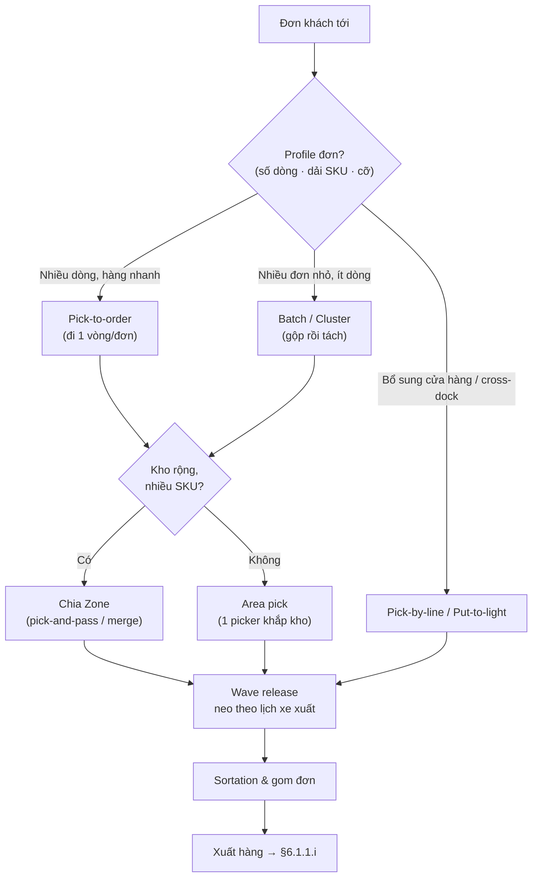

> [!IMPORTANT] 💡 INSIGHT — Ba trục độc lập, kết hợp tự do
> Sai lầm phổ biến là coi *batch / zone / wave* là ba lựa chọn loại trừ nhau. Thực tế chúng là **ba trục trực giao** chồng lên nhau: một kho e-commerce điển hình **batch** nhiều đơn nhỏ, nhặt theo **zone** (pick-and-pass trên băng tải), thả theo **wave** mỗi 2 giờ theo chuyến xe. Với vai trò thiết kế giải pháp/Control Tower, hãy mô hình hóa cấu hình picking như một **vector 3 chiều** *(cách gom × cách chia vùng × nhịp wave)* — đó là không gian thiết kế thực sự, không phải một menu chọn-một. Lưu ý điều phối: wave là *nhịp tim* gắn kết picking với despatch ([§6.1.1.i](#611-động-lực-học-dòng-chảy-kho-receiving--put-away--storage--picking--despatch)) và với lịch DRP/giao hàng thượng nguồn.

#### d. Ba nhóm thiết bị: Picker-to-goods / Goods-to-picker / Automated

Trên trục taxonomy ở §b, mỗi nhóm hệ tương ứng một dải thiết bị và một dải năng suất rất khác nhau (Richards ch.5; Rushton ch.18):

1. **Picker-to-goods (người tới hàng)** — phổ biến nhất hiện nay. Picker di chuyển bằng trolley/roll-cage, hand/powered pallet truck, low-level order picker (LLOP), hoặc high-level order picker (HLOP). Năng suất trolley thủ công 50–80 dòng/giờ, picker tốn *quá nửa thời gian để đẩy thiết bị*; HLOP rất chậm (<30 pick/giờ) vì phải nâng người lên cao. Đây là nhóm mà toàn bộ Toán routing/batching ở §g áp dụng.
2. **Goods-to-picker (hàng tới người)** — carousel (ngang/dọc), VLM, mini-load AS/RS, totes-to-picker, shelf-to-picker (robot kệ di động kiểu Kiva/Amazon). **Xóa bỏ travel** → 500–1.000 dòng/giờ/trạm; giảm 30–50% diện tích; tăng an ninh & độ chính xác (xử lý 1 SKU/lần). Trạm làm việc **ergonomic** là bắt buộc.
3. **Automated picking (tự động hoàn toàn)** — A-frame dispenser (tới 3.000 dòng/giờ, hàng đồng dạng như CD/dược/mỹ phẩm), layer picker (robot bóc lớp pallet), robot tay gắp (Schäfer Robo-Pick ~2.400 pick/giờ). Phù hợp throughput rất cao (>3.000 thùng/ngày), nhưng kém linh hoạt, vốn lớn, lệ thuộc hệ thống.

> [!IMPORTANT] 📐 Năng suất nhặt & cách quy đổi sang nhân lực (Richards ch.6)
> $$\text{Năng suất} = \frac{\text{Số thùng nhặt/ngày}}{\text{Giờ làm/ngày} \times \text{Số picker}}$$
> **Ví dụ (Waitrose):** $36\,000 \div 7.5 \div 35 = 137$ thùng/giờ/người. Nếu voice tăng **+10%** năng suất → 151 thùng/giờ. Giải ngược tìm số picker cần: $36\,000 \div 7.5 \div 151 \approx 32$ người ⇒ **giảm 3 picker**. Đây là cách lượng hóa ROI của một cải tiến picking thành *số đầu người tiết kiệm* — ngôn ngữ mà tài chính & C-level hiểu ngay.

> [!IMPORTANT] 💡 INSIGHT — "Goods-to-person" là cú lật ngược bài toán, không phải giải nhanh hơn
> Trong 50 năm, tối ưu picking là tối ưu *đường đi của người tới hàng* (picker-to-parts). Goods-to-person (kệ tự hành mang hàng tới trạm, Exotec/Kiva/AutoStore) **lật ngược bài toán**: thay vì tối thiểu quãng người đi, nó *xóa* quãng đi — biến bài toán TSP/routing (§g) thành bài toán *xếp hàng tại trạm* (queueing) và *điều phối robot*. Đây là ví dụ kinh điển: đôi khi bước nhảy lớn không đến từ *giải tốt hơn* bài toán cũ mà từ *đổi bài toán*. Nhưng (nối insight Phase maturity [§6.1.1.a](#611-động-lực-học-dòng-chảy-kho-receiving--put-away--storage--picking--despatch)) G2P chỉ hiệu quả khi IRA & dữ liệu vị trí đã chuẩn — lại quay về tầng nền IRA.

> [!NOTE] 🌐 Cách mạng goods-to-person & robot 2025–2026
> - **Goods-to-Person** (Exotec Skypod, AutoStore) tăng tốc do thiếu lao động & cam kết giao trong ngày (Mordor Intelligence; SellersCommerce, 2026).
> - **AMR di động kệ** hoàn vốn <24 tháng, ROI >250% (Locus Robotics, 2026); **RaaS** (Robot-as-a-Service) hạ rào cản vốn — ~1,3 triệu lượt lắp tới 2026 (ABI Research, dẫn qua SellersCommerce, 2026).
> - **AI pick-path** cắt >30% thời gian di chuyển (Appinventiv; Kanerika, 2025) — bản "động" của bài toán routing ở §g.

#### e. Sáu phương pháp truyền thông tin khi nhặt

Cùng một chiến lược nhặt có thể chạy trên nhiều **phương pháp truyền lệnh** khác nhau — đây là "lớp thông tin" của picking, và nó tác động trực tiếp vào hai thành phần $T_{\text{search}}$ và độ chính xác trong phân rã §b.2 (Richards ch.6; Rushton ch.18). Xếp theo mức tiến hóa:

| Phương pháp | Cơ chế | Độ chính xác | Ghi chú |
|---|---|---|---|
| **Paper pick list** | Danh sách giấy theo thứ tự pick route | Thấp | Vốn rẻ, **không realtime**, lỗi chép tay, phải về văn phòng lấy list mới |
| **Pick by label** | Nhãn in sẵn theo thứ tự, dán lên từng món | Trung bình | Bỏ bớt 1 bước ở xuất; lộ ngay nếu lệch số nhãn |
| **Barcode scanning** | Quét mã xác nhận vị trí/SKU; realtime qua RF | Trung–cao | Xác nhận cả lỗi put-away; nhược: phải đặt máy xuống khi thao tác → dễ lỗi. Wearable/ring-scanner giải phóng 2 tay |
| **Pick by voice** | Tai nghe + mic, lệnh thoại, đọc check-digit xác nhận | Cao (99,7–99,97%) | **Rảnh tay & mắt**, hợp kho lạnh/đông; ROI thường <1 năm; đa ngôn ngữ |
| **Pick / Put to light** | Đèn LED tại vị trí báo số lượng; bấm tắt xác nhận | Cao (99,5–99,7%) | Mắt thấy nhanh hơn não dịch lệnh thoại; **mọi vị trí của đơn sáng cùng lúc** → picker tự chọn đường tối ưu; hợp zone & store replenishment |
| **RFID** | Sóng radio, đọc **nhiều món cùng lúc**, không cần line-of-sight | Cao | Đắt hơn barcode; lỗi gần kim loại/chất lỏng; hợp định danh unit-load (pallet, roll-cage, tote) |

> [!IMPORTANT] 📐 Toán chi phí của sai sót (cost of mis-pick) — Richards ch.6
> Kho nhặt **500.000 thùng/tuần**, độ chính xác 99,8% (2 lỗi/1.000) → **52.000 lỗi/năm**. Nâng lên 99,96% (0,4/1.000) → giảm **41.600 lỗi**. Với chi phí mỗi mis-pick ≈ £25 ($39): tiết kiệm ≈ **£1,04 triệu/năm**.
> ⇒ Trong vận hành lớn, **một cải thiện nhỏ về độ chính xác tạo payback khổng lồ** — đây là luận cứ tài chính mạnh nhất để đầu tư voice/light. So sánh chi phí–độ chính xác (Wulfratt 2013, kho 100.000 ft², 25 picker, 2.500 SKU):
> | Công nghệ | Độ chính xác | Chi phí (≈) |
> |---|---|---|
> | RF hand-held | 99,3–99,5% | $108.000 |
> | RF visual hand-held | 99,4–99,6% | $120.000 |
> | Voice | 99,7–99,97% | $188.000–$280.000 |
> | Pick-to-light | 99,5–99,7% | $300.000–$425.000 |

#### f. Bố cục pick face, Pick route & Replenishment

**Pick face** (Rushton ch.18): nguyên tắc — *dồn tồn kho nhặt vào diện tích nhỏ nhất khả thi* để cắt travel; do đó tách **reserve** (dự trữ) khỏi **picking** (working). Lượng hàng để ở pick slot là một **đánh đổi**: slot nhỏ → ít travel nhưng phải bổ sung nhiều; slot lớn → ít bổ sung nhưng đi xa hơn. **Carton flow rack** giải đẹp mâu thuẫn này (chứa sâu trong mặt nhặt hẹp, FIFO). "Golden zone" = vị trí ngang tầm hông + gần đầu/cuối tuyến nhặt → dành cho SKU nhặt nhiều nhất (định lượng bằng COI tại [§6.1.3](#613-tối-ưu-vị-trí-xếp-hàng-slotting-bằng-cube-per-order-index-coi)).

**Pick route** (Rushton ch.18) — các *chính sách định tuyến* trong lối đi, sẽ định lượng ở §g:

- **S-shape / Traversal:** đi rắn bò — lên lối này, xuống lối kế, **xuyên hết mọi lối có pick**.
- **Return:** vào và ra cùng một đầu, chỉ tới pick **sâu nhất** mỗi lối.
- **Midpoint:** chia lối làm hai nửa, tiếp cận từng đầu.
- **Largest gap:** đi tới "khe trống lớn nhất" rồi quay lại — tinh vi hơn, thường ngắn hơn S-shape khi pick thưa.

> [!IMPORTANT] 🔑 Replenishment — chân đế thầm lặng của picking
> Rushton (ch.18): *"order picking thành công phụ thuộc vào một quy trình replenishment hiệu quả."* Bổ sung **quá sớm** → tràn pick face, phải double-handle, phá FIFO; **quá muộn** → picker tới slot rỗng, đơn không hoàn tất (một dạng nút cổ chai tức thời). Cách chữa tốt nhất: **dựa replenishment vào số lượng đơn đã biết của wave kế tiếp** (thường biết trước vài giờ) thay vì chờ trigger min-level. Tách aisle/giờ nhặt và bổ sung để không cản nhau.

#### g. Góc Toán tối ưu — Order Batching & Pick Routing

Đây là **lăng kính đòn bẩy cao nhất** của picking: cùng một layout vật lý, thuật toán gộp đơn + định tuyến tốt hơn cắt 30–60% quãng đi **mà không tốn thêm vốn**. Hai bài toán lõi, mỗi cái có một nền học thuật vững:

| Bài toán | Phát biểu | Lớp toán / phương pháp | Độ khó |
|---|---|---|---|
| **Pick Routing** | Thứ tự ghé các vị trí trong 1 lượt nhặt sao cho **tổng quãng đi ngắn nhất** | **TSP** (Travelling Salesman); trong kho 1 khối có **nghiệm chính xác đa thức** (Ratliff & Rosenthal 1983, quy hoạch động); thực chiến dùng heuristic S-shape/Return/Largest-gap | NP-hard *tổng quát*; **đa thức** cho kho 1 khối |
| **Order Batching** | Gom các đơn thành nhóm (≤ sức chứa xe) để **tối thiểu tổng quãng đi của mọi lượt** | **Set Partitioning** (chính xác, MILP); heuristic: **seed algorithm**, **savings (Clarke & Wright 1964)**, **clustering** | NP-hard với ≥3 đơn/lượt (Gademann & van de Velde 2005) |

> [!IMPORTANT] 💡 INSIGHT — Vì sao kho "thuần hóa" được bài toán TSP nổi tiếng khó
> TSP tổng quát là NP-hard — không thuật toán nào giải tối ưu nhanh cho hàng nghìn điểm. Nhưng **Ratliff & Rosenthal (1983)** chứng minh một kết quả đẹp: trong **kho một khối** (các lối song song, hai cross-aisle đầu–cuối), pick routing tối ưu giải được bằng **quy hoạch động với thời gian tuyến tính theo số lối** — vì cấu trúc lối đi giới hạn số "trạng thái" hợp lệ tại mỗi cross-aisle. Đây là lý do *kho được thiết kế lưới chữ nhật không phải tình cờ*: cấu trúc lưới biến một bài toán nan giải thành bài toán giải được. Khi kho có **nhiều block** (Roodbergen & de Koster 2001), độ khó tăng và heuristic trở lại ngự trị — một lý do thực tế để hạn chế số cross-aisle.

Phân rã thời gian (§b.2) cho thấy $T_{\text{travel}} \approx 50\%$ là biến trội, nên hai đòn bẩy lớn nhất chính là **batching** (chia sẻ quãng đi giữa nhiều đơn) và **routing** (rút ngắn từng vòng). Ta minh họa cả hai bằng một kho nhỏ *dò tay được*.

> [!IMPORTANT] 📐 Đề bài (dữ liệu cho sẵn — không random)
> **Kho 1 khối:** 5 lối đi đánh số 0–4, mỗi lối **sâu $L = 20$ m**, hai lối cạnh nhau cách **$SP = 5$ m** (tâm–tâm). **Depot** (điểm xuất phát & kết thúc của picker) ở **đầu trước của lối 0**.
>
> **Vị trí 8 SKU** — tọa độ *(lối, độ sâu tính từ đầu trước, m)*:
>
> | SKU | Lối | Độ sâu | | SKU | Lối | Độ sâu |
> |---|---|---|---|---|---|---|
> | S1 | 0 | 6 | | S5 | 2 | 8 |
> | S2 | 1 | 15 | | S6 | 3 | 12 |
> | S3 | 1 | 4 | | S7 | 4 | 5 |
> | S4 | 2 | 18 | | S8 | 4 | 16 |
>
> **4 đơn hàng cần nhặt:**
>
> | Đơn | Các SKU | Lối phải ghé |
> |---|---|---|
> | A | S1, S4, S7 | 0, 2, 4 |
> | B | S2, S3 | 1 |
> | C | S5, S6 | 2, 3 |
> | D | S8 | 4 |
>
> **Yêu cầu:** (1) tính quãng đi mỗi đơn theo hai chính sách **S-shape** và **Return**; (2) nếu **gộp đơn** (batch) với sức chứa xe ≤ 5 dòng/lượt thì tổng quãng đi giảm bao nhiêu?

**Mô hình quãng đi** (kho 1 khối, khoảng cách chữ nhật — rectilinear):

- **S-shape (traversal):** vào một lối có pick thì **xuyên hết chiều dài $L$** rồi sang lối kế ở đầu đối diện. Di chuyển ngang giữa lối $i$ và $j$ tốn $|i-j|\times SP$.
- **Return:** vào/ra **cùng đầu trước**, chỉ tới điểm pick **sâu nhất** của lối rồi quay lại → tốn $2\times d_{\max}$ theo chiều dọc mỗi lối.

> [!IMPORTANT] 📐 Tính tay 1 vòng — Đơn A theo S-shape
> Đơn A ghé lối {0, 2, 4}. Xuất phát ở lối 0, đầu trước:
> 1. Lối 0: ngang $|0-0|\times5 = 0$ → xuyên lối $+20$ (giờ ở đầu **sau**). Cộng dồn **20**.
> 2. Lối 2: ngang $|2-0|\times5 = 10$ → xuyên lối $+20$ (về đầu **trước**). Cộng dồn $20+10+20 = $ **50**.
> 3. Lối 4: ngang $|4-2|\times5 = 10$ → xuyên lối $+20$ (ở đầu **sau**). Cộng dồn $50+10+20 = $ **80**.
> 4. Đang ở đầu sau → xuống lại đầu trước $+20$ → **100**. Về depot (lối 0): $|4-0|\times5 = 20$ → **120**.
>
> ⇒ **Đơn A = 120 m**. Làm tương tự: B = 50, C = 70, D = 80 m. Code dưới đây tự động hóa đúng phép tính này.

```python
# === ĐỀ BÀI (dữ liệu cho sẵn, không random) ===
A, L, SP = 5, 20.0, 5.0       # 5 lối (0..4), sâu 20 m, cách nhau 5 m; depot = lối 0, đầu trước

sku_loc = {                    # SKU -> (lối, độ sâu từ đầu trước, m)
    "S1": (0, 6),  "S2": (1, 15), "S3": (1, 4),  "S4": (2, 18),
    "S5": (2, 8),  "S6": (3, 12), "S7": (4, 5),  "S8": (4, 16),
}
orders = {
    "A": ["S1", "S4", "S7"],   # lối 0,2,4
    "B": ["S2", "S3"],         # lối 1
    "C": ["S5", "S6"],         # lối 2,3
    "D": ["S8"],               # lối 4
}

# --- Chính sách S-shape (traversal): mô phỏng đường rắn bò, cộng từng chặng ---
def sshape(skus):
    aisles = sorted({sku_loc[s][0] for s in skus})
    dist, cur, at_back = 0.0, 0, False           # depot: lối 0, đầu trước
    for a in aisles:
        dist += abs(a - cur) * SP                # đi ngang theo cross-aisle hiện tại
        cur = a
        dist += L                                # xuyên hết chiều dài lối -> đổi đầu
        at_back = not at_back
    if at_back:                                  # đang ở đầu sau -> xuống lại đầu trước
        dist += L
    dist += cur * SP                              # về depot (lối 0)
    return dist

# --- Chính sách Return: vào/ra cùng đầu trước, chỉ tới pick sâu nhất mỗi lối ---
def return_policy(skus):
    deepest = {}
    for s in skus:
        a, d = sku_loc[s]
        deepest[a] = max(deepest.get(a, 0.0), d)
    dist, cur = 0.0, 0
    for a in sorted(deepest):
        dist += abs(a - cur) * SP
        cur = a
        dist += 2 * deepest[a]                    # lên pick sâu nhất rồi quay lại đầu
    dist += cur * SP
    return dist

# --- (1) Pick-to-order: nhặt từng đơn một ---
print("--- Pick-to-order (tung don) ---")
tot_s = tot_r = 0.0
for name, skus in orders.items():
    s, r = sshape(skus), return_policy(skus)
    tot_s += s; tot_r += r
    print(f"Don {name}: S-shape={s:5.0f} m | Return={r:5.0f} m")
print(f"TONG       : S-shape={tot_s:5.0f} m | Return={tot_r:5.0f} m")

# --- (2) Batch picking: gộp đơn ≤ CAP dòng/lượt, greedy theo lối nhỏ nhất ---
CAP = 5
seq = sorted(orders, key=lambda n: min(sku_loc[s][0] for s in orders[n]))
batches, cur, load = [], [], 0
for n in seq:
    if load + len(orders[n]) > CAP and cur:
        batches.append(cur); cur, load = [], 0
    cur += orders[n]; load += len(orders[n])
if cur:
    batches.append(cur)

print("\n--- Batch picking (CAP=5 dong, S-shape) ---")
tot_b = 0.0
for i, b in enumerate(batches, 1):
    d = sshape(b); tot_b += d
    print(f"Batch {i} ({len(b)} dong, loi {sorted({sku_loc[s][0] for s in b})}): {d:.0f} m")
print(f"TONG batch : {tot_b:.0f} m")
print(f"\nTiet kiem Return vs S-shape (single): {100*(tot_s-tot_r)/tot_s:.1f}%")
print(f"Tiet kiem Batch  vs single (S-shape): {100*(tot_s-tot_b)/tot_s:.1f}%")
```

```text
--- Pick-to-order (tung don) ---
Don A: S-shape=  120 m | Return=   98 m
Don B: S-shape=   50 m | Return=   40 m
Don C: S-shape=   70 m | Return=   70 m
Don D: S-shape=   80 m | Return=   72 m
TONG       : S-shape=  320 m | Return=  280 m

--- Batch picking (CAP=5 dong, S-shape) ---
Batch 1 (5 dong, loi [0, 1, 2, 4]): 120 m
Batch 2 (3 dong, loi [2, 3, 4]): 120 m
TONG batch : 240 m

Tiet kiem Return vs S-shape (single): 12.5%
Tiet kiem Batch  vs single (S-shape): 25.0%
```

> [!NOTE] 💻 Đọc kết quả & hướng nâng cấp
> - **Đơn A = 120 m** khớp đúng phần tính tay ở trên → công thức minh bạch, kiểm chứng được.
> - **Return tiết kiệm 12,5%** so với S-shape ở bộ đơn này vì các đơn *pick thưa* (ít lối, pick nông) — không đáng để xuyên hết lối. Nhưng khi một lối có nhiều pick rải sâu, S-shape lại thắng. Đây đúng phát hiện của Petersen (1997): *không heuristic nào trội tuyệt đối* — hiệu quả phụ thuộc mật độ pick, nên WMS tốt **chọn chính sách động theo mật độ pick từng vòng**.
> - **Batching cắt 25%**: gộp A+B (lối {0,1,2,4}) và C+D (lối {2,3,4}) khiến các lần xuyên lối được **chia sẻ** giữa nhiều đơn thay vì lặp lại. Đây là đòn bẩy *rẻ nhất* — chỉ là logic phần mềm, không cần thiết bị.
> - **Câu hỏi còn bỏ ngỏ:** hai chính sách trên là *heuristic* — chúng cách nghiệm **tối ưu** bao xa? Để trả lời phải **giải bài toán tối ưu thật** (TSP), làm ngay dưới đây.

##### Lab định lượng — GIẢI TSP định tuyến nhặt & đo khoảng cách tới nghiệm tối ưu

Hai chính sách S-shape/Return ở trên là **heuristic** — nhanh nhưng không đảm bảo tối ưu. Để biết chúng *tốt đến đâu*, ta phát biểu và **giải bài toán tối ưu thật**: định tuyến nhặt là một **Travelling Salesman Problem (TSP)** — tìm thứ tự ghé các điểm pick (xuất phát & kết thúc tại depot) sao cho **tổng quãng đi nhỏ nhất**.

> [!IMPORTANT] 📐 Mô hình khoảng cách & lời giải
> **Khoảng cách mạng lưới (rectilinear) giữa hai điểm** $p=(a_1,d_1)$ và $q=(a_2,d_2)$ trong kho 1 khối (cross-aisle ở **đầu trước d=0** và **đầu sau d=L**):
> $$\text{dist}(p,q)=\begin{cases}|d_1-d_2| & a_1=a_2\\[4pt]|a_1-a_2|\cdot SP + \min\big(d_1{+}d_2,\ (L{-}d_1){+}(L{-}d_2)\big) & a_1\ne a_2\end{cases}$$
> Khác lối thì đi dọc tới cross-aisle **gần hơn** (đầu trước *hoặc* đầu sau — chính là số hạng $\min$), băng ngang $|a_1-a_2|\cdot SP$, rồi dọc tới đích. **Lời giải tối ưu:** với số điểm nhỏ, **brute-force mọi hoán vị** (TSP exact) cho nghiệm tối ưu toàn cục — cùng cách đã dùng ở [§6.1.4.f](#614-cross-docking-chuyên-sâu).

> [!IMPORTANT] 📐 Tính tay — Đơn A theo TSP tối ưu
> Đơn A ghé S1(0,6), S4(2,18), S7(4,5); depot (0,0). Khoảng cách từng cặp (dùng công thức trên): D–S1=6, D–S4=28, D–S7=25, S1–S4=26, S1–S7=31, S4–S7=27.
> Hai tuyến tốt nhất **đối xứng**: D→S1→S4→S7→D = 6+26+27+25 = **84 m**, và D→S7→S4→S1→D = 84 m. (4 hoán vị còn lại cho 92–110 m.)
> ⇒ **Đơn A tối ưu = 84 m**, so với S-shape 120 m và Return 98 m — heuristic *bỏ phí* 30% (so S-shape) và 14% (so Return) ở riêng đơn này. Code dưới giải cả 4 đơn.

```python
from itertools import permutations

# === DE BAI (cung kho 1 khoi voi phan S-shape/Return o tren) ===
L, SP = 20.0, 5.0
DEPOT = (0, 0.0)                       # dau truoc loi 0
sku_loc = {
    "S1": (0, 6),  "S2": (1, 15), "S3": (1, 4),  "S4": (2, 18),
    "S5": (2, 8),  "S6": (3, 12), "S7": (4, 5),  "S8": (4, 16),
}
orders = {"A": ["S1","S4","S7"], "B": ["S2","S3"], "C": ["S5","S6"], "D": ["S8"]}

def dist(p, q):                         # khoang cach rectilinear trong kho 1 khoi
    (a1, d1), (a2, d2) = p, q
    if a1 == a2:
        return abs(d1 - d2)
    return abs(a1 - a2) * SP + min(d1 + d2, (L - d1) + (L - d2))

def optimal_tour(skus):                 # TSP exact: thu moi hoan vi, lay min
    pts = [sku_loc[s] for s in skus]
    best = float("inf")
    for perm in permutations(pts):
        seq = [DEPOT] + list(perm) + [DEPOT]
        best = min(best, sum(dist(seq[i], seq[i+1]) for i in range(len(seq)-1)))
    return best

# (sshape & return_policy: dung lai dung 2 ham o phan §g tren)
def sshape(skus):
    aisles = sorted({sku_loc[s][0] for s in skus})
    d, cur, back = 0.0, 0, False
    for a in aisles:
        d += abs(a-cur)*SP; cur=a; d += L; back = not back
    if back: d += L
    d += cur*SP
    return d

def return_policy(skus):
    deep = {}
    for s in skus:
        a, dep = sku_loc[s]; deep[a] = max(deep.get(a, 0.0), dep)
    d, cur = 0.0, 0
    for a in sorted(deep):
        d += abs(a-cur)*SP; cur=a; d += 2*deep[a]
    d += cur*SP
    return d

print(f"{'Don':4}{'S-shape':>9}{'Return':>9}{'TSP-opt':>9}")
tS = tR = tO = 0
for n, sk in orders.items():
    s, r, o = sshape(sk), return_policy(sk), optimal_tour(sk)
    tS += s; tR += r; tO += o
    print(f"{n:4}{s:9.0f}{r:9.0f}{o:9.0f}")
print(f"{'TONG':4}{tS:9.0f}{tR:9.0f}{tO:9.0f}")
print(f"TSP-opt vs S-shape: -{100*(tS-tO)/tS:.1f}%")
print(f"TSP-opt vs Return : -{100*(tR-tO)/tR:.1f}%")
```

> [!NOTE] 💻 Kết quả (đã verify bằng máy — Đơn A = 84 khớp tính tay)
> ```
> Don   S-shape   Return  TSP-opt
> A         120       98       84
> B          50       40       40
> C          70       70       70
> D          80       72       72
> TONG      320      280      266
> TSP-opt vs S-shape: -16.9%
> TSP-opt vs Return : -5.0%
> ```
> **Đọc nghiệm — đây là "thước đo gap" mà heuristic không tự cho biết:**
> - Tối ưu thật **cắt 16,9%** so S-shape, **5,0%** so Return trên cả bộ đơn — *chỉ bằng đổi thứ tự ghé*, không tốn một xu.
> - **Gap không đều giữa các đơn:** đơn A (pick thưa, rải 3 lối) heuristic phí tới 30%; đơn C/D heuristic *đã chạm tối ưu* (gap 0) vì pick sâu buộc gần như phải xuyên lối. ⇒ Đây là bằng chứng định lượng cho phát hiện **Petersen (1997)**: *không heuristic nào trội tuyệt đối* — và quan trọng hơn, **giá trị của routing động** nằm đúng ở những đơn có gap lớn.
> - Vì gap *thay đổi theo profile đơn*, WMS tối ưu nên **đo gap rồi chọn chính sách động** thay vì cố định một heuristic.

> [!WARNING] 🪤 Giả định, điều kiện hiệu lực & giới hạn của mô hình định tuyến
> Biết mô hình *sai ở đâu* mới là mức thạc sĩ — TSP trên đây đúng trong khung sau và lệch ngoài nó:
> - **Khoảng cách điểm–điểm rectilinear, kho *một khối*:** chỉ có cross-aisle ở hai đầu. Kho **nhiều khối** (có cross-aisle giữa) → đường đi phong phú hơn, brute-force điểm–điểm là *xấp xỉ*; nghiệm tối ưu đầy đủ cần **Ratliff & Rosenthal (1983)** — quy hoạch động giải **đa thức** đúng cho mô hình kho 1 khối, và mở rộng đa khối (**Roodbergen & de Koster 2001**).
> - **Brute-force chỉ khả thi cho đơn nhỏ:** $n!$ bùng nổ; đơn lớn phải dùng DP Ratliff–Rosenthal hoặc metaheuristic (GA, Ant Colony) — liên thông [M7 §7.6.3](07-transportation-network.md).
> - **Mô hình bỏ qua phần "vật lý mềm":** tắc nghẽn khi nhiều picker chung lối (congestion), bề rộng lối, thời gian tăng/giảm tốc, mệt mỏi người nhặt, và **tính toàn vẹn đơn** (gom đúng đơn). Đây là lý do quãng đường ngắn nhất *về lý thuyết* không luôn là thời gian ngắn nhất *thực tế*.
> - **Tách rời khỏi storage:** routing tối ưu trên một slotting cho trước; nếu slotting đổi ([§6.1.3](#613-tối-ưu-vị-trí-xếp-hàng-slotting-bằng-cube-per-order-index-coi)), gap đổi theo — hai trục **storage × routing** phải tối ưu *cùng nhau* (de Koster), tối ưu một trục là cục bộ.

> [!IMPORTANT] 💡 INSIGHT — Vì sao đây là đòn bẩy cao nhất cho nền Toán kinh tế của bạn
> Mua một đội AMR có thể tốn hàng triệu USD để cắt travel. **Một thuật toán batching/routing tốt hơn cắt 30–60% cùng quãng travel đó với chi phí gần bằng 0** — chỉ là cấu hình WMS (ví dụ đồ chơi trên đã cho 25%; công cụ AI thực tế đạt tới ~60%, Locus Robotics 2026). Với nền Toán tối ưu, đây là nơi tạo giá trị lớn nhất *trước khi* khách hàng đổ vốn vào tự động hóa — đúng nguyên lý "trí tuệ thuật toán rẻ hơn trí tuệ cơ khí" ([§6.1.1](#611-động-lực-học-dòng-chảy-kho-receiving--put-away--storage--picking--despatch)). Khi tư vấn DRP/Control Tower, hãy đưa **"travel distance / dòng nhặt" thành KPI**, và mô phỏng (như code trên) để chứng minh ROI của thay đổi quy trình *trước* khi đề xuất CapEx.

#### h. Case study & bẫy thực tế

> [!CAUTION] 📦 CASE STUDY — Asda (Walmart UK) & AutoStore: goods-to-person nén không gian
> Asda — chuỗi siêu thị #2 nước Anh, thuộc Walmart — lắp **AutoStore** (Swisslog) cho dòng hàng case nhỏ trên một tầng mezzanine (Richards ch.5). **Factfile:** 140 robot, 44.860 bin, 10 cổng nhặt, 6 trạm decant; mỗi cổng nhặt nhận **335 bin/giờ**. Robot luôn *làm trước* người để dòng bin tới cổng không gián đoạn; bin được giao **theo đúng trình tự đơn**. **Bài học:** lợi ích cốt lõi của goods-to-person không chỉ là tốc độ mà là **mật độ không gian** — đặt trên mezzanine để chừa mặt sàn cho việc khác, đồng thời mở rộng dần (thêm bin) theo nhu cầu.

> [!CAUTION] 📦 CASE STUDY — Waitrose: voice picking & cách đo ROI đúng
> Waitrose (John Lewis) triển khai **voice** thay paper/label/RDT tại 4 DC (Richards ch.6). Họ **đo năng suất trước và sau** (đúng nguyên tắc "không đo được thì không cải tiến được"): business case dự báo +7,5%, thực tế đạt **+8%** trung bình, độ chính xác tăng từ 98,68% → 98,88%, thời gian đào tạo picker mới giảm từ 2–3 tuần xuống **3–4 ngày**. **Bài học kép:** (1) voice rảnh tay phù hợp môi trường lạnh/đông; (2) hệ chỉ dùng check-digit *vị trí* (không xác nhận sản phẩm) → **dồn áp lực chính xác lên khâu put-away** — minh họa IRA là chân đế của mọi khâu sau ([§6.1.1.f](#611-động-lực-học-dòng-chảy-kho-receiving--put-away--storage--picking--despatch)).

> [!CAUTION] 📦 CASE STUDY — Yankee Candle & flexible zone + pick-to-light
> DC châu Âu của Yankee Candle (Bristol) lắp pick-to-light trên flow-rack chữ U, băng tải chạy giữa: **hiệu suất +50%, lỗi −>50%** (Richards ch.6). Điểm tinh tế: hệ tính **"flexible zone"** — mỗi wave nó *phân bố lại kích thước vùng cho từng picker* (tối đa 12 người) để dàn đều số pick → trực tiếp giải bài toán **cân bằng tải zone** ở §c. Cùng cơ chế batch của **QVC/home-shopping** (Richards ch.5): một sản phẩm lên sóng → bùng đơn, mỗi đơn 1–2 món → gộp thành một pick list lớn, nhặt một lượt rồi dán nhãn xuất.

> [!WARNING] 🪤 Bẫy thường gặp khi chọn & vận hành chiến lược nhặt
> - **Tự động hóa quy trình tồi:** xem §a — tối ưu thủ công trước.
> - **Bỏ quên parity của S-shape:** với đơn pick thưa, S-shape bắt xuyên hết lối là lãng phí — phải có chính sách Return/Largest-gap dự phòng (Petersen 1997).
> - **Zone mất cân bằng:** thả wave không kiểm soát volume → vùng tắc, vùng rỗi. Phải cân tải (flexible zone).
> - **Replenishment lệch nhịp:** trigger min-level dễ gây slot rỗng giữa wave cao điểm — dùng nhu cầu wave kế tiếp để bổ sung.
> - **Đầu tư cứng cho mùa vụ:** đỉnh Giáng sinh không phải lý do để full-automation (iForce, Richards ch.6) — thiết bị nằm chết 11 tháng/năm.

#### i. Tổng hợp & Liên kết chéo

> [!IMPORTANT] 💡 INSIGHT TỔNG HỢP — Lộ trình tối ưu picking theo mức trưởng thành
> Ánh xạ vào **Mô hình trưởng thành kho** ([§6.1.1.a](#611-động-lực-học-dòng-chảy-kho-receiving--put-away--storage--picking--despatch)):
> 1. **Phase 1–2 (ổn định nền):** chuẩn hóa SOP nhặt, đảm bảo IRA & replenishment, áp **slotting ABC** + **pick route** đúng — *không tốn vốn*.
> 2. **Phase 2→3 (số hóa):** chuyển paper → **voice/light**, bật **batching/zoning/wave** trong WMS, đưa *travel/dòng nhặt* lên dashboard.
> 3. **Phase 3→4 (tự động):** chỉ khi volume đủ lớn & ổn định mới đầu tư **goods-to-person/AMR**; mô phỏng ROI trước (Lab §g).
> Với vai trò DRP/Control Tower: **chất lượng chiến lược picking phụ thuộc thượng nguồn** — profile đơn (do demand planning), độ chính xác tồn kho (IRA), và nhịp wave (do lịch giao/DRP) quyết định trần hiệu quả của mọi thuật toán nhặt.

> [!NOTE] 🔗 Liên kết chéo
> Tâm điểm chi phí & dòng chảy: [§6.1.1](#611-động-lực-học-dòng-chảy-kho-receiving--put-away--storage--picking--despatch) · Slotting/COI/golden zone (định lượng): [§6.1.3](#613-tối-ưu-vị-trí-xếp-hàng-slotting-bằng-cube-per-order-index-coi) · Batch + cross-dock (pick-by-line khi nhận): [§6.1.4](#614-cross-docking-chuyên-sâu) · Cấu hình racking/flow-rack cho pick face: [§6.2.3](#623-hệ-lưu-trữ-selective--drive-in--push-back--pallet-flow--as-rs) · TSP/VRP & định tuyến nâng cao: [M7 §7.6.3](07-transportation-network.md) · IRA → độ chính xác nhặt: [§6.1.1.f](#611-động-lực-học-dòng-chảy-kho-receiving--put-away--storage--picking--despatch), [M4 §4.4.2](04-toi-uu-ton-kho.md) · Profile đơn (demand): [M2](02-demand-planning.md)

##### 📚 Nguồn (mục 6.1.2)

**Sách (nền chính):** Richards, *Warehouse Management* (ch.5 Picking strategies & equipment, ch.6 Order-picking methods); Rushton/Croucher/Baker, *The Handbook of Logistics & Distribution Management* (ch.18 Order picking & replenishment, ch.19 Receiving & dispatch); Arnold, *Introduction to Materials Management* (ch.12). Số liệu dẫn trong sách: Aberdeen Group (2009); Dematic (2009); Baker & Perotti (2008); Wulfratt/MWPVL (2013); CILT Warehouse Management course.

**Lớp học thuật toàn cầu (chuẩn sau-đại học):**
- de Koster, R., Le-Duc, T. & Roodbergen, K.J. (2007), *Design and control of warehouse order picking: A literature review*, EJOR — taxonomy hệ nhặt, phân rã thời gian, hai trục storage × routing.
- Ratliff, H.D. & Rosenthal, A.S. (1983), *Order-picking in a rectangular warehouse: A solvable case of the TSP*, Operations Research — định tuyến tối ưu đa thức cho kho 1 khối.
- Roodbergen, K.J. & de Koster, R. (2001), *Routing order pickers in a warehouse with a middle aisle*, EJOR — mở rộng đa block.
- Hall, R.W. (1993), *Distance approximations for routing manual pickers in a warehouse*, IIE Transactions — công thức xấp xỉ travel cho traversal vs return.
- Petersen, C.G. (1997), *An evaluation of order picking routeing policies*, IJOPM — mô phỏng so sánh heuristic định tuyến.
- Gademann, N. & van de Velde, S. (2005), *Order batching to minimize total travel time in a parallel-aisle warehouse*, IIE Transactions — chứng minh NP-hard.
- Clarke, G. & Wright, J.W. (1964), *Scheduling of vehicles from a central depot*, Operations Research — thuật toán tiết kiệm (savings), nền của batching heuristic.

**Deep research (web, bổ sung 2025–2026):**
- [Warehouse Automation Statistics — SellersCommerce](https://www.sellerscommerce.com/blog/warehouse-automation-statistics/)
- [Warehouse Robots Market — Mordor Intelligence](https://www.mordorintelligence.com/industry-reports/warehouse-robotics-market)
- [AI in Warehouse Management — Appinventiv](https://appinventiv.com/blog/ai-in-warehouse-management/)
- [What 2025 Taught Us — Logistics Viewpoints](https://logisticsviewpoints.com/2026/01/05/the-future-of-warehouse-automation-what-2025-taught-us/)

### 6.1.3. Tối ưu vị trí xếp hàng (Slotting) bằng Cube-Per-Order Index (COI) ✅

> **Nguyên tắc biên soạn & quy ước trình bày:**
> - **Nền chính = sách thực hành** (Richards *Warehouse Management* ch.4; Rushton/Croucher/Baker *Handbook* ch.18; Arnold ch.12).
> - **Lớp học thuật toàn cầu:** bài toán gán vị trí lưu — *Storage Location Assignment Problem* (de Koster et al. 2007), ba chính sách lưu trữ tối ưu (**Hausman, Schwarz & Graves 1976, *Management Science***), quy tắc COI và tính tối ưu single-command (**Heskett 1963**; **Kallina & Lynn 1976, *Interfaces***), nền QAP (**Koopmans & Beckmann 1957**). Đây là tầng *vì sao toán học* dưới mọi quy tắc slotting.
> - **Lý thuyết viết dày, giọng giáo trình**; **code Python tĩnh, dò tay được, verify bằng máy**; **deep research (web) chỉ BỔ SUNG** trong khối 🌐.

---

#### 📌 Bốn lăng kính trong mục 6.1.3

> Slotting là **bài toán định lượng thuần túy nhất** của kho: cùng một layout, một thuật toán xếp chỗ tốt hơn cắt 10–30% travel mà **không tốn một xu CapEx**. Trọng tâm kép: **Toán & Data** + **Thực thi**.

| Lăng kính | Mức nhấn | Thể hiện ở đâu trong mục này |
|---|---|---|
| 📐💻 **Toán & Data** | ●●● Trọng tâm | §b (chính sách gán vị trí lưu), §d (công thức COI + bất đẳng thức sắp xếp), §e (**giải COI tối ưu single-command** + **Lab GIẢI QAP exact khi có affinity**), §f (pick-face sizing theo σ) |
| 🛠️ **Thực thi** | ●●● Trọng tâm | §c (profiling & ABC kép), §g (SOP slotting, affinity, "10 điều răn") |
| 🎯 **Chiến lược** | ●● Bổ trợ | §a — slotting = đòn bẩy không-CapEx; "golden zone"; tái slotting theo mùa vụ |
| 🧭 **Hoạch định** | ●● Bổ trợ | §f — pick-face sizing theo biến động cầu; cube movement → chọn storage mode |

#### a. Slotting là gì và vì sao quan trọng

##### a.1 — Định nghĩa & quy mô lãng phí do slotting kém

**Slotting** là *công cụ tính vị trí tối ưu cho từng SKU trong kho* nhằm hai mục tiêu: (i) đặt hàng nhặt nhiều gần bến xuất, và (ii) đặt các SKU **hay ship cùng nhau** cạnh nhau ở pick face (Richards ch.4). Mục tiêu cuối cùng vẫn là **cắt quãng di chuyển** — kẻ thù số một đã nêu ở [§6.1.2](#612-chiến-lược-lấy-hàng-batch--zone--wave-picking). Slotting là biểu hiện *cụ thể nhất, ô-cụ-thể nhất* của mô hình chất lỏng (Bartholdi–Hackman, [§6.1.1.b](#611-động-lực-học-dòng-chảy-kho-receiving--put-away--storage--picking--despatch)): nếu mô hình chất lỏng nói "không gian nên tỷ lệ lưu lượng SKU", thì slotting là thuật toán *thực thi* nguyên lý đó xuống từng ô kệ.

> [!IMPORTANT] 🔑 Khái niệm cốt lõi — Quy mô lãng phí do slotting kém
> Frazelle (2002, dẫn trong Richards ch.4): *dưới **15% số SKU** trong kho được đặt ở vị trí hiệu quả nhất*, dẫn tới **tăng 10–30% chi phí thời gian di chuyển** và lãng phí vị trí lưu. ⇒ Slotting không phải "tinh chỉnh nhỏ" mà là một trong những đòn bẩy năng suất lớn nhất, lại **gần như miễn phí** (chỉ là logic + công sức di dời hàng).

##### a.2 — Phân biệt Layout / ABC / Slotting & ba lớp profile

Cần phân biệt rạch ròi ba khái niệm thường bị nhập nhằng. **Layout** ([§6.2.1](#621-hình-học-dòng-chảy-u-flow-vs-through-flow-layout)) quyết định *hình dạng tổng thể* của kho — khu nào ở đâu; nó là "bộ xương". **ABC classification** là *cách phân nhóm* SKU theo tầm quan trọng. Còn **slotting** là bước cụ thể nhất: *gán từng SKU vào từng vị trí lưu cụ thể* bên trong khung layout đã có, dựa trên phân nhóm ABC. Nói theo ngôn ngữ tối ưu, nếu layout là việc dựng *không gian nghiệm* thì slotting chính là bài toán **gán (assignment)** SKU ↔ vị trí — một bài toán phát biểu và giải được bằng toán tổ hợp (§b).

Một slotting tốt phải hợp nhất **ba lớp profile** làm đầu vào (Richards ch.4; Toolkit 1.7):

- *Item profile* — kích thước, trọng lượng, khả năng xếp chồng, điều kiện bảo quản của từng SKU.
- *Order profile* — tần suất SKU xuất hiện trên đơn, các cặp SKU hay đi cùng nhau (affinity).
- *Location profile* — kích thước khả dụng, tải trọng, độ cao tầm với, vị trí trên tuyến nhặt của từng ô.

Khái niệm trung tâm của slotting là **"golden zone"** — tập các vị trí *quý nhất*: ngang tầm hông (giảm cúi/với, an toàn ec-gô-nô-mi) và gần đầu/cuối tuyến nhặt (giảm travel). Mục tiêu của slotting là dành golden zone cho đúng những SKU "đáng giá" nhất theo COI (§d). Sau cùng, slotting **không phải việc làm một lần**: vận tốc SKU thay đổi theo mùa, theo khuyến mãi, theo vòng đời sản phẩm, nên slotting là một **kỷ luật liên tục** (re-slotting định kỳ; bản tự động hóa của nó là *dynamic slotting* bằng AI ở §i).

#### b. Khung học thuật toàn cầu: bài toán gán vị trí lưu (SLAP)

Ở cấp sau-đại học, slotting có tên chính thức: **Storage Location Assignment Problem (SLAP)** — gán tập SKU vào tập vị trí lưu để tối thiểu một hàm chi phí (thường là tổng quãng di chuyển kỳ vọng), dưới ràng buộc sức chứa và tương thích (de Koster, Le-Duc & Roodbergen 2007). Văn liệu chuẩn quy mọi cách slotting về **ba chính sách lưu trữ** (Hausman, Schwarz & Graves 1976):

- **Random storage (ngẫu nhiên):** mỗi pallet vào một ô trống bất kỳ phù hợp. *Suất dùng không gian cao nhất* (ít ô phải chừa), nhưng *quãng đi trung bình dài* (SKU nóng có thể nằm xa) và **bắt buộc WMS** để biết hàng ở đâu.
- **Dedicated / full-turnover (cố định theo vận tốc):** mỗi SKU một vị trí cố định, xếp theo *vận tốc* (turnover) hoặc COI. *Quãng đi ngắn nhất* (SKU nóng luôn gần I/O), nhưng *suất dùng không gian thấp* (~50%) vì mỗi ô phải chừa cho mức tồn đỉnh của SKU đó.
- **Class-based (theo lớp — dung hòa):** chia SKU thành vài lớp (A/B/C), mỗi lớp một *vùng* gần–xa I/O tương ứng, **ngẫu nhiên trong vùng**. Hausman–Schwarz–Graves (1976) chứng minh class-based *giữ được phần lớn lợi ích travel của full-turnover* mà *vẫn giữ được phần lớn lợi ích không gian của random* — nên nó là chính sách phổ biến nhất thực tế.

> [!IMPORTANT] 💡 INSIGHT — Slotting là một đánh đổi cube ↔ travel, và "số lớp" là núm chỉnh
> Ba chính sách trên không phải ba lựa chọn rời rạc mà là một *phổ liên tục* điều khiển bởi **số lớp**: 1 lớp = random (cube tối đa, travel tối đa); $n$ lớp = full-turnover/COI (travel tối thiểu, cube tối thiểu). Class-based với 3–5 lớp nằm ở "điểm ngọt" của đường cong đánh đổi. Đây *chính là* cùng một đánh đổi cube-utilization ↔ accessibility ở [§6.1.1.e](#611-động-lực-học-dòng-chảy-kho-receiving--put-away--storage--picking--despatch), chỉ nhìn từ góc slotting. Hệ quả thực chiến: *đừng hỏi "fixed hay random"* — hãy hỏi "**mấy lớp**", và lời giải tối ưu lại phụ thuộc giá lao động (travel) so với giá không gian (cube) tại địa phương.

Khi mục tiêu chỉ là **single-command travel** (mỗi pick là một chuyến khứ hồi từ I/O), bài toán gán có một nghiệm đẹp bất ngờ — quy tắc COI (§d). Nhưng khi pick là **dual-command** (kết hợp cất + lấy trong một chuyến) hoặc khi *affinity* giữa SKU quan trọng, hàm mục tiêu trở thành bậc hai (chi phí phụ thuộc *cặp* vị trí), và SLAP biến thành **Quadratic Assignment Problem (QAP)** (Koopmans & Beckmann 1957) — NP-hard, phải giải bằng MILP/heuristic (xem §e nâng cấp).

#### c. Profiling & ABC kép (Pareto)

Trước khi slotting phải **profiling** — phân tích pattern bán & đặc tính hàng. Công cụ lõi là **ABC classification** dựa trên **Luật Pareto 80/20** (Richards ch.4): ~80% hệ quả đến từ ~20% nguyên nhân. Trong kho:

- 80% doanh số đến từ ~20% SKU.
- 80% suất dùng khối (cube) đến từ ~20% SKU.
- 80% picks đến từ một nhóm nhỏ SKU.

> [!WARNING] 🪤 Bẫy chí mạng — ABC theo doanh số ≠ ABC để slotting
> ABC truyền thống xếp theo **doanh số** rồi đặt "hàng A" gần xuất. Nhưng slotting phải xếp theo **tần suất ghé pick face**, không phải số lượng bán. Ví dụ kinh điển (Richards ch.4):
> | Sản phẩm | Doanh số | Số đơn (lần ghé) |
> |---|---|---|
> | A | 10.000 đơn vị | **4** |
> | B | 1.000 đơn vị | **200** |
>
> A bán gấp 10 lần B nhưng chỉ ghé pick face **4 lần**, còn B ghé **200 lần**. ⇒ Chính **B** mới cần đặt gần bến xuất. Xếp theo doanh số thuần sẽ *giảm* năng suất.

Giải pháp: **ABC kép (double ABC)** — kết hợp **tần suất** và **khối lượng** thành lưới 9 ô (Richards ch.4):

| | Tần suất cao | Tần suất TB | Tần suất thấp |
|---|---|---|---|
| **Khối lượng cao** | AA — gần xuất, nhiều pick face | AB | AC |
| **Khối lượng TB** | BA | BB | BC |
| **Khối lượng thấp** | CA — nhặt lẻ, gần xuất | CB | CC — chậm, để xa/full-pallet |

Cách tính nhanh bằng Excel (Richards ch.4) — **"weighted volume" = cầu năm × tần suất xuất hiện trên pick list**:

| Mã SP | Cầu năm (000) | Tần suất pick | Weighted volume | % tích lũy | ABC |
|---|---|---|---|---|---|
| 85058 | 200 | 20.000 | 4.000.000 | 41,2 | A |
| 79001 | 250 | 15.000 | 3.750.000 | 79,9 | A |
| 67553 | 400 | 2.000 | 800.000 | 88,1 | B |
| 12865 | 600 | 1.000 | 600.000 | 94,3 | B |
| 13866 | 800 | 500 | 400.000 | 98,4 | C |
| 77212 | 1.000 | 1 | 1.000 | 100,0 | C |

> [!NOTE] 💻 Đọc bảng
> Mã 77212 cầu năm lớn nhất (1 triệu) nhưng **chỉ 1 lần pick/năm** → weighted volume thấp nhất → xếp loại C, để xa/nhặt thẳng full-pallet từ racking. Đây chính là cơ chế *trừng phạt* hàng "bán nhiều nhưng ghé ít" mà ABC-doanh-số bỏ sót.

#### d. Cube-Per-Order Index (COI) — tinh chỉnh từ ABC

ABC mới chỉ xét tần suất. **COI** tiến thêm một bước: đưa **không gian chiếm chỗ** vào, để dùng *vị trí quý nhất* (gần đầu/cuối tuyến nhặt) cho SKU **ghé nhiều nhưng tốn ít chỗ** (Rushton ch.18; Richards ch.4). COI được Heskett (1963) đề xuất và Kallina & Lynn (1976) phổ biến qua ứng dụng thực tế.

> [!IMPORTANT] 📐 Công thức COI
> $$\text{COI}_i = \frac{S_i \ (\text{không gian pick-face SKU } i)}{f_i \ (\text{số lần pick/ngày})}$$
> **COI càng thấp → đặt càng gần bến xuất.** Trực giác: SKU lý tưởng = *ghé nhiều ($f$ lớn) mà chiếm ít chỗ ($S$ nhỏ)* → COI nhỏ → "đáng" được vị trí vàng nhất.
> **Ví dụ (Rushton ch.18):** SKU1 cần 1 m³, 100 lần pick/ngày → COI = 0,01. SKU2 cần 1 m³, 20 lần/ngày → COI = 0,05. SKU1 (COI thấp hơn) đặt gần điểm xuất phát/kết thúc hơn.

> [!IMPORTANT] 💡 INSIGHT — Vì sao một quy tắc xếp hạng O(n log n) lại giải tối ưu một bài toán tổ hợp
> Sắp $n$ SKU vào $n$ nhóm vị trí để **tối thiểu tổng quãng di chuyển/ngày** nói chung là QAP — NP-hard. Nhưng với mục tiêu *single-command travel*, Heskett (1963) chứng minh **quy tắc COI cho nghiệm tối ưu chính xác**: cứ sắp tăng dần COI rồi lấp vị trí gần nhất trước. Lý do toán học: khi chi phí *tách rời* được theo từng SKU (mỗi SKU đóng góp $f_i \times 2\bar d$ độc lập), bài toán gán suy biến thành một bài toán *ghép cặp xếp hạng* mà **bất đẳng thức sắp xếp (rearrangement inequality)** đảm bảo: ghép $f$ lớn nhất với $d$ nhỏ nhất là tối ưu. Đây là ví dụ điển hình "cấu trúc bài toán cho phép greedy đạt optimal" — và cũng là *ranh giới*: chỉ cần thêm dual-command hay affinity, tính tách-rời mất, greedy không còn tối ưu, ta rơi lại vào QAP.

#### e. Góc Toán — Xếp slot theo COI bằng Python

**Đề bài (dữ liệu cho sẵn — dò tay được):**

> [!IMPORTANT] 📐 Đề bài
> Một dãy vị trí lưu xếp theo khoảng cách tăng dần tới bến xuất: **slot $k$ cách bến $10k$ mét** (một chiều), mỗi slot chứa **1 đơn vị không gian**. Mỗi lần pick là một chuyến **khứ hồi**. Có 6 SKU:
>
> | SKU | $f$ (picks/ngày) | $S$ (số slot) | COI = $S/f$ |
> |---|---|---|---|
> | A | 90 | 1 | 0,0111 |
> | B | 60 | 3 | 0,0500 |
> | C | 80 | 1 | 0,0125 |
> | D | 30 | 1 | 0,0333 |
> | E | 40 | 2 | 0,0500 |
> | F | 20 | 1 | 0,0500 |
>
> **Yêu cầu:** so sánh tổng quãng đi/ngày của 3 cách xếp: (1) *as-is* (theo tên), (2) *theo tần suất giảm dần* (popularity-only), (3) *theo COI tăng dần*. Quãng đi một SKU = $f \times 2 \times \overline{d}$ với $\overline{d}$ là khoảng cách trung bình các slot nó chiếm.

> [!IMPORTANT] 📐 Tính tay — SKU B theo cách COI
> Thứ tự COI tăng dần: A, C, D, rồi B/E/F (cùng COI 0,05, tie-break theo $f$ giảm dần → B, E, F). B nằm ở slot 4–6 (cách 40, 50, 60 m; trung bình 50). Quãng đi B = $60 \times 2 \times 50 = 6\,000$ m/ngày. Cộng toàn bộ → **22.400 m/ngày** (code xác nhận).

```python
# === ĐỀ BÀI (dữ liệu cho sẵn, không random) ===
UNIT = 10.0   # slot k cách bến xuất 10*k m (1 chiều); mỗi slot = 1 đơn vị không gian
sku = {       # SKU: (picks/ngày f, số slot không gian S)
    "A": (90, 1), "B": (60, 3), "C": (80, 1),
    "D": (30, 1), "E": (40, 2), "F": (20, 1),
}

def total_travel(order):
    """order: danh sách SKU theo thứ tự ưu tiên (gần -> xa). Trả về quãng đi/ngày (m)."""
    dist, slot = 0.0, 1
    for s in order:
        f, space = sku[s]
        avg = sum(UNIT * (slot + i) for i in range(space)) / space   # khoảng cách TB
        dist += f * 2 * avg                                          # khứ hồi mỗi pick
        slot += space
    return dist

asis = ["A", "B", "C", "D", "E", "F"]                          # (1) xếp theo tên
freq = sorted(sku, key=lambda s: -sku[s][0])                   # (2) tần suất giảm dần
coi  = sorted(sku, key=lambda s: (sku[s][1] / sku[s][0], -sku[s][0]))  # (3) COI tăng dần

for name, od in [("As-is", asis), ("Frequency-only", freq), ("COI-optimal", coi)]:
    print(f"{name:14s}: {od}  ->  {total_travel(od):8.0f} m/ngay")

base = total_travel(asis)
print(f"\nCOI vs As-is     : -{100*(base-total_travel(coi))/base:.1f}%")
print(f"COI vs Frequency : -{100*(total_travel(freq)-total_travel(coi))/total_travel(freq):.1f}%")
```

```text
As-is         : ['A', 'B', 'C', 'D', 'E', 'F']  ->     26600 m/ngay
Frequency-only: ['A', 'C', 'B', 'E', 'D', 'F']  ->     23400 m/ngay
COI-optimal   : ['A', 'C', 'D', 'B', 'E', 'F']  ->     22400 m/ngay

COI vs As-is     : -15.8%
COI vs Frequency : -4.3%
```

> [!NOTE] 💻 Đọc kết quả
> - **COI cắt 15,8%** so với xếp tùy tiện — cùng layout, cùng kệ, *không tốn CapEx*.
> - **COI vẫn thắng popularity-only 4,3%** vì nó *giáng cấp* B: B ghé nhiều (60/ngày) nhưng ngốn **3 slot** → nếu chỉ nhìn tần suất sẽ kéo B vào gần, đẩy C/D ra xa. COI nhận ra B "tốn chỗ" và lùi B lại. Đây chính là giá trị gia tăng của COI so với ABC thuần tần suất, và là biểu hiện số học của bất đẳng thức sắp xếp (§d).
> - **Ranh giới:** COI tối ưu *chỉ* khi chi phí **tách rời** được theo từng SKU (single-command). Khi có **affinity** (SKU hay đi cùng đơn) hay **dual-command**, chi phí thành **bậc hai** (phụ thuộc *cặp* vị trí) → bài toán thành **QAP**, và COI **không còn tối ưu**. Ta chứng minh điều đó bằng cách GIẢI một QAP nhỏ ngay dưới đây.

##### Lab định lượng — GIẢI QAP khi có affinity (nơi COI hết tối ưu)

Quy tắc COI đẹp vì chi phí *tách rời* theo từng SKU — nhưng đó cũng là *điều kiện hiệu lực* của nó. Khi nhiều SKU **hay được nhặt chung một đơn** (affinity), đặt chúng cạnh nhau cắt được quãng đi *giữa* chúng — một khoản tiết kiệm mà COI (chỉ nhìn từng SKU với bến xuất) **không thấy**. Lúc này hàm chi phí có số hạng phụ thuộc **cặp vị trí** → bài toán đúng là **Quadratic Assignment Problem** (Koopmans & Beckmann 1957), và ta sẽ **giải nó tới tối ưu** trên một ca nhỏ để đo COI sai bao nhiêu.

> [!IMPORTANT] 📐 Mô hình QAP (Koopmans–Beckmann)
> Gán 4 SKU vào 4 slot trên một dãy, slot $k$ cách bến $p_k$. Gọi $\sigma(i)$ = slot của SKU $i$, $f_i$ = tần suất pick, $w_{ij}$ = số đơn *đồng-pick* cặp $(i,j)$ (flow). Tổng chi phí:
> $$\min_{\sigma}\ \underbrace{2\sum_i f_i\,p_{\sigma(i)}}_{\text{single-command (như COI)}} \;+\; \underbrace{\sum_{i<j} w_{ij}\,\big|p_{\sigma(i)}-p_{\sigma(j)}\big|}_{\text{affinity — bậc hai theo cặp vị trí}}$$
> Số hạng đầu là chi phí khứ hồi từng SKU; số hạng sau là quãng đi *giữa* các SKU đồng-pick (đi slot→slot thay vì slot→bến→slot). Chính số hạng bậc hai phá tính tách-rời, làm greedy-COI hết tối ưu.

> [!IMPORTANT] 📐 Đề bài (dữ liệu cho sẵn — không random) & tính tay
> 4 SKU, kích thước bằng nhau (1 slot); slot cách bến $p=[1,2,3,4]$. Tần suất $f$: A=10, B=8, C=6, D=5. **Affinity:** cặp (A,D) đồng-pick **w=20** đơn, cặp (B,C) đồng-pick **w=10**.
> - **Theo COI** (size đều → xếp theo $f$ giảm dần): A→1, B→2, C→3, D→4. Single-command $=2(10{\cdot}1+8{\cdot}2+6{\cdot}3+5{\cdot}4)=128$; affinity $=20{\cdot}|1{-}4| + 10{\cdot}|2{-}3| = 60+10 = 70$ → **tổng 198**.
> - **Kéo D lên cạnh A** (A→1, D→2, B→3, C→4): single-command tăng nhẹ lên $2(10{+}10{+}24{+}24)=136$ (+8), nhưng affinity giảm mạnh xuống $20{\cdot}1+10{\cdot}1=30$ (−40) → **tổng 166 < 198**. Code brute-force xác nhận đây là tối ưu toàn cục.

```python
from itertools import permutations

# === DE BAI (du lieu cho san, khong random) ===
items = ["A", "B", "C", "D"]
f     = {"A": 10, "B": 8, "C": 6, "D": 5}      # picks/ngay (size = 1 deu nhau)
pos   = [1, 2, 3, 4]                            # 4 slot, khoang cach toi depot
affinity = {("A", "D"): 20, ("B", "C"): 10}     # so don dong-pick (flow QAP)

def cost(assign):                               # assign: SKU -> chi so slot (0..3)
    sc  = 2 * sum(f[i] * pos[assign[i]] for i in items)               # single-command
    aff = sum(w * abs(pos[assign[i]] - pos[assign[j]])               # affinity (bac hai)
              for (i, j), w in affinity.items())
    return sc + aff, sc, aff

coi_order = sorted(items, key=lambda s: -f[s])  # size deu => COI ~ f giam dan
coi = {s: k for k, s in enumerate(coi_order)}

best = best_a = None                            # QAP exact: thu moi hoan vi
for perm in permutations(range(4)):
    a = {s: perm[k] for k, s in enumerate(items)}
    c = cost(a)
    if best is None or c[0] < best[0]:
        best, best_a = c, a

ct, csc, caff = cost(coi)
bt, bsc, baff = best
show = lambda a: ", ".join(f"{s}->slot{a[s]+1}" for s in items)
print(f"COI        : {show(coi)} | total={ct} (SC={csc}, aff={caff})")
print(f"QAP-optimal: {show(best_a)} | total={bt} (SC={bsc}, aff={baff})")
print(f"QAP-opt vs COI: -{100*(ct-bt)/ct:.1f}%")
```

> [!NOTE] 💻 Kết quả (đã verify bằng máy — khớp tính tay)
> ```
> COI        : A->slot1, B->slot2, C->slot3, D->slot4 | total=198 (SC=128, aff=70)
> QAP-optimal: A->slot1, B->slot3, C->slot4, D->slot2 | total=166 (SC=136, aff=30)
> QAP-opt vs COI: -16.2%
> ```
> **Đọc nghiệm — đây là bằng chứng cho ranh giới ở §d:** QAP tối ưu kéo **D lên cạnh A** (và B,C cạnh nhau), *chịu lỗ 8 đơn vị single-command để lời 40 đơn vị affinity* → tổng giảm **16,2%**. COI **không thể** phát hiện nước đi này vì nó tối ưu từng SKU cô lập, mù với chi phí *cặp*. ⇒ Khẳng định "có affinity ⇒ COI hết tối ưu, phải giải QAP" không còn là lời nói suông mà là một con số. Cùng họ assignment bậc hai với door-assignment ([§6.1.4.f](#614-cross-docking-chuyên-sâu)) và slotting tổng quát.

> [!WARNING] 🪤 Giả định, điều kiện hiệu lực & giới hạn của lab QAP
> - **Brute-force chỉ khả thi cho $n$ nhỏ:** QAP là **NP-hard** (Koopmans–Beckmann 1957; Sahni & Gonzalez 1976 chứng minh không có xấp xỉ tỉ lệ hằng số trừ phi P=NP). $n!$ bùng nổ — 4 SKU = 24 hoán vị (tức thì), nhưng 15 SKU đã 1,3 nghìn tỷ. Thực chiến phải **tuyến tính hóa thành MILP** (biến nhị phân $x_{ik}$) hoặc dùng **metaheuristic** (local search, simulated annealing, GA, tabu) — liên thông [M7 §7.6](07-transportation-network.md), Liu ch.7.
> - **Mô hình affinity = flow × distance (Koopmans–Beckmann):** giả định chi phí cặp tỉ lệ *tuyến tính* với quãng giữa hai slot và các đơn đồng-pick được nhặt **liền kề** trong tour. Bỏ qua thứ tự nhặt cụ thể, congestion, và việc một đơn nhiều hơn 2 dòng (khi đó là bài toán tour đầy đủ, gần với routing §6.1.2).
> - **Single-command vs dual-command:** lab dùng baseline single-command (khứ hồi). Nếu cất–lấy ghép chuyến (dual-command) thì ngay cả số hạng "tuyến tính" cũng thành phụ-thuộc-cặp → QAP càng không tránh được.
> - **Dữ liệu affinity phải đủ tin cậy:** $w_{ij}$ ước từ lịch sử đơn (market-basket, §g) — IRA kém hoặc mẫu ngắn làm $w_{ij}$ nhiễu, nghiệm QAP "tối ưu" trên dữ liệu rác vẫn là rác (lại về tầng nền IRA [§6.1.1.f](#611-động-lực-học-dòng-chảy-kho-receiving--put-away--storage--picking--despatch)).

#### f. Pick-face sizing & Cube movement

Slotting không chỉ quyết *đặt ở đâu* mà còn *để bao nhiêu* tại pick face. Mục tiêu: **đủ hàng cho một ca mà không phải bổ sung giữa chừng** (Richards ch.4) — vì mỗi lần bổ sung giữa ca vừa tốn công vừa có nguy cơ tạo slot rỗng (nút cổ chai tức thời, [§6.1.2.f](#612-chiến-lược-lấy-hàng-batch--zone--wave-picking)).

> [!IMPORTANT] 📐 Pick-face sizing theo biến động cầu
> $$\text{Sức chứa pick face} = \overline{D} + k\sigma_D$$
> với $\overline{D}$ = cầu trung bình/ca, $\sigma_D$ = độ lệch chuẩn cầu. Chọn $k=2$ → ~5% khả năng phải bổ sung giữa ca; $k=3$ → ~1%. (Cùng logic *service level z-score* với safety stock, [M4 §4.3.3](04-toi-uu-ton-kho.md) — pick face thực chất là một "safety buffer" cho dòng nhặt.)
> **Ví dụ (Richards ch.4):** mã 989533, picks trong tuần = {11, 13, 19, 5, 7} → $\overline{D}=11$, $\sigma \approx 5$. ⇒ pick face nên chứa $11 + 2(5) = \mathbf{21}$ thùng (rủi ro 5%) hoặc $11 + 3(5) = \mathbf{26}$ thùng (rủi ro 1%). (Tính bằng `statistics.stdev` cho $\sigma=5{,}48$ → 22 và 27,4 — sách làm tròn $\sigma\approx5$.)

**Cube movement distribution** quyết định **storage mode** (Richards ch.4): SKU ship <0,5 m³/tháng → bin/shelf/flow-rack/carousel; SKU ship >50 m³/tháng → pallet racking. Đây là cầu nối sang [§6.2.3 (hệ lưu trữ)](#623-hệ-lưu-trữ-selective--drive-in--push-back--pallet-flow--as-rs).

#### g. SOP Slotting, Affinity & "10 điều răn"

> [!TIP] 🛠️ Quy trình slotting (SOP)
> 1. **Profiling:** thu thập dimensions/weight, nhóm hàng (hazard/temp/value), số SKU theo ABC, số đơn/kỳ, dòng/đơn, đơn vị/dòng, pick-face visits/SKU, family groups, **cặp SKU hay ship cùng nhau**.
> 2. **Phân loại ABC kép** (tần suất × khối lượng) → lưới 9 ô.
> 3. **Tính COI** từng SKU → xếp hạng tăng dần.
> 4. **Gán vị trí:** COI thấp → golden zone (ngang tầm hông, gần đầu/cuối tuyến); fast-mover nhiều pick face để tránh tắc.
> 5. **Affinity:** đặt cạnh nhau các SKU hay ship chung (giảm travel + lỗi).
> 6. **Pick-face sizing** theo $\overline{D}+k\sigma$.
> 7. **Tái slotting định kỳ** theo mùa vụ.

> [!NOTE] 💻 Affinity — đặt cạnh nhau những gì bán cùng nhau (Richards ch.4)
> Công cụ slotting đếm **số đơn chứa đồng thời cặp SKU**. Ví dụ (dữ liệu Bartholdi, warehouse-science.com): cặp (888058, 970327) cùng xuất hiện **164 đơn** → đặt sát nhau. Ngoài ra có thể tìm *nhóm nhỏ SKU hoàn tất nhiều đơn* để gom vào một khu. Đây là bài toán **market-basket / association rule** (liên thông phân tích giỏ hàng [M2](02-demand-planning.md)) — và chính *affinity* là yếu tố biến slotting từ bài toán xếp-hạng (COI) thành QAP (§b).

> [!TIP] 🛠️ "Mười điều răn của picking" (OPS 2009, dẫn trong Richards ch.4)
> ① Thiết kế linh hoạt & mở rộng được · ② Giữ picker luôn nhặt (không chờ/không làm việc khác) · ③ Tối thiểu travel · ④ Tối thiểu số lần chạm hàng · ⑤ Không bao giờ để picker tới ô rỗng · ⑥ Đo, đo, đo · ⑦ Nhặt logic, slot thông minh · ⑧ Nhặt đúng ngay lần đầu · ⑨ Liên tục học hỏi · ⑩ Cải tiến liên tục.

#### h. Case study & bẫy

> [!CAUTION] 📦 CASE STUDY — Profile thực của một khách hàng Richards (ch.4)
> Phân tích một khách hàng cho thấy **80% tổng đơn vị bán ra chỉ từ 5,9% (144) SKU** trong 2.443 SKU; thêm 202 SKU (8,3%) cho 10% kế tiếp; còn lại 86% SKU chỉ chiếm 10% doanh số. Theo *tần suất pick*: 80% picks đến từ 15% SKU. **Bài học:** đường cong Pareto thực tế *dốc hơn nhiều* 80/20 — chỉ ~6% SKU gánh phần lớn việc nhặt. Tập trung slotting golden zone cho nhóm "vital few" này cho ROI cao nhất, đồng thời lộ ra nhóm SKU "chết" (86%/10%) là ứng viên thanh lý.

> [!CAUTION] 📦 CASE STUDY — Tái slotting theo mùa & affinity nuts-and-bolts (Richards ch.4)
> - **Mùa vụ:** chuyển đồ nội thất sân vườn ra *mặt trước* kho vào xuân–hè, lùi ra *sau* vào đông (đưa hàng đông lên trước). Phát sinh thêm handling nhưng bù lại bằng tổng travel giảm.
> - **Affinity:** thay vì xếp nuts một khu, bolts một khu, hãy đặt **nut và bolt cùng cỡ cạnh nhau** — vì chúng *bán cùng nhau* (giảm travel) và *khác cỡ trông giống nhau* được tách ra (giảm lỗi 3/8" vs 1/2").

> [!WARNING] 🪤 Bẫy thường gặp khi slotting
> - **Slot theo doanh số thuần** → đặt nhầm hàng "bán nhiều ghé ít" vào golden zone (xem §c).
> - **Dồn hết pick vào một khu nhỏ** → tắc nghẽn pick face (Rushton ch.18); fast-mover cần **nhiều pick face**.
> - **Quên cube** → bỏ qua COI, để hàng cồng kềnh chiếm golden zone.
> - **Slot tĩnh, không tái slotting** → bỏ lỡ mùa vụ & dịch chuyển vận tốc SKU.
> - **WMS "vét pick face trước"** → ép picker lấy 30 thùng pick face + 30 thùng reserve cho đơn 60 thùng (Richards ch.4); đơn full-pallet phải lấy thẳng từ reserve.

#### i. Tổng hợp & Liên kết chéo

> [!IMPORTANT] 💡 INSIGHT TỔNG HỢP — Slotting là "AI-ready" và là KPI nền cho Control Tower
> Với vai trò Control Tower/DRP:
> 1. **Slotting là đòn bẩy không-CapEx đầu tiên** cần khai thác trước khi đề xuất AMR — như §e chứng minh, COI cắt ~16% travel chỉ bằng logic.
> 2. **COI/ABC là KPI nền** đáng đưa lên dashboard: theo dõi *% SKU đặt đúng vị trí COI* (Frazelle: thường <15%!) như một chỉ số sức khỏe kho, ngang hàng IRA & cube utilization ([§6.1.1.f](#611-động-lực-học-dòng-chảy-kho-receiving--put-away--storage--picking--despatch)).
> 3. **Slotting động (AI) là tương lai gần:** ML học pattern vận tốc SKU theo ngày/tuần và tái slot tự động — bản "sống" của COI tĩnh. Nhưng nền dữ liệu phải sạch (IRA cao) thì slotting động mới đáng tin — lại quay về tầng nền IRA.

> [!NOTE] 🌐 AI Dynamic Slotting (2025)
> AI tái định vị SKU theo vận tốc/kích thước/tần suất (Priority Software; Best Ops Chain AI, 2025); công cụ đặt tồn kho AI **cắt quãng nhặt tới ~60%** (Locus Robotics, 2026) — phiên bản động của COI tĩnh, và là class-based với số lớp cập nhật liên tục theo dữ liệu.

> [!NOTE] 🔗 Liên kết chéo
> Travel = kẻ thù & pick routing: [§6.1.2](#612-chiến-lược-lấy-hàng-batch--zone--wave-picking) · Mô hình chất lỏng (không gian ∝ lưu lượng) & cube utilization: [§6.1.1.b, §6.1.1.e](#611-động-lực-học-dòng-chảy-kho-receiving--put-away--storage--picking--despatch) · Storage mode theo cube: [§6.2.3](#623-hệ-lưu-trữ-selective--drive-in--push-back--pallet-flow--as-rs) · QAP/assignment & tối ưu: [M7 §7.6](07-transportation-network.md) · Affinity/market-basket: [M2](02-demand-planning.md) · z-score/service level: [M4 §4.3.3, §4.4.2](04-toi-uu-ton-kho.md)

##### 📚 Nguồn (mục 6.1.3)

**Sách (nền chính):** Richards, *Warehouse Management* (ch.4 Pick preparation); Rushton/Croucher/Baker, *The Handbook of Logistics & Distribution Management* (ch.18); Arnold, *Introduction to Materials Management* (ch.12). Số liệu/khái niệm dẫn trong sách: Frazelle (2002); WERC (2012 benchmarking); OPS (2009, "Ten Commandments"); van den Berg; John Bartholdi (warehouse-science.com).

**Lớp học thuật toàn cầu (chuẩn sau-đại học):**
- Heskett, J.L. (1963), *Cube-per-order index — a key to warehouse stock location*, Transportation & Distribution Management — quy tắc COI & tính tối ưu single-command.
- Kallina, C. & Lynn, J. (1976), *Application of the cube-per-order index rule for stock location in a distribution warehouse*, Interfaces — ứng dụng thực tế COI.
- Hausman, W.H., Schwarz, L.B. & Graves, S.C. (1976), *Optimal storage assignment in automatic warehousing systems*, Management Science — random / dedicated / class-based.
- Koopmans, T.C. & Beckmann, M. (1957), *Assignment problems and the location of economic activities*, Econometrica — nền Quadratic Assignment Problem (lab QAP §e).
- Sahni, S. & Gonzalez, T. (1976), *P-complete approximation problems*, JACM — QAP NP-hard & không xấp xỉ tỉ lệ hằng số (giới hạn của brute-force).
- de Koster, R., Le-Duc, T. & Roodbergen, K.J. (2007), *Design and control of warehouse order picking*, EJOR — SLAP & chính sách lưu trữ.

**Deep research (web, bổ sung 2025–2026):**
- [AI in Warehouse Management — Appinventiv](https://appinventiv.com/blog/ai-in-warehouse-management/)
- [Warehouse Automation Statistics — SellersCommerce](https://www.sellerscommerce.com/blog/warehouse-automation-statistics/)

### 6.1.4. Cross-Docking chuyên sâu ✅

> **Nguyên tắc biên soạn & quy ước trình bày:**
> - **Nền chính = sách thực hành** (Rushton/Croucher/Baker *Handbook* ch.19; Richards & Grinsted *Toolkit* 1.6; Richards *Warehouse Management* ch.3, ch.7).
> - **Lớp học thuật toàn cầu:** cross-dock như *năng lực cạnh tranh* (**Stalk, Evans & Shulman 1992, *HBR* — "Competing on Capabilities"**), điều kiện áp dụng (**Apte & Viswanathan 2000**), phân loại bài toán lập lịch cross-dock (**Boysen & Fliedner 2010, *Omega***), hình dạng tối ưu của cross-dock (**Gue & Bartholdi 2004, *Transportation Science***), bài toán gán cửa (**Tsui & Chang 1992**). Đây là tầng *vì sao* dưới mọi SOP cross-dock.
> - **Lý thuyết viết dày, giọng giáo trình**; **code Python tĩnh, dò tay được, verify bằng máy**; **deep research (web) chỉ BỔ SUNG** trong khối 🌐.

---

#### 📌 Bốn lăng kính trong mục 6.1.4

> Cross-docking trước hết là một **quyết định chiến lược chuỗi cung ứng** (đánh đổi tồn kho ↔ vận tải ↔ phối hợp), thực thi bằng **SOP phối hợp chặt**. Toán đóng vai trò ở bài toán *gán cửa & lập lịch xe*.

| Lăng kính | Mức nhấn | Thể hiện ở đâu trong mục này |
|---|---|---|
| 🎯 **Chiến lược** | ●●● Trọng tâm | §a–§c (cắt 3 khâu đắt nhất; cross-dock = năng lực cạnh tranh; quan điểm tổng-chi-phí-chuỗi), §g (đánh đổi) |
| 🛠️ **Thực thi** | ●●● Trọng tâm | §d (biến thể), §e (điều kiện ASN/coordination/48h/drive-in, SOP), §g (layout) |
| 📐💻 **Toán & Data** | ●● Bổ trợ | §f — **door assignment** (bài toán gán) + code Python brute-force tối ưu; lập lịch hub |
| 🧭 **Hoạch định** | ●● Bổ trợ | §e — đồng bộ lịch xe vào–ra; hub "xe chưa đến đủ thì chưa xuất" |

#### a. Cross-docking là gì

**Cross-docking** là kỹ thuật **nhận hàng rồi xuất thẳng mà không cất vào lưu trữ** — hàng chuyển trực tiếp từ bến nhận sang bến xuất, thường qua một bước **phân loại (sortation)** (Rushton ch.19; Toolkit 1.6). Soi qua mô hình dòng chảy ([§6.1.1.b](#611-động-lực-học-dòng-chảy-kho-receiving--put-away--storage--picking--despatch)), cross-dock là trường hợp cực hạn: ép *flow time* của hàng xuống gần 0, nên theo Little's Law ($WIP = \lambda W$) lượng tồn trên sàn cũng tiến về 0 — đó là toàn bộ bản chất kinh tế của kỹ thuật này.

> [!IMPORTANT] 🔑 Khái niệm cốt lõi — Cắt bỏ ba khâu đắt nhất
> Đối chiếu dòng chảy chuẩn ([§6.1.1.b](#611-động-lực-học-dòng-chảy-kho-receiving--put-away--storage--picking--despatch)): cross-dock **bỏ qua put-away → lưu trữ → picking** — đúng ba khâu tốn chi phí nhất (picking ~35%, lưu trữ chiếm phần lớn diện tích). Hàng chỉ ở lại site **tối đa ~48 giờ**, phần lớn rời đi sớm hơn nhiều (Toolkit 1.6).

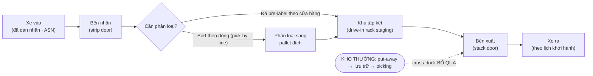

#### b. Khung học thuật: cross-dock là một *năng lực*, không phải một tính năng kho

Ở cấp chiến lược, đóng góp lý thuyết kinh điển nhất về cross-docking không đến từ sách kho mà từ *Harvard Business Review*: **Stalk, Evans & Shulman (1992), "Competing on Capabilities"** dùng chính hệ cross-docking của Walmart làm ví dụ trung tâm cho luận điểm *cạnh tranh dựa trên năng lực* (capability-based competition). Luận điểm: lợi thế của Walmart không nằm ở một tài sản hay một quyết định layout, mà ở một **năng lực tổ chức xuyên-chức năng** — hệ thống thông tin (vệ tinh), logistics (đội xe riêng), quan hệ NCC (EDI), và quy trình — *gắn kết với nhau* để hàng chảy liên tục từ NCC tới kệ mà gần như không dừng. Đây là lý do đối thủ *biết* Walmart cross-dock mà *không sao sao chép được*: sao chép một tính năng thì dễ, sao chép một năng lực hệ thống thì mất nhiều năm.

> [!IMPORTANT] 💡 INSIGHT — Vì sao "biết cách làm" mà vẫn không làm được
> Bài học cấp thạc sĩ từ Stalk et al. (1992): cross-docking là **năng lực, không phải công nghệ**. Một kho có thể mua đúng băng tải, đúng WMS, đúng layout through-flow mà cross-dock vẫn thất bại — vì thiếu cái *không mua được*: độ tin cậy giao hàng của NCC, kỷ luật ASN, sự đồng bộ lịch xe, niềm tin để NCC dán nhãn hộ. Điều này nối thẳng với **Mô hình trưởng thành kho** ([§6.1.1.a](#611-động-lực-học-dòng-chảy-kho-receiving--put-away--storage--picking--despatch)): cross-dock là năng lực *Phase 4 (Collaborative)* — đòi hỏi tích hợp liên tổ chức. Áp nó lên một chuỗi Phase 1–2 (IRA kém, NCC giao trễ) sẽ phản tác dụng. Với vai trò thiết kế giải pháp: *đừng bán cross-dock như một dự án IT — hãy đánh giá nó như một lộ trình xây năng lực*.

Apte & Viswanathan (2000) hệ thống hóa *khi nào* cross-dock hiệu quả thành hai biến quyết định: **(i) nhịp cầu cao & ổn định** (để lấp xe ra gần đầy, tránh bẫy LTL) và **(ii) chi phí tồn kho/độ tươi cao** (để lợi ích cắt tồn lớn). Tích của hai biến này là "điểm vào" của cross-dock — cũng chính là khung sàng lọc SKU ở §i.

Hai điểm cần giữ thế quân bình, không tụng một phía. **Thứ nhất, quan điểm "năng lực" tự nó có giới hạn.** Phê phán kinh điển dành cho trường phái capability/RBV (vd **Priem & Butler 2001, *Academy of Management Review***) là nó dễ rơi vào *hậu nghiệm và lặp vòng*: ta gọi cross-dock của Walmart là "năng lực" *vì* nó đã thắng, nên luận điểm "năng lực tạo lợi thế" khó bị bác và do đó ít giá trị kê đơn. Nó *mô tả* rất hay vì sao đối thủ khó sao chép, nhưng *không nói cho ta biết* một chuỗi cụ thể có nên xây năng lực này hay không — phần kê đơn ấy phải mượn từ Apte–Viswanathan (điều kiện cầu/tồn kho) và từ phân tích tổng-chi-phí-chuỗi ở §g, chứ không từ Stalk et al.

**Thứ hai, và quan trọng hơn với thời sự hậu-2020: cross-dock là một lập trường trong căng thẳng lean ⟷ resilience.**

> [!IMPORTANT] 💡 INSIGHT — Cross-dock là cực "lean", và mọi đồng tồn kho cắt đi là một đồng đệm chống sốc bị rút
> Cross-dock đẩy tồn kho trên sàn về ~0 (Little's Law, §a) — đó là tinh thần **lean/JIT** thuần khiết. Nhưng chính cái đệm bị rút đi là thứ hấp thụ biến động: khi NCC trễ một chuyến, kho thường (có tồn) vẫn giao được, còn cross-dock thì **đứt ngay tại dock** vì không có gì để rút ra. Đây là một mặt của tranh luận lớn **hiệu quả ⟷ chống chịu**: trường phái lean (Womack–Jones) tối thiểu hóa lãng phí/tồn kho; trường phái resilience hậu-COVID (vd **Sheffi**, *The Resilient Enterprise*; làn sóng "đệm chiến lược" 2021–2023) lại chủ trương *giữ* đệm có chủ đích ở các nút rủi ro. Cross-dock không "đúng" hay "sai" — nó **mua tốc độ + vốn lưu động bằng cách bán đi khả năng hấp thụ sốc**, và chỉ hợp lý khi thượng nguồn đủ tin cậy để không cần đệm đó (năng lực Phase 4, §b). Với vai trò thiết kế giải pháp: đừng cross-dock những tuyến/SKU nằm trên *đường găng rủi ro* của chuỗi — nối thẳng với tư duy tối ưu **toàn cục & chống chịu** ở [M1 §1.1.4](01-chien-luoc-rui-ro.md). Đây cũng là vì sao bẫy "đẩy tồn lên thượng nguồn" (§g) nguy hiểm: nó *giấu* tồn kho chứ không *xóa* rủi ro.

#### c. Vì sao cross-dock (lăng kính chiến lược)

Cross-dock **tăng tốc dòng chảy** qua chuỗi và là **kỹ thuật giảm tồn kho** (Rushton ch.19). Đặc biệt hợp:

- **Hàng tươi / hạn ngắn** (fresh, short-shelf-life) — phải chảy nhanh.
- **Hàng "đẩy" (push) đã phân bổ trước** — ví dụ thời trang đẩy ra cửa hàng theo mùa.
- **Hub bưu kiện / pallet** — gom & chia theo vùng địa lý.

> [!IMPORTANT] 💡 INSIGHT — Cross-dock là decoupling point dịch về phía "0 tồn kho"
> Nối với điểm tách (decoupling point) ở [§6.1.1.a](#611-động-lực-học-dòng-chảy-kho-receiving--put-away--storage--picking--despatch): cross-dock đẩy điểm giữ tồn kho **ra khỏi kho trung tâm**, biến DC từ *nơi trữ* thành *nơi luân chuyển*. Với vai trò DRP/Control Tower, đây là đòn bẩy **giải phóng vốn lưu động (giảm DIO → cải thiện C2C, [M8 §8.2.1](08-finance-scm.md))** — nhưng phải trả giá bằng phối hợp thượng nguồn cực chặt (xem §g). Câu hỏi chiến lược không phải "có cross-dock không" mà "**SKU/tuyến nào đủ điều kiện** để cross-dock".

#### d. Các biến thể cross-docking

| Biến thể | Cơ chế | Khi nào dùng |
|---|---|---|
| **Pre-labeled (pre-distributed)** | NCC dán nhãn sẵn theo từng cửa hàng/khách → chỉ việc chuyển thẳng sang cửa xuất | Bán lẻ chuỗi, hàng đã phân bổ trước |
| **Sort-by-line (pick-by-line)** | Hàng vào theo pallet 1 SKU → phân bổ sang pallet đích từng cửa hàng tới khi *cạn dòng* (pick-to-zero, [§6.1.2](#612-chiến-lược-lấy-hàng-batch--zone--wave-picking)) | Chưa phân bổ trước, cần tách tại dock |
| **Consolidation** | Gộp hàng cross-dock với hàng nhặt-từ-kho thành một chuyến | Đơn hỗn hợp hàng tươi + hàng tồn |
| **Sequencing centre** | Gom & xếp đúng *thứ tự* linh kiện đến chân chuyền sản xuất khi cần (JIT) | Cấp liệu sản xuất tinh gọn |

Phân loại này tương ứng với trục "mức độ phân loại tại dock" trong taxonomy của Boysen & Fliedner (2010): từ *không sort* (pre-labeled, chỉ chuyển) đến *sort theo đơn* (pick-by-line) — mức sort càng cao thì lợi ích phân phối càng lớn nhưng diện tích & độ phức tạp lập lịch càng tăng.

#### e. Điều kiện vận hành & SOP

Cross-dock chỉ chạy được khi **dòng thông tin đi trước dòng vật chất** (Toolkit 1.6) — một hệ quả trực tiếp của insight "dòng vật chất luôn có bóng thông tin" ([§6.1.1.b](#611-động-lực-học-dòng-chảy-kho-receiving--put-away--storage--picking--despatch)):

> [!TIP] 🛠️ SOP cross-docking
> 1. **ASN/EDI bắt buộc** — biết trước xe nào, hàng gì, đi đâu.
> 2. **Định danh nhanh ở đầu vào** — barcode/RFID *đồng bộ giữa NCC ↔ khách*; quét là hiện ngay lệnh "chuyển sang cửa xuất nào".
> 3. **NCC dán nhãn sẵn** hoặc hệ báo cho goods-in (qua chứng từ/voice/màn hình scanner) rằng đây là hàng transfer.
> 4. **Lý tưởng: xe xuất đã chờ sẵn** ở bến. Nếu chưa, đặt hàng vào khu outbound đã đánh dấu; thiếu chỗ thì dùng **drive-in racking để staging** (Toolkit 1.6, Figure 1.3).
> 5. **Đồng bộ vào–ra** là chìa khóa: hub bưu kiện *"một xe chưa thể khởi hành tới khi xe cuối chở hàng cho vùng của nó đã đến"*.

> [!NOTE] 🌐 Computer Vision & orchestration cho cross-dock (2026)
> CV receiving (camera + ML kiểm nhãn/kích thước/hư hỏng tức thời, Precision Warehouse Design 2026) làm khâu định danh đầu vào nhanh hơn — gỡ đúng nút thắt của cross-dock. Nền tảng orchestration realtime (Logistics Viewpoints, 2026) điều phối AMR/băng tải/người để dòng vào–ra khớp nhịp xe.

#### f. Góc Toán — Bài toán gán cửa (Door Assignment)

Khi thiết kế một cross-dock, một quyết định định lượng cốt lõi: **gán điểm đến nào cho cửa xuất nào** để **tối thiểu tổng quãng di chuyển hàng** qua sàn dock. Bài toán này có **hai mặt** mà phân biệt được chúng mới là cái khó:

- **Khi chi phí TÁCH ĐƯỢC** (mọi hàng vào từ một khu strip chung, chi phí của một đích chỉ phụ thuộc khoảng cách *cửa xuất* được gán, không phụ thuộc đích khác): đây là **Linear Assignment Problem (LAP)** và còn suy biến hơn nữa — lời giải đóng bằng **bất đẳng thức sắp xếp**, không cần thuật toán.
- **Khi chi phí KHÔNG tách được** (hàng cho một đích đến *rải qua nhiều cửa nhập*, nên quãng đường $D_i \to G_j$ phụ thuộc *cặp* cửa vào–ra): đây là **LAP tổng quát** (ma trận chi phí bất kỳ) — giải bằng **thuật toán Hungarian** $O(n^3)$ — hoặc, khi chi phí phụ thuộc cả vị trí *tương đối* giữa các cặp, là một **Quadratic Assignment Problem (QAP)** NP-hard mà Tsui & Chang (1992) nghiên cứu chính thức (dùng heuristic/MILP).

Tôi giải lần lượt cả hai để thấy rõ ranh giới: **trực giác "lớn nhất → gần nhất" CHỈ đúng ở mặt thứ nhất, và SAI ở mặt thứ hai.**

**f.1 — Trường hợp suy biến (một nguồn, chi phí tách được)**

> [!IMPORTANT] 📐 Đề bài (f.1)
> Một cross-dock có khu nhận chung (strip) và **4 cửa xuất** cách khu nhận lần lượt **10, 25, 40, 55 m**. Có **4 điểm đến** với khối lượng pallet/ngày: S1 = 120, S2 = 40, S3 = 90, S4 = 30. Chi phí của một điểm đến = *khối lượng × khoảng cách cửa được gán* (một chiều). **Yêu cầu:** gán điểm đến ↔ cửa để tổng chi phí nhỏ nhất; so với cách gán "as-is" (S1→cửa 1, S2→cửa 2, …).

> [!IMPORTANT] 📐 Tính tay (f.1) — nghiệm tối ưu
> Vì chi phí *tách* thành $\text{vol}_i \times \text{dist}_j$, **bất đẳng thức sắp xếp** cho nghiệm tối ưu đóng: ghép **khối lượng lớn nhất với khoảng cách nhỏ nhất**. Xếp giảm dần S1(120), S3(90), S2(40), S4(30) ứng với cửa 10, 25, 40, 55 m:
> $$120(10) + 90(25) + 40(40) + 30(55) = 1200 + 2250 + 1600 + 1650 = \mathbf{6\,700}$$
> So với as-is $= 120(10)+40(25)+90(40)+30(55) = 7\,450$. Đây cùng một nguyên lý với COI ở [§6.1.3.d](#613-tối-ưu-vị-trí-xếp-hàng-slotting-bằng-cube-per-order-index-coi). Brute-force xác nhận 6.700 là tối ưu toàn cục.

```python
# === DE BAI f.1 (du lieu cho san, khong random) — chi phi TACH duoc ===
from itertools import permutations

stores = {"S1": 120, "S2": 40, "S3": 90, "S4": 30}   # khoi luong pallet/ngay
door_dist = [10, 25, 40, 55]                          # khoang cach tung cua xuat (m)

names = list(stores)
vol = [stores[n] for n in names]

def cost(assign):                 # assign[j] = chi so cua gan cho store j
    return sum(vol[j] * door_dist[assign[j]] for j in range(len(names)))

asis  = tuple(range(len(names)))                              # S1->cua0, S2->cua1, ...
best  = min(permutations(range(len(names))), key=cost)        # brute-force 4! = 24 hoan vi
worst = max(permutations(range(len(names))), key=cost)

def show(label, a):
    pairs = ", ".join(f"{names[j]}->cua{a[j]}({door_dist[a[j]]}m)" for j in range(len(names)))
    print(f"{label:9s}: {pairs} | cost={cost(a)}")

show("As-is", asis); show("Optimal", best); show("Worst", worst)
print(f"\nOptimal vs As-is: -{100*(cost(asis)-cost(best))/cost(asis):.1f}%")
```

```text
As-is    : S1->cua0(10m), S2->cua1(25m), S3->cua2(40m), S4->cua3(55m) | cost=7450
Optimal  : S1->cua0(10m), S2->cua2(40m), S3->cua1(25m), S4->cua3(55m) | cost=6700
Worst    : S1->cua3(55m), S2->cua1(25m), S3->cua2(40m), S4->cua0(10m) | cost=11500

Optimal vs As-is: -10.1%
```

Gán tối ưu cắt **10,1%** quãng di chuyển — cải tiến *không tốn CapEx*, chỉ là quy tắc gán cửa trong WMS. **Nhưng** nghiệm này dễ tới mức gây ngộ nhận: vì chi phí tách được, tối ưu hóa *thoái hóa thành một phép sort*. Đời thực hiếm khi sạch như vậy — và đó là lúc cần mặt thứ hai.

**f.2 — Trường hợp tổng quát (đa nguồn, chi phí không tách) → Hungarian; trực giác greedy SAI**

> [!IMPORTANT] 📐 Đề bài (f.2)
> Cross-dock có **4 cửa nhập** rải dọc nhà; hàng cho mỗi điểm đến tới *rải qua nhiều cửa nhập khác nhau*, nên quãng đường tới một cửa xuất **không** còn là "khối lượng × một khoảng cách". Đã gộp thành **ma trận chi phí** $C_{ij}$ = tổng pallet-mét/ngày nếu gán đích $D_i$ vào cửa xuất $G_j$:
>
> | | G1 | G2 | G3 | G4 |
> |---|---|---|---|---|
> | **D1** | 20 | 30 | 70 | 75 |
> | **D2** | 25 | 60 | 65 | 80 |
> | **D3** | 60 | 35 | 40 | 55 |
> | **D4** | 55 | 50 | 45 | 30 |
>
> **Yêu cầu:** chọn 1 cửa cho mỗi đích (mỗi cửa 1 đích) để tổng $\sum_i C_{i,\sigma(i)}$ nhỏ nhất. Để ý: **D1 và D2 cùng "rẻ nhất" ở G1** — đây là bẫy cho lối gán tham lam.

> [!IMPORTANT] 📐 Mô hình & Tính tay (f.2)
> Đây là **bài toán gán tuyến tính**: tìm hoán vị $\sigma$ tối thiểu $\sum_i C_{i,\sigma(i)}$, giải tối ưu bằng **thuật toán Hungarian** $O(n^3)$.
> $$\min_{\sigma \in S_n} \sum_{i=1}^{n} C_{i,\sigma(i)} \qquad \text{(mỗi đích 1 cửa, mỗi cửa 1 đích)}$$
> **Bẫy tham lam (greedy):** quy tắc "ô rẻ nhất trước" chộp $C_{D1,G1}=20$ (nhỏ nhất bảng) → D1 chiếm G1. D2 (cũng muốn G1) bị đẩy ra cửa trống rẻ kế tiếp **G3 = 65**. Tổng greedy $= 20+65+35+30 = \mathbf{150}$.
> **Hungarian hi sinh cục bộ để được toàn cục:** nhường G1 cho D2 (25) và đẩy D1 sang G2 (30) — D1 *đắt thêm 10* nhưng D2 *rẻ đi 40* → lãi ròng 30. Nghiệm tối ưu $D1\to G2,\ D2\to G1,\ D3\to G3,\ D4\to G4 = 30+25+40+30 = \mathbf{125}$. Greedy **đắt hơn 16,7%** so với tối ưu — đúng bằng mức của lối gán as-is.

```python
# === DE BAI f.2 (du lieu cho san, khong random) — chi phi KHONG tach (da nguon) ===
from itertools import permutations
from scipy.optimize import linear_sum_assignment

dests = ["D1", "D2", "D3", "D4"]; doors = ["G1", "G2", "G3", "G4"]
# C[i][j] = tong pallet-met/ngay khi gan diem den i vao cua xuat j (da gop moi nguon nhap)
C = [[20, 30, 70, 75],   # D1: D1 va D2 cung "re nhat" o G1 -> bay tham lam
     [25, 60, 65, 80],   # D2
     [60, 35, 40, 55],   # D3
     [55, 50, 45, 30]]   # D4

def total(a): return sum(C[i][a[i]] for i in range(4))

# (1) Toi uu — thuat toan Hungarian O(n^3)
row, col = linear_sum_assignment(C); opt = list(col)
# (2) Kiem chung bang brute-force 4! = 24 hoan vi
bf = list(min(permutations(range(4)), key=total))
# (3) As-is (duong cheo) va Greedy "moi diem den gianh cua re nhat con trong"
asis = [0, 1, 2, 3]
g = [None]*4; used = set()
for c, i, j in sorted((C[i][j], i, j) for i in range(4) for j in range(4)):
    if g[i] is None and j not in used: g[i] = j; used.add(j)

def show(a): return ", ".join(f"{dests[i]}->{doors[a[i]]}({C[i][a[i]]})" for i in range(4))
print("Hungarian == brute-force :", bf == opt)
print(f"As-is   : cost={total(asis)} | {show(asis)}")
print(f"Greedy  : cost={total(g)} | {show(g)}")
print(f"Optimal : cost={total(opt)} | {show(opt)}")
print(f"\nOptimal vs As-is  : -{100*(total(asis)-total(opt))/total(asis):.1f}%")
print(f"Optimal vs Greedy : -{100*(total(g)-total(opt))/total(g):.1f}%")
```

```text
Hungarian == brute-force : True
As-is   : cost=150 | D1->G1(20), D2->G2(60), D3->G3(40), D4->G4(30)
Greedy  : cost=150 | D1->G1(20), D2->G3(65), D3->G2(35), D4->G4(30)
Optimal : cost=125 | D1->G2(30), D2->G1(25), D3->G3(40), D4->G4(30)

Optimal vs As-is  : -16.7%
Optimal vs Greedy : -16.7%
```

> [!IMPORTANT] 📐 Giả định & hạn chế của mô hình gán cửa
> Cả hai lab trên là **LAP tất định, tĩnh, một-giai-đoạn**. Đạt bậc thạc sĩ đòi nêu rõ *khi nào nó hết hiệu lực*:
> - **(GĐ1) Chi phí tuyến tính & tách theo cặp $(i,j)$.** Nếu chi phí phụ thuộc *vị trí tương đối* giữa các cửa (ví dụ luồng chéo nhau gây cản trở) → bài toán thành **QAP NP-hard** (Tsui & Chang 1992), Hungarian không còn tối ưu, phải MILP/heuristic.
> - **(GĐ2) Một đích ↔ một cửa, không ràng buộc sức chứa.** Thực tế một cửa xuất có giới hạn pallet/giờ và một đích lớn có thể cần *nhiều* cửa → cần mô hình **gán có dung lượng (transportation/generalized assignment)**, không phải LAP thuần.
> - **(GĐ3) Khối lượng tĩnh, tất định.** Khối lượng theo ngày dao động ngẫu nhiên; gán "tối ưu" cho trung bình có thể tệ ở đuôi phân phối → hướng **stochastic/robust assignment**.
> - **(GĐ4) Bỏ qua thời gian & tắc nghẽn.** Mô hình tối thiểu *quãng đường*, không xét *thời điểm* xe đến/đi. Khi nút thắt là **đồng bộ thời gian**, bài toán đúng là **truck scheduling** (xem dưới), không phải door assignment tĩnh.
> - **Ranh giới của trực giác "lớn nhất → gần nhất":** chỉ tối ưu ở **(GĐ1) dạng tách được** (f.1). Hễ chi phí không tách (f.2), greedy sai — đó chính là lý do tồn tại của thuật toán Hungarian.

> [!NOTE] 💻 Đọc kết quả & mở rộng
> - **Brute-force 4! = 24** hoán vị chỉ để *kiểm chứng* Hungarian trên ví dụ nhỏ; quy mô lớn $n!$ bùng nổ nên thực chiến dùng **`scipy.optimize.linear_sum_assignment`** ($O(n^3)$) hoặc mô hình **MILP** — liên thông [M7 §7.6](07-transportation-network.md).
> - **Lập lịch xe (truck scheduling)** là lớp bài toán thứ hai, *khó hơn* (Boysen & Fliedner 2010): xếp **thứ tự & thời điểm** xe vào strip door và xe ra stack door để kịp giờ khởi hành — đây mới là nút thắt khi GĐ4 vỡ, và là bài toán lập lịch (machine-scheduling) chứ không phải gán tĩnh.

#### g. Đánh đổi, bẫy & layout

> [!WARNING] 🪤 Bốn rủi ro khiến cross-dock phản tác dụng (Rushton ch.19)
> 1. **Chỉ đẩy tồn kho lên thượng nguồn:** NCC phải ôm thêm tồn để cấp JIT cho kho → tổng tồn kho chuỗi *không giảm*. Phải nhìn **toàn cục** (đúng tinh thần [M1 §1.1.4](01-chien-luoc-rui-ro.md)).
> 2. **Tăng chi phí vận tải:** hàng đi theo lô < pallet/< xe đầy (LTL) → cước cao hơn (bẫy Apte–Viswanathan, §b).
> 3. **Ngốn diện tích sàn** cho phân loại.
> 4. **Phối hợp cực phức tạp** khi nhiều SKU & nhiều NCC — *"không nên cross-dock hàng nghìn SKU từ hàng trăm NCC"*. Cần độ tin cậy NCC + carrier rất cao.

> [!NOTE] 💻 Layout cho cross-dock & hình dạng tối ưu (Gue & Bartholdi 2004)
> - **Through-flow** (cửa vào & ra ở hai cạnh đối diện) đặc biệt hợp cross-dock thuần (hub bưu kiện): nhà dài–hẹp, xe vào một bên, xe ra bên kia.
> - **U-flow** (vào/ra cùng cạnh) hợp kho *vừa trữ vừa cross-dock*, rút ngắn quãng cho hàng quay đầu. Chi tiết hình học layout: [§6.2.1](#621-hình-học-dòng-chảy-u-flow-vs-through-flow-layout).
> - **Hình dạng nhà:** Gue & Bartholdi (2004) chứng minh dạng **I** (chữ nhật dài) tối ưu cho cross-dock *nhỏ*; vượt ~150 cửa, dạng **T** rồi **X** ngắn tổng quãng hơn vì giảm quãng đi tới các cửa xa — nhưng đánh đổi bằng **tắc nghẽn ở góc**. Đây là cùng một đánh đổi travel ↔ congestion với door assignment ở §f, chỉ ở quy mô kiến trúc.

#### h. Case study

> [!CAUTION] 📦 CASE STUDY — Walmart: ~85% hàng qua cross-dock
> Walmart cho rằng một phần lớn thành công đến từ việc **cross-dock tới ~85% sản phẩm**, nhờ *hợp tác chặt với NCC* và *hệ IT tinh vi* (Toolkit 1.6; Richards ch.3; Stalk et al. 1992). Hàng từ goods-in chuyển thẳng ra bến xuất, bỏ qua put-away/lưu trữ/picking → tồn kho thấp, throughput cực cao, **giải phóng vốn lưu động**. **Điều kiện đắt giá:** đây là kết quả của *nhiều năm xây dựng năng lực phối hợp NCC + IT*, không phải một quyết định layout đơn lẻ — minh chứng rằng cross-dock là **năng lực chuỗi** (§b), không phải tính năng kho.

> [!CAUTION] 📦 CASE STUDY — Hub bưu kiện & "xe chưa đến đủ thì chưa xuất"
> Tại hub pallet/bưu kiện (Toolkit 1.6): xe gom hàng từ các vùng đổ về, phân loại theo vùng đích, rồi xe khởi hành **chỉ khi xe cuối chở hàng cho vùng của nó đã đến**. Đây là cross-dock thuần (through-flow) + bài toán **đồng bộ lịch (truck scheduling)** ở §f: một xe trễ làm trễ cả chuyến ra → vì sao ASN & độ tin cậy carrier là sống còn.

#### i. Tổng hợp & Liên kết chéo

> [!IMPORTANT] 💡 INSIGHT TỔNG HỢP — Khung quyết định "SKU/tuyến nào đủ điều kiện cross-dock"
> Với vai trò thiết kế giải pháp, đừng hỏi "có làm cross-dock không" mà sàng lọc theo 4 tiêu chí (rút từ Rushton ch.19 + Apte–Viswanathan 2000 + Toolkit 1.6):
> 1. **Hạn dùng/độ tươi** ngắn hoặc đã pre-allocated (push) → ưu tiên.
> 2. **ASN + nhãn chuẩn hóa** sẵn sàng giữa NCC ↔ khách → bắt buộc (năng lực Phase 4).
> 3. **Khối lượng/tuyến đủ lớn & ổn định** để xe ra gần đầy (tránh bẫy LTL).
> 4. **Số NCC/SKU không quá phân mảnh** (tránh phối hợp bất khả thi).
> SKU thỏa cả 4 → cross-dock; còn lại → lưu kho truyền thống. Đưa **"% throughput qua cross-dock"** và **"DIO của nhóm cross-dock"** lên dashboard Control Tower để định lượng lợi ích vốn lưu động.

> [!NOTE] 🔗 Liên kết chéo
> Dòng chảy chuẩn, 3 khâu bị cắt & Little's Law: [§6.1.1.b](#611-động-lực-học-dòng-chảy-kho-receiving--put-away--storage--picking--despatch) · Pick-by-line/pick-to-zero: [§6.1.2](#612-chiến-lược-lấy-hàng-batch--zone--wave-picking) · Bất đẳng thức sắp xếp (COI): [§6.1.3.d](#613-tối-ưu-vị-trí-xếp-hàng-slotting-bằng-cube-per-order-index-coi) · Hình học layout U/Through-flow: [§6.2.1](#621-hình-học-dòng-chảy-u-flow-vs-through-flow-layout) · Drive-in racking staging: [§6.2.3](#623-hệ-lưu-trữ-selective--drive-in--push-back--pallet-flow--as-rs) · Door assignment/scheduling & MILP: [M7 §7.6](07-transportation-network.md) · Giảm DIO → C2C: [M8 §8.2.1](08-finance-scm.md) · Tối ưu toàn cục chuỗi: [M1 §1.1.4](01-chien-luoc-rui-ro.md)

##### 📚 Nguồn (mục 6.1.4)

**Sách (nền chính):** Rushton/Croucher/Baker, *The Handbook of Logistics & Distribution Management* (ch.19 Receiving & dispatch, Cross-docking, Layouts); Richards & Grinsted, *The Logistics & SC Toolkit* (1.6 Cross-docking, Figure 1.3); Richards, *Warehouse Management* (ch.3, ch.7).

**Lớp học thuật toàn cầu (chuẩn sau-đại học):**
- Stalk, G., Evans, P. & Shulman, L.E. (1992), *Competing on Capabilities: The New Rules of Corporate Strategy*, Harvard Business Review — cross-docking của Walmart như năng lực cạnh tranh.
- Apte, U.M. & Viswanathan, S. (2000), *Effective cross docking for improving distribution efficiencies*, Int. Journal of Logistics — điều kiện áp dụng.
- Boysen, N. & Fliedner, M. (2010), *Cross dock scheduling: Classification, literature review and research agenda*, Omega — phân loại bài toán lập lịch.
- Gue, K.R. & Bartholdi, J.J. (2004), *The best shape for a crossdock*, Transportation Science — hình dạng tối ưu (I/T/X) & tắc nghẽn.
- Tsui, L.Y. & Chang, C.-H. (1992), *An optimal solution to a dock door assignment problem*, Computers & Industrial Engineering — door assignment dạng QAP.
- Priem, R.L. & Butler, J.E. (2001), *Is the Resource-Based "View" a Useful Perspective for Strategic Management Research?*, Academy of Management Review — phê phán tính hậu nghiệm/lặp vòng của trường phái năng lực/RBV.
- Sheffi, Y. (2005), *The Resilient Enterprise*, MIT Press — căng thẳng hiệu quả (lean) ⟷ chống chịu (resilience), cơ sở cho lập luận giữ đệm có chủ đích.

**Deep research (web, bổ sung 2025–2026):**
- [Top Warehouse Technologies of 2026 — Precision Warehouse Design](https://precisionwarehousedesign.com/blog/warehouse-technologies/)
- [What 2025 Taught Us — Logistics Viewpoints](https://logisticsviewpoints.com/2026/01/05/the-future-of-warehouse-automation-what-2025-taught-us/)

## 6.2. Thiết kế Layout, Không gian & Thiết bị ✅
### 6.2.1. Hình học dòng chảy: U-Flow vs. Through-Flow Layout ✅

> **Nguyên tắc biên soạn & quy ước trình bày:**
> - **Nền chính = sách thực hành** (Richards *Warehouse Management* ch.9; Rushton/Croucher/Baker *Handbook* ch.19–20).
> - **Lớp học thuật toàn cầu:** khung thiết kế & điều khiển kho (**Rouwenhorst et al. 2000, *EJOR***), quy trình thiết kế kho có cấu trúc (**Baker & Canessa 2009, *EJOR***), review thiết kế & đánh giá hiệu năng kho (**Gu, Goetschalckx & McGinnis 2010, *EJOR***), cấu hình lối đi phi truyền thống fishbone/flying-V (**Gue & Meller 2009, *IIE Transactions***). Đây là tầng *vì sao* dưới mọi bản vẽ layout.
> - **Lý thuyết viết dày, giọng giáo trình**; **deep research (web) chỉ BỔ SUNG** trong khối 🌐.

---

#### 📌 Bốn lăng kính trong mục 6.2.1

> Chọn hình học dòng chảy là **quyết định thiết kế chiến lược** (đánh đổi travel ↔ tận dụng bến ↔ an ninh ↔ khả năng mở rộng), thực thi qua bố trí khu chức năng. Toán đóng vai trò phân bổ diện tích & sizing đỉnh.

| Lăng kính | Mức nhấn | Thể hiện ở đâu |
|---|---|---|
| 🎯 **Chiến lược** | ●●● Trọng tâm | §a–§c (U vs through-flow; "thiết kế cho tương lai, xây cho hôm nay"; đánh đổi đa mục tiêu) |
| 🛠️ **Thực thi** | ●●● Trọng tâm | §d (phân bổ khu chức năng), §f (giải phóng thêm không gian) |
| 🧭 **Hoạch định** | ●● Bổ trợ | §e — sizing theo đỉnh/trung bình (quy tắc Frazelle); median/mode thay vì average |
| 📐💻 **Toán & Data** | ●● Bổ trợ | §b (khung thiết kế OR, cấu hình lối đi Gue–Meller), §c.1 (**Lab travel U-flow vs through-flow** — Francis/Bozer–White, có code verify), §d (phân bổ diện tích Baker & Perotti); công suất chứa định lượng tại [§6.2.2](#622-tính-công-suất-chứa--chiều-rộng-lối-đi-reach-truck-vna) |

#### a. Nguyên tắc nền: không có "layout viên đạn bạc"

##### a.1 — Layout là bài toán đánh đổi đa mục tiêu

Như picking, *không có một layout tối ưu cho mọi kho* (Richards ch.9, dẫn Fortna). Layout tốt nhất là cái **đáp ứng yêu cầu hôm nay nhưng linh hoạt, mở rộng được, rẻ để điều chỉnh** — phương châm ***"thiết kế cho 5–10 năm tới, xây cho hôm nay"*** (ví dụ: chừa chỗ lắp mezzanine sau này).

> [!IMPORTANT] 🔑 Khái niệm cốt lõi — Layout là bài toán đánh đổi đa mục tiêu
> Thiết kế kho = cân bằng **tốc độ ↔ quãng di chuyển ↔ tận dụng không gian ↔ handling ↔ tiếp cận ↔ an toàn ↔ rủi ro ↔ chi phí** (Richards ch.9). Hai mục tiêu lớn nhất thường xung đột: *tận dụng khối* (chứa nhiều) vs *tốc độ truy xuất* (lấy nhanh). Mọi quyết định layout đều quy về việc đặt trọng số cho các mục tiêu này theo chiến lược kinh doanh.

##### a.2 — Layout là sản phẩm hạ nguồn của profiling

Để hiểu vì sao hình học dòng chảy lại là quyết định nền tảng, cần đặt nó vào đúng vị trí trong **bộ môn thiết kế kho (warehouse design)**. Thiết kế kho không phải một hành động trực giác "vẽ cho đẹp" mà là một **quy trình kỹ thuật có cấu trúc**, được Viện CILT chuẩn hóa thành các bước nối tiếp (Baker & Canessa 2009, dẫn trong Richards ch.9): (i) thu thập và phân tích dữ liệu; (ii) lập profile hàng hóa và đơn hàng; (iii) tính diện tích cần cho từng khu chức năng; (iv) chọn thiết bị lưu trữ và xếp dỡ phù hợp; (v) bố trí các khu thành một layout; và (vi) mô phỏng để so sánh các phương án. Trình tự này hàm chứa một thông điệp quan trọng: **layout là sản phẩm *hạ nguồn* của profiling**, chứ không phải điểm khởi đầu. Nếu chưa hiểu rõ dải SKU, số dòng mỗi đơn, tần suất ghé pick face và đặc tính vật lý của hàng (chính là dữ liệu đã dựng ở [§6.1.3](#613-tối-ưu-vị-trí-xếp-hàng-slotting-bằng-cube-per-order-index-coi)), thì mọi bản vẽ layout đều chỉ là phỏng đoán.

Trong toàn bộ không gian đánh đổi nói trên, có một **mục tiêu chi phối (governing objective)** xuyên suốt mọi quyết định bố trí: *giảm tổng quãng di chuyển và số lần chạm hàng (touch points), đồng thời bảo đảm dòng chảy diễn ra theo một trình tự logic, tránh nút thắt và giao cắt (cross-traffic)* (Richards ch.9). Lý do quãng di chuyển được đặt làm tâm điểm đã được lập luận kỹ ở [§6.1.2](#612-chiến-lược-lấy-hàng-batch--zone--wave-picking): trong kho thủ công, di chuyển chiếm tới một nửa thời gian lao động, mà lao động lại là khoản chi phí lớn nhất. Hình học dòng chảy chính là biến quyết định *cấp cao nhất* tác động lên quãng di chuyển: nó định hình "bộ xương" của kho, quyết định khoảng cách trung bình giữa khu nhận, khu lưu, khu nhặt và khu xuất — những khoảng cách mà sau đó mọi thuật toán slotting hay routing chỉ có thể tối ưu *bên trong*, chứ không thể thay đổi.

Cuối cùng, đánh đổi cốt lõi *tận dụng khối ↔ tốc độ truy xuất* nên được nhìn bằng lăng kính kinh tế. Tận dụng khối cao (nén hàng dày, lối hẹp, kệ cao) làm **giảm chi phí không gian trên mỗi pallet** nhưng **tăng chi phí thời gian và thiết bị truy xuất**; ngược lại, ưu tiên tốc độ (lối rộng, tiếp cận từng pallet) **giảm chi phí lao động/đơn** nhưng **đội chi phí không gian**. Không có điểm "đúng tuyệt đối" — điểm tối ưu là nơi *tổng chi phí năm* (không gian + thiết bị + lao động + cơ hội) đạt cực tiểu dưới ràng buộc throughput, và điểm đó dịch chuyển theo giá đất, giá lao động và đặc thù đơn hàng của từng kho. Đây chính là lý do một chuỗi như Amazon (đất rẻ vùng ven, lao động dồi dào) chọn layout khác hẳn một DC nội đô Nhật Bản (đất cực đắt) — cùng một lý thuyết, hai điểm tối ưu khác nhau.

#### b. Khung học thuật: khoa học thiết kế kho & cấu hình lối đi

Thiết kế kho có một nền OR riêng. Rouwenhorst et al. (2000) đề xuất **khung phân tầng** kinh điển: mọi quyết định kho rơi vào ba cấp — **chiến lược** (loại hệ, dòng chảy tổng thể), **chiến thuật** (kích thước khu, số lối, loại thiết bị), **tác nghiệp** (slotting, batching, routing, dock scheduling). Hình học dòng chảy (mục này) là quyết định *chiến lược*; nó đặt ràng buộc cho mọi quyết định chiến thuật ([§6.2.2–6.2.3](#622-tính-công-suất-chứa--chiều-rộng-lối-đi-reach-truck-vna)) và tác nghiệp (6.1.x). Gu, Goetschalckx & McGinnis (2010) tổng quan toàn bộ văn liệu *thiết kế & đánh giá hiệu năng* — bổ sung cho review *vận hành* (2007) đã dùng ở [§6.1.1](#611-động-lực-học-dòng-chảy-kho-receiving--put-away--storage--picking--despatch): hai bài này là cặp tham chiếu chuẩn cho "khoa học kho".

Để dùng các khung này cho đúng, cần đặt chúng vào **phả hệ trí tuệ** của bộ môn — nó tiến hóa qua ba thế hệ. *Thế hệ giải tích* (1960–1980) tìm lời giải đóng cho từng mảnh hẹp: Francis (1967) cho hình dạng nhà & vị trí bến tối ưu, Bassan–Roll–Rosenblatt (1980) cho tỷ lệ cạnh và hướng lối (dùng ở §c.1 và [§6.2.2](#622-tính-công-suất-chứa--chiều-rộng-lối-đi-reach-truck-vna)), Bozer & White (1984) cho thời gian di chuyển AS/RS. *Thế hệ phân loại–khung* (1990–2010) thừa nhận bài toán tổng thể quá lớn để giải đóng, nên chuyển sang *bản đồ hóa* không gian quyết định: Rouwenhorst (2000) phân tầng, Baker & Canessa (2009) chuẩn hóa quy trình 6 bước, Gu et al. (2007/2010) tổng quan. *Thế hệ tái-thiết-kế hình học* (2009–) thách thức cả giả định nền: Gue & Meller (2009) phá bỏ "lối phải vuông góc" với fishbone/flying-V. Hiểu mạch này giúp tránh dùng sai công cụ — lẫn lộn một *khung mô tả* với một *thuật toán kê đơn*.

> [!WARNING] 🪤 Bẫy — đọc khung học thuật như "lời giải" thay vì "bản đồ"
> Hai giới hạn cần phê phán ngay ở chính các khung kinh điển:
> - **Rouwenhorst là khung *mô tả/phân loại*, KHÔNG *kê đơn*.** Nó cho biết một quyết định nằm ở tầng nào và liên đới ra sao, nhưng *không* nói chọn U-flow hay through-flow — việc đó vẫn phải giải bằng mô hình travel (§c.1) cộng phán đoán bối cảnh. Trích Rouwenhorst để "biện minh đã chọn đúng" là dùng sai: nó là bản đồ, không phải la bàn chỉ đích.
> - **Fishbone/flying-V tối-ưu-trên-giấy nhưng hiếm được nhận nuôi.** Dù Gue–Meller chứng minh cắt 10–20% travel, rất ít kho thực tế áp dụng — vì (i) chi phí xây kệ chéo & mất diện tích góc, (ii) WMS thương mại không hỗ trợ địa chỉ ô theo lưới chéo, (iii) chỉ hợp unit-load một điểm I/O, không hợp pick đa-dòng. Đây là khoảng cách kinh điển giữa *tối ưu toán học* và *khả thi thể chế–công nghệ*: một thiết kế thắng trong mô hình vẫn có thể thua khi tính chi phí chuyển đổi và hệ sinh thái phần mềm.

> [!IMPORTANT] 💡 INSIGHT — Vì sao layout là quyết định "đắt nhất để sửa", nên phải đúng từ đầu
> Khung phân tầng Rouwenhorst làm lộ một bất đối xứng quan trọng: quyết định càng *chiến lược* thì **càng đắt và càng chậm để đảo ngược**. Đổi chính sách routing (tác nghiệp) chỉ là cấu hình WMS — sửa trong một ngày. Đổi cấu hình lối đi (chiến thuật) cần tháo lắp kệ — sửa trong vài tuần. Nhưng đổi hình học dòng chảy (chiến lược) đồng nghĩa *xây lại kho* — gần như không sửa được. Hệ quả thực chiến: **sai số ở tầng chiến lược không thuật toán tác nghiệp nào cứu nổi** (nối insight ở §g). Vì vậy đầu tư phân tích & mô phỏng *nhiều nhất* cho quyết định layout, *trước khi* đổ bê tông — đúng bước (vi) "mô phỏng so sánh phương án" của quy trình Baker & Canessa.

> [!NOTE] 💻 Cấu hình lối đi phi truyền thống (Gue & Meller 2009)
> Lối đi vuông góc truyền thống *không* phải tối ưu về travel. Gue & Meller (2009) chứng minh hai cấu hình mới cho kho unit-load một-điểm-I/O: **flying-V** (thêm một cross-aisle chéo) và **fishbone** (lối đi xếp dạng xương cá) cắt **~10–20% quãng di chuyển trung bình** so với lưới vuông góc, vì cho phép đi "đường chéo" tới các vị trí xa. Đánh đổi: mất một chút cube utilization và khó dùng cho pallet đa-điểm-I/O. Đây là minh chứng học thuật cho nguyên lý ở §a: *hình học là biến đòn bẩy cấp cao nhất lên travel* — đổi hình lối đi cắt travel nhiều hơn mọi tinh chỉnh slotting.

#### c. Hai hình học chủ đạo: U-Flow vs Through-Flow

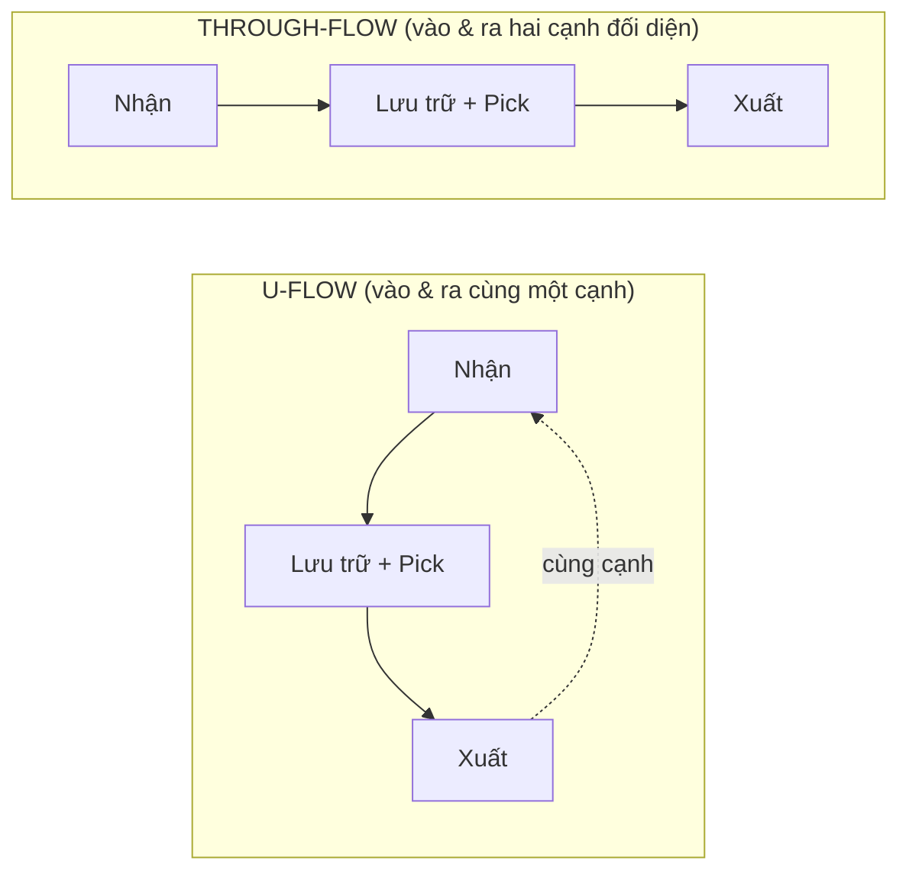

Hai hình thật từ sách minh họa rõ cách bố trí vùng ABC bên trong mỗi hình học:


*Hình 6.2 — Kho U-flow: Goods inwards & Despatches cùng một cạnh; hàng high-usage đặt sát cửa, low-usage ở sâu; có khu cross-dock, QA, mezzanine. Nguồn: Richards ch.9 (Figure 9.4, University of Huddersfield).*


*Hình 6.3 — Kho through-flow: Goods inwards (trái) và Despatches (phải) ở hai cạnh đối diện; dòng chảy thẳng, hàng high-usage ở giữa. Nguồn: Richards ch.9 (Figure 9.5, University of Huddersfield).*

| Tiêu chí | **U-flow** (phổ biến nhất) | **Through-flow** (dòng thẳng) |
|---|---|---|
| Bố trí cửa | Nhận & xuất **cùng một cạnh** | Nhận & xuất **hai cạnh đối diện** |
| Tận dụng bến (dock) | **Cao** — chia sẻ bến vào/ra; linh hoạt theo ca | Thấp hơn — bến cố định một chiều |
| Quãng di chuyển | **Ngắn** cho fast-mover (đặt gần cụm cửa); ghép put-away + retrieval (dual-command) | Dài hơn (hàng đi suốt chiều dài) |
| Cross-docking | Thuận (cửa gần nhau); hợp kho *vừa trữ vừa cross-dock* | Hợp **cross-dock thuần** (hub bưu kiện, nhà dài–hẹp) |
| Tắc nghẽn | **Dễ tắc** khi cả nhận & xuất bận cùng lúc | Không tắc (tách dòng) |
| An ninh & tiếp cận | Dễ kiểm soát (một cạnh) | Cần 2 cổng/đường vành đai → an ninh phức tạp |
| Mở rộng tương lai | Linh hoạt hơn | **Hạn chế** (cửa hai phía chặn mở rộng) |

> [!IMPORTANT] 💡 INSIGHT — Vì sao U-flow là mặc định, còn through-flow là chuyên dụng
> U-flow thắng ở **đa số kho trữ-hàng** vì hai lý do toán học. Thứ nhất, nó cho phép *dual-command* (một chuyến vừa cất vừa lấy → cắt hành trình rỗng, nối [§6.1.1.e task interleaving](#611-động-lực-học-dòng-chảy-kho-receiving--put-away--storage--picking--despatch)). Thứ hai, khi I/O dồn về một cạnh, **fast-mover xếp sát cạnh đó hưởng quãng đi ngắn cho cả nhập lẫn xuất** — đúng nguyên lý mô hình chất lỏng (không gian ∝ lưu lượng, [§6.1.1.b](#611-động-lực-học-dòng-chảy-kho-receiving--put-away--storage--picking--despatch)). Through-flow chỉ vượt trội khi **throughput quá lớn để dồn cửa về một cạnh** (sortation centre) hoặc khi dòng chảy *bản chất là một chiều* (cross-dock thuần, [§6.1.4.g](#614-cross-docking-chuyên-sâu)). Với vai trò thiết kế giải pháp: hỏi *"kho này trữ hay luân chuyển?"* — trữ → U-flow; luân chuyển thuần → through-flow.

##### c.1 — Lab định lượng: chứng minh "U-flow tiết kiệm travel", và biên hiệu lực

Hai khẳng định ở INSIGHT trên — *fast-mover sát cửa* và *dual-command* — không nên dừng ở lời. Chúng là hệ quả của một **mô hình quãng-di-chuyển kỳ vọng** giải được bằng tay. Văn liệu nền: Francis (1967) thiết lập điều kiện đủ cho bố trí kho tối ưu và **vị trí bến (dock location)** chi phối khoảng cách; Bozer & White (1984) chuẩn hóa **mô hình thời gian di chuyển single-command vs dual-command** vẫn là tham chiếu kinh điển. Ta trừu tượng hóa kho thành **một trục dòng chảy** sâu $D$ mét, vị trí lưu ở độ sâu $y$ tính từ cạnh nhận; mỗi SKU có $\lambda$ chu kỳ nhập = xuất mỗi năm.

> [!IMPORTANT] 📐 Công thức quãng di chuyển năm (single-command, round-trip)
> $$\text{U-flow:}\quad C_U(y)=4\lambda y \qquad\qquad \text{Through-flow:}\quad C_T(y)=2\lambda y + 2\lambda(D-y)=2\lambda D$$
> - $C_U$ tỷ lệ với độ sâu $y$ ⇒ **xếp SKU lưu lượng cao ($\lambda$ lớn) ở $y$ nhỏ là cắt được travel**.
> - $C_T$ **bằng hằng số $2\lambda D$, độc lập với $y$** — vì nhập đi từ cạnh $0$ còn xuất đi từ cạnh $D$, mọi ô đều "gánh" trọn chiều sâu. Slotting theo độ sâu **không** giúp gì cho through-flow.
> - Điểm hòa vốn per-SKU: $4y=2D \Leftrightarrow y=D/2$. Ô **nửa trước** ($y<D/2$) → U-flow rẻ hơn; ô **nửa sau** ($y>D/2$) → through-flow lại rẻ hơn.

**📐 Đề bài tĩnh:** kho sâu $D=70$ m; 6 SKU slotting theo ABC (phổ biến nhất đặt nông nhất).

| SKU | Độ sâu $y$ (m) | $\lambda$ (chu kỳ/năm) | $C_U=4\lambda y$ | $C_T=2\lambda D$ | Rẻ hơn |
|---|---|---|---|---|---|
| A | 10 | 1000 | 40 000 | 140 000 | U-flow |
| B | 20 | 600 | 48 000 | 84 000 | U-flow |
| C | 30 | 300 | 36 000 | 42 000 | U-flow |
| D | 40 | 150 | 24 000 | 21 000 | Through |
| E | 50 | 80 | 16 000 | 11 200 | Through |
| F | 60 | 40 | 9 600 | 5 600 | Through |

**📐 Tính tay (SKU A):** $C_U=4\times1000\times10=40\,000$ m; $C_T=2\times1000\times70=140\,000$ m. Tổng: U-flow $=173\,600$ m, through-flow $=303\,800$ m → **U-flow tiết kiệm $130\,200$ m (~42,9%)**. Dual-command (U-flow) ghép put-away A($y{=}10$) với retrieval B($y{=}20$): hai single-command $=2(10)+2(20)=60$ m; một dual-command $=10+|10-20|+20=40$ m → **tiết kiệm $20$ m $=2\min(y_A,y_B)$**.

> [!NOTE] 💻 Góc Khoa học dữ liệu — code đã verify (output khớp tính tay)
> ```python
> D = 70
> SKUS = [("A",10,1000),("B",20,600),("C",30,300),
>         ("D",40,150),("E",50,80),("F",60,40)]
> uflow   = lambda y, lam: 4*lam*y                 # round-trip 2 chieu tu canh y=0
> through = lambda y, lam: 2*lam*y + 2*lam*(D-y)   # = 2*lam*D, doc lap y
> tot_u = sum(uflow(y,l)   for _,y,l in SKUS)      # -> 173600
> tot_t = sum(through(y,l) for _,y,l in SKUS)      # -> 303800
> # dual-command U-flow: ghep A(10) + B(20)
> sc, dc = 2*10 + 2*20, 10 + abs(10-20) + 20       # 60 ; 40 -> tiet kiem 20 = 2*min
> ```
> ```text
> TONG U-flow  = 173600 m
> TONG Through = 303800 m
> U-flow tiet kiem = 130200 m (42.9%)
> Diem hoa von per-SKU: y = D/2 = 35.0 m
> Dual-command ghep A+B: SC=60 ; DC=40 ; tiet kiem=20 (= 2*min)
> [OK] Tat ca khop phan tinh tay.
> ```
> Script đầy đủ: `assets/scripts/lab_flow_geometry_travel.py`.

> [!NOTE] 💡 Đọc kết quả — vì sao U-flow thắng *có điều kiện*
> Đáng chú ý: per-SKU, through-flow **lại rẻ hơn** cho 3 ô nửa sau (D, E, F ở $y>35$ m). U-flow thắng tổng thể (42,9%) **chỉ vì lưu lượng được dồn về nửa trước** nhờ slotting ABC — chính cặp "U-flow + ABC slotting sát cửa" mới tạo ưu thế, không phải U-flow đơn độc. Nếu lưu lượng *đồng đều* hoặc *dồn về đáy kho* (vd hàng cồng kềnh buộc để sâu), điểm hòa vốn $y=D/2$ dịch và through-flow có thể thắng. Đây là **biên định lượng** của khẳng định "U-flow là mặc định".

> [!WARNING] 🪤 Bẫy — khi chính tiền đề "tối thiểu travel" sụp đổ (biên hiệu lực)
> Toàn bộ logic hình học ở trên đứng trên một tiền đề: *quãng di chuyển của người/xe là chi phí chi phối* (đúng cho kho thủ công, picker travel ~50% lao động, [§6.1.2](#612-chiến-lược-lấy-hàng-batch--zone--wave-picking)). Tiền đề này **đảo ngược dưới tự động hóa goods-to-person** (AS/RS, AMR, kệ di động kiểu Kiva/robot): khi hàng được mang **đến** người, *picker travel ≈ 0*, hàm mục tiêu chuyển từ "tối thiểu quãng đi" sang **tối thiểu thời gian chờ tại trạm pick + lập lịch đội robot + dung lượng sạc**. Khi đó:
> - "Fast-mover sát cửa" mất phần lớn ý nghĩa (robot không mệt vì đi xa, mật độ lưu trữ lên ngôi).
> - Lựa chọn U-flow vs through-flow lùi xuống thứ yếu sau bài toán hàng đợi/throughput của hệ tự động ([§6.2.3 AS/RS](#623-hệ-lưu-trữ-selective--drive-in--push-back--pallet-flow--as-rs)).
> Bài học cấp thạc sĩ: một mô hình tối ưu **chỉ đúng trong phạm vi giả định của nó** — đổi công nghệ nền thì phải đổi hàm mục tiêu, không bê nguyên kết luận layout thủ công sang kho robot.

> [!NOTE] 📐 Giả định & hạn chế của mô hình
> - **Trừu tượng 1 trục:** gộp toàn kho thành một trục sâu $D$; bỏ qua đổi lối ngang (cross-aisle), di chuyển dọc (nâng/hạ), và hình học lối đi phi tuyến (fishbone §b).
> - **Cân bằng $\lambda_{in}=\lambda_{out}$** và **nền single-command** cho công thức gốc; dual-command chỉ minh họa một cặp.
> - **$\lambda$ tất định, không kẹt xe:** bỏ qua tắc nghẽn khi nhập–xuất bận đồng thời (đúng bẫy "U-flow dễ tắc" ở bảng §c) và biến thiên ngẫu nhiên của nhu cầu.
> - Mô hình cho *khoảng cách kỳ vọng* để **so sánh hai hình học**, không thay cho mô phỏng rời rạc (bước (vi) Baker & Canessa, §b) khi cần định cỡ chính xác.

#### d. Phân bổ diện tích sàn

Trước khi vẽ layout phải biết **mỗi khu chiếm bao nhiêu**. Khảo sát Cranfield (Baker & Perotti 2008, dẫn trong Richards ch.9) cho cơ cấu điển hình:

| Khu chức năng | % diện tích sàn |
|---|---|
| Lưu trữ (reserve storage) | 52 |
| Pick / pack | 17 |
| Nhận & xuất (receiving/despatch) | 16 |
| Dịch vụ gia tăng (VAS) | 7 |
| Khác (sạc pin, pallet rỗng…) | 7 |

Các khu phải tính diện tích (Richards ch.9): nhận · cách ly/kiểm · reserve · carton-pick · item-pick · VAS · đóng gói · xuất · cross-dock · pallet rỗng · sạc MHE · văn phòng · vệ sinh.

> [!WARNING] 🪤 Bẫy "trung bình che giấu sự thật"
> Richards (ch.9): 100 đơn 1-dòng + 100 đơn 3-dòng → "trung bình 2 dòng/đơn" — *con số chẳng có đơn nào thực sự là 2 dòng*. Phải dùng **median & mode**, không chỉ average, khi profiling để sizing khu chức năng. (Cùng cảnh báo phân phối ở [§6.1.3.c](#613-tối-ưu-vị-trí-xếp-hàng-slotting-bằng-cube-per-order-index-coi).)

#### e. Hoạch định: sizing theo đỉnh hay trung bình?

Định cỡ một kho thực chất là chọn **mức công suất mục tiêu** nằm đâu đó giữa *cầu trung bình* và *cầu đỉnh* — và đây là một đánh đổi nền tảng, không có lời giải đúng tuyệt đối. Hai cực đều tốn tiền theo cách riêng: **xây sát đỉnh** thì phần lớn thời gian trong năm kho chạy non tải, ôm chi phí cố định cho công suất nằm chơi; **xây sát trung bình** thì rẻ lúc bình thường nhưng *vỡ trận* vào mùa cao điểm — tràn kho, thuê gấp với giá cắt cổ, hoặc mất đơn. Câu hỏi thiết kế vì thế không phải "to hay nhỏ" mà là *"phần đỉnh nên hấp thụ bằng công suất cố định (sở hữu) hay công suất linh hoạt (thuê/lao động thời vụ)?"* — và câu trả lời phụ thuộc hai tham số: **tỷ lệ đỉnh:trung bình** và **độ dài mùa đỉnh**. Đỉnh càng nhọn và càng ngắn thì càng nên để công suất linh hoạt gánh; đỉnh càng tù và càng dài thì càng đáng đầu tư cố định.

> [!IMPORTANT] 📐 Quy tắc sizing đỉnh/trung bình (Frazelle 2002, dẫn Richards ch.9)
> Gọi tỷ lệ **đỉnh : trung bình** và độ dài mùa đỉnh:
> - **Size gần trung bình** nếu tỷ lệ > **1:5** *và* đỉnh kéo dài < nửa năm → phần vượt dùng kho/lao động *tạm thời*.
> - **Size gần đỉnh** nếu tỷ lệ < **1:2** *và* đỉnh kéo dài lâu → đầu tư công suất cố định gần mức đỉnh.
> Ngoài ra phải xét **dao động theo ngày trong tuần**, không chỉ trung bình tuần/tháng. Liên hệ sizing công suất [M3 §3.1 (S&OP)](03-supply-planning-mpc.md), case sô-cô-la 500→10.000 pallet [§6.1.1.g](#611-động-lực-học-dòng-chảy-kho-receiving--put-away--storage--picking--despatch).

#### f. Khi thiếu không gian — giải pháp trước khi thuê thêm

Khi kho báo "hết chỗ", phản xạ tự nhiên là **thuê thêm diện tích** — nhưng đó thường là lựa chọn *đắt nhất và non nhất*. Lý do nằm ở một nghịch lý đã gặp ở [§6.1.1.b (honeycombing)](#b-bản-đồ-tiến-trình-vật-lý-dòng-chảy--cơ-cấu-chi-phí): một kho "đầy" về cảm nhận thường vẫn còn **15–30% công suất ẩn** không dùng được vì ô chừa sai cỡ, beam đặt quá cao so với pallet thực, hay vị trí cố định trống mà không cho SKU khác vào. Nói cách khác, "thiếu không gian" hầu như luôn là *triệu chứng của bố trí kém*, không phải *thiếu mét vuông thật*. Vì thế nguyên tắc là **vắt kiệt các đòn bẩy nội tại trước** — đổi storage medium, hạ beam, chuyển fixed→random, tận dụng chiều cao — theo thứ tự chi phí tăng dần, và chỉ thuê/dựng thêm khi mọi đòn bẩy rẻ hơn đã cạn.

> [!TIP] 🛠️ Checklist "tìm thêm không gian trong kho hiện hữu" (Richards ch.9)
> 1. **Đổi storage medium/MHE:** single-deep → double-deep; drive-in; narrow-aisle; xe articulated (lối hẹp hơn).
> 2. **Hợp nhất part-pallet** cùng SKU (lưu ý batch/expiry) → giải phóng ô.
> 3. **Hạ beam height** theo chiều cao pallet thực (đừng để pallet 0,5 m trong ô 2 m).
> 4. **Variable-height locations** trên adjustable pallet racking (0,5 / 1 / 1,2 / 1,5 / 2 m).
> 5. **Fixed → random location** (ô cố định trống vẫn không dùng được cho SKU khác).
> 6. **Tận dụng khối:** mezzanine, carousel (đánh đổi: cube cao ↔ truy xuất chậm hơn).
> 7. **Giảm tồn kho** (phối hợp sales/finance thanh lý hàng chậm/chết) — đòn bẩy lớn nhất nhưng ngoài tầm quản đốc kho.
> 8. Cuối cùng: cấu trúc tạm ngoài sân / container (lưu ý an ninh & thấm nước).

> [!CAUTION] 📦 CASE STUDY — Sortation centre chọn through-flow; kho bán lẻ chọn U-flow (Richards ch.9; Rushton ch.19)
> - **Trung tâm phân loại bưu kiện/pallet** thiên **through-flow**: nhà *dài–hẹp*, xe vào một cạnh dài, xe ra cạnh đối diện — dòng thẳng, throughput cực cao, chấp nhận quãng dài & an ninh hai phía.
> - **Kho bán lẻ điển hình** thiên **U-flow**: nhận & xuất cùng cạnh → dock utilization cao, fast-mover sát bến xuất, reserve đặt *phía trên* carton-pick, dễ cross-dock. Đây là minh họa: hình học *theo bản chất dòng chảy*, không theo sở thích.

#### g. Tổng hợp & Liên kết chéo

> [!IMPORTANT] 💡 INSIGHT TỔNG HỢP — Layout là ràng buộc vật lý của mọi thuật toán ở 6.1
> Slotting (6.1.3), pick routing (6.1.2) và cross-dock (6.1.4) đều *chạy bên trong* hình học mà 6.2.1 chốt. Một layout sai (through-flow cho kho trữ nhỏ, hay U-flow cho hub bưu kiện) sẽ **giới hạn trần** của mọi tối ưu phần mềm phía trên — đúng bất đối xứng "chiến lược đắt hơn tác nghiệp" (§b). Với Control Tower: khi nhận một kho hiện hữu, *đọc hình học trước* — nó quyết định dual-command có khả thi không, fast-mover đặt đâu, cross-dock chen được không. Layout là tầng nền vật lý; phần mềm chỉ tối ưu *trong* ràng buộc đó.

> [!NOTE] 🔗 Liên kết chéo
> Công suất chứa & aisle width (định lượng): [§6.2.2](#622-tính-công-suất-chứa--chiều-rộng-lối-đi-reach-truck-vna) · Hệ lưu trữ chi tiết: [§6.2.3](#623-hệ-lưu-trữ-selective--drive-in--push-back--pallet-flow--as-rs) · Dual-command/task interleaving & mô hình chất lỏng: [§6.1.1.b, §6.1.1.e](#611-động-lực-học-dòng-chảy-kho-receiving--put-away--storage--picking--despatch) · Cross-dock & through-flow: [§6.1.4](#614-cross-docking-chuyên-sâu) · Slotting trong layout: [§6.1.3](#613-tối-ưu-vị-trí-xếp-hàng-slotting-bằng-cube-per-order-index-coi) · Sizing công suất: [M3 §3.1](03-supply-planning-mpc.md)

##### 📚 Nguồn (mục 6.2.1)

**Sách (nền chính):** Richards, *Warehouse Management* (ch.9 Warehouse layout); Rushton/Croucher/Baker, *The Handbook of Logistics & Distribution Management* (ch.19 Layouts, ch.20 Warehouse design). Số liệu/khái niệm dẫn trong sách: Baker & Perotti (Cranfield, 2008); Frazelle (2002); Fortna.

**Lớp học thuật toàn cầu (chuẩn sau-đại học):**
- Francis, R.L. (1967), *Sufficient conditions for some optimum-property facility designs*, Operations Research — hình dạng nhà & vị trí bến tối ưu (nền §c.1).
- Bassan, Y., Roll, Y. & Rosenblatt, M.J. (1980), *Internal layout design of a warehouse*, AIIE Transactions — tỷ lệ cạnh & hướng lối tối ưu.
- Bozer, Y.A. & White, J.A. (1984), *Travel-time models for automated storage/retrieval systems*, IIE Transactions — mô hình thời gian di chuyển single-command vs dual-command (nền §c.1).
- Rouwenhorst, B. et al. (2000), *Warehouse design and control: Framework and literature review*, EJOR — khung phân tầng chiến lược/chiến thuật/tác nghiệp.
- Baker, P. & Canessa, M. (2009), *Warehouse design: A structured approach*, EJOR — quy trình thiết kế kho 6 bước.
- Gu, J., Goetschalckx, M. & McGinnis, L.F. (2010), *Research on warehouse design and performance evaluation: A comprehensive review*, EJOR.
- Gue, K.R. & Meller, R.D. (2009), *Aisle configurations for unit-load warehouses*, IIE Transactions — flying-V & fishbone.

**Deep research (web):** không bổ sung cho mục này — nội dung sách & học thuật đã đầy đủ.

### 6.2.2. Tính công suất chứa & chiều rộng lối đi (Reach Truck, VNA) ✅

> **Nguyên tắc biên soạn & quy ước trình bày:**
> - **Nền chính = sách thực hành** (Richards & Grinsted *Toolkit* 1.13, 1.15; Richards *Warehouse Management* ch.9).
> - **Lớp học thuật toàn cầu:** kích thước kho & bố trí nội bộ tối ưu (**Bassan, Roll & Rosenblatt 1980, *AIIE Transactions***), tổn thất "honeycombing" trong lưu trữ sâu (**Bartholdi & Hackman, *Warehouse & Distribution Science***), khảo sát AS/RS (**Roodbergen & Vis 2009, *EJOR***). Đây là tầng *vì sao* dưới các công thức module.
> - **Code Python tĩnh, dò tay được, verify bằng máy**; **deep research (web) chỉ BỔ SUNG**.

---

#### 📌 Bốn lăng kính trong mục 6.2.2

| Lăng kính | Mức nhấn | Thể hiện ở đâu |
|---|---|---|
| 📐💻 **Toán & Data** | ●●● Trọng tâm | §b (công thức aisle width), §c (công thức công suất pallet + bản đồ bài toán ẩn), §d.1 (code công suất), **§d.2 lab tối ưu bề rộng lối — nghiệm √ giải tích kiểu EOQ/Bassan, verify bằng máy**, §e (dock space) |
| 🛠️ **Thực thi** | ●●● Trọng tâm | §a (chọn xe ↔ racking), §f (đánh đổi tốc độ ↔ sức chứa, ngưỡng 85%) |
| 🎯 **Chiến lược** | ●● Bổ trợ | §f — quyết định "tốc độ hay sức chứa" là chiến lược dùng không gian |
| 🧭 **Hoạch định** | ●● Bổ trợ | §e — dock space theo lịch xe; sizing theo throughput |

#### a. Tương quan xe ↔ racking ↔ lối đi

Có một **vòng phụ thuộc ba chiều**: loại racking quy định loại xe, loại xe quy định bề rộng lối, bề rộng lối quy định số pallet chứa được (Richards ch.9). Chọn sai một mắt là hỏng cả ba.

Để thấy vì sao bề rộng lối lại là **biến chủ (master variable)** của toàn bộ bài toán công suất, hãy nhìn vào một sự thật vật lý đơn giản nhưng quyết định: **lối đi là "không gian chết"** — diện tích mà doanh nghiệp vẫn phải trả tiền thuê, sưởi, chiếu sáng, bảo vệ, nhưng *không lưu được một pallet nào*. Trong một kho điển hình, lối đi có thể nuốt 30–50% diện tích sàn của khu lưu trữ. Do đó, mỗi xăng-ti-mét bề rộng lối cắt giảm được sẽ chuyển hóa trực tiếp thành vị trí pallet tăng thêm trên cùng một mặt bằng. Đây là động lực kinh tế đẩy các kho hướng tới lối ngày càng hẹp — và là lý do bài toán "tính công suất" về bản chất là bài toán "tối ưu bề rộng lối".

Nhưng bề rộng lối không phải biến tự do: nó **bị ràng buộc bởi vật lý của thiết bị xếp dỡ (MHE)**. Một xe nâng cần đủ không gian để quay 90° và đặt pallet vào ô — nhu cầu không gian đó được lượng hóa bằng công thức ở §b. Muốn lối hẹp hơn, phải mua loại xe tinh vi hơn (reach truck vươn càng, rồi VNA/turret xoay đầu càng tại chỗ, không cần quay thân) — tức **đổi chi phí không gian lấy chi phí thiết bị**, đồng thời thường phải chấp nhận tốc độ truy xuất chậm hơn và tính linh hoạt kém hơn (xe VNA ray dẫn gần như chỉ chạy trong lối của nó). Đó là cốt lõi của quyết định *"tốc độ hay sức chứa"* mà §d.2 sẽ định lượng.

Song song với bề rộng lối (chiều ngang) còn có **chiều cao** như một đòn bẩy công suất thứ hai: nâng chiều cao xếp pallet làm tăng số tầng module, do đó tăng pallet/m² mà không tốn thêm sàn. Nhưng chiều cao cũng bị chặn bởi năng lực nâng của xe, độ phẳng và tải trọng sàn, vị trí sprinkler/đèn, và ngưỡng an toàn. Khi cả hai đòn bẩy (lối hẹp + kệ cao) được đẩy tới hạn, ta tiến tới các hệ tự động high-bay (AS/RS) ở [§6.2.3](#623-hệ-lưu-trữ-selective--drive-in--push-back--pallet-flow--as-rs).

Mệnh đề "lối hẹp luôn tốt hơn" chỉ đúng trong một **phạm vi hiệu lực** nhất định — và biết nó *sai* ở đâu mới là tư duy thiết kế đúng bậc thạc sĩ, chứ không phải tụng VNA như chân lý. Logic lối hẹp đảo chiều trong các chế độ vận hành sau:

- **Throughput / tần suất pick cao:** khi kho có "high incidence of picking" (Richards ch.9), chi phí *thời gian truy xuất* và *tắc nghẽn* lấn át lợi ích công suất. Lối hẹp VNA ray dẫn gần như cấm hai xe vượt nhau; một xe hỏng là kẹt cả lối — biến công suất "+71%" thành nút cổ chai. Khi đó điểm tối ưu **dịch về phía lối rộng** hơn, đánh đổi sức chứa lấy tốc độ.
- **Ít SKU, sản lượng/ SKU rất lớn:** lưu trữ khối (block stacking) hoặc drive-in **bỏ hẳn lối** sẽ thắng hệ chọn-lọc lối hẹp — một *chế độ khác hẳn*, nơi bài toán không còn là "tối ưu bề rộng lối" mà là "tối ưu độ sâu lane" (honeycombing, [§6.2.3](#623-hệ-lưu-trữ-selective--drive-in--push-back--pallet-flow--as-rs)).
- **Ràng buộc vật lý chặn trước công suất:** kho lạnh, vùng địa chấn, sàn kém phẳng → VNA/high-bay đòi sàn siêu phẳng và kết cấu cứng; các ràng buộc này *bind* trước khi lợi ích pallet kịp hiện thực hóa.
- **Nhu cầu linh hoạt / mở rộng tương lai:** lối hẹp + ray dẫn khóa cứng cấu hình, khó tái bố trí khi product profile đổi.

Tầng tối ưu giải tích nói trên có một **phả hệ trí tuệ** đáng nắm để hiểu nó *đến từ đâu và yếu ở đâu*. Francis (1967) đặt nền bài toán thiết kế cơ sở và vị trí bến tối ưu; Bassan, Roll & Rosenblatt (1980) đưa lời giải giải tích cho bố trí nội bộ và tỷ lệ cạnh tòa nhà; tới Gue & Meller (2009) thì chính giả định nền — *lối luôn vuông góc, song song* — bị thách thức bằng layout **fishbone / flying-V** cho phép lối chéo, cắt giảm travel mà mô hình orthogonal cổ điển không nhìn thấy. Nói cách khác, mỗi thế hệ mô hình tối ưu một lớp giả định, rồi thế hệ sau phá chính giả định đó.

Giới hạn của cả trường phái tối ưu giải tích: nó giả định **cầu tất định, di chuyển single-command, nhà chữ nhật, slotting tĩnh** — nên cho ra một điểm cực tiểu *đẹp nhưng giòn* khi cầu ngẫu nhiên và danh mục biến động. Đối trọng là góc nhìn thực hành của Fortna (dẫn trong Richards ch.9): *"không tồn tại một thiết kế tối ưu duy nhất cho mỗi kho"* — thiết kế tốt nhất là thiết kế **linh hoạt, mở rộng được, rẻ để điều chỉnh**, "thiết kế cho tương lai trong khi xây cho hiện tại". Đọc ở bậc thạc sĩ: lời giải giải tích cho ta **mốc chuẩn (benchmark) và độ nhạy** quanh tối ưu, còn quyết định thực tế lại tối ưu cho **độ chống chịu và giá trị quyền chọn (option value)**, không phải một cực tiểu chi phí tĩnh.

> [!IMPORTANT] 💡 INSIGHT — Bài toán kích thước kho tối ưu có lời giải giải tích
> Việc "tối ưu bề rộng lối" không chỉ là kinh nghiệm: Bassan, Roll & Rosenblatt (1980) đã *mô hình hóa và giải giải tích* bài toán bố trí nội bộ kho — chọn **tỷ lệ chiều dài : chiều rộng** của tòa nhà và **hướng + số lối** để tối thiểu *tổng* chi phí (travel + chu vi tường + lối chết). Một kết quả phản trực giác của họ: với cùng diện tích, *hình dạng và hướng lối* tác động đáng kể tới tổng chi phí — kho "vuông" không phải lúc nào cũng tối ưu. Bài học cấp thạc sĩ: các công thức module ở §c là *điều kiện đủ* để tính công suất một thiết kế cho trước, nhưng *việc chọn thiết kế nào* lại là một bài toán tối ưu giải tích — và nó gắn liền với bài toán hình học dòng chảy ([§6.2.1](#621-hình-học-dòng-chảy-u-flow-vs-through-flow-layout)).

Bảng dưới tóm tắt tương quan xe–lối, làm nền cho các công thức định lượng tiếp theo:

| Loại xe | Lối đi điển hình | Đặc điểm |
|---|---|---|
| **Counterbalance (CBT)** | > 3,5–4 m (wide aisle) | Rẻ, linh hoạt, ra vào sân; tốn lối → ít pallet |
| **Reach truck** | ≥ 2,5 m (narrow aisle) | Càng vươn (reach) → lối hẹp hơn CBT |
| **VNA / turret / articulated** | ≥ 1,6–1,8 m (very narrow aisle) | Lối hẹp nhất → nhiều pallet nhất; nhưng đắt, thường ray dẫn, truy xuất chậm hơn |

#### b. Công thức chiều rộng lối đi (Aisle width)

Bề rộng lối tối thiểu để xếp 90° (ký hiệu Ast) phụ thuộc bán kính quay, "lost load centre" và chiều dài tải (Toolkit 1.13):

> [!IMPORTANT] 📐 Công thức aisle width
> **Counterbalance:** $A_{st} = WA + LLC + L + 0{,}3$ (m)
> **Reach truck:** $A_{st} = WA + LLC + L - R + 0{,}2$ (m)
> Trong đó: $WA$ = bán kính quay ngoài; $LLC$ = *lost load centre* (khoảng cách ngang từ tâm trục trước tới mặt trước càng nâng); $L$ = chiều dài tải; $R$ = tầm vươn (reach distance); $0{,}3$ / $0{,}2$ m = biên an toàn cho người vận hành. Reach truck trừ $R$ nên **luôn hẹp hơn** counterbalance cùng tải.


*Hình 6.4 — Counterbalance truck: $L$ = chiều dài tải, $LLC$ = lost load centre (tâm trục trước → mặt càng). Bề rộng lối $= WA + LLC + L + 0{,}3$. Nguồn: Richards & Grinsted, Toolkit 1.13 (Figure 1.9).*

#### c. Công thức công suất pallet (module method)

Số pallet chứa trong một khối kho tính qua **ba module** (Toolkit 1.15; Richards ch.9):

> [!IMPORTANT] 📐 Công thức công suất pallet
> $$\text{Tổng pallet} = (n_W \times 2)\times(n_L \times 2)\times n_H$$
> với số module mỗi chiều = phần nguyên của (kích thước kho ÷ kích thước module):
> - **Module rộng** $= A_{st} + 2\times(\text{cạnh ngắn pallet}) + 0{,}1$ (chuỗi: pallet–lối–pallet–khe)
> - **Module dài** $= (\text{upright}+\text{khe}) + 2\times(\text{cạnh dài pallet})$
> - **Module cao** $= (\text{cao pallet}+\text{hàng}) + \text{khe trên} + \text{beam}$
>
> Mỗi module rộng chứa **2 pallet** (hai bên lối), mỗi module dài chứa **2 pallet** (back-to-back).

Bản đồ bài toán tối ưu **ẩn** dưới các công thức trên — để thấy "tính công suất" thực ra là vỏ ngoài của một chuỗi bài toán tối ưu:

| Khâu quyết định | Bài toán tối ưu | Lớp toán / phương pháp | Nơi giải |
|---|---|---|---|
| Chọn bề rộng lối $a$ | Tối thiểu tổng chi phí năm (không gian ↑ vs thiết bị+thời gian ↓) | Tối ưu 1 biến, nghiệm √ giải tích (họ EOQ) | §d.2 (lab) |
| Chọn tỷ lệ cạnh & hướng lối tòa nhà | Tối thiểu travel + chu vi tường + lối chết | Tối ưu giải tích (Bassan–Roll–Rosenblatt) | §a (neo lý thuyết), [§6.2.1](#621-hình-học-dòng-chảy-u-flow-vs-through-flow-layout) |
| Chọn độ sâu lane (selective↔drive-in) | Tối thiểu tổn thất honeycombing vs số lối | Tối ưu rời rạc (Bartholdi–Hackman) | [§6.2.3](#623-hệ-lưu-trữ-selective--drive-in--push-back--pallet-flow--as-rs) |
| Định cỡ diện tích từng khu | Phân bổ diện tích theo throughput | LP/quy hoạch tuyến tính | [§6.5](#65-tối-ưu-hóa-kho-bằng-quy-hoạch-tuyến-tính-liu-ch7-pulp) |

#### d. Góc Toán — Code công suất & đánh đổi aisle ↔ capacity

**Đề bài (dữ liệu cho sẵn — khớp Toolkit 1.15):**

> [!IMPORTANT] 📐 Đề bài
> Khối kho **48 m (rộng) × 120 m (dài) × 10 m (cao)**. Pallet 1,0 × 1,2 m, cao cả hàng 1,35 m. Upright + khe = 0,42 m; khe trên 0,15 m; beam 0,14 m → **module cao 1,64 m**. So sánh tổng pallet chứa được khi dùng **counterbalance (lối 4,0 m)**, **reach truck (lối 3,2 m)**, **VNA (lối 1,7 m)**.

> [!IMPORTANT] 📐 Tính tay — cả ba điểm để dò bảng +71%
> **Reach truck (lối 3,2 m):** Module rộng $= 3{,}2 + 2(1{,}0) + 0{,}1 = 5{,}3$ m → $n_W = \lfloor 48/5{,}3\rfloor = 9$. Module dài $= 0{,}42 + 2(1{,}2) = 2{,}82$ m → $n_L = \lfloor 120/2{,}82\rfloor = 42$. $n_H = \lfloor 10/1{,}64\rfloor = 6$. ⇒ Tổng $= (9{\times}2)(42{\times}2)(6) = 18 \times 84 \times 6 = \mathbf{9\,072}$ pallet (khớp Richards ch.9).
> **Counterbalance (lối 4,0 m):** Module rộng $= 4{,}0 + 2 + 0{,}1 = 6{,}1$ m → $n_W = \lfloor 48/6{,}1\rfloor = 7$. ⇒ Tổng $= (7{\times}2)(84)(6) = \mathbf{7\,056}$ pallet.
> **VNA (lối 1,7 m):** Module rộng $= 1{,}7 + 2 + 0{,}1 = 3{,}8$ m → $n_W = \lfloor 48/3{,}8\rfloor = 12$. ⇒ Tổng $= (12{\times}2)(84)(6) = \mathbf{12\,096}$ pallet.
> Chênh VNA vs CBT $= (12\,096-7\,056)/7\,056 = \mathbf{+71\%}$ — khớp output code dưới đây.

```python
import math

# === DE BAI (du lieu cho san, khop Toolkit 1.15) ===
PALLET_SHORT, PALLET_LONG = 1.0, 1.2      # m
UPRIGHT_CLR = 0.42                         # upright 0.12 + 3 x 0.10 khe
HMOD = 1.64                                # module cao: 1.35 + 0.15 + 0.14
W, Ln, H = 48.0, 120.0, 10.0               # kho 48 x 120 x 10 m

def aisle_counterbalance(WA, LLC, L, clr=0.30): return WA + LLC + L + clr
def aisle_reach(WA, LLC, L, R, clr=0.20):       return WA + LLC + L - R + clr

cb  = aisle_counterbalance(WA=2.0, LLC=0.5, L=1.2)       # = 4.0 m
rt  = aisle_reach(WA=1.8, LLC=0.5, L=1.2, R=0.5)         # = 3.2 m
vna = 1.7

def capacity(aisle):
    mod_w = aisle + 2*PALLET_SHORT + 0.10
    mod_l = UPRIGHT_CLR + 2*PALLET_LONG
    n_w, n_l, n_h = math.floor(W/mod_w), math.floor(Ln/mod_l), math.floor(H/HMOD)
    return (n_w*2) * (n_l*2) * n_h

print(f"{'Loai xe':16s}{'Aisle(m)':>9s}{'Pallets':>9s}")
for name, a in [("Counterbalance", round(cb,1)), ("Reach truck", round(rt,1)), ("VNA", vna)]:
    print(f"{name:16s}{a:9.1f}{capacity(a):9d}")
base, vnacap = capacity(round(cb,1)), capacity(vna)
print(f"\nVNA vs Counterbalance: +{100*(vnacap-base)/base:.0f}% pallet")
```

```text
Loai xe          Aisle(m)  Pallets
Counterbalance        4.0     7056
Reach truck           3.2     9072
VNA                   1.7    12096

VNA vs Counterbalance: +71% pallet
```

> [!NOTE] 💻 Đọc kết quả — đánh đổi cốt lõi của 6.2.2
> Thu hẹp lối từ **4,0 m (CBT) → 1,7 m (VNA)** làm công suất tăng **7.056 → 12.096 pallet (+71%)** trong *cùng một tòa nhà*. Đây là **đánh đổi trung tâm**: lối hẹp → nhiều pallet (tận dụng khối) nhưng xe đắt hơn, truy xuất chậm hơn, kém linh hoạt (kẹt một xe là kẹt cả lối). Quyết định *"tốc độ hay sức chứa"* (Richards ch.9) chính là chọn điểm trên đường đánh đổi này.

**d.2 — Lab tối ưu: bề rộng lối tối ưu không phải lối hẹp nhất**

Bảng §d.1 mới chỉ tính công suất tại ba điểm cố định — đó là *số học*, chưa phải tối ưu. Câu hỏi bậc thạc sĩ là: *bề rộng lối nào tối thiểu hóa tổng chi phí?* Piasecki (2002, dẫn trong Richards ch.9) nói rõ bề rộng lối tối ưu phải cân bằng *năng suất, tận dụng không gian, linh hoạt, an toàn và chi phí thiết bị* — tức một bài toán **tối ưu chi phí**, không phải "chọn xe hẹp nhất".

> **Neo học thuật (anchor-first):** mô hình dưới đây có cấu trúc √ giống hệt lời giải kích thước-kho tối ưu của **Bassan–Roll–Rosenblatt (1980)** và công thức lô kinh tế **EOQ của Harris (1913)** — cùng một họ "cân một chi phí tăng tuyến tính với một chi phí giảm nghịch đảo". Đây là lý do nghiệm tối ưu **bền (flat-bottomed)**, một tính chất xuyên suốt tối ưu chuỗi cung ứng.

> [!IMPORTANT] 📐 Đề bài & mô hình
> Trên *cùng một yêu cầu lưu trữ*, tổng chi phí năm theo bề rộng lối $a$ (m) gồm hai thành phần đối nghịch:
> $$TC(a)=\underbrace{\alpha\,a}_{\text{không gian }\uparrow}+\underbrace{\frac{\beta}{a}}_{\text{thiết bị + thời gian }\downarrow}$$
> - **$\alpha\,a$** — chi phí không gian: mỗi mét lối tăng thêm là "không gian chết" nhân bản trên mọi lối → tăng ~tuyến tính theo $a$. Cho $\alpha = 50\,000$ €/(m·năm).
> - **$\beta/a$** — chi phí thiết bị + thời gian truy xuất: lối càng rộng, xe càng rẻ/nhanh, càng ít tắc → giảm ~nghịch đảo theo $a$. Cho $\beta = 200\,000$ €·m/năm.

> [!IMPORTANT] 📐 Tính tay — nghiệm giải tích
> $TC'(a)=\alpha-\beta/a^2=0 \Rightarrow a^\star=\sqrt{\beta/\alpha}=\sqrt{200\,000/50\,000}=\sqrt{4}=\mathbf{2{,}0}$ m.
> $TC(a^\star)=50\,000(2)+200\,000/2=100\,000+100\,000=\mathbf{200\,000}$ €/năm. Kiểm: $TC(1{,}7)=85\,000+117\,647=202\,647$; $TC(3{,}2)=160\,000+62\,500=222\,500$ ⇒ $a^\star=2{,}0$ là cực tiểu.

```python
import math

# === DE BAI (du lieu cho san) ===
# TC(a) = alpha*a (khong gian, tang tuyen tinh) + beta/a (thiet bi+thoi gian, giam nghich dao)
ALPHA = 50_000.0     # EUR / (m be rong loi) / nam
BETA  = 200_000.0    # EUR * m / nam

def TC(a):
    return ALPHA*a + BETA/a

# Nghiem giai tich: TC'(a) = alpha - beta/a^2 = 0  ->  a* = sqrt(beta/alpha)
a_star = math.sqrt(BETA/ALPHA)
print(f"a* (giai tich) = sqrt({BETA:.0f}/{ALPHA:.0f}) = {a_star:.3f} m;  TC = {TC(a_star):,.0f} EUR/nam")

# Verify bang quet luoi (grid search) trong [1.6, 4.0] m
grid = [1.6 + 0.01*k for k in range(int((4.0-1.6)/0.01)+1)]
a_grid = min(grid, key=TC)
print(f"a* (quet luoi)  = {a_grid:.2f} m  -> TC = {TC(a_grid):,.0f}  (khop giai tich)\n")

print(f"{'Loai xe':16s}{'a(m)':>7s}{'TC(EUR/nam)':>14s}{'so voi a*':>11s}")
for name,a in [("Counterbalance",4.0),("Reach truck",3.2),("VNA",1.7),("Toi uu a*",a_star)]:
    print(f"{name:16s}{a:7.2f}{TC(a):14,.0f}{100*(TC(a)/TC(a_star)-1):10.1f}%")
```

```text
a* (giai tich) = sqrt(200000/50000) = 2.000 m;  TC = 200,000 EUR/nam
a* (quet luoi)  = 2.00 m  -> TC = 200,000  (khop giai tich)

Loai xe            a(m)   TC(EUR/nam)  so voi a*
Counterbalance     4.00       250,000      25.0%
Reach truck        3.20       222,500      11.3%
VNA                1.70       202,647       1.3%
Toi uu a*          2.00       200,000       0.0%
```

> [!NOTE] 💻 Đọc kết quả — hai bài học tối ưu
> - **Tối ưu nằm bên trong, không ở biên.** $a^\star = 2{,}0$ m — *không phải* VNA hẹp nhất (1,7 m) cũng không phải CBT rộng nhất (4,0 m). Chọn VNA chỉ vì "+71% công suất" là tối ưu hóa *một* thành phần chi phí và bỏ quên thành phần kia. CBT đắt hơn tối ưu **+25%**, một sai lầm thiết kế tốn kém.
> - **Đáy chi phí phẳng (robust).** VNA tại 1,7 m chỉ cao hơn tối ưu **+1,3%** — nghĩa là quanh $a^\star$, chi phí *ít nhạy* với bề rộng lối. Hệ quả thực hành: nên **snap $a^\star$ về cấp xe khả thi gần nhất** (ở đây là một xe narrow-aisle ~1,7–2,0 m), vì sai số nhỏ quanh tối ưu gần như miễn phí — đúng tính chất flat-bottom của họ √ (EOQ/Bassan).

> [!WARNING] 🪤 Giả định & hạn chế của mô hình (bắt buộc nêu — không có thì chưa đạt bậc thạc sĩ)
> - **Giả định tách rời & đơn điệu:** chi phí không gian tuyến tính ↑, chi phí thiết bị+thời gian nghịch đảo ↓. Thực tế chi phí thiết bị **nhảy bậc** tại ranh giới cấp xe (CBT→reach→VNA), nên đường $TC$ có *gấp khúc*; nghiệm liên tục $a^\star$ phải được snap về cấp xe rời rạc khả thi.
> - **Bỏ qua ràng buộc throughput:** mô hình không ép số lần xuất/nhập mỗi ngày. Khi throughput cao, số hạng thời gian truy xuất phình lên (hàng đợi phi tuyến, [§6.1.1](#611-động-lực-học-dòng-chảy-kho-receiving--put-away--storage--picking--despatch)) → $\beta$ tăng → $a^\star$ **dịch về phía rộng hơn**. Đây là cầu nối định lượng cho biên hiệu lực đã nêu ở §a.
> - **Ràng buộc an toàn tối thiểu:** $a$ không được nhỏ hơn bề rộng lối tối thiểu do nhà sản xuất xe quy định — một ràng buộc *bind* mà mô hình trơn không thấy.
> - **Tham số tất định:** $\alpha,\beta$ coi như biết chắc; thực tế là ước lượng có sai số → cần phân tích độ nhạy (vì đáy phẳng nên kết luận khá vững).

#### e. Dock space & công thức thay thế

> [!IMPORTANT] 📐 Dock space (Toolkit 1.15)
> $$\text{Dock space} = \Big\lceil \frac{\text{số xe} \times \text{giờ/xe}}{\text{giờ/ca}} \Big\rceil \times (\text{pallet/xe} \times \text{diện tích pallet})$$
> **Ví dụ:** 20 xe/ngày, (45+30) phút=1,25 h/xe, ca 8 h, 26 pallet/xe, pallet 1,2 m²:
> $\lceil 20{\times}1{,}25/8\rceil \times (26{\times}1{,}2) = \lceil 3{,}125\rceil \times 31{,}2 = 4 \times 31{,}2 = 124{,}8$ m². **Cộng gấp đôi cho lối di chuyển → 374,4 m².**
> Công thức diện tích thay thế: $S = (A/2 + W + 0{,}1)\times(L + 0{,}2)\times N/(h\times d)$ với $N$ = tổng pallet, $h$ = số tầng xếp cao, $d$ = độ sâu (d=1 cho lưu trữ truyền thống).

#### f. Đánh đổi, bẫy & ngưỡng vận hành

> [!WARNING] 🪤 Bẫy khi tính & vận hành công suất
> - **Công thức là "rule-of-thumb":** *chưa trừ* gangway đầu kệ, walkway thoát hiểm, overhang pallet, cột nhà, sprinkler. Phải trừ thực tế trước khi cam kết.
> - **Lấp đầy >85% → năng suất & an toàn giảm** (Richards ch.9): put-away bị trễ vì phải dọn chỗ. Đừng thiết kế để chạy 100% (cùng họ phi tuyến với honeycombing & hàng đợi bến, [§6.1.1.b,d](#611-động-lực-học-dòng-chảy-kho-receiving--put-away--storage--picking--despatch)).
> - **Định hướng pallet:** cạnh dài song song lối → dễ pick (không phải với sâu); cạnh ngắn song song lối → chứa nhiều hơn + linh hoạt (UK & euro pallet chung bay).
> - **3 pallet/beam** (bỏ bớt upright) tiết kiệm tới ~4% không gian — nhưng phải tôn trọng tải trọng beam tối đa.
> - **VNA ray dẫn** cấm pallet jack vào lối → nhặt khó hơn; xe trên cao khó thấy picker dưới sàn (an toàn).

> [!CAUTION] 📦 CASE STUDY — Tìm thêm chỗ chứa mà không thuê ngoài (Richards ch.9, "Finding additional space")
> **Bối cảnh.** Một kho đầy chỗ, sản lượng tăng. Khảo sát Cranfield (Baker & Perotti 2008, dẫn trong Richards ch.9) cho biết trung bình chỉ **52% diện tích sàn dùng để lưu trữ** — phần còn lại là pick/pack, nhận–xuất, VAS, sạc pin… Quản lý kho đứng trước ba lựa chọn: mở rộng nhà, thuê kho ngoài, hoặc *tạo thêm chỗ ngay trong nhà hiện hữu*.
> **Diễn biến.** Thay vì trả tiền thuê ngoài, kho tấn công đúng **biến chủ** của bài toán công suất — bề rộng lối và chiều cao:
> - Đổi single-deep → **double-deep / narrow-aisle / xe articulated** để thu hẹp lối (đúng đòn bẩy $a$ ở §d.2).
> - Bỏ vị trí cố định cao 2 m chứa pallet chỉ cao 0,5 m — Richards mô tả thẳng cảnh "pallet nửa mét nằm trong ô hai mét": chuyển sang **ô biến chiều cao** (0,5 / 1 / 1,2 / 1,5 / 2 m) để khai thác cube.
> - **3 pallet/beam** (bỏ bớt upright) thu thêm ~4% không gian.
> - **Hợp nhất part-pallet** cùng SKU và chuyển fixed → random location để giải phóng ô chết.
> **Bài học.** Công suất bị "mất" phần lớn nằm ở **cube không khai thác và lối quá rộng**, không phải thiếu nhà. Tối ưu hai biến chủ (lối hẹp hơn + chiều cao biến thiên) thường rẻ hơn nhiều so với thuê ngoài — đúng thông điệp định lượng của §d.2: dịch điểm trên đường đánh đổi trước khi bỏ tiền mở rộng mặt bằng. Nhưng phải tôn trọng ngưỡng 85% và tải trọng beam (🪤 ở trên).

> [!IMPORTANT] 💡 INSIGHT TỔNG HỢP — Đường đánh đổi aisle là một bài toán tối ưu kinh tế
> Bảng ở §d.1 thực chất là một **đường biên đánh đổi (frontier)**: mỗi bề rộng lối cho một cặp *(số pallet, chi phí xe + tốc độ truy xuất)*. §d.2 đã *giải* bài toán đó — tối thiểu tổng chi phí năm $TC(a)=\alpha a+\beta/a$ cho nghiệm √ $a^\star=\sqrt{\beta/\alpha}=2{,}0$ m, một điểm **bên trong** (không phải VNA hẹp nhất). Với nền Toán kinh tế của bạn, hãy nhận ra đây cùng một họ với EOQ và kích thước-kho Bassan–Roll–Rosenblatt: cân một chi phí tăng tuyến tính với một chi phí giảm nghịch đảo → nghiệm √ với **đáy phẳng**. Khi tư vấn thiết kế kho: đừng chọn VNA chỉ vì "chứa nhiều", hãy **tối ưu tổng chi phí** và đối chiếu throughput yêu cầu — vì +71% công suất vô nghĩa nếu tốc độ truy xuất không đáp ứng nổi đơn, và vì throughput cao sẽ kéo $a^\star$ về phía rộng hơn (§d.2 hạn chế).

> [!NOTE] 🔗 Liên kết chéo
> Hình học layout (khung chứa các module này) & kích thước kho tối ưu: [§6.2.1](#621-hình-học-dòng-chảy-u-flow-vs-through-flow-layout) · Hệ lưu trữ & loại racking chi tiết (honeycombing, lane depth): [§6.2.3](#623-hệ-lưu-trữ-selective--drive-in--push-back--pallet-flow--as-rs) · Cube utilization & ngưỡng 85%: [§6.1.1.b,e](#611-động-lực-học-dòng-chảy-kho-receiving--put-away--storage--picking--despatch) · Sizing dock theo lịch xe: [§6.1.1.d](#611-động-lực-học-dòng-chảy-kho-receiving--put-away--storage--picking--despatch) · Tối ưu chi phí (LP/MILP): [§6.5](#65-tối-ưu-hóa-kho-bằng-quy-hoạch-tuyến-tính-liu-ch7-pulp), [M7 §7.6](07-transportation-network.md)

##### 📚 Nguồn (mục 6.2.2)

**Sách (nền chính):** Richards & Grinsted, *The Logistics & SC Toolkit* (1.13 Calculating aisle width, 1.15 Warehouse space calculations); Richards, *Warehouse Management* (ch.9). Khái niệm dẫn trong sách: Piasecki (2002); Forklift Training (Tony Sellick); Frazelle (2002).

**Lớp học thuật toàn cầu (chuẩn sau-đại học):**
- Francis, R.L. (1967), *On some problems of rectangular warehouse design*, J. Industrial Engineering — nền phả hệ thiết kế cơ sở & vị trí bến.
- Bassan, Y., Roll, Y. & Rosenblatt, M.J. (1980), *Internal layout design of a warehouse*, AIIE Transactions — tối ưu giải tích kích thước & hướng lối (cùng họ √ với lab §d.2).
- Gue, K.R. & Meller, R.D. (2009), *Aisle configurations for unit-load warehouses*, IIE Transactions — layout fishbone/flying-V, phá giả định lối vuông góc.
- Bartholdi, J.J. & Hackman, S.T., *Warehouse & Distribution Science* — honeycombing & tối ưu độ sâu lane.
- Roodbergen, K.J. & Vis, I.F.A. (2009), *A survey of literature on automated storage and retrieval systems*, EJOR — nền cho high-bay/AS-RS.
- Harris, F.W. (1913), *How many parts to make at once* — gốc công thức EOQ; nền cấu trúc √ của lab tối ưu bề rộng lối §d.2.

**Deep research (web):** không bổ sung — công thức trong sách đã đầy đủ và tự kiểm chứng bằng code.

### 6.2.3. Hệ lưu trữ: Selective / Drive-in / Push-back / Pallet Flow / AS-RS ✅

> **Nguyên tắc biên soạn & quy ước trình bày:**
> - **Nền chính = sách thực hành** (Rushton/Croucher/Baker *Handbook* ch.16, Tables 16.1–16.3; Richards *Warehouse Management* ch.10; Toolkit 1.10).
> - **Lớp học thuật toàn cầu:** tối ưu độ sâu lane & tổn thất honeycombing (**Bartholdi & Hackman, *Warehouse & Distribution Science***), mô hình thời gian chu trình AS/RS (**Bozer & White 1984, *IIE Transactions***), khảo sát AS/RS (**Roodbergen & Vis 2009, *EJOR***), chọn hệ như bài toán ra quyết định đa tiêu chí (MCDA). Đây là tầng *vì sao* dưới mọi quyết định chọn hệ.
> - **Code Python tĩnh, dò tay được, verify bằng máy**; **deep research (web) chỉ BỔ SUNG**.

---

#### 📌 Bốn lăng kính trong mục 6.2.3

| Lăng kính | Mức nhấn | Thể hiện ở đâu |
|---|---|---|
| 🛠️ **Thực thi** | ●●● Trọng tâm | §b (9 hệ lưu trữ + cơ chế), §e (ma trận thuộc tính để chọn) |
| 📐💻 **Toán & Data** | ●●● Trọng tâm | §c (độ sâu lane tối ưu & honeycombing), §d (pallets/m² hiệu dụng + code) |
| 🎯 **Chiến lược** | ●● Bổ trợ | §a (đánh đổi mật độ ↔ tiếp cận), §f (AS/RS = CapEx lớn cho throughput cao) |
| 🧭 **Hoạch định** | ●● Bổ trợ | §b (chọn hệ theo pallet/SKU & FIFO/LIFO), §e |

#### a. Nguyên lý nền: mật độ ↔ tiếp cận là một đánh đổi

Mọi hệ lưu trữ pallet nằm trên một **phổ đánh đổi** giữa hai cực (Rushton ch.16):

- **Mật độ cao** (lưu nhiều pallet/m²) ⟷ **tiếp cận kém** (phải dỡ pallet khác mới lấy được).
- **Tiếp cận từng pallet** ⟷ **tốn diện tích** (nhiều lối đi).

> [!IMPORTANT] 🔑 Khái niệm cốt lõi — FIFO/LIFO sinh ra từ hình học lưu trữ
> Hệ *nạp một đầu, lấy đầu kia* → **FIFO** (pallet live, AS/RS flow). Hệ *nạp và lấy cùng một đầu* → **LIFO** (block stack, drive-in, push-back). FIFO/LIFO không phải lựa chọn phần mềm — nó là **hệ quả vật lý** của cách hàng vào/ra khối lưu. Chọn sai hệ cho hàng có hạn dùng (cần FIFO) là lỗi thiết kế nghiêm trọng.

Nguồn gốc của phổ đánh đổi này nằm ở một ràng buộc hình học hiển nhiên: **chỉ lấy được pallet nào không bị pallet khác chặn đường**. Muốn mọi pallet đều tiếp cận trực tiếp (gọi là *selectivity* — tính chọn lọc 100%), buộc phải để pallet đơn lớp cạnh lối đi, nghĩa là cần *rất nhiều lối* — và lối là không gian chết ([§6.2.2](#622-tính-công-suất-chứa--chiều-rộng-lối-đi-reach-truck-vna)). Ngược lại, muốn nén hàng dày (xếp sâu nhiều pallet, ít lối) thì các pallet phía trong tất yếu bị chặn — selectivity giảm. Vì vậy *mật độ* và *tiếp cận* không phải hai thuộc tính độc lập mà là **hai đầu của cùng một trục**: tăng cái này gần như luôn phải hy sinh cái kia. Ngoại lệ duy nhất là powered mobile racking (đạt cả hai nhờ dồn kệ lại và chỉ mở một lối khi cần) — nhưng nó trả giá bằng *tốc độ* (chỉ một xe vào một lúc, kệ di chuyển chậm), minh họa rằng đánh đổi không biến mất mà chỉ *dịch sang chiều khác*.

Biến quyết định giúp chọn đúng điểm trên phổ này là **số pallet trên mỗi SKU (pallets-per-SKU)**. Đây là chìa khóa thường bị bỏ qua. Một hệ xếp sâu (block stack, drive-in, pallet live) buộc *cả một lane/dãy phải cùng một SKU* — nếu một SKU chỉ có 2–3 pallet mà lane sâu 6, phần lớn lane bị bỏ trống hoặc phải trộn SKU (gây kẹt hàng phía sau). Do đó hệ dày *chỉ hiệu quả khi SKU có nhiều pallet*; SKU ít pallet bắt buộc dùng hệ chọn lọc (APR/VNA) dù tốn sàn. Nói cách khác, **profile tồn kho (pallet/SKU) quyết định hệ lưu trữ khả thi**, chứ không phải sở thích của người thiết kế — đây là lý do một kho thực tế hầu như luôn *trộn nhiều hệ*: hệ dày cho nhóm A nhiều pallet, APR cho đuôi dài C ít pallet.

Cái giá ẩn của các hệ dày là hiện tượng **honeycombing** (tổ ong): vì một dãy/lane chỉ chứa một SKU và phải được rút cạn trước khi nạp SKU khác, nên tại bất kỳ thời điểm nào luôn có nhiều ô trống rải rác (đang nạp dở hoặc rút dở). Hệ quả là *location utilization* của block/drive-in chỉ ~70%, trong khi APR đơn lớp đạt 90–95%. Đây chính là lý do §d phải nhân pallet/m² danh nghĩa với hệ số utilization — và là nghịch lý "dày trên giấy nhưng thưa hiệu dụng" sẽ được lượng hóa sau. Cuối cùng, Rushton (ch.16) liệt kê **tám mục tiêu thiết kế** mà mọi hệ phải cân: tận dụng không gian, tiếp cận pallet, tốc độ throughput, mức hư hỏng thấp, độ chính xác, an toàn hàng/an ninh, an toàn người, và tổng chi phí tối thiểu. Không hệ nào tối ưu cả tám — nên việc chọn hệ thực chất là một bài toán ra quyết định đa tiêu chí có trọng số (§e).

#### b. Chín hệ lưu trữ pallet

| Hệ | Cơ chế | Độ sâu | FIFO/LIFO | Tiếp cận | Dùng khi |
|---|---|---|---|---|---|
| **Block stacking** | Xếp chồng trực tiếp, không kệ | nhiều dãy | LIFO | Kém | Ít SKU, *nhiều pallet/SKU*, không cần FIFO; vốn ~0 (không kệ) |
| **Drive-in / drive-through** | Xe chạy vào giữa cột, đặt lên flange | tới ~6+ sâu | LIFO | Kém | Như block nhưng cao hơn (không giới hạn crushability); nhiều pallet/SKU |
| **Push-back** | Pallet đẩy nhau lùi trên xe lăn | 3–5 sâu | LIFO | TB (mỗi *tầng* riêng) | SKU ít pallet hơn drive-in (8+ pallet/4-deep) |
| **APR single-deep** (selective) | Kệ đơn, beam điều chỉnh | 1 sâu | FIFO | **Tốt nhất** (từng pallet) | Ít pallet/SKU, **cần FIFO**; nhược: tốn sàn |
| **Double-deep** | Như APR nhưng 2 sâu | 2 sâu | ~LIFO | TB | 4–5 pallet/SKU; cần reach truck telescopic |
| **Narrow-aisle (VNA)** | APR + lối hẹp + turret truck | 1 sâu | FIFO | Tốt | Module chính kho lớn; cao tới 14 m |
| **Powered mobile** | Kệ đơn trên ray di động, tạo lối khi cần | 1 sâu | FIFO | Tốt | Hàng *rất chậm* (1–2 pallet/SKU); **kho lạnh** |
| **Pallet live storage** | Roller nghiêng, nạp sau–lấy trước | nhiều sâu | **FIFO** | Kém (theo lane) | Fast-mover, nhiều pallet/SKU; staging trước xuất |
| **AS/RS** | Cần cẩu máy tính điều khiển | 1/2/sâu | tùy thiết kế | Tốt | High-bay tới 45 m, throughput cao, chạy 24/7 |

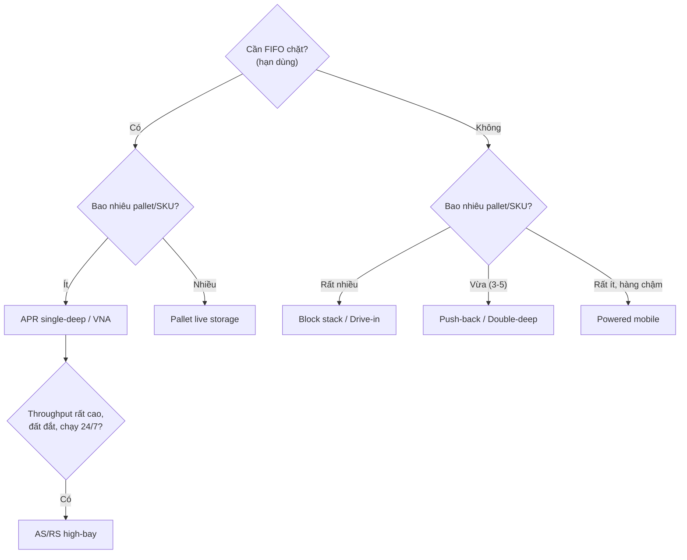


*Hình 6.2.3 — Kệ drive-in: mỗi lane xếp sâu tới ~6 pallet, cùng một SKU; đây chính là hệ mà lab "độ sâu lane tối ưu" (§c) mô hình hóa, và là nơi honeycombing phát sinh. Nguồn: Rushton, Croucher & Baker, The Handbook of Logistics & Distribution Management, Figure 16.3 (ch.16).*

#### c. Khung học thuật: độ sâu lane tối ưu & thời gian chu trình AS/RS

Đằng sau quy tắc "chọn hệ theo pallet/SKU" (§a) là một bài toán tối ưu thực sự, được Bartholdi & Hackman (*Warehouse & Distribution Science*) mô hình hóa: **độ sâu lane tối ưu**. Trong lưu trữ xếp sâu, có hai chi phí không gian kéo ngược nhau:

- *Lối đi* — lane càng sâu thì càng ít lối trên mỗi pallet → ủng hộ lane **sâu**.
- *Honeycombing* — lane càng sâu thì ô trống rải rác càng nhiều (mỗi lane chỉ một SKU, rút cạn mới nạp lại) → ủng hộ lane **nông**.

Cân hai chi phí này cho một **độ sâu tối ưu** tăng theo căn bậc hai của số pallet trung bình mỗi SKU — trực giác "nhiều pallet/SKU thì để sâu" của §a được nâng lên thành một quan hệ định lượng. Đây là lý do block-stack chỉ hợp khi pallet/SKU lớn, và vì sao tăng độ sâu *quá mức* lại phản tác dụng (honeycombing vượt lợi ích tiết kiệm lối).

> [!IMPORTANT] 💡 INSIGHT — Honeycombing là một dạng của "phi tuyến gần giới hạn"
> Tổn thất honeycombing nối với họ hiện tượng phi tuyến ở [§6.1.1](#611-động-lực-học-dòng-chảy-kho-receiving--put-away--storage--picking--despatch) (ngưỡng lấp đầy 86%, hàng đợi bến ρ→1, đường cong chi phí–dịch vụ): cả bốn đều nói **không gian/công suất "đắt theo cấp số" khi ép tới hạn**. Lane càng sâu, lợi ích lối giảm dần trong khi tổn thất honeycombing tăng nhanh — nên luôn tồn tại một điểm dừng tối ưu *trước* mức tối đa vật lý. Bài học thiết kế bất biến: *đừng tối đa hóa mật độ, hãy tối ưu nó* — cùng một thông điệp với "chừa khoảng đệm công suất".

Với AS/RS, lớp toán đặc trưng là **mô hình thời gian chu trình** (travel-time models). Bozer & White (1984) đưa ra công thức ước lượng thời gian *single-command* (chỉ cất *hoặc* chỉ lấy) và *dual-command* (cất + lấy trong một chuyến) cho cần cẩu chạy đồng thời hai trục (Chebyshev metric) — nền để tính throughput của một aisle AS/RS và số cần cẩu cần thiết. Đây là cầu nối sang lý thuyết hàng đợi & sizing thiết bị ([§6.1.1.d](#611-động-lực-học-dòng-chảy-kho-receiving--put-away--storage--picking--despatch)).

##### Lab định lượng — GIẢI mô hình độ sâu lane tối ưu (Bartholdi–Hackman)

Quy tắc "nhiều pallet/SKU thì để sâu" (§a) và phát biểu căn-bậc-hai (§c) chỉ thực sự thuyết phục khi *giải* ra một con số tối ưu. Ta dựng mô hình tối thiểu hóa **diện tích sàn trung bình bị giữ riêng cho một SKU qua một chu kỳ rút cạn**, theo đúng cấu trúc Bartholdi–Hackman: hai chi phí đối nghịch (lối đi giảm theo độ sâu, honeycombing tăng theo độ sâu) cân nhau tại một đáy.

> [!IMPORTANT] 📐 Đề bài (dữ liệu cho sẵn — dò tay được)
> Một SKU lưu dạng xếp sâu (block stacking / drive-in). Mỗi đợt nhập về **$Q = 50$ pallet**, xếp cao **$z = 4$ tầng**, phụ cấp lối đi tính trên mỗi lane là **$a = 2$** (đơn vị = số ô-pallet theo chiều sâu mà một lane phải "gánh" cho lối). Hỏi: chọn **độ sâu lane $D$** (số pallet sâu) bằng bao nhiêu để **tối thiểu diện tích sàn trung bình giữ riêng cho SKU này**?

Gọi $D$ là độ sâu lane. Trong một chu kỳ (nhập đầy $Q$ pallet rồi rút cạn tuyến tính về 0), trung bình số lane còn bị "giữ" gồm phần lane đầy đang chờ rút ($\approx Q/(2zD)$) cộng **phần lane đang rút dở** (trung bình ~½ lane vẫn bị giữ trọn footprint dù chỉ còn vài pallet — đây *chính là* honeycombing). Mỗi lane chiếm footprint sàn $(D+a)$ ô. Vậy diện tích sàn trung bình:

> [!IMPORTANT] 📐 Mô hình & nghiệm đóng
> $$\bar{S}(D) = \left[\frac{Q}{2zD} + \frac{1}{2}\right](D + a) = \underbrace{\frac{Q}{2z}}_{\text{hằng}} + \underbrace{\frac{Qa}{2z}\cdot\frac{1}{D}}_{\text{lối đi}\ \downarrow D} + \underbrace{\frac{D}{2}}_{\text{honeycomb}\ \uparrow D} + \frac{a}{2}$$
> Đây đúng dạng EOQ ($A/D + B\,D$, đáy phẳng). Đạo hàm theo $D$ rồi cho bằng 0: $-\dfrac{Qa}{2zD^2} + \dfrac12 = 0$, suy ra
> $$\boxed{\,D^\star = \sqrt{\dfrac{Q\,a}{z}}\,}$$
> — **độ sâu tối ưu tăng theo căn bậc hai của lô nhập $Q$** (tức pallet/SKU), đúng phát biểu định tính ở §c, nay đã được dẫn ra chứ không chỉ trích.

**Tính tay.** Với $Q=50,\ a=2,\ z=4$: $D^\star = \sqrt{50\times 2/4} = \sqrt{25} = 5$ pallet sâu. Kiểm hai bên (phần phụ thuộc $D$ là $\frac{Qa}{2z}\frac1D + \frac D2 = \frac{12{,}5}{D} + \frac D2$): tại $D=4 \to 5{,}125$; $D=5 \to 5{,}000$; $D=6 \to 5{,}083$ → đáy đúng ở $D=5$.

```python
import math

# === DE BAI (du lieu cho san) ===
Q = 50    # so pallet moi lan nhap (lot size) cua SKU
z = 4     # so tang xep cao (levels)
a = 2     # phu cap loi di tinh tren moi lane (don vi = so o-pallet theo chieu sau)

# Mo hinh: S(D) = [Q/(2 z D) + 1/2] * (D + a)
# Gia dinh: rut can tuyen tinh, 1 SKU/lane, lane rut tuan tu (1 lane do dang)
def S(D):
    return (Q/(2*z*D) + 0.5) * (D + a)

D_star = math.sqrt(Q*a/z)                      # nghiem dong: D* = sqrt(Q a / z)
print(f"D* (nghiem dong) = sqrt({Q}*{a}/{z}) = sqrt({Q*a//z}) = {D_star:.3f}")
print(f"{'D':>3}{'S(D) o-san/SKU':>18}")
best = None
for D in range(1, 11):
    val = S(D)
    if best is None or val < best[1]:
        best = (D, val)
    print(f"{D:>3}{val:>18.4f}")
print(f"\nD nguyen toi uu = {best[0]} deep ; S = {best[1]:.4f}")
```

```text
D* (nghiem dong) = sqrt(50*2/4) = sqrt(25) = 5.000
  D    S(D) o-san/SKU
  1           20.2500
  2           14.5000
  3           12.9167
  4           12.3750
  5           12.2500
  6           12.3333
  7           12.5357
  8           12.8125
  9           13.1389
 10           13.5000

D nguyen toi uu = 5 deep ; S = 12.2500
```

> [!NOTE] 💻 Đọc kết quả — vì sao "sâu hơn nữa" lại phản tác dụng
> Cột $\bar S(D)$ là một **chữ U**: từ $D=1$ (selective thuần, sàn 20,25 vì lối ngốn hết) giảm nhanh xuống **đáy $D=5$ (12,25)** rồi *tăng trở lại* khi sâu hơn — vì honeycombing ($D/2$) bắt đầu thắng phần tiết kiệm lối ($12{,}5/D$). Nghiệm rời rạc $D=5$ **khớp tuyệt đối** nghiệm đóng $\sqrt{Qa/z}=5$. Đây là minh chứng định lượng cho INSIGHT §c: *đừng tối đa hóa độ sâu, hãy tối ưu nó* — và là lý do block-stack thực tế hiếm khi vượt 5–6 sâu dù vật lý cho phép hơn.

> [!IMPORTANT] 💡 INSIGHT — Cùng một "đáy phẳng căn bậc hai" với EOQ và bề rộng lối tối ưu
> Công thức $D^\star=\sqrt{Qa/z}$ cùng *họ* với EOQ ($Q^\star=\sqrt{2KD/h}$, [M4](04-toi-uu-ton-kho.md)) và bề rộng lối tối ưu $a^\star=\sqrt{\beta/\alpha}$ ([§6.2.2](#622-tính-công-suất-chứa--chiều-rộng-lối-đi-reach-truck-vna)): mỗi lần có **hai chi phí đối nghịch — một giảm theo $1/x$, một tăng theo $x$** — nghiệm tối ưu luôn là căn bậc hai của tỷ số hệ số, và quanh đáy hàm rất *phẳng* (sai 1 đơn vị độ sâu chỉ đội sàn <1%). Bài học vận hành: chọn $D$ "đủ gần $D^\star$" là được, không cần chính xác tuyệt đối — nhưng đi *xa* đáy (xếp 10 sâu khi $D^\star=5$) thì phạt rõ rệt.

> [!WARNING] 🪤 Giả định & điều kiện hiệu lực — khi nào mô hình SAI
> Mô hình trên là *stylized*, đúng bậc thạc sĩ nghĩa là phải nói rõ nó dựa trên đâu và gãy ở đâu:
> - **Giả định:** (i) rút cạn **tuyến tính, đều** theo thời gian; (ii) **một SKU mỗi lane**, lane chỉ giải phóng khi rút cạn hẳn (cội nguồn của honeycombing); (iii) lane rút **tuần tự** → tại một thời điểm chỉ một lane dở; (iv) số lane **nới lỏng liên tục** (bỏ hiệu ứng làm tròn $\lceil\cdot\rceil$); (v) footprint pallet chuẩn hóa = 1, phụ cấp lối $a$ cố định; (vi) bỏ qua giới hạn chất tải (crushability) và thời gian thao tác.
> - **Khi nào sai / dịch nghiệm:** (1) **Q nhỏ** (ít pallet/SKU) → $D^\star\!\to\!1$, mô hình *tự* suy ra "dùng selective/APR" — khớp §a, không mâu thuẫn. (2) **Trộn SKU trong lane** (phá giả định ii) → honeycombing biến mất nhưng phát sinh blocking/đào bới, mô hình không còn áp dụng. (3) **Rút không tuyến tính** (mùa vụ, xuất theo lô lớn) → trung bình $\neq Q/2$, hệ số đổi. (4) **Hàng dễ bẹp** chặn $z$ nhỏ → $D^\star$ dịch lên (vì $D^\star\propto 1/\sqrt z$). Bartholdi–Hackman bản đầy đủ tinh chỉnh các hệ số này; ở đây ta giữ bản tối giản để dò tay được.

#### d. Góc Toán — Pallets/m² hiệu dụng & Honeycomb

Sai lầm phổ biến là so sánh các hệ chỉ bằng *"pallet/m² danh nghĩa"*. Con số đúng phải nhân với **hệ số sử dụng vị trí (location utilization)** — vì hệ LIFO (block, drive-in) luôn để trống ~30% vị trí do *honeycombing*.

> [!IMPORTANT] 📐 Pallets/m² hiệu dụng & Honeycomb
> $$\text{Pallets/m}^2_{\text{hiệu dụng}} = \text{Spaces/m}^2 \times \text{Location Utilization}$$
> **Honeycomb:** để chứa $N$ pallet trong hệ có utilization $u$, cần $\lceil N/u\rceil$ vị trí. Ví dụ block stack ($u=70\%$) chứa 1.000 pallet cần $1000/0{,}70 \approx \mathbf{1\,430}$ vị trí (Rushton ch.16).

```python
# === DE BAI (du lieu cho san, khop Rushton Table 16.1/16.2) ===
# Moi he: (pallets/m2 danh nghia, location utilization)
systems = {
    "Block stack (4 deep)": (1.5, 0.70),
    "APR (reach truck)":    (1.5, 0.95),
    "Double deep":          (2.0, 0.85),
    "Narrow-aisle (VNA)":   (2.6, 0.95),
    "AS/RS single-deep":    (4.0, 0.95),
}
print(f"{'He luu tru':22s}{'Spaces/m2':>10s}{'LocUtil':>9s}{'Pallets/m2':>12s}")
rows = []
for name, (sp, lu) in systems.items():
    eff = sp * lu; rows.append((name, eff))
    print(f"{name:22s}{sp:10.1f}{lu*100:8.0f}%{eff:12.2f}")
best, worst = max(rows, key=lambda r: r[1]), min(rows, key=lambda r: r[1])
print(f"\nDay dac nhat: {best[0]} ({best[1]:.1f}/m2) ; Thua nhat: {worst[0]} ({worst[1]:.1f}/m2)")
print(f"Chenh lech x{best[1]/worst[1]:.1f}")
print(f"Honeycomb 1000 pallet block-stack -> ~{1000/0.70:.0f} vi tri")
```

```text
He luu tru             Spaces/m2  LocUtil  Pallets/m2
Block stack (4 deep)         1.5      70%        1.05
APR (reach truck)            1.5      95%        1.42
Double deep                  2.0      85%        1.70
Narrow-aisle (VNA)           2.6      95%        2.47
AS/RS single-deep            4.0      95%        3.80

Day dac nhat: AS/RS single-deep (3.8/m2) ; Thua nhat: Block stack (4 deep) (1.0/m2)
Chenh lech x3.6
Honeycomb 1000 pallet block-stack -> ~1429 vi tri
```

> [!NOTE] 💻 Đọc kết quả — nghịch lý "block stack không thực sự dày"
> Trực giác bảo block stack (không kệ, xếp sát) là dày nhất. Nhưng sau khi nhân location utilization, **block stack chỉ 1,05 pallet/m² — thưa nhất**, vì honeycombing để trống ~30%. **AS/RS dày gấp ~3,6 lần** nhờ vừa cao (45 m) vừa utilization 95%. ⇒ Bài học định lượng: *"dày trên giấy" ≠ "dày hiệu dụng"* — phải luôn nhân với location utilization khi so sánh, đúng tinh thần độ sâu lane tối ưu ở §c.

#### e. Ma trận thuộc tính để chọn hệ (Rushton Table 16.3)

Ngoài mật độ, chọn hệ phải cân nhiều thuộc tính. Thang điểm **5 (tốt) → 1 (kém)** (Rushton ch.16, *quan điểm chủ quan của tác giả*):

| Hệ | Tiếp cận từng pallet | FIFO | Rack rẻ | Hợp pick lẻ tầng trệt | Tốc độ |
|---|---|---|---|---|---|
| Block storage | 1 | 1 | 5 | 1 | 4 |
| Drive-in | 1 | 1 | 2 | 1 | 3 |
| Push-back | 2 | 1 | 1 | 1 | 3 |
| **APR (reach)** | **5** | **5** | 3 | **5** | 4 |
| Double-deep | 2 | 1 | 3 | 2 | 3 |
| Narrow-aisle | 5 | 5 | 3 | 2 | 4–5 |
| Powered mobile | 5 | 5 | 1 | 1 | 1 |
| Pallet live | 1 | 5 | 1 | 5 | 5 |
| AS/RS single-deep | 5 | 5 | 3 | 1 | 5 |

> [!IMPORTANT] 💡 INSIGHT — Không có hệ "thắng mọi mặt" → chọn theo trọng số chiến lược
> Đọc ma trận theo hàng: *APR* mạnh toàn diện về tiếp cận/FIFO/pick nhưng rack không rẻ và tốn sàn; *powered mobile* đạt cả mật độ lẫn tiếp cận nhưng **tốc độ = 1** (chậm nhất). Với nền Toán của bạn: đây là **bài toán ra quyết định đa tiêu chí (MCDA)** — gán trọng số cho từng thuộc tính theo chiến lược kho (kho lạnh: trọng số cao cho mật độ → mobile; e-com tốc độ cao: trọng số tốc độ + pick → pallet live/AS-RS), rồi tính điểm gia quyền. Đừng chọn hệ theo "best practice" chung chung; chọn theo *hàm mục tiêu có trọng số của riêng kho đó*.

> [!WARNING] 🪤 Giới hạn của ma trận Rushton — đừng cộng-gia-quyền một thang thứ bậc
> Chính tác giả ghi rõ thang 1–5 là *chủ quan*, nhưng còn một giới hạn sâu hơn cần phê phán trước khi đưa vào MCDA: đây là **thang thứ bậc (ordinal)**, không phải thang tỷ lệ. "Tốc độ 4 so với 2" **không** có nghĩa "nhanh gấp đôi"; khoảng cách giữa hạng 4→5 chưa chắc bằng 1→2. Vì vậy phép **cộng điểm gia quyền** (weighted-sum) trên thang ordinal là khập khiễng về lý thuyết đo lường — nó ngầm coi các hạng cách đều và cộng được, điều không được bảo đảm.
> - **Hệ quả thực tế:** điểm tổng có thể đảo thứ hạng chỉ vì cách *gán số* cho hạng, không phải vì thực chất hệ nào hơn.
> - **Cách làm đúng hơn:** hoặc (i) chuyển sang **thang tỷ lệ thật** (đo bằng đơn vị vật lý: £/pallet-vị-trí, pallet/m², pick/giờ) rồi mới gia quyền — đây là lý do §c–§d phải lượng hóa độ sâu lane và pallets/m² *bằng số thực*, không bằng điểm; hoặc (ii) dùng phương pháp tôn trọng bản chất ordinal như **AHP** (so sánh cặp, kiểm nhất quán) hoặc **outranking** (ELECTRE/PROMETHEE). Ma trận Rushton là *bộ lọc định tính nhanh* để loại hệ rõ ràng không phù hợp — không phải máy tính điểm để chốt phương án.

#### f. Bẫy & Case study

> [!WARNING] 🪤 Bẫy khi chọn & vận hành hệ lưu trữ
> - **Dùng LIFO cho hàng có hạn dùng** → hàng cũ kẹt phía sau, hết hạn. Hạn dùng → bắt buộc FIFO (APR/pallet live).
> - **Bỏ qua honeycomb** → tính thiếu ~30% vị trí cho block/drive-in (xem §d).
> - **Block stack quá sâu** → pallet sau "mắc kẹt"; giới hạn ≤6 sâu mỗi phía (12 back-to-back); một dãy chỉ một SKU (đúng cảnh báo độ sâu lane tối ưu §c).
> - **An toàn kệ:** một upright gãy có thể gây *domino* sập cả kho → lắp barrier bảo vệ chân kệ, kiểm định định kỳ (chuẩn FEM/SEMA).
> - **Double-deep mất một tầng cao:** beam nâng pallet trệt có thể làm mất nguyên một tầng → triệt tiêu lợi thế mật độ.

> [!CAUTION] 📦 CASE STUDY — Kho lạnh chọn powered mobile; high-bay chọn AS/RS (Rushton ch.16)
> - **Kho lạnh** thường dùng **powered mobile racking**: chi phí lưu trữ lạnh rất đắt nên mật độ cao giúp *giảm thể tích cần làm lạnh*; hàng đông thường chậm (1–2 pallet/SKU) nên nhược điểm "chậm" của mobile không quan trọng. Mật độ + tiếp cận tốt + ít tốn lạnh → mobile thắng dù tốc độ thấp.
> - **AS/RS high-bay** (tới **45 m**, rack-clad tự đỡ tường) hợp nơi *đất đắt*, throughput cao, chạy gần 24/7; giờ thấp điểm cần cẩu tự làm *housekeeping* dồn fast-mover về đầu lối. Vốn lớn → chỉ đáng khi quy mô & thời gian vận hành đủ cao (đối chiếu mô hình thời gian chu trình Bozer–White, §c).

#### g. Tổng hợp & Liên kết chéo

> [!IMPORTANT] 💡 INSIGHT TỔNG HỢP — Hệ lưu trữ là biến quyết định trong bài toán thiết kế kho tổng
> Ba mục 6.2 nối thành một chuỗi quyết định: **6.2.1 (hình học) → 6.2.2 (lối đi & công suất) → 6.2.3 (hệ lưu trữ)**. Hệ lưu trữ chính là *biến* quyết định pallets/m² (qua spaces/m² × utilization) và do đó quyết định tổng diện tích/chi phí. Với vai trò thiết kế giải pháp: mô hình hóa lựa chọn hệ như một bài toán **tối thiểu tổng chi phí năm** (vốn rack + thiết bị + sàn + tốc độ truy xuất) dưới ràng buộc *(FIFO? pallet/SKU? throughput? hạn dùng?)* — đây là nơi 6.2.1–6.2.3 hội tụ và sẵn sàng cho mô hình LP/MILP ở [§6.5](#65-tối-ưu-hóa-kho-bằng-quy-hoạch-tuyến-tính-liu-ch7-pulp).

> [!NOTE] 🔗 Liên kết chéo
> Công suất & aisle width (đầu vào cho spaces/m²): [§6.2.2](#622-tính-công-suất-chứa--chiều-rộng-lối-đi-reach-truck-vna) · Hình học tổng: [§6.2.1](#621-hình-học-dòng-chảy-u-flow-vs-through-flow-layout) · Cube vs accessibility (gốc đánh đổi) & họ phi tuyến: [§6.1.1.b,e](#611-động-lực-học-dòng-chảy-kho-receiving--put-away--storage--picking--despatch) · Drive-in staging cho cross-dock: [§6.1.4.e](#614-cross-docking-chuyên-sâu) · Storage mode theo cube movement: [§6.1.3.f](#613-tối-ưu-vị-trí-xếp-hàng-slotting-bằng-cube-per-order-index-coi) · Tối ưu chi phí LP/MILP: [§6.5](#65-tối-ưu-hóa-kho-bằng-quy-hoạch-tuyến-tính-liu-ch7-pulp)

##### 📚 Nguồn (mục 6.2.3)

**Sách (nền chính):** Rushton/Croucher/Baker, *The Handbook of Logistics & Distribution Management* (ch.16 Storage & handling systems – palletized; Figure 16.3 Drive-in racking; Tables 16.1 Space utilization, 16.2 + location utilization, 16.3 Attributes matrix); Richards, *Warehouse Management* (ch.10 Storage & handling equipment); Richards & Grinsted, *Toolkit* (1.10). Chuẩn an toàn dẫn trong sách: FEM (Europe), SEMA (UK).

**Lớp học thuật toàn cầu (chuẩn sau-đại học):**
- Bartholdi, J.J. & Hackman, S.T., *Warehouse & Distribution Science* — độ sâu lane tối ưu & tổn thất honeycombing.
- Bozer, Y.A. & White, J.A. (1984), *Travel-time models for automated storage/retrieval systems*, IIE Transactions — single/dual-command cycle time.
- Roodbergen, K.J. & Vis, I.F.A. (2009), *A survey of literature on automated storage and retrieval systems*, EJOR.

**Deep research (web):** không bổ sung — nội dung sách & học thuật đã đầy đủ và tự kiểm chứng bằng code.

## 6.3. Quản trị Vận hành Kho: Lao động, Hệ thống & Tuân thủ

> [!NOTE] ✅ **Cụm hoàn thành** — lớp quản trị vận hành chồng lên dòng chảy (6.1) & thiết kế (6.2): 6.3.1 Lao động ✅ · 6.3.2 WMS & công nghệ ✅ · 6.3.3 An toàn/PCCC/Bảo trì/5S ✅. Nguồn: Richards ch.13/15, Rushton ch.35, Toolkit, SEMA/HSE/NIOSH (Web).

### 6.3.1. Quản trị Lao động & Năng suất Kho ✅

> **Nguyên tắc biên soạn & quy ước trình bày:**
> - **Nền chính = sách thực hành** (Richards, *Warehouse Management* ch.11 Resourcing, ch.12 Costs, ch.13 Performance management; Rushton/Croucher/Baker, *Handbook* ch.22 People & cost). Đây là lớp "what/how": cách dựng mô hình nguồn lực, đo năng suất và quản trị hiệu năng.
> - **Lớp học thuật toàn cầu (tầng "vì sao" bậc sau-đại học):** quản trị khoa học & nghiên cứu thao tác (**Taylor 1911**; **Gilbreth & Gilbreth**), hệ định thời gian định trước & lấy mẫu công việc (**MTM**; **Tippett 1935**), đường cong học (**Wright 1936**), xếp ca dạng phủ tập (**Dantzig 1954**), lý thuyết người uỷ thác–đại diện & trả lương theo hiệu suất (**Holmström 1979**; **Holmström–Milgrom 1991**; **Lazear 2000**), định luật dòng chảy (**Little 1961**). Tra `references/canon-map-scm.md` (hàng *Lao động & năng suất kho*).
> - **Lý thuyết viết dày, giọng giáo trình**; **deep research (web) chỉ BỔ SUNG** trong khối 🌐.

---

#### 📌 Bốn lăng kính trong mục 6.3.1

> Quản trị lao động là nơi **hai lăng kính cùng làm trọng tâm**: Thực thi (đo–chuẩn hoá–thưởng phạt công việc tay chân) và Toán & Data (ước lượng định mức, xếp ca tối ưu, định biên dưới bất định). Hoạch định lo bài toán công suất–thời vụ; Chiến lược đặt câu hỏi *vì sao* trả lương kiểu này và *đo cái gì thì được cái nấy*.

| Lăng kính | Mức nhấn | Thể hiện ở đâu |
|---|---|---|
| 🛠️ **Thực thi** | ●●● Trọng tâm | §b (dựng định mức kỹ thuật + PF&D), §c (bộ KPI & cách đo), §f (SOP mô hình nguồn lực, thang overtime→temp) |
| 📐💻 **Toán & Data** | ●●● Trọng tâm | §d (bản đồ bài toán), §e (3 Lab: đường cong học OLS, xếp ca MILP, định biên newsvendor) |
| 🧭 **Hoạch định** | ●● Bổ trợ | §f (công suất lao động theo profile năm/tuần/ngày; thời vụ & đỉnh) |
| 🎯 **Chiến lược** | ●● Bổ trợ | §a (lao động = chi phí biến đổi lớn nhất, biến điều khiển được), §g (thiết kế incentive; "đo gì được nấy") |

#### a. Bản chất: lao động là chi phí biến đổi lớn nhất và là biến điều khiển được nhất

Trong cấu trúc chi phí một kho thủ công, lao động trực tiếp thường là khoản **lớn thứ hai sau không gian** nhưng lại là khoản **dễ điều khiển nhất trong ngắn hạn**. Số liệu Richards (ch.12) cho một kho mẫu: không gian 54%, **lao động 39%**, thiết bị 7% trên tổng chi phí trực tiếp. Tiền thuê nhà gần như cố định trong nhiều năm; nhưng số giờ-công, năng suất mỗi giờ, tỷ lệ thường trực/thời vụ thì người quản lý điều chỉnh được *từng tuần*. Đó là lý do quản trị lao động trở thành đòn bẩy lợi nhuận trực tiếp nhất của trưởng kho — và vì sao một mục tưởng "mềm" lại cần đến cả một bộ máy đo lường và tối ưu hoá định lượng.

Để hiểu *vì sao* lao động kho lại đo và chuẩn hoá được, phải quay về **vật lý của công việc kho**. Mọi tác vụ kho — nhận, cất, lấy, đóng, xuất — đều phân rã thành các *nguyên tố thao tác* lặp lại: di chuyển tới vị trí, nhận diện hàng, với–nắm–đặt, xác nhận (quét mã), quay về. Hai tính chất khiến nó khác lao động tri thức:

- **Tính lặp và quan sát được:** một chu kỳ cất pallet là một chuỗi động tác hữu hạn, đo được bằng đồng hồ bấm giây hoặc nhật ký hệ thống RF. Cái gì lặp và quan sát được thì *chuẩn hoá* được — đây là tiền đề của toàn bộ định mức kỹ thuật (§b).
- **Di chuyển chi phối thời gian:** như đã lập luận ở [§6.1.2](#612-chiến-lược-lấy-hàng-batch--zone--wave-picking), trong kho thủ công di chuyển chiếm tới ~50% thời gian lao động. Năng suất vì thế là *hệ quả* của hình học (6.2), slotting (6.1.3) và lộ trình (6.1.2) — quản trị lao động **không** đứng một mình mà là tầng đo lường–điều khiển *chồng lên* các quyết định thiết kế đó.

> [!IMPORTANT] 🔑 Khái niệm cốt lõi — Năng suất và ba cách thiết lập định mức
> **Năng suất (work rate)** là đầu ra (pallet, dòng, đơn vị) trên một đơn vị đầu vào (giờ-công). Richards (ch.11) nêu ba cách thiết lập *định mức năng suất* để dựng ngân sách nguồn lực, theo độ tin cậy giảm dần về tính khách quan nhưng tăng dần về khả thi:
> - **Tổng hợp (synthesis):** dựng định mức từ thời gian các *nguyên tố thao tác* cấu thành (kiểu MTM) — khách quan nhất, tốn công nhất.
> - **Nghiên cứu công việc (work study):** kỹ sư đo bằng đồng hồ bấm giây + hệ số đánh giá nhịp độ (rating) → thời gian chuẩn.
> - **So sánh lịch sử (historical):** lấy năng suất vận hành hiện hữu rồi hiệu chỉnh cho thay đổi (kho lớn hơn → travel dài hơn → năng suất giảm). *Khả thi nhất*, là điểm khởi đầu thực tế phổ biến nhất.
> Một định mức dùng cho **lập ngân sách** phải phản ánh *thời gian thực tế đạt được* (gồm nghỉ giải lao, lấy thiết bị, đào tạo tại chỗ), khác với *định mức tuyệt đối* của kỹ sư work study (sau đó nhân hệ số hiệu năng). Lẫn lộn hai khái niệm này là nguồn sai số ngân sách kinh điển.

##### a.1 — Đo lường: điều kiện cần, nhưng phải đo đúng cái và đúng cách

"What you do not measure, you cannot control" (Tom Peters, dẫn ở Richards ch.13). Nhưng đo lường năng suất kho không phải chân lý phổ quát vô điều kiện — nó **chỉ tạo giá trị khi gắn với chiến lược và được dùng để hành động**. Ackerman (2003, dẫn Richards) gom đo lường kho vào bốn nhóm: *độ tin cậy* (đúng hạn, fill rate, độ chính xác), *tính linh hoạt* (order cycle time), *chi phí* (% doanh thu, năng suất/giờ-công), *tận dụng tài sản* (không gian, MHE, lao động). Bộ tiêu chí phải đạt chuẩn **SMART** và **chỉ đo cái sẽ thay đổi được** — Richards cảnh báo thẳng: "đừng đo cái bạn không thể hoặc sẽ không thay đổi" và "đừng đo chỉ để đo".

Điểm tinh tế bậc thạc sĩ nằm ở chỗ: đo lường có **hai mặt đối nghịch** cần đối chiếu. Một mặt, không đo thì không cải tiến được. Mặt khác, *chính hành vi đo lường làm méo hành vi được đo* — đây là **Định luật Goodhart** ("khi một thước đo trở thành mục tiêu, nó thôi là thước đo tốt"). Đẩy chỉ tiêu lines/hour lên cao, nhân viên rút ngắn thời gian kiểm đếm → độ chính xác sụp. Căng thẳng này không giải được bằng "đo nhiều hơn" mà bằng *thiết kế bộ chỉ tiêu cân bằng* (balanced scorecard, Kaplan–Norton 1996) và hiểu cấu trúc khuyến khích đằng sau (§g).

#### b. Định mức lao động kỹ thuật (engineered standards) — phả hệ Taylor → Gilbreth → MTM

Khái niệm "định mức kỹ thuật" không rơi từ trời xuống; nó là sản phẩm của một **phả hệ trí tuệ** kéo dài hơn một thế kỷ, và biết phả hệ này giúp dùng đúng — và phê phán đúng — công cụ.

- **Frederick Taylor (1911), *The Principles of Scientific Management*:** đặt nền cho ý tưởng *"one best way"* — mọi tác vụ có một cách làm tối ưu, tìm được bằng nghiên cứu có hệ thống, và thời gian chuẩn xác lập được bằng quan sát. Taylor tách *hoạch định* (của quản lý) khỏi *thực thi* (của công nhân) và gắn lương với định mức.
- **Frank & Lillian Gilbreth:** chuyển trọng tâm từ *thời gian* sang *thao tác*. Họ phân rã mọi công việc tay thành 17 vi-thao-tác cơ bản gọi là **therbligs** (reach, grasp, move, position, release…), từ đó loại bỏ thao tác thừa. Đây là gốc của *motion study*.
- **MTM (Methods-Time Measurement) & PMTS:** các *hệ định thời gian định trước* (predetermined motion-time systems) gán cho mỗi vi-thao-tác một thời gian chuẩn (tính bằng TMU, 1 TMU = 0,036 giây). Nhờ đó dựng được định mức cho một tác vụ *trước khi nó tồn tại* — chính là phương pháp **synthesis** của Richards.
- **Tippett (1935), lấy mẫu công việc (work sampling):** thay vì đo liên tục, quan sát *ngẫu nhiên rời rạc* nhiều lần rồi suy ra tỷ lệ thời gian dành cho mỗi hoạt động. Đây là cầu nối sang thống kê: kích thước mẫu cần thiết để đạt sai số ±e với độ tin cậy cho trước tuân theo công thức tỷ lệ nhị thức.

##### b.1 — Dựng một định mức kỹ thuật: thời gian quan sát → chuẩn (qua PF&D)

Quy trình kinh điển biến thời gian quan sát thành *thời gian chuẩn* gồm hai bước hiệu chỉnh: **đánh giá nhịp độ (rating)** và **phụ cấp (allowances)**. Trực giác: một công nhân làm nhanh hơn nhịp "bình thường" thì thời gian quan sát của họ phải được "kéo dài lại" cho công bằng; và mọi định mức phải chừa thời gian cho nhu cầu cá nhân, mệt mỏi, trì hoãn bất khả kháng (**PF&D — Personal, Fatigue, Delay**).

> [!IMPORTANT] 📐 Công thức — Thời gian chuẩn từ quan sát
> $$T_{\text{normal}} = T_{\text{obs}} \times R \qquad T_{\text{std}} = \frac{T_{\text{normal}}}{1 - A} \;\;(\text{hoặc } T_{\text{normal}}(1+A))$$
> - $T_{\text{obs}}$: thời gian quan sát trung bình một chu kỳ.
> - $R$: hệ số nhịp độ (rating); $R=1{,}10$ nghĩa là công nhân làm nhanh hơn chuẩn 10%.
> - $A$: tổng phụ cấp PF&D (thường 10–20%). Dạng $\frac{1}{1-A}$ là *fraction-of-shift* (phụ cấp tính trên ca làm), dạng $(1+A)$ là *fraction-of-work* (phụ cấp tính trên thời gian làm việc) — phải nhất quán khi so sánh.
>
> **Ví dụ số (build-up):** một tác vụ pick-line có $T_{\text{obs}}=0{,}80$ phút, $R=1{,}00$, $A=15\%$ (dạng $1+A$):
> $$T_{\text{std}} = 0{,}80 \times 1{,}00 \times 1{,}15 = 0{,}92 \text{ phút/dòng} \;\Rightarrow\; 60/0{,}92 \approx \mathbf{65{,}2 \text{ dòng/giờ}}.$$
> Đây là *định mức tuyệt đối* (work-study). Dùng cho ngân sách thì còn nhân thêm hệ số hiệu năng & cộng thời gian thiết lập, lấy thiết bị (Richards ch.11) — nên năng suất ngân sách thực tế thấp hơn 65,2.

##### b.2 — Phê phán: định mức kỹ thuật mạnh ở đâu, gãy ở đâu

Định mức kỹ thuật là nền của mọi ngân sách và mọi sơ đồ thưởng — nhưng trình bày nó như chân lý phổ quát là sai lầm. Cần đối chiếu **hai trường phái**:

- **Trường phái Taylor/kỹ thuật:** công việc tay là khách quan, đo được, "one best way" tồn tại. Mạnh khi tác vụ *lặp cao, ổn định, ít biến thể* (case-pick trong kho FMCG). Đây là nơi MTM cho định mức chính xác đáng tin.
- **Trường phái xã hội–kỹ thuật & phê phán Taylorism (Hawthorne, Trist–Bamforth):** năng suất phụ thuộc động lực, quan hệ nhóm, sự tham gia — không chỉ thao tác. Richards (ch.13) đồng tình: *"yếu tố then chốt của mọi đo lường năng suất là sự hợp tác của nhân viên"* — phải cho họ biết đo để làm gì và họ được lợi gì. Định mức áp đặt mà không có buy-in sẽ bị *chống đối ngầm* (rate-busting, soldiering — chính hiện tượng Taylor quan sát).

> [!WARNING] 🪤 Bẫy — định mức kỹ thuật gãy ở đâu
> - **Tác vụ biến thiên cao:** với e-commerce pick đơn lẻ, kích cỡ đơn và quãng đi biến động lớn → một định mức "phẳng" sai liên tục. Phải phân tầng định mức theo loại đơn/zone.
> - **Bỏ qua đường cong học:** áp định mức *steady-state* cho nhân viên mới (hoặc giai đoạn start-up kho) → "thiếu hụt" giả tạo, đánh giá oan. Năng suất *tăng dần* theo kinh nghiệm (§e.1).
> - **Hiệu ứng quy mô & nghẽn:** Richards (ch.11, Fig 11.2) cảnh báo năng suất *không tuyến tính* theo sản lượng — kinh tế quy mô làm tăng năng suất tới một điểm tối ưu rồi *nghẽn (congestion)* kéo xuống. Định mức tuyến tính bỏ qua khúc cong này.

#### c. Đo năng suất: UPH, lines/hr và bộ KPI kho

Sau khi có định mức, ta cần *đo thực tế* để so với chuẩn. Richards (ch.13) chia KPI kho thành bốn nhóm; bản chất mỗi nhóm là một tỷ số đầu-ra/đầu-vào hoặc đúng/tổng:

- **Tận dụng (utilization):** giờ-công làm việc / giờ-công sẵn có; m² (hay m³, hay số vị trí pallet) dùng / có; giờ-MHE dùng / có.
- **Chi phí:** tổng chi phí kho / doanh thu (%); chi phí / đơn xuất.
- **Năng suất (productivity):** **đơn vị nhặt mỗi giờ (UPH)**, **dòng nhặt & xuất mỗi giờ (lines/hour)**, pallet/giờ, dock-to-stock time.
- **Dịch vụ:** order accuracy, on-time shipment, và hợp thành **perfect order**.

> [!IMPORTANT] 📐 Công thức — Perfect order (nhân, không cộng)
> $$\text{Perfect Order} = p_{\text{on-time}} \times p_{\text{in-full}} \times p_{\text{damage-free}} \times p_{\text{docs-accurate}}$$
> Ví dụ Richards: $0{,}97 \times 0{,}985 \times 0{,}995 \times 0{,}98 = \mathbf{93{,}2\%}$ (riêng OTIF $=0{,}97\times0{,}985=95{,}5\%$).
> **Vì sao nhân chứ không cộng/trung bình:** các điều kiện phải *đồng thời* đúng cho cùng một đơn (xác suất giao của các sự kiện gần độc lập). Hệ quả đắt giá: bốn chỉ tiêu thành phần đều "đẹp" (≥98%) vẫn cho perfect order chỉ ~93% — *sai số nhân lên*, không trung bình ra. Đây là lý do chuỗi nhiều bước luôn khó đạt "gần hoàn hảo".

##### c.1 — Benchmark: định vị mình ở đâu

Đo xong cần *điểm tham chiếu*. Khảo sát WERC (2013, dẫn Richards ch.13) trên các DC Mỹ cho dải benchmark — vài chỉ tiêu lao động cốt lõi:

| Chỉ tiêu | Nhóm thấp (20%) | Điển hình | Nhóm dẫn đầu (20%) | Trung vị |
|---|---|---|---|---|
| Dòng nhặt & xuất / giờ | < 11,8 | 22,6 – 43,8 | ≥ 74,2 | 28 |
| Pallet nhặt & xuất / giờ | < 6,2 | 13,2 – 20 | ≥ 28 | 15 |
| Giờ-công năng suất / tổng giờ | < 74,4% | 85 – 88% | ≥ 92% | 85,1% |
| Vòng quay lao động (turnover) năm | > 12,2% | 2,5 – 8% | < 0,1% | 5% |
| Cost % of sales | > 10,04% | 3 – 5% | < 1,7% | 3,9% |
| Order-picking accuracy | < 98% | 99 – 99,8% | ≥ 99,9% | 99,5% |

> [!WARNING] 🪤 Bẫy đo năng suất — ba lỗi kinh điển
> - **Trung bình che giấu đỉnh:** dùng nhu cầu *trung bình ngày* để định cỡ thiết bị → thiếu hụt nghiêm trọng giờ cao điểm. Richards: nhu cầu xe nhặt tầng thấp (LLOP) buổi chiều *gấp 4 lần* buổi sáng (80% xuất dồn ca chiều). Định cỡ theo *ngày bận nhất × giờ bận nhất*, không theo trung bình (chính là Lab e.2).
> - **"Giờ năng suất" ≠ "giờ trả lương":** năng suất tính trên *giờ có mặt* khác trên *giờ trả lương* (gồm vắng mặt được trả). Với kho lâu năm, idle time "ẩn" vào định mức làm năng suất biểu kiến thấp đi.
> - **Goodhart / gaming:** thưởng theo UPH đơn thuần → nhân viên "cherry-pick" đơn dễ, bỏ đơn khó, ẩu khâu kiểm đếm. Phải đo *cặp đối trọng* (năng suất ↔ độ chính xác ↔ an toàn) — dẫn sang §g.

#### d. Góc Toán tối ưu — bản đồ bài toán ẩn

Bên dưới ngôn ngữ "quản trị lao động" là một chùm bài toán định lượng kinh điển. Bảng ánh xạ:

| Khâu quản trị lao động | Bài toán toán học | Lớp toán / phương pháp | Neo học thuật | Nơi giải |
|---|---|---|---|---|
| Định mức từ dữ liệu vận hành; nhân viên mới tăng tốc dần | Ước lượng đường cong học | Hồi quy log-tuyến tính (OLS) | Wright 1936 | **Lab e.1** |
| Định cỡ ca theo profile giờ (afternoon-heavy) | Phủ tập (set-covering) | MILP nguyên | Dantzig 1954; Edie 1954 | **Lab e.2** |
| Chọn biên thường trực vs OT/temp dưới bất định đỉnh | Newsvendor (single-period) | Tối ưu xác suất, critical ratio | Arrow–Harris–Marschak 1951 | **Lab e.3** |
| Cỡ mẫu lấy mẫu công việc đạt sai số ±e | Ước lượng tỷ lệ + khoảng tin cậy | Thống kê nhị thức | Tippett 1935 | §b, §e.1 (ghi chú) |
| Phân ca cân tải nhiều kỹ năng/zone | Gán việc (assignment) | LP/MILP (Hungarian, gán tổng quát) | Kuhn 1955 | mở rộng |
| Thiết kế lương khuyến khích | Hợp đồng tối ưu người uỷ thác–đại diện | Lý thuyết hợp đồng (moral hazard) | Holmström 1979; Holmström–Milgrom 1991 | §g |
| Quan hệ throughput ↔ WIP ↔ thời gian chờ | Định luật bảo toàn dòng | Lý thuyết hàng đợi | Little 1961 | [§6.1.1](#611-động-lực-học-dòng-chảy-kho-receiving--put-away--storage--picking--despatch) |

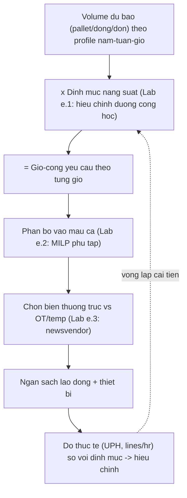
*Sơ đồ: chuỗi quyết định nguồn lực lao động — mỗi mũi tên ứng với một bài toán định lượng trong §e (khung theo mô hình nguồn lực Richards ch.11).*

#### e. Lab định lượng — ba mô hình được GIẢI trên dữ liệu tĩnh

> Cả ba lab dùng **dữ liệu cho sẵn (không random)**, có **tính tay** đối chiếu và **đã verify bằng máy** (script `assets/scripts/lab_m06_labor_productivity.py`).

##### e.1 — Lab A: Đường cong học (Wright 1936) — ước lượng bằng OLS log-log

**Vì sao (neo học thuật):** Wright (1936, *Journal of the Aeronautical Sciences*) quan sát rằng mỗi khi *sản lượng tích luỹ nhân đôi*, thời gian lao động trung bình tích luỹ mỗi đơn vị giảm một **tỷ lệ không đổi** — "đường cong học 80%" (giảm 20% mỗi lần nhân đôi). Áp vào kho: một nhân viên thời vụ mới *không* đạt định mức ngay; năng suất họ tăng dần theo số đơn đã xử lý. Bỏ qua quy luật này (§b.2) dẫn tới đánh giá oan và định biên sai mùa cao điểm.

> [!IMPORTANT] 📐 Công thức — Mô hình cumulative-average của Wright
> $$\bar{y}(n) = a \cdot n^{b}, \qquad b = \frac{\ln r}{\ln 2}$$
> - $\bar{y}(n)$: thời gian trung bình tích luỹ mỗi đơn sau $n$ đơn (phút/đơn).
> - $a$: thời gian đơn đầu tiên; $r$: tỷ lệ học (learning rate, vd 0,80); $b<0$.
> - Tuyến tính hoá: $\ln \bar{y} = \ln a + b\,\ln n$ → **hồi quy OLS** trên log-log để *ước lượng* $a,b$ từ dữ liệu quan sát.
> - **Thời gian biên** (đơn thứ $n$) ≈ $a(1+b)\,n^{b}$ — đại lượng dùng để biết khi nào nhân viên *chạm định mức*.

> [!IMPORTANT] 📐 Đề bài (tĩnh) & Tính tay
> Quan sát thời gian TB tích luỹ (phút/đơn) của một nhân viên mới tại các mốc nhân đôi:
>
> | n (đơn tích luỹ) | 1 | 2 | 4 | 8 | 16 | 32 | 64 | 128 |
> |---|---|---|---|---|---|---|---|---|
> | $\bar{y}$ (phút/đơn) | 20,00 | 16,00 | 12,80 | 10,24 | 8,192 | 6,5536 | 5,24288 | 4,1943 |
>
> **Tính tay** độ dốc từ hai điểm $n=1$ và $n=64$:
> $$b = \frac{\ln 5{,}24288 - \ln 20}{\ln 64 - \ln 1} = \frac{-1{,}33887}{4{,}15888} = -0{,}32193 \;\Rightarrow\; r = 2^{b} = 0{,}800.$$
> Đúng đường cong 80%. Hồi quy OLS toàn bộ 8 điểm phải trả về cùng $b$ (dữ liệu nằm trọn trên đường thẳng log-log).

```python
import numpy as np
n   = np.array([1,2,4,8,16,32,64,128], dtype=float)
ybar= np.array([20.0,16.0,12.8,10.24,8.192,6.5536,5.24288,4.194304])
X, Y = np.log(n), np.log(ybar)
b_hat, lna_hat = np.polyfit(X, Y, 1)        # OLS log-log
a_hat = np.exp(lna_hat); r_hat = 2.0**b_hat
def marginal(nn): return a_hat*nn**b_hat*(1+b_hat)   # thoi gian bien
target = 4.0                                          # dinh muc bien 4 phut/don
n_star = (target/(a_hat*(1+b_hat)))**(1.0/b_hat)
```

```text
a_hat = 20.0000 phut | b_hat = -0.32193 | r_hat = 0.8000 (-20%/lan nhan doi) | R^2 = 1.000000
n= 50 : TB tich luy=5.68 | thoi gian bien~3.85 phut/don
n=100 : TB tich luy=4.54 | thoi gian bien~3.08 phut/don
n=200 : TB tich luy=3.63 | thoi gian bien~2.46 phut/don
-> Dat dinh muc bien 4.0 phut/don sau ~44 don tich luy
```

Kết quả khớp tính tay ($r=0{,}80$, $R^2=1$). **Ý nghĩa quản trị:** nhân viên mới chạm định mức biên 4 phút/đơn chỉ sau ~44 đơn — nên *kế hoạch định biên mùa cao điểm phải tính khoảng "khởi động"* này, đừng kỳ vọng năng suất đầy đủ từ ngày đầu (nối §f).

> [!NOTE] 💻 Giả định & hạn chế (bậc thạc sĩ)
> - **Giả định:** tỷ lệ học *không đổi* và quan hệ *log-tuyến tính* trên toàn dải — thực tế đường cong **bão hoà (plateau)** khi chạm trần sinh lý/thiết bị; mô hình Wright *quá lạc quan* ở đuôi xa.
> - **Identification/bias:** ở đây dữ liệu sạch (nằm trọn trên đường) nên OLS trả $R^2=1$; với dữ liệu thực, thời gian quan sát *nội sinh* với nỗ lực, mệt mỏi, độ khó đơn — sai số đo và **tự tương quan** làm OLS chệch. Nghiêm trọng nhất là **thiên lệch sống sót (survivorship bias)**: người học chậm bỏ việc sớm → mẫu còn lại "học nhanh giả tạo", phóng đại $r$.
> - **Phạm vi hiệu lực:** đúng cho tác vụ lặp, một người. Không suy ra cho năng suất *nhóm* (có hiệu ứng phối hợp/nghẽn — §b.2).

##### e.2 — Lab B: Xếp ca dạng phủ tập (Dantzig 1954) — MILP

**Vì sao (neo học thuật):** Dantzig (1954) phát biểu bài toán xếp ca *trạm thu phí* dưới dạng **set-covering** — chọn số người cho từng *mẫu ca* sao cho mọi khung giờ được phủ đủ nhu cầu với chi phí nhỏ nhất. Đây chính xác là bài toán của trưởng kho khi nhu cầu *afternoon-heavy* (Richards: 80% xuất dồn ca chiều). Định cỡ theo trung bình ngày là sai (§c.1); phải giải tối ưu theo profile giờ.

> [!IMPORTANT] 📐 Công thức — Set-covering xếp ca
> $$\min \sum_{s} c_s x_s \quad \text{s.t.} \quad \sum_{s:\, t\in s} x_s \ge r_t \;\; \forall t, \qquad x_s \in \mathbb{Z}_{\ge 0}$$
> - $x_s$: số nhân viên gán cho mẫu ca $s$ (biến nguyên); $c_s$: chi phí một ca $s$.
> - $r_t$: số pickers cần ở giờ $t$ (suy ra từ lines/giờ ÷ định mức).
> - Ràng buộc: tổng người của *mọi ca phủ giờ $t$* phải ≥ nhu cầu giờ đó.

> [!IMPORTANT] 📐 Đề bài (tĩnh) & Tính tay
> Cửa sổ 12 giờ (08–20h). Nhu cầu pickers theo giờ (afternoon-heavy):
> $r = [3,3,4,4,5,6,8,9,10,9,6,4]$ (đỉnh 10 ở giờ 9 ≈ 16h).
> Mẫu ca: **FT 8h** (£15/h × 8 = £120) bắt đầu 08/10/12h; **PT 4h** (£17/h × 4 = £68, phụ trội ca ngắn) bắt đầu 08/12/14/16h.
> **Tính tay (chặn dưới & so sánh):** tổng giờ-công *nhu cầu* = 71 giờ → sàn lý thuyết tuyệt đối (nếu phủ khít không lãng phí) = 71 × £15 = **£1.065**. Staff *phẳng theo đỉnh* (10 người suốt 12h) = 120 giờ-công × £15 = **£1.800**. Lời giải tối ưu phải nằm giữa hai mốc này.

```python
import pulp
hours = list(range(1,13))
req = {1:3,2:3,3:4,4:4,5:5,6:6,7:8,8:9,9:10,10:9,11:6,12:4}
shifts = {  # ten: (gio phu, chi phi)
 "FT_08_16":(list(range(1,9)),120), "FT_10_18":(list(range(3,11)),120),
 "FT_12_20":(list(range(5,13)),120),"PT_08_12":(list(range(1,5)),68),
 "PT_12_16":(list(range(5,9)),68),  "PT_14_18":(list(range(7,11)),68),
 "PT_16_20":(list(range(9,13)),68)}
m = pulp.LpProblem("shift_cover", pulp.LpMinimize)
x = {s: pulp.LpVariable("x_%s"%s, lowBound=0, cat="Integer") for s in shifts}
m += pulp.lpSum(shifts[s][1]*x[s] for s in shifts)
for t in hours:
    m += pulp.lpSum(x[s] for s in shifts if t in shifts[s][0]) >= req[t]
m.solve(pulp.PULP_CBC_CMD(msg=0))
```

```text
Trang thai: Optimal
  FT_10_18 x1 (120) | FT_12_20 x5 (600) | PT_08_12 x3 (204) | PT_14_18 x3 (204) | PT_16_20 x1 (68)
  TONG CHI PHI TOI UU = GBP 1196
  Kiem tra phu: moi gio staffed >= req -> True (vd gio 9: can 10, co 10)
  Tong gio-cong THUA (idle) = 5
  [So sanh] Staff phang theo peak: 120 gio-cong x 15 = GBP 1800
  [So sanh] San ly thuyet (71 gio-cong nhu cau) = GBP 1065
```

Lời giải tối ưu **£1.196** nằm đúng giữa sàn £1.065 và phương án ngây thơ £1.800 — **tiết kiệm ~34%** so với staff-phẳng-theo-đỉnh, chỉ với 5 giờ-công dư (idle không thể tránh do hạt rời rạc của ca). Phủ đủ mọi giờ kể cả đỉnh =10. Đây là lượng hoá chính xác cho khuyến nghị định tính của Richards ("đừng định cỡ theo trung bình").

> [!NOTE] 💻 Giả định & hạn chế (bậc thạc sĩ)
> - **Giả định:** nhu cầu $r_t$ *xác định* (deterministic) và biết trước; nhân viên *đồng nhất* (một kỹ năng); ca *liên tục* không nghỉ giữa; bỏ luật lao động (nghỉ giải lao, tối thiểu giờ/ca).
> - **Hạn chế:** bỏ qua **bất định nhu cầu** — ngày thực $r_t$ dao động; nghiệm cứng có thể thiếu hụt khi đỉnh vượt dự báo (Lab e.3 vá lỗ hổng này bằng đệm thường trực/OT). Mở rộng đúng hướng: *stochastic set-covering* hoặc thêm ràng buộc nghỉ → bài toán *shift-scheduling* tổng quát (NP-hard), giải bằng column generation khi quy mô lớn.
> - **Phạm vi:** phủ tập đúng khi *coverage* là ràng buộc chính. Khi cần gán đúng người-việc theo kỹ năng → chuyển sang *assignment/GAP* (xem §d).

##### e.3 — Lab C: Định biên đỉnh kiểu newsvendor — critical ratio

**Vì sao (neo học thuật):** Richards (ch.11, Fig 11.5) mô tả đường "giờ-công gia quyền" theo số nhân viên *thường trực* có dạng **chữ U phẳng** — quá ít thường trực thì đắt vì overtime/temp; quá nhiều thì đắt vì *idle*. Bài toán "chọn mức thường trực dưới nhu cầu đỉnh bất định" chính là **newsvendor** (Arrow–Harris–Marschak 1951): cân *chi phí thiếu* (understaff) với *chi phí thừa* (overstaff). Lab này *hình thức hoá* đường cong U định tính của Richards thành điểm tối ưu đóng.

> [!IMPORTANT] 📐 Công thức — Critical ratio (newsvendor)
> $$F(H^\*) = \frac{C_u}{C_u + C_o} \quad\Rightarrow\quad H^\* = \text{phân vị nhỏ nhất của } D \text{ thoả } F(H^\*) \ge \frac{C_u}{C_u+C_o}$$
> - $H$: mức lao động thường trực (giờ-công/ngày đỉnh); $D$: khối lượng ngày đỉnh (ngẫu nhiên).
> - $C_u$: chi phí thiếu mỗi giờ (phụ trội OT/temp); $C_o$: chi phí thừa mỗi giờ (idle — trả lương không có việc).
> - Trực giác: tỷ số tới hạn là *xác suất phục vụ tối ưu* — staff thường trực tới phân vị đó, phần đỉnh còn lại để OT/temp gánh.

> [!IMPORTANT] 📐 Đề bài (tĩnh) & Tính tay
> Phân phối rời rạc khối lượng ngày đỉnh (giờ-công), quanh dải Richards (~420–525):
>
> | $D$ | 420 | 455 | 490 | 525 |
> |---|---|---|---|---|
> | $p$ | 0,15 | 0,35 | 0,30 | 0,20 |
> | $F(D)$ | 0,15 | 0,50 | 0,80 | 1,00 |
>
> Chi phí: $C_o=£15$/giờ (idle = lương cơ bản, không việc); $C_u=£7{,}5$/giờ (phụ trội OT = (1,5−1,0)×15).
> **Tính tay:** $CR = \dfrac{7{,}5}{7{,}5+15} = 0{,}3333$. Phân vị nhỏ nhất có $F\ge 0{,}3333$ là $D=455$ (vì $0{,}15<0{,}333\le0{,}50$) → $H^\*=455$ giờ-công.

```python
scenarios=[420,455,490,525]; probs=[0.15,0.35,0.30,0.20]
Co, Cu = 15.0, 7.5
CR = Cu/(Cu+Co)                                   # 0.3333
def exp_cost(H):                                  # chi phi lech ky vong
    return sum(p*(Co*max(H-d,0)+Cu*max(d-H,0)) for d,p in zip(scenarios,probs))
best = min(scenarios, key=exp_cost)
```

```text
Critical ratio CR = 0.3333
  D=420 F=0.15 | D=455 F=0.50 | D=490 F=0.80 | D=525 F=1.00  -> H* = 455
  E[chi phi lech]: H=420 ->406.88 | H=455 ->262.50 | H=490 ->393.75 | H=525 ->761.25
  -> argmin E[cost] = 455 (khop critical-ratio: True)
  Quy ve FTE @7.16 gio/ca: H*=455 -> ~63.5 nguoi thuong truc
```

Liệt kê chi phí lệch kỳ vọng cho cực tiểu tại **H\*=455** — *khớp* nghiệm critical-ratio. Quy ra ~63,5 FTE thường trực, phần đỉnh trên 455 giờ để overtime/temp gánh. **Đây là lý do toán học** đằng sau quy tắc thực chiến "đừng định biên thường trực tới đỉnh": vì $C_u<C_o$ ở đây (phụ trội OT rẻ hơn idle), tối ưu là *thiếu một cách có chủ đích* rồi vá bằng OT.

> [!NOTE] 💻 Giả định & hạn chế (bậc thạc sĩ)
> - **Giả định:** một kỳ (single-period), $C_u,C_o$ *tuyến tính* và biết chắc; bỏ chi phí *phi tuyến* khi temp quá đông (Richards: >20 temp thì khó quản, năng suất tụt — đường cong học §e.1 lại xuất hiện) và *trần khả dụng* OT (luật giờ làm).
> - **Hạn chế:** newsvendor giả định phân phối $D$ *đã biết* — thực tế phải *ước lượng* từ lịch sử (sai số tham số). Nếu $C_u$ gồm cả *mất dịch vụ* (đơn trễ → mất khách) thì $C_u$ tăng mạnh → $CR$ tăng → $H^\*$ dịch lên: thiết kế incentive & SLA (§g) thay đổi chính nghiệm này.
> - **Phạm vi:** đúng cho quyết định *mức đệm* một mùa. Nhiều mùa nối tiếp với chuyển tiếp tồn-kho-kỹ-năng (giữ người giữa các đỉnh) → cần mô hình *động* (quy hoạch động/stochastic nhiều kỳ).

#### f. Thực thi: mô hình nguồn lực, đường cong U-phẳng & thang thời vụ

Ba lab trên hội tụ vào **mô hình nguồn lực (resource model)** của Richards (ch.11) — công cụ SOP nền tảng của trưởng kho.

> [!TIP] 🛠️ Quy trình thực thi (SOP) — dựng & dùng mô hình nguồn lực
> 1. **Phân rã hoạt động:** liệt kê các tác vụ xử lý chính (nhận, cất, nhặt, hoàn tất, xuất) — chiếm >80% touch points; bỏ qua phần đuôi vụn (luật lợi suất giảm dần).
> 2. **Gán định mức & khối lượng:** mỗi tác vụ × volume ÷ định mức (§b, hiệu chỉnh đường cong học §e.1) → giờ-công yêu cầu.
> 3. **Mô hình hoá biến thiên:** dựng profile *trung bình* và *đỉnh*; áp biến thiên năm → tuần → ngày → *giờ* (đỉnh giờ chiều cho pick/xuất).
> 4. **Phân bổ vào ca:** giải xếp ca theo *giờ bận nhất của ngày bận nhất* (Lab e.2), không theo trung bình.
> 5. **Chọn cơ cấu lao động:** quét số *thường trực*; mô hình tự sinh giờ idle, overtime (tới trần cài sẵn) rồi temp cho phần dư (Lab e.3 cho mức tối ưu).
> 6. **Đối soát & tinh chỉnh:** nhân mỗi phần tử với số ngày/tuần áp dụng, cộng về tổng năm; thêm dự phòng (1–2 FTE) cho bất trắc; chuyển sang ngân sách tài chính.

Đầu ra điển hình là **đường cong giờ-công gia quyền hình chữ U phẳng** (Richards Fig 11.5): trong ví dụ của ông, chênh lệch giữa 57 và 58 nhân viên thường trực là *không đáng kể* — vùng đáy phẳng nghĩa là *sai một vài người không tốn nhiều*, nhưng lệch xa thì đắt nhanh (quá ít → bùng OT/temp + năng suất tụt; quá nhiều → idle). Tính chất "đáy phẳng" này lặp lại y hệt bài toán bề rộng lối đi ([§6.2.2](#622-tính-công-suất-chứa--chiều-rộng-lối-đi-reach-truck-vna)) và EOQ — một họ hàm chi phí tổng U mà cực tiểu *robust* quanh điểm tối ưu.

**Thời vụ & đỉnh** xử lý bằng *thang leo* (Richards ch.11): thường trực gánh nền → vượt nền dùng *overtime* (tới trần đã thoả thuận) → vượt nữa dùng *temp*. Tuần đỉnh có thể mở ca-6-ngày: ví dụ Richards, nhu cầu *tuần* đỉnh tăng ~50% so với trung bình (dù *ngày* đỉnh chỉ bận hơn ~20%) — chính độ vênh này biện minh cho ngày làm việc thứ sáu. Cảnh báo: temp quá đông (>~20) thì *đường cong học* (§e.1) kéo năng suất xuống, nên có trần thực tế cho temp.

> [!CAUTION] 📦 CASE STUDY — Đường cong U-phẳng & cut-off 22h của Next (Richards ch.11)
> - **Bối cảnh:** kho ambient hai ca, lõi pick-pallet/case + e-commerce. Profile *afternoon-heavy* vì khách đặt tới cut-off chiều cho giao hôm sau.
> - **Diễn biến:** Next (bán lẻ UK) đẩy cut-off tới *22h* cho giao hôm sau → cửa sổ pick/xuất nén vào chiều-tối; nhu cầu LLOP buổi chiều *gấp 4 lần* sáng. Mô hình nguồn lực chỉ ra tối ưu 57–58 thường trực (đáy phẳng), +1–2 dự phòng → 59–60.
> - **Bài học:** quyết định thương mại (cut-off muộn để tăng dịch vụ) *dịch toàn bộ profile lao động* sang chiều → ép xếp ca (Lab e.2) và định biên đệm (Lab e.3). Lao động kho là *hệ quả hạ nguồn* của lời hứa dịch vụ — không thể tối ưu tách rời.

#### g. Incentive & động lực — vì sao "đo gì được nấy"

Đây là tầng *vì sao* sâu nhất của mục, và là nơi lý thuyết kinh tế cho câu trả lời mà sách vận hành không có. Câu hỏi: *trả lương theo sản lượng (piece rate) hay theo giờ?*

**Bằng chứng — Lazear (2000), *Performance Pay and Productivity* (AER):** khi Safelite Glass (lắp kính ô tô) chuyển từ lương giờ sang **piece rate**, sản lượng/công nhân tăng **+44%** (Nguồn: Lazear, 2000). Quan trọng hơn con số: Lazear phân tách *một nửa* mức tăng đến từ **hiệu ứng khuyến khích** (cùng người làm nhiều hơn), *một nửa* từ **hiệu ứng phân loại/sàng lọc (sorting)** — piece rate thu hút và giữ người năng suất cao, đẩy người kém tự rời. Đây là phát hiện then chốt: incentive không chỉ *thúc* nỗ lực, nó *tái cấu trúc lực lượng lao động*.

**Vì sao không phải lúc nào cũng dùng piece rate? — Holmström (1979) & Holmström–Milgrom (1991):** lý thuyết *người uỷ thác–đại diện* (principal-agent) chỉ ra incentive mạnh chỉ tối ưu khi đầu ra *đo được chính xác* và *một chiều*. Khi công việc **đa nhiệm (multitask)** — vừa nhanh *vừa* chính xác *vừa* an toàn — thưởng mạnh cho chiều *đo được* (tốc độ) sẽ *rút nỗ lực* khỏi chiều *khó đo* (chất lượng, an toàn, giữ gìn thiết bị). Đây là nền lý thuyết cho bẫy Goodhart ở §c.1: thưởng UPH đơn thuần → tai nạn & sai sót tăng.

> [!WARNING] 🪤 Bẫy incentive — tối đa hoá tốc độ giết chết chất lượng & an toàn
> - **Một chiều thưởng tốc độ:** đẩy UPH lên, kéo accuracy & an toàn xuống (multitask, Holmström–Milgrom). Phải thưởng *rổ chỉ tiêu cân bằng* (năng suất × chính xác × an toàn) hoặc đặt *điều kiện ngưỡng* (chỉ thưởng tốc độ nếu accuracy ≥99,5%).
> - **Định mức quá chặt → "soldiering":** công nhân giấu năng suất thật vì sợ định mức bị siết (chính hiện tượng Taylor 1911 quan sát). Định mức phải *minh bạch & ổn định* để giữ buy-in (§b.2).
> - **Piece rate cho tác vụ biến thiên cao:** khi độ khó đơn dao động mạnh (e-commerce), piece rate "phẳng" tạo bất công → khiếu nại. Cần chuẩn hoá theo độ khó hoặc dùng thưởng nhóm.

> [!IMPORTANT] 💡 INSIGHT — Tam giác bất khả thi của đo lường lao động & cách hoá giải
> Gộp §c–§g lại lộ ra một nguyên lý xuyên suốt: **năng suất, độ chính xác và an toàn là một tam giác đánh đổi dưới mọi sơ đồ khuyến khích đơn chiều**. Vật lý chung: nỗ lực con người là nguồn lực hữu hạn được *phân bổ* giữa các chiều; thưởng lệch một chiều thì rút khỏi chiều khác (Holmström–Milgrom). Ba "bẫy" rời rạc — gaming UPH (§c), soldiering (§b), tai nạn do ép tốc độ (§g) — thực ra là *cùng một hiện tượng* nhìn từ ba góc. Cách hoá giải không phải "đo nhiều hơn" mà là (i) đo *cặp đối trọng*, (ii) đặt *ngưỡng chặn* cho chiều khó đo, (iii) dùng *balanced scorecard* (Kaplan–Norton) thay vì một KPI tối thượng. Với vai trò quản trị vận hành: trước khi treo thưởng bất kỳ chỉ tiêu nào, hỏi *"nó rút nỗ lực khỏi chiều nào?"* — đó là câu hỏi Holmström, không phải câu hỏi Taylor.

> [!IMPORTANT] 💡 INSIGHT — Lao động kho là nơi ba module hội tụ: thiết kế, dòng chảy, con người
> Năng suất lao động không phải biến *gốc* — nó là *đầu ra* của cả hệ. Hình học (6.2) đặt khoảng cách di chuyển; slotting & routing (6.1) định lộ trình; định mức & incentive (mục này) đo và thúc nỗ lực *trên* nền đó. Một cách nhìn thống nhất qua **Định luật Little** ([§6.1.1](#611-động-lực-học-dòng-chảy-kho-receiving--put-away--storage--picking--despatch)): throughput = WIP / thời gian chờ. Tăng năng suất bền vững nghĩa là *giảm thời gian mỗi tác vụ* (đường cong học, định mức) **hoặc** *giảm tác vụ thừa* (thiết kế tốt) — không phải "ép người chạy nhanh hơn". Đó là lý do trưởng kho giỏi đầu tư vào layout, slotting và đào tạo *trước*, rồi mới tới sơ đồ thưởng — sửa nền rẻ và bền hơn ép ngọn.

#### h. Bẫy tổng hợp & Case study

> [!CAUTION] 📦 CASE STUDY — ROI voice picking: năng suất + độ chính xác cùng tăng (Richards ch.12)
> - **Bối cảnh:** một khách hàng thay barcode-scan picking bằng **voice picking**.
> - **Diễn biến (số thực):** tiết kiệm năng suất £52.800 + tăng độ chính xác £33.600 = tổng £86.400/năm; đầu tư £68.900. ROI năm đầu = (86.400−68.900)/68.900 = **25,4%**; payback = 68.900/86.400 × 12 = **9,6 tháng**.
> - **Bài học:** công nghệ rảnh-tay-rảnh-mắt phá *tam giác đánh đổi* (§g) — nâng *cả* tốc độ *lẫn* độ chính xác cùng lúc, thay vì đánh đổi. Đây là cách "dịch chuyển đường biên" thay vì trượt dọc theo nó. (Lưu ý sách: ROI này chưa trừ chi phí đào tạo & gián đoạn giai đoạn đầu.)

> [!CAUTION] 📦 CASE STUDY — Benchmark Mondelēz toàn châu Âu (Richards ch.13)
> - **Bối cảnh:** Mondelēz benchmark *mọi* DC châu Âu trên cùng bộ 34 chỉ tiêu thuộc 8 nhóm (vận hành, KPI dịch vụ, tồn kho, an toàn LTIFR, chất lượng, môi trường).
> - **Bài học:** chuẩn hoá đo lường *xuyên site* cho phép phát hiện best-practice nội bộ & so 3PL với in-house. Nhưng Richards cảnh báo: *"as good as is not better than"* — benchmark chỉ tới *best current practice*, không thay được sáng tạo. Đừng tôn benchmark thành trần.

#### i. Liên kết chéo

> [!NOTE] 🔗 Liên kết chéo
> - **Năng suất là hệ quả của thiết kế:** hình học dòng chảy [§6.2.1](#621-hình-học-dòng-chảy-u-flow-vs-through-flow-layout), công suất & lối đi [§6.2.2](#622-tính-công-suất-chứa--chiều-rộng-lối-đi-reach-truck-vna).
> - **Năng suất là hệ quả của tác nghiệp:** chiến lược lấy hàng [§6.1.2](#612-chiến-lược-lấy-hàng-batch--zone--wave-picking), slotting COI [§6.1.3](#613-tối-ưu-vị-trí-xếp-hàng-slotting-bằng-cube-per-order-index-coi).
> - **Định luật dòng chảy nền:** Little's Law & động lực học kho [§6.1.1](#611-động-lực-học-dòng-chảy-kho-receiving--put-away--storage--picking--despatch).
> - **Công nghệ thực thi định mức/directed work:** WMS & RF/voice [§6.3.2](#632-wms--kiến-trúc-công-nghệ-kho).
> - **An toàn (chiều bị incentive tốc độ đe doạ):** [§6.3.3](#633-an-toàn-pccc-bảo-trì-mhe--5s).
> - **Tối ưu tổng bằng LP/MILP:** [§6.5](#65-tối-ưu-hóa-kho-bằng-quy-hoạch-tuyến-tính-liu-ch7-pulp) (Lab e.2 là một thể hiện của họ MILP này).

> [!NOTE] 🌐 Cập nhật benchmark năng suất (deep research)
> - Khảo sát **WERC DC Measures (2025)** ghi nhận nhóm dẫn đầu đạt **≥ ~93 dòng nhặt & xuất/giờ** (so trung vị ~28 ở khảo sát 2013), và tỷ lệ DC dùng **voice picking ~25%** — gần gấp đôi thập kỷ trước (Nguồn: WERC DC Measures Survey 2025; Honeywell/WERC, 2024–2025).
> - Lao động kho chịu áp lực *giảm năng suất do e-commerce* (đơn nhỏ, nhiều dòng) — củng cố vì sao đường cong học & incentive đa chiều ngày càng quan trọng (nguồn: Web — Lucas Systems, *Warehouse Labor Productivity Is Declining*).

##### 📚 Nguồn (mục 6.3.1)

**Sách (nền chính):**
- Richards, G., *Warehouse Management: A Complete Guide* — ch.11 *Resourcing a warehouse* (mô hình nguồn lực, định mức, đường cong U-phẳng, thang overtime→temp), ch.12 *Warehouse costs* (cơ cấu chi phí, ABC, ROI voice picking), ch.13 *Performance management* (bộ KPI, perfect order, benchmark WERC 2013 & Mondelēz, SMART).
- Rushton, A., Croucher, P. & Baker, P., *The Handbook of Logistics & Distribution Management* — chương People & cost (đường cong chi phí–dịch vụ).

**Lớp học thuật toàn cầu (chuẩn sau-đại học):**
- Taylor, F.W. (1911), *The Principles of Scientific Management* — định mức & "one best way".
- Gilbreth, F.B. & Gilbreth, L.M. — motion study, therbligs.
- MTM / PMTS; Tippett, L.H.C. (1935) — lấy mẫu công việc (work sampling), nền thống kê.
- Wright, T.P. (1936), *Factors Affecting the Cost of Airplanes*, J. Aeronautical Sciences — đường cong học (cumulative-average).
- Dantzig, G.B. (1954), *A comment on Edie's "Traffic delays at toll booths"*, Operations Research — xếp ca dạng phủ tập.
- Arrow, K., Harris, T. & Marschak, J. (1951) — mô hình newsvendor (single-period).
- Holmström, B. (1979), *Moral Hazard and Observability*; Holmström, B. & Milgrom, P. (1991), *Multitask Principal-Agent Analyses* — lý thuyết incentive đa nhiệm.
- Lazear, E.P. (2000), *Performance Pay and Productivity*, AER — bằng chứng piece rate Safelite (+44%).
- Little, J.D.C. (1961) — định luật dòng chảy (liên kết).

**Deep research (web):** WERC DC Measures Survey (2025); Honeywell/WERC KPI (2024–2025); Lucas Systems — *Warehouse Labor Productivity Is Declining*. Mọi số liệu web đặt trong khối 🌐 với trích dẫn nội tuyến.

### 6.3.2. WMS & Kiến trúc Công nghệ Kho ✅

> **Nguyên tắc biên soạn & quy ước trình bày:**
> - **Nền chính = sách thực hành** (Richards, *Warehouse Management* ch.8 *Warehouse management systems*, ch.5–6 *Picking strategies & methods* cho công nghệ pick, ch.17 *The warehouse of the future*).
> - **Lớp học thuật toàn cầu (tầng "vì sao"):** ra quyết định đa tiêu chí (**Saaty 1977/1980 — AHP**), định luật dòng chảy (**Little 1961**) cho định cỡ tự động hoá, nghịch lý năng suất CNTT (**Brynjolfsson 1993**), mô hình chấp nhận công nghệ (**Davis 1989 — TAM**). Tra `references/canon-map-scm.md` (hàng *WMS & công nghệ kho*).
> - **Lý thuyết viết dày, giọng giáo trình**; **deep research (web) chỉ BỔ SUNG** trong khối 🌐 (kiến trúc WMS→WES→WCS & orchestration là chủ đề tiến hoá nhanh nên có bổ sung web).

---

#### 📌 Bốn lăng kính trong mục 6.3.2

> Công nghệ kho là nơi **Chiến lược và Thực thi cùng làm trọng tâm**: chiến lược chọn *kiến trúc hệ thống* và quyết định *build/buy/SaaS* (sai ở đây thì đắt và khó sửa nhất); thực thi là *phân hệ directed-work* và quy trình triển khai. Toán & Data hỗ trợ ra quyết định chọn hệ (AHP) và định cỡ tự động hoá (Little).

| Lăng kính | Mức nhấn | Thể hiện ở đâu |
|---|---|---|
| 🎯 **Chiến lược** | ●●● Trọng tâm | §a (kiến trúc nhiều tầng), §f (build vs buy/SaaS), §g (vì sao dự án WMS thất bại; nghịch lý năng suất) |
| 🛠️ **Thực thi** | ●●● Trọng tâm | §b (phân hệ, directed work, task interleaving, ASN/EDI), §f (SOP chọn & triển khai) |
| 📐💻 **Toán & Data** | ●● Bổ trợ | §d (bản đồ bài toán), §e.1 (**AHP chọn WMS** — eigenvector + CR), §e.2 (**định cỡ G2P/robot** — Little) |
| 🧭 **Hoạch định** | ●● Bổ trợ | §c (orchestration WES; công suất automation), §e.2 (định cỡ trạm theo throughput) |

#### a. Bản chất: thông tin là thứ làm hàng dịch chuyển

*"Trade isn't about goods… Goods sit in the warehouse until information moves them"* (C.J. Cherryh, đề từ Richards ch.8). Câu này không phải tu từ — nó là **nguyên lý nền (first-principle)** của công nghệ kho: mọi pallet đứng yên cho tới khi một *lệnh thông tin* (đặt hàng → phân bổ → directed task) kích nó di chuyển. Vì thế chất lượng và *tốc độ* của dòng thông tin đặt trần cho năng suất vật lý. Một kho có layout hoàn hảo (6.2) và slotting tối ưu (6.1.3) vẫn ì ạch nếu tầng thông tin chậm, sai, hoặc bắt người tự nhớ vị trí hàng.

##### a.1 — WMS không phải hệ kiểm soát tồn kho (phân biệt nền tảng)

Sai lầm tốn kém nhất Richards (ch.8) nhấn đi nhấn lại: **hệ kiểm soát tồn kho (stock-control / ERP inventory) KHÁC hệ quản trị kho (WMS)**.

- **Stock-control / ERP inventory** trả lời câu hỏi *"có bao nhiêu, ở vị trí nào"* — quản lý *trạng thái tồn kho*.
- **WMS** trả lời câu hỏi *"ai làm việc gì, theo trình tự nào, đi đường nào"* — quản lý *năng suất và quy trình* theo thời gian thực: directed put-away, optimal pick path, task interleaving, replenishment, wave release.

Một ERP có thể biết chính xác kho có 5.000 pallet nhưng *không* tối ưu lộ trình nhặt hay điều phối công việc — đó là khoảng trống nuốt chửng nhiều dự án (case §h). Đây cũng là điều kiện biên trả lời câu hỏi quan trọng: *khi nào KHÔNG cần WMS?* Richards thẳng thắn — kho nhỏ, ít SKU, quy trình giấy *quản lý tốt* vẫn chạy được; "không phải ai cũng cần WMS". WMS chỉ tạo giá trị khi quy mô/độ phức tạp/throughput đủ lớn để chi phí license + triển khai được ROI bù lại (§f).

##### a.2 — Kiến trúc nhiều tầng: ERP → WMS → WES → WCS → thiết bị

Để hiểu công nghệ kho hiện đại, phải thấy nó là một **chồng tầng (stack)** phân tách trách nhiệm — không phải một khối phần mềm. Mỗi tầng vận hành ở một *nhịp thời gian* khác nhau, và hiểu ranh giới giữa chúng là chìa khoá tránh mua nhầm/tích hợp sai.

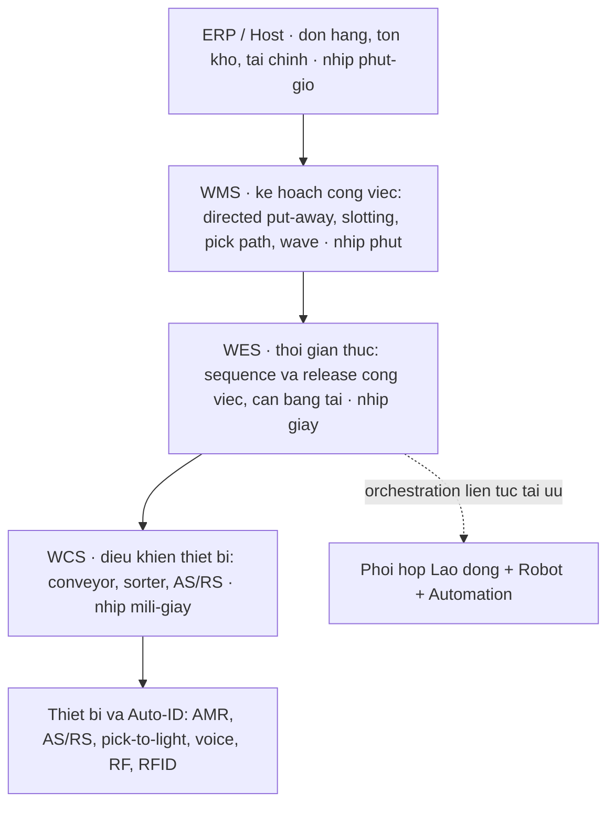
*Sơ đồ: chồng tầng hệ thống kho. WMS lập kế hoạch (theo cầu/đơn/tồn), WES tuần tự hoá & giải phóng công việc cho dòng chảy liên tục, WCS điều khiển thiết bị vật lý (tổng hợp Richards ch.8 + nguồn Web về WES/orchestration).*

> [!IMPORTANT] 🔑 Khái niệm cốt lõi — Ba tầng phần mềm điều khiển kho
> - **WMS (Warehouse Management System):** *lập kế hoạch* công việc dựa trên đơn hàng, tồn kho, cầu — "việc gì cần làm".
> - **WES (Warehouse Execution System):** *tuần tự hoá & giải phóng* công việc theo thời gian thực để dòng chảy không nghẽn, cân bằng tải giữa người–băng tải–robot — "làm theo thứ tự nào, ngay bây giờ".
> - **WCS (Warehouse Control System):** *điều khiển thiết bị* cấp lệnh cho conveyor, sorter, AS/RS — "ra lệnh phần cứng".
> Xu hướng 2024–2026: tầng **orchestration** mở rộng WES — phối hợp *xuyên khu vực* giữa lao động, AMR, automation với *tái-tối-ưu liên tục* thay vì theo lô (Nguồn: Logistics Viewpoints, 2026; Addverb, 2024). Hiểu ranh giới ba tầng giúp tránh mua một WMS rồi kỳ vọng nó điều khiển robot thời gian thực — đó là việc của WES/WCS.

#### b. Phân hệ WMS, directed work & tầng Auto-ID

Giá trị năng suất của WMS đến từ **directed work** — hệ *chỉ đạo* từng tác vụ thay vì để người tự quyết. Các phân hệ "best-practice" Richards (ch.8, dẫn BASDA) liệt kê:

- **Directed put-away:** hệ tự chọn vị trí cất tối ưu (theo slotting/velocity, [§6.1.3](#613-tối-ưu-vị-trí-xếp-hàng-slotting-bằng-cube-per-order-index-coi)) thay vì người tuỳ ý.
- **Task interleaving:** ghép một lệnh cất với một lệnh lấy trên cùng hành trình → triệt tiêu di chuyển rỗng (deadheading) — chính là *dual-command* đã lượng hoá ở [§6.2.3.c](#623-hệ-lưu-trữ-selective--drive-in--push-back--pallet-flow--as-rs).
- **Optimal pick sequence:** hệ tính lộ trình nhặt ngắn nhất ([§6.1.2](#612-chiến-lược-lấy-hàng-batch--zone--wave-picking)).
- **Wave/replenishment management:** gom & giải phóng đơn theo sóng, tự sinh lệnh bổ sung hàng pick-face.

Bên dưới directed work là **tầng nhận dạng tự động (Auto-ID)** — cách lệnh thông tin chạm tới tay người/máy. Mỗi công nghệ là một điểm trên đường biên *tốc độ ↔ độ chính xác ↔ chi phí ↔ tính linh hoạt*:

| Công nghệ | Cơ chế | Mạnh | Yếu / điều kiện |
|---|---|---|---|
| **Paper pick list** | Danh sách giấy | Rẻ, không cần hạ tầng | Chậm, dễ sai, không thời gian thực |
| **RF / radio data terminal** | Quét mã + màn hình cầm tay | Thời gian thực, xác nhận từng pick | Một tay bận thiết bị; phải nhìn màn hình |
| **Voice (pick-by-voice)** | Lệnh giọng nói, xác nhận bằng tiếng | **Rảnh tay–rảnh mắt** → nhanh & chính xác hơn | Chi phí headset; ồn; cần huấn luyện giọng |
| **Pick-/Put-to-light** | Đèn báo vị trí & số lượng | Rất nhanh trong zone cố định, ít lỗi | Vốn cố định theo vị trí; kém linh hoạt khi đổi slot |
| **RFID** | Sóng vô tuyến, đọc hàng loạt không cần line-of-sight | Đọc nhiều tag/lần, không cần quét từng cái | Giá tag; nhiễu kim loại/chất lỏng; chuẩn hoá |
| **Wearable / ring scanner** | Quét đeo tay | Rảnh tay, kết hợp directed work | Pin; bền |

**Tích hợp ngoài kho — ASN/EDI:** WMS phải "nói chuyện" với hệ của đối tác. **ASN (Advanced Shipping Notice)** — bản tin điện tử báo trước nội dung lô hàng sắp tới (EDI 856 / DESADV trong EDIFACT), thường kèm nhãn **GS1/SSCC** trên từng pallet. Nhờ ASN, kho *nhận hàng mù* trở thành *nhận hàng có dự báo*: quét một mã SSCC là biết cả pallet, đối chiếu tự động, phát hiện lệch ngay (đúng cơ chế case LPT §h). Đây là điều kiện để **cross-dock** ([§6.1.4](#614-cross-docking-chuyên-sâu)) và *receiving* tốc độ cao vận hành.

#### c. Goods-to-person & tự động hoá — bước nhảy năng suất

Như đã lập luận xuyên suốt M6, **di chuyển là thành phần thời gian lớn nhất** của picker (6.1.2, 6.3.1). Tự động hoá tấn công thẳng vào đó bằng nguyên lý **goods-to-person (G2P)**: thay vì người đi tới hàng, *hàng được mang tới người* qua AS/RS, mini-load, shuttle hoặc AMR.

> [!IMPORTANT] 💡 INSIGHT — G2P dịch chuyển đường biên, không trượt dọc nó
> Manual picking trượt *dọc* đường đánh đổi năng suất–chính xác–an toàn (§6.3.1.g — ép nhanh thì sai/nguy hiểm). G2P *dịch chuyển cả đường biên*: nó đồng thời nâng năng suất (**500–1.000 lines/giờ/operator** so trung vị WERC ~28 — nhanh ~20× ÷ §e.2), nâng độ chính xác (xử lý một SKU/lần + put-to-light), giảm footprint (**30–50%** ít hơn person-to-goods), và *rút đường cong học xuống ~15 phút* (Richards ch.5, Dematic/Vanderlande) thay vì hàng chục đơn (đối lập trực tiếp với đường cong học manual ở [§6.3.1.e.1](#631-quản-trị-lao-động--năng-suất-kho)). Cùng một nguyên lý với voice picking (§h): công nghệ đúng *phá* tam giác đánh đổi thay vì chấp nhận nó.

Họ thiết bị tự động (Richards ch.5–6): **AS/RS high-bay** (tới 30 m, FIFO, 24/7), **mini-load** (tote 40–250 kg, 350–700+ lines/giờ), **3D shuttle/gantry robot** (Cimcorp), và **AMR** (robot di động tự hành) — linh hoạt nhất vì không cần ray cố định. Điều phối toàn bộ chùm thiết bị này theo thời gian thực chính là việc của **WES/orchestration** (§a.2): nó cân tải giữa các trạm, quyết định robot nào phục vụ đơn nào, mở/đóng trạm theo volume ca.

> [!WARNING] 🪤 Bẫy — automation là "viên đạn bạc"
> Richards (ch.5) cảnh báo *"nhiều quản lý coi automation là viên đạn bạc"*. Tự động hoá chỉ đáng khi (i) **volume đủ cao** (ngưỡng tham khảo: >3.000 carton/ngày), (ii) **profile ổn định** (vốn cố định lớn ⇒ rủi ro nếu cầu đổi), (iii) **quy trình đã đúng trước khi tự động** (§g). Tự động hoá một quy trình tồi = *làm sai nhanh hơn và đắt hơn*, lại mất tính linh hoạt — đường cong U-phẳng của manual ([§6.3.1.f](#631-quản-trị-lao-động--năng-suất-kho)) cho phép sai số nhân lực rẻ, còn vốn AS/RS thì "đổ bê tông" như layout.

#### d. Góc Toán tối ưu — bản đồ bài toán ẩn

| Khâu công nghệ kho | Bài toán toán học | Lớp toán / phương pháp | Neo học thuật | Nơi giải |
|---|---|---|---|---|
| Chọn WMS/vendor theo nhiều tiêu chí xung đột | Ra quyết định đa tiêu chí | AHP (eigenvector ưu tiên + Consistency Ratio) | Saaty 1977/1980 | **Lab e.1** |
| Định cỡ số trạm/robot G2P theo throughput | Bảo toàn dòng + định cỡ công suất | Little's Law; tỷ số throughput/rate | Little 1961 | **Lab e.2** |
| Hàng chờ ở trạm G2P khi tote đến biến thiên | Hàng đợi nhiều kênh | M/M/c (Erlang C), Kingman | Erlang 1917; Kingman 1961 | §e.2 (mở rộng) |
| ROI/whole-life cost chọn hệ (5 năm) | Dòng tiền chiết khấu | NPV/payback | — | §f |
| Task interleaving (ghép cất–lấy) | Định tuyến dual-command | mô hình travel SC/DC | Bozer–White 1984 | [§6.2.3](#623-hệ-lưu-trữ-selective--drive-in--push-back--pallet-flow--as-rs) |
| Slotting do WMS điều khiển | Gán vị trí (SLAP) | COI / QAP | Heskett 1963; Koopmans–Beckmann | [§6.1.3](#613-tối-ưu-vị-trí-xếp-hàng-slotting-bằng-cube-per-order-index-coi) |

#### e. Lab định lượng — chọn hệ & định cỡ tự động hoá

> Cả hai lab dùng **dữ liệu cho sẵn (không random)**, có **tính tay** đối chiếu và **đã verify bằng máy** (`assets/scripts/lab_m06_wms_tech.py`).

##### e.1 — Lab A: Chọn WMS bằng AHP (Saaty) — eigenvector ưu tiên + Consistency Ratio

**Vì sao (neo học thuật):** chọn WMS là bài toán *đa tiêu chí xung đột* (tích hợp ↔ chức năng ↔ mở rộng ↔ chi phí). Ở [§6.2.3.e](#623-hệ-lưu-trữ-selective--drive-in--push-back--pallet-flow--as-rs) ta đã cảnh báo *bẫy gán điểm thứ tự rồi gia quyền* (ma trận Rushton): điểm tổng có thể đảo hạng chỉ vì cách đánh số. **AHP (Saaty 1977/1980)** giải đúng vấn đề đó: rút trọng số từ **so sánh cặp** (pairwise) qua *vector riêng chính (principal eigenvector)* của ma trận so sánh, và quan trọng nhất — **kiểm tra tính nhất quán** bằng *Consistency Ratio (CR)*. Nếu CR ≥ 0,10, các phán đoán mâu thuẫn nhau ⇒ phải làm lại; đây là cơ chế tự-kiểm mà chấm điểm ngây thơ không có.

> [!IMPORTANT] 📐 Công thức — Vector ưu tiên & Consistency Ratio
> $$w_i = \frac{\left(\prod_{j=1}^n a_{ij}\right)^{1/n}}{\sum_k \left(\prod_j a_{kj}\right)^{1/n}} \quad(\text{xấp xỉ trung bình nhân của eigenvector})$$
> $$\lambda_{\max} = \text{mean}\!\left(\frac{(A\mathbf{w})_i}{w_i}\right), \quad CI = \frac{\lambda_{\max}-n}{n-1}, \quad CR = \frac{CI}{RI(n)}$$
> - $a_{ij}$: tiêu chí $i$ quan trọng gấp mấy lần $j$ (thang Saaty 1–9). $\;RI(4)=0{,}90$ (chỉ số ngẫu nhiên).
> - **CR < 0,10** ⇒ phán đoán đủ nhất quán để dùng; ngược lại phải xem lại ma trận.

> [!IMPORTANT] 📐 Đề bài (tĩnh) & Tính tay
> 4 tiêu chí: Interface (I), Functionality best-practice (F), Scalability (S), Cost-vòng-đời (C). Ma trận so sánh cặp:
>
> | | I | F | S | C |
> |---|---|---|---|---|
> | **I** | 1 | 2 | 3 | 4 |
> | **F** | 1/2 | 1 | 2 | 3 |
> | **S** | 1/3 | 1/2 | 1 | 2 |
> | **C** | 1/4 | 1/3 | 1/2 | 1 |
>
> **Tính tay** trọng số hàng I (trung bình nhân): $GM_I=(1\cdot2\cdot3\cdot4)^{1/4}=24^{0{,}25}=2{,}2134$. Chia cho tổng các $GM$ → $w_I\approx0{,}467$.

```python
import numpy as np
A = np.array([[1,2,3,4],[1/2,1,2,3],[1/3,1/2,1,2],[1/4,1/3,1/2,1]], float); n=4
GM = np.prod(A,axis=1)**(1/n); w = GM/GM.sum()          # vector uu tien
lam = np.mean((A@w)/w); CI=(lam-n)/(n-1); CR=CI/0.90     # nhat quan
score = np.array([[9,9,7,4],[6,5,8,6],[5,6,6,9]],float)  # 3 vendor x 4 tieu chi
overall = (score/score.sum(axis=0)) @ w                  # diem tong hop
```

```text
Priority: Interface 0.4668 | Functionality 0.2776 | Scalability 0.1603 | Cost 0.0953
lambda_max = 4.0310 | CI = 0.0103 | CR = 0.0115  -> NHAT QUAN (CR<0.10)
Diem tong hop: BestOfBreed 0.4085 > ERP_module 0.3006 > SaaS_cloud 0.2909  -> Chon BestOfBreed
```

Khớp tính tay ($w_I=0{,}467$). **CR = 0,0115 ≪ 0,10** → phán đoán nhất quán, kết luận tin được: best-of-breed thắng nhờ tích hợp & chức năng vượt trội (hai tiêu chí trọng số cao nhất), dù đắt hơn.

> [!NOTE] 💻 Giả định & hạn chế (bậc thạc sĩ)
> - **Giả định:** tiêu chí *độc lập sở thích* (preferentially independent); thang Saaty 1–9 phản ánh đúng cường độ ưu tiên; người ra quyết định *nhất quán bắc cầu*.
> - **Hạn chế / phê phán:** AHP bị phê phán về **rank reversal** — thêm/bớt phương án có thể đảo thứ hạng các phương án cũ (Belton–Gear 1983); và trọng số *nhạy* với cách hỏi pairwise (framing). Geometric-mean chỉ *xấp xỉ* eigenvector (Saaty gốc dùng eigenvector chính xác) — chênh nhỏ khi CR thấp. Với phụ thuộc/feedback giữa tiêu chí, cần **ANP** (Analytic Network Process) thay AHP.
> - **Phạm vi:** AHP là *bộ khung làm rõ phán đoán*, không phải máy chân lý. Vẫn nên kết hợp viếng thăm reference site & ROI (§f) — đúng tinh thần Richards.

##### e.2 — Lab B: Định cỡ trạm & đội robot Goods-to-person — Little's Law

**Vì sao (neo học thuật):** **Little's Law (1961)** — $L=\lambda W$ — là định luật bảo toàn dòng đúng cho *mọi* hệ ổn định, không cần giả định phân phối. Áp vào G2P: số robot/tote *trung bình đang phục vụ* bằng tốc độ giao nhân thời gian vòng. Đây là cách định cỡ đội robot mà không cần mô phỏng phức tạp ở bước sơ bộ.

> [!IMPORTANT] 📐 Công thức — Định cỡ theo throughput & Little
> $$\text{Số trạm} = \left\lceil \frac{\lambda}{r_{\text{station}}} \right\rceil, \qquad \rho=\frac{\lambda}{c\,r_{\text{station}}}, \qquad L = \lambda\,W$$
> - $\lambda$: throughput mục tiêu (lines/giờ); $r_{\text{station}}$: năng suất một trạm; $\rho$: hệ số sử dụng (phải $<1$ để có đệm).
> - $L$: số robot trung bình "đang bay"; $W$: thời gian vòng robot (lấy–giao–về).

> [!IMPORTANT] 📐 Đề bài (tĩnh) & Tính tay
> $\lambda=1.800$ lines/giờ; $r_{\text{station}}=600$ lines/giờ/trạm (Richards 500–1.000); $W=2$ phút = 0,0333 giờ; giả định 1 tote/line (xấu nhất).
> **Tính tay:** số trạm $=\lceil1800/600\rceil=3$ (ρ=100% → thêm 1 trạm đệm → ρ=75%). Robot: $L=1800\times0{,}0333=\mathbf{60}$; năng suất 1 robot $=60/2=30$ tote/giờ → cần $\lceil1800/30\rceil=60$ robot (khớp Little).

```python
import math
lam, rate_station, W_min = 1800.0, 600.0, 2.0
stations = math.ceil(lam/rate_station); rho = lam/((stations+1)*rate_station)
L = lam*(W_min/60.0); robots = math.ceil(lam/(60.0/W_min))
```

```text
So tram toi thieu = 3 (util 100%) -> khuyen nghi 4 tram (util 75%)
Little: L = 1800 * (2/60) = 60.0 robot ; nang suat 1 robot = 30 tote/gio -> can 60 robot (khop)
[So sanh] G2P 600 lines/gio/tram vs manual ~28 -> nhanh ~21x
```

**Ý nghĩa:** một con số throughput mục tiêu *quyết định cứng* quy mô vốn tự động hoá. ρ=100% là bẫy — không đệm cho biến thiên → nghẽn ngay khi cầu nhích; phải thêm trạm để ρ về ~75% (nối Lab newsvendor [§6.3.1.e.3](#631-quản-trị-lao-động--năng-suất-kho)).

> [!NOTE] 💻 Giả định & hạn chế (bậc thạc sĩ)
> - **Giả định:** hệ *ổn định* (λ < công suất); 1 tote/line; $W$ *cố định*. Little không cần phân phối nhưng **không** nói gì về *hàng chờ* khi λ biến thiên.
> - **Hạn chế:** ở ρ cao, *biến thiên* (tote đến cụm, robot hỏng) gây hàng chờ phi tuyến — cần **M/M/c (Erlang C)** hoặc xấp xỉ **Kingman** để ước $W_q$ và chọn số trạm/robot có đệm đúng (đây là *biên trên*, mở rộng của lab). 1 tote/line là cận trên; tote gộp nhiều line thì giảm số robot.
> - **Phạm vi:** định cỡ *sơ bộ*. Quyết định đầu tư cuối cùng cần *mô phỏng rời rạc* (discrete-event) như Richards & Baker–Canessa khuyến nghị, vì tương tác conveyor–robot–người khó giải đóng.

#### f. Thực thi: SOP chọn–triển khai & quyết định build/buy/SaaS

> [!TIP] 🛠️ Quy trình thực thi (SOP) — chọn & triển khai WMS (Richards ch.8)
> 1. **Lập nhóm dự án** liên phòng (kho, IT, tài chính, bán hàng, sản xuất); chỉ định trưởng dự án & vai trò.
> 2. **Lập bản đồ & *sửa* quy trình hiện tại** — *đừng tự động hoá quy trình tồi*; bỏ quy trình thừa trước khi tin học hoá.
> 3. **Lập danh sách chức năng "must-have" vs "nice-to-have"** (RFI) — lọc nhanh hệ không đạt nền tảng.
> 4. **Đưa kế hoạch tăng trưởng tương lai** vào spec (SKU, kitting, đa site, bonded, công nghệ sẽ thêm).
> 5. **Sàng vendor & viếng reference site** — "people buy people"; xem hệ chạy thật, hỏi người dùng hiện hữu.
> 6. **Lập báo cáo ROI / whole-life cost** 5 năm (license + professional services + development + support + hạ tầng); coi chừng chi phí ẩn.
> 7. **Triển khai có kỷ luật:** chọn mùa thấp điểm, mốc rõ, super-user, đào tạo, *chạy song song* hệ cũ tới khi ổn; **không tuỳ biến** tới khi hệ chạy đúng spec gốc.

**Quyết định kiến trúc chiến lược** — ba trục đánh đổi, không có lời giải phổ quát:

- **Best-of-breed WMS ↔ ERP-module:** best-of-breed *sâu chức năng* nhưng phải tích hợp; ERP-module *tích hợp sẵn* nhưng chức năng kho thường nông (đúng kết quả AHP §e.1, và lõi case thất bại §h).
- **Build ↔ Buy:** tự viết cho nhu cầu niche (vd quản lý royalty cho nhà xuất bản — ví dụ Richards) ↔ mua gói chuẩn rẻ & nhanh hơn.
- **On-premise ↔ SaaS/Cloud:** SaaS *vốn đầu vào thấp, bật/tắt linh hoạt* (hợp SME, kho tạm thời, mùa vụ) ↔ rủi ro đường truyền, bảo mật dữ liệu, và *thuê lâu dài có thể đắt hơn mua đứt* (phải tính whole-life).

#### g. Vì sao dự án WMS thất bại — góc chiến lược sâu

Đây là tầng *vì sao* quan trọng nhất, và lý thuyết kinh tế/CNTT cho câu trả lời mà sách vận hành chỉ chạm tới. Richards (ch.8) trích một châm ngôn ngành cay đắng: *"bất kỳ hệ IT nào cũng tốn gấp đôi báo giá, mất gấp đôi thời gian, và cho phân nửa lợi ích."* Vì sao?

- **Nghịch lý năng suất CNTT (Brynjolfsson 1993):** đầu tư IT *không tự động* sinh năng suất — lợi ích bị triệt tiêu nếu không tái thiết kế quy trình & tổ chức bổ trợ. Điều này khớp chính xác mệnh lệnh "đừng tự động hoá quy trình tồi" (§f bước 2): công nghệ *khuếch đại* quy trình — tốt thì tốt hơn, tồi thì tồi nhanh hơn.
- **Mô hình chấp nhận công nghệ (Davis 1989 — TAM):** ý định dùng phụ thuộc *cảm nhận hữu ích* và *cảm nhận dễ dùng*. Một WMS mạnh mà nhân viên thấy khó dùng sẽ bị *né tránh ngầm* → thất bại trên thực địa dù đúng spec kỹ thuật. Đây là lý do "ease of operation" và "super-user/đào tạo" (§f) không phải phụ kiện mà là *điều kiện sống còn*.
- **Vấn đề thể chế–tổ chức:** case thất bại kinh điển (§h) không phải lỗi *phần mềm* — mà lỗi *quản trị*: trưởng kho không có mặt khi chọn ERP. Quyết định kiến trúc bị đóng khung sai (finance-centric) trước khi vận hành kịp lên tiếng.

> [!IMPORTANT] 💡 INSIGHT — Công nghệ là *đòn bẩy*, không phải *động cơ*
> Gộp §g với nguyên lý xuyên M6: năng suất kho là *đầu ra* của thiết kế (6.2) + tác nghiệp (6.1) + con người (6.3.1). Công nghệ (6.3.2) là tầng *đòn bẩy* nhân hệ số lên — nhưng đòn bẩy nhân cả cái tốt *lẫn* cái xấu. Hệ quả thực chiến cho vai trò quản trị vận hành: thứ tự đầu tư đúng là **(1) sửa quy trình → (2) chuẩn dữ liệu → (3) directed-work WMS → (4) tự động hoá vật lý**, không đảo ngược. Mua AS/RS để "cứu" một kho quy trình lộn xộn là đổ vốn cố định vào khuếch đại hỗn loạn — đắt nhất và khó đảo nhất (đối xứng với bất đối xứng "đắt để sửa" của layout ở [§6.2.1.b](#621-hình-học-dòng-chảy-u-flow-vs-through-flow-layout)).

#### h. Bẫy tổng hợp & Case study

> [!WARNING] 🪤 Bẫy triển khai công nghệ kho
> - **Mua ERP tưởng là WMS** → quản được tồn kho nhưng *không* tăng năng suất (case dưới).
> - **Tự động hoá quy trình tồi** → làm sai nhanh hơn, mất linh hoạt, ROI âm (§g; Brynjolfsson).
> - **Over-spec:** mua hệ thừa chức năng → đội chi phí đào tạo & license, ROI kém (Richards).
> - **Bỏ qua tích hợp:** WMS không nói chuyện được với ERP/TMS/automation → đảo dữ liệu thủ công, phá hết lợi ích thời gian thực.

> [!CAUTION] 📦 CASE STUDY — ERP "tưởng là WMS": tồn kho minh bạch, năng suất giậm chân (Richards ch.8)
> - **Bối cảnh:** một dự án cải tiến không gian & năng suất; trưởng kho *không* được tham gia bàn về ERP mới.
> - **Diễn biến:** vendor khẳng định ERP "chạy được kho"; thực tế nó *chỉ* quản tồn kho. Sau go-live, finance/sales/marketing hài lòng (số liệu đẹp) nhưng *trưởng kho phải tự chạy hệ thủ công* để điều phối công việc. Stock visibility tăng, **năng suất không đổi**. Đề xuất bổ sung WMS bị từ chối vì "ERP quản tồn kho tốt rồi".
> - **Bài học:** ranh giới WMS ≠ stock-control (§a.1) bị xoá nhoà ở tầng *quản trị quyết định*, không phải tầng kỹ thuật. Phải đưa tiếng nói vận hành vào *trước* khi đóng khung kiến trúc.

> [!CAUTION] 📦 CASE STUDY — LPT GlobalTrack: ASN + GS1 biến nhận hàng mù thành có dự báo (Richards ch.8)
> - **Bối cảnh:** LPT (terminal nông sản tươi Liverpool, 5.000 vị trí, temperature-controlled, có cross-dock) chọn WMS ATMS làm *lõi* của một dịch vụ visibility toàn chuỗi (GlobalTrack), tính phí *per-transaction, pay-as-you-go*.
> - **Diễn biến:** nhà sản xuất khắp thế giới log production/productivity vào hệ; dán nhãn từ xa theo chuẩn **GS1** (mỗi nhãn một barcode duy nhất, gắn truy xuất/chất lượng); **pre-labelling + ASN điện tử** giúp LPT nhận hàng *nhanh & chính xác*, lỗi được cảnh báo *tự động*.
> - **Bài học:** giá trị WMS hiện đại vượt khỏi quản tồn kho — nó thành *xương sống thông tin* (dock/yard/vessel, truy xuất, proof-of-delivery), hiện thực hoá đề từ "thông tin làm hàng dịch chuyển" (§a).

#### i. Liên kết chéo

> [!NOTE] 🔗 Liên kết chéo
> - **Năng suất lao động mà WMS đo & chỉ đạo:** [§6.3.1](#631-quản-trị-lao-động--năng-suất-kho) (UPH, đường cong học, incentive — G2P rút learning curve còn ~15 phút).
> - **Directed work hiện thực hoá:** slotting COI [§6.1.3](#613-tối-ưu-vị-trí-xếp-hàng-slotting-bằng-cube-per-order-index-coi), pick path & wave [§6.1.2](#612-chiến-lược-lấy-hàng-batch--zone--wave-picking), task interleaving/dual-command [§6.2.3](#623-hệ-lưu-trữ-selective--drive-in--push-back--pallet-flow--as-rs).
> - **ASN/EDI cho cross-dock:** [§6.1.4](#614-cross-docking-chuyên-sâu).
> - **Bẫy điểm số thứ tự mà AHP khắc phục:** [§6.2.3.e](#623-hệ-lưu-trữ-selective--drive-in--push-back--pallet-flow--as-rs).
> - **An toàn khi tự động hoá (robot–người):** [§6.3.3](#633-an-toàn-pccc-bảo-trì-mhe--5s).
> - **Little's Law nền:** [§6.1.1](#611-động-lực-học-dòng-chảy-kho-receiving--put-away--storage--picking--despatch).

> [!NOTE] 🌐 Kiến trúc WES & orchestration (deep research)
> - Kiến trúc ba tầng **WMS → WES → WCS** tách bạch trách nhiệm: WMS *lập kế hoạch* theo cầu/đơn/tồn, WES *tuần tự hoá & giải phóng* công việc thời gian thực, WCS *điều khiển thiết bị* (Nguồn: Finale Inventory, 2024; Addverb, 2024).
> - Bước tiến 2024–2026: tầng **orchestration** vượt WES truyền thống — phối hợp *xuyên khu vực* giữa lao động, AMR, automation với *tái-tối-ưu liên tục* thay vì theo lô (Nguồn: Logistics Viewpoints, *From WCS to Orchestration*, 2026; Wikipedia — *Warehouse execution system*).

##### 📚 Nguồn (mục 6.3.2)

**Sách (nền chính):**
- Richards, G., *Warehouse Management: A Complete Guide* — ch.8 *Warehouse management systems* (WMS vs stock-control, chọn–triển khai, what-to-look-for, SaaS/cloud, case ERP-vs-WMS & LPT), ch.5–6 *Picking strategies & methods* (RF/voice/pick-to-light/RFID, goods-to-person 500–1.000 lines/giờ, mini-load/shuttle, learning curve 15 phút), ch.17 *The warehouse of the future*.

**Lớp học thuật toàn cầu (chuẩn sau-đại học):**
- Saaty, T.L. (1977, 1980), *The Analytic Hierarchy Process* — eigenvector ưu tiên & Consistency Ratio; phê phán rank-reversal (Belton & Gear 1983).
- Little, J.D.C. (1961), *A Proof for the Queuing Formula $L=\lambda W$* — định luật dòng chảy.
- Brynjolfsson, E. (1993), *The Productivity Paradox of Information Technology* — vì sao đầu tư IT không tự sinh năng suất.
- Davis, F.D. (1989), *Perceived Usefulness… Technology Acceptance Model (TAM)* — chấp nhận công nghệ.
- Erlang 1917 (Erlang C); Kingman 1961 — mở rộng hàng đợi cho định cỡ trạm.

**Deep research (web):** Finale Inventory (WES vs WMS, 2024); Addverb (WES/WMS/WCS, 2024); Logistics Viewpoints (*From WCS to Orchestration*, 2026); Wikipedia (*Warehouse execution system*). Mọi số liệu web đặt trong khối 🌐 với trích dẫn nội tuyến.

### 6.3.3. An toàn, PCCC, Bảo trì MHE & 5S ✅

> **Nguyên tắc biên soạn & quy ước trình bày:**
> - **Nền chính = sách thực hành** (Richards, *Warehouse Management* ch.15 *Health and safety* — đánh giá rủi ro 5 bước, kim tự tháp tai nạn, kiểm định racking, an toàn xe nâng, PCCC, PUWER/LOLER; ch.10 *Storage & handling equipment*; Rushton/Croucher/Baker, *Handbook* ch.35 *Safety in distribution* — phủ chéo phân tách người–xe, block stacking, lịch bảo trì; Richards & Grinsted, *Logistics & SC Toolkit* tool 1.2 *5S/6S, Gemba Kanri*). Đây là lớp "what/how" của vận hành an toàn.
> - **Lớp học thuật toàn cầu (tầng "vì sao" bậc sau-đại học):** lý thuyết tai nạn (**Heinrich 1931**; **Bird & Germain 1985**; **Reason 1990/1997** Swiss Cheese; **Perrow 1984** Normal Accidents; **Rasmussen 1997**; **Hollnagel 2014** Safety-II), độ tin cậy & bảo trì (**Weibull 1951**; **Barlow & Hunter 1960** age-replacement; **Nowlan & Heap 1978** RCM; **Nakajima 1988** TPM), tổ chức làm việc trực quan (**Hirano 1995** 5S; **Ohno** TPS). Tra `references/canon-map-scm.md` (hàng *An toàn kho & lý thuyết tai nạn* và *Độ tin cậy & bảo trì MHE*).
> - **Lý thuyết viết dày, giọng giáo trình**; **deep research (web) chỉ BỔ SUNG** trong khối 🌐.

---

#### 📌 Bốn lăng kính trong mục 6.3.3

> An toàn–bảo trì là nơi **Thực thi** thống trị (SOP, kiểm định, PCCC), nhưng để đạt bậc thạc sĩ phải neo hai tầng sâu hơn: **Toán & Data** (tối ưu chu kỳ bảo trì dưới phân phối hỏng hóc; thống kê tai nạn số nhỏ) và **Chiến lược** (lý thuyết tai nạn hệ thống, văn hoá an toàn, an toàn vừa là chi phí vừa là đòn bẩy lợi nhuận). Hoạch định lo lịch bảo trì–phụ tùng và tổn thất công suất do dừng máy.

| Lăng kính | Mức nhấn | Thể hiện ở đâu |
|---|---|---|
| 🛠️ **Thực thi** | ●●● Trọng tâm | §c (phân cấp kiểm soát + đánh giá rủi ro 5 bước), §d (SOP racking/xe nâng/nâng tay/trượt ngã), §e (SOP PCCC), §f.4 (TPM tự quản + 5S) |
| 📐💻 **Toán & Data** | ●●● Trọng tâm | §f.2 (hàm nguy cơ & Weibull), §g (Lab A: tối ưu chu kỳ bảo trì Barlow–Hunter; Lab B: TRIR như ước lượng Poisson + khoảng tin cậy) |
| 🎯 **Chiến lược** | ●● Bổ trợ | §a (an toàn = quản trị năng lượng; chi phí ↔ lợi nhuận), §b (phả hệ lý thuyết tai nạn; HRO vs Normal Accidents), §f.3 (RCM tái định nghĩa "vì sao bảo trì") |
| 🧭 **Hoạch định** | ●● Bổ trợ | §f.1 (thang chiến lược bảo trì), §g.1 (lịch thay phòng ngừa & đánh đổi chi phí), tổn thất công suất–OEE |

#### a. Bản chất: an toàn và bảo trì là "vật lý nền" của vận hành, không phải phụ lục tuân thủ

Một nhà kho, nhìn bằng con mắt vật lý, là nơi **năng lượng lớn được tích trữ và giải phóng có kiểm soát ngay cạnh con người trong không gian chật**. Một xe nâng đối trọng nặng 3–5 tấn di chuyển ở 10–15 km/h mang động năng đủ giết người; một dầm racking đỡ vài tấn pallet ở độ cao 8–12 mét tích thế năng khổng lồ; một pallet film co bọc kém cân bằng là một khối rơi chờ sẵn. **Tai nạn, về bản chất, là một sự giải phóng năng lượng ngoài ý muốn** — đây là *mô hình năng lượng–rào chắn* của Haddon (1970), nền của khoa học an toàn hiện đại: ta không "loại bỏ" năng lượng (kho phải nâng–hạ–di chuyển khối lượng) mà *dựng các rào chắn* giữa nguồn năng lượng và con người, rồi *giữ cho rào chắn không suy thoái*. Từ first-principles này, hai chủ đề tưởng rời rạc của mục — **an toàn** và **bảo trì** — thực ra là một: an toàn là thiết kế và duy trì rào chắn; bảo trì là giữ cho thiết bị (vừa là nguồn năng lượng, vừa là rào chắn) không hỏng thành nguồn nguy hiểm. Một phanh xe nâng mòn vừa là vấn đề bảo trì vừa là vấn đề an toàn — phân đôi chúng là một tật quản lý, không phải một sự thật vật lý.

Vì sao chủ đề này thuộc về *vận hành kho* chứ không chỉ là bộ phận HSE? Vì nó đóng cùng một "hệ điều hành" với lao động ([§6.3.1](#631-quản-trị-lao-động--năng-suất-kho)) và thông tin ([§6.3.2](#632-wms--kiến-trúc-công-nghệ-kho)): một kho vận hành tốt là nơi *con người*, *thông tin* và *tính toàn vẹn vật lý* cùng được quản trị. Bỏ tầng thứ ba thì hai tầng đầu sụp — một vụ sập racking hay một đám cháy xoá sạch mọi thành quả tối ưu hoá năng suất và slotting.

> [!IMPORTANT] 🔑 Khái niệm cốt lõi — Hazard, Risk, và vì sao an toàn vừa là chi phí vừa là lợi nhuận
> Richards (ch.15) phân biệt rạch ròi hai khái niệm hay bị lẫn:
> - **Hazard (mối nguy):** *bất cứ thứ gì có thể gây hại* — hoá chất, làm việc trên cao, pallet gãy, xe nâng. Đây là *thuộc tính* của vật/tình huống.
> - **Risk (rủi ro):** *khả năng (cao/thấp) một người bị hại bởi mối nguy đó, kèm mức độ nghiêm trọng*. Đây là *xác suất × hậu quả*.
>
> Phân biệt này không phải chơi chữ: bạn **không thể loại bỏ mọi hazard** (kho buộc phải có xe nâng và hàng trên cao) nhưng **có thể quản trị risk** xuống mức "hợp lý khả thi" (*reasonably practicable* — luật Anh không đòi xoá hết rủi ro mà đòi giảm tới khi chi phí giảm thêm "grossly disproportionate" so với lợi ích, Richards ch.15).
>
> **An toàn là chi phí kép, và là lợi nhuận kép.** HSE (dẫn ở Richards ch.15) liệt kê lợi ích của đầu tư an toàn: giảm vắng mặt và turnover, ít tai nạn và rủi ro pháp lý, uy tín tốt hơn với đối tác/nhà đầu tư, và *năng suất cao hơn vì nhân viên khoẻ mạnh và có động lực*. Nghĩa là an toàn không nằm ở phía đối lập của hiệu quả — nó là *điều kiện* của hiệu quả bền vững. Lập luận "an toàn làm chậm sản xuất" là một ngộ nhận tầm ngắn hạn.

Bức tranh dữ liệu xác nhận quy mô vấn đề. Richards (ch.15) dẫn thống kê Mỹ 2011: **16 người chết** và **31.200 chấn thương không tử vong** liên quan tới kho, phân rã theo nguyên nhân:

| Nguyên nhân | Tỷ lệ | Hàm ý kiểm soát |
|---|---|---|
| Gắng sức quá mức (nâng/khiêng sai) | **45%** | Nâng hàng thủ công (§d.3), cơ giới hoá |
| Va chạm với thiết bị | **31%** | An toàn xe nâng, phân tách người–xe (§d.2) |
| Trượt, vấp, ngã | **19%** | Housekeeping/5S, sàn, làm việc trên cao (§d.4) |
| Liên quan vận tải | 3% | An toàn bến, drive-away (§d.2) |
| Chất nguy hại | 1% | Cách ly hazmat (→ [§6.4.2](#642-lưu-trữ--xử-lý-đặc-thù)) |

Hai con số "chốt" đáng nhớ: **35%** số vụ khiến nhân viên nghỉ việc trên 31 ngày, và tần suất **5,3 sự cố/100 lao động** trong kho — cao hơn mức trung bình toàn ngành Mỹ là 3,8 (US BLS, dẫn Richards ch.15). Kho là một nơi làm việc *nguy hiểm trên trung bình*, và phần lớn nguy hiểm đến từ ba nguyên nhân đầu (chiếm 95%) — đều phòng được bằng thiết kế và kỷ luật vận hành.

#### b. Lý thuyết tai nạn — phả hệ từ Heinrich tới tư duy hệ thống

Trước khi bàn SOP, phải hỏi *vì sao tai nạn xảy ra* — vì cách ta trả lời câu hỏi này quyết định ta đầu tư vào đâu. Lịch sử khoa học an toàn là một **phả hệ trí tuệ** dịch chuyển dần từ "đổ lỗi cho công nhân" sang "thiết kế lại hệ thống", và mỗi bậc của phả hệ vừa bổ sung vừa phê phán bậc trước. Đây là phần định tính trọng tâm của mục — nắm nó mới phân biệt được một chương trình an toàn *thực chất* với một chương trình *hình thức*.

##### b.1 — Heinrich (1931): thuyết domino và tam giác tai nạn

Herbert **Heinrich**, kỹ sư bảo hiểm, trong *Industrial Accident Prevention* (1931) đặt nền móng đầu tiên với hai ý tưởng. Thứ nhất, **thuyết domino**: tai nạn là chuỗi nhân quả tuần tự (môi trường xã hội → lỗi của người → hành vi/điều kiện không an toàn → tai nạn → chấn thương); rút một quân domino ở giữa thì cả chuỗi dừng — và quân ông chọn rút là *hành vi không an toàn*. Thứ hai, **tam giác Heinrich** (tỷ lệ 1 : 29 : 300): cứ mỗi chấn thương nặng thì có 29 chấn thương nhẹ và 300 sự cố không gây thương tích. Hệ quả thực hành rất mạnh: **nếu can thiệp vào đáy tháp (sự cố nhỏ, near-miss) thì giảm được cả đỉnh tháp (tử vong)** — vì chúng được giả định cùng một cơ chế gốc.

Di sản còn lại tới nay: ý tưởng *báo cáo và điều tra near-miss* (suýt tai nạn) như chỉ báo sớm, và việc đo lường *leading indicators* thay vì chỉ đếm xác chết. Đây là đóng góp bất tử của Heinrich.

##### b.2 — Bird & Germain: kim tự tháp mở rộng và logic near-miss

Frank **Bird** và George **Germain** (mô hình *Loss Causation*, các ấn bản 1966–1985) mở rộng tam giác Heinrich dựa trên một nghiên cứu ~1,75 triệu vụ. Phiên bản Richards (ch.15) dùng tỷ lệ **1 tử vong : 10 chấn thương nặng : (nhiều) chấn thương nhẹ : 600 near-miss** — nghĩa là *sau mỗi 600 lần "suýt"* thì thống kê có 10 vụ nghiêm trọng và khả năng 1 vụ tử vong. Bird cũng dịch trọng tâm từ "chấn thương" sang "tổn thất" (loss) gồm cả thiệt hại tài sản và gián đoạn — một bước tiến tới tư duy quản trị rủi ro.

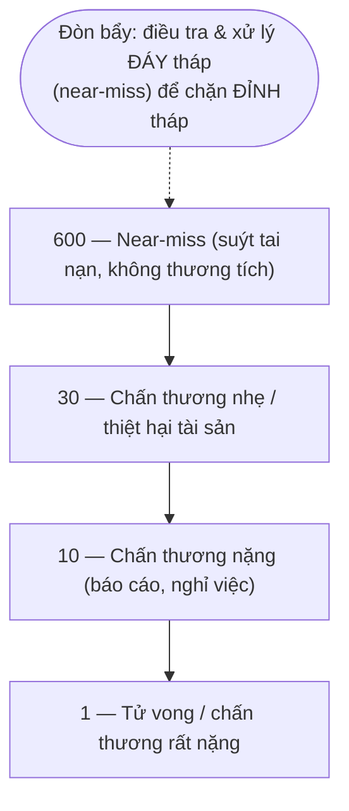
*Sơ đồ: kim tự tháp tai nạn (theo Bird & Germain, dẫn Richards ch.15). Đáy tháp đông đảo và "rẻ" để can thiệp; chính vì thế near-miss phải được ghi nhận–điều tra–hành động, không bỏ qua. Nguồn: tổng hợp theo Richards ch.15, Fig 15.2.*

Hệ quả vận hành (Richards ch.15): *"mỗi near-miss cần được ghi nhận, điều tra, xử lý, đào tạo lại nhân viên và rà soát định kỳ"*. Một văn hoá an toàn trưởng thành đặc trưng bởi **tỷ lệ báo cáo near-miss CAO** (nghịch lý: nhiều báo cáo near-miss là dấu hiệu *tốt*, vì nó nghĩa là tổ chức đang nhìn thấy rủi ro *trước* khi nó thành chấn thương).

##### b.3 — Phê phán kim tự tháp: tỷ lệ cố định là một ngộ nhận

Trình bày tam giác như chân lý phổ quát là sai, và một thạc sĩ an toàn phải biết nó gãy ở đâu. Fred **Manuele** (2011, *Reviewing Heinrich*) và nhiều học giả chỉ ra:
- **Tỷ lệ không phải hằng số nhân quả.** 1:29:300 là trung bình thống kê của một bộ dữ liệu cũ; áp nó cho một kho cụ thể như một "định luật" là sai. Quan trọng hơn, *near-miss và tử vong không nhất thiết cùng cơ chế gốc*: nhiều vụ trượt ngã nhẹ không hề "tiền thân" của một vụ sập racking chết người. Giảm số vụ đứt tay không tự động giảm xác suất một thảm hoạ năng lượng cao.
- **"88% do hành vi không an toàn" đổ lỗi cho công nhân.** Con số trứ danh của Heinrich định hình cả thế kỷ *behaviour-based safety* (BBS) — sửa hành vi người lao động. Phê phán hệ thống: hành vi "không an toàn" thường là *triệu chứng* của thiết kế tồi (lối đi quá hẹp buộc đi tắt, định mức tốc độ ép bỏ bước kiểm tra — chính Goodhart ở [§6.3.1](#631-quản-trị-lao-động--năng-suất-kho)). Đổ lỗi cá nhân che giấu **lỗi tiềm ẩn của tổ chức**.

Căng thẳng cốt lõi để đối chiếu: **trường phái hành vi** (sửa người, đáy tháp đông nên dễ đo) ↔ **trường phái hệ thống** (sửa thiết kế và tổ chức, vì người sẽ luôn mắc lỗi). Khoa học an toàn hiện đại nghiêng hẳn về phía sau — dẫn tới Reason.

##### b.4 — Reason (1990/1997): mô hình "miếng phô mai Thuỵ Sĩ"

James **Reason** đảo trục phân tích: tai nạn lớn hiếm khi do một lỗi đơn lẻ mà do **sự xếp thẳng hàng của nhiều lỗ hổng trong nhiều lớp phòng vệ**. Mỗi lớp bảo vệ (đào tạo, SOP, rào chắn vật lý, kiểm định, giám sát) như một lát phô mai Thuỵ Sĩ có lỗ; bình thường lỗ ở các lát lệch nhau nên năng lượng nguy hiểm bị chặn; tai nạn xảy ra khi *các lỗ tình cờ thẳng hàng* tạo một "quỹ đạo cơ hội".

Reason phân đôi nguyên nhân:
- **Lỗi chủ động (active failures):** sai sót của người ở tuyến đầu (lái xe nâng ẩu) — hậu quả tức thì, dễ thấy, dễ đổ lỗi.
- **Điều kiện tiềm ẩn (latent conditions):** "mầm bệnh thường trú" gieo từ quyết định quản lý/thiết kế (cắt ngân sách bảo trì, lối đi thiết kế tồi, ca kíp gây mệt mỏi) — nằm im hàng tháng/năm rồi kết hợp với lỗi chủ động để bục phòng vệ.

> [!IMPORTANT] 💡 INSIGHT — Vì sao "sửa người" thua "sửa hệ thống" trong dài hạn
> Hai mô hình dẫn tới hai chiến lược đầu tư đối nghịch:
> - *Heinrich/BBS:* huấn luyện hành vi, áp poster "hãy cẩn thận", kỷ luật người vi phạm. Rẻ, nhanh, nhưng **chạm trần** — vì con người có giới hạn sinh học về sai sót, và áp lực năng suất luôn kéo hành vi lệch chuẩn (Rasmussen §b.6).
> - *Reason/hệ thống:* thiết kế để *lỗi của người không thành tai nạn* — rào chắn vật lý người–xe (poka-yoke), khoá liên động cửa bến (drive-away interlock), bản thân thiết kế lối đi một chiều. Đắt hơn ban đầu, nhưng **không phụ thuộc việc con người luôn hoàn hảo**.
>
> Nối thẳng với phân cấp kiểm soát (§c): *thứ tự ưu tiên Loại bỏ → Thay thế → Kỹ thuật → Hành chính → PPE chính là mô hình Reason được mã hoá thành quy trình* — càng lên đầu danh sách càng "sửa hệ thống", càng xuống cuối càng "dựa vào hành vi con người". Đây là điểm hợp nhất lý thuyết hàn lâm với SOP thực thi.

##### b.5 — Perrow vs HRO: tai nạn có "bình thường" không?

Bậc sâu nhất của phả hệ là một tranh luận chưa ngã ngũ, đáng để một thạc sĩ nắm vì nó định hình *kỳ vọng* của ta về an toàn.
- **Charles Perrow (1984), *Normal Accidents*:** trong các hệ thống vừa **ghép chặt (tight coupling)** vừa **tương tác phức tạp phi tuyến (interactive complexity)**, tai nạn thảm hoạ là *không thể tránh khỏi về mặt thống kê* — chúng là "bình thường" (normal), nội tại của cấu trúc, không phải do ai bất cẩn. Hàm ý bi quan: có những hệ thống nên *thu nhỏ độ ghép chặt* thay vì hy vọng vận hành hoàn hảo.
- **Trường phái HRO (High Reliability Organizations — La Porte, Weick & Sutcliffe):** phản biện lạc quan: một số tổ chức (hàng không mẫu hạm, kiểm soát không lưu) *đạt* độ tin cậy cực cao nhờ văn hoá đặc thù — *bận tâm với thất bại* (preoccupation with failure), *miễn cưỡng đơn giản hoá*, *nhạy với vận hành tuyến đầu*, *tôn trọng chuyên môn hơn cấp bậc*.

Áp vào kho: một DC tự động hoá cao (AS/RS, đội robot, băng tải liên hoàn — [§6.3.2](#632-wms--kiến-trúc-công-nghệ-kho)) đang dịch về phía "ghép chặt + phức tạp" của Perrow — một lỗi nhỏ lan nhanh thành dừng toàn hệ, và giao diện người–robot tạo lớp nguy hiểm mới. Bài học kép: **vừa giảm ghép chặt** (vùng đệm, phân vùng, khả năng cô lập sự cố — đúng tinh thần resilience [M1](01-chien-luoc-rui-ro.md)) **vừa xây văn hoá HRO** (xem §h). Đây là ranh giới hiệu lực của mọi SOP: SOP tốt cho hệ tuyến tính, ghép lỏng; hệ ghép chặt cần *cả* thiết kế lại cấu trúc.

##### b.6 — Rasmussen: trôi dạt tới ranh giới

Jens **Rasmussen (1997)** thêm một cơ chế động: trong một hệ chịu áp lực kinh tế (giảm chi phí) và áp lực khối lượng việc, hành vi vận hành *trôi dạt (drift)* dần về phía ranh giới an toàn — mỗi lần "đi tắt" thành công lại củng cố việc đi tắt, cho tới khi vượt ranh giới. Điều này lý giải vì sao **tai nạn thường xảy ra ở những nơi "vẫn ổn" suốt nhiều năm**: sự im lặng của rủi ro không phải bằng chứng của an toàn mà có thể là dấu hiệu của trôi dạt chưa bị trừng phạt. Hệ quả thực hành: phải có *chỉ báo trôi dạt* (tỷ lệ tuân thủ SOP, tỷ lệ near-miss, mức tồn đọng bảo trì) chứ không chờ chấn thương. Đây cũng là cầu nối sang **Safety-II** (Hollnagel 2014): an toàn không chỉ là "vắng mặt sự cố" (Safety-I) mà là *năng lực luôn thành công trong điều kiện biến động* — đo cái đang-diễn-ra-đúng, không chỉ đếm cái đã-sai.

> [!WARNING] 🪤 Bẫy tư duy về lý thuyết tai nạn
> - **Tụng một mô hình.** Dùng độc tam giác Heinrich → trượt vào đổ lỗi công nhân và bỏ qua lỗi tiềm ẩn tổ chức. Mỗi mô hình có phạm vi: Heinrich cho near-miss lặp lại tần suất cao; Reason/Perrow cho thảm hoạ năng lượng cao hiếm gặp.
> - **"Nhiều năm không tai nạn = an toàn".** Có thể là may mắn thống kê (Lab B) hoặc trôi dạt chưa bục (Rasmussen). Đo *leading indicators*, đừng tin *lagging indicators* số nhỏ.
> - **Coi tỷ lệ kim tự tháp là định luật.** Giảm vết đứt tay không bảo chứng giảm xác suất sập racking — khác cơ chế gốc (Manuele).

#### c. Khung phòng ngừa thực thi: phân cấp kiểm soát + đánh giá rủi ro

Lý thuyết hệ thống (§b) được mã hoá thành hai công cụ thực thi phổ quát.

**(1) Phân cấp kiểm soát (Hierarchy of Controls).** Khi đã nhận diện một mối nguy, các biện pháp không ngang giá nhau — phải áp theo **thứ tự ưu tiên giảm dần về độ tin cậy** (Richards ch.15 nêu đúng trật tự này; chuẩn hoá quốc tế qua NIOSH):

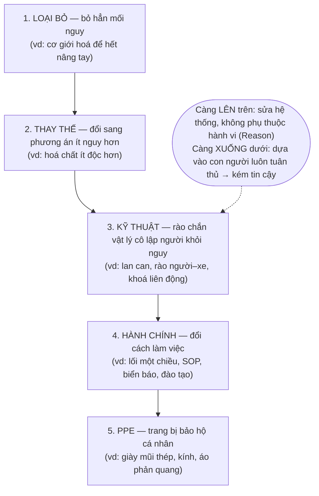
*Sơ đồ: phân cấp kiểm soát rủi ro. PPE là lớp phòng vệ CUỐI cùng, không phải đầu tiên — sai lầm phổ biến là phát kính bảo hộ rồi coi như xong, trong khi lẽ ra phải hỏi "loại bỏ/cô lập được mối nguy không?". Nguồn: tổng hợp theo Richards ch.15 (trật tự kiểm soát) & NIOSH Hierarchy of Controls.*

Vì sao thứ tự này quan trọng đến mức là *nguyên lý*, không phải sở thích: ba bậc trên (loại bỏ, thay thế, kỹ thuật) *thay đổi bản thân hệ thống* nên hiệu lực không phụ thuộc việc con người có nhớ–có muốn tuân thủ hay không; hai bậc dưới (hành chính, PPE) *dựa vào hành vi con người mỗi lần*, mà hành vi thì trôi dạt (§b.6). Một chương trình an toàn chất lượng cao luôn cố leo lên đầu danh sách.

**(2) Đánh giá rủi ro 5 bước (Risk Assessment).** Richards (ch.15) trình bày quy trình pháp lý–thực hành chuẩn:

> [!TIP] 🛠️ Quy trình đánh giá rủi ro 5 bước (Richards ch.15)
> 1. **Nhận diện mối nguy** — đi khảo sát trong và ngoài kho, hỏi nhân viên, đọc data sheet hoá chất/thiết bị, soi lại nhật ký tai nạn *và near-miss*.
> 2. **Xác định ai có thể bị hại và bị hại thế nào** — theo *nhóm* (đội nhận hàng, khách thăm, thầu phụ bảo trì), lưu ý nhóm dễ tổn thương (nhân viên mới, người khuyết tật).
> 3. **Đánh giá rủi ro & quyết định biện pháp** — áp phân cấp kiểm soát ở trên; so với *good practice*.
> 4. **Ghi nhận, truyền đạt & thực thi** — viết đơn giản, chia sẻ với nhân viên, có kế hoạch hành động (việc rẻ–nhanh trước; rủi ro hậu quả nặng nhất ưu tiên).
> 5. **Rà soát định kỳ & cập nhật** — mỗi 3 tháng hoặc sau mỗi sự cố lớn, hoặc khi đưa thiết bị/quy trình mới vào.
>
> *Bản chất:* đây là một vòng PDCA an toàn. Bước 3 thường được hỗ trợ bằng **ma trận rủi ro** (Khả năng × Mức nghiêm trọng) để xếp ưu tiên — bán định lượng, sẽ được làm chặt bằng xác suất ở §g.

#### d. Hiểm họa kho trọng yếu và kiểm soát chuyên đề

Bốn cụm hiểm họa dưới đây chiếm ~95% chấn thương (bảng §a). Mỗi cụm có SOP riêng.

##### d.1 — Tính toàn vẹn của racking và kiểm định SEMA

Racking là *kết cấu lớn nhất nhưng bị bỏ quên nhất* trong kho (Richards ch.15). Một vụ **sập racking lan truyền (progressive collapse)** là tai nạn thảm hoạ điển hình theo nghĩa Reason: một dầm va chạm bị móp (lỗi chủ động của lái xe nâng) + thiếu *beam connector lock* (điều kiện tiềm ẩn do lắp/bảo trì) → một khoang sụp kéo theo cả dãy như domino.


*Hình 6.3.3 — Sập racking một phần: thiệt hại được giới hạn nhờ beam connector lock lắp đúng cho từng dầm; thiếu chốt này, hư hỏng có thể lan thành sập toàn dãy. Nguồn: Richards, Warehouse Management, ch.15, Fig 15.3 (courtesy of Nene).*

Khung kiểm định chuẩn (Richards ch.15; chuẩn ngành **SEMA** — Storage Equipment Manufacturers' Association, và **PUWER 1998**):
- **Ba tầng kiểm tra theo tần suất:** (i) *kiểm tra trực quan hàng ngày/tuần* do nhân viên kho (PRRS — Person Responsible for Racking Safety); (ii) *kiểm tra của "người có năng lực" (competent person)* nội bộ theo chu kỳ tháng; (iii) *kiểm định chuyên gia độc lập (SEMA-approved)* tối thiểu **12 tháng/lần**.
- **Hệ "đèn giao thông" SEMA phân loại hư hỏng:** **Xanh** (an toàn, theo dõi) → **Vàng** (hư hỏng cần khắc phục trong 4 tuần, hạ tải nếu cần) → **Đỏ** (nguy hiểm tức thì: dỡ tải và cô lập ngay). Logic của hệ là *biến phán đoán chủ quan thành ngưỡng hành động khách quan* — đúng tinh thần biến rủi ro liên tục thành quyết định rời rạc.
- **Checklist racking** (Richards ch.15): sàn phẳng–chắc; dầm lắp đúng và *beam connector lock* chốt chặt từng dầm; biển tải trọng (SWL) ở đầu dãy; pallet đúng loại và còn tốt; lối đi đủ rộng; không có hư hỏng nhìn thấy.
- **Quy tắc block stacking** (Rushton ch.35): chiều cao xếp chồng giới hạn bởi *độ bền pallet đáy*; rule-of-thumb **4 tầng** thường an toàn nếu pallet đáy đủ khoẻ.

> [!CAUTION] 📦 CASE STUDY — Beam connector lock và sự khác biệt giữa "móp" và "thảm hoạ"
> Richards (ch.15, Fig 15.3) đưa ảnh một vụ sập một phần: nhờ *beam connector lock* được lắp cho từng dầm, hư hỏng bị **khoanh vùng** ở một khoang thay vì lan ra cả dãy. Bài học hệ thống: chi tiết 1 đô-la (chốt khoá) là một *rào chắn Reason* chặn "quỹ đạo cơ hội" của domino racking. Đây là ví dụ kinh điển vì sao kiểm soát kỹ thuật (§c, bậc 3) đánh bại kiểm soát hành chính ("nhắc lái xe cẩn thận hơn"): chốt khoá hoạt động *kể cả khi* lái xe đã đâm vào dầm.

##### d.2 — An toàn xe nâng và giao thông trong kho

Xe nâng là nguồn năng lượng di động nguy hiểm nhất. HSE (dẫn Richards ch.15): ~**2.000 vụ tai nạn xe nâng/năm** ở Anh; **87%** liên quan xe đối trọng (counterbalance); **48%** xảy ra khi *xếp/lấy hàng*; nguyên nhân hàng đầu là *bị xe đang chạy đâm*. Bộ kiểm soát (NIOSH, dẫn Richards ch.15) áp đúng phân cấp §c:
- **Kỹ thuật (cô lập):** phân tách vật lý người–xe (rào, vạch lối đi bộ); gương cầu ở góc khuất; barrier ở trạm làm việc; *giới hạn lối đi chỉ cho người* hoặc *chỉ cho xe*.
- **Hành chính:** chỉ người *có chứng chỉ* mới lái; chương trình an toàn bằng văn bản; giới hạn tốc độ, dừng ở biển STOP, bấm còi ở giao lộ; hạn chế xe gần khu nghỉ/đồng hồ chấm công vào giờ cao điểm dòng người (cuối ca).
- **Bến tải — chống "drive-away/vehicle creep":** xe rời bến khi chưa xong xếp dỡ là *drive-away* — hậu quả có thể tử vong (xe nâng lật 90° nếu càng đang trong pallet). Kiểm soát kết hợp (Richards ch.15): giữ chìa khoá tài xế trên bến; *wheel chock/clamp/trailer interlock* khoá với cửa bến; hệ đèn xanh–đỏ báo an toàn rời bến; biển STOP cao trước cabin. (Mở rộng điều phối bến ở [§6.1.1](#611-động-lực-học-dòng-chảy-kho-receiving--put-away--storage--picking--despatch).)

##### d.3 — Nâng hàng thủ công (manual handling)

Gắng sức quá mức là nguyên nhân chấn thương số 1 (**45%**, §a) — chủ yếu đau lưng/cổ do nâng sai. Khung đánh giá **TILE** (Richards ch.15 nêu 4 yếu tố): **T**ask (động tác xoay/với/cúi), **I**ndividual (thể trạng), **L**oad (khối lượng/kích thước/độ vững), **E**nvironment (sàn, không gian, nhiệt độ, ánh sáng). Áp phân cấp: ưu tiên *loại bỏ* nâng tay bằng cơ giới (pallet truck, scissor lift, bàn nâng); nếu không, giảm rủi ro — đặt hàng nhanh ở *kệ giữa* (tránh cúi/với quá đầu), hai người khiêng vật nặng, đào tạo kỹ thuật nâng có ghi nhận.

##### d.4 — Trượt, vấp, ngã và làm việc trên cao

Trượt–vấp–ngã chiếm **1/3 chấn thương nặng** ở Anh và phần lớn tai nạn công nghiệp chung ở Mỹ (Richards ch.15). Kiểm soát gần như *trùng khít với housekeeping/5S* (§f.4): lau dọn tràn đổ ngay, lối đi không bừa bộn, thảm chống trượt, giày phù hợp, đủ sáng, lan can, kiểm soát điện thoại khi đi lại. **Làm việc trên cao**: nguyên tắc *tránh nếu có thể*; nếu buộc phải, dùng thiết bị (lồng nâng người gắn xe nâng đúng chuẩn — không di chuyển xe khi lồng đang nâng) và kiểm định định kỳ.

#### e. PCCC — Phòng cháy chữa cháy: từ vật lý đám cháy tới thiết kế chữa cháy

PCCC là hiểm họa *hậu quả thảm hoạ, xác suất thấp* — đúng vùng Perrow/Reason, nơi SOP hành chính không đủ và phải dựa vào thiết kế kỹ thuật. Phải bắt đầu từ **vật lý của đám cháy kho**.

**Vì sao kho cháy đặc biệt nguy hiểm (first-principles):**
- **Tải nhiệt cao và tập trung:** kho hiện đại chất đầy nhựa, bao bì, film co — nhiệt trị cao gấp nhiều lần giấy/gỗ. Một kho là một "kho nhiên liệu" cô đặc.
- **Hình học khuếch đại lửa:** racking cao tạo các *khe đứng (flue space)* giữa pallet — hoạt động như *ống khói*, hút khí và đẩy lửa lan lên trên cực nhanh theo chiều cao. Đây là lý do cháy kho lan *theo phương đứng* nhanh hơn nhiều so với cháy nhà thường.
- **Động học tăng tốc:** công suất toả nhiệt của đám cháy tăng xấp xỉ theo **mô hình bình phương thời gian** $\dot{Q} \approx \alpha t^2$ (NFPA) — nghĩa là cháy "ultra-fast" (nhựa) đạt ngưỡng nguy hiểm trong *vài chục giây tới vài phút*. Cửa sổ dập lửa rất hẹp.

**Phân loại hàng hoá (commodity classification)** quyết định toàn bộ thiết kế chữa cháy: tiêu chuẩn (NFPA 13, FM Global) phân Class I–IV theo độ cháy, và *nhóm nhựa* (cartoned/exposed, expanded/unexpanded) là khắc nghiệt nhất — đòi mật độ nước và cấu hình sprinkler cao hơn hẳn.

**Hệ chữa cháy bằng nước** theo độ phức tạp tăng dần:
- **Sprinkler trần thường (CMSA/CMDA):** *kiểm soát (control)* đám cháy, chờ đội cứu hoả — giới hạn ở kho thấp/tải nhẹ.
- **In-rack sprinkler:** vòi đặt *trong* racking, đánh chặn lửa ngay trong khe đứng — cần cho kho cao/tải nặng nhưng đắt và vướng vận hành.
- **ESFR (Early Suppression, Fast Response):** triết lý *dập tắt (suppress)* chứ không chỉ kiểm soát: đầu phun K lớn (K25.2/K22.4), *phản ứng nhanh (RTI thấp)*, dội lượng nước lớn xuống *gốc lửa* trước khi nó vượt tầm kiểm soát — cho phép bỏ in-rack trong nhiều cấu hình, đơn giản hoá vận hành.

> [!IMPORTANT] 📐 Mô hình tăng trưởng đám cháy (t-squared) — vì sao "phản ứng nhanh" là tham số sống còn
> $$\dot{Q}(t) = \alpha\, t^2$$
> - $\dot{Q}(t)$: công suất toả nhiệt (kW) tại thời điểm $t$ (giây) kể từ lúc bắt lửa.
> - $\alpha$: hệ số tăng trưởng (kW/s²) — phân nhóm chuẩn: *slow* 0,0029 · *medium* 0,012 · *fast* 0,047 · *ultra-fast* 0,19 (nhựa, film). 
> - **Hệ quả thiết kế:** thời gian để đạt một ngưỡng $\dot{Q}^\*$ tỉ lệ $\sqrt{\dot{Q}^\*/\alpha}$ — với hàng nhựa (ultra-fast) ngưỡng nguy hiểm đến *nhanh gấp ~8 lần* so với hàng "slow" ($\sqrt{0,19/0,0029}\approx 8,1$). Đây chính là *vì sao* ESFR nhấn mạnh **Fast Response (RTI thấp)**: đầu phun phải kích hoạt trong cửa sổ vài chục giây đầu, khi $\dot{Q}$ còn nhỏ.

> [!TIP] 🛠️ Đánh giá rủi ro cháy 5 bước + SOP khẩn cấp (Richards ch.15)
> 1. Nhận diện *nguồn cháy* (sạc pin, điện, hút thuốc, ma sát thiết bị).
> 2. Xác định *người có nguy cơ*.
> 3. Đánh giá → *loại bỏ/giảm/bảo vệ* (cách ly nguồn, vật liệu chậm cháy, sprinkler).
> 4. *Ghi nhận, lập kế hoạch, thông báo, đào tạo* — sơ đồ thoát hiểm (kể cả **lối thoát phía sau racking** — chỗ hay bị bỏ quên), vị trí bình chữa cháy, quy trình điểm danh.
> 5. *Rà soát & cập nhật.*
>
> Thiết bị an toàn cháy (Rushton ch.35) — bình chữa cháy, sprinkler, báo cháy, đèn khẩn cấp, lối thoát thông thoáng — phải được *bảo trì định kỳ* (nối §f).

> [!NOTE] 🌐 Rủi ro cháy pin Lithium-ion trong kho — điểm nóng PCCC hiện tại (deep research)
> Một lớp rủi ro PCCC mới nổi mà sách giáo trình cũ chưa phủ: **pin lithium-ion** (xe nâng điện, AGV/robot, e-bike, hàng lưu kho) có thể *thermal runaway* — phản ứng nhiệt tự tăng tốc do lỗi nội tại, va đập, sạc quá/sai, hoặc nhiệt độ bất thường; một cell hỏng kích cháy cell lân cận, sinh nhiệt dữ dội, lửa và khí độc (gồm HF) (Nguồn: Risk Logic — FM Data Sheet 7-112, 2024; NFSA Li-ion Task Group, 2024).
> - **Khu vực sạc** (xe nâng, thiết bị) cạnh hàng lưu kho là điểm nguy hiểm đặc thù — cần thông gió, phát hiện khí, và thiết kế sprinkler riêng cho mối nguy pin (Nguồn: HCT World, 2024).
> - **Giới hạn của ESFR với pin Li-ion:** sprinkler trần đặt cao 9–12 m có thể kích hoạt *sau khi* giai đoạn nguy hiểm nhất của cháy pin đã bắt đầu — độ trễ này là một tác nhân khiến cháy kho leo thang nhanh; FM Global (DS 7-112) và OSHA (fact sheet 2025) khuyến nghị kiểm soát bổ sung: giới hạn số lượng, làm mát, giám sát khí, tách khu (Nguồn: Risk Logic, 2024; OSHA, 2025).

#### f. Bảo trì MHE — từ phản ứng tới RCM/TPM

Bảo trì là mặt còn lại của cùng đồng tiền an toàn (§a): thiết bị suy thoái vừa làm gãy năng suất vừa biến thành nguồn nguy hiểm. Câu hỏi định lượng trung tâm: *bảo trì khi nào và theo chiến lược nào?*

##### f.1 — Thang chiến lược bảo trì

| Chiến lược | Cơ chế | Khi nào hợp lý | Hạn chế |
|---|---|---|---|
| **Phản ứng (Run-to-Failure)** | Sửa khi hỏng | Bộ phận rẻ, hỏng không nguy hiểm, không có mẫu hao mòn | Dừng máy bất ngờ, hỏng dây chuyền, hậu quả an toàn |
| **Phòng ngừa theo lịch (Preventive, TBM)** | Thay/đại tu theo *tuổi/giờ chạy* cố định | Bộ phận có **hao mòn theo tuổi** (β>1) | Lãng phí tuổi thọ nếu thay quá sớm; vô dụng nếu hỏng ngẫu nhiên |
| **Theo tình trạng (Predictive, CBM)** | Giám sát chỉ số (rung, nhiệt, dầu) → can thiệp khi có dấu hiệu | Hỏng có *tiền triệu chứng* đo được | Cần cảm biến & phân tích; chi phí ban đầu |
| **RCM** | Chọn chiến lược *theo từng failure mode* dựa trên hậu quả & mẫu hỏng | Hệ phức tạp, hậu quả lệch nhau lớn | Cần phân tích FMEA kỹ |
| **TPM** | Vận hành viên tham gia bảo trì tự quản, hướng OEE | Văn hoá cải tiến liên tục | Cần thay đổi tổ chức |

##### f.2 — Vật lý của hỏng hóc: hàm nguy cơ và phân phối Weibull

Mọi quyết định bảo trì quy về một câu hỏi: *xác suất hỏng thay đổi thế nào theo tuổi thiết bị?* Đại lượng nắm bắt điều này là **hàm nguy cơ (hazard rate)** $h(t)$ — *tỷ lệ hỏng tức thời của một bộ phận đã sống tới tuổi $t$*. Hình dạng kinh điển là **đường cong bồn tắm (bathtub curve)**: giai đoạn *hỏng sớm* (infant mortality, $h$ giảm — lỗi lắp/sản xuất), giai đoạn *ngẫu nhiên* ($h$ phẳng), và giai đoạn *hao mòn* ($h$ tăng).

Công cụ mô hình hoá chuẩn là **phân phối Weibull** (Weibull 1951), gọn nhẹ mà uốn được cả ba giai đoạn nhờ **tham số hình dạng $\beta$**:

> [!IMPORTANT] 📐 Công thức — Weibull và hàm nguy cơ
> $$R(t)=e^{-(t/\eta)^\beta}, \qquad h(t)=\frac{\beta}{\eta}\left(\frac{t}{\eta}\right)^{\beta-1}$$
> - $R(t)$: độ tin cậy (xác suất sống quá tuổi $t$); $\eta$: tham số tỷ lệ (đặc trưng "tuổi thọ", giờ); $\beta$: hình dạng.
> - **$\beta<1$:** $h$ *giảm* → hỏng sớm (infant mortality). Bảo trì phòng ngừa *phản tác dụng* (thay đồ tốt bằng đồ mới dễ chết yểu).
> - **$\beta=1$:** $h$ *hằng* → hỏng *ngẫu nhiên*, không nhớ tuổi (phân phối mũ). Thay theo lịch **vô ích** — đồ mới cũng dễ hỏng như đồ cũ.
> - **$\beta>1$:** $h$ *tăng* → hao mòn theo tuổi. **Chỉ khi này** thay phòng ngừa theo tuổi mới có lý (Lab A dùng $\beta=2{,}5$).
> - Trung bình (MTTF) $=\eta\,\Gamma(1+1/\beta)$.

##### f.3 — Cuộc cách mạng RCM (Nowlan & Heap 1978): khi nào bảo trì phòng ngừa là sai

Đây là điều kiện biên quan trọng nhất của cả mục — và là một phát hiện phản trực giác xứng tầm thạc sĩ. Trước 1978, niềm tin phổ quát là *"mọi thứ đều hao mòn nên cứ đại tu định kỳ thì an toàn hơn"*. Nghiên cứu của **Stanley Nowlan & Howard Heap** (1978, báo cáo cho United Airlines/DoD — nền của *Reliability-Centered Maintenance*) lật đổ niềm tin đó bằng dữ liệu: chỉ khoảng **11%** số *failure mode* của máy bay thể hiện mẫu *hao mòn theo tuổi* (β>1); tới **~89%** hỏng theo mẫu *ngẫu nhiên hoặc hỏng sớm* (β≤1). Họ phân ra **6 mẫu hỏng (A–F)**, trong đó mẫu F (hỏng sớm rồi ngẫu nhiên) phổ biến nhất.

Hệ quả đảo lộn thực hành:
- **Đại tu định kỳ cho bộ phận hỏng ngẫu nhiên không những vô ích mà có hại** — mỗi lần can thiệp xâm lấn lại tái nạp "hỏng sớm" (infant mortality), *tăng* tỷ lệ hỏng. "Bảo trì nhiều hơn" ≠ "an toàn hơn".
- **Với 89% bộ phận, đòn bẩy không phải lịch thay mà là *giám sát tình trạng* (CBM)** và *thiết kế chịu lỗi* — phát hiện hỏng *đang đến* thay vì đoán theo tuổi.
- RCM do đó hỏi *từng failure mode*: hậu quả là gì (an toàn/vận hành/kinh tế)? mẫu hỏng nào? → chọn TBM / CBM / RTF / redesign cho phù hợp. Đây là tư duy Reason (§b.4) áp vào bảo trì: phân loại theo *hậu quả* và *cơ chế*, không một-cỡ-cho-tất-cả.

> [!IMPORTANT] 💡 INSIGHT — Mô hình Barlow–Hunter "đúng" nhưng hiếm khi *áp dụng được*: bài học về điều kiện hiệu lực
> Lab A (§g.1) sẽ giải tối ưu chu kỳ thay phòng ngừa và cho ra $T^\*$ đẹp. Nhưng Nowlan–Heap cảnh báo: **mô hình đó chỉ có nghĩa khi β>1** (hao mòn). Với 89% bộ phận thực tế (β≤1), tối ưu hoá $T^\*$ là *tối ưu một việc không nên làm* — câu trả lời đúng là CBM hoặc RTF, không phải "thay sớm hơn". Đây là minh hoạ sắc nét cho Thang độ sâu định lượng: **một mô hình không kèm điều kiện hiệu lực là một cái bẫy**, không phải một lời giải. Người phân tích bậc thạc sĩ trước hết *ước lượng β từ dữ liệu hỏng* (Weibull fit), rồi mới quyết định có dùng Barlow–Hunter hay không — chứ không mặc định mọi thứ đều hao mòn.

##### f.4 — TPM, OEE và mối nối với 5S

**TPM (Total Productive Maintenance — Nakajima 1988)** mở rộng bảo trì thành trách nhiệm của *cả vận hành viên*, không chỉ thợ bảo trì — *autonomous maintenance*: người dùng MHE làm vệ sinh–kiểm tra–bôi trơn–phát hiện bất thường hàng ngày (đúng tinh thần Gemba). Thước đo trung tâm là **OEE (Overall Equipment Effectiveness)**:

> [!IMPORTANT] 📐 Công thức — OEE (nhân ba thành phần, không cộng)
> $$\text{OEE} = \text{Availability} \times \text{Performance} \times \text{Quality}$$
> Cùng logic "nhân chứ không trung bình" như *perfect order* ([§6.3.1](#631-quản-trị-lao-động--năng-suất-kho)): ba yếu tố ≈90% cho OEE chỉ ~73% — tổn thất *nhân lên*. Trong đó **Availability** $=\text{MTBF}/(\text{MTBF}+\text{MTTR})$ là cầu trực tiếp từ độ tin cậy (§f.2) sang công suất — một MHE hay hỏng ăn mòn cả ba yếu tố cùng lúc.

**Mối nối 5S ↔ an toàn ↔ bảo trì.** Công cụ tổ chức nơi làm việc **5S/6S** (Toolkit tool 1.2; gốc Nhật Bản, Hirano 1995) không phải "dọn dẹp" mà là *nền của cả an toàn lẫn bảo trì tự quản*:
- **Seiri (Sàng lọc):** bỏ thiết bị hỏng, pallet gãy, tồn lỗi thời — *trực tiếp xoá mối nguy trượt–vấp và đổ vỡ*.
- **Seiton (Sắp xếp):** *shadow board* cho dụng cụ, vạch lối đi, khu sạc MHE có nhắc cắm sạc — *cô lập người–vật và lộ ngay cái thiếu*.
- **Seiso (Sạch sẽ):** lau dọn theo lịch, *báo lỗi thiết bị ngay khi thấy* — đây chính là *autonomous maintenance* của TPM nhúng trong housekeeping.
- **Seiketsu (Săn sóc/Chuẩn hoá):** SOP trực quan (ảnh + ít chữ), KPI và *hồ sơ bảo trì MHE* dễ truy cập.
- **Shitsuke (Sẵn sàng/Duy trì):** audit định kỳ, công nhận đội làm tốt — chống *trôi dạt* (Rasmussen).
- **S thứ 6 — Safety:** nhiều DN thêm để nhấn an toàn là *trung tâm*; checklist 6S của Toolkit gồm PPE đúng, lối thoát/thiết bị cứu hoả thông thoáng, môi trường phù hợp.

> [!CAUTION] 📦 CASE STUDY — 5S như "rạp hát dọn dẹp" hay đòn bẩy thật?
> Toolkit (tool 1.2) ghi nhận các DN triển khai 5S "đã cải thiện chất lượng, tăng hiệu quả, cải thiện an toàn, giảm lãng phí và trao quyền sở hữu cho nhân viên". Nhưng ranh giới hiệu lực nằm ở **S thứ 5 (Duy trì)** — nơi đa số chương trình 5S *chết*. Một kho sơn vạch đẹp, treo shadow board rồi 6 tháng sau đâu lại vào đó là **5S hình thức (housekeeping theatre)**: làm một lần như chiến dịch, không nhúng vào nhịp vận hành hàng ngày. Bài học (nối Rasmussen §b.6): 5S thật là một *cơ chế chống trôi dạt liên tục* (audit + công nhận + Gemba walk), không phải một sự kiện tổng vệ sinh. "Viết SOP đẹp" không thay được "kỷ luật duy trì".

#### g. Lab định lượng — hai mô hình được GIẢI trên dữ liệu tĩnh

Bản đồ bài toán ẩn dưới ngôn ngữ "an toàn–bảo trì":

| Vấn đề vận hành | Bài toán toán học | Lớp toán / phương pháp | Neo học thuật | Nơi giải |
|---|---|---|---|---|
| Thay phòng ngừa MHE khi nào để rẻ nhất | Tối ưu chu kỳ thay (age-replacement) | Lý thuyết đổi mới (renewal-reward), tối ưu 1 biến | Barlow–Hunter 1960; Weibull 1951 | **Lab A (§g.1)** |
| Có nên bảo trì phòng ngừa không | Ước lượng tham số hình dạng β | Khớp Weibull (MLE/regression) | Nowlan–Heap 1978 | §f.3, Lab A (sensitivity) |
| TRIR năm nay có thật sự "an toàn hơn"? | Suy luận về tỷ lệ hiếm | Thống kê Poisson + khoảng tin cậy | Heinrich/Bird (pyramid) | **Lab B (§g.2)** |
| Chu kỳ kiểm định racking tối ưu | Mô hình thời gian trễ (delay-time) | Xác suất quá trình hỏng 2 giai đoạn | Christer 1973 | *(biên trên — không giải ở đây)* |
| Định cỡ đội bảo trì / phụ tùng | Hàng đợi & tồn kho phụ tùng | M/M/c; (s,Q) cho spares | Erlang 1917; → [M4](04-toi-uu-ton-kho.md) | liên kết |

> Cả hai lab dùng **dữ liệu cho sẵn (không random)**, có **tính tay** đối chiếu và **đã verify bằng máy** (script `assets/scripts/lab_m06_safety_maintenance.py`).

##### g.1 — Lab A: Tối ưu chu kỳ bảo trì phòng ngừa (Barlow–Hunter 1960)

**Vì sao (neo học thuật):** Barlow & Hunter (1960, *Optimum Preventive Maintenance Policies*, Operations Research) đặt bài toán *age-replacement*: thay bộ phận khi nó *đạt tuổi $T$* HOẶC *hỏng trước đó* — tuỳ cái nào đến trước. Thay phòng ngừa (đã lên kế hoạch) rẻ; thay do hỏng (khẩn cấp, kèm dừng máy) đắt. Có một $T$ tối ưu cân bằng hai chi phí. Đây là một *bài toán đổi mới (renewal process)* — không phải số học một bước.

> [!IMPORTANT] 📐 Công thức — Chi phí kỳ vọng dài hạn trên đơn vị thời gian
> Theo định lý renewal-reward, chi phí trung bình dài hạn mỗi giờ của chính sách age-replacement tuổi $T$ là:
> $$g(T)=\frac{\overbrace{c_p\,R(T)+c_f\,[1-R(T)]}^{\text{chi phí kỳ vọng mỗi chu kỳ}}}{\underbrace{\int_0^T R(t)\,dt}_{\text{độ dài kỳ vọng mỗi chu kỳ}}},\qquad R(t)=e^{-(t/\eta)^\beta}$$
> - $c_p$: chi phí thay *phòng ngừa* (theo kế hoạch); $c_f$: chi phí thay do *hỏng* (gồm dừng máy, tăng ca, thiệt hại kéo theo), $c_f>c_p$.
> - Tử số: với xác suất $R(T)$ bộ phận sống tới $T$ → trả $c_p$; với xác suất $1-R(T)$ nó hỏng trước → trả $c_f$.
> - Mẫu số: độ dài chu kỳ kỳ vọng $=\mathbb{E}[\min(X,T)]=\int_0^T R(t)\,dt$ (đồng nhất thức tuổi thọ kỳ vọng cụt).
> - **Điều kiện hiệu lực:** chỉ tồn tại $T^\*$ hữu hạn khi **$h(t)$ tăng (β>1)**. Nếu β=1, $g(T)$ đơn điệu → tối ưu là *không thay phòng ngừa* (RTF). (Đây là cầu sang Nowlan–Heap §f.3.)

> [!IMPORTANT] 📐 Đề bài (tĩnh) & Tính tay
> Mô-tơ kéo của một xe nâng có thời gian hỏng theo **Weibull β=2,5; η=4.000 giờ** (hao mòn). Chi phí thay phòng ngừa $c_p=£600$; thay do hỏng $c_f=£2.400$ (tỷ số $c_f/c_p=4$). Tìm tuổi thay tối ưu $T^\*$.
>
> Trước hết $R(t)=e^{-(t/4000)^{2,5}}$. Vài giá trị (dò tay được, vì $(t/4000)^{2,5}=(t/4000)^2\sqrt{t/4000}$):
>
> | $t$ (giờ) | 0 | 500 | 1000 | 1500 | 2000 | 2500 |
> |---|---|---|---|---|---|---|
> | $R(t)$ | 1,000 | 0,9945 | 0,9692 | 0,9175 | 0,8380 | 0,7343 |
>
> **Tính tay $g(2000)$** bằng tích phân hình thang (bước 500h):
> $$\int_0^{2000} R\,dt \approx 500\Big[\tfrac{1+0,8380}{2}+0,9945+0,9692+0,9175\Big]=500(3,8002)=1900,1$$
> $$g(2000)=\frac{600(0,8380)+2400(0,1620)}{1900,1}=\frac{502,8+388,9}{1900,1}=\mathbf{0,469\ £/giờ}$$
> Làm tương tự: $g(1500)\approx0,512$ và $g(2500)\approx0,470$. Vì $g(2000)<g(1500)$ và $g(2000)<g(2500)$, điểm tối ưu nằm trong khoảng (1500; 2500), gần 2000+ — khớp nghiệm tinh ở dưới.

```text
=== LAB A: Age-replacement PM (Weibull beta=2.5, eta=4000 h) ===
cost ratio cf/cp = 4.0
  HANDCHECK T=1500 : R=0.91749  F=0.08251  trapInt(h=500)=  1461.2  g~=0.5123 GBP/h
  HANDCHECK T=2000 : R=0.83797  F=0.16203  trapInt(h=500)=  1900.1  g~=0.4693 GBP/h
  HANDCHECK T=2500 : R=0.73432  F=0.26568  trapInt(h=500)=  2293.2  g~=0.4702 GBP/h
  OPTIMUM (fine integration): T* = 2219.8 h ,  g* = 0.4651 GBP/h
  MTTF = eta*Gamma(1+1/beta) = 3549.1 h
  Run-to-failure cost rate   = cf/MTTF = 0.6762 GBP/h
  Saving of PM vs RTF        = 31.2%
  [beta=1 random] best finite T pushes to bound -> g flattens to cf/eta = 0.6000 GBP/h
     => with constant hazard, age-based PM gives NO benefit (Nowlan-Heap 1978).
```

Đọc kết quả: tối ưu **$T^\*\approx2.220$ giờ** với chi phí **$g^\*\approx0,465$ £/giờ** — thay *trước* tuổi thọ trung bình (MTTF=3.549h) một quãng đáng kể, vì chi phí hỏng gấp 4 lần. So với *chạy tới hỏng* (RTF, 0,676 £/giờ), bảo trì phòng ngừa tối ưu **tiết kiệm ~31%**. Dòng cuối là *kiểm chứng điều kiện biên*: nếu đổi sang β=1 (hỏng ngẫu nhiên), đường $g(T)$ phẳng dần về $c_f/\eta$ — **không có $T^\*$ hữu hạn, thay phòng ngừa vô ích** (Nowlan–Heap).

> [!NOTE] 💻 Giả định & hạn chế (Lab A) — bắt buộc nêu để đạt bậc thạc sĩ
> - **As-good-as-new:** thay là phục hồi hoàn toàn (renewal). Thực tế đại tu một phần chỉ "trẻ hoá" → cần mô hình *imperfect maintenance* (Kijima).
> - **Thay tức thời, biết β, η, $c_p$, $c_f$:** thực tế phải *ước lượng β, η từ dữ liệu hỏng* (Weibull fit) — sai số tham số lan vào $T^\*$; ít dữ liệu đuôi (hiếm hỏng) làm β khó ước lượng. Đây là *identification problem* của bảo trì.
> - **Bỏ qua thời gian/chi phí dừng máy biến thiên** và phụ thuộc giữa các bộ phận (một hỏng kéo theo hỏng khác).
> - **Điều kiện sống còn: β>1.** Áp mô hình cho β≤1 là tối ưu một việc không nên làm (§f.3). Quy trình đúng: *fit Weibull → kiểm β → nếu β>1 mới chạy Lab A; nếu không, chuyển CBM/RTF*.

##### g.2 — Lab B: TRIR như một ước lượng Poisson — bẫy "số nhỏ"

**Vì sao (neo học thuật):** OSHA đo an toàn bằng **TRIR (Total Recordable Incidence Rate)** = số vụ ghi nhận chuẩn hoá về 100 lao động-năm. Nhưng tai nạn là *sự kiện hiếm, đếm được* → mô hình hoá tự nhiên bằng **phân phối Poisson**. Hệ quả thống kê (thường bị bỏ qua trong báo cáo HSE): với *số đếm nhỏ*, TRIR là một ước lượng **rất nhiễu** — và đây là nơi tư duy Heinrich/Bird (số nhỏ ở đỉnh tháp) gặp thống kê.

> [!IMPORTANT] 📐 Công thức — TRIR và khoảng tin cậy Poisson chính xác
> $$\text{TRIR}=\frac{k\times 200{.}000}{H}\quad(\text{200.000}=100\text{ LĐ}\times2000\text{ giờ/năm})$$
> Nếu số vụ $k\sim\text{Poisson}(\lambda)$, khoảng tin cậy 95% *chính xác* (Garwood, qua phân phối χ²):
> $$\lambda_{lo}=\tfrac12\chi^2_{0,025;\,2k},\qquad \lambda_{hi}=\tfrac12\chi^2_{0,975;\,2k+2}$$
> - $k$: số vụ ghi nhận trong kỳ; $H$: tổng giờ lao động.
> - Độ lệch chuẩn của số đếm Poisson $=\sqrt{\lambda}$ → *sai số tương đối* $1/\sqrt{\lambda}$ lớn khi $\lambda$ nhỏ.

> [!IMPORTANT] 📐 Đề bài (tĩnh) & Tính tay
> Một DC 120 lao động, $H=240.000$ giờ/năm, ghi nhận $k=6$ vụ. Khi đó:
> $$\text{TRIR}=\frac{6\times200000}{240000}=\mathbf{5,0}$$
> Tra χ²: $\chi^2_{0,025;\,12}=4,40$ và $\chi^2_{0,975;\,14}=26,12$ → $\lambda\in[2,20;\ 13,06]$. Quy về thang TRIR (×200000/240000): **CI 95% ≈ [1,83; 10,88]** — rộng gấp ~2 lần quanh điểm ước lượng 5,0.

```text
=== LAB B: TRIR (OSHA) as Poisson estimate, small-numbers trap ===
  hours worked = 240000 , recordable cases k = 6
  TRIR = k*200000/hours = 5.00
  exact 95% CI for true mean count : [2.20 , 13.06]
  -> 95% CI for 'true' TRIR        : [1.83 , 10.88]
  width of TRIR CI = 9.05 (huge relative to point est. 5.00)
  if true lambda stays 6: SD = sqrt(6) = 2.45 cases
  P(<=3 cases) = 0.151  -> ~1 year in 7 looks 'halved' by pure chance
  a swing 3 -> 9 (TRIR 2.5 -> 7.5) is within ~1.2 SD = NOISE, not a trend
```

Đọc kết quả — **bẫy số nhỏ và hồi quy về trung bình:** TRIR "thật" của site này nằm đâu đó trong [1,83; 10,88] — ta gần như *không phân biệt được* một site TRIR 2 với một site TRIR 10 chỉ từ một năm dữ liệu. Tệ hơn, nếu tỷ lệ thật *không đổi* (λ=6), độ lệch chuẩn √6≈2,45 nghĩa là một năm "đẹp" (≤3 vụ, TRIR tụt còn ~2,5) xảy ra ~1 lần trong 7 năm **thuần do may rủi**. Một quản lý thưởng/phạt theo dao động TRIR năm là đang *thưởng cho may mắn và phạt cho xui rủi* — và tạo động cơ **giấu báo cáo** (Goodhart, [§6.3.1](#631-quản-trị-lao-động--năng-suất-kho)): TRIR đẹp lên không phải vì an toàn hơn mà vì ít vụ được ghi.

> [!IMPORTANT] 💡 INSIGHT — Vì sao đo *leading indicator* thắng *lagging indicator* (hợp nhất ba mục)
> Lab B định lượng hoá đúng điều phả hệ lý thuyết (§b) đã cảnh báo định tính: **đỉnh kim tự tháp (tử vong, chấn thương nặng) là số quá nhỏ để làm thước đo điều khiển** — nó nhiễu, trễ, và bị Goodhart bóp méo. Đáy tháp (near-miss, tỷ lệ tuân thủ SOP, tồn đọng bảo trì, β của thiết bị) *đông, sớm, khó ngụy tạo theo hướng tốt* → là *leading indicator* đáng điều khiển. Đây là một nguyên lý xuyên suốt handbook:
> - *Perfect order* ([§6.3.1](#631-quản-trị-lao-động--năng-suất-kho)) nhân nhiều xác suất nhỏ → quản trị từng thành phần, không chờ đơn lỗi.
> - *OEE* (§f.4) phân rã dừng máy thành ba đòn bẩy *trước khi* công suất sụp.
> - *Near-miss/kim tự tháp* (§b.2) quản trị rủi ro *trước khi* thành tử vong.
> Cùng một quy luật: **với sự kiện hiếm hậu quả lớn, hãy điều khiển các tiền-thân đông đảo, đừng chờ và đếm thảm hoạ.**

#### h. Insight tổng hợp & Liên kết

> [!IMPORTANT] 💡 INSIGHT — Gắn bối cảnh thực chiến (FMCG/Mondelēz, vai trò quản trị vận hành)
> Trong một DC FMCG khối lượng lớn như bối cảnh của bạn, ba sợi chỉ của mục này hội tụ vào *một con số P&L*: **chi phí của một giờ dây chuyền/khu vực dừng**. Một xe nâng VNA hỏng giữa ca cao điểm vừa là (i) *mất công suất* (OEE Availability tụt — §f.4), vừa là (ii) *rủi ro an toàn* nếu vận hành cố "chữa cháy" với thiết bị lỗi (Rasmussen drift — §b.6), vừa là (iii) *chi phí khẩn cấp* gấp 4 lần (Lab A $c_f$). Ba lăng kính — Toán (tối ưu $T^\*$), Thực thi (TPM tự quản + 5S), Chiến lược (văn hoá HRO báo near-miss) — không phải ba dự án rời mà là ba mặt của *quản trị tính toàn vẹn vật lý của hệ vận hành*. Ba đòn bẩy quản lý cụ thể:
> - **Fit Weibull** cho 5–10 bộ phận MHE đắt nhất → quyết TBM/CBM theo β (đừng mặc định mọi thứ hao mòn).
> - **Dựng bảng *leading indicator*** (near-miss, % tuân thủ kiểm định SEMA, tồn đọng work-order bảo trì) thay vì chỉ treo bảng "X ngày không tai nạn".
> - **Nhúng kiểm tra MHE & ghi near-miss vào Gemba walk** hàng ngày, biến thành nhịp thường trực.

> [!NOTE] 🔗 Liên kết chéo
> - **Lao động & Goodhart, perfect order:** [§6.3.1](#631-quản-trị-lao-động--năng-suất-kho) — incentive tốc độ ép bỏ bước an toàn; cùng logic "nhân xác suất nhỏ".
> - **Tự động hoá & rủi ro robot–người (Perrow):** [§6.3.2](#632-wms--kiến-trúc-công-nghệ-kho) — DC tự động hoá dịch về "ghép chặt".
> - **Điều phối bến & drive-away:** [§6.1.1](#611-động-lực-học-dòng-chảy-kho-receiving--put-away--storage--picking--despatch).
> - **Hazmat & lưu trữ đặc thù:** [§6.4.2](#642-lưu-trữ--xử-lý-đặc-thù).
> - **Resilience & độ ghép chặt (HRO, redundancy):** [M1](01-chien-luoc-rui-ro.md).
> - **5S, TPM, DMAIC, 7 Muda:** [M9 — Lean Six Sigma](09-lean-six-sigma.md) (mục này là ứng dụng kho của khung Lean).
> - **Tồn kho phụ tùng (s,Q) & MTTR:** [M4](04-toi-uu-ton-kho.md).

##### 📚 Nguồn (mục 6.3.3)

**Sách (nền chính):**
- Richards, G. & Culpin, T., *Warehouse Management: A Complete Guide* — ch.15 *Health and safety* (thống kê tai nạn US/UK & nguyên nhân, OSHA TRIR, đánh giá rủi ro 5 bước, kim tự tháp Bird & Germain, phân cấp kiểm soát, kiểm định racking & beam lock, an toàn xe nâng NIOSH, drive-away, manual handling TILE, PCCC 5 bước, PUWER/LOLER, first aid 1/50); ch.10 *Storage and handling equipment* (cấu hình racking, block stacking, honeycombing).
- Rushton, A., Croucher, P. & Baker, P., *The Handbook of Logistics & Distribution Management* — ch.35 *Security and safety in distribution* (phân tách người–xe, block stacking 4 tầng, kiểm định racking competent person, lịch bảo trì thiết bị an toàn, sạc pin & thông gió).
- Richards, G. & Grinsted, S., *The Logistics and Supply Chain Toolkit* — tool 1.2 *5S/6S (Gemba Kanri)* (5 chữ S + Safety, shadow board, audit 6S, 7 Muda/TIMWOOD) & 1.2i *Gemba Walk*.

**Lớp học thuật toàn cầu (chuẩn sau-đại học):**
- Heinrich, H.W. (1931), *Industrial Accident Prevention* — thuyết domino, tam giác 1:29:300, "88% unsafe acts".
- Bird, F.E. & Germain, G.L. (1985), *Practical Loss Control Leadership* — kim tự tháp mở rộng (loss causation).
- Manuele, F.A. (2011), *Reviewing Heinrich* — phê phán tỷ lệ cố định & đổ lỗi hành vi.
- Reason, J. (1990), *Human Error*; (1997), *Managing the Risks of Organizational Accidents* — Swiss Cheese, lỗi tiềm ẩn vs chủ động.
- Perrow, C. (1984), *Normal Accidents* — tight coupling & interactive complexity; trường phái HRO (Weick & Sutcliffe, *Managing the Unexpected*).
- Rasmussen, J. (1997), *Risk management in a dynamic society* — trôi dạt tới ranh giới; Hollnagel, E. (2014), *Safety-I and Safety-II*.
- Haddon, W. (1970), *On the escape of tigers* — mô hình năng lượng–rào chắn.
- Weibull, W. (1951), *A Statistical Distribution Function of Wide Applicability* — phân phối Weibull, hàm nguy cơ.
- Barlow, R.E. & Hunter, L.C. (1960), *Optimum Preventive Maintenance Policies*, Operations Research — age-/block-replacement.
- Nowlan, F.S. & Heap, H.F. (1978), *Reliability-Centered Maintenance* — 6 mẫu hỏng, ~89% hỏng không theo tuổi.
- Nakajima, S. (1988), *Introduction to TPM*; Hirano, H. (1995), *5 Pillars of the Visual Workplace*; Ohno, T. — TPS.
- Christer, A.H. (1973) — mô hình delay-time cho kiểm định (biên trên).

**Deep research (web):** Risk Logic — *FM Global Data Sheet 7-112 & Li-ion fire safety* (2024); NFSA — *Li-ion Battery Task Group* (2024); HCT World — *Warehouse fire protection for battery-powered equipment* (2024); OSHA — *Li-ion battery fact sheet* (2025). Mọi số liệu web đặt trong khối 🌐 với trích dẫn nội tuyến.

---

## 6.4. Dòng hàng Đặc thù & Hậu cần ngược tại Kho

> [!NOTE] ✅ **Cụm hoàn thành** — 6.4.1 (Returns Processing) ✅ · 6.4.2 (Lưu trữ đặc thù) ✅ · 6.4.3 (Đóng gói cuối dòng & Yard) ✅. Nguồn: Richards ch.1/4/5/7, Rushton ch.8/15/19/35, Toolkit, Web; nối chiến lược reverse tại [M10](10-green-logistics.md).

### 6.4.1. Xử lý Hàng hoàn trong DC (Returns Processing) ✅

> **Nguyên tắc biên soạn & quy ước trình bày:**
> - **Nền chính = sách thực hành** (Richards, *Warehouse Management* ch.7 — *Returns processing / reverse logistics*; Rushton/Croucher/Baker, *Handbook* ch.32 — reverse logistics như một dịch vụ thuê ngoài, ch.36 — packaging waste). Đây là lớp "what/how": dòng quy trình, thiết kế khu, danh mục disposition, công thức biện minh chi phí.
> - **Lớp học thuật toàn cầu (tầng "vì sao" bậc sau-đại học):** thứ bậc phương án thu hồi (**Thierry, Salomon, Van Nunen & Van Wassenhove 1995**), gác cổng & phân loại returns (**Rogers & Tibben-Lembke 1999**), mô hình định lượng hậu cần ngược (**Fleischmann et al. 1997**), giá trị cận biên của thời gian (**Blackburn, Guide, Souza & Van Wassenhove 2004**), tiến hóa chuỗi cung ứng vòng kín (**Guide & Van Wassenhove 2009**), chính sách thải tối ưu khi có dòng trả (**Heyman 1977**; **Simpson 1978**). Tra `references/canon-map-scm.md` (hàng *Hậu cần ngược / Hàng hoàn / Closed-loop*).
> - **Lý thuyết viết dày, giọng giáo trình**; **deep research (web) chỉ BỔ SUNG** trong khối 🌐.

---

#### 📌 Bốn lăng kính trong mục 6.4.1

> Xử lý hàng hoàn là một mục **thiên Thực thi** — lõi là dòng quy trình và thiết kế khu vận hành. Nhưng để đạt độ sâu thạc sĩ, lăng kính **Toán & Data** phải gánh phần *vì sao* của mọi quyết định: chọn disposition nào, gác cổng có đáng không, xử lý nhanh tới mức nào. Chiến lược đặt câu hỏi returns đáng là *trung tâm lợi nhuận* hay *phiền toái cần dẹp*; Hoạch định lo công suất cao điểm và không gian.

| Lăng kính | Mức nhấn | Thể hiện ở đâu |
|---|---|---|
| 🛠️ **Thực thi** | ●●● Trọng tâm | §b (thứ bậc disposition), §c (gác cổng & thiết kế khu "kho-trong-kho"), §f (SOP returns + biện minh chi phí + thuê ngoài) |
| 📐💻 **Toán & Data** | ●●● Trọng tâm | §d (bản đồ bài toán), §e (Lab: EMV disposition + LP phân bổ dưới công suất + suy giảm giá trị theo thời gian) |
| 🎯 **Chiến lược** | ●● Bổ trợ | §a (returns = tài sản suy giảm, đòn bẩy dòng tiền), §c (gác cổng = đẩy quyết định lên thượng nguồn), §f (in-house vs 3PL), §h (chuỗi ngược *responsive* vs *efficient*) |
| 🧭 **Hoạch định** | ●● Bổ trợ | §f (định cỡ công suất & không gian cao điểm hậu lễ; sáu phép tính % trước khi lập trình hậu cần ngược) |

#### a. Bản chất: hàng hoàn là một dòng vào nghịch — bất định, dị thể, ít thông tin, suy giảm theo thời gian

Hầu hết mục trong chương này mô tả dòng hàng *xuôi*: hàng đi từ nhà cung cấp vào kho, qua lưu trữ–nhặt–đóng, rồi ra khách. Hàng hoàn đảo ngược chiều mũi tên đó — và chính sự đảo chiều tạo ra một *vật lý vận hành khác hẳn*. Richards (ch.7) định nghĩa gọn: *"Returns processing, hay reverse logistics như cách gọi đã phổ biến, là việc xử lý hàng trả, bao bì vận chuyển và hàng dư thừa; các quy trình kèm theo gồm sửa chữa, tái sử dụng, tân trang, tái chế và thải bỏ."* Định nghĩa này liệt kê *cái gì*, nhưng để vận hành đúng phải hiểu *vì sao nó khó* — và cái khó nằm ở bốn đặc tính bất biến phân biệt dòng ngược với dòng xuôi.

- **Hội tụ nhiều-về-một thay vì phân kỳ một-về-nhiều.** Dòng xuôi tỏa từ một DC ra hàng nghìn điểm giao. Dòng ngược gom từ hàng nghìn khách hàng *về* một điểm xử lý. Cấu trúc hội tụ này làm bài toán gom (collection) giống một bài định tuyến gom hàng (nối VRP ở [M7](07-transportation-network.md)) hơn là một bài phân phối.
- **Thiếu thông tin đầu vào (no ASN).** Hàng xuôi vào kho kèm *Advance Shipping Notice* — biết trước mã hàng, số lượng, chất lượng. Hàng hoàn đến *không báo trước nội dung*: không rõ tình trạng (mới nguyên hay hỏng), không rõ lý do (lỗi sản xuất, đặt nhầm, đổi ý). Mọi thông tin phải *được tạo ra tại chỗ* bằng khâu kiểm/phân loại — đây là lý do inspection là trái tim của returns, trong khi receiving xuôi chỉ cần đối chiếu.
- **Dị thể cao.** Một lô nhập xuôi thường đồng nhất (cùng SKU, cùng điều kiện). Một xe hàng hoàn trộn lẫn đủ loại SKU ở đủ mức tình trạng. Không thể áp một quy trình "phẳng" — phải *phân nhánh* theo tình trạng từng đơn vị.
- **Giá trị suy giảm theo thời gian.** Đây là đặc tính *kinh tế* sâu nhất, và là phát hiện trung tâm của Blackburn, Guide, Souza & Van Wassenhove (2004): một sản phẩm trả về là **một tài sản đang mất giá**, đồng hồ bắt đầu chạy từ lúc nó rời tay khách. Càng để lâu, càng ít phương án tái dùng còn hấp dẫn về tài chính. Richards diễn đạt cùng ý bằng ngôn ngữ thực hành: *"hàng trả không nên nằm trong kho quá lâu."*

> [!IMPORTANT] 🔑 Khái niệm cốt lõi — Hậu cần ngược và thứ bậc thu hồi giá trị
> **Hậu cần ngược (reverse logistics)** là quá trình lập kế hoạch, thực thi và kiểm soát dòng hàng + thông tin *từ điểm tiêu dùng ngược về điểm xuất xứ* nhằm thu hồi giá trị hoặc thải bỏ đúng cách (Rogers & Tibben-Lembke 1999). Trong phạm vi *một DC*, nó thu hẹp lại thành **returns processing**: nhận hàng trả → phân loại → quyết định số phận (disposition) → đưa lại vào chuỗi nhanh nhất có thể hoặc thải bỏ hiệu quả.
> Thierry et al. (1995) xếp các phương án thu hồi thành một **thứ bậc theo mức độ giữ nguyên tính toàn vẹn sản phẩm** — càng lên cao càng giữ được nhiều giá trị đã "đông cứng" trong sản phẩm:
> - **Tái sử dụng trực tiếp / restock:** hàng còn nguyên, đưa thẳng lại vào kho bán. Giữ 100% giá trị.
> - **Sửa chữa (repair):** khôi phục về trạng thái hoạt động, không tháo sâu.
> - **Tân trang (refurbish):** nâng về một mức chất lượng quy định, thay cụm linh kiện.
> - **Tái chế tạo (remanufacture):** tháo, phục hồi tới chuẩn "như mới".
> - **Ăn linh kiện (cannibalization):** lấy bộ phận còn tốt làm phụ tùng.
> - **Tái chế vật liệu (recycle):** chỉ thu hồi vật liệu, mất hình hài sản phẩm.
> - **Thải bỏ (disposal):** đáy thứ bậc — đốt/chôn lấp, có khi *âm* giá trị do phí xử lý.
> Nguyên lý: **quyết định disposition đúng = leo lên bậc cao nhất mà tình trạng hàng + chi phí xử lý còn cho phép sinh giá trị dương.**

##### a.1 — Vì sao returns trở nên quan trọng: dòng tiền, không gian, luật, môi trường

Richards nêu một mệnh đề thực hành sắc bén: *"Không làm gì với hàng hoàn cũng tốn tiền."* Cần bóc tách *vì sao* mệnh đề này đúng, vì nó là động lực kinh tế của cả mục.

- **Dòng tiền (cash flow).** Một món hàng hoàn còn bán được nhưng bị bỏ xó là vốn lưu động bị đóng băng *hai lần*: vừa không thu lại được tiền từ món đó, vừa buộc doanh nghiệp đặt hàng mới để lấp chỗ trống trên kệ — với toàn bộ chi phí mua/sản xuất kèm theo. Đây chính là logic của công thức biện minh ở §f.
- **Không gian.** Hàng hoàn "chiếm chỗ, khó kiểm trong kiểm kê, khó định giá" (Richards) — nó gặm vào không gian vốn là khoản chi phí lớn nhất của kho (đã lập luận ở [§6.3.1](#631-quản-trị-lao-động--năng-suất-kho)).
- **Pháp lý & môi trường.** Các chỉ thị như **WEEE** (Waste Electrical and Electronic Equipment, hiệu lực EU từ 1/2007) và **EPR** (Extended Producer Responsibility — trách nhiệm mở rộng của nhà sản xuất) buộc "người tạo ra" bao bì/thiết bị phải thu hồi và xử lý đúng cách, kèm rủi ro phạt nếu thải bỏ sai. Richards ghi nhận chính sự dịch chuyển này đã đẩy reverse logistics *"từ chỗ do mối lo môi trường thúc đẩy trở thành một chương trình cắt giảm chi phí cấp doanh nghiệp."*

##### a.2 — Điều kiện biên: khi nào returns KHÔNG đáng xử lý, và chuỗi ngược nên *nhanh* hay *rẻ*

Trình bày "returns luôn là mỏ vàng cần khai thác" là sai — đó là cái bẫy của việc tụng một nguồn. Phải nêu rõ *phạm vi hiệu lực*.

- **Khi giá trị thu hồi kỳ vọng < chi phí xử lý ngược**, phương án tối ưu là *thải bỏ ngay* hoặc *để khách giữ lại* (returnless refund — hoàn tiền không thu hàng), chứ không kéo về DC. Với món giá trị thấp, cồng kềnh (chi phí vận chuyển ngược cao), thứ bậc Thierry vẫn đúng nhưng *điểm tối ưu rơi xuống đáy*. Lab §e định lượng đúng ngưỡng này.
- **Căng thẳng *responsive* ↔ *efficient*** (Blackburn et al. 2004, mượn khung Fisher 1997). Một chuỗi ngược *hiệu quả-chi phí* (efficient) gom hàng theo lô lớn, xử lý tập trung, chấp nhận chậm — tối ưu cho hàng **giá trị ổn định, ít mất giá** (vd phụ tùng cơ khí). Một chuỗi ngược *đáp ứng nhanh* (responsive) phân loại sớm, đường đi ngắn, xử lý song song — bắt buộc cho hàng **mất giá nhanh** (điện tử tiêu dùng, thời trang theo mùa). Không có một thiết kế "đúng phổ quát": thiết kế đúng *phụ thuộc độ dốc suy giảm giá trị* (xem §e Part 3). Đây là điều kiện biên cốt lõi mà một người chỉ đọc Richards sẽ bỏ lỡ.

#### b. Phân loại hàng hoàn theo lý do, và bản đồ disposition

Trước khi quyết định số phận một món hàng, phải hiểu *vì sao nó quay về* — vì lý do trả quyết định cả xác suất phục hồi lẫn hành động khắc phục gốc (root-cause). Richards liệt kê các nhóm lý do mà ta nên đo *tỷ lệ %* cho từng nhóm (danh sách sáu phép tính ở §f):

- **Hàng tốt, chính sách cho trả:** bán theo cơ chế *sale-or-return*, hoặc chính sách "trả trong 14 ngày". Phần lớn là *good stock*, có thể restock gần như ngay.
- **Lỗi đặt hàng (sales / warehouse / consumer error):** đặt nhầm, giao nhầm, khách hiểu nhầm hướng dẫn. Đây là nhóm cần phân tích *nguyên nhân gốc* — vd "lỗi người dùng" thường do hướng dẫn không rõ, sửa được từ phía thiết kế bao bì/mô tả.
- **Lỗi sản xuất (manufacturing defect):** cần feedback ngược về QA/nhà cung cấp.
- **Thu hồi sản phẩm (recall):** nhóm *nguy hiểm nhất về vận hành* — phải **cách ly (quarantine)** ngay khi nhận, đối chiếu đủ số lượng đã thu, và tuyệt đối không để lẫn với hàng tốt rồi xuất nhầm.
- **Bao bì tái sử dụng:** thùng phuy, keg, bin, cage, khay, tote, pallet — quay vòng để làm sạch và dùng lại (Rushton ví dụ "thùng đựng nấm" trong ngành rau quả).

Sau khi biết lý do và sau khi *kiểm/phân loại theo tình trạng*, mỗi đơn vị được gán một **disposition** theo thứ bậc Thierry. Bảng dưới gắn từng tình trạng điển hình với disposition và *giá trị thu hồi ròng* minh họa (dữ liệu dùng lại ở Lab §e):

| Tình trạng sau kiểm (grade) | Disposition tốt nhất | Bậc Thierry | Net recovery (minh họa) |
|---|---|---|---|
| A — như mới / chưa mở | Restock về A-stock | Tái dùng trực tiếp | +190 |
| B — mở hộp, còn tốt | Refurbish → bán open-box | Tân trang | +125 |
| C — lỗi, sửa được | Repair → bán refurbished | Sửa chữa | +70 |
| C′ — lỗi, không kinh tế để sửa | Cannibalize lấy phụ tùng | Ăn linh kiện | +40 |
| D — không phục hồi | Recycle / Scrap | Tái chế / Thải | −10 |

> [!IMPORTANT] 📐 Công thức — Giá trị thu hồi ròng & quy tắc chọn disposition
> Với mỗi đơn vị ở tình trạng (grade) $g$, chọn disposition $d$ tối đa hóa **giá trị thu hồi ròng**:
> $$\text{NetRecovery}(g) = \max_{d \in D(g)} \Big[ V_d(g) - C_d(g) \Big]$$
> - $D(g)$: tập disposition *khả thi* cho tình trạng $g$ (hàng nát không thể restock).
> - $V_d(g)$: giá trị bán lại / thu hồi nếu đi theo disposition $d$.
> - $C_d(g)$: chi phí xử lý của disposition $d$ (sửa, tân trang, phí thải…).
> Quy tắc: leo lên **bậc Thierry cao nhất mà hiệu $V_d - C_d$ còn lớn nhất** — không nhất thiết là bậc cao nhất *khả thi*, vì một món "sửa được" đôi khi cho giá trị ròng cao hơn nếu *ăn linh kiện* (xem C vs C′ ở bảng).

Toàn bộ dòng đi của một món hàng từ lúc khách khởi tạo yêu cầu trả tới khi "đóng vòng" được mô tả ở sơ đồ sau. Lưu ý điểm **gác cổng** (gatekeeping) đặt *trước* khi hàng vào kho — đó là đòn bẩy chiến lược ở §c.

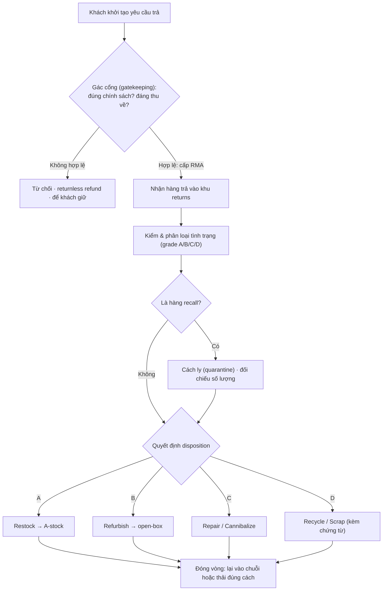
*Sơ đồ: vòng đời một hàng hoàn trong DC, gác cổng đặt trước cửa kho (tự vẽ, tổng hợp Richards ch.7 — "the returns cycle" + Rogers & Tibben-Lembke 1999 về gatekeeping).*

#### c. Gác cổng & thiết kế khu returns: "kho-trong-kho"

##### c.1 — Gác cổng (gatekeeping): đẩy quyết định lên thượng nguồn

Phát hiện vận hành quan trọng nhất của Rogers & Tibben-Lembke (1999) là **gatekeeping**: chốt chặn *quyết định cho phép trả hay không, ngay tại điểm khởi tạo* — trước khi hàng kịp di chuyển vật lý về DC. Bản chất của nó là một nguyên lý quản trị tổng quát: *quyết định càng được đẩy lên sớm trong dòng chảy, càng rẻ để sửa sai*. Một yêu cầu trả không hợp lệ (ngoài chính sách, "mặc rồi trả" — *wardrobing*, hàng không lỗi) nếu bị chặn ngay ở cổng sẽ không phát sinh chi phí vận chuyển ngược, không chiếm slot kiểm, không tốn công disposition. Công cụ thực thi là **RMA** (Return Merchandise Authorization — phiếu cấp phép trả hàng): không có RMA, hàng không được nhận.

Stock/WERC (2004, dẫn Richards) gọi đây là *"quy trình ra quyết định trước khi sản phẩm bị trả về vật lý"* và xếp nó đứng đầu danh sách best practice. Giá trị kinh tế của gác cổng được định lượng ở Lab §e (ngưỡng hòa vốn $c_g < g\cdot h$).

##### c.2 — Thiết kế khu returns: một kho bên trong một kho

Nếu vận hành returns ngay trong kho hiện hữu, Richards cảnh báo bạn thực chất đang dựng *"một kho bên trong một kho" (warehouse within a warehouse)* — và nó phải được hoạch định khác hẳn khu lưu trữ thường. Lý do là *vật lý dòng chảy* của returns khác: dị thể, cần phân nhánh theo tình trạng, và có rủi ro nhiễm chéo. Không gian phải được chia tách cho các chức năng riêng:

- **Sortation (phân loại sơ bộ):** tách nhanh "good stock có thể restock ngay" khỏi "cần xử lý sâu" — chính là *cách tiếp cận hai giai đoạn* của Stock/WERC: xử lý ban đầu để bắt *quick wins*, rồi mới kiểm sâu phần còn lại.
- **Inspection (kiểm & grade):** nơi tạo ra thông tin tình trạng, đầu vào cho quyết định disposition.
- **Repair / Refurbishment:** khu kỹ thuật, có thể giới hạn công suất (ràng buộc trong Lab §e Part 2).
- **Disposal & quarantine:** khu thải bỏ và **cách ly** — đặc biệt cho hàng recall, hóa chất, hàng nguy hiểm, hàng hỏng, để **tránh nhiễm chéo (cross-contamination)** với hàng tốt.

> [!WARNING] 🪤 Bẫy thường gặp khi xử lý hàng hoàn
> - **Đối xử returns như receiving xuôi:** áp quy trình nhận hàng có ASN lên một dòng *không có ASN* → tắc ở khâu kiểm, hàng tồn đọng. Returns cần một SOP *phân nhánh theo tình trạng*, không phải một luồng thẳng.
> - **Để hàng nằm lâu:** mỗi ngày dwell là giá trị bốc hơi (Blackburn — xem §e Part 3). "Hàng trả không nên nằm trong kho quá lâu" (Richards) là một ràng buộc *kinh tế*, không phải lời khuyên gọn gàng.
> - **Nhiễm chéo:** trộn hàng recall/hỏng/hóa chất với hàng tốt → vừa rủi ro an toàn, vừa nguy cơ xuất nhầm hàng nguy hiểm ra thị trường.
> - **Chỉ đo chi phí, quên đo thu hồi:** quản trị returns chỉ nhìn "tốn bao nhiêu" sẽ tối ưu sai hướng — phải đo *recovery rate* (Stock/WERC: best practice đạt **>80%**) và *return cycle time*.

#### d. Góc Toán tối ưu — bản đồ bài toán ẩn

Dưới lớp SOP, returns processing chứa một cụm bài toán định lượng đan vào nhau. Mỗi quyết định vận hành tương ứng một lớp mô hình có lời giải chuẩn:

| Quyết định trong returns | Bài toán | Lớp toán / phương pháp | Nơi giải |
|---|---|---|---|
| Chọn disposition cho 1 đơn vị khi tình trạng còn *bất định* | Quyết định dưới rủi ro | Cây quyết định / EMV (kỳ vọng) | Lab §e Part 1 |
| Có nên gác cổng / mức đầu tư gác cổng | Hòa vốn (breakeven) | So sánh chi phí–lợi ích biên | Lab §e Part 1 |
| Phân bổ cả lô vào dispositions khi *công suất refurb có hạn* | Phân bổ tài nguyên khan hiếm | LP/MILP (cấu trúc transportation) + đối ngẫu/giá bóng | Lab §e Part 2 |
| Xử lý nhanh tới mức nào | Định giá tài sản suy giảm | Mô hình suy giảm giá trị $V(t)$ (MVT) | Lab §e Part 3 |
| Mức tồn kho khi có dòng trả ngược feed lại | Tồn kho có returns | Stochastic: chính sách thải tối ưu (Heyman 1977; Simpson 1978) | nối [M4](04-toi-uu-ton-kho.md) (biên trên) |
| Gom hàng hoàn từ nhiều khách về DC | Định tuyến gom | VRP (hội tụ nhiều-về-một) | nối [M7](07-transportation-network.md) §7.x |

**Mỏ neo học thuật (lớp "vì sao"):** thứ bậc thu hồi *Thierry et al. 1995* cho cấu trúc giá trị của hàm mục tiêu; *Fleischmann et al. 1997* tổng hợp các lớp mô hình hậu cần ngược (phân phối, tồn kho, location); *Blackburn et al. 2004* cho mô hình giá trị-thời gian; *Heyman 1977 / Simpson 1978* cho chính sách thải/sửa tối ưu khi tồn kho nhận dòng trả (đây là biên trên — thuộc về module tồn kho).

#### e. Lab định lượng — chọn disposition, phân bổ dưới công suất, và đồng hồ giá trị

Toàn bộ Lab dùng **một bộ dữ liệu tĩnh, cho sẵn, dò tay được** (không `random`), và đã **verify bằng máy** — output khớp phần tính tay. Bài toán: một SKU điện tử tiêu dùng, giá bán mới 200, chi phí thay thế (COGS) 120.

##### e.1 — Part 1: Chọn disposition dưới bất định phân loại (EMV) + ngưỡng gác cổng

Trước khi kiểm, ta chưa biết một đơn vị trả về thuộc grade nào — chỉ biết *phân phối xác suất* (ước lượng từ lịch sử). Mỗi grade có một disposition tốt nhất và giá trị thu hồi ròng. Giá trị kỳ vọng của *chính sách disposition* là kỳ vọng có trọng số xác suất — đây là một quyết định dưới rủi ro, không phải số học một bước.

> [!IMPORTANT] 📐 Công thức — EMV của chính sách disposition & hòa vốn gác cổng
> $$\text{EMV} = \sum_{g} p_g \cdot \text{NetRecovery}(g)$$
> **Tính tay** với $p = (0{,}45;\,0{,}25;\,0{,}20;\,0{,}10)$ và net recovery $(190;\,125;\,70;\,-10)$:
> $$\text{EMV} = 0{,}45(190) + 0{,}25(125) + 0{,}20(70) + 0{,}10(-10) = 85{,}5 + 31{,}25 + 14{,}0 - 1{,}0 = \mathbf{129{,}75}.$$
> So với phương án "vứt bỏ hết" ($-10$/đơn vị), **giá trị của việc *có* quy trình disposition** = $129{,}75-(-10)=\mathbf{139{,}75}$/đơn vị. Và $129{,}75 > \text{COGS}=120$ → thu hồi *đắt hơn* mua mới thay thế: returns đáng xử lý.
>
> **Hòa vốn gác cổng:** gọi $g$ = tỷ lệ yêu cầu trả *không hợp lệ*, $h$ = chi phí xử lý ngược một đơn vị qua DC, $c_g$ = chi phí kiểm tại cổng mỗi yêu cầu. Gác cổng đáng làm khi
> $$c_g < g \cdot h.$$
> **Tính tay** với $g=0{,}15$, $h=18$: chi phí DC tránh được $=0{,}15\times18=2{,}70$/yêu cầu. Nếu $c_g=1{,}00 < 2{,}70$ → gác cổng *lãi* $1{,}70$/yêu cầu.

##### e.2 — Part 2: Phân bổ cả lô dưới ràng buộc công suất tái chế (LP + giá bóng)

Khi cả lô đến cùng lúc và **dây chuyền refurb chỉ xử lý được $K=30$ đơn vị/kỳ**, bài toán chọn-disposition-từng-đơn-vị biến thành một **bài toán phân bổ có ràng buộc** — đúng dạng *transportation/LP*. Cả grade B và C đều *có thể* refurb (giá trị cao) nhưng nếu hết slot phải chuyển sang *liquidate* (thanh lý) giá thấp hơn. Lô 100 đơn vị: A=45, B=25, C=20, D=10.

> [!IMPORTANT] 📐 Công thức — Mô hình LP phân bổ disposition
> Biến $x_{gd}\ge 0$ = số đơn vị grade $g$ đi theo disposition $d$. Ma trận giá trị $v_{gd}$: A→Restock 190; B→Refurb 125 / Liquidate 60; C→Refurb 70 / Liquidate 20; D→Scrap −10.
> $$\begin{aligned}
> \max \;&\; \sum_{g,d} v_{gd}\,x_{gd} \\
> \text{s.t.}\;&\; \sum_d x_{gd}=n_g \quad \forall g \qquad (\text{phân bổ hết mỗi grade}) \\
> &\; \sum_{(g,d)\,\in\,\text{Refurb}} x_{gd}\le K \qquad (\text{công suất refurb})
> \end{aligned}$$
> **Tính tay (lập luận biên):** A luôn restock (190, không tranh slot). B và C tranh 30 slot refurb. *Lợi biên* của refurb so với liquidate: B = $125-60=65$; C = $70-20=50$. Ưu tiên B (65 > 50): 25 đơn vị B chiếm 25 slot, còn 5 slot cho C → 5 C refurbish, 15 C liquidate. Tổng:
> $$45(190)+25(125)+\big[5(70)+15(20)\big]+10(-10) = 8550+3125+650-100 = \mathbf{12\,225}.$$
> **Giá bóng (shadow price) của công suất refurb** = lợi biên của đơn vị *đang bị chặn* = C-refurb so với C-liquidate = $70-20=\mathbf{50}$/slot. Thêm 1 slot refurb → kéo 1 đơn vị C từ liquidate(20) lên refurb(70), tăng tổng đúng 50 — *cho tới khi C cạn*. Đây chính là **đối ngẫu LP** (nối [§6.5](#65-tối-ưu-hóa-kho-bằng-quy-hoạch-tuyến-tính-liu-ch7-pulp)): giá bóng = giá trị biên của một đơn vị nguồn lực khan hiếm → tín hiệu *nên đầu tư mở rộng refurb tới mức nào*.

##### e.3 — Part 3: Đồng hồ giá trị — vì sao tốc độ là tiền (Blackburn et al. 2004)

Giá trị refurb của một đơn vị *không cố định* — nó suy giảm theo thời gian hàng nằm chờ (dwell time), do lỗi mốt, hao mòn, rớt giá thị trường. Mô hình suy giảm mũ:

> [!IMPORTANT] 📐 Công thức — Suy giảm giá trị theo thời gian (marginal value of time)
> $$V(t) = V_0\, e^{-\delta t}$$
> với $V_0=125$ (giá trị refurb grade B lúc $t=0$) và $\delta=0{,}02$/ngày. **Tính tay** vài mốc: $t=10\Rightarrow 125e^{-0{,}2}=102{,}3$; $t=30\Rightarrow 125e^{-0{,}6}=68{,}6$ (gần *nửa* sau một tháng); $t=60\Rightarrow 125e^{-1{,}2}=37{,}7$. Độ dốc $\delta$ chính là thứ quyết định chuỗi ngược nên *responsive* (δ lớn) hay *efficient* (δ nhỏ) ở §a.2.

> [!NOTE] 💻 Góc Khoa học dữ liệu — Lab returns disposition (đã verify)
> Code tĩnh, chạy `python lab_m06_returns_disposition.py` (PuLP 3.x, solver CBC). Output khớp tính tay ở cả ba Part.
> ```python
> # PART 1 — EMV disposition + gác cổng
> GRADES = [("A",0.45,190.0),("B",0.25,125.0),("C",0.20,70.0),("D",0.10,-10.0)]
> emv = sum(p*v for _,p,v in GRADES)            # = 129.75
> g, h, c_g = 0.15, 18.0, 1.00
> avoided = g*h                                  # = 2.70 ; gác cổng lãi vì c_g < avoided
>
> # PART 2 — LP phân bổ dưới công suất refurb (rút gọn)
> import pulp
> counts = {"A":45,"B":25,"C":20,"D":10}; K = 30
> value = {"A":{"Restock":190.0}, "B":{"Refurb":125.0,"Liquidate":60.0},
>          "C":{"Refurb":70.0,"Liquidate":20.0}, "D":{"Scrap":-10.0}}
> uses_refurb = {("B","Refurb"),("C","Refurb")}
> m = pulp.LpProblem("returns", pulp.LpMaximize)
> x = {(g,d): pulp.LpVariable(f"x_{g}_{d}", lowBound=0) for g in value for d in value[g]}
> m += pulp.lpSum(value[g][d]*x[(g,d)] for (g,d) in x)
> for g,c in counts.items():
>     m += pulp.lpSum(x[(gg,d)] for (gg,d) in x if gg==g) == c
> m += pulp.lpSum(x[(g,d)] for (g,d) in x if (g,d) in uses_refurb) <= K, "cap"
> m.solve(pulp.PULP_CBC_CMD(msg=0))
> # Tong gia tri = 12225.00 ; gia bong cong suat = m.constraints["cap"].pi = 50.0
>
> # PART 3 — suy giam gia tri
> import math
> V0, delta = 125.0, 0.02
> # t=30 -> 125*exp(-0.6) = 68.60
> ```
> **Kết quả máy in ra (trích):**
> ```
> EMV thu hoi / don vi          = 129.75
> GIA TRI cua quyet dinh disp.  = 139.75
> Gatekeeping DANG LAM (net/yeu cau = 1.70)
> TONG GIA TRI THU HOI          = 12225.00
> GIA BONG cong suat refurb     = 50.00 / slot
> Dwell 30 ngay: V = ... = 68.60
> ```

> [!WARNING] 🪤 Giả định & hạn chế của Lab (điều kiện hiệu lực — bậc thạc sĩ)
> - **Xác suất grade ước lượng từ lịch sử.** $p_g$ là ước lượng mẫu → có sai số lấy mẫu; nếu cơ cấu lý do trả *dịch chuyển* (vd ra mắt sản phẩm mới làm tăng "đổi ý"), phân phối cũ chệch. Cần cập nhật $p_g$ định kỳ và để ý **regime shift**.
> - **Giá trị $v_{gd}$ coi như tĩnh và độc lập với khối lượng.** Thực tế thanh lý số lượng lớn *kéo giá thị trường thứ cấp xuống* (nội sinh giá) — bán càng nhiều open-box, giá open-box càng giảm. Mô hình tuyến tính bỏ qua hiệu ứng này; muốn chuẩn phải đưa hàm giá phụ thuộc lượng (phi tuyến) hoặc ràng buộc trần khối lượng mỗi kênh.
> - **Công suất refurb coi là chắc chắn.** Nếu năng suất refurb *bất định*, bài toán LP tất định trở thành *stochastic programming* (biên trên).
> - **Bỏ qua chiều thời gian trong Part 2.** Part 2 tối ưu *một kỳ tĩnh*; ghép với suy giảm $V(t)$ ở Part 3 sẽ thành bài toán *động* (đa kỳ) — đó là cầu nối sang chính sách thải tối ưu của Heyman (1977) khi tồn kho liên tục nhận dòng trả.

#### f. Thực thi: SOP returns, biện minh chi phí, và in-house vs 3PL

##### f.1 — SOP & best practice (Stock/WERC 2004)

> [!TIP] 🛠️ Quy trình thực thi (SOP) xử lý hàng hoàn
> 1. **Gác cổng & cấp RMA** — duyệt yêu cầu trả *trước* khi hàng di chuyển; cấp returns authorization note. Không RMA, không nhận.
> 2. **Cấp slot thời gian nhận** — bố trí *time slots* riêng cho hàng hoàn, tách khỏi receiving xuôi để không tranh dock/nhân lực.
> 3. **Xử lý hai giai đoạn** — (i) phân loại sơ bộ bắt *quick wins* (good stock → restock ngay); (ii) kiểm sâu phần còn lại để grade.
> 4. **Cách ly recall/nguy hiểm** — hàng recall vào quarantine ngay, đối chiếu đủ số lượng đã thu.
> 5. **Quyết định disposition** theo §b (restock / refurb / repair / cannibalize / recycle / scrap), ưu tiên bậc Thierry cao nhất sinh giá trị dương.
> 6. **Đóng vòng nhanh** — đưa lại chuỗi hoặc thải bỏ kèm **chứng từ** (certificate) chứng minh thải đúng quy định (WEEE/hazmat).
> 7. **Đo & cải tiến** — theo dõi *return cycle time*, *recovery rate* (đích >80%), đào tạo & cross-train nhân viên, dùng phần mềm giám sát, vẽ *process map* chi tiết, audit định kỳ.

Stock/WERC (2004, dẫn Richards): *"chìa khóa của mọi chương trình hàng trả thành công là phối hợp đúng giữa con người, chính sách, quy trình và thứ tự ưu tiên."*

##### f.2 — Sáu phép tính trước, và công thức biện minh

Richards yêu cầu *trước khi* thiết lập một vận hành hậu cần ngược phải tính **tỷ lệ % và giá trị** của sáu nhóm: (1) trả thẳng về kho/về vendor; (2) tân trang rồi về kho; (3) tháo lấy phụ tùng; (4) tiêu hủy/cho từ thiện; (5) trả do lỗi sản xuất; (6) trả do lỗi sales/kho/người dùng. Hai nhóm cuối phải truy *nguyên nhân gốc* trước khi dựng quy trình.

> [!IMPORTANT] 📐 Công thức — Biện minh vận hành returns (Richards ch.7)
> Vận hành returns đáng làm khi **chi phí phía xử lý hoàn < chi phí phía "vứt + mua mới"**:
> $$\begin{aligned}
> \underbrace{C_{\text{xử lý returns}} + \Delta\text{CF}_{\text{hoàn}}}_{\text{phía xử lý hoàn}} \;\;<\;\; \underbrace{C_{\text{mua/SX mới}} + C_{\text{thải bỏ}} + \Delta\text{CF}_{\text{vứt}}}_{\text{phía vứt + mua mới}}
> \end{aligned}$$
> trong đó $\Delta\text{CF}$ là tác động dòng tiền (cash flow) của mỗi phía. Vế phải chính là cái giá của việc *không* thu hồi: vẫn phải thải bỏ (tốn phí) *và* phải mua mới lấp kệ. Đây là phát biểu thực hành của bất đẳng thức "EMV > COGS" ở Lab §e.1.

##### f.3 — In-house hay thuê 3PL?

Quyết định cuối là tự vận hành hay khoán cho một chuyên gia bên thứ ba. Richards liệt kê các yếu tố: *mức độ returns, không gian sẵn có, chuyên môn, chi phí, khả năng kiểm soát & hiệu quả, năng lực của 3PL, và lead time từ lúc trả tới lúc sẵn sàng bán lại*. Rushton (ch.32) xác nhận returns/reverse là một *dịch vụ giá trị gia tăng* phổ biến mà nhiều 3PL chào — đặc biệt các chuỗi siêu thị lớn dùng vận hành ngược chuyên dụng cho bao bì tái sử dụng, vì *"rất khó tổ chức hiệu quả việc thu hồi trên xe giao hàng chiều xuôi"* (ảnh hưởng giờ giao đã chốt). Đây là một bài toán *make-or-buy* — nối thẳng khung chi phí giao dịch & breakeven ở [M7 §thuê ngoài 3PL/4PL](07-transportation-network.md).

#### g. Case study từ sách & cập nhật thực tế

> [!CAUTION] 📦 CASE STUDY — Bán lẻ catalogue/dệt may: returns như một dây chuyền tái chế tạo nhỏ
> **Bối cảnh:** bán lẻ catalogue (và nay là e-commerce thời trang) luôn có tỷ lệ trả cao, đặc biệt hàng dệt may/quần áo (Richards ch.7). **Diễn biến:** các nhà bán lẻ này dựng hẳn *khu xử lý returns* không chỉ để nhận hàng, mà để **làm sạch, là ủi, đóng gói lại** cho bán lại — tức một dây chuyền *refurbish* thu nhỏ ngay trong DC. **Bài học:** với ngành tỷ lệ trả cao, returns không phải ngoại lệ cần dẹp mà là *một dòng sản xuất ngược thường trực* phải được thiết kế công suất, định mức lao động và không gian như một vận hành chính — đúng tinh thần "kho-trong-kho".

> [!CAUTION] 📦 CASE STUDY — Thu hồi sản phẩm (recall) & bao bì quay vòng
> **Recall:** Richards nhấn mạnh hàng recall phải *cách ly khi nhận*, vì hai lý do — đảm bảo đã thu đủ (món recall thường là *nguy hiểm cho công chúng*) và tuyệt đối không lẫn vào hàng tốt rồi xuất nhầm. Một lỗi cách ly ở đây không chỉ tốn tiền mà là *rủi ro an toàn & pháp lý*. **Bao bì quay vòng:** Rushton ví dụ "thùng đựng nấm" trong ngành rau quả và các két/keg/pallet — dòng ngược ở đây không nhằm thu hồi *sản phẩm* mà thu hồi *vật chứa* để làm sạch, dùng lại; nhiều siêu thị lớn khoán hẳn cho 3PL vì khó ghép vào xe giao xuôi.

> [!NOTE] 🌐 Quy mô hàng hoàn bán lẻ Mỹ (cập nhật)
> Theo Liên đoàn Bán lẻ Quốc gia Mỹ (NRF) cùng Happy Returns, tổng giá trị hàng trả năm 2024 đạt khoảng **890 tỷ USD**, tương đương **16,9% doanh số bán lẻ** (tăng từ 14,5% năm 2023) (NRF & Happy Returns, 2024). Tỷ lệ trả *hàng mua online cao hơn hẳn*: **17,6%** so với **~10,0%** ở kênh cửa hàng truyền thống (NRF, 2024). Dự báo 2025 hạ nhẹ về gần **850 tỷ USD** (NRF, 2025). Hàm ý: với doanh nghiệp thiên e-commerce, returns là một dòng *cấu trúc* cỡ một phần sáu doanh số — không phải nhiễu thống kê.

#### h. Insight tổng hợp & liên kết chéo

> [!IMPORTANT] 💡 INSIGHT 1 (xuyên mục) — Gác cổng, hoãn biệt hóa và risk pooling cùng một nguyên lý: "đẩy quyết định về đúng vị trí thông tin"
> Gác cổng returns đẩy quyết định *cho-trả-hay-không* lên điểm khởi tạo — nơi *rẻ nhất để sửa sai*. Đây không phải mẹo riêng của reverse logistics mà là một nguyên lý xuyên suốt chuỗi cung ứng: **hoãn biệt hóa (postponement)** đẩy quyết định cấu hình sản phẩm *xuống* hạ nguồn — nơi *thông tin cầu đã rõ nhất*; **risk pooling/centralization** (Eppen 1979, [M4](04-toi-uu-ton-kho.md)) gộp bất định về *một điểm* để giảm phương sai. Cả ba đều là bài toán *định vị quyết định theo cấu trúc thông tin*: đặt quyết định tại điểm mà tỷ lệ "giá trị thông tin / chi phí đảo ngược" là cao nhất. Hàng hoàn — với đặc tính *no-ASN, ít thông tin* (§a) — là ca mà việc tạo thông tin sớm (gác cổng, inspection) có giá trị biên lớn nhất.

> [!IMPORTANT] 💡 INSIGHT 2 (gắn bối cảnh thực chiến của bạn) — Returns là một bài toán Control Tower và DRP ngược
> Với nền **Toán kinh tế** và kinh nghiệm xây *Control Tower / Visibility* cùng giải pháp **DRP** cho FMCG (Mondelez, TTC Agrifood), bạn có thể nhìn returns processing đúng tầm của nó:
> - **Đồng hồ giá trị = một KPI visibility.** Phát hiện Blackburn (giá trị suy giảm theo dwell time) biến *return cycle time* từ một chỉ số vận hành thành một **biến tài chính**. Một Control Tower cho reverse flow nên hiển thị không chỉ "hàng đang ở đâu" mà "**giá trị thu hồi còn lại đang bốc hơi với tốc độ $\delta$**" — biến tốc độ xử lý thành tiền, đúng ngôn ngữ C-level bạn nhắm tới.
> - **DRP có dòng ngược (closed-loop).** Trong mạng DRP FMCG, hàng trả (sale-or-return, cận date, recall) là một *nguồn cung ngược* feed lại các DC. Bỏ qua nó làm net requirement bị lệch; mô hình hóa đúng cần đưa returns vào như một dòng vào stochastic — chính là địa hạt Heyman (1977)/Simpson (1978) ở §d. Đây là điểm nâng một mô hình DRP "xuôi" lên mô hình *vòng kín*.
> - **Disposition là một module OMS.** Cây quyết định EMV ở §e.1 chính là logic nghiệp vụ một màn hình *disposition* trong hệ OMS/returns mà bạn thiết kế: nhập grade → hệ gợi ý disposition tối đa giá trị, có tính ràng buộc công suất refurb (LP §e.2). Bài toán giải pháp của bạn và bài toán toán học là *một*.

> [!NOTE] 🔗 Liên kết chéo
> - [§6.1.1 — Động lực học dòng chảy kho](#611-động-lực-học-dòng-chảy-kho-receiving--put-away--storage--picking--despatch): returns = một dạng *receiving nghịch*, nhưng không ASN và phân nhánh theo tình trạng.
> - [§6.1.4 — Cross-docking](#614-cross-docking-chuyên-sâu) & [§6.3.1 — Lao động & năng suất](#631-quản-trị-lao-động--năng-suất-kho): định cỡ công suất/định mức cho khu returns ở cao điểm hậu lễ.
> - [§6.5 — Tối ưu hóa kho bằng LP](#65-tối-ưu-hóa-kho-bằng-quy-hoạch-tuyến-tính-liu-ch7-pulp): LP phân bổ disposition & giá bóng dùng đúng bộ máy đối ngẫu ở đó.
> - [M4 — Tối ưu tồn kho](04-toi-uu-ton-kho.md): tồn kho vòng kín với dòng trả (Heyman/Simpson); risk pooling (Eppen).
> - [M7 — Vận tải & mạng lưới](07-transportation-network.md): make-or-buy 3PL cho reverse; định tuyến gom hàng hoàn (VRP).
> - [M10 — Logistics xanh](10-green-logistics.md): chiến lược kinh tế tuần hoàn, WEEE/EPR, đây là tầng *chiến lược* của reverse logistics.

## 📚 Nguồn

**Sách (nền chính):**
- Richards, G. *Warehouse Management* — ch.7, *Returns processing / reverse logistics* (vòng đời returns, thiết kế khu, sáu phép tính %, công thức biện minh, best practice Stock/WERC 2004, in-house vs 3PL).
- Rushton, A., Croucher, P. & Baker, P. *The Handbook of Logistics & Distribution Management* — ch.32 (reverse logistics như VAS của 3PL; bao bì quay vòng), ch.36 (packaging waste).

**Lớp học thuật toàn cầu (tầng "vì sao"):**
- Thierry, M., Salomon, M., Van Nunen, J. & Van Wassenhove, L. (1995). *Strategic Issues in Product Recovery Management.* California Management Review — thứ bậc phương án thu hồi.
- Rogers, D. & Tibben-Lembke, R. (1999). *Going Backwards: Reverse Logistics Trends and Practices* — gatekeeping, taxonomy returns.
- Fleischmann, M. et al. (1997). *Quantitative Models for Reverse Logistics: A Review.* European Journal of Operational Research.
- Blackburn, J., Guide, V.D.R., Souza, G. & Van Wassenhove, L. (2004). *Reverse Supply Chains for Commercial Returns.* California Management Review 46(2), 6–22 — marginal value of time; responsive vs efficient.
- Guide, V.D.R. & Van Wassenhove, L. (2009). *The Evolution of Closed-Loop Supply Chain Research.* Operations Research.
- Heyman, D. (1977). *Optimal Disposal Policies for a Single-Item Inventory System with Returns.* Naval Research Logistics; Simpson, V. (1978). *Optimum Solution Structure for a Repairable Inventory Problem.* Operations Research — chính sách thải/sửa tối ưu (biên trên).

**Deep research (web, bổ sung):** NRF & Happy Returns — *2024 Consumer Returns in the Retail Industry* (returns 2024 ≈ 890 tỷ USD, 16,9% doanh số; online 17,6% vs cửa hàng ~10,0%); NRF — *2025 Retail Returns Landscape* (dự báo ≈ 850 tỷ USD).

*Lab: `assets/scripts/lab_m06_returns_disposition.py` (PuLP 3.x/CBC, dữ liệu tĩnh, verify khớp tính tay).*

### 6.4.2. Lưu trữ & Xử lý Đặc thù ✅

> **Nguyên tắc biên soạn & quy ước trình bày:**
> - **Nền chính = sách thực hành.** Richards, *Warehouse Management* — phần *Specialized warehousing* (kho ngoại quan, kho lạnh, fashion logistics ở ch.1), kiểm soát chất lượng & lưu vị trí hàng nguy hiểm/giá trị cao (ch.4–5), an ninh & cycle counting (ch.7). Rushton/Croucher/Baker, *Handbook* — phân khúc theo *temperature regime* & *value density* (ch.8), nguyên lý kho (ch.15), **an ninh & an toàn trong phân phối (ch.35)**. Richards & Grinsted, *Toolkit* — đóng gói & nhãn hàng nguy hiểm (1.25), tính thuế hải quan (2.12).
> - **Lớp học thuật toàn cầu (tầng "vì sao" bậc sau-đại học):** vật lý suy giảm theo nhiệt độ — **Arrhenius (1889)** & quy tắc **Q10 (van't Hoff)**; **nhiệt độ động học trung bình** (**Haynes 1971**, nền của hướng dẫn ổn định ICH Q1A); kiểm định tuổi thọ gia tốc (**Labuza 1982**); cách ly hàng tương kỵ như **tô màu đồ thị** (**Welsh–Powell 1967**; NP-hard: **Karp 1972**); tập trung hóa theo *value density* & gộp rủi ro (**Eppen 1979**; Lovell–Saw–Stimson 2005); an ninh nhiều lớp như mô hình *Swiss Cheese* (**Reason 1990**, đã dùng ở [§6.3.3](#633-an-toàn-pccc-bảo-trì-mhe--5s)). Tra `references/canon-map-scm.md` (các hàng *chuỗi lạnh*, *hazmat*, *bonded*).
> - **Lý thuyết viết dày, giọng giáo trình**; **deep research (web) chỉ BỔ SUNG** trong khối 🌐.

---

#### 📌 Bốn lăng kính trong mục 6.4.2

> Đây là mục **đa chủ đề** gắn kết bởi một câu hỏi chung: *điều gì khiến một dòng hàng không được lưu như hàng thường?* Lõi vẫn là **Thực thi** (SOP cho từng chế độ đặc thù), nhưng để đạt độ sâu thạc sĩ, lăng kính **Toán & Data** phải gánh phần *vì sao* — bốn loại ràng buộc đặc thù ánh xạ vào bốn lớp mô hình khác hẳn nhau (động học, tổ hợp, rủi ro, tài chính). Chiến lược hỏi *nên tập trung hay phân tán* hàng đặc thù; Hoạch định lo công suất, năng lượng và không gian cách ly.

| Lăng kính | Mức nhấn | Thể hiện ở đâu |
|---|---|---|
| 🛠️ **Thực thi** | ●●● Trọng tâm | §b (SOP chuỗi lạnh, kiểm nhiệt), §c (phân khu hazmat, SDS), §d (an ninh nhiều lớp), §e (thủ tục ngoại quan), §h (SOP gộp) |
| 📐💻 **Toán & Data** | ●●● Trọng tâm | §f (bản đồ bài toán), §g (Lab: Q10 + MKT Haynes; tô màu đồ thị cách ly; NPV hoãn thuế) |
| 🎯 **Chiến lược** | ●● Bổ trợ | §a.1 (tập trung hóa theo value density), §d (an ninh = quản trị rủi ro), §e (kho ngoại quan = đòn bẩy dòng tiền) |
| 🧭 **Hoạch định** | ●● Bổ trợ | §b (năng lượng 12–30% opex, kho đa nhiệt độ), §c (định cỡ khu cách ly & sức chứa COMAH) |

#### a. Bản chất: khi một ràng buộc ngoài-không-gian chiếm quyền chi phối thiết kế

Toàn bộ chương này, tới giờ, tối ưu kho quanh **hai biến nền**: *không gian* (chứa được nhiều nhất) và *khả năng tiếp cận* (lấy hàng nhanh nhất). Slotting, layout U-flow, chọn giá kệ — tất cả đều là các đánh đổi giữa hai biến đó. Lưu trữ đặc thù xuất hiện khi một **ràng buộc thứ ba**, đến *từ bản thân hàng hóa hoặc từ luật*, mạnh tới mức nó **chiếm quyền** và đẩy bài toán không gian–tiếp cận xuống hàng thứ yếu. Hiểu đúng mục này là hiểu *ràng buộc nào đang ràng buộc* (the binding constraint) — vì chính nó, chứ không phải mật độ lưu, quyết định thiết kế.

Có bốn họ ràng buộc đặc thù, mỗi họ bắt nguồn từ một "vật lý" khác nhau và do đó đòi một lời giải khác nhau:

- **Ràng buộc sinh–hóa (chuỗi lạnh).** Hàng *tự suy giảm theo thời gian và nhiệt độ* do động học phản ứng. Biến điều khiển là *nhiệt độ*; mục tiêu là giữ tốc độ phản ứng đủ thấp để tuổi thọ trải dài qua chuỗi cung ứng.
- **Ràng buộc an toàn–pháp lý (hàng nguy hiểm).** Hàng có thể *giải phóng năng lượng hoặc độc tính* — cháy, nổ, ăn mòn, độc. Biến điều khiển là *sự cách ly và ngăn chặn*; mục tiêu là chặn các cặp tương kỵ gặp nhau và khống chế sự cố trong một vùng.
- **Ràng buộc kinh tế–rủi ro (hàng giá trị cao).** Hàng *hấp dẫn trộm cắp*; mất mát là một biến ngẫu nhiên có kỳ vọng dương. Biến điều khiển là *đầu tư an ninh*; mục tiêu là kéo tổn thất kỳ vọng xuống dưới chi phí phòng vệ.
- **Ràng buộc tài chính–pháp lý (kho ngoại quan).** Hàng mang theo một *nghĩa vụ thuế bị treo*; thời điểm nộp thuế là biến quyết định. Biến điều khiển là *thời gian và đích đến*; mục tiêu là hoãn hoặc tránh dòng tiền thuế.

Rushton (ch.15) liệt kê đúng các họ này khi phân loại kho *theo loại hàng*: "thực phẩm đông lạnh, hàng dễ hỏng, hàng an ninh và hàng nguy hiểm" đều được tách ra như những hạng riêng. Richards (ch.4) cũng ghi nhận rằng ngay từ khâu nhận hàng, *"hàng giá trị cao, thực phẩm, hàng nguy hiểm, hàng nhạy nhiệt và dược phẩm"* đã phải đi một luồng kiểm tra nghiêm ngặt hơn — tức sự đặc thù bắt đầu từ cửa nhận, không đợi đến lúc xếp kệ.

> [!IMPORTANT] 🔑 Khái niệm cốt lõi — "Kho đặc thù" là nơi một ràng buộc ngoài-không-gian định nghĩa lại bài toán tối ưu
> Một khu lưu trữ trở thành **đặc thù** khi tồn tại một ràng buộc — nhiệt độ, tương kỵ, an ninh, hoặc thuế quan — mà *vi phạm nó gây tổn thất rời rạc và lớn* (hỏng cả lô, cháy nổ, mất trộm, phạt thuế), chứ không chỉ làm *giảm dần hiệu suất* như kẹt không gian. Vì tổn thất là *bậc thang* chứ không *tuyến tính*, ràng buộc này phải được xử lý như một **điều kiện cứng (hard constraint)**: thiết kế trước hết phải *thỏa mãn* nó, rồi mới tối ưu không gian–chi phí trong miền khả thi còn lại. Đây là lý do mọi lời giải đặc thù đều có dạng *"chấp nhận trả thêm chi phí lưu trữ để mua lấy việc không vi phạm"*.

##### a.1 — Chiến lược: tập trung hay phân tán hàng đặc thù? (value density & risk pooling)

Trước khi đi vào từng chế độ, cần đặt một câu hỏi chiến lược chi phối tất cả: hàng đặc thù nên được *gom về ít điểm* hay *rải ra nhiều điểm*? Câu trả lời không tùy tiện — nó tuân theo một quy luật định lượng. Rushton (ch.8, dẫn Lovell, Saw & Stimson 2005) đề xuất phân khúc theo **mật độ giá trị (value density)** — giá trị trên một đơn vị thể tích/khối lượng:

- Hàng **value density cao, sản lượng thấp** (linh kiện điện tử đắt, dược phẩm) nên **tập trung** về một *Global DC* và vận chuyển nhanh (airfreight) khi cần. Lý do là *gộp rủi ro*: gom tồn kho về một điểm làm giảm tổng tồn an toàn theo **quy luật căn bậc hai** (Eppen 1979 — xem [M4](04-toi-uu-ton-kho.md)), mà với hàng đắt thì mỗi đơn vị tồn an toàn cắt giảm được là một khoản vốn lớn.
- Hàng **value density thấp, sản lượng cao** (giấy in, nước đóng chai) nên **phân tán** gần khách, vì chi phí giữ tồn rẻ còn chi phí vận chuyển chặng cuối mới là khoản đáng tiết kiệm.

Điều này nối thẳng với ba chế độ đặc thù phía dưới: hàng giá trị cao *muốn* tập trung (gộp rủi ro + dễ canh giữ một điểm hơn nhiều điểm); nhưng hàng chuỗi lạnh lại *bị kéo ngược* về phía phân tán vì rút ngắn quãng đường lạnh làm giảm rủi ro đứt chuỗi và chi phí năng lượng vận chuyển. Sự *căng* giữa hai lực này chính là bài toán thiết kế mạng cho hàng đặc thù.

#### b. Chuỗi lạnh & lưu trữ kiểm soát nhiệt độ (temperature-controlled)

##### b.1 — Vì sao nhiệt độ là biến điều khiển: động học Arrhenius và quy tắc Q10

Một kho lạnh tồn tại vì một sự thật hóa học: **tốc độ của hầu hết phản ứng làm hỏng hàng tăng theo hàm mũ với nhiệt độ**. Đây là định luật **Arrhenius (1889)** — nền tảng "vì sao" của toàn bộ ngành chuỗi lạnh, mà một người chỉ đọc sổ tay vận hành sẽ không bao giờ gặp. Tốc độ phản ứng suy giảm $k$ phụ thuộc nhiệt độ tuyệt đối $T$ (Kelvin) theo:

> [!IMPORTANT] 📐 Công thức — Định luật Arrhenius & quy tắc Q10
> $$k(T) = A\, e^{-E_a/(RT)}$$
> - $A$: hệ số tần số (va chạm); $E_a$: **năng lượng hoạt hóa** (J/mol) — "rào" mà phản ứng phải vượt; $R=8{,}314$ J/mol·K: hằng số khí; $T$: nhiệt độ tuyệt đối (K).
> - Bản chất: vì $T$ nằm ở **mẫu của số mũ âm**, mỗi độ tăng nhiệt làm $k$ tăng *nhanh dần* — đó là lý do "ấm lên một chút" lại tàn phá tuổi thọ nhiều đến vậy.
>
> Vì $A,E_a$ khó đo trong kho, thực hành dùng **quy tắc Q10** (van't Hoff) — hệ số nhân tốc độ khi tăng $10°C$:
> $$Q_{10} = \frac{k(T+10)}{k(T)} \quad\Rightarrow\quad L(T) = L_0 \, Q_{10}^{-(T-T_{ref})/10}$$
> với $L(T)$ là **tuổi thọ** ở nhiệt độ $T$, $L_0$ là tuổi thọ ở nhiệt độ chuẩn $T_{ref}$. $Q_{10}=2$ nghĩa là *ấm thêm 10°C ⇒ hỏng nhanh gấp đôi ⇒ tuổi thọ giảm nửa*; thực phẩm nhạy nhiệt có $Q_{10}=3$ thậm chí cao hơn. Đây là dạng "thực hành" của Arrhenius và là cơ sở của **kiểm định tuổi thọ gia tốc** (accelerated shelf-life testing — Labuza 1982): ủ hàng ở nhiệt độ cao để rút ngắn thử nghiệm rồi ngoại suy về điều kiện thường.

Hệ quả vận hành mà Richards (ch.1, phần kho lạnh do Chris Sturman viết) nhấn mạnh: *"chức năng then chốt của kho lạnh là giữ nhiệt độ sản phẩm đúng mức lúc nhận."* Tuổi thọ là một *ngân sách* bị tiêu hao mỗi giờ hàng ở nhiệt độ cao hơn mức chuẩn — và một lần "lệch nhiệt" (excursion) ngắn nhưng nóng có thể đốt nhiều ngân sách hơn cả tuần ở nhiệt độ đúng. Lab §g.1 định lượng đúng phép kế toán tuổi thọ này.

##### b.2 — Ba chế độ nhiệt độ và thiết kế kho lạnh

Lý thuyết động học giải thích *vì sao cần lạnh*; thực hành chia thành ba **chế độ nhiệt độ (temperature regimes)** vì mỗi nhóm hàng có một dải an toàn riêng. Rushton (ch.8) định nghĩa:

- **Đông lạnh (frozen):** khoảng $-18$ đến $-25°C$ — kem, thịt, hải sản đông.
- **Mát (chilled):** khoảng $+2$ đến $+8°C$ — sữa, rau, dược phẩm 2–8°C.
- **Thường (ambient):** nhiệt độ ngoài bình thường.

Một kho có thể *đa nhiệt độ (multi-temperature)* với các khoang phân vùng và xe tải có vách ngăn nhiều khoang — đây là một đánh đổi: gộp ba chế độ vào một cơ sở tiết kiệm hạ tầng nhưng làm phức tạp quản lý nhiệt và tăng rủi ro lệch nhiệt ở ranh giới.

Thiết kế *vật lý* của một kho lạnh khác kho thường ở chỗ **năng lượng là khoản chi khổng lồ và vỏ kho là rào chắn nhiệt**. Richards ghi nhận năng lượng chiếm **12–30% chi phí vận hành** kho lạnh. Vì vậy mật độ lưu được đẩy lên tối đa (giá kệ *drive-in* và *mobile racking* — xem [§6.2](#62-thiết-kế-layout-không-gian--thiết-bị), vì khối hàng đặc giúp *giữ lạnh* và giảm thể tích phải làm lạnh), và mọi thiết kế đều xoay quanh việc *chặn nhiệt xâm nhập*: quét nhiệt ảnh (thermographic scan) hằng năm các mối nối panel, xử lý đọng sương trên nóc kho. Hoạt động làm thay đổi nhiệt mạnh — *cấp đông nhanh (blast freezing)* và *ủ nhiệt (tempering)* — phải đặt **tách khỏi khu lưu trữ chính** để không gây lệch nhiệt cho hàng đang tồn.

##### b.3 — Toàn vẹn chuỗi lạnh tại bến, an toàn lạnh và truy xuất

Điểm yếu nhất của chuỗi lạnh trong kho là **bến xếp dỡ** — nơi không khí lạnh trong kho gặp không khí ấm ngoài trời và khoang xe. Richards mô tả giải pháp: *dock seals/shelters* ôm khít cửa xe và *air curtain* (màn khí) chặn khí ấm tràn vào. Mất kiểm soát ở đây gọi là *temperature migration* — di trú nhiệt — và là nguyên nhân đứt chuỗi phổ biến nhất.

Lưu trữ lạnh kéo theo một tầng **an toàn lao động và an toàn hệ thống** riêng, không có ở kho thường:

- **Rủi ro với con người ở dưới 0°C:** nguy cơ *bị nhốt* (lock-in) cần chuông báo và cơ cấu mở nhanh; cần đồ bảo hộ nhiệt (PPE), uống đủ nước, bảo vệ da hở; sàn trơn do đóng băng quanh cửa.
- **Rủi ro hệ thống lạnh:** chất làm lạnh **HFC/HCFC** đang bị loại bỏ dần theo Nghị định thư Montreal (giảm chất phá tầng ozone ODS và chất có *tiềm năng nóng lên toàn cầu* GWP cao); thay thế kinh tế là **amoniac** — một hóa chất tự nhiên nhưng *dễ cháy nổ*, đòi đánh giá rủi ro chuyên biệt (ATEX/DSEAR).

Cuối cùng, hàng thực phẩm/dược buộc một tầng **truy xuất và tuân thủ**: nguyên tắc **HACCP** (Hazard Analysis and Critical Control Points — phân tích mối nguy và điểm kiểm soát tới hạn), truy xuất nguồn gốc theo quy định an toàn thực phẩm (EU 178/2002), kiểm nhiệt định kỳ theo ca với hồ sơ lưu, kiểm hàng *vào* (đúng nhiệt khi nhận) và *ra* (đúng nhiệt khi giao), xoay vòng **FIFO** chặt theo *date code*, và **cách ly** ngay hàng hỏng để nó không đi tiếp xuống chuỗi.

##### b.4 — Điều kiện biên: khi nào chuỗi lạnh KHÔNG đáng làm chặt tới vậy

Trình bày "luôn phải giữ lạnh tối đa" là sai — đó là cái bẫy tụng một nguồn. Độ chặt tối ưu của chuỗi lạnh *phụ thuộc độ dốc suy giảm* của chính sản phẩm, đo bằng $Q_{10}$ và $E_a$:

- Hàng có **$Q_{10}$ thấp và tuổi thọ dài** (vd đồ hộp, hàng khô) gần như *không cần* đầu tư chuỗi lạnh — ép nó vào kho lạnh chỉ đốt năng lượng vô ích.
- Hàng có **$Q_{10}$ cao và tuổi thọ ngắn** (vắc-xin, hải sản tươi) thì mỗi phút lệch nhiệt là tổn thất lớn — ở đây mới đáng trả giá cho giám sát thời gian thực và dự phòng máy lạnh.

Nói cách khác, *MKT và $Q_{10}$ của sản phẩm là thứ định cỡ mức đầu tư*, không phải một tiêu chuẩn phổ quát. Đây cùng một logic với căng thẳng *responsive ↔ efficient* ở [§6.4.1](#641-xử-lý-hàng-hoàn-trong-dc-returns-processing): độ dốc suy giảm giá trị quyết định thiết kế, không phải khẩu hiệu.

#### c. Hàng nguy hiểm (hazmat) & phân khu/cách ly

##### c.1 — Vì sao cách ly: tương kỵ là một quan hệ cặp, không phải thuộc tính đơn lẻ

Hàng nguy hiểm khác hàng thường ở chỗ nó *chứa năng lượng hoặc độc tính có thể giải phóng*. Nhưng phát hiện cốt lõi — và là lý do bài toán này *thú vị về mặt toán học* — là: **nguy hiểm phần lớn là một quan hệ giữa các cặp hàng, không phải một nhãn dán lên từng món**. Một thùng chất oxy hóa đứng một mình thì *ổn*; một thùng chất dễ cháy đứng một mình cũng *ổn*; nhưng đặt cạnh nhau thì một đám cháy nhỏ biến thành thảm họa, vì chất oxy hóa cấp dưỡng khí cho lửa. Đây là **tính tương kỵ (incompatibility)**, và nó được mã hóa thành các **ma trận cách ly (segregation matrix)** trong các bộ luật như **IMDG** (vận tải biển), **CLP/GHS** (phân loại–dán nhãn). Mỗi ô của ma trận nói: cặp lớp này *được chung khu*, *phải tách*, hay *cấm gần*.

Khi nguy hiểm là quan hệ cặp, bài toán "cần bao nhiêu khu cách ly riêng" trở thành một bài toán **tô màu đồ thị (graph coloring)**: mỗi lớp hàng là một đỉnh, mỗi cặp tương kỵ là một cạnh, và *số khu chống cháy tối thiểu chính là sắc số* $\chi(G)$ — số màu ít nhất để không hai đỉnh kề nhau cùng màu. Lab §g.2 giải đúng bài này. Đây là tầng "vì sao" đưa một quy định an toàn tưởng như thuần tủ-luật trở về một bài toán tổ hợp kinh điển (Welsh–Powell 1967; bài tổng quát là NP-hard, Karp 1972).

> [!IMPORTANT] 🔑 Khái niệm cốt lõi — Phân khu, ngăn chặn, và phân cấp kiểm soát
> Quản trị hazmat trong kho dựa trên ba nguyên lý xếp chồng:
> - **Cách ly (segregation):** không để các cặp tương kỵ ở cùng vùng — chính là bài tô màu đồ thị.
> - **Ngăn chặn (containment):** mỗi vùng có rào vật lý (đê bao chống tràn — *bunding*, sàn chống thấm, vách chống cháy) để một sự cố không lan ra ngoài vùng.
> - **Phân cấp kiểm soát (hierarchy of control):** ưu tiên *loại bỏ → thay thế → kỹ thuật → hành chính → PPE*, đúng tinh thần mô hình *Swiss Cheese* của Reason (xem [§6.3.3](#633-an-toàn-pccc-bảo-trì-mhe--5s)) — nhiều lớp phòng vệ độc lập để lỗ thủng của lớp này được lớp khác chặn.
> Khung pháp lý điển hình: **COSHH** (Control of Substances Hazardous to Health — kiểm soát chất nguy hại cho sức khỏe) yêu cầu đánh giá rủi ro từng chất; **COMAH** (Control of Major Accident Hazards, bản Anh của Chỉ thị Seveso) áp ngưỡng tồn trữ — vượt ngưỡng phải báo cáo an toàn và kế hoạch khẩn cấp. Ngưỡng này biến *sức chứa khu hazmat* thành một ràng buộc hoạch định, không chỉ là chỗ để hàng.

##### c.2 — Thực thi cốt lõi: SDS, dán nhãn, và đào tạo

Một khu hazmat vận hành đúng phải mở bằng *thông tin*, vì không ai xử lý an toàn thứ mình không biết là gì. Mỗi chất phải có **SDS** (Safety Data Sheet — phiếu an toàn hóa chất) mô tả mối nguy, cách xử lý tràn đổ, sơ cứu; hàng phải được **dán nhãn** đúng lớp nguy hiểm (Toolkit 1.25). Richards nhấn mạnh khi *xuất* hàng nguy hiểm, *"sản phẩm phải được dán nhãn chính xác và có đúng chứng từ"*, kèm trao **phiếu dữ liệu nguy hiểm** cho tài xế. Đây là lý do hazmat luôn đi kèm một tầng đào tạo và kiểm tra (COSHH assessment) nằm trong danh mục audit kho (Richards, biểu mẫu audit ch.13: *"đủ biện pháp an toàn cho hàng nguy hiểm?"*).

#### d. Hàng giá trị cao & an ninh kho

##### d.1 — Vì sao an ninh là một bài toán rủi ro, không phải một danh mục thiết bị

Hàng giá trị cao đặc thù không vì *vật lý* mà vì *kinh tế hành vi*: giá trị cao biến nó thành mục tiêu trộm cắp, nội bộ lẫn bên ngoài. Cách đặt vấn đề đúng — và là tầng "vì sao" nâng nó khỏi mức "lắp camera cho yên tâm" — là xem mất mát như một **biến ngẫu nhiên có kỳ vọng dương**: tổn thất kỳ vọng mỗi kỳ $=p\cdot L$ với $p$ là xác suất sự cố, $L$ là tổn thất nếu xảy ra. Mỗi lớp an ninh là một khoản chi $c_{sec}$ *mua lấy việc giảm $p$* (và đôi khi giảm $L$). Đầu tư đáng làm tới chừng nào *biên giảm của $p\cdot L$ còn lớn hơn biên chi phí an ninh* — đúng tư duy quản trị rủi ro của Knight (1921, risk vs uncertainty) và là một quyết định EMV y hệt khung ở [§6.4.1](#641-xử-lý-hàng-hoàn-trong-dc-returns-processing).

Một hệ quả phản trực giác mà Richards chỉ ra: **bến xếp dỡ là điểm dễ tổn thương nhất**, và *nhiều vụ mất cắp đến từ bên trong* — "hệ thống an ninh thường được thiết kế để chống người đột nhập, nhưng nhiều vụ trộm lại do người trong tổ chức." Vì vậy biện pháp rẻ mà hiệu quả gồm: tách bãi đỗ xe nhân viên khỏi bến xếp, khám ngẫu nhiên lúc ra/vào, và *đi tuần bất ngờ* (rẻ hơn nhiều so với CCTV mà răn đe tốt). Hàng giá trị cao được lưu trong **lồng khóa (lockable cage)** hoặc **carousel an ninh**, và được **cycle count dày hơn** (Richards: hàng giá trị cao đếm hằng tháng vì "dễ hao hụt — prone to shrinkage").

##### d.2 — An ninh nhiều lớp: từ quốc tế tới chiến thuật

Rushton dành hẳn ch.35 cho an ninh & an toàn phân phối, và trình bày nó như một **kiến trúc ba tầng** — đúng tinh thần *phòng vệ chiều sâu*:

- **Tầng quốc tế (sau sự kiện 11/9/2001):** các sáng kiến của Mỹ — **C-TPAT** (Customs–Trade Partnership against Terrorism — hợp tác tự nguyện hải quan–doanh nghiệp), **CSI** (Container Security Initiative — kiểm container tại cảng đi), **AMR** ("quy tắc 24 giờ" — khai báo hàng điện tử trước khi xếp). Doanh nghiệp tuân thủ được thông quan nhanh hơn.
- **Tầng chiến lược (tổn thương chuỗi cung ứng):** nghiên cứu Cranfield (2003) chỉ ra *chính cấu trúc chuỗi tinh gọn–trải dài* tạo ra tính dễ tổn thương; khuyến nghị đưa nhận thức rủi ro thành phần tích hợp của quản trị, từ lãnh đạo tới từng nhân viên.
- **Tầng chiến thuật (cơ sở & phương tiện):** hàng rào ≥2,4 m bọc thép gai nghiêng ra ngoài, cổng trượt điện, nhà bảo vệ kiểm soát ra vào, CCTV (chỉ hữu dụng khi *có người xem* và *có biển báo răn đe*), chiếu sáng, và **tuyển dụng cẩn trọng** (kiểm tra tham chiếu — vì kẻ gian từng cài người vào tổ chức qua đường ứng tuyển).

> [!WARNING] 🪤 Bẫy thường gặp với hàng đặc thù
> - **Coi lạnh là nhị phân "lạnh/không lạnh".** Sai — tổn hại là tích phân của *thời gian × mức vượt nhiệt* (Arrhenius). Một excursion ngắn nhưng nóng đốt tuổi thọ nhiều hơn nhiều giờ chỉ ấm nhẹ. Đo bằng MKT, đừng đo bằng "có vào lúc nào ngoài dải không".
> - **Cách ly hazmat theo từng món thay vì theo cặp.** Dán nhãn "nguy hiểm" cho từng pallet là chưa đủ; phải đọc *ma trận tương kỵ* — hai món "an toàn riêng lẻ" vẫn có thể là một cặp cấm gần.
> - **An ninh chỉ phòng người ngoài.** Bến xếp và nội bộ mới là điểm rò lớn; thiết kế chỉ chặn đột nhập sẽ bỏ ngỏ kênh thất thoát chính.
> - **Quên ngưỡng COMAH/sức chứa cách ly.** Tăng tồn hazmat vượt ngưỡng pháp lý làm phát sinh nghĩa vụ báo cáo an toàn — một ràng buộc hoạch định, không phải chuyện "tìm thêm chỗ".
> - **Để hàng ngoại quan "rò" ra thị trường nội mà chưa nộp thuế.** Vi phạm chế độ bonded là rủi ro hình sự/thuế, không chỉ là sai sót kho.

#### e. Kho ngoại quan (bonded warehouse)

##### e.1 — Bản chất: một chế độ tài chính đội lốt một khu lưu trữ

Kho ngoại quan trông giống một kho bình thường, nhưng đặc thù của nó *hoàn toàn nằm ở pháp lý–tài chính*, không ở vật lý hàng hóa. Bản chất: hàng nhập từ ngoài lãnh thổ hải quan được **treo nghĩa vụ thuế nhập khẩu và VAT** chừng nào còn nằm trong kho; thuế chỉ phải nộp khi hàng *được giải phóng vào thị trường nội địa*, và được **miễn hoàn toàn nếu tái xuất** ra ngoài. Richards (ch.1, phần do Mike Hodge & Gwynne Richards viết) gọi đây là *"đem lại lợi ích to lớn cho doanh nghiệp thương mại quốc tế bằng cách hoãn nộp thuế nhập khẩu và VAT, và tránh hẳn nếu hàng được tái xuất."*

Có nhiều dạng giấy phép (Anh): **Type A** (kho do người giữ kho vận hành, chứa hàng của nhiều công ty), **Type C** (một nhà nhập khẩu lưu hàng của chính mình), **Type E** (nhiều địa điểm trong cùng một ủy quyền). Vận hành kho ngoại quan đòi địa vị tin cậy **AEO** (Authorized Economic Operator) — để miễn yêu cầu bảo lãnh tài chính — và một hệ quản lý thuế nối với hệ hải quan (CHIEF ở Anh).

##### e.2 — Vì sao đáng làm: hoãn thuế là một khoản vay 0% lãi

Lý do tài chính sâu xa là **giá trị thời gian của tiền**. Hoãn nộp một khoản thuế $D$ trong $t$ năm *tương đương được vay $D$ với lãi 0%* trong thời gian đó — doanh nghiệp giữ được dòng tiền và dùng nó sinh lợi ở nơi khác. Với hàng tái xuất, lợi ích còn lớn hơn: thuế *không bao giờ* phải nộp. Richards minh họa bằng ví dụ nhập xe nâng từ Trung Quốc: kim ngạch £20 triệu/năm, thuế nhập 4,5% $=£900.000$ — "một khoản không nhỏ" được hoãn cho tới khi xe bán vào thị trường, và *bằng 0* nếu tái xuất. Lab §g.3 định lượng cả hai đòn bẩy và ngưỡng hòa vốn so với phí vận hành kho ngoại quan. Đây là một mắt xích trực tiếp tới **chu kỳ tiền-ra-tiền-về (C2C)** ở [M8](08-finance-scm.md): hoãn dòng tiền thuế rút ngắn nhu cầu vốn lưu động.

#### f. Góc Toán tối ưu — bản đồ bài toán ẩn

Bốn chế độ đặc thù ánh xạ vào *bốn lớp toán khác hẳn nhau* — đây chính là điều làm mục này giàu về định lượng dù bề ngoài thuần vận hành:

| Quyết định đặc thù | Bài toán | Lớp toán / phương pháp | Nơi giải |
|---|---|---|---|
| Tuổi thọ còn lại sau lệch nhiệt | Kế toán suy giảm theo động học | Arrhenius / Q10, tích phân tiêu hao | Lab §g.1 |
| Một con số nhiệt độ "tương đương" cho cả chuỗi log | Trung bình theo trọng số mũ | **MKT** (Haynes 1971), bất đẳng thức Jensen | Lab §g.1 |
| Cần bao nhiêu khu cách ly riêng | Phân hoạch dưới ràng buộc tương kỵ | **Tô màu đồ thị** $\chi(G)$; Welsh–Powell; ILP | Lab §g.2 |
| Đầu tư an ninh tới đâu | Quyết định dưới rủi ro | EMV $p\cdot L$ vs $c_{sec}$ (Knight 1921) | §d.1 (định tính) |
| Có nên lập kho ngoại quan | Giá trị thời gian của tiền + hòa vốn | **NPV hoãn thuế** + breakeven | Lab §g.3 |
| Tập trung hay phân tán hàng đặc thù | Gộp rủi ro | Quy luật √N (Eppen 1979) | §a.1 → nối [M4](04-toi-uu-ton-kho.md) |

**Mỏ neo học thuật (lớp "vì sao"):** *Arrhenius 1889* + *Q10/van't Hoff* cho động học suy giảm; *Haynes 1971* cho MKT (nền của ICH Q1A); *Labuza 1982* cho kiểm định tuổi thọ gia tốc; *Welsh–Powell 1967* và *Karp 1972* cho tô màu đồ thị cách ly; *Eppen 1979* cho lực kéo tập trung hóa; *Reason 1990* cho an ninh/an toàn nhiều lớp.

#### g. Lab định lượng — đồng hồ nhiệt, đồ thị cách ly, và đòn bẩy thuế

Toàn bộ Lab dùng **dữ liệu tĩnh, cho sẵn, dò tay được** (không `random`), đã **verify bằng máy** — output khớp tính tay. Chạy `python lab_m06_specialized_storage.py`.

##### g.1 — Part 1: Chuỗi lạnh — tiêu hao tuổi thọ (Q10) và nhiệt độ động học trung bình (MKT)

Hai câu hỏi vận hành: *(i)* sau một chuỗi lệch nhiệt, hàng còn bao nhiêu tuổi thọ? *(ii)* nếu phải báo cáo *một con số* nhiệt độ đại diện cho cả quá trình lưu, con số đó là gì? Cả hai đều *không phải* số học một bước — chúng là phép tích phân theo động học.

> [!IMPORTANT] 📐 Công thức — Tiêu hao tuổi thọ & Mean Kinetic Temperature
> **Tiêu hao tuổi thọ.** Tuổi thọ ở nhiệt độ $T$ là $L(T)=L_0\,Q_{10}^{-(T-T_{ref})/10}$. Mỗi khoảng thời gian $\Delta t_i$ ở nhiệt độ $T_i$ tiêu một *phân số* tuổi thọ $\Delta t_i/L(T_i)$; hàng hết hạn khi tổng đạt 1:
> $$\text{Tiêu hao} = \sum_i \frac{\Delta t_i}{L(T_i)} \le 1$$
> **Tính tay** với $L_0=100$ ngày tại $T_{ref}=5°C$, $Q_{10}=3$, log $=\{20$ ngày @5°C; 5 ngày @15°C; 2 ngày @25°C$\}$:
> - $L(5)=100$; $L(15)=100\cdot3^{-1}=33{,}33$; $L(25)=100\cdot3^{-2}=11{,}11$.
> - Tiêu hao $=\frac{20}{100}+\frac{5}{33{,}33}+\frac{2}{11{,}11}=0{,}20+0{,}15+0{,}18=\mathbf{0{,}53}$ → còn **0,47** tuổi thọ. *(Chỉ 2 ngày ở 25°C đã đốt 0,18 — bằng cả 18 ngày ở 5°C.)*
>
> **Mean Kinetic Temperature (Haynes 1971).** Vì tốc độ hỏng là hàm *lồi* của nhiệt độ (Arrhenius), nhiệt độ "tương đương về mặt động học" của một chuỗi đọc *luôn cao hơn* trung bình số học (hệ quả bất đẳng thức Jensen). Với các khoảng thời gian đều nhau:
> $$T_{MKT} = \frac{E_a/R}{-\ln\!\left(\dfrac{1}{n}\displaystyle\sum_{i=1}^{n} e^{-E_a/(R\,T_i)}\right)}$$
> với $T_i$ theo Kelvin. Lấy $E_a=83{,}144$ kJ/mol nên $E_a/R=10000$ K. Với log $\{0,10,20,30\}°C$: trung bình số học $=15{,}00°C$, nhưng máy cho $T_{MKT}=\mathbf{20{,}94°C}$ — cao hơn gần 6°C. *Bài học:* báo cáo "nhiệt độ trung bình 15°C" che giấu rủi ro; MKT mới là con số phản ánh đúng stress nhiệt mà ICH Q1A dùng cho ổn định dược.

##### g.2 — Part 2: Hazmat — số khu cách ly tối thiểu là sắc số đồ thị

Cho 5 lớp hàng nguy hiểm và ma trận tương kỵ (các cặp *cấm chung khu chống cháy*), hỏi: cần ít nhất bao nhiêu khu cách ly? Dựng **đồ thị tương kỵ** rồi tìm sắc số.

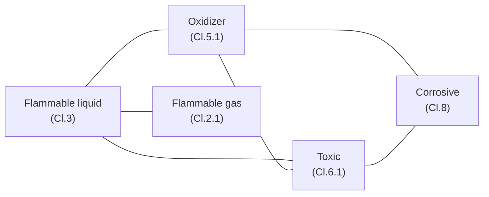
*Sơ đồ: đồ thị tương kỵ — mỗi cạnh là một cặp KHÔNG được chung khu. Tam giác F–O–T buộc cần ≥3 màu (tự vẽ, ma trận tương kỵ kiểu IMDG rút gọn).*

> [!IMPORTANT] 📐 Công thức — Tô màu đồ thị & chặn trên Welsh–Powell
> Số khu cách ly tối thiểu $=\chi(G)$ — **sắc số** của đồ thị tương kỵ $G$: số màu ít nhất để hai đỉnh kề nhau (tương kỵ) không cùng màu (cùng khu).
> **Tính tay:** ba lớp F, O, T đôi một tương kỵ tạo một *tam giác* → cần ≥3 màu. Một cách tô hợp lệ với đúng 3 khu:
> - **Khu 1:** Flammable liquid + Corrosive (không kề nhau).
> - **Khu 2:** Oxidizer + Flammable gas.
> - **Khu 3:** Toxic.
> Vậy $\chi(G)=\mathbf{3}$. **Chặn trên Welsh–Powell (1967):** $\chi(G)\le\Delta(G)+1$ với $\Delta$ là bậc lớn nhất; ở đây $\Delta=3$ nên $\chi\le4$, và heuristic tham lam (sắp đỉnh theo bậc giảm dần) tìm ra đúng 3 màu. *Bài toán tổng quát là NP-hard (Karp 1972)* — với hàng chục lớp phải dùng ILP hoặc metaheuristic; nhưng bài kho thực tế thường nhỏ và giải tay/vét cạn được.

##### g.3 — Part 3: Kho ngoại quan — NPV hoãn thuế và ngưỡng hòa vốn

Dùng đúng ví dụ Richards: kim ngạch nhập £20 triệu/năm, thuế 4,5% → $D=£900.000$. Hai đòn bẩy: *hoãn thuế* (giữ tiền thêm $t$ năm) và *tránh thuế nhờ tái xuất* (phần $f$ không bao giờ nộp).

> [!IMPORTANT] 📐 Công thức — Lợi ích kho ngoại quan & breakeven
> $$B_{\text{hoãn}} = D\left[1-(1+r)^{-t}\right] \approx D\cdot r\cdot t \qquad B_{\text{tái xuất}} = f\cdot D$$
> Lập kho ngoại quan đáng làm khi $B_{\text{hoãn}}+B_{\text{tái xuất}} > C_{\text{bond}}$ (phí vận hành chế độ ngoại quan/năm).
> **Tính tay** với $r=10\%$/năm, $t=0{,}25$ năm (lưu bình quân 3 tháng), $f=30\%$ tái xuất, $C_{\text{bond}}=£60.000$:
> - $B_{\text{hoãn}}=900.000\,[1-1{,}10^{-0{,}25}]=£21.191$ (xấp xỉ tuyến tính $D r t=£22.500$).
> - $B_{\text{tái xuất}}=0{,}30\times900.000=£270.000$ — *đòn bẩy lớn hơn hẳn deferral*.
> - Tổng lợi ích $=£291.191$; trừ phí $£60.000$ → **NET $=+£231.191$** → nên lập kho ngoại quan.
> - **Breakeven tỷ lệ tái xuất** (chỉ tính đòn tránh thuế): $f^\star=C_{\text{bond}}/D=60.000/900.000=\mathbf{6{,}67\%}$ — chỉ cần >6,67% hàng tái xuất là kho ngoại quan đã hòa vốn.

> [!NOTE] 💻 Góc Khoa học dữ liệu — Lab lưu trữ đặc thù (đã verify)
> Code tĩnh, `python lab_m06_specialized_storage.py`. Output khớp tính tay ở cả ba Part.
> ```python
> import math
> from itertools import product
> # PART 1a - Q10 shelf-life consumption
> L0, Tref, Q10 = 100.0, 5.0, 3.0
> shelf = lambda T: L0 * Q10 ** (-(T - Tref) / 10.0)
> log = [(20, 5.0), (5, 15.0), (2, 25.0)]
> consumed = sum(d / shelf(T) for d, T in log)          # = 0.53 ; con lai 0.47
> # PART 1b - Mean Kinetic Temperature (Haynes 1971)
> EaR = 10000.0                                          # Ea=83.144 kJ/mol -> Ea/R=10000 K
> TK = [t + 273.15 for t in (0., 10., 20., 30.)]
> s = sum(math.exp(-EaR / T) for T in TK) / len(TK)
> mkt_C = EaR / (-math.log(s)) - 273.15                  # = 20.94 C  (> trung binh 15 C)
> # PART 2 - graph coloring: so khu cach ly = sac so
> edges = [(1,2),(1,3),(2,3),(2,4),(3,4),(1,5)]
> nodes = [1,2,3,4,5]
> chi = next(k for k in range(1, 6)
>            if any(all(c[a]!=c[b] for a,b in edges)
>                   for c in (dict(zip(nodes, t)) for t in product(range(k), repeat=5))))
> # chi = 3
> # PART 3 - kho ngoai quan: NPV hoan thue + tranh thue
> D, r, t, f, C = 900_000., 0.10, 0.25, 0.30, 60_000.
> B_defer = D * (1 - (1 + r) ** (-t))                    # = 21,191
> net = B_defer + f * D - C                              # = 231,191 -> NEN lap bond
> f_break = C / D                                        # = 0.0667
> ```
> **Kết quả máy in ra (trích):**
> ```
> TONG tieu hao tuoi tho = 0.5300 ; TUOI THO CON LAI = 0.4700
> Trung binh SO HOC = 15.00 C ; MEAN KINETIC TEMP = 20.94 C  (MKT >= mean: CO)
> SAC SO chi(G) = SO KHU CACH LY TOI THIEU = 3
> NET (bond - khong bond) = 231,191 -> NEN lap bond ; breakeven tai xuat = 6.67%
> ```

> [!WARNING] 🪤 Giả định & hạn chế của Lab (điều kiện hiệu lực — bậc thạc sĩ)
> - **Q10 coi là hằng số trên cả dải nhiệt.** Thực tế $Q_{10}$ thay đổi theo nhiệt độ và *cơ chế hỏng có thể đổi*: Labuza (1982) chỉ ra khoai tây nghiền sấy giới hạn bởi *ôi dầu* ở nhiệt thường nhưng bởi *sẫm màu Maillard* trên ~40°C. Một $Q_{10}$ duy nhất chỉ đúng trong dải hẹp và một cơ chế trội.
> - **MKT giả định khoảng thời gian đều và một $E_a$ đại diện.** Với log không đều phải dùng dạng có trọng số thời gian $t_i$; $E_a$ khác nhau giữa các phản ứng → MKT chỉ là *xấp xỉ một-phản-ứng-trội*, không thay được thử nghiệm ổn định thực.
> - **Tô màu đồ thị bỏ qua sức chứa & cấp độ tương kỵ.** Mô hình chỉ hỏi "tách hay không"; thực tế ma trận IMDG có nhiều *mức* (away/separated/separated by compartment) và mỗi khu có *trần sức chứa* (ngưỡng COMAH) → bài đầy đủ là *tô màu có ràng buộc dung lượng* (bin packing + conflict), khó hơn nhiều.
> - **NPV hoãn thuế giả định $r,t,f$ tất định.** $t$ (thời gian lưu) và $f$ (tỷ lệ tái xuất) thực ra *ngẫu nhiên và nội sinh* theo nhu cầu thị trường; phí $C_{\text{bond}}$ (bảo lãnh, AEO, hệ thống) có phần cố định lớn → quyết định đúng cần phân phối của $t,f$, không chỉ giá trị kỳ vọng.

#### h. Thực thi: SOP gộp cho bốn chế độ đặc thù

> [!TIP] 🛠️ Quy trình thực thi (SOP) lưu trữ đặc thù
> **Chuỗi lạnh:**
> 1. Kiểm nhiệt hàng *khi nhận* và *khi giao*; từ chối lô vượt dải; ghi log nhiệt theo ca.
> 2. Giữ toàn vẹn tại bến bằng dock seal + air curtain; cấp đông/ủ nhiệt tách khỏi khu lưu.
> 3. Xoay vòng FIFO theo date code; cách ly ngay hàng hỏng để không đi tiếp xuống chuỗi.
> 4. Quét nhiệt ảnh vỏ kho định kỳ; đánh giá rủi ro amoniac/ATEX; báo động chống nhốt người.
>
> **Hàng nguy hiểm:**
> 5. Phân loại theo CLP/GHS; tra *ma trận tương kỵ* → gán khu cách ly (đừng gán theo từng món).
> 6. Có SDS cho mọi chất; dán nhãn đúng lớp; đê bao chống tràn cho mỗi khu.
> 7. Canh ngưỡng COMAH về sức chứa; đào tạo COSHH; chứng từ nguy hiểm khi xuất.
>
> **Hàng giá trị cao:**
> 8. Lưu trong lồng khóa/carousel an ninh; cycle count hằng tháng (dễ hao hụt).
> 9. Phòng vệ nhiều lớp: rào–cổng–CCTV (có người xem)–tuần tra–khám ra/vào; siết khâu bến & nội bộ.
>
> **Kho ngoại quan:**
> 10. Đạt AEO + hệ quản lý thuế nối hải quan; tách kế toán hàng treo thuế.
> 11. Theo dõi đích đến (nội địa vs tái xuất) để áp đúng nghĩa vụ; tuyệt đối không để rò ra thị trường nội khi chưa nộp thuế.

#### i. Case study từ sách & cập nhật thực tế

> [!CAUTION] 📦 CASE STUDY — Kho lạnh tự động ở −27/−28°C: mật độ lưu mua bằng năng lượng
> **Bối cảnh:** Fredericks Dairies — nhà sản xuất kem hàng đầu Anh — cần ≥13.000 vị trí pallet trong môi trường **−28°C**, di chuyển 600 pallet/ca 8 giờ, trong giới hạn kích thước công trình ngặt (Richards ch.1). **Diễn biến:** giải pháp RediRack dùng kho pallet tự động + đệm/định tuần tự, đạt **13.500 vị trí**, tăng mật độ lưu tới **90%** và giảm chi phí vận hành tương ứng; cùng sức chứa nhưng *giảm 45% diện tích nền* khi xây mới. Kho đông lạnh lớn nhất Anh khi đó (Partner Logistics, Wisbech, 2010) chứa **77.000 pallet** ở **−27°C** nhờ giá kệ drive-in. **Bài học:** trong kho lạnh, *mật độ lưu không chỉ là tiết kiệm diện tích mà là tiết kiệm năng lượng* — khối hàng đặc giúp giữ lạnh, giảm thể tích phải làm lạnh. Đây là minh họa sống động cho nguyên lý §a: ràng buộc năng lượng (ngoài-không-gian) định nghĩa lại lựa chọn giá kệ.

> [!NOTE] 🌐 Quy mô tổn thất chuỗi lạnh dược & trộm cắp hàng hóa (cập nhật)
> - **Chuỗi lạnh dược:** ngành dược mất khoảng **35 tỷ USD/năm** do hỏng hóc logistics kiểm soát nhiệt (IQVIA Institute, dẫn lại 2024); khoảng **12%** lô dược vẫn gặp lệch nhiệt, và WHO ước tới **50%** vắc-xin bị hỏng mỗi năm do đứt chuỗi lạnh (WHO/Veratrak, 2024). Thị trường logistics chuỗi lạnh ~**436 tỷ USD** (2025), CAGR ~13% (báo cáo thị trường, 2025). Hàm ý: với hàng $Q_{10}$ cao, đầu tư giám sát nhiệt thời gian thực có ROI rõ rệt.
> - **Trộm cắp hàng hóa:** 2024 ghi nhận **3.625 vụ** ở Mỹ–Canada (**+27%** so với 2023), giá trị bình quân mỗi vụ **202.364 USD** (CargoNet/Verisk, 2024); mục tiêu mới gồm đồng, điện tử tiêu dùng, mỹ phẩm, thực phẩm cao cấp. Hàm ý: bài toán EMV an ninh ở §d không phải lý thuyết — xác suất $p$ và tổn thất $L$ đều đang tăng.

#### j. Insight tổng hợp & liên kết chéo

> [!IMPORTANT] 💡 INSIGHT 1 (xuyên mục) — Một nguyên lý, bốn lớp toán: "ràng buộc ràng buộc định nghĩa lại bài toán"
> Bốn chế độ đặc thù trông rời rạc — lạnh, nguy hiểm, đắt, treo thuế — nhưng cùng tuân một meta-nguyên lý: **mỗi chế độ là một ràng buộc cứng ngoài-không-gian, và việc *thỏa mãn* ràng buộc đó đẩy điểm tối ưu sang một miền mới**. Điều đẹp về mặt trí tuệ là *cùng một meta-nguyên lý ánh xạ vào bốn nhánh toán khác hẳn*: chuỗi lạnh → **động học/giải tích** (Arrhenius, tích phân tiêu hao, MKT lồi); hazmat → **tổ hợp** (tô màu đồ thị, NP-hard); giá trị cao → **xác suất/quyết định** (EMV rủi ro); ngoại quan → **tài chính** (giá trị thời gian của tiền). Đây chính là tinh thần Thang độ sâu (d): nhiều hiện tượng rời rạc cùng một quy luật — và quy luật ở đây là *"tìm ràng buộc đang ràng buộc, thỏa mãn nó trước, rồi mới tối ưu phần còn lại"*, đúng tư duy Theory of Constraints của Goldratt ([M1](01-chien-luoc-rui-ro.md)).

> [!IMPORTANT] 💡 INSIGHT 2 (gắn bối cảnh thực chiến của bạn) — Chuỗi lạnh, ngoại quan và Control Tower cho FMCG
> Với nền **Toán kinh tế** và kinh nghiệm xây *Control Tower / Visibility* và giải pháp **DRP** cho FMCG (Mondelez, TTC Agrifood), mục này gắn trực tiếp vào việc của bạn:
> - **MKT là một KPI visibility, không phải chỉ số phòng QA.** Nếu Control Tower của bạn cho hàng mát/đông chỉ hiển thị "nhiệt độ hiện tại", nó *che* rủi ro tích lũy. Hiển thị **MKT và % tuổi thọ đã tiêu hao** (Lab §g.1) biến mỗi excursion thành một con số tài chính — đúng ngôn ngữ C-level: "lô này đã đốt 53% tuổi thọ, ưu tiên đẩy đi trước".
> - **Date code + Q10 → logic phân bổ DRP có ý thức tuổi thọ.** Trong mạng DRP FMCG, phân bổ hàng cận date về DC gần khách (bán nhanh) thay vì DC xa là một quyết định *shelf-life-aware* — chính là Q10 đưa vào hàm phân bổ.
> - **Kho ngoại quan là một đòn bẩy C2C cho FMCG nhập khẩu.** Nguyên liệu/thành phẩm nhập khẩu treo thuế trong bond rút ngắn nhu cầu vốn lưu động (nối DIO/C2C ở [M8](08-finance-scm.md)) — một đòn bẩy tài chính mà người làm vận hành thuần thường bỏ lỡ.

> [!NOTE] 🔗 Liên kết chéo
> - [§6.1.1 — Động lực học dòng chảy kho](#611-động-lực-học-dòng-chảy-kho-receiving--put-away--storage--picking--despatch): toàn vẹn nhiệt tại bến = một ràng buộc thêm lên dock scheduling; di trú nhiệt là dạng "rò" ở giao diện trong–ngoài.
> - [§6.2 — Thiết kế Layout, Không gian & Thiết bị](#62-thiết-kế-layout-không-gian--thiết-bị): drive-in & mobile racking là lựa chọn mật độ cao điển hình cho kho lạnh.
> - [§6.3.3 — An toàn, PCCC, Bảo trì MHE & 5S](#633-an-toàn-pccc-bảo-trì-mhe--5s): phân cấp kiểm soát hazmat & an ninh nhiều lớp dùng đúng mô hình Swiss Cheese (Reason).
> - [§6.4.1 — Xử lý hàng hoàn](#641-xử-lý-hàng-hoàn-trong-dc-returns-processing): căng thẳng responsive/efficient theo độ dốc suy giảm đối xứng với Q10/MKT ở đây.
> - [§6.5 — Tối ưu hóa kho bằng LP](#65-tối-ưu-hóa-kho-bằng-quy-hoạch-tuyến-tính-liu-ch7-pulp): bài cách ly có sức chứa là ILP/bin-packing-with-conflict.
> - [M4 — Tối ưu tồn kho](04-toi-uu-ton-kho.md): tập trung hóa theo value density & risk pooling (Eppen).
> - [M7 — Vận tải & mạng lưới](07-transportation-network.md): xe đa khoang nhiệt độ; chứng từ hải quan & hàng nguy hiểm khi vận chuyển.
> - [M8 — Tài chính SCM](08-finance-scm.md): hoãn thuế ngoại quan như đòn bẩy C2C/vốn lưu động.
> - [M10 — Logistics xanh](10-green-logistics.md): năng lượng kho lạnh & chất làm lạnh (Montreal/GWP) là điểm nóng phát thải.

## 📚 Nguồn

**Sách (nền chính):**
- Richards, G. *Warehouse Management* — ch.1 (*Specialized warehousing*: kho ngoại quan do Mike Hodge & G. Richards, kho lạnh do Chris Sturman; ví dụ nhập xe nâng, Fredericks Dairies, Partner Logistics), ch.4–5 (kiểm soát chất lượng & lưu vị trí hàng nguy hiểm/giá trị cao, lồng khóa/carousel), ch.7 (an ninh, cycle counting theo giá trị), ch.13 (biểu mẫu audit: an toàn hazmat, COSHH/COMAH).
- Rushton, A., Croucher, P. & Baker, P. *The Handbook of Logistics & Distribution Management* — ch.8 (phân khúc theo *temperature regime* & *value density*, dẫn Lovell–Saw–Stimson 2005), ch.15 (phân loại kho theo loại hàng), ch.16 (powered mobile racking trong kho lạnh), **ch.35 (an ninh & an toàn phân phối: C-TPAT/CSI/AMR, tổn thương chuỗi cung ứng Cranfield 2003, biện pháp chiến thuật)**.
- Richards & Grinsted. *Logistics & SC Toolkit* — 1.25 (đóng gói & nhãn hàng nguy hiểm), 2.12 (tính thuế hải quan).

**Lớp học thuật toàn cầu (tầng "vì sao"):**
- Arrhenius, S. (1889) — sự phụ thuộc tốc độ phản ứng vào nhiệt độ; van't Hoff (quy tắc Q10).
- Haynes, J.D. (1971). *Worldwide Virtual Temperatures for Product Stability Testing.* Journal of Pharmaceutical Sciences 60(6), 927–929 — Mean Kinetic Temperature (nền của hướng dẫn ổn định ICH Q1A).
- Labuza, T.P. (1982). *Shelf-Life Dating of Foods* — kiểm định tuổi thọ gia tốc (ASLT), Q10/Arrhenius cho thực phẩm.
- Welsh, D.J.A. & Powell, M.B. (1967). *An Upper Bound for the Chromatic Number of a Graph.* The Computer Journal — tô màu đồ thị, heuristic & chặn trên; Karp, R. (1972) — tô màu NP-hard.
- Eppen, G. (1979). *Effects of Centralization on Expected Costs in a Multi-Location Newsboy Problem.* Management Science — quy luật căn bậc hai (tập trung hóa theo value density).
- Reason, J. (1990). *Human Error* — mô hình Swiss Cheese (phòng vệ nhiều lớp), nền cho an ninh/an toàn chiều sâu.

**Deep research (web, bổ sung):** IQVIA Institute / Veratrak — tổn thất chuỗi lạnh dược ≈ 35 tỷ USD/năm, ~12% lô lệch nhiệt; WHO — tới 50% vắc-xin hỏng do đứt chuỗi lạnh; báo cáo thị trường chuỗi lạnh 2025 (~436 tỷ USD). CargoNet/Verisk — *2024 cargo theft*: 3.625 vụ (+27%), bình quân 202.364 USD/vụ.

*Lab: `assets/scripts/lab_m06_specialized_storage.py` (Python thuần, dữ liệu tĩnh, verify khớp tính tay ở cả ba Part).*

### 6.4.3. Đóng gói cuối dòng & Yard Management ✅

> **Nguyên tắc biên soạn & quy ước trình bày:**
> - **Nền chính = sách thực hành** (Richards, *Warehouse Management* ch.7 — *Despatch: packing, loading, shipping* và *yard management system*; Rushton/Croucher/Baker, *Handbook* ch.19 — *Receiving and dispatch*, ch.15 — *Packaging and unit loads*). Đây là lớp "what/how": trạm đóng gói, chèn lót, kiểm trọng lượng, dàn hàng (marshalling), điều phối sân.
> - **Lớp học thuật toàn cầu (tầng "vì sao" bậc sau-đại học):** bài toán xếp thùng ba chiều (**Martello, Pisinger & Vigo 2000**), độ khó NP-hard của bin packing và heuristic First-Fit Decreasing (**Garey & Johnson 1979**; **Johnson 1973** — cận tiệm cận 11/9), bài toán cắt vật liệu & chọn bộ cỡ chuẩn (**Gilmore & Gomory 1961**), định luật dòng chảy cho sân bãi (**Little 1961**), lập lịch xe tại cross-dock (**Boysen & Fliedner 2010**). Tra `references/canon-map-scm.md` (hàng *Đóng gói/cartonization* và *Hàng đợi / định cỡ bến–trạm*).
> - **Lý thuyết viết dày, giọng giáo trình**; **deep research (web) chỉ BỔ SUNG** trong khối 🌐.

---

#### 📌 Bốn lăng kính trong mục 6.4.3

> Đây là mục "cuối dòng" — nơi hàng rời kho. Nó có **hai nửa** với trọng tâm khác nhau. Nửa *đóng gói* nặng **Thực thi** (thao tác trạm pack) nhưng lõi *vì sao* lại là một bài toán **Toán & Data** đẹp: cartonization = bin packing. Nửa *sân bãi* (yard) nặng **Hoạch định** (điều phối trailer–gate theo lịch) và nối thẳng vào lý thuyết hàng đợi đã dựng ở [§6.1.1](#611-động-lực-học-dòng-chảy-kho-receiving--put-away--storage--picking--despatch). Chiến lược xuất hiện ở chỗ cả hai nửa đều là *đòn bẩy chi phí vận tải* — cube đóng gói quyết cước, dwell sân bãi quyết vòng quay tài sản.

| Lăng kính | Mức nhấn | Thể hiện ở đâu |
|---|---|---|
| 🛠️ **Thực thi** | ●●● Trọng tâm | §b (trạm pack, chèn lót, kiểm cân-cube), §d (marshalling, gate, shunt driver), §e (SOP đóng gói + SOP xuất hàng) |
| 📐💻 **Toán & Data** | ●●● Trọng tâm | §c (bản đồ bài toán), §f (Lab: bin packing MILP+FFD, chọn bộ cỡ thùng, Little's Law cho sân) |
| 🧭 **Hoạch định** | ●● Bổ trợ | §d (hệ appointment & cửa-trailer), §f Part 3 (định cỡ chỗ đỗ & pool trailer), nối dock scheduling §6.1.1 |
| 🎯 **Chiến lược** | ●● Bổ trợ | §a (cube là vua → cước; đồng hồ tài sản), §b.4 (DIM weight → void fill = trả tiền cho không khí), §d (YMS = xóa vùng mù), §h |

#### a. Bản chất: hai "cổ chai cuối dòng" và ba nguyên lý bất biến chi phối chúng

Mọi quy trình trước đây trong chương đưa hàng *vào* và *quanh* kho. Mục này nói về khoảnh khắc hàng **rời** kho — và đó là nơi tích tụ hai điểm nghẽn ít được chú ý nhưng đắt đỏ. Thứ nhất là **đóng gói cuối dòng (end-of-line packing / pack-out):** biến tập hợp *đơn vị nhặt* (eaches, pieces) thành một *đơn vị vận chuyển* hoàn chỉnh — thùng đã đóng, chèn lót, dán nhãn, có chứng từ. Thứ hai là **quản lý sân bãi (yard management):** biến một *kho tĩnh* bên trong tường thành một *dòng xe động* bên ngoài tường — trailer ra vào, đỗ chờ, ghép cửa, được kéo đi đúng lịch.

Trước khi mô tả SOP (hệ quả), cần nêu **vật lý nền** (nguyên lý bất biến) chi phối cả hai cổ chai này. Quy trình cụ thể chỉ là cách con người thích ứng với ba quy luật sau; nắm quy luật thì chẩn đoán được bất kỳ hệ thống pack-out hay sân bãi mới nào.

> [!IMPORTANT] 🔑 Khái niệm cốt lõi — Ba nguyên lý bất biến của khâu cuối dòng
> 1. **"Cube là vua" (cube dominates, not weight).** Với phần lớn hàng tiêu dùng hiện đại (nhẹ tương đối so với kích thước), **chi phí vận chuyển bị chi phối bởi *thể tích* chứ không phải khối lượng**: một xe tải/parcel "đầy khối" trước khi "đầy tải". Hệ quả: mỗi *cm³ khoảng trống* (void) trong thùng là không gian phải trả cước mà không sinh doanh thu. Đây là lý do toàn bộ bài toán chọn thùng (§c, §f) tồn tại, và là gốc của cơ chế **DIM weight** (§b.4).
> 2. **"Bến là một hàng đợi" (the dock is a queue).** Xe đến sân theo nhịp *biến thiên*; số cửa/đội bốc là *hữu hạn*. Mọi hiện tượng tắc sân, xe chờ, dwell dài đều là biểu hiện của một hệ phục vụ — đúng lý thuyết hàng đợi đã giải ở [§6.1.1](#611-động-lực-học-dòng-chảy-kho-receiving--put-away--storage--picking--despatch). Sân bãi chỉ là *cùng một hàng đợi đó nhìn từ phía ngoài tường*.
> 3. **"Đồng hồ tài sản" (the asset clock).** Một trailer đỗ trong sân, một cửa bị chiếm, một lô hàng nằm chờ ở khu dàn (marshalling) đều là *vốn bị giam* và *năng lực bị khóa*. Mỗi giờ dwell là chi phí cơ hội — đúng tinh thần *giá trị cận biên của thời gian* (MVT) đã gặp ở hàng hoàn [§6.4.1](#641-xử-lý-hàng-hoàn-trong-dc-returns-processing), và đúng Little's Law: tài sản nằm chờ = WIP, mà WIP = λ × W.

##### a.1 — Vì sao pack-out là một điểm hợp lưu (touch point) đắt

Đóng gói là khâu mà *nhiều dòng giá trị hội tụ về một thao tác thủ công*: sản phẩm đã nhặt, vật liệu bao bì, nhãn vận chuyển, chứng từ, và quyết định chọn thùng — tất cả gặp nhau tại trạm pack. Richards (ch.7) chỉ ra một đánh đổi căn bản: nếu người nhặt đóng gói luôn tại chỗ thì *giảm số touch point* nhưng *kéo họ rời nhiệm vụ chính là nhặt*; nếu tách trạm pack riêng thì chuyên môn hóa được nhưng thêm một lần chạm hàng. Mỗi lần chạm là lao động sống — và lao động chiếm 45–50% chi phí kho (Rushton ch.15), trong đó *nhặt và đóng gói* gộp lại là phần lớn nhất. Vì thế pack-out không phải việc vặt cuối ngày; nó là một trong những khâu thâm dụng lao động nhất, và là nơi *quyết định chọn thùng sai sẽ nhân lên thành chi phí cước suốt phần đời còn lại của kiện hàng*.

##### a.2 — Vì sao sân bãi là "vùng mù" (blind spot) của chuỗi

Hầu hết hệ thống (WMS, TMS) "nhìn thấy" hàng khi nó *trong kho* hoặc *trên đường*, nhưng đánh mất dấu vết trong khoảng giữa: lúc hàng đã rời cửa kho nhưng trailer còn nằm trong sân. Khoảng này — gồm xe chờ ở cổng, trailer đỗ chờ kéo, lô hàng nằm ở khu dàn — là nơi *không có ai nắm trạng thái theo thời gian thực* nếu thiếu công cụ chuyên trách. Richards mô tả đúng triệu chứng: cần "tăng khả năng nhìn thấy trailer, giảm tắc nghẽn và chậm trễ". Đó là lý do tồn tại của **hệ quản lý sân bãi (YMS)** — về bản chất là *kéo dài tầm nhìn của WMS ra ngoài bốn bức tường*, để đồng hồ tài sản (nguyên lý 3) không chạy âm thầm ngoài tầm kiểm soát.

#### b. Đóng gói cuối dòng: ba tầng bao bì, trạm pack, chèn lót, kiểm cân-cube

##### b.1 — Ba tầng bao bì và khái niệm "đơn vị tải" (unit load)

Trước khi chọn thùng phải hiểu *bao bì có nhiều tầng*, vì mỗi tầng phục vụ một mục đích khác và khách có thể đặt hàng ở bất kỳ tầng nào (Rushton ch.15). Đây là nền để hiểu vì sao "đóng gói" không phải một hành động đơn lẻ mà là một *chuỗi lồng nhau*.

- **Bao bì sơ cấp (primary):** lớp trực tiếp ôm sản phẩm (vỏ hộp một chai dầu gội). Bảo vệ, chứa đựng, truyền thông tin tới người dùng cuối.
- **Bao bì thứ cấp (secondary):** gom nhiều primary thành một *case/carton* (thùng 12 chai). Đây là đơn vị nhặt phổ biến nhất.
- **Bao bì cấp ba / vận chuyển (tertiary):** gom case lên *pallet*, rồi pallet có thể vào *container ISO* để xuất khẩu. Phục vụ vận chuyển–lưu trữ–bốc xếp.

Sợi chỉ xuyên suốt là **khái niệm đơn vị tải (unit load):** chuỗi cung ứng được thiết kế quanh những *mô-đun chuẩn* (pallet, case, tote) để hệ vận chuyển–lưu trữ–thiết bị dùng chung kích thước (Rushton ch.15). Pallet là đơn vị tải quan trọng nhất: Europallet 1.200×800 mm, pallet Anh/Mỹ 1.200×1.000 mm (≈48×40 inch). Bên cạnh pallet còn có *cage/box pallet* (chống rơi), *roll-cage* (giao bán lẻ), *tote bin* (hàng nhỏ, điển hình 600×400×300 mm), *dolly* (đế có bánh), và *IBC* (Intermediate Bulk Container — chở chất lỏng/hạt 1–2 tấn). Nguyên lý chung đằng sau cả danh sách này: **chuẩn hóa kích thước để giảm bậc tự do của bài toán bốc xếp** — mỗi mô-đun chuẩn là một "viên gạch" có kích thước biết trước, biến bài toán xếp dỡ hỗn loạn thành bài toán xếp khối hình học giải được (đây chính là tiền đề để cartonization ở §c có nghĩa).

##### b.2 — Trạm đóng gói: chọn thùng, dựng thùng tự động, chèn lót

Sau khi hàng được nhặt vào tote hay pick container, tại trạm pack diễn ra một chuỗi quyết định. **Quyết định trung tâm là chọn cỡ thùng (carton)** sao cho hàng vừa khít: thùng quá to thì phải chèn nhiều và trả cước cho khoảng trống; thùng quá nhỏ thì không đóng được. Để khử khoảng trống, hai họ công cụ:

- **Vật liệu chèn lót (void fill / dunnage):** xốp polystyrene, hạt foam, giấy vụn, giấy gấp sóng (corrugated), túi khí (air-filled bags) — lấp khoảng trống để hàng không xê dịch và không vỡ khi va đập (Richards ch.7). Nhược điểm: tốn thời gian ở trạm, đẩy gánh nặng *xử lý rác bao bì* sang khách (nối [M10](10-green-logistics.md) và §6.4.1 về bao bì tái chế), và **không khử được cước cho khoảng trống** (xem §b.4).
- **Máy dựng thùng theo kích thước (carton erector / right-sizing machine):** cắt và gấp carton *vừa khít với nội dung* thay vì dùng vài cỡ cố định (Richards ch.7). Đây là cách *triệt tiêu void tận gốc* thay vì lấp nó. Đánh đổi rất rõ ràng: **chi phí máy so với chi phí lao động + vật liệu chèn + cước cho không khí**. Máy right-sizing chính là "lời giải phần cứng" cho bài toán cartonization ở §f — khi mỗi đơn được một thùng riêng vừa khít, void → 0.

##### b.3 — Kiểm trọng lượng & kiểm cube (weight-cube check): một kiểm soát chất lượng định lượng

Một kỹ thuật kiểm tra sai sót *không cần mở thùng* là **cân–đối chiếu trọng lượng (weight check):** cân kiện đã đóng rồi so với *trọng lượng hệ thống tự tính* từ danh mục sản phẩm trong đơn (Richards ch.7). Nếu lệch quá ngưỡng → có thể thiếu/thừa/nhầm món → tách ra kiểm tay. Cùng họ với nó là **kiểm kích thước (dimension check):** Rushton (ch.19) mô tả pallet chạy qua thiết bị quang điện phát hiện phần nhô ra ngoài giới hạn, pallet không đạt bị đẩy sang nhánh sửa.

Vì sao kỹ thuật này mạnh? Vì nó biến kiểm tra chất lượng từ *thủ công, toàn số* thành *tự động, dựa trên một bất biến vật lý* (khối lượng/kích thước là tổng cộng được). Richards nhấn mạnh điều kiện hiệu lực: nó chỉ đáng tin khi *dữ liệu khối lượng trong hệ chính xác 100%* — nếu master data sai thì cân đối chiếu tạo ra báo động giả hàng loạt. Đây cũng là *điều kiện biên* của kỹ thuật: nó thay thế kiểm 100% chỉ khi độ chính xác nhặt đủ cao. Richards nêu ngưỡng thực hành: đội nhặt đạt >99,9% chính xác thì chỉ cần kiểm ngẫu nhiên; khi độ chính xác tụt thì tăng kiểm *tạm thời* kèm tăng đào tạo. Logic nền là một đánh đổi chi phí: *"không có lý gì chi 20.000£/năm cho một người kiểm để tiết kiệm 3.000£ mất do nhặt sai"* (Richards ch.7).

##### b.4 — DIM weight: vì sao void fill khiến bạn "trả tiền cho không khí"

Đây là điểm nối nửa đóng gói với kinh tế vận tải, và là lý do "cube là vua" (nguyên lý 1) có răng. Các hãng chuyển phát không tính cước thuần theo cân nặng thực, mà theo **trọng lượng tính cước (billed weight) = max(trọng lượng thực, trọng lượng quy đổi thể tích)**. Trọng lượng quy đổi (**DIM weight**) lấy thể tích kiện chia cho một *số chia quy ước (dim divisor)*.

> [!IMPORTANT] 📐 Công thức — Trọng lượng quy đổi thể tích (DIM weight)
> $$W_{\text{DIM}} = \frac{L \times W \times H}{\text{dim divisor}}, \qquad W_{\text{billed}} = \max\big(W_{\text{thực}},\, W_{\text{DIM}}\big)$$
> - $L\times W\times H$: kích thước ngoài của kiện. Số chia quy ước (dim divisor) tùy hãng/tuyến — ví dụ phổ biến **5.000 cm³/kg** (quốc tế) hay **139 in³/lb** (nội địa Mỹ).
> - **Minh họa số:** một kiện 40×30×30 cm = 36.000 cm³, hàng nhẹ thực **2 kg**. $W_{\text{DIM}} = 36.000/5.000 = 7{,}2$ kg. Cước tính trên **7,2 kg** chứ không phải 2 kg — bạn trả cho *thể tích*, gần hết là không khí trong thùng.
> - **Hệ quả thiết kế:** giảm kích thước thùng (right-sizing) cắt thẳng vào $W_{\text{DIM}}$ → cắt cước. Đây là biện minh tài chính cho máy carton erector và cho bài toán cartonization.

> [!NOTE] 🌐 Right-sizing và áp lực DIM weight trong thương mại điện tử
> Khi các hãng chuyển phát siết dim divisor (giảm số chia ⇒ tăng trọng lượng quy đổi cho cùng một kích thước), chi phí cho mỗi cm³ khoảng trống tăng lên, đẩy nhiều nhà bán lẻ điện tử đầu tư máy đóng gói right-sizing / on-demand để cắt thùng vừa khít từng đơn (nguồn: Web — tổng hợp tài liệu ngành chuyển phát; số chia cụ thể tra biểu cước hãng tại thời điểm áp dụng). *Số liệu cước cụ thể thay đổi theo hãng và năm — luôn tra biểu cước hiện hành trước khi tính.*

#### c. Góc Toán tối ưu — bản đồ bài toán ẩn ở pack-out & sân bãi

Như mọi mục vận hành, đằng sau các SOP "cuối dòng" là một họ bài toán tối ưu kinh điển. Bảng dưới ánh xạ từng khâu sang lớp toán và nơi giải — để thấy pack-out và yard không phải việc tay chân thuần túy mà là các *instance* của những bài toán đã được nghiên cứu sâu.

| Khâu cuối dòng | Bài toán tối ưu | Lớp toán / phương pháp | Nơi giải |
|---|---|---|---|
| Chọn thùng cho 1 đơn (cartonization) | Xếp món vào số thùng ít nhất / vừa khít | **Bin Packing (1D/3D-BPP)** — NP-hard | §f Part 1 (MILP + FFD); Martello–Pisinger–Vigo 2000 |
| Chọn *bộ cỡ thùng* để tồn (assortment) | Chọn K cỡ chuẩn tối thiểu void+phức tạp | **Cutting-stock / assortment** | §f Part 2 (MILP chọn K); Gilmore–Gomory 1961 |
| Xếp hàng lên pallet/container | Tối ưu cube + chịu lực + ổn định | 3D packing / container loading | Phần mềm (Cubemaster…), §b.2 |
| Gán trailer ↔ cửa xuất | Cửa nào cho lô nào để quãng dàn ngắn | **Assignment / cross-dock scheduling** | nối [§6.1.4](#614-cross-docking-chuyên-sâu); Boysen–Fliedner 2010 |
| Lịch hẹn xe ra–vào (appointment) | Rải nhịp đến để giảm tắc cổng | **Queueing / scheduling** | nối [§6.1.1](#611-động-lực-học-dòng-chảy-kho-receiving--put-away--storage--picking--despatch); §f Part 3 |
| Định cỡ chỗ đỗ & pool trailer | Bao nhiêu chỗ đỗ / trailer dự phòng | **Little's Law / fluid model** | §f Part 3; Little 1961 |

> [!IMPORTANT] 💡 INSIGHT — Cartonization là "slotting nhìn từ phía ra", và cùng một định lý NP-hard chi phối cả hai
> Ở [§6.1.3](#613-tối-ưu-vị-trí-xếp-hàng-slotting-bằng-cube-per-order-index-coi) ta gán *SKU vào ô kệ* để tối thiểu quãng nhặt (slotting/QAP). Ở đây ta gán *món vào thùng* để tối thiểu không gian/cước. Cả hai đều là bài toán **gán rời rạc dưới ràng buộc không gian**, và cả hai đều **NP-hard** (Garey & Johnson 1979): không có công thức đóng cho nghiệm tối ưu, phải dùng MILP (bài nhỏ) hoặc heuristic (bài lớn, thời gian thực ở trạm pack). Nhận ra điều này giải phóng tư duy: kỹ thuật bạn học để slotting (mật độ, phân lớp, heuristic tham lam) *chuyển thẳng* sang cartonization. Đó là sức mạnh của việc nhìn vận hành qua lăng kính lớp-bài-toán thay vì qua tên-quy-trình.

#### d. Yard Management: dàn hàng, ghép cửa, gate, hệ appointment

##### d.1 — Dàn hàng (marshalling) và trật tự xếp đảo ngược

Sau khi đóng gói, hàng cho mỗi xe được *gom về một khu dàn (marshalling area)* gắn với từng cửa xuất, theo lịch xe đi (Rushton ch.19). Một thực hành tinh tế: **xếp theo trật tự giao đảo ngược** — *điểm giao cuối cùng được xếp lên xe đầu tiên*, để khi giao thì hàng của điểm đầu nằm ngoài cùng, dỡ ra trước (Richards ch.7). Đây là một *quy tắc LIFO áp cho không gian xe tải*, biến thứ tự bốc xếp thành hệ quả trực tiếp của lộ trình giao (nối VRP/định tuyến ở [M7](07-transportation-network.md)).

Để dàn hàng có kỷ luật, nhiều kho **kẻ lưới trên sàn khu xuất** mô phỏng diện tích sàn của xe lớn nhất: ví dụ kho pallet công nghiệp Anh kẻ lưới 26 pallet, kho dùng euro-pallet mở rộng tới 36 pallet (Richards ch.7). Lưới biến một không gian trống thành *bản đồ vị trí* để hàng đứng đúng chỗ, đúng xe, đúng thứ tự. Rushton (ch.19) lưu ý phối hợp chặt để lô chờ thu không *chiếm chỗ khu dàn lâu hơn cần thiết* — lại là đồng hồ tài sản (nguyên lý 3).

##### d.2 — Drop-trailer, swap-body và shunt driver: tách rời bốc xếp khỏi vận chuyển

Một ràng buộc khó của xuất hàng: *phần lớn xe phải rời kho cùng một khung giờ*, tạo đỉnh tải dữ dội ở khu xuất. Lời giải kinh điển là **tách thao tác bốc khỏi thao tác chạy:** dùng nhiều **trailer/swap-body hơn số đầu kéo (tractor)**, *pre-load* (đóng sẵn) các trailer trong những giờ trước hạn xuất, để đầu kéo chỉ việc đến móc và đi (Rushton ch.19). Trong sân, người **lái dồn (shunt driver / yard jockey)** chuyên di chuyển trailer giữa cổng, chỗ đỗ và cửa, để tài xế đường dài và đội bốc không phải chờ nhau (Richards ch.7).

Vì sao chiến lược này hiệu quả? Vì nó *làm phẳng đỉnh tải* bằng cách dịch công việc bốc xếp ra khỏi cửa sổ thời gian nghẽn — đúng tinh thần *giảm biến thiên* để hạ hàng chờ (Kingman, đã gặp ở [§6.1.1](#611-động-lực-học-dòng-chảy-kho-receiving--put-away--storage--picking--despatch)). Cái giá là *cần thêm trailer dự phòng* (vốn) — một đánh đổi định lượng được bằng Little's Law ở §f Part 3.

##### d.3 — Cổng (gatehouse) và hệ quản lý sân bãi (YMS)

Sân bãi bắt đầu ở **cổng (gatehouse):** tài xế trình chứng từ, nhân viên kiểm và chỉ dẫn xe tới cửa hoặc bãi đỗ (Rushton ch.19). Với hàng nhập, nếu cửa/container niêm phong thì *số seal phải được đối chiếu* với số người gửi báo, để biết cửa có bị mở trên đường không. Với hàng xuất, tài xế thu hàng cần được gán *cửa gần khu hàng đã gom nhất* — đòi phối hợp chặt giữa cổng và giám sát xuất (Richards ch.7).

Khi quy mô lớn, việc này vượt khả năng điều phối thủ công, và đó là chỗ của **YMS (Yard Management System):** một hệ cải thiện lịch trình ra–vào, *tăng khả năng nhìn thấy* xe và trailer, quản lý cross-docking, giảm tắc và chậm trễ, đảm bảo an toàn–an ninh cho cả xe lẫn người (Richards ch.7). YMS có cả bản độc lập lẫn mô-đun cắm vào WMS/TMS. Bản chất của nó: *lấp đúng "vùng mù" mô tả ở §a.2*.

##### d.4 — Hệ đặt lịch hẹn (appointment / dock booking): kéo dài lý thuyết hàng đợi ra cổng

Công cụ mạnh nhất để thuần hóa sân là **hệ đặt lịch hẹn (appointment system / vehicle booking system):** xe được cấp khung giờ đến thay vì đến tùy ý. Rushton (ch.19) ghi nhận ở phần lớn kho lớn, *"xe vào được đặt lịch trước để phân bổ nguồn lực phù hợp"*.

Đây không phải mẹo hành chính mà là *can thiệp trực tiếp vào biến thiên nhịp đến* — biến số quyết định hàng chờ trong công thức Kingman ở [§6.1.1](#611-động-lực-học-dòng-chảy-kho-receiving--put-away--storage--picking--despatch). Lịch hẹn kéo hệ số biến thiên nhịp đến $C_a^2$ xuống, dịch cả đường cong thời gian chờ $W_q$ xuống dưới *mà không cần thêm cửa*. Nói cách khác: **time-slotting mua được năng lực ảo bằng cách làm phẳng dòng, rẻ hơn xây thêm bến.** Văn liệu cảng container gọi đây là *truck appointment system (TAS)* và cho thấy biết trước giờ đến xe giảm chiều dài hàng chờ ở cổng và số lần đảo bãi (xem khối 🌐).

> [!NOTE] 🌐 Truck Appointment System (TAS) ở cảng container
> Tắc cổng là vấn đề toàn cầu của các cảng container: hàng dài xe chờ chặn cả luồng vào, kéo dài *turn time* và phát thải do xe nổ máy chờ. Nhiều cảng triển khai *gate appointment system* để rải nhu cầu phục vụ theo thời gian; nghiên cứu cho thấy *biết trước thời điểm đến của xe ngoài làm giảm chiều dài hàng chờ tại cổng và tần suất đảo bãi (reshuffling) trong bãi* ([MDPI Sustainability, 2025](https://www.mdpi.com/2071-1050/17/13/5740); [Gate appointment design — ScienceDirect, 2024](https://www.sciencedirect.com/science/article/abs/pii/S1366554524000863)). Cùng nguyên lý với time-slotting bến kho, ở quy mô cảng.

> [!WARNING] 🪤 Điều kiện biên — khi nào appointment & YMS *không* đáng
> - **Lưu lượng thấp / ít cửa:** nếu sân chỉ vài xe/ngày, chi phí quản trị lịch hẹn và license YMS vượt lợi ích — điều phối thủ công đủ. YMS đáng tiền khi *quy mô và biến thiên* đủ lớn để vùng mù gây tổn thất thực.
> - **Lịch hẹn cứng gặp cầu bất định:** nếu giờ đến thực tế lệch xa khung hẹn (kẹt xe, NCC không kỷ luật), lịch hẹn cứng tạo *no-show* và *khe trống* — cần cơ chế *đặt lại lịch động (dynamic rescheduling)* khi thiếu năng lực, nếu không TAS phản tác dụng (nguồn: Web — văn liệu TAS).
> - **Đẩy tắc lên thượng nguồn:** ép NCC vào khung giờ hẹn có thể chỉ *dời* hàng chờ sang sân của họ — phải nhìn tổng thể chuỗi, đúng như bài học cross-dock ở [§6.1.4](#614-cross-docking-chuyên-sâu) ("cross-dock có thể chỉ đẩy tồn kho lên thượng nguồn").

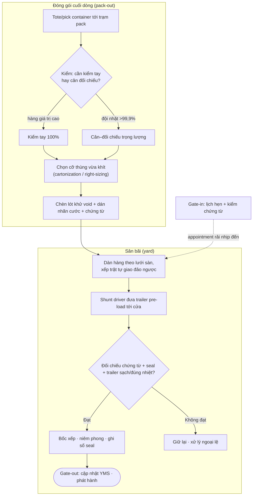
*Sơ đồ: dòng cuối dòng từ trạm pack qua khu dàn ra cổng; lịch hẹn (appointment) bơm nhịp đến đã được làm phẳng vào sân (tự vẽ, tổng hợp Richards ch.7 + Rushton ch.19).*

#### e. Quy trình thực thi (SOP)

> [!TIP] 🛠️ SOP đóng gói cuối dòng (pack-out)
> 1. **Nhận** tote/pick container tại trạm; quét xác nhận đơn.
> 2. **Quyết định mức kiểm** theo độ chính xác nhặt: cân–đối chiếu trọng lượng cho dòng thường; kiểm tay 100% cho hàng giá trị cao/dược phẩm.
> 3. **Chọn cỡ thùng** nhỏ nhất còn chứa vừa (hoặc dựng thùng right-sizing); tránh thừa cỡ để khỏi trả DIM weight cho không khí.
> 4. **Chèn lót** khử void bằng vật liệu *tái chế được* nếu có thể; cân nhắc trách nhiệm rác bao bì của khách.
> 5. **Dán nhãn cước** (từ WMS hoặc hệ hãng UPS/FedEx…) + **chèn chứng từ** (hóa đơn, packing list).
> 6. **Cân lần cuối** ghi nhận trọng lượng thực phục vụ load planning & đối soát cước.

> [!TIP] 🛠️ SOP xuất hàng & sân bãi (despatch + yard)
> 1. **Đặt lịch hẹn** xe ra–vào; cấp khung giờ để rải nhịp đến.
> 2. **Gate-in:** kiểm chứng từ tài xế; với hàng nhập kiểm số seal so với báo trước; chỉ dẫn tới cửa/bãi đỗ.
> 3. **Dàn hàng** theo lưới sàn, *xếp trật tự giao đảo ngược* (giao cuối → bốc đầu).
> 4. **Pre-load** trailer bằng shunt driver trong giờ trước hạn xuất; gán cửa gần khu hàng đã gom.
> 5. **Kiểm trước khi bốc:** trailer sạch, kín nước, không mùi, đúng nhiệt (hàng lạnh), sàn không hỏng.
> 6. **Bốc theo trật tự**, niêm phong, **ghi số seal** vào chứng từ; xử lý vai trò tài xế (ký "unchecked" nếu không chứng kiến bốc, kèm thời hạn báo sai lệch).
> 7. **Gate-out:** cập nhật YMS, phát hành ASN cho khách/điểm nhận hạ nguồn.

#### f. Lab định lượng — bin packing, chọn bộ cỡ thùng, định cỡ sân

Ba phép tính nền của mục này được gom thành một Lab (mã đầy đủ: [`assets/scripts/lab_m06_packing_yard.py`](assets/scripts/lab_m06_packing_yard.py)). Tất cả **dữ liệu tĩnh, dò tay được, đã verify bằng máy** (PuLP + CBC, đồng bộ công cụ với [§6.5](#65-tối-ưu-hóa-kho-bằng-quy-hoạch-tuyến-tính-liu-ch7-pulp)).

##### f.1 — Part 1: Cartonization như bài toán Bin Packing (MILP + heuristic FFD)

> [!IMPORTANT] 📐 Đề bài (dữ liệu tĩnh)
> Một đơn xuất gồm 6 món A–F với thể tích (lít): A=22, B=18, C=15, D=12, E=9, F=6 (tổng **82 L**). Kho dùng **một cỡ thùng chuẩn, thể tích hữu dụng 40 L**. Hỏi: cần **ít nhất bao nhiêu thùng** để đóng hết đơn, và xếp món vào thùng nào?

Đây là **bài toán xếp thùng (Bin Packing Problem – BPP)** ở dạng 1 chiều theo thể tích: chia một tập món có "kích cỡ" vào số *thùng dung lượng cố định* ít nhất. BPP là **NP-hard** (Garey & Johnson 1979) — không có công thức đóng; nhưng với bài nhỏ ta giải tối ưu bằng MILP, và có một cận dưới hiển nhiên.

> [!IMPORTANT] 📐 Mô hình MILP & cận dưới
> Gọi $y_j\in\{0,1\}$ = thùng $j$ có được dùng không; $x_{ij}\in\{0,1\}$ = món $i$ xếp vào thùng $j$; $v_i$ = thể tích món; $C$ = dung lượng thùng.
> $$\min \sum_j y_j \quad\text{s.t.}\quad \sum_j x_{ij}=1\ \forall i; \qquad \sum_i v_i\,x_{ij}\le C\,y_j\ \forall j$$
> **Cận dưới LP (làm tròn lên):** vì mỗi thùng chứa tối đa $C$, số thùng $\ge \lceil \sum_i v_i / C\rceil = \lceil 82/40\rceil = \lceil 2{,}05\rceil = \mathbf{3}$.

**Tính tay bằng heuristic First-Fit Decreasing (Johnson 1973).** Sắp giảm dần [22,18,15,12,9,6], nhét mỗi món vào *thùng đầu tiên còn đủ chỗ*:
- Thùng 1: 22, rồi +18 = 40 (khít, ≤40) → {A,B}=40.
- Thùng 2 (vì 15 không vào nổi thùng 1 đã đầy): 15 +12 = 27 +9 = 36; thử +6 = 42 > 40 nên dừng → {C,D,E}=36.
- Thùng 3: 6 → {F}=6.

FFD cho **3 thùng** — *trùng cận dưới ⇒ chắc chắn tối ưu*. MILP xác nhận đúng 3 (có thể trả cách xếp khác cùng số thùng — bin packing đa nghiệm). Output đã verify:

```text
LAB 1 - CARTONIZATION = BIN PACKING (MILP + First-Fit Decreasing)
Tong the tich = 82 L ; suc chua thung = 40 L
Can duoi (LB) = ceil(82/40) = 3 thung
FFD: Thung 1 {A,B}=40 | Thung 2 {C,D,E}=36 | Thung 3 {F}=6  -> 3 thung
MILP trang thai = Optimal ; so thung toi uu = 3
Ty le lap day = 82/(3x40) = 68.3%  | void = 38 L
```

Tỷ lệ lấp đầy chỉ **68,3%** — tức **38 L "không khí"** phải đóng gói và (theo §b.4) *trả cước*. Đây chính là động lực kinh tế cho right-sizing và cho việc tối ưu bộ cỡ thùng ở Part 2.

> [!WARNING] 🪤 Giả định, điều kiện hiệu lực & hạn chế của mô hình bin packing
> - **Đây là BPP 1 chiều (theo thể tích).** Thực tế đóng gói là **3 chiều (3D-BPP):** hai món tổng thể tích ≤ thùng vẫn có thể *không xếp vừa* vì hình dạng. Mô hình thể tích vì thế là một **cận dưới** (lạc quan) — bài toán thật khó hơn, giải bằng nhánh-cận 3D của **Martello, Pisinger & Vigo (2000)** hoặc phần mềm container loading.
> - **Bỏ qua chịu lực, hướng đặt, hàng dễ vỡ.** Mô hình coi món là "chất lỏng thể tích". Thực tế cần ràng buộc *nặng dưới–nhẹ trên*, không xoay hàng có hướng, đệm hàng dễ vỡ.
> - **FFD không phải lúc nào cũng tối ưu.** Johnson (1973) chứng minh FFD dùng tối đa $\tfrac{11}{9}\,\text{OPT}+\tfrac{6}{9}$ thùng (cận tiệm cận 11/9 ≈ +22%). Ở đề này FFD trùng cận dưới nên tối ưu, nhưng với dữ liệu khác có thể lệch — đó là *lý do giữ MILP làm chuẩn đối chiếu* cho bài nhỏ, và dùng heuristic cho bài lớn chạy thời gian thực ở trạm pack.

##### f.2 — Part 2: Chọn bộ cỡ thùng (box-size assortment) — đường cong lợi ích giảm dần

> [!IMPORTANT] 📐 Đề bài (dữ liệu tĩnh)
> Catalog 5 cỡ thùng ứng viên (thể tích L): S1=10, S2=20, S3=30, S4=45, S5=60. Hồ sơ đơn gom theo *thể tích cần* và *tần suất/ngày*: (8L, 30 đơn), (17L, 25), (26L, 20), (38L, 15), (52L, 10). Mỗi đơn dùng **cỡ nhỏ nhất đang tồn mà còn chứa vừa**; void = (cỡ thùng − thể tích cần). Hỏi: nếu chỉ được *tồn K cỡ thùng*, chọn cỡ nào để **tối thiểu tổng void/ngày**, và K bao nhiêu là hợp lý?

Đây là họ bài toán **chọn bộ cỡ chuẩn (assortment) / cắt vật liệu (cutting stock)** — gốc lý thuyết ở Gilmore & Gomory (1961). Tồn càng nhiều cỡ thì void càng nhỏ, nhưng *phức tạp vận hành* (SKU bao bì, đổi cỡ ở trạm, không gian) càng tăng. Bài toán phát biểu thành MILP chọn $K$ cỡ + gán mỗi lớp đơn vào cỡ vừa nhỏ nhất.

**Tính tay một trường hợp (K=3)** để đối chiếu. Phải tồn cỡ 60 (đơn 52L chỉ vừa cỡ ≥52). Thử bộ {10, 30, 60}:
- đơn 8L → thùng 10: void 2 ×30 = 60
- đơn 17L → thùng 30: void 13 ×25 = 325
- đơn 26L → thùng 30: void 4 ×20 = 80
- đơn 38L → thùng 60 (không có 45): void 22 ×15 = 330
- đơn 52L → thùng 60: void 8 ×10 = 80
- **Tổng void = 875 L/ngày.** MILP xác nhận đây *đúng là bộ K=3 tối ưu*. Output đã verify:

```text
LAB 2 - BOX-SIZE ASSORTMENT (chon K co thung de tu thieu void)
K | void toi uu (L/ngay) | bo co thung chon
1 |  3725 | [60]
2 |  1475 | [30, 60]      (giam 2250 so voi K-1)
3 |   875 | [10, 30, 60]  (giam 600  so voi K-1)
4 |   625 | [10, 20, 30, 60]      (giam 250 so voi K-1)
5 |   400 | [10, 20, 30, 45, 60]  (giam 225 so voi K-1)
```

Đường void theo K — 3725 → 1475 → 875 → 625 → 400 — là một **đường cong lợi ích giảm dần (diminishing returns):** cỡ thứ 2 cắt được 2.250 L, nhưng cỡ thứ 5 chỉ còn cắt 225 L. Quy tắc quyết định: **dừng thêm cỡ khi *void cắt được biên* (vd 225 L/ngày khi lên K=5) nhỏ hơn *chi phí biên* của một cỡ thùng nữa** (lao động đổi cỡ, SKU bao bì, không gian trạm). Nếu một cỡ thùng tốn ~250 L-tương-đương/ngày thì điểm tối ưu là **K=4** (vì bước lên K=5 chỉ cắt 225 < 250).

> [!IMPORTANT] 💡 INSIGHT — Lại là đường cong chữ U, thống nhất ba bài toán dưới một nguyên lý
> Đường "thêm cỡ thùng = void giảm dần nhưng phức tạp tăng" *cùng hình dạng* với hai đường ta đã gặp: (i) **số cơ sở trong thiết kế mạng** — thêm kho thì cước giảm nhưng chi phí cố định + tồn kho $\propto\sqrt{N}$ tăng ([M7](07-transportation-network.md), Eppen 1979); (ii) **bề rộng lối đi tối ưu** trong layout — đáy phẳng họ EOQ. Cả ba là *một nguyên lý*: **cân bằng một chi phí giảm dần theo "độ mịn" với một chi phí tăng theo "số biến thể".** Ai nắm nguyên lý này nhìn đâu cũng thấy bài toán $\sqrt{\cdot}$/EOQ ẩn — đó là dấu hiệu của tư duy tối ưu trưởng thành.

> [!WARNING] 🪤 Giả định & hạn chế của Lab assortment
> - **Void đo bằng thể tích, tuyến tính.** Thực tế chi phí void không tuyến tính theo lít (cước theo bậc DIM weight, phí vật liệu chèn). Có thể thay hàm mục tiêu bằng *chi phí cước thực* mà cấu trúc MILP không đổi.
> - **Mỗi đơn 1 thùng, gán cỡ nhỏ nhất vừa.** Bỏ qua đơn nhiều thùng (quay lại Part 1) và ràng buộc hình học 3D.
> - **Chi phí cố định mỗi cỡ là tham số ngoại sinh** ta đặt tay (250 L-eq); trong thực tế phải ước lượng từ dữ liệu vận hành (thời gian đổi cỡ, chi phí giữ SKU bao bì).

##### f.3 — Part 3: Định cỡ sân bằng Little's Law

> [!IMPORTANT] 📐 Đề bài (dữ liệu tĩnh)
> Kho xuất **36 trailer/ngày** trong cửa sổ vận hành **12 giờ**; mỗi trailer nằm ở sân trung bình **4 giờ** trước khi được kéo đi (dwell). Hỏi: trung bình có bao nhiêu trailer trong sân, cần tối thiểu bao nhiêu chỗ đỗ?

Áp **Little's Law** ($L=\lambda W$, đã dựng ở [§6.1.1](#611-động-lực-học-dòng-chảy-kho-receiving--put-away--storage--picking--despatch)) cho sân như một "bể chứa" trailer:
- $\lambda = 36/12 = 3$ trailer/giờ (nhịp dòng qua sân).
- $W = 4$ giờ (dwell trung bình).
- $L = \lambda W = 3 \times 4 = \mathbf{12}$ trailer trung bình trong sân.

Cần tối thiểu ~**12 chỗ đỗ** (chưa cộng đệm an toàn cho biến thiên cao điểm). Output đã verify khớp. Hệ quả thiết kế: muốn *giảm* số chỗ đỗ cần thiết, không nhất thiết mở rộng sân — **cắt dwell $W$** (kéo trailer đi nhanh hơn nhờ shunt driver + lịch hẹn) cũng kéo $L$ xuống theo đúng tỷ lệ. Còn chiến lược **drop-trailer pre-load** ở §d.2 thì *cố tình tăng tồn trailer* (cần thêm trailer ngoài số đầu kéo) để đổi lấy việc làm phẳng đỉnh tải — một đánh đổi vốn-vận-hành mà Little's Law lượng hóa được.

> [!WARNING] 🪤 Giả định & hạn chế
> - Little's Law cho **trung bình ở trạng thái ổn định** — không nói gì về *đỉnh*. Số chỗ đỗ thực phải đệm thêm cho biến thiên (giờ cao điểm xuất hàng), giống cách [§6.1.1](#611-động-lực-học-dòng-chảy-kho-receiving--put-away--storage--picking--despatch) phải dùng M/M/c chứ không chỉ tải chào.
> - $W$ và $\lambda$ giả định độc lập; thực tế nếu sân đầy thì xe chờ ngoài cổng, $W$ tăng nội sinh — khi đó phải mô hình hóa bằng hàng đợi (quay lại §6.1.1).

#### g. Bẫy thường gặp & Case study

> [!WARNING] 🪤 Bẫy thường gặp ở khâu cuối dòng
> - **Chọn thùng theo "cỡ to cho chắc":** mỗi cm³ void là cước phải trả (DIM weight). Thừa cỡ thùng là rò rỉ chi phí *âm thầm và liên tục*.
> - **Kiểm 100% mọi đơn vì "cho an tâm":** vượt ngưỡng kinh tế — Richards: đừng chi 20.000£ để cứu 3.000£. Hãy để độ chính xác nhặt quyết mức kiểm.
> - **Cân–đối chiếu trọng lượng trên master data sai:** tạo báo động giả hàng loạt; phải làm sạch dữ liệu khối lượng trước.
> - **Coi sân là "bãi đỗ" thụ động:** không YMS = vùng mù, trailer "mất tích", đồng hồ tài sản chạy âm thầm.
> - **Lịch hẹn cứng cho NCC vô kỷ luật:** no-show + khe trống; cần đặt lại lịch động.

> [!CAUTION] 📦 CASE STUDY — Nhà sản xuất lốp xe và ba băng tải ống lồng (telescopic boom)
> **Bối cảnh:** một nhà sản xuất lốp bốc/dỡ lốp rời (loose-loaded) lên container — việc lăn và nâng lốp bằng tay vừa chậm, vừa hại người, vừa lẫn xe nâng với người. **Diễn biến:** đưa **ba băng tải ống lồng (telescopic boom conveyor)** vươn vào trong xe; băng có thể trượt ngang phủ nhiều cửa, kèm hệ đếm và camera. **Kết quả (Richards ch.7):** điều kiện làm việc an toàn hơn, tách xe nâng khỏi người, ít khiếu nại hơn, và **năng suất tăng 42% khi bốc, 32% khi dỡ**. Một băng tải tĩnh lắp đầy đủ ở Anh khoảng 34.000£ — ROI đến từ tiết kiệm lao động, tăng độ chính xác và giảm hư hỏng. **Bài học:** ở khâu loading, *cơ giới hóa đúng nút thắt* (giao diện xe–kho) vừa cải thiện an toàn vừa nâng throughput — đúng tinh thần dỡ nút cổ chai (Goldratt, [M9](09-lean-six-sigma.md)).

> [!CAUTION] 📦 CASE STUDY — Next và hạn chót 22h: làm việc lùi từ giờ xuất
> **Bối cảnh:** nhà bán lẻ Next (Anh) nhận đơn online tới **22h** vẫn giao hôm sau (Richards ch.7). **Diễn biến:** toàn bộ kế hoạch ca *xoay quanh giờ xuất muộn nhất*; quản lý **làm việc lùi (work backwards)** từ deadline để bố trí lao động + thiết bị đúng thời điểm. **Bài học:** khi cửa sổ xuất bị nén về đêm, mọi khâu thượng nguồn (nhặt, đóng gói, dàn hàng) trở thành ràng buộc thời gian cứng. Đây là lý do *drop-trailer pre-load* và *marshalling theo lưới* không phải xa xỉ mà là điều kiện sống còn để kịp cut-off — và là minh họa thực chiến của "đồng hồ tài sản" (nguyên lý 3).

#### h. Insight tổng hợp & Liên kết

> [!IMPORTANT] 💡 INSIGHT — Cuối dòng là nơi *quyết định ở kho biến thành chi phí ở đường*
> Gắn với bối cảnh điều phối chuỗi cung ứng của bạn: pack-out và yard là *điểm chuyển giao quyền kiểm soát* — sau khoảnh khắc này, chi phí dịch sang vận tải và rủi ro sang đối tác. Hai đòn bẩy lớn nhất bạn còn nắm được *ngay trước khi mất kiểm soát* đều nằm ở đây. (i) **Cube đóng gói** khóa cứng cước cho cả hành trình (DIM weight) — tối ưu thùng ở trạm pack là tối ưu cước ở mọi chặng sau. (ii) **Dwell sân bãi** khóa cứng vòng quay tài sản và độ tin cậy giao hàng — cắt dwell là cắt vốn giam + tăng OTIF. Người điều phối giỏi không xem đóng gói là "việc cuối"; họ xem nó là *điểm đòn bẩy cuối cùng* để bẻ đường cong chi phí–dịch vụ của cả chuỗi.

> [!IMPORTANT] 💡 INSIGHT — Một định lý NP-hard, ba khâu trong kho
> Slotting (§6.1.3), cross-dock door assignment (§6.1.4) và cartonization (mục này) *đều* là bài toán gán rời rạc dưới ràng buộc không gian, *đều* NP-hard, *đều* giải bằng cùng bộ vũ khí: MILP cho bài nhỏ, heuristic tham lam (COI, FFD, savings) cho bài lớn thời gian thực. Khi bạn thấy một "việc xếp" mới trong kho, phản xạ đúng là hỏi *"đây là instance của lớp bài toán nào?"* thay vì phát minh lại quy trình. Đó là chuyển từ tư duy *thủ tục* sang tư duy *mô hình* — ranh giới giữa người vận hành và người thiết kế giải pháp.

> [!NOTE] 🔗 Liên kết chéo
> - [§6.1.1](#611-động-lực-học-dòng-chảy-kho-receiving--put-away--storage--picking--despatch) — dock scheduling, M/M/c, Little's Law: nền hàng đợi & dòng chảy mà sân bãi kế thừa.
> - [§6.1.3](#613-tối-ưu-vị-trí-xếp-hàng-slotting-bằng-cube-per-order-index-coi) & [§6.1.4](#614-cross-docking-chuyên-sâu) — slotting (QAP) & cross-dock door assignment: cùng họ NP-hard với cartonization.
> - [§6.4.1](#641-xử-lý-hàng-hoàn-trong-dc-returns-processing) — MVT/đồng hồ tài sản & bao bì tái chế (void fill).
> - [§6.5](#65-tối-ưu-hóa-kho-bằng-quy-hoạch-tuyến-tính-liu-ch7-pulp) — cùng công cụ MILP/PuLP để giải bin packing & assortment.
> - [M7](07-transportation-network.md) — cước parcel vs LTL, DIM weight, định tuyến giao (VRP) ⇒ trật tự xếp đảo ngược; thiết kế mạng (đường cong chữ U).
> - [M10](10-green-logistics.md) — rác bao bì, vật liệu chèn tái chế, bao bì quay vòng.

## 📚 Nguồn
**Sách (nền chính):** Richards, *Warehouse Management* (ch.7 — despatch: packing/loading/shipping, YMS) · Rushton/Croucher/Baker, *Handbook of Logistics & Distribution* (ch.19 — receiving & dispatch, marshalling, layouts; ch.15 — packaging & unit loads).
**Lớp học thuật (why-layer):** Garey & Johnson 1979 (NP-hardness) · Johnson 1973 (FFD, cận 11/9) · Martello, Pisinger & Vigo 2000 (3D-BPP) · Gilmore & Gomory 1961 (cutting stock/assortment) · Little 1961 (Little's Law) · Boysen & Fliedner 2010 (cross-dock truck scheduling).
**Deep research (web):** Truck Appointment System — [MDPI Sustainability 2025](https://www.mdpi.com/2071-1050/17/13/5740) · [Gate appointment design, ScienceDirect 2024](https://www.sciencedirect.com/science/article/abs/pii/S1366554524000863).
**Code:** [`assets/scripts/lab_m06_packing_yard.py`](assets/scripts/lab_m06_packing_yard.py) (bin packing MILP+FFD · box-size assortment · Little's Law sân — verify CBC).

---

## 6.5. Tối ưu hóa kho bằng Quy hoạch tuyến tính *(Liu ch.7, PuLP)* ✅

> **Nguyên tắc biên soạn & quy ước trình bày:**
> - **Nền chính = sách thực hành** (Liu *Supply Chain Analytics* ch.7 — Warehouse Optimization with PuLP, Example 7.1; Jacobs & Chase *Operations & SCM* ch.19S). Đây là mục **trọng tâm tuyệt đối của lăng kính Toán & Data** — nơi mọi bài toán định lượng rải rác ở 6.1–6.2 được phát biểu và giải bằng một ngôn ngữ chung: quy hoạch toán học.
> - **Lớp học thuật toàn cầu:** phương pháp đơn hình (**Dantzig 1947**), lý thuyết đối ngẫu & giá bóng (von Neumann; Dantzig), nhánh-cận cho quy hoạch nguyên (**Land & Doig 1960**). Đây là tầng *vì sao toán học* dưới mọi mô hình LP/MILP.
> - **Code Python tĩnh, dò tay được, verify bằng máy** (PuLP 3.x, solver CBC); **deep research (web) chỉ BỔ SUNG**.

### 📌 Bốn lăng kính trong mục 6.5

> Mục này gần như thuần **Toán & Data**: nó cung cấp *công cụ tổng quát* để giải các bài toán đã gặp (slotting, door assignment, stocking, network). Thực thi ở mức "biết cách phát biểu bài toán thực thành mô hình"; Chiến lược/Hoạch định ở mức diễn giải nghiệm.

| Lăng kính | Mức nhấn | Thể hiện ở đâu |
|---|---|---|
| 📐💻 **Toán & Data** | ●●● Trọng tâm | §a–§b (lý thuyết LP/ILP), §c (PuLP), §d (giải Example 7.1 + ràng buộc cầu), §e (điều kiện biên — khi nào LP sai), §f (đối ngẫu & shadow price verify bằng máy) |
| 🛠️ **Thực thi** | ●● Bổ trợ | §c (5 bước phát biểu mô hình), §g (đưa mô hình vào quyết định thực) |
| 🎯 **Chiến lược** | ●● Bổ trợ | §e (đánh đổi fidelity–tractability), §f–§g (shadow price = giá trị biên của nguồn lực → quyết định đầu tư) |
| 🧭 **Hoạch định** | ●● Bổ trợ | §g (LP là lõi của planning định lượng: phân bổ nguồn lực khan hiếm) |

### a. Tối ưu hóa toán học là gì, và vì sao kho cần nó

Xuyên suốt M6, ta liên tục gặp những câu hỏi cùng một dạng: *xếp SKU nào vào ô nào để quãng nhặt ngắn nhất?* (slotting, [§6.1.3](#613-tối-ưu-vị-trí-xếp-hàng-slotting-bằng-cube-per-order-index-coi)); *gán điểm đến nào cho cửa nào?* (cross-dock, [§6.1.4](#614-cross-docking-chuyên-sâu)); *trữ bao nhiêu mỗi mặt hàng để lợi nhuận cao nhất trong giới hạn không gian?* Tất cả đều có chung cấu trúc: **chọn giá trị cho một tập biến quyết định, sao cho một đại lượng mục tiêu đạt cực trị, dưới các ràng buộc về nguồn lực**. Đó chính là định nghĩa của **tối ưu hóa toán học (mathematical optimization)**, và khi cả hàm mục tiêu lẫn các ràng buộc đều **tuyến tính**, ta có lớp bài toán quan trọng nhất và được giải tốt nhất: **quy hoạch tuyến tính (Linear Programming – LP)** (Liu ch.7).

Lý do LP trở thành "ngôn ngữ chung" của tối ưu vận hành không phải ngẫu nhiên. Thứ nhất, **rất nhiều bài toán thực sự tuyến tính hoặc xấp xỉ tuyến tính tốt**: chi phí tỉ lệ thuận với khối lượng, lợi nhuận tỉ lệ với số đơn vị bán, không gian tiêu thụ tỉ lệ với số pallet. Thứ hai, LP có **nền lý thuyết hoàn chỉnh và thuật toán hiệu quả** (đơn hình – simplex của Dantzig 1947, và các phương pháp điểm trong): một bài toán hàng chục nghìn biến vẫn giải được trong vài giây. Thứ ba — và đây là điều khiến LP đặc biệt giá trị với nền **Toán kinh tế** của bạn — nghiệm LP đi kèm **thông tin đối ngẫu (dual / shadow price)** cho biết *giá trị biên của từng nguồn lực khan hiếm*, biến một bài toán kỹ thuật thành một công cụ ra quyết định kinh tế (xem §e).

> [!IMPORTANT] 🔑 Khái niệm cốt lõi — Ba thành phần của mọi mô hình LP (Liu ch.7)
> Mọi mô hình quy hoạch tuyến tính, dù phức tạp đến đâu, đều gồm đúng **ba khối**:
> 1. **Biến quyết định (decision variables):** những đại lượng *ta kiểm soát được* — vd số đơn vị mỗi SKU sẽ trữ, $x_i$.
> 2. **Hàm mục tiêu (objective function):** biểu thức tuyến tính cần **maximize** (lợi nhuận) hoặc **minimize** (chi phí, quãng đường) — vd $\max \sum_i p_i x_i$.
> 3. **Ràng buộc (constraints):** các bất đẳng thức/đẳng thức tuyến tính khoanh vùng nghiệm khả thi — vd $\sum_i s_i x_i \le$ sức chứa.
> Phát biểu đúng ba khối này *chính là* 80% công việc; phần giải để máy lo.

Về mặt hình học, mỗi ràng buộc tuyến tính cắt không gian biến thành một nửa-không-gian; giao của tất cả tạo thành một **đa diện lồi (convex polytope)** — chính là *miền khả thi (feasible region)*. Hàm mục tiêu tuyến tính là một họ siêu phẳng song song trượt theo hướng tăng/giảm. Từ đây có **định lý nền tảng của LP**: nếu nghiệm tối ưu tồn tại, *luôn có ít nhất một nghiệm tối ưu nằm tại một đỉnh (vertex)* của đa diện. Đây là lý do simplex chỉ cần "đi dọc các cạnh từ đỉnh này sang đỉnh tốt hơn" thay vì dò vô hạn điểm — và là trực giác vì sao LP giải được nhanh.

### b. Quy hoạch nguyên (Integer Programming) — khi nghiệm phải nguyên

Bài toán trữ hàng trong kho có một đặc thù: *không thể trữ 254,7 thùng* — số lượng phải **nguyên**. Khi buộc một phần hoặc toàn bộ biến nhận giá trị nguyên, LP trở thành **quy hoạch nguyên (Integer Programming – IP)** hoặc **hỗn hợp (Mixed-Integer LP – MILP)**. Đây không phải khác biệt hình thức nhỏ: **IP khó hơn LP về bản chất** (thuộc lớp NP-hard), vì miền khả thi không còn là đa diện liền mạch mà là một *lưới các điểm nguyên rời rạc*, và định lý "tối ưu ở đỉnh" không còn áp dụng trực tiếp.

Cách giải phổ biến là **nhánh-cận (branch and bound)**: trước hết giải bản nới lỏng tuyến tính (*LP relaxation* — bỏ ràng buộc nguyên); nếu nghiệm đã nguyên thì xong; nếu một biến ra giá trị phân số (vd $x = 2{,}7$), ta "rẽ nhánh" thành hai bài toán con ($x \le 2$ và $x \ge 3$), giải tiếp, và dùng cận (bound) của LP relaxation để cắt tỉa những nhánh không thể tốt hơn nghiệm tốt nhất hiện có. Quá trình này có thể đắt theo lý thuyết, nhưng các solver hiện đại (CBC, CPLEX, Gurobi) xử lý hiệu quả các bài toán cỡ vừa của kho.

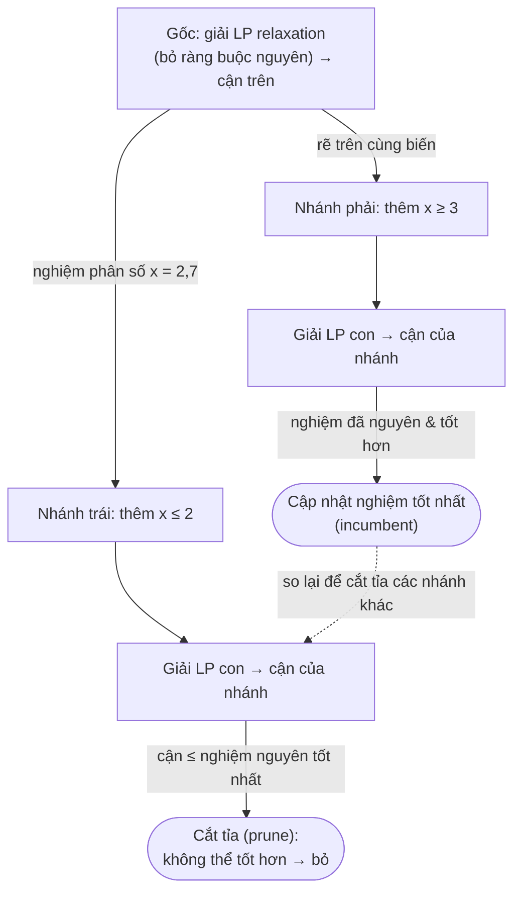
*Sơ đồ: cây nhánh-cận — LP relaxation cho cận trên, rẽ nhánh trên biến phân số, dùng nghiệm nguyên tốt nhất (incumbent) để cắt tỉa các nhánh vô vọng. Nguồn: tổng hợp theo Land & Doig (1960).*

> [!IMPORTANT] 💡 INSIGHT — Vì sao phân biệt LP và ILP lại quan trọng với người thiết kế giải pháp
> Một cái bẫy tinh vi: nếu cứ giải bằng LP rồi *làm tròn* nghiệm phân số, kết quả có thể **vi phạm ràng buộc** (tràn sức chứa) hoặc **lệch xa tối ưu**. Ví dụ trữ hàng: làm tròn 254,7 lên 255 có thể vượt 900 m³; làm tròn xuống 254 có thể bỏ phí không gian. Với các bài toán "có/không" (mở kho nào, dùng cửa nào — biến nhị phân 0/1) thì làm tròn càng vô nghĩa. Bài học: **nhận diện đúng biến nào phải nguyên/nhị phân ngay từ khâu mô hình hóa** — đây là kỹ năng phân biệt một nhà phân tích thực thụ với người chỉ "chạy thư viện".

### c. PuLP — từ mô hình giấy đến nghiệm máy tính

**PuLP** là thư viện LP/MILP mã nguồn mở viết bằng Python, đóng vai trò *ngôn ngữ mô hình hóa (modeling language)*: ta khai báo biến – mục tiêu – ràng buộc bằng cú pháp gần với toán học, PuLP dịch sang định dạng chuẩn và gọi solver (mặc định CBC) để giải (Liu ch.7). Quy trình phát biểu một mô hình gồm **năm bước**:

> [!TIP] 🛠️ Năm bước phát biểu mô hình bằng PuLP (Liu ch.7)
> 1. **Khởi tạo mô hình:** `LpProblem("ten", LpMaximize|LpMinimize)`.
> 2. **Khai báo biến quyết định:** `LpVariable`/`LpVariable.dicts(...)` — nêu rõ cận dưới/trên và *loại* (`Continuous` hay `Integer`).
> 3. **Thêm hàm mục tiêu:** dùng toán tử `+=` với `lpSum([...])`.
> 4. **Thêm ràng buộc:** tiếp tục `+=` từng bất/đẳng thức.
> 5. **Giải & đọc nghiệm:** `prob.solve()`, kiểm `LpStatus`, đọc `varValue` và `value(objective)`.

> [!NOTE] 💻 Trạng thái nghiệm trả về từ solver (Liu ch.7, Table 7.3)
> `Optimal` (1, đã tìm thấy nghiệm tối ưu) · `Not Solved` (0, trước khi giải) · `Infeasible` (−1, không có nghiệm khả thi — ràng buộc mâu thuẫn) · `Unbounded` (−2, mục tiêu không bị chặn — thường do thiếu ràng buộc) · `Undefined` (−3). *Luôn kiểm trạng thái trước khi tin vào nghiệm* — `Infeasible`/`Unbounded` là tín hiệu mô hình sai, không phải lỗi dữ liệu.

### d. Giải bài toán tối ưu trữ kho (Liu Example 7.1)

> [!IMPORTANT] 📐 Đề bài (Liu Example 7.1 — dữ liệu cho sẵn)
> Bạn quản lý một kho nhỏ có **sức chứa hữu dụng 900 m³**, bán online 8 mặt hàng A–H, mỗi mặt có kích thước và lợi nhuận/đơn vị cho sẵn. **Mục tiêu: tối đa tổng lợi nhuận**, quyết định *trữ mặt nào và bao nhiêu*.
>
> | Mặt hàng | A | B | C | D | E | F | G | H |
> |---|---|---|---|---|---|---|---|---|
> | Kích thước (m³) | 3 | 3 | 4 | 5 | 3,5 | 4 | 2 | 1 |
> | Lợi nhuận (£) | 240 | 245 | 250 | 410 | 300 | 150 | 140 | 100 |
>
> **Hai điều kiện kinh doanh:** (i) A và B gần giống nhau — phải trữ *ít nhất một* trong hai (giữ khách trung thành); (ii) G và H bán theo cặp — nếu chọn G thì phải chọn H với *số lượng bằng nhau*.

Phát biểu toán học. Gọi $x_i \ge 0$ nguyên là số đơn vị trữ của mặt hàng $i$, $p_i$ là lợi nhuận và $s_i$ là kích thước:

> [!IMPORTANT] 📐 Mô hình ILP
> $$\max \ \sum_{i \in \{A..H\}} p_i\, x_i \quad\text{(tổng lợi nhuận)}$$
> $$\text{s.t.}\ \sum_i s_i\, x_i \le 900 \quad\text{(sức chứa)}$$
> $$x_A + x_B \ge 1 \quad\text{(ít nhất A hoặc B)}$$
> $$x_G - x_H = 0 \quad\text{(G và H theo cặp)}$$
> $$x_i \ge 0,\ x_i \in \mathbb{Z}$$
> Đây là một bài toán dạng **knapsack nguyên có ràng buộc phụ** — họ hàng với bài toán xếp ba lô kinh điển, nay thêm hai điều kiện logic kinh doanh.

Trước khi để máy giải, hãy xây **trực giác** (đây cũng là phần *tính tay* để đối chiếu). Chỉ số đáng giá là **mật độ lợi nhuận** $p_i/s_i$ — lợi nhuận thu được trên mỗi m³ không gian, vì không gian mới là nguồn lực khan hiếm chứ không phải số mặt hàng:

| Mặt hàng | E | D | B | A | G | C | F | H (đơn lẻ) |
|---|---|---|---|---|---|---|---|---|
| $p_i/s_i$ (£/m³) | **85,7** | 82,0 | 81,7 | 80,0 | 70,0 | 62,5 | 37,5 | 100,0 |

- **E cao nhất** trong nhóm "trữ tự do" (85,7 £/m³) → kỳ vọng nghiệm dồn vào E.
- **H** trông hấp dẫn nhất (100 £/m³) nhưng bị **trói với G theo cặp**: cặp G+H dùng $2+1 = 3$ m³ cho $140+100 = 240$ £ → mật độ thực chỉ **80 £/m³**, thua E. Không được nhìn H cô lập.
- 900 m³ chia hết cho E không trọn ($900 / 3{,}5 = 257{,}1$) và nếu trữ thuần E thì *vi phạm* điều kiện A∨B → kỳ vọng solver chèn chút D/B để vừa khít và thỏa ràng buộc logic.

Code dưới xác nhận trực giác này:

```python
import pulp

# === DE BAI (Liu Example 7.1) ===
items  = ["A", "B", "C", "D", "E", "F", "G", "H"]
size   = {"A":3, "B":3, "C":4, "D":5, "E":3.5, "F":4, "G":2, "H":1}        # m3
profit = {"A":240,"B":245,"C":250,"D":410,"E":300,"F":150,"G":140,"H":100} # £
CAP = 900

prob = pulp.LpProblem("warehousing", pulp.LpMaximize)
x = pulp.LpVariable.dicts("stock", items, lowBound=0, cat="Integer")       # bien nguyen >= 0

prob += pulp.lpSum([profit[i]*x[i] for i in items])                         # (muc tieu)
prob += pulp.lpSum([size[i]*x[i] for i in items]) <= CAP, "Capacity"        # (suc chua)
prob += x["A"] + x["B"] >= 1, "A_or_B"                                      # (it nhat A/B)
prob += x["G"] - x["H"] == 0, "G_pairs_H"                                   # (G = H)

prob.solve(pulp.PULP_CBC_CMD(msg=0))

print("Status:", pulp.LpStatus[prob.status])
for i in items:
    if x[i].varValue and x[i].varValue > 0:
        print(f"  {i}: {int(x[i].varValue)} don vi")
print("Max profit =", int(pulp.value(prob.objective)), "GBP")
print("Khong gian dung =", sum(size[i]*x[i].varValue for i in items), "/", CAP, "m3")
```

```text
Status: Optimal
  B: 2 don vi
  D: 1 don vi
  E: 254 don vi
Max profit = 77100 GBP
Khong gian dung = 900.0 / 900 m3
```

> [!NOTE] 💻 Đọc nghiệm — và vì sao nó "thông minh" hơn trực giác thuần
> Nghiệm tối ưu: **254 đơn vị E + 1 D + 2 B → lợi nhuận £77.100**, lấp đúng 900/900 m³. Phân tích:
> - Solver dồn phần lớn không gian cho **E** (mật độ lợi nhuận cao nhất, 85,7/m³) — đúng trực giác.
> - Nhưng nó không trữ *thuần* E: $254 \times 3{,}5 = 889$ m³, còn dư 11 m³. Thay vì bỏ phí, nó nhét **1 D** (5 m³, 410£) và **2 B** (6 m³, 490£) để lấp đúng 11 m³ còn lại — đồng thời 2 B *thỏa luôn điều kiện A∨B*. Đây là chỗ tối ưu vượt trực giác: nó *đồng thời* lấp khe không gian và thỏa ràng buộc logic, điều mà tính tay rất dễ bỏ sót.
> - G/H = 0: dù H có mật độ danh nghĩa 100, ràng buộc cặp kéo mật độ thực của cặp G+H xuống 80 < E, nên loại — minh họa vì sao *không được nhìn từng biến cô lập*.

Nhưng đây cũng là chỗ phải dừng lại và **chất vấn chính mô hình**. Nghiệm "trữ 254 đơn vị E" tối ưu *về mặt toán*, nhưng có thật là quyết định kinh doanh đúng không?

> [!WARNING] 🪤 Bẫy thường gặp — "tối ưu của mô hình" ≠ "tối ưu của thực tế"
> Mô hình Ex 7.1 ngầm chứa hai giả định mạnh mà người mới mô hình hóa dễ bỏ qua:
> - **Không có trần cầu (no demand ceiling):** mô hình cho phép trữ — và *ngầm định bán hết* — 254 đơn vị E. Trong thực tế cầu mỗi SKU là hữu hạn; bán 254 đơn vị một mặt hàng có thể bất khả thi. Vì *không* có ràng buộc $x_i \le d_i$, solver tất yếu dồn toàn bộ không gian vào SKU mật độ cao nhất.
> - **Tuyến tính tuyệt đối:** lợi nhuận biên £300/đơn vị E coi như *không đổi* dù bán 1 hay 254 đơn vị — bỏ qua co giãn giá, chiết khấu số lượng, hiệu ứng bão hòa thị trường.
>
> Hệ quả: con số "£77.100" trông chính xác đến từng bảng Anh, nhưng độ tin cậy của nó **không cao hơn** độ tin cậy của giả định đầu vào. Đây là bẫy *false precision* kinh điển của tối ưu hóa.

Để thấy giả định này quyết định nghiệm đến mức nào, ta thêm **ràng buộc cầu** $x_i \le d_i$ cho mỗi mặt hàng (đây là *mở rộng minh họa* — số liệu cầu do ta tự đặt để dạy bản chất, **không thuộc đề bài gốc** Liu Ex 7.1):

```python
# === MO RONG MINH HOA (khong thuoc de bai goc): them tran cau x_i <= d_i ===
dem = {"A":40,"B":40,"C":30,"D":50,"E":60,"F":30,"G":40,"H":40}   # tran cau gia dinh

prob2 = pulp.LpProblem("warehousing_demand", pulp.LpMaximize)
x = pulp.LpVariable.dicts("stock", items, lowBound=0, cat="Integer")
prob2 += pulp.lpSum([profit[i]*x[i] for i in items])
prob2 += pulp.lpSum([size[i]*x[i] for i in items]) <= CAP, "Capacity"
prob2 += x["A"] + x["B"] >= 1, "A_or_B"
prob2 += x["G"] - x["H"] == 0, "G_pairs_H"
for i in items:
    prob2 += x[i] <= dem[i], "demand_" + i          # tran cau moi mat hang

prob2.solve(pulp.PULP_CBC_CMD(msg=0))
print("Status:", pulp.LpStatus[prob2.status])
for i in items:
    if x[i].varValue and x[i].varValue > 0:
        print(f"  {i}: {int(x[i].varValue)} don vi")
print("Max profit =", int(pulp.value(prob2.objective)), "GBP")
print("Khong gian dung =", sum(size[i]*x[i].varValue for i in items), "/", CAP, "m3")
```

```text
Status: Optimal
  A: 40 don vi
  B: 40 don vi
  C: 20 don vi
  D: 50 don vi
  E: 60 don vi
  G: 40 don vi
  H: 40 don vi
Max profit = 72500 GBP
Khong gian dung = 900.0 / 900 m3
```

> [!IMPORTANT] 💡 INSIGHT — Cùng một solver, hai mô hình, hai triết lý kinh doanh
> Chỉ thêm một dòng ràng buộc, nghiệm đổi từ **"đặt cược tất tay vào E" (254 đơn vị, £77.100)** sang **"danh mục đa dạng phủ 7/8 SKU" (£72.500)**. Hai điểm rút ra cho vai trò thiết kế giải pháp của bạn:
> - £4.600 chênh lệch **không phải** lợi nhuận thật bị mất — nó là *ảo giác* do mô hình gốc thiếu ràng buộc cầu tạo ra. Mô hình càng "tự do" càng cho mục tiêu cao hơn một cách giả tạo. Một con số tối ưu cao hơn **không** đồng nghĩa với mô hình tốt hơn.
> - Chất lượng quyết định nằm ở **độ trung thực của mô hình với thực tế**, không ở việc solver chạy đúng. Solver luôn cho nghiệm tối ưu *của bài toán bạn phát biểu* — nếu bạn phát biểu sai bài toán, bạn nhận một câu trả lời chính xác cho câu hỏi sai (lỗi loại III).

> [!NOTE] 💻 Giả định, điều kiện hiệu lực & hạn chế của mô hình ILP knapsack
> Để dùng nghiệm một cách có trách nhiệm (bậc thạc sĩ = biết *vì sao* + biết *giới hạn*), phải tuyên bố rõ:
> - **Giả định tuyến tính:** lợi nhuận và không gian tỉ lệ thuận với số lượng — *hiệu lực khi* không có chiết khấu số lượng, không có economies/diseconomies of scale, không co giãn giá. *Vỡ khi* chi phí lõm/lồi hoặc có chi phí cố định theo lô.
> - **Giả định tất định:** $p_i, s_i$ và (ngầm) cầu coi như biết chắc. *Vỡ khi* cầu/giá bất định → cần tối ưu ngẫu nhiên / newsvendor ([M4 §4.3](04-toi-uu-ton-kho.md)).
> - **Giả định độc lập:** lợi nhuận mỗi SKU không phụ thuộc SKU khác — bỏ qua sản phẩm thay thế/bổ sung (ràng buộc A∨B và G=H là *vá tay* một phần cho điều này).
> - **Hạn chế quy mô:** ILP là NP-hard; bài 8 biến giải tức thì, nhưng hàng nghìn SKU × ràng buộc tổ hợp có thể không giải đúng tối ưu trong thời gian thực → xem §e.
> - **Không có vấn đề nội sinh/identification ở đây** (đây là bài *tối ưu*, không *ước lượng*); nhưng nếu $p_i$ được *ước lượng* từ dữ liệu bán (vd hồi quy giá→lượng), giá nội sinh sẽ làm OLS chệch → cần IV/2SLS trước khi đưa vào hàm mục tiêu.

### e. Điều kiện biên — khi nào LP/ILP là công cụ sai

Một tài liệu bậc thạc sĩ không thể trình bày LP như chân lý phổ quát. Sức mạnh của LP đến *đúng từ* các giả định của nó, nên cũng chính các giả định đó vạch ra **ranh giới hiệu lực** — vùng mà ngoài đó, dùng LP là sai về bản chất chứ không chỉ thiếu chính xác:

- **Phi tuyến do quy mô:** khi có **economies of scale** (chi phí đơn vị giảm theo sản lượng — hàm chi phí *lõm*), tối ưu tuyến tính cho nghiệm sai hệ thống. Cần quy hoạch lõm/phi tuyến, hoặc tuyến-tính-hóa từng khúc (piecewise-linear) đánh đổi bằng thêm biến nhị phân.
- **Chi phí cố định / quyết định có–không:** "mở kho này hay không", "chạy dây chuyền hay không" mang chi phí cố định bật–tắt → bản chất là **MILP biến nhị phân**, không phải LP thuần. Làm tròn nghiệm LP ở đây *vô nghĩa* (§b).
- **Mục tiêu/ràng buộc phi tuyến thực sự:** rủi ro (phương sai danh mục), hiệu ứng tắc nghẽn phi tuyến, hàm thỏa dụng cong → vượt LP, cần convex programming hoặc mô phỏng.
- **Bất định lớn:** khi tham số dao động mạnh, nghiệm LP tất định có thể "tối ưu nhưng giòn" (brittle) — cần **robust optimization** hoặc **stochastic programming**.

> [!IMPORTANT] 💡 INSIGHT — Đánh đổi nền tảng: độ trung thực mô hình ↔ khả năng giải (fidelity vs tractability)
> Đây là căng thẳng trung tâm của cả ngành tối ưu hóa, soi từ hai trường phái:
> - **Trường phái "nghiệm tối ưu chính xác"** (exact — simplex, branch & bound): bảo đảm tìm đúng cực trị *của mô hình*. Mạnh khi bài toán đủ nhỏ/cấu trúc đẹp; nhưng để giữ được tính giải-được, người ta thường phải *đơn giản hóa mô hình* (ép tuyến tính, bỏ bất định) — tức **hy sinh độ trung thực để đổi lấy tối ưu**.
> - **Trường phái heuristic/metaheuristic** (GA, simulated annealing, tabu search, OR-Tools): chấp nhận **nghiệm gần tối ưu** nhưng cho phép mô hình *giàu và thực tế hơn* (phi tuyến, ràng buộc mềm, quy mô lớn) và chạy trong thời gian thực.
>
> Không có bên nào "đúng" tuyệt đối — chọn theo bài toán. Bài học cho người thiết kế giải pháp Control Tower: **một nghiệm 95% tối ưu trên mô hình trung thực thường đáng giá hơn một nghiệm 100% tối ưu trên mô hình sai lệch**. Biết khi nào *không* nên theo đuổi tối ưu tuyệt đối là dấu hiệu của người làm tối ưu trưởng thành — đúng tinh thần phê phán của Ackoff về "giải hoàn hảo cho bài toán sai".

### f. Đối ngẫu & Shadow Price — cầu nối sang kinh tế học

Giá trị sâu sắc nhất của LP với người có nền kinh tế là **lý thuyết đối ngẫu (duality)**. Mỗi bài toán LP gốc (*primal*) có một bài toán *đối ngẫu* đi kèm, và nghiệm đối ngẫu cho ta **shadow price (giá bóng)** của từng ràng buộc: *mục tiêu sẽ cải thiện bao nhiêu nếu nới lỏng ràng buộc đó thêm một đơn vị*. Trong Example 7.1, shadow price của ràng buộc sức chứa trả lời câu hỏi cực kỳ thực tế: **"thêm 1 m³ kho thì lợi nhuận tăng bao nhiêu?"** — chính là *mức sẵn lòng chi trả tối đa* để thuê/xây thêm 1 m³.

Shadow price chỉ có nghĩa chặt chẽ trên bài **LP** (liên tục), nên ta giải **bản LP relaxation** của Ex 7.1 và đọc trực tiếp giá bóng từng ràng buộc qua thuộc tính `.pi` của PuLP — không đoán:

```python
# === GIAI LP RELAXATION de lay shadow price that (cat="Continuous") ===
probLP = pulp.LpProblem("warehousing_LPrelax", pulp.LpMaximize)
x = pulp.LpVariable.dicts("stock", items, lowBound=0, cat="Continuous")   # bo rang buoc nguyen
probLP += pulp.lpSum([profit[i]*x[i] for i in items])
probLP += pulp.lpSum([size[i]*x[i] for i in items]) <= CAP, "Capacity"
probLP += x["A"] + x["B"] >= 1, "A_or_B"
probLP += x["G"] - x["H"] == 0, "G_pairs_H"
probLP.solve(pulp.PULP_CBC_CMD(msg=0))

print("LP-relax profit =", round(pulp.value(probLP.objective), 2))
for name, c in probLP.constraints.items():
    print(f"  shadow price [{name}] = {c.pi:.4f}")
```

```text
LP-relax profit = 77130.71
  shadow price [Capacity]  = 85.7143      <- = 300/3,5, dung bang mat do cua E
  shadow price [A_or_B]    = -12.1429     <- rang buoc nay LAM GIAM loi nhuan
  shadow price [G_pairs_H] = -31.4286
```

Ba con số này tự kể một câu chuyện kinh tế:

- **Sức chứa = £85,71/m³** — đúng bằng mật độ lợi nhuận của E, vì tại điểm tối ưu mỗi m³ tăng thêm sẽ được lấp bằng E. Đây là *trần giá thuê/xây thêm kho* mà việc mở rộng vẫn có lời.
- **A∨B = −£12,14** — dấu âm nghĩa là *ép* "phải trữ ≥1 của A hoặc B" **làm giảm** lợi nhuận £12,14: ràng buộc giữ-chân-khách-hàng này có **chi phí cơ hội** đo được, không miễn phí.
- **G=H = −£31,43** — buộc G và H đi theo cặp cũng tốn lợi nhuận; con số định lượng cho biết chính sách "bán kèm" đắt đến đâu.

> [!IMPORTANT] 💡 INSIGHT — Shadow price biến mô hình tối ưu thành công cụ định giá đầu tư & chính sách
> Hai tầng ý nghĩa cho vai trò Control Tower/thiết kế giải pháp của bạn:
> - **Định giá CapEx:** shadow price sức chứa £85,71/m³ là *mức sẵn lòng chi trả tối đa* để thuê/xây thêm kho. Chi phí biên thuê kho < £85,71/m³ → mở rộng có lời; cao hơn → không. LP chuyển từ "tìm nghiệm" sang **hỗ trợ quyết định đầu tư** — đúng tư duy quản trị cấp cao.
> - **Định giá ràng buộc chính sách:** giá bóng âm của A∨B và G=H *lượng hóa chi phí cơ hội của các quy tắc kinh doanh*. Trước khi áp một ràng buộc "mềm" (giữ khách, bán kèm), nên cân xem £12–31 lợi nhuận hy sinh có đáng so với giá trị chiến lược của nó không — một dạng phân tích đánh đổi mà số học thuần không cho được.
>
> ⚠️ **Điều kiện hiệu lực:** giá bóng chỉ giữ nguyên trong một **khoảng RHS** quanh giá trị hiện tại (sensitivity/RHS-ranging); nới quá nhiều thì ràng buộc khác trở nên ràng buộc tới hạn và giá bóng đổi. Hơn nữa với **ILP**, giá bóng *không* định nghĩa chặt do tính rời rạc — ta dùng LP relaxation làm **xấp xỉ**, hợp lý khi bài toán cỡ lớn và nghiệm nguyên gần nghiệm liên tục (ở đây £77.130,71 ≈ £77.100).

### g. Tổng hợp — LP là khung thống nhất cho mọi bài toán M6

Sức mạnh thực sự của mục này là **tính tổng quát**: cùng một bộ công cụ (biến – mục tiêu – ràng buộc – solver) giải được toàn bộ họ bài toán đã gặp, chỉ khác cách phát biểu. Bảng dưới hợp nhất "bản đồ bài toán" từ [§6.1.1](#611-động-lực-học-dòng-chảy-kho-receiving--put-away--storage--picking--despatch) dưới lăng kính LP/MILP:

| Bài toán kho | Biến quyết định | Mục tiêu | Lớp mô hình |
|---|---|---|---|
| Trữ hàng tối ưu (Ex 7.1) | $x_i$ = số đơn vị trữ | max lợi nhuận | **ILP (knapsack)** |
| Door assignment ([§6.1.4](#614-cross-docking-chuyên-sâu)) | $x_{jk}$ = gán đích $j$ ↔ cửa $k$ (0/1) | min quãng×khối lượng | **Assignment (binary LP)** |
| Slotting ([§6.1.3](#613-tối-ưu-vị-trí-xếp-hàng-slotting-bằng-cube-per-order-index-coi)) | SKU ↔ vị trí (0/1) | min tổng quãng nhặt | **QAP (bậc 2 → tuyến tính hóa)** |
| Thiết kế mạng kho ([M7 §7.6](07-transportation-network.md)) | mở kho nào, luồng bao nhiêu | min tổng chi phí | **MILP (facility location)** |
| Vận tải/phân bổ ([M7](07-transportation-network.md)) | lượng vận chuyển cung→cầu | min cước | **Transportation LP** |

> [!CAUTION] 📦 CASE STUDY — Procter & Gamble dùng integer programming tái cấu trúc chuỗi cung ứng Bắc Mỹ
> **Bối cảnh:** năm 1993, trong chương trình *Strengthening Global Effectiveness*, P&G xét lại toàn bộ mạng lưới nguồn cung – sản xuất – phân phối Bắc Mỹ: nên giữ/đóng nhà máy nào, mỗi nhà máy phục vụ vùng nào để tối thiểu tổng chi phí (sản xuất + vận tải) mà vẫn đáp ứng cầu.
> **Diễn biến:** đây chính là bài **facility-location MILP** ở hàng áp chót của bảng trên — biến nhị phân "mở/đóng nhà máy" + biến luồng "nhà máy → thị trường", giải bằng *integer programming + network optimization*, kết hợp hệ thống thông tin địa lý (GIS) để xử lý dữ liệu khoảng cách. Quy mô và tính "có/không" của quyết định khiến nó *không thể* giải bằng LP làm tròn — đúng lý do §b nhấn mạnh phải nhận diện biến nhị phân từ khâu mô hình hóa.
> **Bài học (con số thật):** P&G giảm gần **20% số nhà máy** ở Bắc Mỹ và tiết kiệm **hơn 200 triệu USD/năm** chi phí trước thuế (Camm và cộng sự, 1997, *Interfaces*). Đây là bằng chứng quy mô lớn cho luận điểm xuyên mục: cùng một khung "biến – mục tiêu – ràng buộc" giải bài knapsack 8 mặt hàng ở §d *và* bài tái cấu trúc mạng lưới tỉ đô — chỉ khác cách phát biểu. *(Nguồn: Camm, J.D. và cộng sự, 1997, "Blending OR/MS, Judgment, and GIS: Restructuring P&G's Supply Chain", Interfaces 27(1).)*

> [!IMPORTANT] 💡 INSIGHT TỔNG HỢP — Lộ trình làm chủ tối ưu hóa cho người nền Toán kinh tế
> Mục 6.3 mới chỉ là *cánh cửa*: PuLP + knapsack là bài toán nhập môn. Lộ trình đào sâu cho bạn: (1) **thành thạo phát biểu** — luyện chuyển bài toán thực thành ba khối biến/mục tiêu/ràng buộc (kỹ năng quý nhất, khó nhất); (2) **mở rộng lớp mô hình** — assignment, transportation, facility location (MILP) ở [M7](07-transportation-network.md); (3) **đối ngẫu & phân tích độ nhạy** — khai thác shadow price cho quyết định đầu tư; (4) **tối ưu ngẫu nhiên** khi cung/cầu bất định ([M4 §4.3](04-toi-uu-ton-kho.md)); (5) khi không gian nghiệm tổ hợp quá lớn → **heuristic/metaheuristic** (GA, simulated annealing) và **OR-Tools**. Với Control Tower, đây là tầng "bộ não tối ưu" nằm trên tầng "bộ mắt visibility" bạn đang xây.

> [!NOTE] 🔗 Liên kết chéo
> Bản đồ bài toán tối ưu của kho: [§6.1.1 Góc Toán](#611-động-lực-học-dòng-chảy-kho-receiving--put-away--storage--picking--despatch) · Door assignment (LAP): [§6.1.4](#614-cross-docking-chuyên-sâu) · Slotting/COI (QAP): [§6.1.3](#613-tối-ưu-vị-trí-xếp-hàng-slotting-bằng-cube-per-order-index-coi) · Routing TSP/VRP & facility location MILP: [M7 §7.6](07-transportation-network.md) · Tối ưu tồn kho ngẫu nhiên (Newsvendor, safety stock): [M4 §4.3](04-toi-uu-ton-kho.md) · Aggregate planning bằng LP: [M3 §3.3](03-supply-planning-mpc.md)

#### 📚 Nguồn (mục 6.5)

**Sách (nền chính):** Liu, *Supply Chain Analytics: Concepts, Techniques and Applications* (ch.7 Warehouse & Inventory Management — §7.3 Warehouse Optimization with PuLP, Example 7.1, Table 7.3); Jacobs & Chase, *Operations and Supply Chain Management* (ch.19S — LP với Excel Solver). Công cụ: PuLP (coin-or.github.io/pulp), solver CBC.

**Lớp học thuật toàn cầu (chuẩn sau-đại học):**
- Dantzig, G.B. (1947, công bố 1951), *The simplex method* — thuật toán nền của LP & định lý "tối ưu ở đỉnh".
- Land, A.H. & Doig, A.G. (1960), *An automatic method of solving discrete programming problems*, Econometrica — nhánh-cận (branch & bound) cho IP/MILP.
- Koopmans, T.C. & Beckmann, M. (1957), *Assignment problems*, Econometrica — nền QAP/assignment (bảng hợp nhất §g).
- Camm, J.D. và cộng sự (1997), *Blending OR/MS, Judgment, and GIS: Restructuring P&G's Supply Chain*, Interfaces 27(1), 128–142 — case facility-location MILP quy mô lớn (§g).

**Deep research (web):** case study P&G dẫn từ [Interfaces 27(1)](https://pubsonline.informs.org/doi/10.1287/inte.27.1.128) (Camm và cộng sự, 1997) — con số "giảm ~20% nhà máy, tiết kiệm >200 triệu USD/năm" trích trực tiếp. Toàn bộ code đã verify chạy thực với PuLP 3.3.2 + solver CBC: nghiệm ILP £77.100 khớp đáp án sách; shadow price LP relaxation £85,71/m³ và biến thể ràng buộc cầu £72.500 khớp output máy.

## 6.6. Kho xanh & tiết kiệm năng lượng *(bổ sung — Sustainable L&SCM ch.4)* ✅

> **Nguyên tắc biên soạn & quy ước trình bày:**
> - **Nền chính = sách thực hành** (McKinnon và cộng sự *Green Logistics* ch.8 — Marchant; *Sustainable Logistics & SCM* ch.4). Liên thông carbon Scope 1/2/3 và reverse logistics tại [M10](10-green-logistics.md).
> - **Lớp học thuật toàn cầu:** quy luật căn bậc hai khi tập trung tồn kho (**Maister 1976, *IJPD***), phân tích vòng đời chuẩn hóa (**ISO 14040 LCA**). Đây là tầng *vì sao* dưới các biện pháp kho xanh.
> - **Code Python tĩnh, dò tay được, verify bằng máy**; **deep research (web) chỉ BỔ SUNG** trong khối 🌐.

### 📌 Bốn lăng kính trong mục 6.6

> Kho xanh là nơi **Chiến lược** (mô hình trưởng thành bền vững, quyết định đầu tư dài hạn) và **Thực thi** (các biện pháp tiết kiệm năng lượng cụ thể) gặp nhau; Toán đóng vai trò lượng hóa năng lượng–phát thải để biến mục tiêu môi trường thành con số quyết định được.

| Lăng kính | Mức nhấn | Thể hiện ở đâu |
|---|---|---|
| 🎯 **Chiến lược** | ●●● Trọng tâm | §a (quy mô & sự bỏ quên), §b (mô hình 3 giai đoạn), §e (low-emission/circular), §f (location) |
| 🛠️ **Thực thi** | ●●● Trọng tâm | §c (nhiệt độ, chiếu sáng, MHE — biện pháp cụ thể & SOP housekeeping) |
| 📐💻 **Toán & Data** | ●●● Trọng tâm | §d (kWh/m², CO₂, quy tắc 1°C) + **Lab giải mô hình tối ưu số kho `n*`** (đánh đổi tồn kho √n ↔ vận tải 1/√n ↔ năng lượng kho) |
| 🧭 **Hoạch định** | ●● Bổ trợ | §f (số lượng & vị trí kho ↔ đánh đổi vận tải–tồn kho–phát thải, lượng hóa ở §d) |

### a. Vì sao kho xanh bị bỏ quên — và vì sao đó là sai lầm

Khi nói tới logistics bền vững, gần như toàn bộ sự chú ý dồn vào **vận tải**, còn kho bãi bị xem nhẹ. Có một lý do cấu trúc đằng sau sự thiên lệch này: trong tổng chi phí logistics, *kho chỉ chiếm khoảng 24% còn vận tải tới 40%* (ELA, dẫn trong McKinnon ch.8), và về phát thải, kho (các "tòa nhà logistics") chỉ đóng góp **~13% phát thải của chuỗi cung ứng**, phần còn lại 87% thuộc vận tải (WEF 2009, dẫn trong *Sustainable L&SCM* ch.4); riêng tại Anh, kho chiếm ~3% tổng phát thải khí nhà kính quốc gia (UKWA 2010). Vì miếng bánh nhỏ hơn, người ta tự nhiên đổ nguồn lực quản trị vào vận tải trước.

Nhưng kết luận "kho không đáng quan tâm" là sai trên ba phương diện. **Thứ nhất, quy mô tuyệt đối vẫn lớn và đang tăng nhanh:** không gian kho ở Anh tăng 114% trong giai đoạn 1970–1994, và DC trung bình phình từ ~19.000 m² (1996) lên ~34.000 m² (2008), cao hơn (high-bay >20 m) và vận hành ngày càng *thâm dụng* (nhiều kho chạy 24×7, 364 ngày/năm để "vắt" tài sản, hạ chi phí cố định đơn vị) — mỗi bước thâm dụng đó lại đội tiêu thụ năng lượng cho điện, sáng, sưởi (McKinnon ch.8). **Thứ hai, phần lớn năng lượng kho nằm ở *vận hành*, nơi quản đốc kiểm soát được:** phân tích vòng đời (Gazeley 2008) cho thấy **65–90% năng lượng của một kho bị tiêu thụ trong giai đoạn vận hành** qua HVAC, chiếu sáng và thiết bị — chứ không phải ở khâu xây dựng. **Thứ ba, tác động của kho vượt xa khí nhà kính:** kho làm tăng lưu lượng xe tải, gây tiếng ồn, phủ kín diện tích đất lớn (cản nước mưa thấm, ảnh hưởng hệ sinh thái), nhưng đồng thời tạo việc làm (*Sustainable L&SCM* ch.4) — nên đánh giá phải đa chiều, không chỉ CO₂.

> [!IMPORTANT] 💡 INSIGHT — "Bị bỏ quên" nghĩa là "còn nhiều dư địa rẻ"
> Chính vì kho ít được chú ý, nó còn rất nhiều cải tiến *chi phí thấp, hoàn vốn nhanh* chưa khai thác. Khảo sát của chương trình Energy Efficiency Best Practice (Carbon Trust 2002) ước tính **tới 50% năng lượng trực tiếp cho sưởi/sáng/thiết bị có thể tiết kiệm chỉ bằng các biện pháp "housekeeping" đơn giản** — không cần đầu tư lớn. Với vai trò thiết kế giải pháp/Control Tower của bạn, đây là một "mỏ" tiết kiệm song hành với mỏ tối ưu vận hành: vừa giảm chi phí vừa giảm phát thải, mà ROI thường tính bằng tháng.

### b. Framework đánh giá & Mô hình trưởng thành bền vững 3 giai đoạn

Để hành động có hệ thống, McKinnon (ch.8) đề xuất một **framework hai tầng**. Tầng **vi mô (micro)** là góc nhìn của doanh nghiệp: các đầu vào trực tiếp tiêu thụ nguồn lực (năng lượng, nước, đất, vật liệu xây dựng) phục vụ vận hành. Tầng **vĩ mô (macro)** là các ngoại ứng (externalities) vượt ra ngoài ranh giới doanh nghiệp, tác động tới môi trường và xã hội (sử dụng đất, phát thải khí quyển, chất thải, giao thông–tắc nghẽn, giao thông công cộng, xâm hại cảnh quan, sinh thái). Cách tiếp cận này kế thừa **phân tích vòng đời (life cycle analysis)** đang phổ biến trong phân tích chuỗi cung ứng.

Chồng lên framework đó là một **mô hình trưởng thành 3 giai đoạn** — đây là khung chiến lược cốt lõi của mục này:

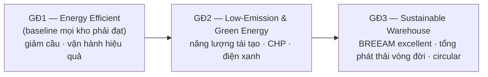

> [!IMPORTANT] 🔑 Khái niệm cốt lõi — Trình tự bắt buộc, không nhảy cóc
> Mô hình 3 giai đoạn hàm ý một *trình tự*: phải **giảm cầu năng lượng và đạt hiệu quả (GĐ1) trước**, rồi mới đầu tư năng lượng phát thải thấp/tái tạo (GĐ2), cuối cùng mới hướng tới bền vững toàn diện theo chuẩn BREEAM và tư duy tổng phát thải vòng đời (GĐ3). Lý do giống hệt mô hình trưởng thành *vận hành* ở [§6.1.1.a](#611-động-lực-học-dòng-chảy-kho-receiving--put-away--storage--picking--despatch): lắp pin mặt trời (GĐ2) lên một kho còn rò rỉ nhiệt và chiếu sáng lãng phí (chưa xong GĐ1) là tối ưu cục bộ — trả tiền cho năng lượng sạch để rồi phí phạm nó. *Hiệu quả trước, tái tạo sau.*

Tuy vậy, **trình tự này không phải chân lý phổ quát** — nó chỉ tối ưu trong một *miền điều kiện* nhất định, và một người làm chiến lược cần biết khi nào nó gãy:

- **Khi hệ số carbon lưới điện rất "bẩn":** nếu kho cắm vào lưới chủ yếu từ than (hệ số CO₂/kWh cao), lắp điện mặt trời mái (GĐ2) có thể cắt phát thải mạnh *ngay cả khi GĐ1 chưa hoàn tất*, vì mỗi kWh tự sản xuất thay thế một kWh rất bẩn. Lúc này thứ tự ưu tiên xét theo *carbon* khác với thứ tự xét theo *chi phí*.
- **Khi có cửa sổ trợ giá/tín chỉ sắp đóng:** ưu đãi đầu tư tái tạo có thời hạn → giá trị hiện tại ròng (NPV) của việc làm GĐ2 *trước* có thể vượt GĐ1, dù GĐ1 rẻ hơn về kỹ thuật. Đây là đánh đổi *thời điểm*, không phải *thứ tự kỹ thuật*.
- **Khi kho đi thuê ngắn hạn:** ROI của các cải tạo vỏ bao che (cách nhiệt, mái) trong GĐ1 và đầu tư vòng đời GĐ3 cần nhiều năm để hoàn vốn — với hợp đồng thuê 2–3 năm, chính bài toán *split incentive* (xem case study §f) làm cả GĐ1 lẫn GĐ3 *không khả thi tài chính*, bất kể "đúng thứ tự".

> [!IMPORTANT] 💡 INSIGHT — "Hiệu quả trước" là quy tắc *kinh tế*, không phải định luật vật lý
> Trình tự GĐ1→GĐ2→GĐ3 đúng khi mục tiêu là *cực tiểu chi phí năng lượng* trên một tài sản mình sở hữu lâu dài và lưới điện tương đối sạch. Nó đảo chiều khi (i) đo bằng *carbon* trên lưới bẩn, (ii) tối ưu theo *NPV* dưới ràng buộc trợ giá có thời hạn, hoặc (iii) quyền sở hữu tách khỏi quyền vận hành. Đây là một ví dụ điển hình của nguyên tắc: *một khung trưởng thành (maturity model) là một heuristic sắp xếp ưu tiên dưới giả định ngầm về hàm mục tiêu — đổi hàm mục tiêu thì thứ tự đổi theo.*

### c. Giai đoạn 1 — Hiệu quả năng lượng (ba mặt trận lớn)

Vì 65–90% năng lượng nằm ở vận hành, và năng lượng vận hành tập trung vào **HVAC (nhiệt độ), chiếu sáng và thiết bị xếp dỡ (MHE)**, ba mặt trận này là nơi GĐ1 dụng công.

**Mặt trận 1 — Nhiệt độ (thường là khoản lớn nhất).** Năng lượng sưởi/làm mát phụ thuộc nhiệt độ mục tiêu của *hàng* và nhiệt độ nền cho *người* làm việc thoải mái, cộng với khối nhiệt (thermal mass) của tòa nhà, cách nhiệt, hướng nhà và thông gió. Quy tắc định lượng đắt giá nhất: **giảm 1°C nhiệt độ mục tiêu tiết kiệm khoảng 10% năng lượng** (Carbon Trust 2002). Hệ quả thực thi là **đặt nhiệt độ theo *vùng* phù hợp với cường độ hoạt động** thay vì sưởi đều cả kho: khu bốc dỡ (vận động mạnh) chỉ cần ~13°C, khu nhặt/kiểm ~19°C, khu lưu trữ hàng khô ~10°C. Song song, kiểm soát **số lần trao đổi khí/giờ (air changes)** — kẻ ngốn nhiệt thầm lặng: chỉ mở cửa khi có xe, lắp rèm nhựa/cửa đóng nhanh ở lối xe nâng, tách khu nhận/xuất khỏi khu khác, dùng thermostat theo vùng/theo giờ.

**Mặt trận 2 — Chiếu sáng (dễ quản lý nhất, hoàn vốn nhanh nhất).** Năng lượng chiếu sáng năm = *tải lắp đặt (W/m²) × diện tích × giờ vận hành* — một công thức minh bạch, đo được. Mức sáng đo bằng **lux** và phụ thuộc tác vụ (Carbon Trust GPG319: khu mở ~5–6 W/m² cho 300 lux, ~8–10 cho 500 lux; lối hẹp cao cần nhiều hơn). Các đòn bẩy: (i) **vệ sinh định kỳ** roof-light & luminaire — bụi bám làm giảm 50% độ sáng trong 2 năm, đội 15% điện; (ii) **thay đèn**: SON thay đèn thủy ngân cũ (−15%), ống T8 thay T12 (−8%), thêm chấn lưu cao tần HF (−20%); (iii) **chiến lược thay đèn theo tuổi thọ trung bình, không chờ cháy**; (iv) chuyển dần sang **LED** + cảm biến hiện diện/ánh sáng ngày. *"Cấp quá nhiều sáng cũng hại như quá ít"* (gây chói, khó chịu) — nên thiết kế theo lux mục tiêu, không theo cảm tính.

**Mặt trận 3 — Thiết bị xếp dỡ (MHE).** Lựa chọn cốt lõi là động cơ đốt trong (diesel/LPG) hay pin ắc-quy điện. Một phát hiện quan trọng (Johnson 2008, dẫn trong McKinnon ch.8): **dấu chân carbon của xe nâng LPG và điện *về cơ bản tương đương*, kết quả so sánh đảo chiều tùy ranh giới hệ thống** (well-to-pump, well-to-wheel, battery-to-wheel…). Vì không có chuẩn chu trình thử nghiệm thống nhất, quyết định nên dựa trên **tổng chi phí sở hữu** (mua–nhiên liệu–bảo trì–thải bỏ) hơn là tranh cãi "loại nào xanh hơn". Cải tiến cụ thể: bảo trì pin tốt, đầu tư **sạc cao tần (HF charging)** để kéo dài chu kỳ pin, dùng phanh tái sinh.

> [!TIP] 🛠️ SOP housekeeping năng lượng kho (Carbon Trust, dẫn McKinnon ch.8)
> 1. **Nhiệt độ:** đặt theo vùng (bốc dỡ 13°C · nhặt 19°C · lưu khô 10°C); mỗi −1°C ≈ −10% năng lượng sưởi.
> 2. **Thông gió:** cửa chỉ mở khi có xe; rèm nhựa/cửa nhanh; thermostat theo giờ/vùng.
> 3. **Chiếu sáng:** vệ sinh luminaire định kỳ; thay SON/T8 + chấn lưu HF; thay đèn theo tuổi thọ; LED + cảm biến.
> 4. **MHE:** bảo trì pin; sạc HF; chọn theo tổng chi phí sở hữu.
> 5. **Đo lường:** lắp đồng hồ năng lượng theo khu; benchmark kWh/m² làm KPI nền.

### d. Góc Toán — Lượng hóa năng lượng, phát thải & đánh đổi vị trí

Mọi mục tiêu "xanh" chỉ trở nên *quản trị được* khi quy ra con số. Mục này đi từ phép kiểm toán năng lượng đơn giản (Lab A) tới một **mô hình tối ưu thật sự** chọn số lượng kho (Lab B) — nơi square-root law gặp đánh đổi vận tải và phát thải.

> [!IMPORTANT] 📐 Công thức nền
> **Năng lượng chiếu sáng/năm** $= \dfrac{W/m^2 \times \text{diện tích}}{1000} \times \text{giờ}$ (kWh); **Phát thải** $= \text{kWh} \times \text{hệ số CO}_2 \text{ lưới}$.
> **Quy tắc 1°C:** mỗi °C giảm nhiệt độ mục tiêu ≈ **−10%** năng lượng sưởi.
> **Square-root law (Maister 1976; nền lý thuyết: Eppen 1979 *risk pooling*):** tổng tồn kho an toàn của $n$ kho phân tán $= \sqrt{n}\times$ tồn kho an toàn của **1 kho tập trung**; do đó gộp về 1 kho cắt được $\left(1 - \tfrac{1}{\sqrt{n}}\right)$ tồn kho an toàn. Đây là cầu nối *bền vững ↔ thiết kế mạng*: ít kho hơn = ít diện tích sưởi/sáng + ít tồn kho, nhưng đổi lại quãng vận tải dài hơn (Lab B).

#### d.1. Lab A — Kiểm toán năng lượng & phát thải (số học một bước, làm nền)

```python
# === DE BAI: kho ambient 10,000 m2 (du lieu cho san) ===
AREA, W_PER_M2, HOURS, GRID_CO2 = 10_000, 8, 6_000, 0.233   # m2 ; W/m2 (500 lux) ; gio/nam ; kgCO2/kWh

annual_kwh  = W_PER_M2 * AREA / 1000 * HOURS                 # nang luong chieu sang
annual_tco2 = annual_kwh * GRID_CO2 / 1000                   # tan CO2
print(f"Chieu sang: {annual_kwh:,.0f} kWh/nam  ->  {annual_tco2:,.1f} tan CO2/nam")

HEAT_KWH = 1_200_000
print(f"Giam 1C nhiet do: -10% suoi = {HEAT_KWH*0.10:,.0f} kWh/nam")
```

```text
Chieu sang: 480,000 kWh/nam  ->  111.8 tan CO2/nam
Giam 1C nhiet do: -10% suoi = 120,000 kWh/nam
```

Chỉ riêng chiếu sáng một kho 10.000 m² đã ~480.000 kWh/năm (~112 tấn CO₂) — nên các đòn bẩy −8% đến −20% ở §c quy ra hàng chục nghìn kWh và hàng chục tấn CO₂ mỗi năm, hoàn vốn nhanh. Đây mới chỉ là *số học một bước*: hữu ích để định cỡ cơ hội, nhưng chưa phải bài toán *quyết định*. Quyết định thật nằm ở câu hỏi mạng lưới dưới đây.

#### d.2. Lab B — Giải mô hình tối ưu: nên có bao nhiêu kho?

Câu hỏi "gộp kho để xanh hơn" thực ra là một **bài toán tối ưu một biến** với ba lực kéo ngược chiều nhau theo số kho $n$ phục vụ một vùng:

> [!IMPORTANT] 📐 Mô hình tối ưu số kho
> $$TC(n) = \underbrace{A\sqrt{n}}_{\text{tồn kho an toàn}} \;+\; \underbrace{B\,n}_{\text{năng lượng+cố định kho}} \;+\; \underbrace{\dfrac{C}{\sqrt{n}}}_{\text{vận tải last-mile}}$$
> - $A\sqrt{n}$: tồn kho an toàn **tăng** theo $\sqrt{n}$ (square-root law đảo ngược — càng nhiều kho càng nhiều pooling bị phá vỡ); $A = h\cdot SS(1)$.
> - $B\,n$: mỗi kho thêm là một **vỏ bao che** phải sưởi/sáng → năng lượng & chi phí cố định **tăng tuyến tính** theo $n$ (đây là số hạng "xanh", thường bị bỏ quên).
> - $C/\sqrt{n}$: mạng càng dày, quãng last-mile bình quân **giảm** theo $1/\sqrt{n}$ → vận tải (và phát thải vận tải) giảm.
>
> **Nghiệm giải tích (bỏ qua năng lượng kho, $B=0$):** $\dfrac{d}{dn}\!\left(A\sqrt n + C/\sqrt n\right)=0 \Rightarrow n^\star = C/A$. Khi *tính cả* năng lượng kho ($B>0$), $n^\star$ **giảm** — tức định giá carbon/năng lượng của mỗi vỏ kho kéo mạng về phía **ít kho, tận dụng cao hơn**.

**Đề bài tĩnh (cho sẵn):** $A=150{,}000$, $B=40{,}000$, $C=1{,}200{,}000$ (đơn vị tiền/năm); phát thải song song: mỗi kho 200 tCO₂/năm, vận tải 1.500 tCO₂/năm khi $n=1$ (cũng $\propto 1/\sqrt n$).

**Tính tay (đối chiếu, đơn vị nghìn):** tại $n=4$ → $A\sqrt4 = 300$; $B\cdot4 = 160$; $C/\sqrt4 = 600$ → $TC=1{,}060$. Tại $n=3$ → $259{,}8+120+692{,}8=1{,}072{,}6$; tại $n=5$ → $335{,}4+200+536{,}7=1{,}072{,}1$. Hai bên đều cao hơn $n=4$ ⇒ **đáy chữ U tại $n^\star=4$**. Bỏ qua năng lượng kho: $n^\star=C/A=1{,}200{,}000/150{,}000=8$ — gấp đôi.

```python
import math

# === DE BAI tinh (cho san) ===
A, B, C = 150_000, 40_000, 1_200_000     # ton kho an toan / nang luong-co dinh kho / van tai khi n=1
E_WH_PER_SITE, E_TR_AT_1 = 200, 1_500    # tCO2: phat thai moi kho ; van tai khi n=1

def parts(n):
    ss = A * math.sqrt(n); wh = B * n; tr = C / math.sqrt(n)
    return ss, wh, tr, ss + wh + tr

def co2(n):
    return E_WH_PER_SITE * n + E_TR_AT_1 / math.sqrt(n)

print("n |    SS    |   WH    |    TR    |   TONG    | CO2(t)")
best_n, best_tc, green_n, green_e = None, float("inf"), None, float("inf")
for n in range(1, 9):
    ss, wh, tr, tc = parts(n); e = co2(n)
    if tc < best_tc: best_tc, best_n = tc, n
    if e  < green_e: green_e, green_n = e, n
    print(f"{n} | {ss:8,.0f} | {wh:7,.0f} | {tr:8,.0f} | {tc:9,.0f} | {e:6,.0f}")

print(f"\n=> n* (cuc tieu CHI PHI) = {best_n} kho, TC = {best_tc:,.0f}/nam")
print(f"=> n  (cuc tieu CO2)     = {green_n} kho, E  = {green_e:,.0f} tCO2/nam")
print(f"Bo qua nang luong kho (B=0): n* = C/A = {C/A:.0f} kho")
```

```text
n |    SS    |   WH    |    TR    |   TONG    | CO2(t)
1 |  150,000 |  40,000 | 1,200,000 | 1,390,000 |  1,700
2 |  212,132 |  80,000 |  848,528 | 1,140,660 |  1,461
3 |  259,808 | 120,000 |  692,820 | 1,072,628 |  1,466
4 |  300,000 | 160,000 |  600,000 | 1,060,000 |  1,550
5 |  335,410 | 200,000 |  536,656 | 1,072,067 |  1,671
6 |  367,423 | 240,000 |  489,898 | 1,097,321 |  1,812
7 |  396,863 | 280,000 |  453,557 | 1,130,420 |  1,967
8 |  424,264 | 320,000 |  424,264 | 1,168,528 |  2,130

=> n* (cuc tieu CHI PHI) = 4 kho, TC = 1,060,000/nam
=> n  (cuc tieu CO2)     = 2 kho, E  = 1,461 tCO2/nam
Bo qua nang luong kho (B=0): n* = C/A = 8 kho
```


*Hình 6.4.1 — Đáy chữ U của tổng chi phí theo số kho. Khi tính cả năng lượng vỏ kho (đường xanh lá), điểm tối ưu chỉ còn 4 kho thay vì 8. Nguồn: mô hình tự dựng theo square-root law (Maister 1976; Eppen 1979); dữ liệu đề bài tĩnh.*

> [!IMPORTANT] 💡 INSIGHT — Chi phí tối ưu ≠ carbon tối ưu, và "xanh hơn" không tự động là "tập trung hơn"
> Lab B phơi bày ba điều mà phiên bản "chỉ thế số vào square-root law" che mất:
> - **Phân kỳ mục tiêu:** chi phí cực tiểu tại **n\*=4 kho**, nhưng phát thải cực tiểu tại **n=2 kho**. Không có một "số kho xanh" tuyệt đối — nó phụ thuộc bạn cân chi phí với carbon ở tỷ giá nào (giá carbon càng cao, $n$ tối ưu càng dịch về phía carbon-min). Mạng tối ưu chi phí *không* tự động tối ưu phát thải.
> - **Số hạng năng lượng kho kéo mạng về phía tập trung:** bỏ qua năng lượng vỏ kho thì $n^\star=8$; định giá nó (mỗi kho = một vỏ phải sưởi/sáng) thì $n^\star$ rớt xuống 4. Đây chính là lượng hóa cho luận điểm §a — *kho vận hành thâm dụng, ít mà tận dụng cao thì hiệu quả năng lượng đơn vị tốt hơn*.
> - **Vì sao phải GIẢI chứ không thế số:** câu trả lời "gộp kho luôn xanh hơn" (suy từ một mình square-root law) là **sai** trong đề bài này — vì nó bỏ qua phát thải vận tải tăng khi quá tập trung. Chỉ khi viết đủ ba số hạng và tìm argmin mới thấy đáy thật.

> [!WARNING] 🪤 Giả định & điều kiện hiệu lực của mô hình (không có là chưa "quản trị được")
> Square-root law và Lab B chỉ đúng trong miền giả định sau — vượt ra là sai lệch có hệ thống:
> - **Cầu giữa các kho độc lập, không tương quan.** Nếu cầu các vùng **tương quan dương** (cùng lên/xuống theo mùa, theo chu kỳ kinh tế), lợi ích risk-pooling **nhỏ hơn** $\sqrt n$ → công thức *phóng đại* lợi ích gộp kho (Eppen 1979 nêu rõ điều kiện hiệp phương sai). Cầu tương quan âm thì ngược lại, pooling lợi hơn cả √n.
> - **Phương sai cầu đồng nhất, cùng mức dịch vụ, cùng lead time** giữa các kho. Khác nhau → phải dùng tổng theo $\sqrt{\sum \sigma_i^2}$ thay cho $\sqrt n\,\sigma$.
> - **Quan hệ last-mile $\propto 1/\sqrt n$** là xấp xỉ hình học (khách phân bố đều trên mặt phẳng, đặt kho tối ưu). Địa hình thực, mật độ khách lệch, hay ràng buộc vị trí làm hằng số $C$ đổi và quan hệ lệch khỏi $1/\sqrt n$.
> - **Mô hình tĩnh, một kỳ, chi phí tuyến tính theo $n$.** Không bắt được: tính rời rạc của vị trí khả dụng, hiệu ứng quy mô phi tuyến của năng lượng kho, hay giá năng lượng/carbon biến động theo thời gian. Bài toán đầy đủ là **MILP location–allocation** (canon: Weber/center-of-gravity, Daskin) — Lab B là *bản rút gọn một biến* để dò tay được; phiên bản nhiều biến giải ở [§6.5](#65-tối-ưu-hóa-kho-bằng-quy-hoạch-tuyến-tính-liu-ch7-pulp) và [M7 §7.6](07-transportation-network.md).

### e. Giai đoạn 2 & 3 — Năng lượng xanh và kho bền vững toàn diện

Sau khi đã "ép" cầu năng lượng xuống ở GĐ1, doanh nghiệp mới chuyển sang **GĐ2 — phát thải thấp & năng lượng xanh**: lắp **điện mặt trời mái** (kho có diện tích mái khổng lồ — lợi thế tự nhiên), thu hồi nhiệt mặt trời/nhiệt thải, **đồng phát nhiệt-điện (CHP)** và điện gió, hoặc đơn giản là **mua điện xanh**; song song là thu hồi & quản lý nước. **GĐ3 — kho bền vững toàn diện** mở rộng ranh giới ra cả vòng đời và chuỗi: dùng vật liệu tái chế/nguồn địa phương/vật liệu năng lượng thấp, đạt **chuẩn BREEAM excellent**, và chuyển trọng tâm từ "chi phí & phát thải trực tiếp" sang **tổng chi phí và tổng phát thải vòng đời** — tức tính cả năng lượng hàm chứa (embedded energy) trong vật liệu xây dựng và phát thải của cả chuỗi. Đây là nơi kho xanh hội tụ với **kinh tế tuần hoàn và reverse logistics** ([M10](10-green-logistics.md)).

### f. Vị trí, xã hội & ngoại ứng vĩ mô

Quyết định *bao nhiêu kho và đặt ở đâu* (lăng kính Hoạch định/Chiến lược) có lẽ là đòn bẩy bền vững **lớn hơn** mọi biện pháp housekeeping, vì nó định hình cả phát thải vận tải lẫn diện tích đất chiếm dụng. Như §d chỉ ra, tập trung kho cắt mạnh tồn kho (square-root law) và diện tích phải vận hành — nhưng *Sustainable L&SCM* (ch.4) nhấn mạnh đây là một **đánh đổi đa chiều**: ít kho tập trung → quãng vận tải dài hơn (phát thải vận tải tăng), trong khi xu hướng cross-dock và port-centric lại kéo kho về gần dân cư (giảm vận tải nhưng tăng xung đột đất đai, tiếng ồn, giao thông địa phương). Về **xã hội**, kho là nơi tạo việc làm lớn (một RDC tạp hóa có thể >1.000 lao động/ca) nhưng thường kết nối giao thông công cộng kém cho nhân viên — một khía cạnh bền vững xã hội dễ bị bỏ qua. Về **ngoại ứng vĩ mô**, cần tính cả xâm hại cảnh quan (nhà >20 m), cản nước mưa thấm, ảnh hưởng đa dạng sinh học — và đối trọng bằng cảnh quan hóa (landscaping), tái tạo sinh thái.

Cần thẳng thắn về **giới hạn của chính framework micro/macro** mà mục này dựa vào. Khung này kế thừa tư duy phân tích vòng đời (LCA, ISO 14040) — mạnh ở chỗ buộc ta liệt kê đầy đủ các tác động, nhưng có ba điểm yếu cố hữu:

- **Ranh giới micro/macro ngày càng mờ.** Khi phát thải được tính theo Scope 1/2/3 ([M10](10-green-logistics.md)), cái mà framework gọi là "ngoại ứng vĩ mô" (vd phát thải vận tải tới kho) lại trở thành Scope 3 *nội bộ* của doanh nghiệp khác — nên việc tách "trong/ngoài ranh giới doanh nghiệp" mang tính kế toán hơn là bản chất vật lý.
- **Khung tĩnh, khó cộng dồn các tác động không cùng đơn vị.** Nó liệt kê đất, nước, CO₂, tiếng ồn, việc làm cạnh nhau nhưng *không có hàm trọng số* để đánh đổi giữa chúng — quyết định cuối vẫn là phán đoán giá trị, không phải tối ưu hóa. Lab B chỉ giải được khi ta *quy ước* một tỷ giá carbon–chi phí; bản thân framework không cấp tỷ giá đó.
- **Mô hình trưởng thành 3 giai đoạn là một *heuristic chuẩn tắc*, không phải quy luật mô tả.** Nó kê đơn thứ tự "nên làm gì trước" dưới giả định ngầm (sở hữu dài hạn, lưới điện trung bình, không có cú sốc trợ giá) — đúng như §b đã mổ xẻ, đổi giả định thì thứ tự đảo. Phả hệ của nó là dòng *maturity model* trong quản trị (vốn xuất thân từ CMM phần mềm) ghép với LCA: hữu ích để truyền thông lộ trình, nhưng đừng nhầm nó với một định lý.

Chính vì những giới hạn này, nút thắt thực tế thường **không phải kỹ thuật mà là hợp đồng** — minh họa rõ nhất ở case study split-incentive dưới đây, vốn vô hiệu hóa cả "trình tự bắt buộc" GĐ1→GĐ3 nếu không gỡ trước.

> [!CAUTION] 📦 CASE STUDY — Bất cân xứng đầu tư & rào cản "split incentive" (McKinnon ch.8)
> Một rào cản thực tế khiến kho khó xanh: thị trường kho ngày nay tách bạch giữa *người thuê vận hành* và *người sở hữu/đầu tư* tòa nhà. Người vận hành hưởng lợi từ tiết kiệm năng lượng nhưng không sở hữu tòa nhà để đầu tư dài hạn; người sở hữu đầu tư nhưng không trả hóa đơn năng lượng. Sự lệch pha lợi ích (*split incentive*) này khiến nhiều cải tiến hoàn vốn tốt vẫn không được thực hiện — *"market capitalization và lợi nhuận đầu tư đang lấn át các quyết định sử dụng đất"* (Hesse 2004). **Bài học thiết kế giải pháp:** khi tư vấn kho xanh, phải gỡ nút *hợp đồng* (chia sẻ lợi ích tiết kiệm giữa chủ và người thuê) trước cả nút *kỹ thuật*.

### g. Tổng hợp & Liên kết chéo

> [!IMPORTANT] 💡 INSIGHT TỔNG HỢP — Đưa carbon thành KPI nền trên Control Tower
> Với vai trò Visibility/Control Tower của bạn, mục 6.4 gợi ý một lớp KPI mới đặt cạnh các KPI vận hành: **kWh/m², kgCO₂/m², kgCO₂/đơn vị throughput**, và *% năng lượng từ nguồn xanh*. Ba lý do: (1) đây là các chỉ số *đo được, benchmark được* (công thức §d minh bạch); (2) chúng *song hành* với mục tiêu chi phí — tiết kiệm năng lượng vừa giảm OpEx vừa giảm phát thải, nên không phải đánh đổi mà là "win-win"; (3) áp lực quy định & khách hàng về phát thải Scope 1/2/3 ([M10](10-green-logistics.md)) đang biến carbon từ "tùy chọn PR" thành ràng buộc bắt buộc. Lộ trình đúng vẫn là mô hình 3 giai đoạn: **đo & hiệu quả hóa (GĐ1) → năng lượng xanh (GĐ2) → bền vững vòng đời (GĐ3)** — đừng nhảy cóc.

> [!NOTE] 🔗 Liên kết chéo
> Mô hình trưởng thành vận hành (song song với trưởng thành bền vững): [§6.1.1.a](#611-động-lực-học-dòng-chảy-kho-receiving--put-away--storage--picking--despatch) · Hệ lưu trữ mật độ cao giảm diện tích sưởi/sáng: [§6.2.3](#623-hệ-lưu-trữ-selective--drive-in--push-back--pallet-flow--as-rs) · Cross-dock giảm lưu kho: [§6.1.4](#614-cross-docking-chuyên-sâu) · Square-root law & thiết kế mạng (MILP): [§6.5](#65-tối-ưu-hóa-kho-bằng-quy-hoạch-tuyến-tính-liu-ch7-pulp), [M7 §7.6](07-transportation-network.md) · Carbon Scope 1/2/3, reverse logistics, kinh tế tuần hoàn: [M10](10-green-logistics.md) · MHE & racking: [§6.2.2–6.2.3](#622-tính-công-suất-chứa--chiều-rộng-lối-đi-reach-truck-vna)

#### 📚 Nguồn (mục 6.6)

**Sách (nền chính):** McKinnon, Browne, Whiteing & Piecyk (eds), *Green Logistics* (ch.8 *Reducing the environmental impact of warehousing* — Clive Marchant: mô hình 3 giai đoạn, framework micro/macro, nhiệt độ/chiếu sáng/MHE); *Sustainable Logistics & Supply Chain Management* (ch.4 *Sustainable warehousing* — môi trường, vai trò, vị trí, xã hội, rủi ro). Số liệu/khái niệm dẫn trong sách: Carbon Trust (2002, GPG319); Gazeley (2008, LCA); WEF (2009); UKWA (2010); Johnson (2008, carbon footprint forklift); Hesse (2004); Baker & Perotti (2008).

**Lớp học thuật toàn cầu (chuẩn sau-đại học):**
- Maister, D.H. (1976), *Centralisation of inventories and the square root law*, International Journal of Physical Distribution — đặt tên & phổ biến quy luật căn bậc hai: gộp kho → giảm tồn kho an toàn theo $1-1/\sqrt{n}$.
- Eppen, G.D. (1979), *Effects of centralization on expected costs in a multi-location newsboy problem*, Management Science — **nền lý thuyết risk-pooling** của square-root law; nêu rõ điều kiện hiệp phương sai cầu (độc lập → đúng √n; tương quan dương → lợi ích nhỏ hơn). Mỏ neo đúng subtopic *risk pooling / hợp nhất*.
- Khung facility location (Weber / center-of-gravity; Daskin, *Network and Discrete Location*) — Lab B là bản rút gọn một biến của bài toán location–allocation đầy đủ (MILP).
- ISO 14040 — khung phân tích vòng đời (Life Cycle Assessment), nền của framework micro/macro & tổng phát thải vòng đời (GĐ3).

**Deep research (web):** không bổ sung — nội dung sách đầy đủ; Lab A (năng lượng/CO₂) và Lab B (mô hình tối ưu số kho $n^\star$, biểu đồ chữ U) đều đã verify bằng code, output khớp phần tính tay.

---
*Khi viết: theo quy ước 6 bước trong [Mục lục §0.3](00-MUC-LUC.md). Hình lưu tại `assets/img/m06/`.*
*🔗 Kết nối: chi phí kho nối M8 carrying cost; layout phục vụ DRP/throughput M7.*
