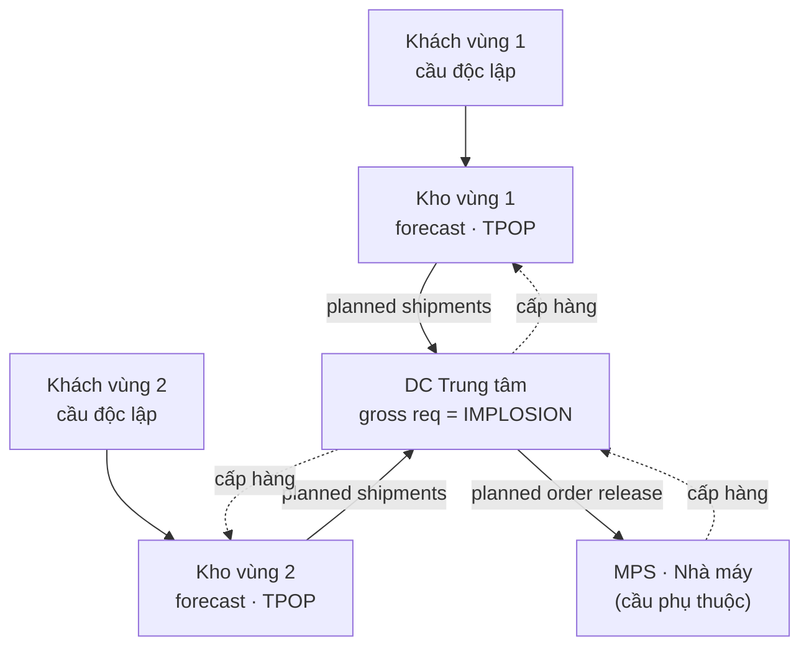

# M7 — TRANSPORTATION ECONOMICS & TỐI ƯU MẠNG LƯỚI

> **Trạng thái:** 🟡 Đang viết (7.1 ✅, 7.2 ✅) · **Lăng kính trọng tâm:** 📐 Toán + 🎯 Chiến lược
> **Nguồn lõi:** Coyle (lõi, ch.4 costing/pricing) · Chopra ch.4–6,14 · Rushton Part 5 · Liu ch.9 · Vollmann ch.10 (DRP) · Toolkit (02)
> [⬅ Về Mục lục](00-MUC-LUC.md)

---

## 7.1. Kinh tế học Vận tải & Logistics Quốc tế

### 7.1.1. Mô hình Định giá Cước: Cost-of-service vs. Value-of-service, nguyên lý Tapering ✅

> **Nguyên tắc biên soạn & quy ước trình bày mục này:**
> - **Nền chính:** Coyle và cộng sự, *Transportation: A Global Supply Chain Perspective* (8th ed.) — Chương 4 "Costing and Pricing for Transportation" (lõi), kèm Phụ lục 4A "Cost Concepts". Bổ sung Chopra ch.14 (vai trò vận tải trong mạng lưới), Rushton Part 5 (freight transport).
> - **Lớp học thuật toàn cầu:** kinh tế học vi mô chuẩn (tối đa lợi nhuận khi MR = MC), **phân biệt giá cấp ba** (Pigou 1920), **định giá Ramsey–Boiteux** thu hồi chi phí chung theo quy tắc nghịch-co-giãn (Ramsey 1927; Baumol & Bradford 1970), **revenue management** (Littlewood 1972), **thị trường khả tranh** (Baumol, Panzar & Willig 1982), **cầu phái sinh**. Đây là tầng *vì sao* dưới mọi biểu cước — được *giải ra số* ở §e.4 và Lab nâng cao §h.
> - **Lý thuyết viết dày, giọng giáo trình** — mở bằng văn xuôi *định nghĩa → bản chất → vì sao → cơ chế → hệ quả*; bảng/bullet chỉ tóm tắt **sau**.
> - **Code Python tĩnh, dò tay được** — mọi con số khớp ví dụ trong Coyle ch.4; đã verify bằng máy (§h).
> - **Deep research (web) chỉ BỔ SUNG**, đặt trong khối 🌐, có trích dẫn inline.

---

#### 📌 Bốn lăng kính trong mục 7.1.1

> Mức nhấn **tùy chủ đề** — không nhất thiết đều. Mục này lấy **Toán & Data** và **Chiến lược** làm trọng tâm; **Thực thi** và **Hoạch định** ở mức bổ trợ.

| Lăng kính | Mức nhấn | Thể hiện ở đâu trong mục này |
|---|---|---|
| 📐💻 **Toán & Data** | ●●● Trọng tâm | §b (cấu trúc chi phí, tapering) · §d (cost-of-service) · §e.4 (**tối ưu MR=MC, Ramsey, Littlewood RM, ước lượng elasticity**) · §f (bản đồ bài toán) · §h (5 Lab nền + **4 Lab nâng cao: tối ưu/xác suất/OLS**) |
| 🎯 **Chiến lược** | ●●● Trọng tâm | §a (rate vs price, cầu phái sinh) · §c (cấu trúc thị trường, vùng thị trường liên quan, thị trường khả tranh) · §e (sàn chi phí / trần giá trị như khung định vị giá) |
| 🛠️ **Thực thi** | ●● Bổ trợ | §g (SOP xác lập class rate; phân loại biểu cước class/exception/commodity; taxonomy special rates) |
| 🧭 **Hoạch định** | ●● Bổ trợ | §e–§f (headhaul/backhaul, cân đối spot–contract) · §i (bối cảnh thị trường cước 2025–2026) |

> [!IMPORTANT] 💡 INSIGHT — Định giá là nơi *kinh tế học* và *vận hành* gặp nhau
> Phần lớn người làm vận tải coi cước là "bảng giá nhà xe đưa ra". Nhưng ở cấp sau-đại học, một biểu cước là **lời giải của một bài toán kinh tế học**: nhà vận chuyển có cấu trúc chi phí *nhiều chi phí chung và cố định*, phục vụ nhiều khách hàng *co giãn cầu khác nhau*, trên một dịch vụ mà **cầu là phái sinh** từ cầu hàng hóa của người gửi. Hiểu được ba sự thật đó — (i) chi phí chung lớn nên không thể "chia đều", (ii) khách hàng khác nhau sẵn lòng trả khác nhau, (iii) không ai mua vận tải vì chính nó — thì mọi kỹ thuật định giá (cost-of-service, value-of-service, tapering, phân biệt giá) hiện ra như những *hệ quả tất yếu*, không phải mẹo rời rạc. Với vai trò thiết kế giải pháp logistics, đây là nền để bạn vừa *đàm phán cước* với nhà xe, vừa *thiết kế chính sách giá* khi đứng ở phía nhà vận chuyển/3PL.

---

#### a. Bản chất: phân biệt "rate" và "price", và vì sao định giá vận tải khó

Điểm khởi đầu mà Coyle (ch.4) nhấn mạnh là sự khác nhau giữa hai thuật ngữ thường bị dùng lẫn lộn: **rate (cước niêm yết)** và **price (giá)**. Trong thời kỳ vận tải bị quản chế chặt (trước làn sóng bãi bỏ quản chế 1978–1996 ở Mỹ), thuật ngữ đúng là *rate*: một con số tra được trong **biểu cước (tariff)**, là khoản phí hợp pháp mà nhà vận chuyển được thu cho một lần di chuyển hàng. Cước niêm yết được xác định **chủ yếu dựa trên chi phí** của nhà vận chuyển, gần như bỏ qua tình hình cung–cầu thị trường tại thời điểm đó. Sau bãi bỏ quản chế, khái niệm **price** mới phản ánh đúng cách doanh nghiệp định giá: một mức giá *hình thành theo các lực thị trường đang vận hành*, nhạy với thay đổi của cầu khách và cung của nhà vận chuyển (Coyle, ch.4).

Vì sao phân biệt này quan trọng? Vì nó quyết định **bạn được tối ưu cái gì**. Nếu chỉ tư duy "rate", bạn dừng ở cộng chi phí rồi cộng lãi (cost-plus). Nếu tư duy "price", bạn đặt câu hỏi đắt giá hơn: *thị trường này chịu được bao nhiêu, và đối thủ đang ở đâu?* Toàn bộ chương này là hành trình từ tư duy thứ nhất sang tư duy thứ hai.

Một đặc tính nền làm vận tải khó định giá hơn hầu hết ngành khác: **cầu vận tải là cầu phái sinh (derived demand)**. Không ai mua dịch vụ vận tải vì bản thân nó; người ta mua nó vì cần *hàng hóa* xuất hiện ở nơi khác. Hệ quả: cầu vận tải biến động theo cầu hàng hóa nó phục vụ, và độ co giãn của cầu vận tải gắn chặt với *giá trị và tính cạnh tranh của hàng hóa* — một sợi dây sẽ chạy xuyên suốt phần value-of-service (§e).

> [!IMPORTANT] 🔑 Khái niệm cốt lõi — Rate, Price và cầu phái sinh
> - **Rate (cước niêm yết):** con số trong biểu cước, định theo *chi phí*, mang tính pháp lý dưới chế độ quản chế.
> - **Price (giá):** mức hình thành theo *lực cung–cầu thị trường* sau bãi bỏ quản chế; nhạy với cạnh tranh và sẵn-lòng-trả của khách.
> - **Cầu phái sinh:** cầu vận tải sinh ra *từ* cầu hàng hóa — nên độ co giãn cầu vận tải phụ thuộc giá trị hàng và mức cạnh tranh giữa các mode/nhà xe.
>
> Liên hệ: bản chất "cầu phái sinh" giải thích vì sao **value-of-service pricing** (§e) lại khả thi — các hàng hóa khác nhau "ganh" được mức cước khác nhau.

#### b. Vật lý nền: cấu trúc chi phí vận tải & nguyên lý Tapering

Trước khi bàn cách *định giá*, phải hiểu cái nền bất biến: **chi phí vận tải được cấu thành như thế nào**. Đây là tầng first-principles — quy trình định giá là *hệ quả* của cấu trúc chi phí, không phải ngược lại.

##### b.1 — Bốn lát cắt khái niệm chi phí (Phụ lục 4A)

Coyle (Phụ lục 4A) phân biệt nhiều cặp khái niệm chi phí mà người định giá *bắt buộc* phân định rõ, nếu không sẽ định giá sai:

- **Chi phí kế toán vs chi phí kinh tế (accounting vs economic cost).** Chi phí kế toán là các khoản chi tiền mặt đã ghi sổ — *quá khứ*. Chi phí kinh tế là **chi phí cơ hội** — giá trị của phương án thay thế tốt nhất bị bỏ qua, mang tính *tương lai*. Hệ quả sắc bén: với tài sản đã đầu tư, *sunk cost* (chi phí chìm) không nên đưa vào quyết định giá; nếu một nguồn lực không có công dụng thay thế thì chi phí kinh tế của nó **bằng 0** (quan trọng với đường ray/đầu máy đường sắt siêu bền).
- **Chi phí xã hội (social cost).** Chi phí mà *xã hội* gánh (khí thải, tai nạn, hao mòn hạ tầng) — sẽ là trục chính của [M10 Green Logistics](10-green-logistics.md).
- **Chi phí tách được vs chi phí chung (separable vs common cost).** Chi phí *tách được* gắn trực tiếp một đơn vị đầu ra (nhiên liệu, lương tài xế của một chuyến TL). Chi phí *chung* không gắn được vào một đơn vị (đường ray, ga, bãi). Chi phí chung lại chia thành **joint common** (hai dịch vụ buộc sinh ra cùng nhau theo tỷ lệ cố định — kinh điển là **backhaul: chuyến về là sản phẩm phụ của chuyến đi**) và **nonjoint common** (nhiên liệu/lương của một chuyến tàu chở trăm món hàng — phổ biến nhất).
- **Chi phí cố định vs biến đổi (fixed vs variable).** Cố định không đổi theo sản lượng ngắn hạn (khấu hao, thuế tài sản, lãi vay); biến đổi đổi theo sản lượng (nhiên liệu, hao mòn do sử dụng).
- **Chi phí biên & out-of-pocket (marginal, incremental).** Chi phí biên = thay đổi tổng chi phí khi tăng một đơn vị đầu ra; trong vận tải thường gọi là *incremental cost*. Out-of-pocket cost ≈ chi phí biên dưới góc tiền mặt phải chi ngay.

> [!IMPORTANT] 💡 INSIGHT — "Backhaul là joint common cost" là chìa khóa của cả nghề định giá vận tải
> Nhận ra **chuyến về (backhaul) là sản phẩm phụ tất yếu của chuyến đi (headhaul)** mở khóa một loạt quyết định: vì năng lực chở chiều về *dù sao cũng tồn tại*, chi phí kinh tế của nó (sau khi đã chạy chiều đi) rất thấp — nên nhà xe **sẵn sàng bán chiều về dưới chi phí kế toán** để giảm thiểu lỗ (§e.3). Đây cũng là gốc của các loại cước "two-way/three-way" và của bài toán **ghép cặp headhaul–backhaul** sẽ được tối ưu hóa ở [§7.3.3 VRP with backhaul](#733-tối-ưu-lộ-trình-vrp--tsp-heuristic-ga-ant-colony). Một câu hỏi định giá tưởng đơn giản ("chiều về tính bao nhiêu?") thực ra là một bài toán chi phí–cơ hội tinh tế.

##### b.2 — Ngành chi phí giảm dần (decreasing-cost industry)

Đường sắt và đường ống có **tỷ trọng chi phí cố định rất cao** (ước 20–50% tổng chi phí, có nguồn nói tới 70% với đường sắt), so với vận tải đường bộ chỉ ~10% (Coyle, Phụ lục 4A). Hệ quả là khi sản lượng tăng, chi phí cố định được "pha loãng" trên nhiều đơn vị hơn nên **chi phí bình quân (AC) giảm dần trên một dải sản lượng rất rộng** — gọi là *increasing returns* hay *decreasing cost*. Ví dụ của Coyle (verify ở §h Lab 4): một tuyến đường sắt có chi phí cố định 5 triệu USD/năm và biến phí 250 USD/toa.

- 10 toa/năm → AC = **500.250 USD/toa**.
- 1.000 toa/năm → AC = **5.250 USD/toa**.
- 100.000 toa/năm → AC = **300 USD/toa**.

Đây là lý do kinh tế *gốc rễ* khiến đường sắt buộc phải theo đuổi value-of-service pricing: với chi phí cố định khổng lồ, **thu hút thêm khối lượng quan trọng hơn việc mỗi lô phải "cõng đủ" phần chi phí chung** — miễn là giá trên biến phí thì mỗi lô đều đóng góp vào chi phí cố định.

##### b.3 — Nguyên lý Tapering: cước tăng theo khoảng cách nhưng *chậm dần*

Một quy luật bất biến của kinh tế học vận tải: **cước tổng tăng theo khoảng cách, nhưng cước *trên mỗi đơn vị khoảng cách* lại giảm dần khi đi xa hơn** — gọi là **nguyên lý tapering (tapering principle)**. Trực giác: mọi lô hàng đều gánh một cụm **chi phí đầu cuối (terminal cost)** *cố định, không phụ thuộc quãng đường* — bốc/dỡ, lập chứng từ, tính cước, xếp dỡ tại bến. Khi quãng đường dài ra, cụm chi phí cố định này được trải trên nhiều dặm hơn, nên *suất phí trên dặm* loãng dần và tiệm cận về chi phí chạy tuyến (line-haul) thuần.

> [!IMPORTANT] 📐 Công thức tapering (suất cước theo khoảng cách)
> $$ r(d) \;=\; \frac{C_t + c_l \cdot d}{d} \;=\; c_l + \frac{C_t}{d} $$
> - $r(d)$ — **suất cước trên mỗi dặm** ở quãng đường $d$ (USD/dặm).
> - $C_t$ — **chi phí đầu cuối** cố định cho mỗi lô (USD), độc lập với $d$.
> - $c_l$ — **chi phí chạy tuyến** trên mỗi dặm (USD/dặm).
> - $d$ — khoảng cách (dặm).
>
> **Diễn giải:** số hạng $C_t/d$ là phần "pha loãng" — giảm theo dạng nghịch đảo (hyperbol) khi $d$ tăng. Khi $d \to \infty$, $r(d) \to c_l$: suất cước/dặm *không bao giờ giảm dưới* chi phí chạy tuyến. Đây chính là lý do **cước trọn gói cho chặng dài thường rẻ hơn (trên mỗi dặm) so với chặng ngắn**, và vì sao tách "phí tối thiểu mỗi lô" khỏi "phí theo dặm" lại phổ biến trong mọi biểu cước. Ví dụ số (verify §h Lab 1): với $C_t=150$, $c_l=1{,}20$ → suất cước/dặm rơi từ **2,70** (100 dặm) xuống **1,29** (1.600 dặm), tiệm cận 1,20.

Đường cong tapering cũng là một dạng *đường cong kinh nghiệm* về không gian: nó giải thích vì sao **gom lô (consolidation)** và **chặng dài line-haul** lại tạo lợi thế chi phí, và vì sao mạng lưới hub-and-spoke (gom hàng về hub rồi chạy chặng dài giữa các hub) tối ưu được tổng chi phí — một cầu nối thẳng tới [§7.3 thiết kế mạng lưới](#73-mô-hình-toán-thiết-kế-mạng-lưới-logistics).

#### c. Cấu trúc thị trường vận tải & vùng thị trường liên quan

Định giá không diễn ra trong chân không mà trong một *cấu trúc thị trường*. Coyle nhắc lại bốn mô hình kinh tế học vi mô chuẩn, rồi chỉ ra điều then chốt: **vận tải chứa đủ cả bốn loại, tùy theo từng "lát" thị trường**.

| Cấu trúc thị trường | Đặc trưng | Sức định giá của nhà vận chuyển |
|---|---|---|
| **Cạnh tranh hoàn hảo** | Rất nhiều người bán, sản phẩm đồng nhất, tự do ra/vào, không ai chi phối giá | Gần như bằng 0 — bán theo giá thị trường |
| **Cạnh tranh độc quyền** | Nhiều người bán nhỏ, có *khác biệt hóa* dịch vụ | Thấp — hạ giá tăng lượng mà ít bị trả đũa |
| **Độc quyền nhóm (oligopoly)** | Vài người bán lớn, *phụ thuộc lẫn nhau*, phải tính phản ứng đối thủ | Trung bình–cao, nhưng bị ràng bởi trả đũa |
| **Độc quyền (monopoly)** | Một người bán, không có thay thế gần, rào cản gia nhập | Cao nhất — đặt giá theo đường cầu để tối đa lợi nhuận |

Điểm tinh tế nhất của Coyle: **không thể gán một nhãn cấu trúc cho "cả ngành vận tải"**. Cấu trúc thị trường phải được mô tả ở mức *"một mặt hàng, giữa hai điểm, một cỡ lô, một chiều"* (**vùng thị trường liên quan — relevant market area**). Cùng một tuyến Pittsburgh–Cincinnati: chở thép thường thì gần *cạnh tranh độc quyền* (nhiều nhà xe thay thế); chở một máy phát điện siêu lớn lại thành *độc quyền nhóm* (chỉ vài nhà xe/nhà tàu chở nổi). Đây là lý do định giá vận tải phức tạp đến vậy: **mỗi cặp điểm × mỗi mặt hàng × mỗi cỡ lô là một thị trường riêng với độ co giãn riêng**.

> [!IMPORTANT] 🔑 Lý thuyết thị trường khả tranh (Contestable Markets)
> Một thị trường *trông như* độc quyền nhóm (ít người bán) vẫn có thể *hành xử cạnh tranh* nếu **ra/vào thị trường dễ** — vì mối đe dọa "đánh nhanh rút gọn" (hit-and-run) của đối thủ tiềm năng đủ ép giá xuống mức cạnh tranh (Baumol–Panzar–Willig 1982; Coyle ch.4). Điều kiện: không rào cản gia nhập, không lợi thế kinh tế nhờ quy mô, khách dễ chuyển nhà xe. Lý thuyết này từng là cơ sở cho bãi bỏ quản chế hàng không — nhưng thực tế các hãng cũ đã dựng lại rào cản, nên ngành hàng không hành khách rốt cuộc vẫn là *độc quyền nhóm*. Bài học cho người mua vận tải: **sức ép giá đến từ tính dễ chuyển đổi nhà cung cấp**, không chỉ từ số lượng nhà cung cấp.

#### d. Cost-of-Service Pricing — chi phí làm *sàn* giá

Định giá theo chi phí dịch vụ có hai biến thể: dựa trên **chi phí biên (marginal cost)** hoặc **chi phí bình quân (average cost)**. Coyle dùng mô hình kinh tế học chuẩn (Hình 4-1) để so sánh. Giả định: dịch vụ đồng nhất, một nhóm khách, nhóm này gánh toàn bộ chi phí, doanh nghiệp có chút sức độc quyền (đường cầu dốc xuống).


*Hình 7.1 — Cost-of-Service Pricing: doanh nghiệp tối đa lợi nhuận tại $Q_m, P_m$ (nơi MR = MC); quản chế có thể ép về $P_z$ (giá = chi phí biên) hoặc $P_a$ (giá = chi phí bình quân). Nguồn: Coyle, Transportation 8th ed., Figure 4-1.*

Cơ chế đọc hình:

- Nếu **tối đa hóa lợi nhuận**, doanh nghiệp sản xuất $Q_m$ và đặt giá $P_m$ — tại điểm **MR = MC**. Giá $P_m$ nằm trên AC nên có *lợi nhuận siêu ngạch* (vùng tô đậm "Profit"). Tốt cho cổ đông, nhưng *không tối ưu cho phúc lợi xã hội* vì giá cao hơn chi phí bình quân và sản lượng thấp hơn mức xã hội mong muốn.
- Cơ quan quản chế có thể ép giá về $P_z$ (giá = MC): sản lượng tăng lên $Q_z$, không lãi siêu ngạch cũng không lỗ ở các đơn vị biên — tương đương kết cục cạnh tranh hoàn hảo.
- Hoặc ép về $P_a$ (giá = AC): khách được nhiều sản lượng hơn ($Q_a$) ở giá thấp hơn, nhưng các đơn vị giữa $Q_z$ và $Q_a$ bán *dưới* chi phí biên → người mua được trợ cấp từ nhà đầu tư.

Vấn đề thực tế của cost-of-service pricing: **chi phí chung** (common cost) không thể phân bổ vào từng lô mà không *tùy tiện*. Định giá theo AC khi có nhiều chi phí cố định/chung tạo nghịch lý "con gà–quả trứng": chi phí cố định trên mỗi đơn vị phụ thuộc khối lượng, mà khối lượng lại phụ thuộc giá — *chi phí thành hàm của giá, chứ không phải giá là hàm của chi phí* (Coyle ch.4). Kết luận của Coyle: **chi phí biên/biến đổi nên làm *sàn* cho giá**, còn việc đặt giá cao bao nhiêu trên sàn đó thì để value-of-service quyết định.

> [!IMPORTANT] 📐 Khung sàn chi phí – trần giá trị
> Với một lần di chuyển hàng (ví dụ chung của Coyle, Hình 4-3):
> $$ \underbrace{MC = 90}_{\text{sàn (cost-of-service)}} \;\le\; \underbrace{AC = 100}_{\text{điểm hòa vốn đủ}} \;\le\; \underbrace{P = 110}_{\text{trần (value-of-service)}} $$
> - **Sàn** = chi phí biên/biến đổi (90): dưới mức này, mỗi lô làm nhà xe nghèo đi.
> - **Trần** = mức "thị trường chịu được" (110): trên mức này, khách bỏ đi hoặc chọn mode khác.
> - Khoảng **(90 → 110)** là *dư địa định giá*; vị trí chính xác trong khoảng này do **độ co giãn cầu** và **cạnh tranh** quyết định (§e).

#### e. Value-of-Service Pricing — "charging what the traffic will bear"

Value-of-service (VOS) pricing là cách định giá *dựa trên giá trị/độ sẵn-lòng-trả của khách*, thường gắn với đường sắt. Cụm "charging what the traffic will bear" (định giá theo mức hàng hóa chịu được) có hai nghĩa, và nghĩa quan trọng ở đây diễn đạt dạng phủ định: **không lô hàng nào bị tính một mức giá mà nó *không chịu nổi*, khi ở một mức thấp hơn dịch vụ vẫn có thể được mua** — miễn mức đó còn phủ chi phí biên.

##### e.1 — Giá trị hàng hóa, độ co giãn cầu, và ví dụ máy tính–TV–than

Một định nghĩa phổ biến: định giá theo *giá trị sản phẩm* — hàng giá trị cao chịu cước cao, hàng giá trị thấp chịu cước thấp. Lý do sâu xa không phải "bắt người giàu trả nhiều" mà nằm ở **độ co giãn cầu**: với hàng giá trị cao, cước vận tải chỉ chiếm một tỷ lệ nhỏ trong giá bán cuối nên cầu *kém co giãn* (chịu được cước cao); hàng giá trị thấp thì cước chiếm tỷ lệ lớn nên cầu *co giãn mạnh* (cước cao là không chở nữa).


*Hình 7.2 — Hàng giá trị cao (trái) có đường cầu dốc đứng (kém co giãn): cùng mức tăng giá $P_1 \to P_2$ chỉ làm lượng cầu giảm nhẹ $Q_1 \to Q_2$. Hàng giá trị thấp (phải) có đường cầu thoải (co giãn): cùng mức tăng giá làm lượng cầu sụt mạnh. Nguồn: Coyle, Transportation 8th ed., Figure 4-4.*

Ví dụ kinh điển của Coyle, dùng *cùng một mức cước 1.000 USD/tấn* (verify §h Lab 3):

| Mặt hàng | Giá trị/tấn | Cước/giá trị | Hệ quả |
|---|---|---|---|
| Máy tính lớn | 200.000 USD | **0,5%** | Không đáng kể → chịu được cước cao |
| TV màn hình phẳng | 10.000 USD | **10%** | Đáng kể → nhạy giá vừa phải |
| Than đá | 50 USD | **2.000%** | Khổng lồ → cước đồng hạng sẽ "giết" mặt hàng này |

Nếu áp **một mức cước đồng hạng** cho cả ba, than đá không bao giờ di chuyển được. Định giá *phân biệt* (differential) theo giá trị cho phép mỗi mặt hàng trả trên biến phí của nó và đóng góp vào chi phí chung — *mà không xua đuổi mặt hàng nào*.

##### e.2 — Phân biệt giá cấp ba (third-degree price discrimination)

Về mặt lý thuyết kinh tế, VOS chính là **phân biệt giá cấp ba** (Pigou 1920): người bán đặt nhiều mức giá khác nhau cho nhiều nhóm khách mua *cùng một dịch vụ về cơ bản*. Ba điều kiện bắt buộc:

1. **Phân tách được khách thành các nhóm có độ co giãn cầu khác nhau** (theo mặt hàng, theo cặp điểm).
2. **Ngăn được chuyển bán giữa các nhóm** — khách mua ở thị trường giá thấp không bán lại sang thị trường giá cao (trong vận tải, điều này tự thỏa vì dịch vụ gắn với cặp điểm cụ thể).
3. **Người bán có một mức độ sức độc quyền**.

Phân biệt giá (còn gọi *differential pricing*) thực hiện theo **mặt hàng** (than vs máy tính), **thời gian** (giảm giá mùa thấp điểm / phụ phí cao điểm), **địa điểm** (Hình 4-5 của Coyle: hai chặng A→B và A→C *cùng khoảng cách* nhưng giá khác nhau, 0,20 vs 0,40 USD/CWT, vì điều kiện cạnh tranh khác nhau), hoặc theo cá nhân (bị cấm với hàng còn chịu quản chế).

##### e.3 — Headhaul / Backhaul: khi value-of-service làm cả *trần* lẫn *sàn*

Đây là phần tinh tế nhất. Một xe tải chở A→B với VC=90, AC=100, giá=110 — đây là **headhaul** (chiều đi, nguồn cầu khởi phát chuyến). Nhưng phải đưa xe + tài xế về A — **backhaul** (chiều về), một thị trường *hoàn toàn khác*. Coyle phân tích hai góc định nghĩa chi phí, cho hai kết luận trái ngược (verify §h Lab 2):

- **Góc kế toán:** chi phí biên chiều về = nhiên liệu + lương = 90. Nếu định giá chiều về = MC 90 nhưng thị trường chỉ chịu 80 → xe chạy *rỗng* → **lỗ 90**. Nếu định giá theo thị trường = 80 (dưới MC) → **lỗ chỉ 10** — đây là **định giá giảm thiểu lỗ (loss minimization)**. Vậy VOS đóng vai trò *sàn* (loss minimization), chứ không phải MC.
- **Góc kinh tế:** vì xe *dù sao cũng phải về*, khoản 90 trở thành **chi phí chìm/cố định**; chi phí biên *thực sự tránh được* nếu không chở = chỉ 20 (bốc hàng + hao nhiên liệu); AC chiều về phân bổ lại = 50. Giá 80 → **lãi 30**.

> [!IMPORTANT] 💡 INSIGHT — "Cùng một giá 80, lúc lỗ lúc lãi": chi phí là một *lựa chọn diễn giải*
> Cùng mức giá backhaul 80 USD, tùy *định nghĩa chi phí biên* mà kết luận là lỗ 10 (góc kế toán) hay lãi 30 (góc kinh tế). Đây không phải trò chơi chữ — nó là bài học quản trị sắc bén: **quyết định giá phụ thuộc vào việc bạn coi chi phí nào là "tránh được" và chi phí nào là "chìm"**. Người làm pricing/3PL giỏi luôn hỏi: *với lô hàng cận biên này, chi phí nào thực sự thay đổi nếu tôi từ chối nó?* Nếu xe vẫn phải chạy về rỗng, thì gần như mọi đồng thu được trên chiều về đều là đóng góp thuần. Đây là nền tư duy của **revenue management** và của bài toán **ghép headhaul–backhaul** ([§7.3.3](#733-tối-ưu-lộ-trình-vrp--tsp-heuristic-ga-ant-colony)), và nối thẳng tới quản trị chi phí–lợi nhuận chuyến trong [M8 Finance](08-finance-scm.md).

##### e.4 — Nền tối ưu hóa & xác suất của định giá (lớp lý thuyết sau-đại học)

Phần §d–§e mô tả *định tính* khung sàn–trần và phân biệt giá. Ở cấp thạc sĩ, câu hỏi là: **giải** những bài toán đó ra số như thế nào? Bốn kết quả nền dưới đây là tầng "vì sao toán học" — và được hiện thực thành code ở §h (Lab nâng cao A–D).

**(1) Tối đa hóa lợi nhuận: định lượng điểm $P_m, Q_m$ của Hình 7.1.** Với đường cầu tuyến tính $P = a - bQ$, doanh thu $R = PQ = aQ - bQ^2$ nên doanh thu biên $MR = a - 2bQ$. Đặt $MR = MC$:

> [!IMPORTANT] 📐 Công thức — giá & lượng tối đa lợi nhuận
> $$ Q^* = \frac{a - MC}{2b}, \qquad P^* = \frac{a + MC}{2} $$
> **Dò tay** (Lab A): $a=200$, $b=0{,}5$, $MC=20$ → $Q^* = (200-20)/1 = \mathbf{180}$; $P^* = (200+20)/2 = \mathbf{110}$; lợi nhuận trên MC $= (110-20)\times180 = \mathbf{16{.}200}$. Đây chính là cách *tính ra* điểm $P_m/Q_m$ mà Hình 7.1 chỉ vẽ định tính.

**(2) Ramsey–Boiteux pricing — dạng chặt chẽ của value-of-service.** Khi doanh nghiệp *buộc phải thu hồi chi phí chung/cố định* (ràng buộc hòa vốn — đúng tình huống đường sắt §b.2), lời giải tối ưu phúc lợi **không** phải đặt mọi giá bằng MC, mà đặt **markup tỉ lệ nghịch với độ co giãn cầu** (Ramsey 1927; Baumol & Bradford 1970, *Optimal Departures from Marginal Cost Pricing*):

> [!IMPORTANT] 📐 Quy tắc Ramsey (inverse-elasticity / chỉ số Lerner)
> $$ \frac{P_i - MC_i}{P_i} \;=\; \frac{k}{|\varepsilon_i|} $$
> - Vế trái = **chỉ số Lerner** $L_i$ (markup tương đối trên giá).
> - $\varepsilon_i$ — độ co giãn cầu của mặt hàng $i$; $k \in (0,1)$ — **chỉ số Ramsey** chung, chọn để vừa đủ hòa vốn.
> - Từ $L_i$ suy ra giá: $P_i = MC_i/(1 - L_i)$.
>
> **Dò tay** (Lab B): $MC=100$, $k=0{,}4$. Máy tính (kém co giãn, $|\varepsilon|=0{,}5$): $L = 0{,}4/0{,}5 = 0{,}8 \to P^* = 100/0{,}2 = \mathbf{500}$. Than (co giãn, $|\varepsilon|=2$): $L = 0{,}2 \to P^* = 100/0{,}8 = \mathbf{125}$. **Đây là chứng minh toán học của §e.1**: hàng kém co giãn *phải* gánh markup cao hơn — value-of-service pricing chính là Ramsey pricing trong vỏ ngôn ngữ ngành.

**(3) Revenue/Yield management — quy tắc Littlewood.** Khi năng lực hữu hạn (một chuyến xe/tàu/máy bay) và có hai hạng giá — ví dụ **contract giá cao $f_H$** và **spot/backhaul giá thấp $f_L$** — câu hỏi là *giữ lại bao nhiêu chỗ cho hạng giá cao*. Littlewood (1972): chấp nhận một đơn giá thấp chừng nào $f_L \ge f_H \cdot P(D_H \ge y)$; **mức bảo vệ tối ưu** $y^*$ thỏa:

> [!IMPORTANT] 📐 Littlewood's rule (mức bảo vệ 2 hạng giá)
> $$ P(D_H \ge y^*) \;=\; \frac{f_L}{f_H} \quad(\text{critical ratio}) $$
> **Dò tay** (Lab C): $f_H=200$, $f_L=120$ → critical ratio $=0{,}6$. Với cầu hạng cao $D_H$ rời rạc, mức bảo vệ là $y$ lớn nhất còn thỏa $P(D_H \ge y) \ge 0{,}6$ → $y^* = \mathbf{100}$ đơn vị giữ cho contract; phần còn lại mới bán spot. Đây là nền của supersaver hàng không (Coyle, Phụ lục 4C) và của quyết định **bán chỗ backhaul** (§e.3).

**(4) Ước lượng độ co giãn từ dữ liệu (lăng kính Data).** Muốn *áp* Ramsey hay RM thì phải **ước lượng được $\varepsilon$** từ dữ liệu giá–lượng thực. Cách chuẩn: hồi quy **log-log** $\ln Q = \alpha + \varepsilon \ln P + u$ — hệ số dốc OLS *chính là* độ co giãn (vì $\varepsilon = d\ln Q/d\ln P$). Lab D ước lượng ra đúng $\varepsilon = -1{,}5$ từ dữ liệu cho sẵn bằng công thức OLS thuần (không thư viện). Đây là cầu nối từ *lý thuyết giá* sang *khoa học dữ liệu định giá*.

#### f. Góc Toán tối ưu — bản đồ bài toán ẩn trong định giá vận tải

Định giá cước tưởng là việc "tra bảng", nhưng bên dưới là một loạt bài toán tối ưu/định lượng. Bản đồ này là lợi thế nền Toán cần khai thác:

| Khâu định giá | Bài toán tối ưu ẩn | Lớp toán / phương pháp | Nơi giải (thực tế) |
|---|---|---|---|
| Đặt giá tối đa lợi nhuận trên đường cầu | Tối ưu hóa $\max \pi(Q)=P(Q)\cdot Q - C(Q)$ → MR = MC | Giải tích tối ưu, kinh tế vi mô | Mô hình pricing, đường cầu ước lượng |
| Phân khúc khách theo độ co giãn cầu | Phân nhóm để phân biệt giá cấp ba | Clustering (k-means), hồi quy co giãn | Hệ định giá/CRM |
| Spot vs contract, cao điểm/thấp điểm | Phân bổ năng lực theo thời gian/giá | **Revenue/yield management**: LP, quy hoạch động ngẫu nhiên | RM system (Phụ lục 4C Coyle) |
| Ghép chiều đi – chiều về | Giảm thiểu km rỗng | Bài toán ghép cặp / luồng chi phí nhỏ nhất, **VRP with backhaul** | TMS, xem [§7.3.3](#733-tối-ưu-lộ-trình-vrp--tsp-heuristic-ga-ant-colony) |
| Chọn nhà vận chuyển / đấu thầu cước | Phân bổ khối lượng tối thiểu chi phí | **MILP** phân bổ lô–lane, đấu giá tổ hợp | TMS bid optimization |
| Phân bổ chi phí chung về lô/tuyến | Quy nạp chi phí theo hoạt động | **Activity-Based Costing (ABC)** | Hệ chi phí nội bộ |
| Tapering / cấu trúc cước theo khoảng cách | Khớp hàm cước $r(d)=c_l + C_t/d$ | Hồi quy phi tuyến, tối ưu tham số | Thiết kế biểu cước |

#### g. Thực thi: lập biểu cước trong thực tế

##### g.1 — Ba hệ cước nền tảng

Dù ngày nay phần lớn khối lượng đi theo *hợp đồng*, phương pháp luận của ba hệ cước cổ điển vẫn là nền dựng mọi mức cước (Coyle ch.4):

- **Class rates (cước theo hạng):** hệ tổng quát cho *bất kỳ* mặt hàng giữa *bất kỳ* hai điểm, dựng từ ba bước đơn giản hóa (xem SOP g.2). Mỗi mặt hàng được xếp vào một *hạng* (class rating, ví dụ class 85, 100, 125…) theo bốn yếu tố: **mật độ (density), khả năng xếp dỡ (stowability), thao tác (handling), trách nhiệm/giá trị (liability)**.
- **Exception rates (cước ngoại lệ):** điều chỉnh cục bộ so với phân loại quốc gia khi đặc tính vận chuyển ở một vùng khác biệt (ví dụ khối lượng lớn/cạnh tranh gay gắt → hạ rating).
- **Commodity rates (cước theo mặt hàng):** mức cụ thể cho một mặt hàng giữa các điểm cụ thể, *theo chiều cụ thể*; khi công bố thì *thắng* class/exception rate. Dùng cho hàng đi đều, khối lượng lớn.

> [!TIP] 🛠️ Quy trình thực thi (SOP) — Xác định một class rate (Coyle, Hình 4-9)
> 1. **Xác định rate base point** của điểm gửi và điểm nhận trong *groupings tariff* (gom hàng nghìn điểm về các điểm cơ sở).
> 2. **Tra rate basis number** (con số "khoảng cách quy ước") giữa hai điểm cơ sở trong *rate basis number tariff*.
> 3. **Tra class rating** của mặt hàng trong bảng phân loại (theo density/stowability/handling/liability).
> 4. **Tra class rate** trong *class tariff* theo (rate basis number × class rating × nhóm trọng lượng).
> 5. **Tính cước** = class rate (cents/CWT) × tổng trọng lượng (CWT).
>
> *Ví dụ Coyle:* 11.000 lb tấm nhựa (>9'6", class 85) từ Cross Village, MI → Clifford, OH; rate basis number 550, nhóm M10M → class rate 846 cents/CWT. Cước = 8,46 USD/CWT × 110 CWT = **930,60 USD** *(bản in của sách ghi 93,06 — lỗi sắp chữ; tích đúng của 8,46 × 110 là 930,60)*.

##### g.2 — Vì sao phải đơn giản hóa: ba bước

Lý thuyết thì giữa hàng nghìn điểm gửi/nhận và hàng nghìn mặt hàng sẽ sinh ra *hàng nghìn tỷ* mức cước. Ngành vận tải nén con số đó bằng ba bước: (1) gom điểm về *rate base point*; (2) một *thang cước quốc gia* theo rate basis number; (3) gom mặt hàng cùng đặc tính vào *classification*. Yếu tố **mật độ** minh họa rõ logic chi phí (verify §h Lab 5): cùng một trailer 48ft (sức chứa ~3.000 ft³) và cùng chi phí nhà xe 400 USD, hàng mật độ 16 lb/ft³ chở được 48.000 lb → 0,83 USD/CWT, còn hàng 2 lb/ft³ chỉ chở được 6.000 lb → 6,67 USD/CWT. **Mật độ thấp ⇒ chi phí/CWT cao ⇒ class rating cao hơn.**

##### g.3 — Rừng "special rates" (gom theo mục đích)

Sau bãi bỏ quản chế, vô số *cước đặc biệt* ra đời. Thay vì học thuộc, hãy gom theo *mục đích kinh tế*:

- **Theo đặc tính lô hàng (tận dụng chi phí cố định mỗi lô):** LTL/TL, multiple-car, incentive rate, unit-train, per-truckload, any-quantity, density rate.
- **Theo khu vực/tuyến/định tuyến:** local, joint, proportional, differential, per-mile, terminal-to-terminal, **blanket/group rate** (cào bằng cả vùng — vị trí nhà máy không ảnh hưởng cước).
- **Theo thời gian/dịch vụ:** time/service rate (nhanh trả nhiều, chậm trả ít), contract rate, deferred delivery (giao chậm rẻ hơn — đổi linh hoạt lấy giá).
- **Khác:** corporate volume, discount (LTL theo class, giảm 25–65%), loading allowance, aggregate tender, **FAK (freight-all-kinds)**, released value (giảm trách nhiệm → giảm cước), empty-haul, **two-way/three-way** (ghép headhaul–backhaul), **spot-market rate** (đàm phán từng lô theo cung–cầu năng lực), **menu pricing** (chọn dịch vụ như gọi món).

#### h. Góc Khoa học dữ liệu — Lab định lượng (đề bài tĩnh → tính tay → code → verify)

Năm phép tính nền của mục này được trình bày thành **5 lab độc lập**. Mỗi lab giữ đúng kỷ luật định lượng và **đặt liền nhau bốn bước**: *📐 Đề bài (số cho sẵn) → ✍️ Tính tay (ra số cụ thể in đậm) → 💻 Code → Output đã verify*. Dò tay phần "Tính tay" *trước*, rồi đối chiếu với Output.

##### Lab 1 — Nguyên lý Tapering

> [!IMPORTANT] 📐 Đề bài & ✍️ Tính tay
> **Đề bài:** chi phí đầu cuối $C_t = 150$ USD/lô; chi phí chạy tuyến $c_l = 1{,}20$ USD/dặm. Tính suất cước/dặm $r(d)=c_l+C_t/d$ tại $d = 100, 200, 400, 800, 1600$.
> **Tính tay** ($d=100$): tổng $= 150 + 1{,}20\times100 = 270$ → cước/dặm $= 270/100 = \mathbf{2{,}70}$. ($d=1600$): tổng $= 150 + 1{,}20\times1600 = 2070$ → $/1600 = \mathbf{1{,}29375}$, tiệm cận $c_l = 1{,}20$.

> [!NOTE] 💻 Code & Output (Lab 1)
> ```python
> TERMINAL, LINEHAUL = 150.0, 1.20          # C_t (USD/lo), c_l (USD/dam)
> for d in [100, 200, 400, 800, 1600]:
>     total = TERMINAL + LINEHAUL * d
>     print(d, round(total, 2), round(total / d, 5))
> ```
> ```
> 100 270.0 2.7
> 200 390.0 1.95
> 400 630.0 1.575
> 800 1110.0 1.3875
> 1600 2070.0 1.29375        # khop tinh tay: 2.70 ... 1.29375
> ```

##### Lab 2 — Cost-of-service (sàn) vs Value-of-service (trần) + Backhaul

> [!IMPORTANT] 📐 Đề bài & ✍️ Tính tay
> **Đề bài:** headhaul VC = 90, AC = 100, giá = 110. Backhaul — *góc kế toán*: MC = 90, thị trường chịu 80; *góc kinh tế*: MC tránh được = 20, AC = 50, giá = 80.
> **Tính tay:** headhaul lãi $= 110 - 100 = \mathbf{10}$. Backhaul kế toán — chạy rỗng mất nguyên $\mathbf{-90}$; bán 80 thì $80 - 90 = \mathbf{-10}$ (giảm thiểu lỗ). Backhaul kinh tế — $80 - 50 = \mathbf{+30}$.

> [!NOTE] 💻 Code & Output (Lab 2)
> ```python
> VC_h, AC_h, P_h = 90.0, 100.0, 110.0
> print("headhaul lai:", P_h - AC_h)
> MC_acct, P_b = 90.0, 80.0                 # goc ke toan
> print("backhaul rong:", -MC_acct, "| ban 80:", P_b - MC_acct)
> MC_econ, AC_b = 20.0, 50.0                # goc kinh te (90 = chi phi chim)
> print("backhaul kinh te:", P_b - AC_b)
> ```
> ```
> headhaul lai: 10.0
> backhaul rong: -90.0 | ban 80: -10.0      # khop tinh tay: +10, -90, -10
> backhaul kinh te: 30.0                     # khop tinh tay: +30
> ```

##### Lab 3 — Value-of-service: cước như % giá trị hàng

> [!IMPORTANT] 📐 Đề bài & ✍️ Tính tay
> **Đề bài:** cùng cước 1.000 USD/tấn; giá trị máy tính 200.000, TV 10.000, than 50 (USD/tấn). Tính cước/giá trị (%).
> **Tính tay** (than): $1000/50 \times 100\% = \mathbf{2000\%}$. (máy tính): $1000/200000 \times 100\% = \mathbf{0{,}5\%}$. (TV): $1000/10000 \times 100\% = \mathbf{10\%}$.

> [!NOTE] 💻 Code & Output (Lab 3)
> ```python
> RATE = 1000.0
> for name, val in [("May tinh", 200000.0), ("TV", 10000.0), ("Than", 50.0)]:
>     print(name, str(round(RATE / val * 100, 3)) + "%")
> ```
> ```
> May tinh 0.5%
> TV 10.0%
> Than 2000.0%             # khop tinh tay: 0.5% / 10% / 2000%
> ```

##### Lab 4 — Ngành chi phí giảm dần (AC giảm khi sản lượng tăng)

> [!IMPORTANT] 📐 Đề bài & ✍️ Tính tay
> **Đề bài:** chi phí cố định FC = 5.000.000 USD/năm; biến phí 250 USD/toa. Tính AC = (FC + 250·n)/n tại n = 10, 1.000, 100.000 toa.
> **Tính tay** (10 toa): tổng $= 5{.}000{.}000 + 250\times10 = 5{.}002{.}500$ → AC $= 5{.}002{.}500/10 = \mathbf{500{.}250}$. (100.000 toa): $(5{.}000{.}000 + 25{.}000{.}000)/100000 = \mathbf{300}$.

> [!NOTE] 💻 Code & Output (Lab 4)
> ```python
> FC, VC_car = 5_000_000.0, 250.0
> for n in [10, 1000, 100000]:
>     print(n, round((FC + VC_car * n) / n, 2))
> ```
> ```
> 10 500250.0
> 1000 5250.0
> 100000 300.0            # khop tinh tay: 500250 -> 5250 -> 300
> ```

##### Lab 5 — Yếu tố phân loại "density" (mật độ → chi phí/CWT)

> [!IMPORTANT] 📐 Đề bài & ✍️ Tính tay
> **Đề bài:** trailer sức chứa 3.000 ft³; chi phí nhà xe 400 USD/lô; mật độ 16, 10, 2 lb/ft³. Tính chi phí/CWT (1 CWT = 100 lb), với trọng lượng = mật độ × 3.000.
> **Tính tay** (2 lb/ft³): trọng lượng $= 2\times3000 = 6000$ lb $= 60$ CWT → chi phí/CWT $= 400/60 = \mathbf{6{,}67}$. (16 lb/ft³): $48000$ lb $= 480$ CWT → $400/480 = \mathbf{0{,}83}$.

> [!NOTE] 💻 Code & Output (Lab 5)
> ```python
> CAP_FT3, CARRIER_COST = 3000.0, 400.0
> for dens in [16, 10, 2]:
>     wt = dens * CAP_FT3
>     print(dens, int(wt), round(CARRIER_COST / (wt / 100.0), 2))
> ```
> ```
> 16 48000 0.83
> 10 30000 1.33
> 2 6000 6.67            # khop tinh tay & Coyle Table 4-4: 0.83 / 1.33 / 6.67
> ```

##### Lab nâng cao — tối ưu hóa, xác suất & thống kê (hiện thực hóa §e.4)

Năm lab trên là *số học nền* (dò tay được). Bốn lab dưới đây **giải bài toán** thật — tối ưu hóa có ràng buộc, định giá Ramsey, revenue management ngẫu nhiên, và ước lượng thống kê — đúng tầng định lượng sau-đại học. Dữ liệu vẫn **tĩnh, dò tay được, đã verify**.

> [!IMPORTANT] 📐 Đề bài & ✍️ Tính tay (Lab A–D)
> - **A · Tối ưu MR=MC.** Đề bài: cầu $P=200-0{,}5Q$, $MC=20$. Tính tay: $Q^*=(200-20)/(2\cdot0{,}5)=\mathbf{180}$; $P^*=(200+20)/2=\mathbf{110}$; lợi nhuận$=(110-20)\cdot180=\mathbf{16200}$.
> - **B · Ramsey.** Đề bài: $MC=100$, chỉ số Ramsey $k=0{,}4$; $|\varepsilon|$: máy tính 0,5 / than 2,0. Tính tay: $L=k/|\varepsilon|$ → máy tính $L=0{,}8\Rightarrow P=100/0{,}2=\mathbf{500}$; than $L=0{,}2\Rightarrow P=\mathbf{125}$.
> - **C · Littlewood.** Đề bài: $f_H=200$, $f_L=120$; cầu hạng cao $D_H$ ∈ {80,90,100,110,120} với xác suất {0,1;0,2;0,4;0,2;0,1}. Tính tay: critical ratio $=120/200=0{,}6$; $P(D_H\ge100)=0{,}7\ge0{,}6$ nhưng $P(D_H\ge110)=0{,}3<0{,}6$ → bảo vệ $y^*=\mathbf{100}$.
> - **D · Elasticity OLS.** Đề bài: dữ liệu $Q=10000\cdot P^{-1{,}5}$ tại $P=\{10,20,40,80\}$. Tính tay: log-log tuyến tính hoàn hảo → hệ số dốc $=\mathbf{-1{,}5}$.

> [!NOTE] 💻 Code & Output (Lab A — tối ưu MR=MC)
> ```python
> a, b, MC = 200.0, 0.5, 20.0
> Qstar = (a - MC) / (2*b)                       # MR = a - 2bQ = MC
> Pstar = a - b*Qstar
> print(Qstar, Pstar, (Pstar - MC) * Qstar)
> # grid-search kiem chung cuc dai
> print(max(((a-b*Q-MC)*Q, Q) for Q in [i*0.5 for i in range(0, 801)]))
> ```
> ```
> 180.0 110.0 16200.0
> (16200.0, 180.0)        # grid xac nhan Q*=180 -> khop cong thuc dao ham
> ```

> [!NOTE] 💻 Code & Output (Lab B — Ramsey inverse-elasticity)
> ```python
> MCc, k = 100.0, 0.4
> for name, eps in [("May tinh", -0.5), ("Than", -2.0)]:
>     L = k/abs(eps); print(name, "Lerner", round(L,2), "P*", round(MCc/(1-L),1))
> ```
> ```
> May tinh Lerner 0.8 P* 500.0
> Than Lerner 0.2 P* 125.0      # kem co gian -> markup cao (chung minh VOS = Ramsey)
> ```

> [!NOTE] 💻 Code & Output (Lab C — Littlewood revenue management)
> ```python
> vals  = [80, 90, 100, 110, 120]
> probs = [0.1, 0.2, 0.4, 0.2, 0.1]
> fH, fL = 200.0, 120.0; ratio = fL/fH                  # 0.6
> tail = lambda y: sum(p for v,p in zip(vals,probs) if v >= y)   # P(D_H >= y)
> protect = max(y for y in vals if tail(y) >= ratio)
> print("critical ratio", ratio, "| protection level", protect)
> ```
> ```
> critical ratio 0.6 | protection level 100    # giu 100 cho contract, con lai ban spot
> ```

> [!NOTE] 💻 Code & Output (Lab D — ước lượng elasticity bằng OLS log-log)
> ```python
> import math
> P = [10.0, 20.0, 40.0, 80.0]; Q = [10000.0 * p**(-1.5) for p in P]
> x = [math.log(p) for p in P]; y = [math.log(q) for q in Q]
> xb, yb = sum(x)/len(x), sum(y)/len(y)
> slope = sum((xi-xb)*(yi-yb) for xi,yi in zip(x,y)) / sum((xi-xb)**2 for xi in x)
> print("do co gian uoc luong =", round(slope, 4))
> ```
> ```
> do co gian uoc luong = -1.5        # he so doc OLS = elasticity, khop du lieu sinh
> ```

#### i. Bối cảnh thị trường cước hiện tại

> [!NOTE] 🌐 Cước xe tải Mỹ — spot vs contract, 2025–2026
> - **Spot rate** chạm **2,01 USD/dặm** (2/2026), bật lên từ 1,65 USD/dặm (11/2025); **contract rate** nhích lên **2,12 USD/dặm** từ 1,99 (ACT Research, 2026).
> - **Khoảng cách contract–spot thu hẹp nhanh:** từ ~0,39 USD/dặm (cùng kỳ năm trước) còn ~0,11 USD/dặm (3/2026) — dấu hiệu thị trường tái định giá lên (FreightWaves, 2026).
> - Triển vọng 2026: contract tăng nhẹ, spot khó đoán; tăng trưởng YoY điều chỉnh từ 6% lên ~8%. Động lực chính là **kỷ luật năng lực** (nhà xe rời ngành, mở rộng đội xe chậm, thiếu tài xế) đẩy sức định giá về phía nhà vận chuyển (ACT Research, 2026).
>
> Quan sát: chính *chênh lệch spot–contract* là biểu hiện thực chiến của value-of-service — spot là "what the traffic will bear" theo cung–cầu năng lực từng ngày (Coyle: spot-market rate), còn contract là giá bình ổn dài hạn. Đây là một bài toán **phối hợp spot–contract** kiểu newsvendor cho người mua vận tải.

#### j. Bẫy thường gặp & Case study

> [!WARNING] 🪤 Bẫy thường gặp khi định giá / mua cước vận tải
> - **Tư duy cost-plus thuần:** chỉ cộng chi phí + lãi, bỏ qua độ co giãn cầu và cạnh tranh → bỏ lỡ dư địa giữa sàn–trần, hoặc mất khách vì vượt trần.
> - **Định giá backhaul theo chi phí kế toán:** từ chối lô chiều về vì "dưới MC 90" trong khi xe vẫn chạy rỗng → tự chuốc lỗ 90 thay vì giảm còn 10.
> - **Áp cước đồng hạng cho mọi mặt hàng:** "giết" hàng giá trị thấp (than: 2.000% giá trị) và bỏ tiền trên bàn với hàng giá trị cao.
> - **Quên tính cầu phái sinh:** cầu vận tải sụp khi cầu hàng hóa sụp — định giá cứng nhắc trong suy thoái khiến năng lực "đắp chiếu".
> - **Phân bổ chi phí chung tùy tiện** rồi tưởng đó là "chi phí thật" của lô → quyết định sai về tuyến/khách nên giữ hay bỏ (nên dùng ABC).

> [!CAUTION] 📦 CASE STUDY — Werner Enterprises: "cước quay về điểm cân bằng" sau cú trượt 2016
> **Bối cảnh:** Werner (nhà xe TL lớn thứ tư nước Mỹ, ~2 tỷ USD doanh thu, 7.300 đầu kéo, 22.000 rơ-moóc) chứng kiến giai đoạn cước TL "rẻ bất thường" đầu 2016 khi cầu vận tải chững (Coyle, hộp "On the Line", Logistics Management 10/2016).
> **Diễn biến:** CEO Derek Leathers mô tả phản ứng kinh điển của thị trường — *"khi cầu vận tải trượt, người ta dừng xe vào bãi"* (park trucks). Đại suy thoái từng cắt 18% năng lực TL; sau đó các nhà xe dựng lại năng lực hơi quá tay. Werner rót 400 triệu USD capex để trẻ hóa đội xe (tuổi trung bình 1,5 năm so với 4–5 năm của ngành), và dịch chuyển từ "chạy van khô Chicago–LA" sang dịch vụ chuyên biệt (dedicated, intermodal, giải pháp logistics).
> **Bài học:** đây là **cost-of-service gặp value-of-service ở cấp ngành** — cung năng lực co giãn (đỗ xe/đầu tư xe) là cơ chế đưa giá về cân bằng; và khác biệt hóa dịch vụ là cách thoát khỏi cái bẫy "hàng hóa đồng nhất, giá cạnh tranh hoàn hảo". Đúng tinh thần thị trường khả tranh §c.

#### k. Insight tổng hợp & Liên kết chéo

> [!IMPORTANT] 💡 INSIGHT — Một nguyên lý xuyên mục: "giá = sàn chi phí + phần thị trường chịu được"
> Khung **sàn chi phí (cost-of-service) → trần giá trị (value-of-service)** không chỉ đúng cho cước vận tải. Nó là *cùng một nguyên lý* với: định giá kho/3PL theo activity ([M6](06-warehouse.md)), định giá mua hàng theo cost breakdown vs value-based ([M5 Sourcing](05-sourcing-procurement.md)), và quyết định "make-or-buy/keep-or-drop" dựa trên chi phí *tránh được* trong [M8 Finance](08-finance-scm.md). Sợi chỉ chung: **luôn tách chi phí *tránh được* (cho biết sàn) khỏi *sẵn-lòng-trả của khách* (cho biết trần), rồi định vị giá trong khoảng đó theo co giãn cầu và cạnh tranh.** Với người thiết kế giải pháp chuỗi cung ứng, nắm khung này nghĩa là vừa đàm phán được cước tốt khi đi mua, vừa định được chính sách giá có lãi khi đi bán dịch vụ.

> [!NOTE] 🔗 Liên kết chéo
> - **Sàn/trần & chi phí tránh được** → [M8 Tài chính SCM](08-finance-scm.md) (quyết định cận biên, keep-or-drop).
> - **Tapering & gom lô** → [§7.3 Thiết kế mạng lưới](#73-mô-hình-toán-thiết-kế-mạng-lưới-logistics) (hub-and-spoke, consolidation).
> - **Ghép headhaul–backhaul** → [§7.3.3 VRP with backhaul](#733-tối-ưu-lộ-trình-vrp--tsp-heuristic-ga-ant-colony).
> - **Spot vs contract (newsvendor)** → [M4 Tối ưu tồn kho](04-toi-uu-ton-kho.md) (cùng họ bài toán ngẫu nhiên).
> - **Incoterms** (ai trả cước, ranh giới chi phí/rủi ro) → [§7.1.2](#712-incoterms-phiên-bản-2020-ranh-giới-rủi-ro-chi-phí-chứng-từ) tiếp ngay sau.

## 📚 Nguồn
**Sách (nền chính):** Coyle, Novack, Gibson & Bardi, *Transportation: A Global Supply Chain Perspective*, 8th ed. — Chương 4 "Costing and Pricing for Transportation" (Market structure, Cost-of-service, Value-of-service, Rate making, Special rates) & Phụ lục 4A "Cost Concepts" · Chopra ch.14 · Rushton et al. Part 5.
**Lớp học thuật:** Pigou (1920) phân biệt giá cấp ba · Ramsey (1927) & Baumol–Bradford (1970) định giá Ramsey–Boiteux (markup nghịch-co-giãn) · Littlewood (1972) revenue management 2 hạng giá · Baumol, Panzar & Willig (1982) thị trường khả tranh · kinh tế vi mô chuẩn (MR = MC); ước lượng elasticity bằng hồi quy log-log (OLS).
**Deep research (web):** [ACT Research — Truck Freight Rates 2/2026](https://www.actresearch.net/resources/data-tracking/freight-trucking-rates) · [FreightWaves — Contract premium shrinks](https://www.freightwaves.com/news/contract-premium-shrinks-as-truckload-market-reprices-higher).

---

### 7.1.2. Incoterms (phiên bản 2020): ranh giới rủi ro, chi phí, chứng từ ✅

> **Nguyên tắc biên soạn mục này:**
> - **Nền chính:** Coyle và cộng sự, *Transportation: A Global Supply Chain Perspective* (8th ed.) — Chương 11 "Global Transportation Management" (phần Terms of Trade / Incoterms, Table 11-1 ma trận trách nhiệm, Cargo Insurance, Terms of Payment). Bộ quy tắc chuẩn do **Phòng Thương mại Quốc tế (ICC)** ban hành, hiệu lực **Incoterms® 2020**.
> - **Lăng kính trọng tâm:** 🛠️ Thực thi + 🎯 Chiến lược; Toán (landed cost) ở mức bổ trợ.
> - **Code Python tĩnh, dò tay được** — Lab landed-cost dùng số liệu từ hóa đơn thương mại thật trong Coyle ch.11; đã verify (§f).

---

#### 📌 Bốn lăng kính trong mục 7.1.2

| Lăng kính | Mức nhấn | Thể hiện ở đâu trong mục này |
|---|---|---|
| 🛠️ **Thực thi** | ●●● Trọng tâm | §b–§d (11 điều kiện, ma trận trách nhiệm) · §g (SOP chọn & ghi Incoterm) · §h (bẫy thực tế) |
| 🎯 **Chiến lược** | ●●● Trọng tâm | §a (Incoterm phân định nghĩa vụ–rủi ro–chi phí) · §c (rủi ro ≠ chi phí ở nhóm C) · §i (chọn theo năng lực & quyền kiểm soát) |
| 📐💻 **Toán & Data** | ●● Bổ trợ | §f (Lab landed cost: tổng bất biến, phân bổ dịch theo điều kiện) |
| 🧭 **Hoạch định** | ●● Bổ trợ | §a (bảo hiểm hàng hóa) · §g (phối hợp với hợp đồng vận tải & thanh toán) |

> [!IMPORTANT] 💡 INSIGHT — Một Incoterm là một "đường vẽ" trên chuỗi, không phải bảng giá
> Người mới thường hỏi "Incoterm nào *rẻ* nhất?" — câu hỏi sai. Một Incoterm **không thay đổi tổng chi phí đưa hàng từ A đến B**; nó chỉ vẽ **một đường ranh giới** trên chuỗi, quyết định *đến điểm nào người bán chịu, từ điểm nào người mua chịu* — về **ba thứ tách biệt**: nghĩa vụ (ai làm), chi phí (ai trả), rủi ro (ai gánh khi mất/hỏng). Tổng chi phí landed gần như cố định (§f chứng minh bằng số); cái dịch chuyển là *ai trả phần nào và ghi vào giá bán ra sao*. Hiểu vậy thì đàm phán Incoterm trở thành câu hỏi chiến lược: *bên nào kiểm soát & mua dịch vụ logistics rẻ/giỏi hơn thì nên ôm phần đó* — đúng tinh thần tối ưu tổng chi phí của [M1](01-chien-luoc-rui-ro.md), không phải trò "đẩy chi phí sang bên kia".

#### a. Bản chất: Incoterms phân định cái gì — và KHÔNG làm cái gì

**Incoterms (International Commercial Terms)** là bộ quy tắc chuẩn do ICC ban hành lần đầu năm 1936, đã sửa đổi nhiều lần, cung cấp **định nghĩa và cách diễn giải được quốc tế thừa nhận** cho các điều kiện thương mại phổ biến nhất (Coyle, ch.11). Mục đích nền: nếu mỗi nước tự đặt điều kiện giao dịch riêng thì sẽ có một mớ luật lệ hỗn loạn — Incoterms *hài hòa hóa* ngôn ngữ thương mại để bên bán và bên mua ở hai quốc gia khác nhau hiểu **chính xác như nhau** về ba điều:

1. **Nhiệm vụ (tasks):** ai làm việc gì — đóng gói, thông quan, thuê vận tải, dỡ hàng.
2. **Chi phí (costs):** ai trả khoản nào dọc chuỗi.
3. **Rủi ro (risk):** rủi ro mất mát/hư hỏng chuyển từ người bán sang người mua *tại điểm nào*.

Quan trọng không kém là **bốn điều Incoterms KHÔNG làm** — đây là nguồn của hầu hết hiểu lầm đắt giá (Coyle, ch.11):

- **Không phải hợp đồng vận tải, cũng không phải hợp đồng mua bán** — chỉ là *một điều khoản* trong hợp đồng mua bán.
- **Không quy định thời điểm chuyển quyền sở hữu (title/ownership)** — việc chuyển quyền sở hữu do luật hợp đồng/quốc gia điều chỉnh, tách rời điểm chuyển rủi ro.
- **Không tự bảo vệ khỏi rủi ro mất mát** — đó là vai trò của **bảo hiểm hàng hóa (cargo insurance)**; trừ **CIF** và **CIP**, Incoterms *không* buộc bên nào mua bảo hiểm.
- **Không quy định điều khoản thanh toán** — thư tín dụng (L/C) và các công cụ khác là chuyện riêng của *terms of payment*.

> [!IMPORTANT] 🔑 Khái niệm cốt lõi — Ba "dòng" mà Incoterm cắt qua
> Một Incoterm đặt **ba điểm chuyển** trên chuỗi, và chúng *không nhất thiết trùng nhau*:
> - **Điểm chuyển nhiệm vụ** — ai tổ chức từng chặng.
> - **Điểm chuyển chi phí** — chi phí chạy đến đâu thì người bán gánh.
> - **Điểm chuyển rủi ro** — sau điểm này, hàng hỏng/mất là người mua chịu.
>
> Ở các điều kiện nhóm **C** (CFR, CIF, CPT, CIP), **điểm chuyển rủi ro và điểm chuyển chi phí *tách rời nhau*** — đây là điểm khó nhất, xem §c.

#### b. Cấu trúc 11 điều kiện Incoterms 2020 — hai trục phân loại

Incoterms 2020 gồm **11 điều kiện**, phân loại theo **hai trục độc lập**.

**Trục 1 — theo phương thức vận tải:**
- **7 điều kiện cho MỌI phương thức** (kể cả đa phương thức/container): EXW, FCA, CPT, CIP, DAP, DPU, DDP.
- **4 điều kiện CHỈ cho vận tải biển & thủy nội địa** (hàng rời, hàng không container hóa truyền thống): FAS, FOB, CFR, CIF.

**Trục 2 — theo bốn nhóm chữ cái E/F/C/D**, nghĩa vụ người bán **tăng dần** (Coyle, ch.11):
- **E (khởi hành):** người mua gánh toàn bộ từ điểm đi.
- **F (cước chính do người mua trả):** người bán giao hàng đã thông quan XK cho người chuyên chở do người mua chỉ định.
- **C (cước chính do người bán trả):** người bán thuê & trả cước (đôi khi cả bảo hiểm) tới đích, *nhưng rủi ro đã chuyển từ đầu*.
- **D (đến nơi):** người bán chịu toàn bộ chi phí & rủi ro tới điểm đến chỉ định.

| Mã | Tên đầy đủ | Nhóm | Mode | Điểm chuyển **rủi ro** (bán→mua) | Cước chính | Bảo hiểm |
|---|---|---|---|---|---|---|
| **EXW** | Ex Works — Giao tại xưởng | E | Mọi | Tại xưởng/kho người bán | Mua | (không bắt buộc) |
| **FCA** | Free Carrier — Giao cho người chuyên chở | F | Mọi | Khi giao cho carrier người mua chỉ định | Mua | — |
| **FAS** | Free Alongside Ship — Giao dọc mạn tàu | F | Biển | Khi hàng đặt dọc mạn tàu, cảng đi | Mua | — |
| **FOB** | Free On Board — Giao lên tàu | F | Biển | Khi hàng đã **lên tàu** (on board), cảng đi | Mua | — |
| **CFR** | Cost and Freight — Tiền hàng & cước | C | Biển | Khi hàng **lên tàu** cảng đi *(cước chạy tới cảng đến)* | Bán | — |
| **CIF** | Cost, Insurance, Freight | C | Biển | Khi hàng **lên tàu** cảng đi *(cước+BH tới cảng đến)* | Bán | **Bán** (mức tối thiểu, ICC C) |
| **CPT** | Carriage Paid To — Cước trả tới | C | Mọi | Khi giao cho **carrier đầu tiên** *(cước tới đích)* | Bán | — |
| **CIP** | Carriage and Insurance Paid To | C | Mọi | Khi giao cho **carrier đầu tiên** *(cước+BH tới đích)* | Bán | **Bán** (mức cao, ICC A) |
| **DAP** | Delivered at Place — Giao tại nơi đến | D | Mọi | Khi hàng sẵn sàng dỡ tại nơi đến *(chưa dỡ)* | Bán | (bán chịu rủi ro tới đó) |
| **DPU** | Delivered at Place Unloaded — Giao đã dỡ | D | Mọi | Khi hàng **đã dỡ** tại nơi đến | Bán | (bán chịu tới sau dỡ) |
| **DDP** | Delivered Duty Paid — Giao đã thông quan NK | D | Mọi | Khi hàng sẵn sàng dỡ tại đích, **đã thông quan NK** | Bán | (bán chịu tất cả, cả thuế NK) |

> [!NOTE] 💻 Đặc điểm riêng của bản 2020 (cần nhớ chính xác)
> - **DPU** là tên của điều kiện trước đây gọi *DAT* — mở rộng "terminal" thành "bất kỳ nơi nào", và **là điều kiện DUY NHẤT buộc người bán DỠ hàng** tại đích.
> - **CIP yêu cầu mức bảo hiểm cao (Institute Cargo Clauses A — "mọi rủi ro")**, còn **CIF chỉ ở mức tối thiểu (ICC C)**. Đây là khác biệt tinh tế dễ gây thiếu phủ bảo hiểm.
> - **FCA có tùy chọn** để người mua chỉ thị người chuyên chở phát hành **vận đơn "on-board"** cho người bán (gỡ vướng khi thanh toán bằng L/C cần B/L đã xếp hàng).
> - Cho phép vận chuyển bằng **phương tiện tự có** của bên bán/mua (không nhất thiết thuê carrier bên thứ ba) ở FCA, DAP, DPU, DDP.

#### c. Điểm mấu chốt: rủi ro ≠ chi phí (cái bẫy của nhóm C)

Sơ đồ dưới đặt 11 điều kiện lên *cùng một chuỗi vật lý*, để thấy điểm chuyển **rủi ro** dịch dần từ trái (EXW) sang phải (DDP):


*Nhãn dưới mỗi nút = các điều kiện mà **rủi ro** chuyển từ người bán sang người mua tại nút đó (dịch dần từ EXW ở gốc tới DDP ở đích).*

Điều gây nhầm nhất nằm ở **nhóm C** (CFR, CIF, CPT, CIP). Trực giác sai: "người bán trả cước tới cảng/điểm đến, vậy người bán chịu rủi ro tới đó". **Sai.** Với nhóm C, **rủi ro chuyển sang người mua ngay tại điểm xuất phát** (khi hàng lên tàu với CFR/CIF, hoặc khi giao cho carrier đầu tiên với CPT/CIP), *trong khi chi phí (cước) thì người bán vẫn trả tới đích*. Hai đường ranh giới — rủi ro (ở gốc) và chi phí (tới đích) — **tách rời nhau**. Hệ quả thực chiến: nếu một lô CIF bị hỏng giữa biển, **người mua là người chịu tổn thất** (và phải đòi bảo hiểm), dù người bán đã trả cước tới cảng đến.

#### d. Ma trận trách nhiệm chi phí theo cột mốc (rút từ Table 11-1)

Coyle (Table 11-1) liệt kê ai trả từng khoản dọc chuỗi (**E** = người xuất khẩu/bán, **I** = người nhập khẩu/mua). Bảng rút gọn cho các điều kiện thông dụng nhất:

| Cột mốc chi phí | EXW | FOB | CIF | CIP | DAP | DDP |
|---|:--:|:--:|:--:|:--:|:--:|:--:|
| Đóng gói | E | E | E | E | E | E |
| Bốc tại kho gốc | I | E | E | E | E | E |
| Kéo nội địa gốc → cảng | I | E | E | E | E | E |
| Thuế & thủ tục XK | I | E | E | E | E | E |
| Phí terminal gốc | I | E | E | E | E | E |
| Bốc lên tàu | I | E | E | E | E | E |
| Cước vận tải chính | I | I | E | E | E | E |
| Bảo hiểm | I | I | **E** | **E** | (E)* | (E)* |
| Phí terminal đích | I | I | I | E | E | E |
| Kéo nội địa đích → kho mua | I | I | I | I | E | E |
| Thuế & thủ tục NK | I | I | I | I | I | **E** |

*\*Ở DAP/DDP người bán không bắt buộc mua bảo hiểm nhưng tự gánh rủi ro tới đích nên thường tự bảo hiểm.* Cột chuyển từ **I** sang **E** càng muộn (sang phải) thì nghĩa vụ người bán càng lớn — đúng trật tự E → F → C → D.

#### e. Bảo hiểm hàng hóa & chứng từ

Vì (trừ CIF/CIP) Incoterms *không* buộc ai mua bảo hiểm, nhưng **luôn có một bên đang gánh rủi ro tại mỗi thời điểm**, nên nguyên tắc thận trọng đòi bên đang chịu rủi ro phải **mua bảo hiểm hàng hóa** cho đoạn đó (Coyle, ch.11). Đây là lý do bảng §d luôn phải đọc *song song* với câu hỏi "ai đang chịu rủi ro ở chặng này".

Về chứng từ, Incoterm là một trường bắt buộc trên **hóa đơn thương mại (commercial invoice)** và bộ chứng từ XNK: nó xác định ai khai báo trị giá, ai chịu phí nào, và gắn với **vận đơn (Bill of Lading)** — chứng từ vừa là biên nhận hàng, vừa là bằng chứng hợp đồng vận tải, vừa (với B/L gốc) là chứng từ sở hữu để nhận hàng tại đích.

#### f. Góc Khoa học dữ liệu — Lab landed cost theo Incoterm

> [!IMPORTANT] 📐 Đề bài & ✍️ Tính tay
> **Đề bài** (số liệu nền lấy từ hóa đơn thật trong Coyle ch.11 — lô Jinto Exports → Moberg, FAS Qingdao): giá hàng ex-works = 30.260 USD (220 xe đẩy × 58 + 500 giá đỡ × 35); thông quan XK + kéo gốc = 800; terminal gốc + bốc = 600; cước chính = 3.593; bảo hiểm = 490; terminal đích = 700; thuế NK = 5% × 30.260 = 1.513; giao chặng cuối = 900. Tính **tổng landed cost** và **phân bổ người bán/người mua** dưới EXW, FOB, CIF, DDP.
> **Tính tay:** tổng landed $= 30260+800+600+3593+490+700+1513+900 = \mathbf{38{.}856}$ (bất biến). Hóa đơn người bán theo CIF $= 30260+800+600+3593+490 = \mathbf{35{.}743}$ → người mua trả thêm $= 38856-35743 = \mathbf{3{.}113}$. Theo EXW người mua trả thêm $= 38856-30260 = \mathbf{8{.}596}$.

> [!NOTE] 💻 Code & Output (Lab landed cost)
> ```python
> C = {"goods":30260.0, "exp":800.0, "otc":600.0, "frt":3593.0,
>      "ins":490.0, "dtc":700.0, "duty":1513.0, "dest":900.0}
> TOTAL = sum(C.values())
> seller_scope = {
>     "EXW": ["goods"],
>     "FOB": ["goods","exp","otc"],
>     "CIF": ["goods","exp","otc","frt","ins"],
>     "DDP": ["goods","exp","otc","frt","ins","dtc","duty","dest"],
> }
> for term, scope in seller_scope.items():
>     inv = sum(C[k] for k in scope)
>     print(term, int(inv), int(TOTAL - inv), int(TOTAL))
> ```
> ```
> term   hoa-don-ban   mua-tra-them   landed (bat bien)
> EXW    30260         8596           38856
> FOB    31660         7196           38856
> CIF    35743         3113           38856
> DDP    38856         0              38856   # khop tinh tay: tong=38856; CIF ban=35743; EXW mua=8596
> ```
>
> **Đọc kết quả:** tổng landed cost **không đổi (38.856)** dù chọn Incoterm nào; cái thay đổi là **hóa đơn người bán phình từ 30.260 (EXW) lên 38.856 (DDP)**, còn phần người mua tự trả co lại tương ứng. Đây là bằng chứng số cho INSIGHT đầu mục: *Incoterm dịch chuyển ai-trả, không dịch chuyển tổng.*

#### g. Thực thi: chọn & ghi Incoterm cho đúng

> [!TIP] 🛠️ Quy trình thực thi (SOP) — dùng Incoterm không sai sót
> 1. **Ghi đủ 3 thành phần:** mã + **địa điểm chỉ định cụ thể** + phiên bản. Mẫu chuẩn: *"DAP, Cảng Cát Lái, TP.HCM, Việt Nam, Incoterms 2020"*. Thiếu địa điểm → tranh chấp điểm chuyển rủi ro/chi phí.
> 2. **Khớp điều kiện với phương thức:** hàng container → dùng nhóm "mọi phương thức" (FCA/CPT/CIP/DAP/DPU/DDP); **đừng dùng FOB/CFR/CIF cho container** (xem §h).
> 3. **Chọn theo năng lực & quyền kiểm soát:** bên nào *mua dịch vụ logistics rẻ/giỏi hơn và muốn kiểm soát chặng đó* thì ôm — đây là quyết định chiến lược, không phải đẩy chi phí (Coyle: chọn theo *relative expertise, willingness, mức độ tin cậy, rủi ro*).
> 4. **Chốt bảo hiểm:** nếu không phải CIF/CIP, xác định rõ bên chịu rủi ro mua bảo hiểm cho đúng chặng; với CIP cân nhắc mức ICC A.
> 5. **Đồng bộ với hợp đồng vận tải & điều khoản thanh toán (L/C):** ví dụ L/C đòi B/L "on board" → nếu dùng FCA, kích hoạt tùy chọn vận đơn on-board.

#### h. Bẫy thường gặp & Case study

> [!WARNING] 🪤 Bẫy Incoterms (đắt tiền và phổ biến)
> - **Dùng FOB/CIF cho hàng container:** rủi ro FOB chỉ chuyển khi hàng *lên tàu*, nhưng container được giao ở **bãi/terminal** trước đó nhiều ngày → khoảng trống trách nhiệm ở terminal. Đúng ra phải dùng **FCA/CIP**.
> - **EXW khi xuất khẩu:** người mua nước ngoài phải tự lo **thông quan XK** ở nước người bán — thường bất khả thi về pháp lý/thực tế. Nên chuyển sang **FCA**.
> - **DDP khi nhập khẩu:** người bán nước ngoài phải nộp **thuế & thông quan NK** ở nước người mua — dễ kẹt thủ tục, VAT nội địa. Cân nhắc **DAP/DPU** để người mua lo khâu NK.
> - **Tưởng nhóm C hết rủi ro khi đã trả cước:** rủi ro CIF/CPT đã chuyển *từ gốc* — hàng hỏng giữa đường là người mua chịu (§c).
> - **Ỷ lại bảo hiểm CIF:** CIF chỉ ICC C (tối thiểu) — nhiều tổn thất không được phủ; người mua nên mua thêm hoặc đổi sang điều kiện kiểm soát được bảo hiểm.
> - **Quên ghi địa điểm/phiên bản:** "CIF" trống địa điểm là vô nghĩa pháp lý.

> [!CAUTION] 📦 CASE STUDY — Hóa đơn FAS Qingdao (Jinto Exports → Moberg)
> **Bối cảnh:** Jinto Exports (Hohhot, Trung Quốc) bán 220 xe đẩy dụng cụ + 500 giá đỡ cho Moberg Enterprises (Athens, Ohio, Mỹ), điều kiện **"FAS - Qingdao, China"**, đi tàu Maersk AVON từ Thanh Đảo tới New York; trị giá hàng 30.260 USD, cước 3.593, bảo hiểm 490, **tổng hóa đơn 34.343 USD** (Coyle, ch.11, mẫu commercial invoice).
> **Phân tích:** với **FAS**, Jinto chỉ chịu chi phí & rủi ro tới khi hàng *đặt dọc mạn tàu* ở Thanh Đảo; **mọi thứ từ bốc lên tàu trở đi là của Moberg** — kể cả cước biển và rủi ro hải trình. Nhưng hóa đơn lại *gộp* cả freight 3.593 và insurance 490 (Jinto ứng trả hộ rồi tính lại) → nếu đọc máy móc "FAS = người mua trả cước" mà không khớp với dòng tiền trên hóa đơn, hai bên sẽ tranh cãi. **Bài học:** Incoterm xác định *trách nhiệm gốc*, còn *ai đứng tên thanh toán trên chứng từ* có thể khác (ứng hộ) — phải đọc Incoterm **cùng với** bố trí thanh toán, đúng như Lab §f tách "hóa đơn người bán" khỏi "tổng landed".

#### i. Insight tổng hợp & Liên kết chéo

> [!IMPORTANT] 💡 INSIGHT — Incoterm là "van" phân bổ rủi ro–chi phí, nối thẳng tới tài chính & sourcing
> Đặt cạnh §7.1.1: ở 7.1.1 ta hỏi *giá cước được định thế nào*; ở 7.1.2 ta hỏi *ai gánh cái giá đó và rủi ro kèm theo*. Hai mục cùng một nguyên lý nền — **tách bạch chi phí, giá trị và rủi ro rồi phân bổ cho bên xử lý hiệu quả nhất**. Với vai trò thiết kế giải pháp chuỗi: chọn Incoterm chính là *thiết kế ranh giới trách nhiệm* trong mạng lưới — nó quyết định **landed cost** đưa vào quyết định sourcing ([M5](05-sourcing-procurement.md)), **chu kỳ tiền mặt C2C** và vốn lưu động ([M8](08-finance-scm.md), vì hàng in-transit thuộc về ai là của bên đó trên sổ sách), và **mức phơi nhiễm rủi ro** cần phòng ngừa ([M1](01-chien-luoc-rui-ro.md)). Một quyết định "FOB hay DDP" tưởng nhỏ, thực ra dịch chuyển cả chi phí, rủi ro lẫn dòng tiền giữa hai doanh nghiệp.

> [!NOTE] 🔗 Liên kết chéo
> - **Landed cost & freight** → [§7.1.1](#711-mô-hình-định-giá-cước-cost-of-service-vs-value-of-service-nguyên-lý-tapering) (cước là một cấu phần của landed cost).
> - **Incoterm trong đàm phán mua** → [M5 Sourcing & Procurement](05-sourcing-procurement.md) (TCO, điều khoản hợp đồng).
> - **Hàng in-transit thuộc sổ ai, C2C** → [M8 Tài chính SCM](08-finance-scm.md).
> - **Phơi nhiễm & bảo hiểm rủi ro vận tải** → [M1](01-chien-luoc-rui-ro.md) và [§7.4 Quản trị rủi ro vận tải](#74-3pl4pl--quản-trị-rủi-ro-vận-tải-bổ-sung--coyle-ch910).

## 📚 Nguồn
**Sách (nền chính):** Coyle, Novack, Gibson & Bardi, *Transportation: A Global Supply Chain Perspective*, 8th ed. — Chương 11 "Global Transportation Management": Terms of Trade/Incoterms, Table 11-1 (Importer/Exporter Responsibility), Figure 11-2 (Applicability by Mode), Cargo Insurance, mẫu Commercial Invoice.
**Chuẩn ngành:** ICC *Incoterms® 2020 Rules* (11 điều kiện; DPU thay DAT; mức bảo hiểm CIP = ICC A, CIF = ICC C).

---

## 7.2. Lập kế hoạch Nhu cầu Phân phối Mạng lưới (DRP)
### 7.2.1. Ma trận DRP đa tầng (Regional DC → Central DC, Planned Order Releases) ✅

> **Nguyên tắc biên soạn mục này:**
> - **Nền chính:** Vollmann và cộng sự, *Manufacturing Planning and Control for Supply Chain Management* — Chương 10 "Distribution Requirements Planning" (lõi: Basic DRP Record, Linking Several Warehouse Records, TPOP, Safety Stock in DRP). Bổ trợ Arnold *Introduction to Materials Management* ch.10 (Distribution Inventory) & ch.13 (Multi-Warehouse Systems).
> - **Lớp học thuật:** logic **time-phasing & gross-to-net** của MRP (Orlicky), mở rộng xuống mạng phân phối; quan hệ **implosion ↔ explosion** trên cây BOM mở rộng.
> - **Code Python tĩnh, dò tay được** — Lab tái tạo *chính xác* Figure 10.3/10.4/10.5 của Vollmann; đã verify (§g).
> - **Lăng kính trọng tâm:** 🧭 Hoạch định + 📐 Toán & Data.

---

#### 📌 Bốn lăng kính trong mục 7.2.1

| Lăng kính | Mức nhấn | Thể hiện ở đâu trong mục này |
|---|---|---|
| 🧭 **Hoạch định** | ●●● Trọng tâm | §a (DRP nối MPC nội bộ ↔ chuỗi) · §b (bản ghi time-phased) · §e (implosion RDC→CDC→MPS) |
| 📐💻 **Toán & Data** | ●●● Trọng tâm | §b (gross-to-net) · §c (TPOP vs Q,R) · §d (bản đồ bài toán) · §g (Lab DRP đa tầng) |
| 🛠️ **Thực thi** | ●● Bổ trợ | §f (SOP đọc & lập bản ghi DRP) · §e (planned order release → lập lịch xe & lao động kho) |
| 🎯 **Chiến lược** | ●● Bổ trợ | §a (make-to-knowledge, VMI) · §h (phân bổ khi thiếu hàng, chính trị field–factory) |

> [!IMPORTANT] 💡 INSIGHT — DRP là "MRP của thế giới phân phối"
> Nếu MRP (M3) trả lời *"để làm ra thành phẩm, cần linh kiện gì, bao nhiêu, khi nào"* bằng cách **nổ (explode)** cây BOM từ trên xuống, thì DRP trả lời câu hỏi đối xứng ở hạ nguồn: *"để phục vụ khách ở các kho vùng, cần bổ sung từ kho trung tâm/nhà máy cái gì, bao nhiêu, khi nào"* bằng cách **gom (implode)** nhu cầu từ dưới lên. Vollmann đóng đinh ý tưởng then chốt: **mở rộng cây BOM xuống tận field warehouse** — coi "SKU tại kho vùng" là *level 0*, một món chỉ thực sự "hoàn thành" khi đã *đến nơi khách cần*, không phải khi rời nhà máy. Nhờ đó **dùng đúng bộ logic time-phasing của MRP** cho cả mạng phân phối, và database thông suốt từ nhà cung cấp → nhà máy → DC → kho vùng. Với vai trò Control Tower/thiết kế giải pháp, đây là chiếc cầu cho phép *nhìn xuyên* từ kệ hàng ngoài thị trường vào lịch sản xuất.

#### a. Bản chất: DRP là cầu nối MPC nội bộ ↔ chuỗi cung ứng

**Distribution Requirements Planning (DRP)** là kỹ thuật quản trị dòng vật chất ở **hạ nguồn** — giữa nhà máy, các trung tâm phân phối (DC), kho vùng (field warehouse) và khách hàng (Vollmann, ch.10). Vai trò của DRP trong phân phối *tương tự* vai trò của MRP trong sản xuất: điều phối vật tư qua một hệ thống vật lý phức tạp bằng **thông tin time-phased** về tồn kho, hàng trên đường (in-transit) và kế hoạch giao hàng.

Điểm nối bản chất là **giao diện cầu độc lập (independent-demand interface)**. Khách hàng tự quyết mua bao nhiêu, khi nào — *độc lập* với quyết định của doanh nghiệp; vì thế kho vùng cần **dự báo** nhu cầu (forecast). Nhưng **từ điểm giao diện đó trở vào trong**, mọi thứ nằm dưới quyền kiểm soát của doanh nghiệp: thời điểm và cỡ lô bổ sung, lô sản xuất, chính sách đặt mua. DRP là cơ chế biến *cầu độc lập đã dự báo ở kho vùng* thành *cầu phụ thuộc (dependent demand)* dội ngược về DC trung tâm và nhà máy.

Khi tích hợp sâu tới mức nắm được dữ liệu MPC của khách (hoặc chạy **vendor-managed inventory — VMI**), doanh nghiệp chuyển từ *make-to-forecast* sang **make-to-knowledge**: đáp ứng *đúng nhu cầu thực* thay vì dự báo rồi ôm safety stock và vẫn bị bất ngờ.

> [!IMPORTANT] 🔑 Khái niệm cốt lõi — BOM mở rộng & cặp Explosion/Implosion
> - **BOM mở rộng:** level 0 = SKU *tại một địa điểm field* (sản phẩm X ở kho A ≠ sản phẩm X ở kho B). Một món chỉ "xong" khi *đến đúng nơi* phục vụ khách.
> - **Implosion:** gom thông tin *planned shipments* từ nhiều kho vùng → tổng hợp thành **gross requirements** ở DC/nhà máy (ngược chiều explosion của MRP, nhưng *cùng một logic BOM*).
> - **Planned order release** ở DC trung tâm chính là đầu vào tạo **MPS** ([M3](03-supply-planning-mpc.md)).

#### b. Bản ghi DRP cơ bản & logic gross-to-net

Đơn vị dữ liệu nền là **bản ghi cho từng SKU tại từng địa điểm**, gồm bốn hàng (Vollmann, Figure 10.3):

| Hàng (kho vùng #1) | K1 | K2 | K3 | K4 | K5 | K6 | K7 |
|---|--:|--:|--:|--:|--:|--:|--:|
| Forecast requirements | 20 | 20 | 20 | 20 | 30 | 30 | 30 |
| In-transit (đang về) | | 60 | | | | | |
| Projected available balance | 25 | 65 | 45 | 25 | 55 | 25 | 55 |
| Planned shipments (release) | | | **60** | | **60** | | |

*Tham số: tồn đầu kỳ = 45; safety stock = 20; cỡ lô giao = 60; lead time = 2 kỳ.*

Cơ chế giống hệt MRP nhưng có ba khác biệt tinh tế: (i) hàng requirements là **forecast** (không phải gross requirement đã chốt); (ii) bản ghi gắn với **một địa điểm** nên cho biết cả *"ở đâu"* chứ không chỉ *"bao nhiêu, khi nào"*; (iii) hàng "scheduled receipts" của MRP đổi thành **in-transit** — và hàng đã lên xe thì *gần như không đổi được thời điểm đến* (khác với open order ở xưởng còn linh hoạt).

> [!IMPORTANT] 📐 Logic projected available balance (gross-to-net, time-phased)
> $$ \text{PAB}_t = \text{PAB}_{t-1} + \text{InTransit}_t + \text{PlannedReceipt}_t - \text{Forecast}_t $$
> Quy tắc bổ sung: nếu $\text{PAB}_t < \text{SS}$ → lên một **planned receipt** $= Q$ ở kỳ $t$, rồi **dời ngược lead time** để có *planned shipment (release)* ở kỳ $t-LT$.
> **Dò tay** (bảng trên): $\text{PAB}_4 = 25$; kỳ 5 forecast = 30 → $25-30 = -5 < 20$ → cần nhận 60 ở kỳ 5 → $\text{PAB}_5 = 55$. Vì $LT=2$, **release ở kỳ 3**. Tương tự release kỳ 5 (phủ forecast kỳ 7). Khớp hàng "Planned shipments".

#### c. Time-Phased Order Point (TPOP) thay cho (Q, R)

Nhiều doanh nghiệp quản kho vùng bằng **điểm đặt hàng (Q, R)**: khi tồn chạm reorder point thì đặt một lô Q — *quyết định cô lập tại từng kho, không nhìn trước, giả định nhu cầu đều*. Khi dùng **forecast làm requirements + logic MRP time-phased** để sinh planned shipments, ta có **Time-Phased Order Point (TPOP)** (Vollmann, Figure 10.4).

Với bản ghi kho #2 (forecast 15/kỳ, SS=5, Q=40, LT=1): nếu chạy (Q,R) thì reorder point = SS + cầu trong lead time = 5 + 15 = 20, đặt hàng ở các kỳ 2, 4, 7. TPOP cho planned shipments ở **kỳ 1, 3, 6** — kết quả *rất sát* (chênh chủ yếu do (Q,R) giả định kiểm tra liên tục). Hai lợi thế của TPOP: (i) **hiện rõ dữ liệu planned shipment** (thứ (Q,R) không có) để gom lên tầng trên; (ii) **không bị kẹt giả định nhu cầu đều** — khi forecast biến thiên theo kỳ, TPOP đúng hơn hẳn (Q,R).

#### d. Góc Toán tối ưu — bản đồ bài toán ẩn

| Khâu DRP | Bài toán ẩn | Lớp toán / phương pháp | Nơi giải |
|---|---|---|---|
| Sinh planned shipments mỗi SKU/địa điểm | Time-phasing + gross-to-net (đệ quy) | Logic MRP/TPOP | Bản ghi DRP |
| Gom nhiều kho → DC/nhà máy | **Implosion** trên cây BOM mở rộng | Tổng hợp theo cây, đại số ma trận | Engine DRP→MPS |
| Thiếu tổng tồn → chia cho các kho | **Phân bổ (allocation)** theo tiêu chí | Tối ưu phân bổ (fair-share, LP) | Khi short supply |
| Lập năng lực xe cho tập lô tương lai | **Vehicle capacity planning** | Bin packing / LP công suất | Logistics module |
| Đệm bất định đa tầng | Safety stock đặt ở tầng nào | Tối ưu tồn kho stochastic, **risk pooling** | Xem [M4](04-toi-uu-ton-kho.md) |

#### e. Liên kết nhiều kho: từ Regional → Central → MPS (implosion)

Khi đã có bản ghi cho các kho vùng, thông tin **planned shipments** được *gom (implosion)* qua các DC trung gian (nếu có) về DC trung tâm. Sơ đồ dòng chảy đa tầng:



Mấu chốt: **planned shipment của kho vùng trở thành gross requirement của DC trung tâm — *cùng kỳ*** (vì lead time bốc/dỡ đã tính trong bản ghi kho vùng). Đây là khoảnh khắc **vượt biên từ thế giới cầu độc lập (khách) sang cầu phụ thuộc (nội bộ)**: "demand" lên DC trung tâm không còn là forecast mà là *gross requirement* do chính bộ phận giao hàng của công ty tạo ra.

| Hàng (DC Trung tâm) | K1 | K2 | K3 | K4 | K5 | K6 | K7 |
|---|--:|--:|--:|--:|--:|--:|--:|
| Gross requirements (implosion) | 40 | | 100 | | 60 | 40 | |
| Projected available balance | 60 | 60 | 60 | 60 | 100 | 60 | 60 |
| Planned order release → MPS | | | **100** | | **100** | | |

*Tham số DC trung tâm: tồn đầu = 100; safety stock = 50; cỡ lô = 100; lead time = 0.* Gross req kỳ 3 = 100 chính là tổng release của kho #1 (60) + kho #2 (40) ở kỳ 3 — bằng chứng số của implosion (verify §g). Các **planned order release** này (kỳ 3, 5) là đầu vào trực tiếp cho **MPS** (tạo bằng firm planned order, lead time 0) — nối thẳng sang [M3](03-supply-planning-mpc.md).

#### f. Thực thi: đọc & lập một bản ghi DRP

> [!TIP] 🛠️ Quy trình thực thi (SOP) — chạy một bản ghi DRP
> 1. **Nạp forecast** vào hàng requirements (có thể tinh chỉnh theo pattern mua thực của khách, hoặc nối thẳng MPC khách nếu VMI).
> 2. **Ghi in-transit** (lô đang về) đúng kỳ *sẵn sàng dùng* — đã tính thời gian dỡ & xếp kệ.
> 3. **Tính PAB** lăn từng kỳ: $PAB_{t}=PAB_{t-1}+\text{InTransit}_t+\text{PlannedReceipt}_t-\text{Forecast}_t$.
> 4. **Khi PAB < safety stock** → lên planned receipt = cỡ lô, **dời ngược lead time** thành planned shipment (release).
> 5. **Implosion:** cộng planned shipments của mọi kho con (cùng kỳ) thành gross requirements của tầng trên; lặp lên tới DC trung tâm.
> 6. **Xuất planned order release** ở DC trung tâm → nạp MPS; đồng thời dùng lịch shipment để **lập năng lực xe & lao động kho**.

#### g. Góc Khoa học dữ liệu — Lab DRP đa tầng (tái tạo Figure 10.3/10.4/10.5)

> [!IMPORTANT] 📐 Đề bài & ✍️ Tính tay
> **Đề bài** (số liệu nguyên văn Vollmann): Kho vùng #1 — forecast [20,20,20,20,30,30,30], in-transit 60 ở kỳ 2, tồn đầu 45, SS=20, Q=60, LT=2. Kho vùng #2 (TPOP) — forecast [15]×7, tồn đầu 22, SS=5, Q=40, LT=1. DC trung tâm — gross req = implosion release của #1 và #2, tồn đầu 100, SS=50, Q=100, LT=0.
> **Tính tay:** Kho #1 → release kỳ 3 và kỳ 5 (PAB chạm dưới 20 ở kỳ 5, kỳ 7; dời ngược 2). Kho #2 → release kỳ 1, 3, 6. **Implosion kỳ 3** = 60 (#1) + 40 (#2) = $\mathbf{100}$. DC trung tâm: $PAB_3 = 60-100<50$ → release 100 ở kỳ 3; tương tự kỳ 5.

> [!NOTE] 💻 Code & Output (Lab DRP đa tầng)
> ```python
> def drp(forecast, in_transit, init_pab, ss, q, lt):
>     n = len(forecast)
>     sched = list(in_transit) + [0]*(n - len(in_transit))
>     planned_receipt = [0]*n; release = [0]*n; pab = [0]*n; bal = init_pab
>     for t in range(n):
>         proj = bal + sched[t] + planned_receipt[t] - forecast[t]
>         if proj < ss:                       # bo sung de khong tut duoi safety stock
>             planned_receipt[t] += q
>             if t - lt >= 0: release[t-lt] += q
>             proj += q
>         pab[t] = proj; bal = proj
>     return pab, release
>
> pab1, rel1 = drp([20,20,20,20,30,30,30], [0,60], 45, ss=20, q=60, lt=2)   # Fig 10.3
> pab2, rel2 = drp([15]*7, [], 22, ss=5, q=40, lt=1)                         # Fig 10.4 (TPOP)
> central_gr = [rel1[t] + rel2[t] for t in range(7)]                        # IMPLOSION
> pabC, relC = drp(central_gr, [], 100, ss=50, q=100, lt=0)                  # Fig 10.5
> print("WH1 release :", rel1)
> print("WH2 release :", rel2)
> print("Central GR  :", central_gr)
> print("Central rel :", relC)
> ```
> ```
> WH1 release : [0, 0, 60, 0, 60, 0, 0]
> WH2 release : [40, 0, 40, 0, 0, 40, 0]
> Central GR  : [40, 0, 100, 0, 60, 40, 0]      # implosion: ky3 = 60+40 = 100
> Central rel : [0, 0, 100, 0, 100, 0, 0]       # -> nap MPS
> # PAB khop sach: WH1 [25,65,45,25,55,25,55] · WH2 [7,32,17,42,27,12,37] · Central [60,60,60,60,100,60,60]
> ```

#### h. Bẫy thường gặp & Case study

> [!WARNING] 🪤 Bẫy thường gặp với DRP
> - **Quản kho vùng bằng (Q,R) rời rạc:** mỗi kho đặt hàng độc lập, không gom lên — nhà máy bị "giật cục" cầu, mất khả năng lập năng lực xe/lao động trước.
> - **Quên dời lead time khi implosion:** gross req tầng trên phải đặt *cùng kỳ* với planned shipment tầng dưới (LT đã nằm trong bản ghi kho con) — đặt lệch kỳ sẽ thừa/thiếu hàng.
> - **Để DRP tự replan mọi thứ:** biến động cầu thực dội thẳng vào MPS gây mất ổn định xưởng → dùng **firm planned order** và **error addback** để bình ổn (Vollmann).
> - **Đặt safety stock sai tầng:** gom đệm ở tầng trên (risk pooling) thường rẻ hơn rải đệm ở mọi kho vùng — xem [M4](04-toi-uu-ton-kho.md).

> [!CAUTION] 📦 CASE STUDY — Phân bổ khi thiếu hàng & "chính trị" field–factory (Vollmann ch.10)
> **Bối cảnh:** khi tổng tồn không đủ cấp cho mọi kho vùng, ai được ưu tiên? Vollmann nêu DRP cung cấp **cơ sở dữ liệu để áp tiêu chí phân bổ** — ví dụ "đủ dùng cùng số ngày ở mọi kho" (fair-share theo thời gian cạn) hoặc "ưu tiên khách tốt nhất" — và *nói chính xác khi nào hàng sẽ về*.
> **Diễn biến tổ chức:** một công ty từ chối tích hợp bản ghi DRP, lập hẳn **một ủy ban** để dàn xếp tranh chấp tồn kho giữa logistics và sản xuất; công ty chị em cài hệ DRP tích hợp. Khi hệ tích hợp tỏ rõ ưu thế, công ty đầu lại *khó dẹp ủy ban* vì các thành viên đã có "ghế cố định".
> **Bài học:** DRP không chỉ là kỹ thuật — nó dịch chuyển *quyền quyết định và thông tin* từ "đàm phán chính trị" sang "dữ liệu chung minh bạch". Triển khai DRP/Control Tower vấp lực cản tổ chức nhiều hơn lực cản kỹ thuật.

#### i. Insight tổng hợp & Liên kết chéo

> [!IMPORTANT] 💡 INSIGHT — DRP là "đường ray" nối dự báo thị trường tới bánh xe & lịch máy
> Nhìn xuyên các mô-đun: **forecast** ([M2](02-demand-planning.md)) nạp vào hàng requirements của DRP; DRP **implode** thành gross requirement → **planned order release** → nạp **MPS/MRP** ([M3](03-supply-planning-mpc.md)); đồng thời planned shipments là đầu vào **lập năng lực vận tải** ([§7.1.1 tapering & gom lô](#711-mô-hình-định-giá-cước-cost-of-service-vs-value-of-service-nguyên-lý-tapering), [§7.3 thiết kế mạng](#73-mô-hình-toán-thiết-kế-mạng-lưới-logistics)) và **lao động kho** ([M6](06-warehouse.md)). Một con số duy nhất — *planned shipment ở kho vùng* — vừa kéo lịch sản xuất, vừa đặt chỗ trên xe, vừa xếp ca cho công nhân kho. Đó là lý do DRP là *trục thời gian chung* của toàn bộ hạ nguồn: nắm nó, người thiết kế Control Tower đồng bộ được sản xuất–tồn kho–vận tải–lao động trên *một* bộ dữ liệu.

> [!NOTE] 🔗 Liên kết chéo
> - **Forecast nạp DRP** → [M2 Demand Planning](02-demand-planning.md).
> - **Planned order release → MPS/MRP, firm planned order, error addback** → [M3 Supply Planning & MPC](03-supply-planning-mpc.md).
> - **Safety stock đa tầng & risk pooling** → [M4 Tối ưu tồn kho](04-toi-uu-ton-kho.md).
> - **Vehicle capacity planning từ planned shipments** → [§7.3 Thiết kế mạng lưới](#73-mô-hình-toán-thiết-kế-mạng-lưới-logistics).
> - **Đồng bộ tồn kho trên đường (in-transit) tốc độ cao** → [§7.2.2](#722-đồng-bộ-tồn-kho-trên-đường-time-phased-replenishment--fmcg-tốc-độ-cao) ngay sau.

## 📚 Nguồn
**Sách (nền chính):** Vollmann, Berry, Whybark & Jacobs, *Manufacturing Planning and Control for Supply Chain Management* — Chương 10 "Distribution Requirements Planning": Basic DRP Record (Figure 10.3), Time-Phased Order Point (Figure 10.4), Linking Several Warehouse Records / implosion (Figure 10.5), Managing Day-to-Day Variations (firm planned order, error addback), Safety Stock in DRP. Bổ trợ: Arnold, *Introduction to Materials Management*, ch.10 & ch.13 (Multi-Warehouse Systems).
**Lớp học thuật:** logic time-phasing & gross-to-net của MRP (Orlicky) mở rộng xuống mạng phân phối; quan hệ explosion ↔ implosion trên cây BOM mở rộng.

---

### 7.2.2. Đồng bộ tồn kho trên đường (Time-phased replenishment) — FMCG tốc độ cao ✅

> **Nguyên tắc biên soạn mục này:**
> - **Nền chính:** Vollmann ch.10 (hàng *in-transit*, *Managing Day-to-Day Variations* — Figure 10.8, *firm planned order* — Figure 10.9, *error addback*). Bổ trợ Chopra ch.3,12 (cycle & pipeline inventory). Nối first-principles với **Little's Law** ([M6](06-warehouse.md)).
> - **Lăng kính trọng tâm:** 🧭 Hoạch định + 📐 Toán & Data.
> - **Code Python tĩnh, dò tay được** — Lab pipeline áp Little's Law cho vận tải; đã verify (§f).

---

#### 📌 Bốn lăng kính trong mục 7.2.2

| Lăng kính | Mức nhấn | Thể hiện ở đâu trong mục này |
|---|---|---|
| 🧭 **Hoạch định** | ●●● Trọng tâm | §a (in-transit là tồn kho phải tài trợ) · §c (replenishment chu kỳ ngày) · §e (rolling replan, bình ổn) |
| 📐💻 **Toán & Data** | ●●● Trọng tâm | §b (pipeline = Little's Law) · §d (bản đồ bài toán) · §f (Lab pipeline + cycle stock) |
| 🛠️ **Thực thi** | ●● Bổ trợ | §e (SOP bình ổn: firm planned order, error addback) |
| 🎯 **Chiến lược** | ●● Bổ trợ | §c (đánh đổi tốc độ vận tải ↔ vốn kẹt) · §g (bullwhip ở FMCG) |

> [!IMPORTANT] 💡 INSIGHT — "Hàng trên đường" là tồn kho vô hình mà ai cũng quên tài trợ
> Khi nói "tồn kho", người ta hình dung hàng *nằm trên kệ*. Nhưng với FMCG chạy mạng đa tầng, một khối lượng lớn hàng *đang lăn bánh giữa các DC và cửa hàng* — **pipeline/in-transit inventory** — vẫn là tài sản phải tài trợ, vẫn chiếm vốn lưu động, vẫn có thể hỏng/hết hạn. Trong bản ghi DRP (§7.2.1) đó là hàng *in-transit* với một đặc tính khắc nghiệt: **một khi đã lên xe, thời điểm đến gần như không đổi được** — khác với open order ở xưởng còn đẩy nhanh/chậm được. Vì thế "đồng bộ tồn kho trên đường" là bài toán *time-phasing chính xác đến từng ngày*: đặt đúng lúc để hàng *về vừa kịp*, không sớm (ôm pipeline thừa) không muộn (đứt hàng). Với vai trò thiết kế Control Tower FMCG, đây chính là nơi **visibility in-transit** biến thành tiền: thấy hàng đang ở đâu trên đường mới đồng bộ được sản xuất–kho–kệ.

#### a. Bản chất: in-transit inventory & vì sao FMCG đặc biệt cần đồng bộ

Trong bản ghi DRP, hàng *đang trên đường về* nằm ở hàng **in-transit** và được ghi nhận ở **kỳ nó sẵn sàng để dùng** — đã trừ thời gian dỡ, xếp kệ (Vollmann, ch.10). Khác biệt cốt lõi so với "scheduled receipts" của MRP: lô hàng ở xưởng còn linh hoạt đẩy nhanh/chậm bằng đổi ưu tiên, còn **lô đã lên xe thì gần như cố định thời điểm đến** — nên sai một nhịp lập kế hoạch là đứt hàng hoặc tồn ứ.

FMCG tốc độ cao (hàng tiêu dùng nhanh: thực phẩm, đồ uống, hóa mỹ phẩm) đẩy bài toán này tới cực hạn vì bốn đặc tính:
- **Vòng quay rất cao** — DC bổ sung cửa hàng *hằng ngày* hoặc nhiều lần/ngày.
- **Chu kỳ kế hoạch tính bằng ngày/giờ**, không phải tuần — TPOP phải chạy với kỳ ngắn.
- **Lô nhỏ, thường xuyên** — để hàng tươi và kệ luôn đầy, kéo theo *nhiều chuyến vận tải hơn*.
- **Shelf-life & khuyến mãi** — hết hạn và sóng cầu khuyến mãi làm forecast biến động mạnh, đòi replan liên tục.

#### b. Pipeline inventory = Little's Law áp cho vận tải

Lượng hàng *trung bình* đang trên đường không phải con số ngẫu nhiên — nó bị ràng buộc cứng bởi **Little's Law** (cùng định luật xương sống của dòng chảy kho ở [M6](06-warehouse.md)):

> [!IMPORTANT] 📐 Pipeline (in-transit) inventory
> $$ I_{\text{pipeline}} = D \times T $$
> - $I_{\text{pipeline}}$ — tồn kho trung bình *đang trên đường* (đơn vị hàng).
> - $D$ — nhịp cầu/dòng chảy (đơn vị/ngày).
> - $T$ — thời gian vận chuyển (transit time, ngày).
>
> **Diễn giải:** đây chính là $\text{WIP} = \lambda \times W$ áp cho "hệ thống" là *chặng vận tải*. Hệ quả: muốn **giảm vốn kẹt trên đường** mà giữ nhịp cầu, chỉ có cách **rút ngắn transit time** $T$. **Dò tay:** FMCG cầu $D=1200$ thùng/ngày — đi bộ $T=3$ ngày → pipeline $=1200\times3=\mathbf{3600}$ thùng; đi biển $T=12$ ngày → $1200\times12=\mathbf{14400}$ thùng (gấp 4 lần). Tổng tồn trong hệ thống còn cộng **cycle stock** $=Q/2$ (lô bổ sung càng lớn, đệm chu kỳ càng nhiều).

#### c. Time-phased replenishment tốc độ cao & đánh đổi với chi phí vận tải

Bổ sung tốc độ cao = chạy TPOP (§7.2.1) với **kỳ tính bằng ngày** và **lô nhỏ, tần suất cao**. Nhưng đây là một *đánh đổi*, không phải "càng nhanh càng tốt": giảm $T$ và giảm $Q$ làm **tụt pipeline + cycle stock**, nhưng lại **đội chi phí vận tải trên mỗi đơn vị** — đúng theo nguyên lý **tapering** ([§7.1.1](#711-mô-hình-định-giá-cước-cost-of-service-vs-value-of-service-nguyên-lý-tapering)): lô nhỏ/chặng ngắn thì chi phí đầu cuối cố định bị "pha" trên ít đơn vị hơn, suất phí/đơn vị cao hơn. Bài toán đồng bộ tồn kho trên đường vì thế là **tìm điểm cân bằng giữa chi phí ôm tồn (pipeline + cycle) và chi phí vận tải** — một bài toán tổng chi phí kinh điển nối thẳng [M4](04-toi-uu-ton-kho.md).

#### d. Góc Toán tối ưu — bản đồ bài toán ẩn

| Khâu | Bài toán ẩn | Lớp toán / phương pháp | Nơi giải |
|---|---|---|---|
| Tồn kho trên đường | Little's Law $I=D\times T$ | Lý thuyết dòng chảy/hàng đợi | Mô hình pipeline |
| Chọn tốc độ vận tải vs vốn kẹt | Tổng chi phí: ôm tồn vs cước | Tối ưu đánh đổi (convex) | So sánh phương án |
| Cỡ lô bổ sung tốc độ cao | EOQ điều chỉnh theo cước tapering | EOQ/EPQ, tối ưu rời rạc | [M4](04-toi-uu-ton-kho.md) |
| Replan khi cầu lệch forecast | Rolling horizon, gross-to-net | Logic MRP/TPOP lặp | Engine DRP |
| Bình ổn nhiễu cầu → xưởng | Firm planned order, error addback | Lọc/giữ ổn định tín hiệu | Bản ghi DRP |

#### e. Quản lý biến động ngày & bình ổn tín hiệu

Thực tế cầu *thực* luôn lệch forecast. Khi cập nhật bản ghi DRP hằng ngày, độ lệch này làm **planned shipments tự dời kỳ** (Vollmann, Figure 10.8: cầu thực dao động 16–24 quanh forecast 20 → lịch giao trượt giữa các kỳ). Mặt trái: nhiễu cầu dội thẳng vào MPS gây *mất ổn định* xưởng — một mầm của **hiệu ứng bullwhip** ([M2](02-demand-planning.md)). Vollmann nêu hai kỹ thuật bình ổn:

- **Firm planned order (shipment):** "đóng băng" mẫu giao hiện tại trong vùng gần; hệ thống *không tự replan* mà phát **exception message** khi vi phạm safety stock, để người lập lịch chủ động quyết định — đánh đổi *ổn định thông tin* lấy chút rủi ro tồn.
- **Error addback:** giả định forecast không thiên lệch (đúng trung bình) → phần bán hụt/vượt kỳ này được cộng/trừ vào nhu cầu kỳ sau, tránh để mỗi sai số tức thời làm giật lịch.

> [!TIP] 🛠️ Quy trình thực thi (SOP) — đồng bộ replenishment FMCG tốc độ cao
> 1. **Chạy TPOP kỳ ngắn (ngày)** cho từng SKU × cửa hàng/DC; nạp cầu thực + khuyến mãi đã biết.
> 2. **Ghi in-transit theo điểm sẵn sàng thực** (đã trừ dỡ/xếp kệ); coi thời điểm đến là *cố định*.
> 3. **Bình ổn vùng gần** bằng firm planned order + exception message; dùng error addback cho nhiễu nhỏ.
> 4. **Cân đối lô bổ sung** theo tổng chi phí (pipeline + cycle vs cước tapering) — đừng cực tiểu hóa một vế.
> 5. **Theo dõi visibility in-transit** realtime để re-allocate khi cầu lệch hoặc xe trễ.

#### f. Góc Khoa học dữ liệu — Lab pipeline + cycle stock

> [!IMPORTANT] 📐 Đề bài & ✍️ Tính tay
> **Đề bài:** FMCG cầu $D=1200$ thùng/ngày, giá trị 20 USD/thùng. So sánh: **A** — đường bộ, transit 3 ngày, ship hằng ngày ($Q=1200$); **B** — đường biển, transit 12 ngày, ship hằng tuần ($Q=8400$). Tính pipeline $=D\times T$, cycle $=Q/2$, vốn kẹt trên đường $=$ pipeline $\times$ giá trị.
> **Tính tay:** A → pipeline $=1200\times3=\mathbf{3600}$, vốn kẹt $=3600\times20=\mathbf{72{.}000}$ USD. B → pipeline $=1200\times12=\mathbf{14400}$, vốn kẹt $=14400\times20=\mathbf{288{.}000}$ USD — gấp **4 lần** chỉ vì transit dài hơn.

> [!NOTE] 💻 Code & Output (Lab pipeline)
> ```python
> D, v = 1200, 20.0           # cau thung/ngay; gia tri USD/thung
> for name, T, Q in [("A bo  / ship ngay", 3, 1200), ("B bien/ ship tuan", 12, 8400)]:
>     pipeline = D * T        # Little's Law: I = D x T
>     cycle = Q / 2
>     print(name, "pipeline", pipeline, "cycle", int(cycle),
>           "avg", int(pipeline + cycle), "von ket", pipeline * v)
> ```
> ```
> A bo  / ship ngay  pipeline 3600  cycle 600   avg 4200   von ket 72000.0
> B bien/ ship tuan  pipeline 14400 cycle 4200  avg 18600  von ket 288000.0
> # khop tinh tay: pipeline 3600 / 14400 ; von ket 72,000 / 288,000 (gap 4 lan)
> ```
>
> **Đọc kết quả:** transit dài gấp 4 → pipeline & vốn kẹt gấp 4; lô lớn (ship tuần) còn chồng thêm cycle stock (4.200 so với 600). Phương án B *rẻ cước* nhưng *đắt vốn lưu động & rủi ro hết hạn* — minh họa số cho đánh đổi §c.

#### g. Bẫy thường gặp & Case study

> [!WARNING] 🪤 Bẫy với tồn kho trên đường ở FMCG
> - **Quên pipeline khi tính tồn kho:** chỉ đếm hàng trên kệ, bỏ sót hàng đang chạy → thiếu hụt vốn lưu động & sai chỉ số tồn.
> - **Cực tiểu hóa cước đơn lẻ:** chọn lô lớn/đi biển để rẻ cước nhưng ôm pipeline + cycle khổng lồ và rủi ro hết hạn.
> - **Lô lớn, không đều:** khuếch đại **bullwhip** ngược về nhà máy — FMCG cần lô nhỏ, đều, tần suất cao.
> - **Không bình ổn tín hiệu:** để mọi nhiễu cầu giật lịch xưởng → mất ổn định; thiếu firm planned order/error addback.
> - **Mù in-transit:** không thấy hàng đang ở đâu → không re-allocate kịp khi xe trễ hay cầu lệch.

> [!CAUTION] 📦 CASE STUDY — Rolling replan dưới cầu dao động (Vollmann, Figure 10.8)
> **Bối cảnh:** một SKU tại một kho, forecast đều 20/kỳ, SS=6, Q=40, LT=1; cầu *thực* dao động 16–24.
> **Diễn biến:** bán thực kỳ 1 = 18 (sát forecast) → **không** đổi lịch giao. Kỳ 2 = 24 (vượt) → net requirement tăng → **dời planned shipment từ kỳ 4 lên kỳ 3**. Kỳ 3 = 16 (hụt) → net requirement giảm → **dời shipment kỳ 5 sang kỳ 6**. Logic gross-to-net liên tục chỉnh lịch giao để bám thị trường.
> **Bài học:** time-phasing cho FMCG là một *vòng lặp sống* — mỗi ngày cầu thực ghi vào, lịch giao tự điều chỉnh. Nhưng nếu *không* bình ổn (firm planned order/error addback), chính sự "nhạy" này làm xưởng rung lắc. Đồng bộ tồn kho trên đường = cân giữa **bám sát thị trường** và **giữ ổn định thượng nguồn**.

#### h. Insight tổng hợp & Liên kết chéo

> [!IMPORTANT] 💡 INSIGHT — Một định luật (Little) thống nhất kho, vận tải và vốn lưu động
> Ở [M6](06-warehouse.md), Little's Law cho biết *tồn đọng trên sàn kho*; ở đây, **cùng định luật** cho biết *tồn kho trên đường* $=D\times T$. Gộp lại: tổng tồn kho mạng lưới = tồn kệ + cycle stock + **pipeline** + safety stock — và mỗi thành phần là *hệ quả* của một biến vận hành (throughput, cỡ lô, transit time, độ bất định). Điều này thống nhất ba thứ tưởng rời rạc: **vận tải nhanh hơn** (giảm $T$) ⇒ **ít vốn kẹt** ⇒ **C2C ngắn hơn** ([M8](08-finance-scm.md)). Với người thiết kế giải pháp FMCG, đây là lý do "đầu tư rút ngắn lead time" thường tự hoàn vốn qua *giải phóng vốn lưu động*, chứ không chỉ qua mức phục vụ — một lập luận tài chính mạnh để nâng cấp vận tải/visibility.

> [!NOTE] 🔗 Liên kết chéo
> - **Little's Law (gốc dòng chảy)** → [M6 Warehouse §6.1.1](06-warehouse.md).
> - **Cycle/pipeline/safety stock & tổng tồn kho** → [M4 Tối ưu tồn kho](04-toi-uu-ton-kho.md).
> - **Đánh đổi cước (tapering) ↔ tồn kho** → [§7.1.1](#711-mô-hình-định-giá-cước-cost-of-service-vs-value-of-service-nguyên-lý-tapering).
> - **Bullwhip do lô lớn không đều** → [M2 Demand Planning](02-demand-planning.md).
> - **Pipeline → vốn lưu động & C2C** → [M8 Tài chính SCM](08-finance-scm.md).

## 📚 Nguồn
**Sách (nền chính):** Vollmann và cộng sự, *Manufacturing Planning and Control for Supply Chain Management*, ch.10 — hàng *in-transit*, *Managing Day-to-Day Variations from Plan* (Figure 10.8), *firm planned order* (Figure 10.9), *error addback*. Bổ trợ: Chopra, *Supply Chain Management*, ch.3 & 12 (cycle inventory, in-transit/pipeline inventory).
**Lớp học thuật:** Little's Law ($I = D \times T$) — cùng định luật dòng chảy nền của [M6](06-warehouse.md), áp cho chặng vận tải.

---

## 7.3. Mô hình Toán Thiết kế Mạng lưới Logistics 🔲
### 7.3.1. Trọng tâm Hình học (Center of Gravity) 🔲
### 7.3.2. Tối ưu phân phối toàn cục bằng MILP 🔲
### 7.3.3. Tối ưu lộ trình: VRP & TSP (Heuristic: GA, Ant Colony) 🔲

## 7.4. 3PL/4PL & Quản trị rủi ro vận tải *(bổ sung — Coyle ch.9–10)* 🔲

---
*Khi viết: theo quy ước 6 bước trong [Mục lục §0.3](00-MUC-LUC.md). Hình lưu tại `assets/img/m07/`.*
*🔗 Kết nối: DRP §7.2 là cấu phần hạ nguồn của Supply Planning M3; pipeline stock nối M4.*
